# Unlocking value, exploring new horizons

# About Olam Group Limited

Olam Group Limited is a leading food and agri-business supplying food, ingredients, feed and fibre to almost 22,000 customers worldwide. Our value chain spans over 60 countries and includes farming, origination, processing and distribution operations.

Through our Purpose to 'Re-imagine Global Agriculture and Food Systems', Olam Group aims to address the many challenges involved in meeting the needs of a growing global population, while achieving a positive impact for farming communities, our planet and all our stakeholders.

Headquartered and listed in Singapore, Olam Group currently ranks among the top 30 largest primary listed companies in Singapore in terms of market capitalisation on SGX-ST.

Since June 2020, Olam Group has been included in the FTSE4Good Index Series, a global sustainable investment index series developed by FTSE Russell, following a rigorous assessment of Olam's supply chain activities, impact on the environment and governance transparency. The FTSE4Good Index Series identifies companies that demonstrate strong Environmental, Social and Governance (ESG) practices, and is used by a variety of market participants to create and assess responsible investment funds.

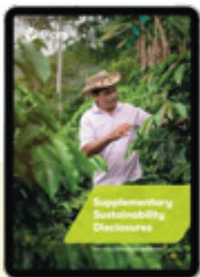  
Read our Supplementary Sustainability Disclosures on olamgroup.com/annual-reports/SSD

# Contents

# Strategic report

2 Overview  
4 Chairman's letter  
8 Group CEO's review  
14 Financial and performance highlights, and five-year summary  
18 Group CFO's review  
26 ofi  
44 Olam Agri  
61 Remaining Olam Group  
85 Sustainability  
97 Environment  
Social  
122 People and culture  
132 Response to the TCFD  
141 Preparations for adopting TNFD  
142 Risk management  
146 Multi-capital accounting (Integrated Impact statement)  
163 General information

# Governance report

166 Governance at a Glance  
168 Meet the Board  
173 Purposeful Governance  
182 Nomination and Remuneration Committee report  
187 Audit and Risk Committee report  
197 Sustainability Committee report  
200 Managing stakeholder relationships

# Financial report

206 Directors' statement  
211 Independent auditor's report  
215 Consolidated profit and loss account  
216 Consolidated statement of comprehensive income  
217 Balance sheet  
218 Statements of changes in equity  
221 Consolidated cash flow statement  
223 Notes to the Financial Statements  
287 Corporate information  
288 Shareholding information  
290 Notice of Annual General Meeting  
298 Addendum to the Annual Report 2024 Proxy form

# We focus on driving sustainable growth, building on our strengths to shape a more resilient and responsible future. We harness today's opportunities to create long-term value for both our business and the world around us.

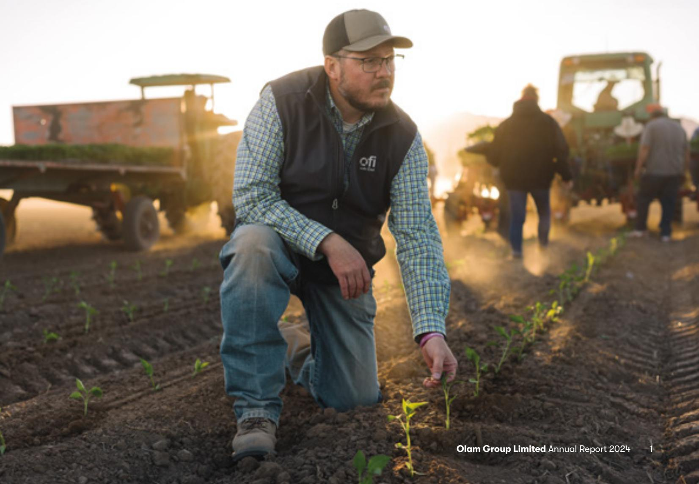

# Driving future value through transformation

# Olam Group at a glance

We grow, source, trade, process, manufacture and distribute food ingredients, feed and fibre including cocoa, coffee, wheat, rice, cotton and wood, alongside trading and risk management expertise, to customers around the globe. We work with a range of suppliers and customers, from large-scale farmers to smallholders, from food manufacturers to artisanal chefs, from packaged food producers to retailers, and from feed producers to cotton spinners. We deliver our products and services through our different businesses with the support of our employees.

1

make it real

ofi is partnering with customers to co-create solutions that anticipate and meet changing consumer preferences.

Our product platforms include:

Cocoa; coffee; dairy; nuts; and spices.

Read more on pages 26 to 43.

2

# Olam Agri

Olam Agri is transforming food, feed and fibre to cultivate a more sustainable future.

Our product platforms include:

Grains and oilseeds; wheat milling and pasta; rice; edible oils; specialty grains and seeds; integrated feed and protein; cotton; wood products; rubber; freight; sugar and bioenergy; and risk solutions.

Read more on pages 44 to 60.

3

# Remaining Olam Group

The Remaining Olam Group is responsible for nurturing and partially or fully monetising gestating businesses, and developing continuing businesses. It is also responsible for the divestment of non-core assets and businesses, incubating new sustainability and digital platforms for growth and providing IT, digital and shared services.

i

# Olam

Olam Global Holdco

leverages food, agriculture and emerging market expertise to develop businesses along the value chain.

Our businesses include:

Olam Palm Gabon; Olam Rubber

Gabon; Packaged Foods;

ARISE P&L; and Rusmolco.

Read more on pages 78 to 84.

ii

# MINDSPRINT

Mindsprint offers digital solutions to empower businesses to meet todaneeds and anticipatetomorrow's challenges.

Our services include:

Digital transformation; enterprise transformation; business process services; and cybersecurity and privacy services.

Read more on pages 74 to 77.

三

Nupo Ventures is

unleashing the potential of next-generation businesses to positively impact people and our planet.

Our ventures include:

Terrascope and Jiva.

Read more on pages 64 to 73.

# Re-organisation Plan

In January 2020, Olam Group announced a transformational Re-organisation Plan to split the company into three distinct and coherent operating groups that are Purpose-led and future-ready, in order to maximise Olam's long-term value on a sustained basis.

# January 2020

# Where it started

Re-segmented the current business into three distinct operating groups under Olam Group, that are Purpose-led, future-ready and long-term value maximising.

$\mathbb{O}$  Status: Completed

# March 2022

# Announcement of acquisition of strategic minority stake in Olam Agri by SALIC

Investment (completed in December 2022) by SALIC of US$1.29 billion for a 35.43% stake in Olam Agri. Olam Agri entered into Strategic Supply and Cooperation Agreement with SALIC.

# January 2022

# Separation and carve-out completed

Completion of the separation and carve-outs, leading to the creation of three new operating groups: offi, Olam Agri and Remaining Olam Group.

$\mathbb{O}$  Status:Completed

$\mathbb{O}$  Status: Completed

# February 2025

# Agreement to sell remaining stake in Olam Agri to SALIC

Status: Ongoing

Agreement to sell \(44.58\%\) stake in Olam Agri to SALIC for US\\(1.78 billion and the remaining \(19.99\%\) stake in Olam Agri to SALIC at the end of three years from completion of the sale of \(44.58\%\) stake.

The proposed transaction would unlock a highly attractive valuation for Olam Group, and clear the path to complete the Re-organisation by seeking strategic options to unlock value for the Remaining Olam Group businesses and ofi, including the pursuit of an ofi IPO.

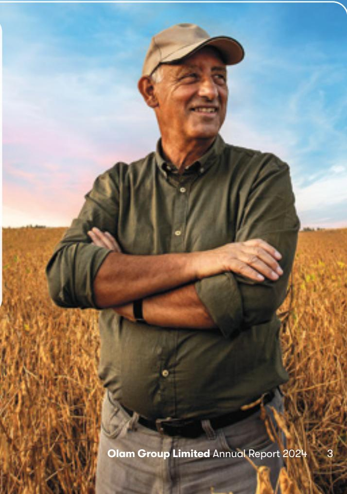

# Unlocking value, exploring new horizons

66 Resilience underpinned our financial performance during the year, amid these persisting challenges and market circumstances that were beyond our control. 99

Lim Ah Doo

Chairman, Non-Executive

8 Independent Director

The resolve of the food and agricultural sector was sternly tested – yet again – in 2024. Geopolitical tensions, market volatility and macroeconomic uncertainty continued to weigh on economic conditions and the wellbeing of communities across the world.

Olam Group was not spared from these challenges. Resilience, however, underpinned our financial performance during the year, amid these persisting challenges and market circumstances that were beyond our control.

ofi delivered double-digit EBIT growth of  $29.1\%$  and a higher EBIT on average invested capital ratio (EBIT/IC) of  $7.4\%$  (2023:  $7.1\%$ ) for the year, led by the increase in its Ingredients & Solutions segment. That it achieved this result even though prices for key commodities in its portfolio stayed stubbornly high across most of 2024, validates its focus on prioritising selective growth opportunities and maintaining discipline in working capital management, as it pivots towards a more customer-centric, solutions-focused business.

Olam Agri reported EBIT growth of  $5.8\%$  amid tough conditions – the high interest rate environment as well as many of its key markets facing high inflation, currency volatility and economic slowdown – which demonstrates its growth momentum and tenacity during such trying times.

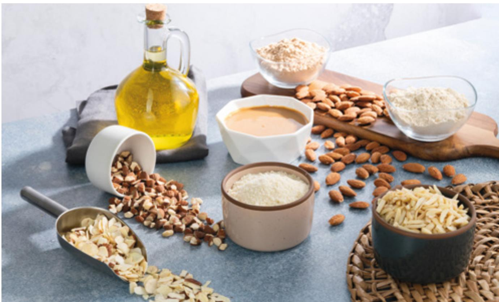  
Olam Group will now focus on seeking strategic options to unlock value for ofi, even as ofi continues in its drive towards growing its differentiated business

The Remaining Olam Group saw EBIT losses increase to S$158.7 million. Most of this was due to the non-cash foreign exchange revaluation losses on Euro-denominated shareholder loans made to Olam Palm Gabon, which offset growth from some of its other businesses.

While the two key operating groups bolstered the growth in Group EBIT to S\(1.9 billion or \(9.2\%\) higher year-on-year, PATMI declined \(69.0\%\) to S\)86.4 million as EBIT growth was offset by sharply higher net finance costs and one-off exceptional losses, mainly from off's decisions to close its onion and parsley processing plant temporarily and exit from two non-core almond orchards in the U.S.A., as well as Olam Agri's closure of the Funds Management business. Core net profit or Operational PATMI also decreased by \(52.8\%\) to S\)216.3 million.

Notwithstanding a disappointing bottom line, with the overall Group EBIT growth in consideration, the Board has recommended a second and final dividend of 3.0 cents per share, taking total dividends to 6.0 cents per share for 2024 (2023: 7.0 cents).

# A transformative Re-organisation milestone

In December 2022, Olam Group sold a  $35.43\%$  stake in Olam Agri to the Saudi Agriculture & Livestock Investment Company (SALIC), at the then implied  $100\%$  equity valuation of US\ $3.5 billion. The Board is pleased to propose the sale of our remaining \(64.57\%$  stake in Olam Agri to SALIC at a higher implied  $100\%$  equity valuation of US\\)4.0 billion.

The sale will happen in two tranches – a  $44.58\%$  stake for approximately US$1.78 billion (S$2.35 billion; not including closing adjustments); and the residual  $19.99\%$  stake through an irrevocable put option three years from the conclusion of the first tranche.

The deal has been structured such that the put option consideration is based on a pre-agreed valuation, which is effectively the equity base valuation and closing adjustments, plus a  $6\%$  IRR up until it is exercised, to ensure certainty of the value of proceeds to Olam Group for all of its remaining stake in Olam Agri.

Olam Group would raise estimated total gross cash proceeds of US$2.58 billion (S$3.41 billion) from the sale of the entire 64.57% interest. The Board will take into consideration various factors, including the level of the Group's future earnings, cash flows, capital requirements for maintenance and growth, other financial and general business conditions, and will optimise the use of the proceeds, which may include debt repayment, right-sizing the capital structure of Olam Group and of, as well as providing a possible one-time special dividend distribution. We will share more as we get closer to completion.

The completion of the first tranche of the sale to SALIC is subject to, among other conditions, the approval of Olam Group shareholders at an Extraordinary General Meeting to be convened later this year, and regulatory approvals in the relevant jurisdictions across the world. While the timing of the sale completion is not yet clear, we expect this to take place in Q4 2025.

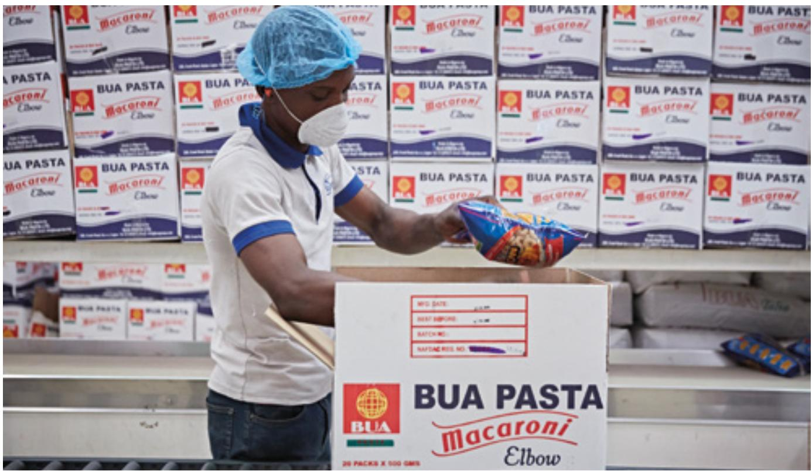  
Olam Agri's pasta manufacturing and packing, Nigeria: Olam Agri reported EBIT growth of  $5.8\%$  in tough conditions, demonstrating tenacity and growth momentum

# Choosing the right paths to value creation

Since our Re-organisation began in 2020, we have met with new realities – both challenges and opportunities – at each turn during this five-year journey, which have impacted the execution of our Re-organisation Plan. But we have always been clear that the end goal is to unlock value, regardless of which pathway we choose.

The Board is supportive of the proposed sale of Olam Agri to SALIC, not only because the offer from SALIC is made at a  $14\%$  premium to its initial investment in 2022 and is  $23\%$  higher than Olam's market capitalisation (at the time of the announcement). The original plan was to spin off Olam Agri via a concurrent dual listing and demerger; however, the Board is of the view that, having considered all internal and external factors that would affect the outcome of a proposed Olam Agri IPO, including prevailing capital markets and the need to obtain all necessary regulatory approvals, it remains uncertain as to whether and when the proposed IPO can be launched successfully. The proposed sale to SALIC therefore represents the best strategic option today to lock in the value for Olam Group and its shareholders, thereby creating a clear pathway towards completing the Re-organisation.

Olam Group continues to hold a  $100\%$  interest in ofi and the Remaining Olam Group. We will now focus on seeking strategic options to unlock value for ofi and the Remaining Olam Group businesses, even as ofi continues in its drive towards growing its differentiated business. We are committed to creating further value through these two operating groups.

As we had announced at this transaction, upon Olam Agri ceasing to be a subsidiary of the Group, Mr Sunny George Verghese will step down as Group CEO and Executive Director of the Company but will stay on as Non-Executive Director on the Board. The Board will refresh the leadership team of Olam Group at an appropriate time in the future.

Since our Re-organisation began in 2020, we have always been clear that the end goal is to unlock value, regardless of which pathway we choose.

# Appreciation

I wish to acknowledge the Board's unwavering commitment to guiding the Group on the best path forward. I welcome Mr Tran Phuoc (Lucas), who joined us as a Non-Executive and Independent Director of the Company in July 2024. Lucas Tran will take over as Chair of the Audit and Risk Committee from Mr Yap Chee Keong at the close of the Fourth Annual General Meeting in April this year. Chee Keong will be appointed as Non-Independent and Non-Executive Deputy Chairman at the end of this AGM. Ms Marie Elaine Teo will complete her tenure on the Board and step down at the close of the same AGM. I thank Elaine for her longstanding service and significant contribution to the Group.

I would like to express my sincere appreciation to everyone who has contributed to our success – particularly the internal teams in Olam Agri and external advisers who worked tirelessly to reach the agreement with SALIC.

To our shareholders who have remained steadfast and committed to supporting Olam, and various stakeholders – customers, suppliers, lenders and communities – I am grateful for your continued trust and patience.

To our executive team and employees, rest assured your dedication and hard work amid what are truly unprecedented times for our sector has not gone unnoticed. We share your commitment to the success of Olam, and will work alongside you to catalyse positive change for us and those around us.

# Lim Ah Doo

Chairman, Non-Executive & Independent Director

  
Collaboration among teams in Olam Agri, Nigeria: The Group achieved a valuation uplift for the proposed sale of its remaining stake to SALIC

# Maintaining our growth momentum and unlocking value

I am proud that we have demonstrated resilience and agility to navigate these market changes. It is testament to the differentiated business models of our operating groups and the contributions of our employees to meet our customers' and stakeholders' needs.

Sunny Verghese

Executive Director,

Co-Founder & Group CEO

We are pleased to have maintained our growth momentum in 2024 and to have achieved a significant milestone in our Re-organisation Plan. In line with recent previous years, 2024 presented both recurring and unique challenges.

The continued conflicts in Ukraine and the Middle East, concerns over tariffs and their impact on international trade and supply chains were very much to the fore, while high interest rates were sustained and some commodity prices rose sharply.

It remains to be seen how the current and ongoing conflicts in Ukraine and the Middle East, U.S.A. trade policy, U.S.A. and China trade relations, and sluggish growth in China amid uncertainty around inflation, may influence and impact global business and trade in the near-to-mid term. These geopolitical and macroeconomic issues do have an inevitable impact on food security and supply.

Climate change presents a serious challenge to agricultural productivity and yields, which calls for greater sustainability, flexibility and innovation in the global food system. As our planet's population continues to rise and demand for protein-rich foods increase, open trade will be ever more critical. Producing and moving food to where it is needed more efficiently and sustainably will be increasingly important.

Our differentiated approach, unique positioning, capabilities and competitive strengths underline the role we can play to meet the challenges facing our global food system, and longer-term issues facing global food and agriculture.

# Advancing our strategies for growth

We delivered EBIT growth in 2024 even as we navigated elevated prices of some commodities due to supply challenges, volatile macroeconomic and market conditions, and sustained high interest rates. ofi and Olam Agri both reported strong growth for the year, as their respective differentiated business models continue to enable them to position themselves to best meet demand and to capitalise on market opportunities.

Sales volumes saw double-digit growth, led by higher volumes from Olam Agri and operating cash flow (before interest, tax and working capital changes) improved. However, we experienced a significant rise in working capital due to unprecedented sharp rises in commodities such as cocoa and coffee, as well as higher rice inventory and edible oil prices at year end. We incurred exceptional losses on one-off charges related to ofi's spices and almonds businesses in the U.S.A., the closure of the Funds Management business, and ongoing Re-organisation expenses.

Following the launch of a share buyback programme for up to a maximum of  $5.0\%$  of total outstanding shares, the Group bought back 25.1 million shares, equivalent to  $\$ 28.5$  million, during the year.

The operating groups continued to invest in organic and inorganic opportunities to expand and strengthen their capabilities to drive growth. ofi commissioned a new private label nuts facility in Arizona, and opened a new and expanded North American headquarters and Customer Solutions Centre (CSC) in Chicago. A further centre was opened in Shanghai to leverage the expertise of ofi's Asia Regional CSC in Singapore and its broader innovation network. ofi also launched a new dedicated product platform, Food & Beverage Solutions (F&B Solutions), to combine its application and category capabilities to meet customer requirements.

  
ofi's Customer Solutions Centre (CSC) in Singapore

Olam Agri completed the acquisition of Avisen, the second largest poultry feed producer in Senegal, to continue to strengthen and expand its animal feed and protein capabilities. Other key investments in food and feed included completion of the construction of a soy crushing plant in Nigeria, and commencement of a pasta production facility and expansion of wheat flour capacity in Ghana. Further investments in the fibre segment included improved cotton ginning capacity in Côte d'lvoire, the expansion of saw milling in the Republic of Congo and the commissioning of new rubber processing capabilities in Côte d'lvoire. Building on the sugar milling assets transferred from the Remaining Olam Group in 2023, Olam Agri is expanding sugar crushing capacity and building a multi-input bioenergy production plant in India. In 2024, the edible oil processing business in Mozambique held under the Remaining Olam Group was transferred to Olam Agri.

As we continue to make progress on our performance, we were proud to be included again in the Fortune Global 500 list of companies for the fourth consecutive year, and to maintain our listing in the FTSE4Good Index Series.

Looking ahead, our operating groups remain well-positioned to meet customer needs and evolving market demand. The focus for each operating group and its businesses will be on executing strategy and driving operational efficiency, as we seek to unlock and realise value for shareholders.

# Executing our Re-organisation Plan

Since we commenced our Re-organisation Plan, we have continued to strive to enable each of our operating groups to carve its respective strategy for growth and to enable us to unlock value for our shareholders.

The announcement in February 2025 that Olam Group has agreed to sell  $44.58\%$  in Olam Agri to the Saudi Agricultural and Livestock Investment Company (SALIC) for approximately S $\$ 2.35$  billion (US $\$ 1.78$  billion) is a transformative step forward in our Re-organisation Plan. This includes an agreement for Olam Group to sell its remaining  $19.99\%$  stake in Olam Agri to SALIC at the end of the three years from completion of the sale at the closing valuation plus  $6\%$  IRR.

The  $100\%$  implied valuation for Olam Agri of US $\$ 4.0$ billion, reflects a  $14 \%$ premium to the US $\$ 3.50$  billion valuation based on SALIC’s acquisition of a  $35.43 \%$ stake in Olam Agri in December 2022. It is  $23 \%$ higher than Olam Group’s market capitalisation of US $\$ 3.25$  billion (at the time of the announcement), and also represents a  $3.47 \times$ price- to- book value multiple to Olam Agri’s book value of US $\$ 1.15$ billion as of 31 December 2023.

Since SALIC's investment in Olam Agri in 2022, the partnership has unveiled new avenues of growth and sources of potential synergy. With its strategic mandate in respect of food security and complementary strengths, SALIC and Olam Agri share the same focus on sustainable sourcing and commitment to meet the rising demand for food, feed and fibre.

It would also raise significant cash proceeds that may be used to right-size Olam Group's and off's capital structure, as well as the provision of a possible one-time special dividend.

Completion of the sale is conditional upon shareholders approval and other customary closing conditions, including regulatory approvals. Subject to these conditions being fulfilled, the transaction is expected to complete in Q4 2025.

66 This transaction clears the path for the Group to proceed with our Re-organisation plan, seeking strategic options to unlock value for the Remaining Olam Group businesses and ofi, including the pursuit of an ofi IPO. 99

# Undiminished sustainability commitment

Our focus on safeguarding our natural environment, people and communities remains undiminished. Our Purpose-driven approach is central to conducting our business in an ethical, socially responsible and environmentally sustainable way, and to maintaining the trust of our stakeholders.

Each of our operating groups is committed to taking action in line with its respective strategy to make a positive impact to regenerate the living world, tackle climate change, strengthen prosperity, improve livelihoods, and increase the transparency and resilience of our supply chains.

In 2024, ofi launched its sustainability strategy Choices for Change, which sets out its ambitions and defines aims for working with farmers, customers and partners. Olam Agri maintained its strategic focus on progressing initiatives around regenerative agriculture, climate transition, and nutrition. In January 2025, Olam Agri signed a Memorandum of Understanding (MoU) with the German development agency Deutsche Gesellschaft für Internationale Zusammenarbeit (GIZ) GmbH to scale up sustainable development in the global agri-food sector.

We recognise our responsibility to reduce our environmental impact and promoting best practices in our supply chains. This year, we have developed and refined our decarbonisation plans to address climate risks in our supply chains, as well as to facilitate climate change adaptation. In our operations, we are moving towards greater renewable energy sources, switching to green grid electricity alongside measures to improve energy efficiency, conservation and innovation.

Our longstanding approach to sustainable sourcing, traceability and monitoring in our supply chains means we are already well-placed to meet the obligations of the EU Deforestation Regulation (EUDR) ahead of it coming into force at the end of 2025. ofi's cocoa and coffee operations, and Olam Agri's wood and rubber businesses, are providing traceable chain-of-custody information, deploying technologies and field assessments to map, monitor and provide detailed information to customers. With Olam being a signatory to the COP26 Agriculture Sector Roadmap to  $1.5^{\circ}\mathrm{C}$ , Olam Agri and ofi are also actively engaged in the roadmaps for soy, palm and cocoa, to drive the impact at scale to achieve the long-term, sustainable change needed.

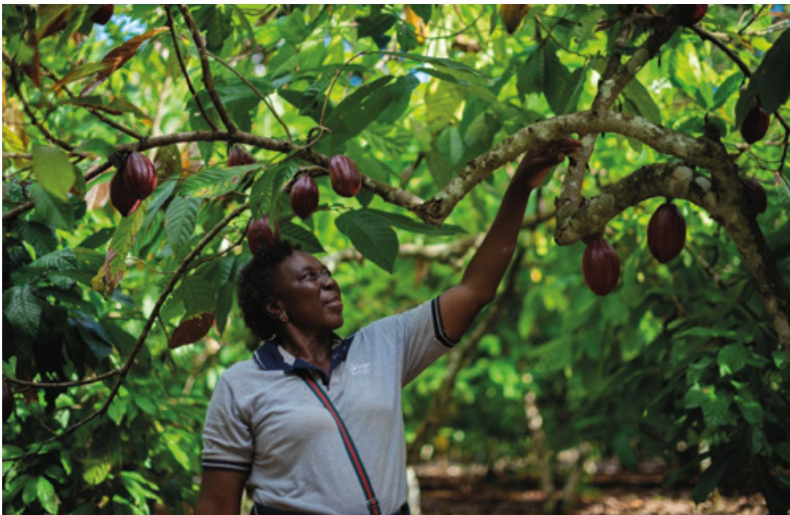  
Cleaning cocoa tree trunks and checking tree health, Cameroon

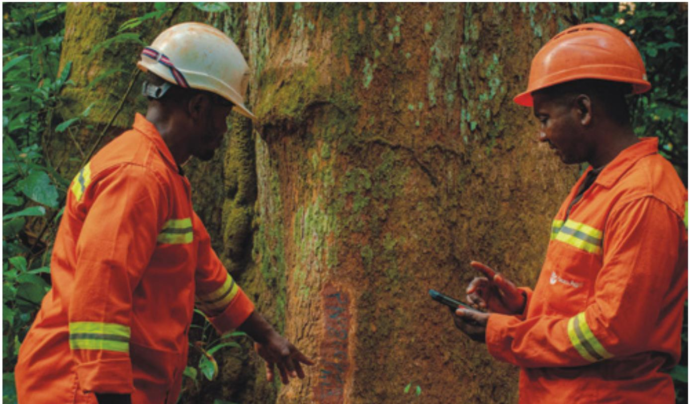  
Botanists evaluate and record each tree's potential quality and diameter, Republic of Congo

Our business depends on farmers, both large and small, having a chance to prosper. Our shared living income calculator, the Living Income Gap Heuristic Tool (LIGHT), is enabling us to gain insights into farmer household incomes across our supply chains. From this understanding, we are developing ways to reduce living income gaps and to improve farmer household incomes. ofi aims to reach 200,000, and Olam Agri a further 500,000, farmer households by 2030.

As a leader in food and agriculture, global food security and improving access to affordable nutrition is at the forefront of our business. Olam Agri continues to develop and provide fortified foods which are a low-cost, high-impact solution to addressing micronutrient deficiencies. In addition, ofi was shortlisted in 2024 for the edie Social Sustainability Project of the Year Award for its use of the Infant Malnutrition System Alert (IMSA), a smartphone-based app that geolocates cases of malnutrition in Côte d'lvoire, where one in five children experience stunted growth and development.

Driving meaningful, long-term positive impact is not possible alone. We will continue to engage and collaborate with industry, customers, farmers, governments, communities, NGOs and civil society to tackle these social, environmental and economic challenges.

# Developing our talent

Our large workforce brings with it a responsibility to ensure the wellbeing, safety and health of all our people. We are committed to fostering a safe and inclusive workplace where employees feel valued, supported, engaged and are able to grow professionally and personally.

Each of our businesses continues to forge its own distinctive culture. Creating a culture of inclusion begins with our leaders, and through the year both ofi and Olam Agri held leadership sessions to further embed greater understanding of their respective Purpose, values and behaviours.

In line with our business priorities, we strengthened our focus on learning and development to enhance capabilities and our talent and leadership pipeline.

We are proud to continue to be seen as an employer of choice and are committed to empowering our employees to thrive both professionally and personally. We are honoured that Olam Agri was recognised again as a Top Employer for the fifth consecutive year, and in 2024 achieved this recognition in ten countries across Africa, Europe, Asia and Australia.

We continue to strengthen our focus on working to embed and achieve a zero-incident culture across all our businesses, as well as increasing awareness and offering support around health and wellbeing.

My sincere thanks to every employee for their commitment, dedication and hard work. In each operating group, our employees are the driving force to deliver strategies that are reshaping and differentiating their businesses to lead in a global marketplace.

66 Our employees are central to our success, and we continue to strive to attract and retain top talent that aligns with our strategic goals and growth ambitions. 99

To our shareholders, thank you for your continued trust and confidence. The proposed sale of Olam Agri to SALIC is a transformative step in our Re-organisation journey that unlocks significant value, and this will allow us to focus on further unlocking value for the Remaining Olam Group businesses and to pursue an IPO for ofi.

To my fellow Board members, I am grateful for your guidance, counsel and passion which continue to steer the Company towards greater success and ambition.

Olam has developed and grown multiple businesses that have become leaders in their sectors, driving and delivering innovation and impact for customers, farmers and communities. This year has seen solid progress in our performance and has marked the achievement of a significant milestone in our Re-organisation Plan, and I am proud that we can look to the future with confidence.

# Sunny Verghese

Executive Director, Co-Founder & Group CEO

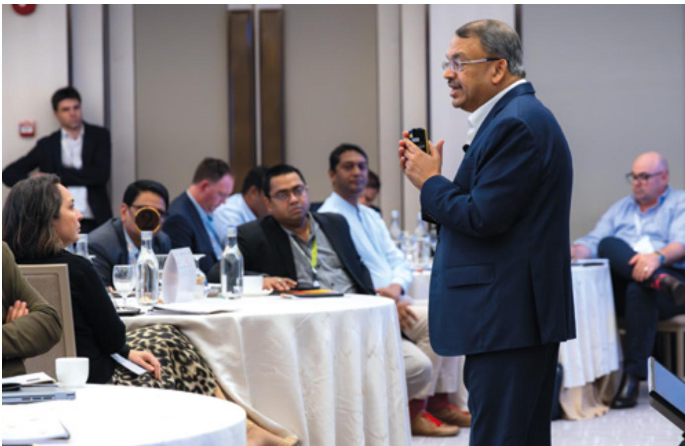  
October 2024 cohort of Olam Agri's Building Winning Business Models training, Singapore

# Financial and performance highlights

  
Volume  
(000 metric tonnes)  
+12.5%

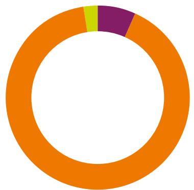

<table><tr><td>● ofi</td><td>6.8%</td></tr><tr><td>● Olam Agri</td><td>90.9%</td></tr><tr><td>● Remaining Olam Group</td><td>2.3%</td></tr></table>

  
Revenue*  
(S$ million)  
+16.3%

<table><tr><td>ofi</td><td>38.9%</td></tr><tr><td>Olam Agri</td><td>59.1%</td></tr><tr><td>Remaining Olam Group</td><td>2.0%</td></tr></table>

  
EBIT*  
(S$ million)  
+9.2%

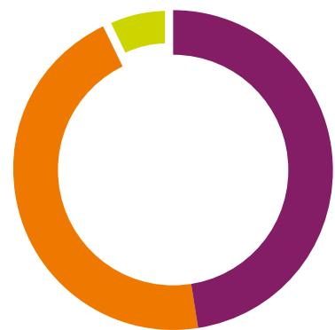

<table><tr><td>● offi</td><td>55.3%</td></tr><tr><td>● Olam Agri</td><td>52.9%</td></tr><tr><td>● Remaining Olam Group</td><td>(8.2%)</td></tr></table>

  
Invested capital  
(S$ million)  
+34.4%

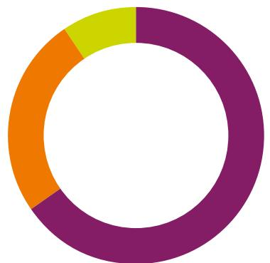

<table><tr><td>● offi</td><td>65.4%</td></tr><tr><td>● Olam Agri</td><td>25.3%</td></tr><tr><td>● Remaining Olam Group</td><td>9.3%</td></tr></table>

  
Group sales revenue by region*  
(S$ million)

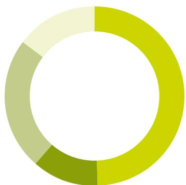  
Asia, Middle East & Australia 49.6%

<table><tr><td>Africa</td><td>12.0%</td></tr><tr><td>Europe</td><td>23.8%</td></tr></table>

<table><tr><td>Americas</td><td>14.6%</td></tr><tr><td>Europe</td><td>10.1%</td></tr><tr><td>Asia-Pacific</td><td>10.1%</td></tr></table>

  
Group sourcing volume by region  
('000 metric tonnes)

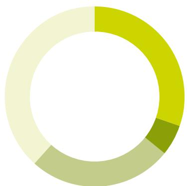  
Asia, Middle East & Australia 30.5%

<table><tr><td>Africa</td><td>5.5%</td></tr><tr><td>Europe</td><td>25.7%</td></tr><tr><td>Americas</td><td>38.3%</td></tr></table>

# Financial highlights

# For the 12 months ended 31 December

(S$ million)

<table><tr><td></td><td>2024</td><td>2023</td><td>% Change</td></tr><tr><td>Profit and Loss Statement</td><td></td><td></td><td></td></tr><tr><td>Sales Volume (&#x27;000 Metric Tonnes)</td><td>49,596.6</td><td>44,097.4</td><td>12.5</td></tr><tr><td>Sales Revenue *</td><td>56,157.1</td><td>48,272.0</td><td>16.3</td></tr><tr><td>Earnings Before Interest and Tax *</td><td>1,935.8</td><td>1,771.9</td><td>9.2</td></tr><tr><td>Adjusted Earnings Before Interest and Tax ^</td><td>1,989.0</td><td>1,825.5</td><td>9.0</td></tr><tr><td>Profit Before Tax</td><td>201.5</td><td>410.9</td><td>(51.0)</td></tr><tr><td>Profit After Tax and Minority Interest</td><td>86.4</td><td>278.7</td><td>(69.0)</td></tr><tr><td>Operational Profit After Tax and Minority Interest *</td><td>216.3</td><td>458.1</td><td>(52.8)</td></tr><tr><td>Per Share</td><td></td><td></td><td></td></tr><tr><td>Earnings Per Share basic (cents)</td><td>1.4</td><td>6.5</td><td>(78.5)</td></tr><tr><td>Operational Earnings Per Share basic (cents) *</td><td>4.9</td><td>11.2</td><td>(56.3)</td></tr><tr><td>Net Asset Value Per Share (cents)</td><td>182.4</td><td>190.7</td><td>(4.4)</td></tr><tr><td>Net Dividend Per Share (cents)</td><td>6.0</td><td>7.0</td><td>(14.3)</td></tr><tr><td>Balance Sheet</td><td></td><td></td><td></td></tr><tr><td>Total Assets</td><td>45,225.7</td><td>33,348.6</td><td>35.6</td></tr><tr><td>Total Invested Capital</td><td>26,553.1</td><td>19,750.1</td><td>34.4</td></tr><tr><td>Total Debt</td><td>23,094.8</td><td>16,293.8</td><td>41.7</td></tr><tr><td>Cash and Short-term Deposits</td><td>3,329.7</td><td>3,581.6</td><td>(7.0)</td></tr><tr><td>Shareholders&#x27; Equity</td><td>7,009.9</td><td>7,327.4</td><td>(4.3)</td></tr><tr><td>Cash Flow</td><td></td><td></td><td></td></tr><tr><td>Operating Cash Flow Before Interest and Tax</td><td>2,528.6</td><td>2,255.7</td><td>12.1</td></tr><tr><td>Net Operating Cash Flow After Changes in Working Capital and Tax</td><td>(3,544.8)</td><td>1,030.9</td><td>N.M</td></tr><tr><td>Free Cash Flow to Firm</td><td>(4,389.7)</td><td>215.4</td><td>N.M</td></tr><tr><td>Free Cash Flow to Equity</td><td>(5,937.0)</td><td>(914.8)</td><td>(549.0)</td></tr><tr><td>Ratios</td><td></td><td></td><td></td></tr><tr><td>Net Debt to Equity (times) **</td><td>2.79</td><td>1.73</td><td>1.06</td></tr><tr><td>Net Debt to Equity (times) adjusted for liquid assets **</td><td>0.68</td><td>0.65</td><td>0.03</td></tr><tr><td>Return on Beginning-of-period Equity ( % ^^</td><td>0.8</td><td>3.5</td><td>(2.7)</td></tr><tr><td>Return on Average Equity ( % ^^</td><td>0.8</td><td>3.6</td><td>(2.8)</td></tr><tr><td>Return on Invested Capital ( %</td><td>5.2</td><td>6.1</td><td>(0.9)</td></tr><tr><td>EBIT on Average Invested Capital ( %</td><td>8.4</td><td>9.1</td><td>(0.7)</td></tr><tr><td>Interest Coverage (times) #</td><td>1.1</td><td>1.3</td><td>(0.2)</td></tr></table>

* Excludes exceptional items  
^ Excludes exceptional items and amortisation of acquired intangibles  
** Before Fair Value Adjustment Reserves  
Profit Before Tax plus gross finance costs divided by gross finance costs  
^{\wedge} $^{\wedge}$  Excludes impact of capital securities distribution on net income and capital securities on equity

# Five-year financial summary

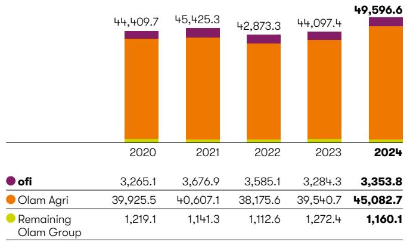  
Sales volume*  
('000 metric tonnes)

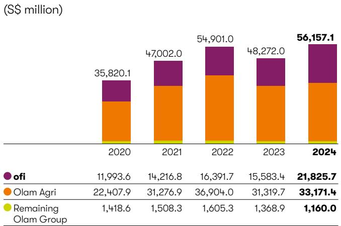  
Sales revenue\*

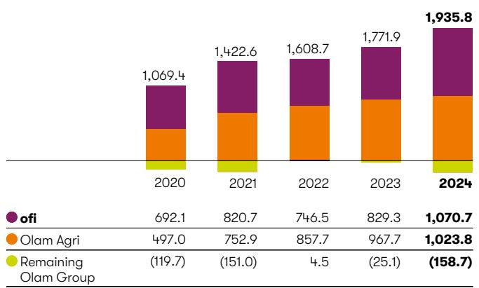  
Earnings Before Interest and Tax\*A  
(S$ million)

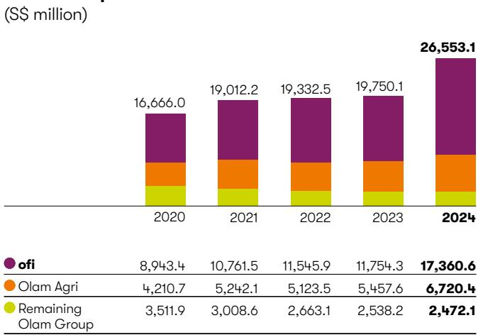  
Invested capital*

Profit after tax and minority interest  
(S$ million)  
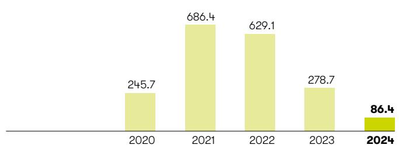  
* 2020 and 2021 financial results for operating groups have been restated to reflect intra-group adjustments  
^ Excludes exceptional items

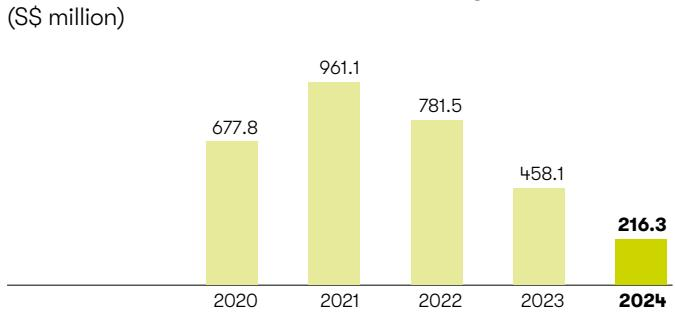  
Operational profit after tax and minority interest

Earnings per share (cents)  
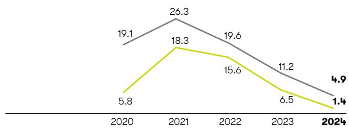  
Earnings per share  
$\bullet$  Operational Earnings per share

Return on equity $^{\wedge\wedge}$  (%)  
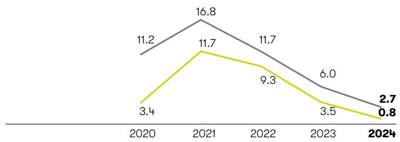  
Return on Beginning-of-Period Equity  
$\bullet$  Return on Beginning-of-Period Equity excluding exceptional items

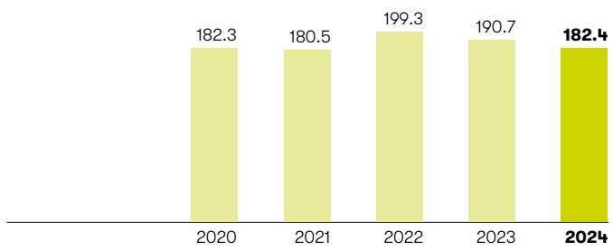  
Net asset value per share (cents)

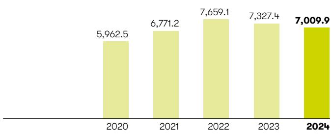  
Shareholders' equity (S$ million)

Number of customers  
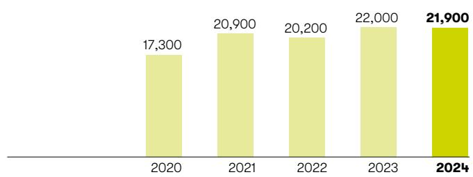  
^{\wedge \wedge} Excludes impact of capital securities distribution on net income and capital securities on equity

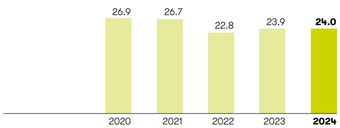  
Top 25 customers' share of total sales revenue (%)

# Resilient growth amid continued turbulence

Our capital expenditure remained steady throughout 2024 and we have been disciplined in prioritising the use of our working capital towards businesses that can generate better returns in this environment where interest rates had remained elevated. We will continue to stay prudent and be highly selective in our investment choices, while pruning less profitable businesses. 99

N Muthukumar

Group Chief Financial Officer

# Performance highlights

Volume

49.6 m MT

+12.5%

Operational

PATMI

S$216.3 m

(52.8%)

Revenue

S$56.2 bn

+16.3%

Invested

Capital

S$26.6 bn

+34.4%

EBIT

S$1.9 bn

+9.2%

Gearing

2.79x

from 1.73x

PATMI

S$86.4 m

(69.0%)

Free Cash Flow

to Equity

S\$(5.9) bn

S$(5.0) bn

<table><tr><td>$ million</td><td>2024</td><td>2023</td><td>% Change</td></tr><tr><td>Volume (‘000 MT)</td><td>49,596.6</td><td>44,097.4</td><td>12.5</td></tr><tr><td>Revenue*</td><td>56,157.1</td><td>48,272.0</td><td>16.3</td></tr><tr><td>EBITDA*</td><td>2,691.4</td><td>2,492.8</td><td>8.0</td></tr><tr><td>EBIT*</td><td>1,935.8</td><td>1,771.9</td><td>9.2</td></tr><tr><td>Adjusted EBIT^</td><td>1,989.0</td><td>1,825.5</td><td>9.0</td></tr><tr><td>Net finance costs*</td><td>(1,575.8)</td><td>(1,130.1)</td><td>39.4</td></tr><tr><td>Taxation*</td><td>(101.8)</td><td>(111.4)</td><td>(8.6)</td></tr><tr><td>Exceptional items</td><td>(129.9)</td><td>(179.4)</td><td>n.m.</td></tr><tr><td>PAT</td><td>128.3</td><td>351.0</td><td>(63.4)</td></tr><tr><td>PATMI</td><td>86.4</td><td>278.7</td><td>(69.0)</td></tr><tr><td>Operational PATMI*</td><td>216.3</td><td>458.1</td><td>(52.8)</td></tr></table>

* Excludes exceptional items  
$\wedge$  Excludes exceptional items and amortisation of acquired intangibles

During the year under review, we recorded sales volume of 49.6 million metric tonnes (MT), a  $12.5\%$  increase compared to 2023. Revenue grew by  $16.3\%$  to S\ $56.2 billion, primarily driven by unprecedented highs in certain commodity prices, notably coffee and cocoa. Even as revenue is a function of commodity market prices apart from volumes, it nevertheless reflects the size and scale of the Group that we exceeded the S\$ 50 billion mark again since 2022.

Operating profit, or EBIT, which is the key earnings metric that we track and report, grew \(9.2\%\) to S\\(1.9 billion on growth from two of our three operating groups: ofi and Olam Agri. ofi delivered double-digit \(29.1\%\) EBIT growth to S\\)1,070.7 million (2023: S\\(829.3 million), led by its Ingredients & Solutions segment. Olam Agri achieved an EBIT of S\\)1,023.8 million, \(5.8\%\) higher than the S\\)967.7 million a year ago, driven by a \(32.2\%\) growth in its Fibre, Agri-industrials & Ag Services segment. The Remaining Olam Group reported higher losses of S\\)158.7 million (2023: -S\\)25.1 million).

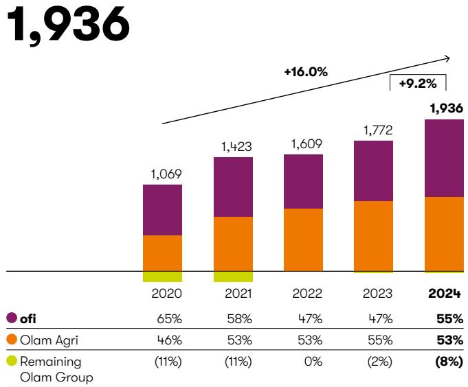  
Group Earnings Before Interest and Tax (S$ million)

PATMI declined to S\(86.4 million for the year (2023: S\)278.7 million) as EBIT growth was offset by a significant increase in net finance costs of S\)445.7 million as well as the impact from exceptional losses of S$129.9 million from one-off charges relating to ofi's spices and almonds businesses in the U.S.A., the closure of our Funds Management business, and ongoing Re-organisation expenses.

<table><tr><td>$ million</td><td>2024</td><td>2023</td></tr><tr><td>Re-organisation cost</td><td>(21.6)</td><td>(62.9)</td></tr><tr><td>U.S.A. spices one-off charges</td><td>(30.8)</td><td>-</td></tr><tr><td>U.S.A. almonds one-off charges</td><td>(61.0)</td><td>-</td></tr><tr><td>Funds Management business 
closure</td><td>(16.5)</td><td>-</td></tr><tr><td>Australia almond lower crop yield</td><td>-</td><td>(116.5)</td></tr><tr><td>Exceptional Items</td><td>(129.9)</td><td>(179.4)</td></tr></table>

Excluding exceptional losses, the Group's underlying profit or Operational PATMI was S\ $216.3 million (2023: S\$ 458.1 million), leading to operational earnings per share at 4.9 cents (2023: 11.2 cents) and our return on equity on Operational PATMI basis at  $2.7\%$  (2023:  $6.0\%$ ).

Invested capital grew to S$26.6 billion (2023: S$19.8 billion) from significant investments in working capital mainly due to persistently high commodity prices, notably for cocoa and coffee, as well as from higher rice inventory and edible oil prices towards the end of the year. Amid the higher working capital deployed, our EBIT over average invested capital or pre-tax ROIC, a key operational metric that we track and report, was 70 basis points lower at 8.4%, from 9.1% in the previous year.

(S$ million)

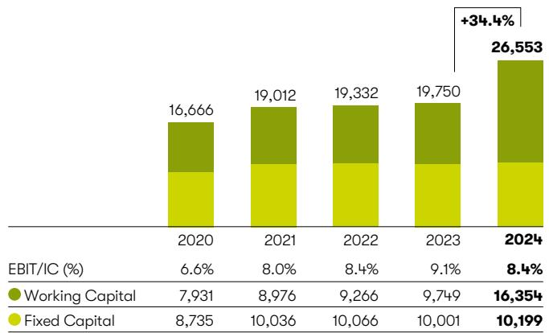  
Invested capital  
26,553

# Strategic investments and divestments

I am pleased to report that our operating groups continued to capture opportunities and executed their strategy during 2024 from their differentiated, unique business propositions post Re-organisation.

ofi commissioned a private label nuts facility in Phoenix in the U.S.A. It also opened a Customer Solutions Centre in Shanghai, China. The ofi team also inaugurated a new and expanded North American headquarters and Customer Solutions Centre in Chicago. This brings the number of ofi Customer Solutions Centre worldwide to five, alongside facilities in Amsterdam, Singapore and Bangalore.

For Olam Agri, it completed the acquisition of Avisen SARL in March 2024 for approximately US$22 million, which aligns with its strategy to strengthen and expand its animal feed and protein capabilities, and extends the company's feed and protein presence in West Africa.

Building on the sugar milling assets acquired from the Remaining Olam Group in 2023, Olam Agri is expanding its sugar crushing capacity and constructing a multi-input bioenergy production plant in India. It is also developing a pasta production facility and expanding its wheat flour production capacity in Ghana to capitalise on the growing demand in the country and broader region for high-quality food products.

Other key investments for Olam Agri in 2024 included setting up a soy crushing plant in Nigeria, integrated cotton ginning capacity in Côte d'lvoire, saw milling in the Republic of Congo and rubber processing in Côte d'lvoire.

At the Group level, we launched a share buyback programme for up to a maximum of  $5.0\%$  of total outstanding shares within the mandate approved by shareholders in April 2023 and renewed in April 2024. During the year, the Group bought back 25.1 million shares equivalent to S\ $28.5 million. The Group also transferred the edible oil processing business in Mozambique, Fasorel, held under the Remaining Olam Group, to Olam Agri at a price consideration of US\$ 18.7 million.

Post 2024, on February 2025, Olam Group Limited (OGL) through its wholly owned subsidiaries entered into a definitive agreement for the sale of a \(44.58\%\) stake in Olam Agri to SALIC² (Tranche 1) for a base consideration of approximately US\(1.78 billion. This implies a \(100\%\) equity valuation for Olam Agri of US\)4.0 billion. On completion of the sale of Tranche 1, the Group would realise an estimated gain on disposal of US\)1.84 billion (S$2.43 billion) which will accrete to its equity reserves.

1. Return on Invested Capital  
2. Saudi Agricultural and Livestock Investment Co

OGL will, upon the completion of the sale of Tranche 1, have a put option to sell its residual  $19.99\%$  stake in Olam Agri to SALIC (Tranche 2) on the third anniversary of the completion of Tranche 1 at the Closing Valuation (see valuation table) plus a  $6\%$  IRR.1 SALIC will, upon the completion of Tranche 1, have a call option to acquire the remaining  $19.99\%$  stake in Olam Agri on or before the third anniversary of the completion of Tranche 1 at the same consideration.

OGL would raise estimated total gross proceeds of US$2.58 billion (S$3.41 billion) from the sale of Tranche 1 and Tranche 2. Post the completion of the sale of Tranche 2, Olam Agri will be a 100%-owned subsidiary of SALIC.

The proposed sale of our remaining  $64.57\%$  stake in Olam Agri is a transformative deal, illuminating significant value for Olam Group and its shareholders. The divestment of a  $100\%$  interest in Olam Agri at the end of Tranche 2, including the initial sale of  $35.43\%$  stake in 2022, would raise total gross proceeds of US\ $3.87 billion (S\$ 5.11 billion), accreting a total gain of US\\)2.72 billion (S\\(3.59 billion) to the equity reserves of the Group.

Tranches 1 and 2 valuation table  

<table><tr><td></td><td>Tranche 1</td><td>Tranche 2</td></tr><tr><td>100% Equity valuation</td><td>US$4,000,000,000</td><td>US$4,000,000,000</td></tr><tr><td>% To be acquired</td><td>44.58%</td><td>19.99%</td></tr><tr><td>A) Base valuation</td><td>US$1,783,200,000</td><td>US$799,600,000</td></tr><tr><td>Daily amount</td><td>US$439,693</td><td>US$197,162</td></tr><tr><td>B) Closing valuation</td><td>Base valuation + daily amount from 1 June 2025 to closing</td><td>Base valuation + daily amount from 1 June 2025 to closing</td></tr><tr><td>IRR</td><td>-</td><td>6.0%</td></tr><tr><td>C) Final valuation</td><td>-</td><td>Closing valuation + IRR from closing to exercise of put/call option</td></tr></table>

# Balance sheet analysis

As at end-2024, the Group's total assets1 stood at S$30.4 billion, comprising S$9.5 billion of fixed capital, S$905.0 million of right-of-use assets, S$17.9 billion of working capital and S$3.3 billion of cash.

The total assets were funded by S $7.1 billion of equity, S$ 9.8 billion of short-term debt, S$12.2 billion of long-term debt, as well as short-term and long-term lease liabilities of S$162.7 million and S$952.0 million respectively.

Compared with a year ago, the overall balance sheet as at end-2024 grew by nearly S\\(6.5 billion primarily on account of the sharp input price-led increase in working capital, which was partly mitigated by the reduction in other assets due to the net derivatives liabilities position at year end.

Working capital grew by S\\(8.3 billion, driven by the increase in stock, trade receivables and other assets, including higher margin deposits on physical inventory hedges that are essential to mitigate price risk and protect margins. Working capital cycle time increased from 72 days as at end-2023 to 110 days as at end-2024, reflecting the higher closing inventory value.

Uses of capital

(S$ million)

30,414

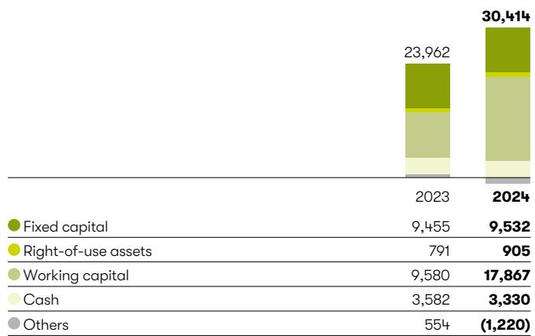

Sources of capital

(S$ million)

30,414

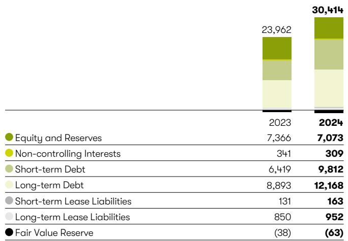

Cash-to-cash cycle

(days)

While headline net gearing increased from 1.73 times to 2.79 times, most of this increase was from working capital growth, driven by very high input prices that in turn caused net debt levels to rise. However, it is important to note that almost all of this increase was covered by readily marketable inventory or RMI and secured receivables, resulting in a stable adjusted gearing of 0.68 times (2023: 0.65 times) that reflects the true indebtedness of our Group.

Of the S$16.1 billion inventory position that the Group has, approximately 75.5% or S$12.1 billion were RMI that were liquid, hedged and/or sold forward, operating as near-cash assets on our balance sheet which grew in line with the higher inventory value. In addition, approximately 65.2% or S$2.8 billion of trade receivables were secured.

<table><tr><td>SS million</td><td>2024</td><td>2023</td><td>Change</td></tr><tr><td>Gross debt</td><td>23,094.8</td><td>16,293.8</td><td>6,801.0</td></tr><tr><td>Less: Cash</td><td>3,329.7</td><td>3,581.6</td><td>(251.9)</td></tr><tr><td>Net debt</td><td>19,765.1</td><td>12,712.2</td><td>7,052.9</td></tr><tr><td>Less: Readily marketable inventory (RMI)</td><td>12,147.5</td><td>6,044.3</td><td>6,103.2</td></tr><tr><td>Less: Secured receivables</td><td>2,788.5</td><td>1,888.6</td><td>899.9</td></tr><tr><td>Adjusted net debt</td><td>4,829.1</td><td>4,779.3</td><td>49.8</td></tr><tr><td>Equity (before fair value adjustment reserves)</td><td>7,072.8</td><td>7,366.0</td><td>(293.2)</td></tr><tr><td>Net debt/Equity (Basic)</td><td>2.79</td><td>1.73</td><td>1.06</td></tr><tr><td>Net debt/Equity (Adjusted)</td><td>0.68</td><td>0.65</td><td>0.03</td></tr></table>

Net operating cash flow for 2024 stood at negative S $3.5 billion against a positive S$ 1.0 billion in 2023, even as operating cash flow grew by S$272.9 million. This was due to the substantial increase in working capital deployed during the period. Gross capital expenditure (Capex) rose marginally to S$717.0 million in 2024 from S$697.2 million in 2023, as we remained disciplined in focusing on higher margin-accretive investments. Net Capex after disposals amounted to S$618.8 million, an increase of S$38.6 million over 2023. The significantly increased working capital – predominantly from higher cocoa and coffee prices – and higher interest paid over the period, caused both Free Cash Flow to Firm (FCFF) and Free Cash Flow to Equity (FCFE) to turn negative at S$4.4 billion and S$5.9 billion respectively.

<table><tr><td>SS million</td><td>2024</td><td>2023</td><td>Change</td></tr><tr><td>Operating cash flow (before Interest &amp; Tax)</td><td>2,528.6</td><td>2,255.7</td><td>272.9</td></tr><tr><td>Changes in working capital</td><td>(6,073.4)</td><td>(1,224.8)</td><td>(4,848.6)</td></tr><tr><td>Net operating cash flow</td><td>(3,544.8)</td><td>1,030.9</td><td>(4,575.7)</td></tr><tr><td>Tax paid</td><td>(226.1)</td><td>(235.3)</td><td>9.2</td></tr><tr><td>Capex/Investments/Divestments</td><td>(618.8)</td><td>(580.2)</td><td>(38.6)</td></tr><tr><td>Free cash flow to firm (FCFF)</td><td>(4,389.7)</td><td>215.4</td><td>(4,605.1)</td></tr><tr><td>Net interest paid</td><td>(1,547.3)</td><td>(1,130.2)</td><td>(417.1)</td></tr><tr><td>Free cash flow to equity (FCFE)</td><td>(5,937.0)</td><td>(914.8)</td><td>(5,022.2)</td></tr></table>

# Sufficient liquidity with diversified capital sources

We maintained sufficient headroom to support our working capital and Capex needs, with a total of S$25.1 billion in available liquidity as at end-2024, including unutilised bank lines of S$6.9 billion.

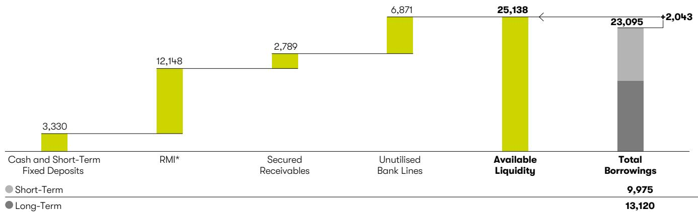  
Total borrowings and available liquidity as at end-2024  
(S$ million)

The Company and its operating groups refinanced various borrowing facilities by securing revolving credit facilities (RCF) and medium-term loans that align with their Purpose.

Our wholly owned subsidiary, Olam Holdings Pte Ltd, secured an 18-month US$1.5 billion loan facility to refinance existing debt.

ofi secured several credit facilities and medium-term loans, including:

- Five-year US$50.0 million floating rate notes private placement to an institutional investor;  
- Inaugural ECA-linked, dual-currency financing aggregating US$500.0 million, comprising a five-year US$250.0 million tranche and a seven-year JPY37.38 billion tranche approximating US$250.0 million, and backed by SACE, the Italian Export Credit Agency;  
Multi-tranche, two-year and three-year RCF and a three-year term loan aggregating US$1.8 billion;  
- First dual-currency (U.S.A. dollar and CNH) term loan aggregating US $1,075.0 million, comprising a two-year US$ 950.0 million term loan tranche and a one-year CNH 875.0 million (approximately US$125 million) tranche with a lenders' extension option of one year;  
- A three-year samurai loan facility aggregating JPY 46.5 billion (approximately US$330 million); and  
- A US$65 million five-year floating rate notes via a private placement under the existing EMTN programme of ofi subsidiary Olam International.

Olam Agri secured the following borrowing facilities:

- Landmark commodity Murabaha facility from a new, diversified group of global investors (including the UAE, Malaysia, Singapore and Hong Kong) totalling US$625.0 million with a tenor of three years based on Shariah principles;  
Three-year RCF of US\\(550.0 million; and  
- Three-year facility from banks in the UAE aggregating AED 2,740 million (approximately US$745 million) to refinance its existing loans and meet general corporate purposes.

Post 2024, Olam Agri secured two financing facilities totalling US$2.0 billion with maturity in July 2028 for refinancing of its existing loans and for general corporate purposes.

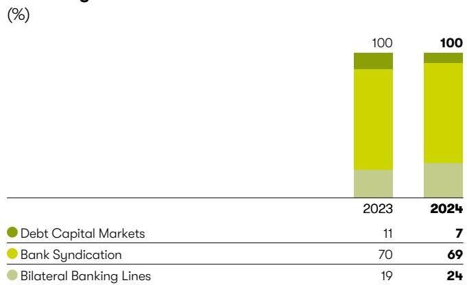  
Borrowing mix

Performance by operating group  

<table><tr><td>Segment</td><td colspan="2">Sales Volume (‘000 MT)</td><td colspan="2">Revenue</td><td colspan="2">EBIT</td><td colspan="2">Invested Capital (IC)^</td><td colspan="2">EBIT/IC</td></tr><tr><td>$ million</td><td>2024</td><td>2023</td><td>2024</td><td>2023</td><td>2024</td><td>2023</td><td>2024</td><td>2023</td><td>2024</td><td>2023</td></tr><tr><td>ofi</td><td>3,353.8</td><td>3,284.3</td><td>21,825.7</td><td>15,583.4</td><td>1,070.7</td><td>829.3</td><td>17,360.6</td><td>11,754.3</td><td>7.4%</td><td>7.1%</td></tr><tr><td>Global sourcing</td><td>2,721.3</td><td>2,714.4</td><td>14,118.3</td><td>9,837.9</td><td>313.1</td><td>295.2</td><td>6,294.8</td><td>4,218.8</td><td>6.0%</td><td>6.8%</td></tr><tr><td>Ingredients &amp; solutions</td><td>1,289.7</td><td>1,239.3</td><td>12,575.3</td><td>8,285.6</td><td>757.6</td><td>534.1</td><td>11,065.8</td><td>7,535.5</td><td>8.1%</td><td>7.3%</td></tr><tr><td>Inter-segmental sales</td><td>(657.2)</td><td>(669.4)</td><td>(4,867.9)</td><td>(2,540.1)</td><td>-</td><td>-</td><td>-</td><td>-</td><td>-</td><td>-</td></tr><tr><td>Olam Agri</td><td>45,082.7</td><td>39,540.7</td><td>33,171.4</td><td>31,319.7</td><td>1,023.8</td><td>967.7</td><td>6,720.4</td><td>5,457.6</td><td>16.8%</td><td>18.3%</td></tr><tr><td>Food &amp; feed - origination &amp; merchandising</td><td>37,340.8</td><td>33,251.3</td><td>22,836.9</td><td>21,731.1</td><td>221.7</td><td>224.4</td><td>1,925.5</td><td>1,348.7</td><td>13.5%</td><td>16.4%</td></tr><tr><td>Food &amp; feed - processing &amp; value-added</td><td>5,244.4</td><td>4,135.4</td><td>4,576.0</td><td>4,501.9</td><td>601.0</td><td>591.2</td><td>2,509.7</td><td>2,195.3</td><td>25.5%</td><td>26.3%</td></tr><tr><td>Fibre, agri-industrials &amp; ag services</td><td>2,497.5</td><td>2,154.0</td><td>5,758.5</td><td>5,086.7</td><td>201.1</td><td>152.1</td><td>2,285.2</td><td>1,913.6</td><td>9.6%</td><td>9.1%</td></tr><tr><td>Remaining Olam Group</td><td>1,160.1</td><td>1,272.4</td><td>1,160.0</td><td>1,368.9</td><td>(158.7)</td><td>(25.1)</td><td>2,472.1</td><td>2,538.2</td><td>(6.3%)</td><td>(1.0%)</td></tr><tr><td>De-prioritised/ exiting assets</td><td>53.6</td><td>128.5</td><td>96.1</td><td>205.0</td><td>(13.1)</td><td>(11.3)</td><td>420.0</td><td>523.0</td><td>(2.8%)</td><td>(2.1%)</td></tr><tr><td>Continuing/ Gestating businesses^</td><td>823.8</td><td>807.3</td><td>937.6</td><td>1,004.1</td><td>(96.1)</td><td>52.8</td><td>2,008.5</td><td>1,991.0</td><td>(4.8%)</td><td>2.6%</td></tr><tr><td>Incubating businesses</td><td>282.7</td><td>336.6</td><td>126.3</td><td>159.8</td><td>(49.5)</td><td>(66.6)</td><td>43.6</td><td>24.2</td><td>n.m.</td><td>n.m.</td></tr><tr><td>Total</td><td>49,596.6</td><td>44,097.4</td><td>56,157.1</td><td>48,272.0</td><td>1,935.8</td><td>1,771.9</td><td>26,553.1</td><td>19,750.1</td><td>8.4%</td><td>9.1%</td></tr></table>

A management discussion of the performance by operating group and segmental review and analysis is found within the relevant operating groups section.

Read more on pages 26 to 43.

Olam Agri

Read more on pages 44 to 60.

Olam

Read more on pages 61 to 84.

# Be the change for good food and a healthy future

Making it real from plant to palate

Earnings Before Interest and Tax (S$ million) +11.5%  
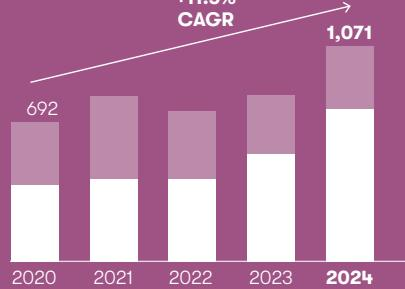  
Global Sourcing  
Ingredients & Solutions

Sourcing from

\~2.4

million

farmers

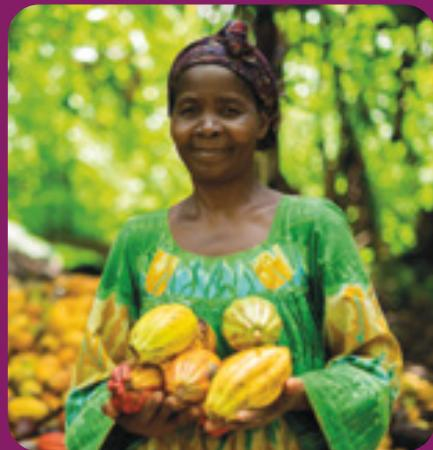

Earnings Before Interest and Tax (% split)  
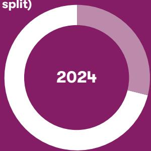  
Global Sourcing 29%  
Ingredients & Solutions 71%

19

innovation centres

120+

manufacturing centres

# Top three

Global cocoa processor

Dairy ingredients supplier in China & Nigeria

Independent producer of soluble coffee

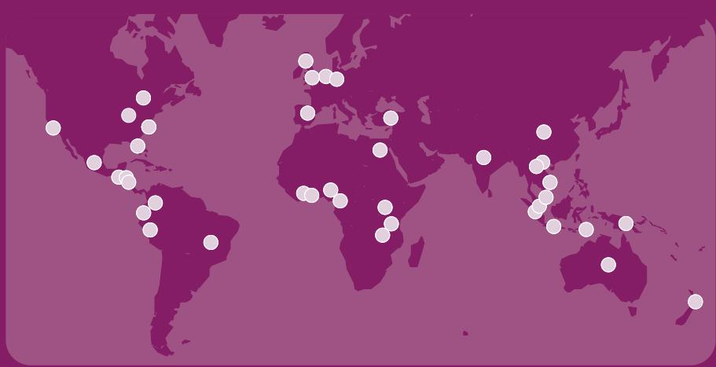

# Leading

Global cocoa originator

Supplier of all seven major nuts

Supplier of dried onion & garlic

Driven by its Purpose to 'be the change for good food and a healthy future', ofi offers reliable, traceable and sustainable food and beverage solutions across the world.

We deliver a portfolio of tasty, nutritious and natural ingredients for bakery, beverage, confectionery, snacking and culinary applications.

# Be the change for good food and a healthy future

66 We achieved a strong performance, with accelerated growth in our Ingredients & Solutions segment. ofi navigated volatile markets to deliver  $29 \%$ EBIT growth, maintaining stable returns even amid elevated capital requirements. This achievement showcases the strength of our customer relationships, and our capacity to deliver through the power of integration at scale. 99

A Shekhar CEO, ofi

# 2024 performance

2024 has demonstrated offi's longstanding capabilities as rigorously as any recent year, with heightened volatility, record prices and supply challenges across several key products. Amid these challenges, our scale, diversification and vertically integrated capabilities enabled us to navigate market turbulence effectively. We are proud to have supported our customers every step of the way, meeting our commitments and offering new alternatives.

We leveraged our deep market insights, agile supply chain and effective risk management to maintain a steady flow of high-quality ingredients worldwide. This approach further reinforced customer relationships and demonstrates the power of ofi's integration at scale. In this dynamic environment, our focus has been to optimise risk-adjusted

returns for the elevated levels of market volatility and working capital required, while maintaining disciplined execution of our strategic priorities.

I am pleased with the results of our actions which supported our strong performance in 2024. ofi delivered double-digit adjusted earnings before interest and taxes (EBIT) growth of  $29.1\%$  year-on-year to S\$1,070.7 million, primarily driven by the Ingredients & Solutions segment. We also maintained stable returns on an elevated invested capital base that was driven by raw material price increases. Tight management held our capital increase significantly below the corresponding price rises in key commodities such as cocoa (up almost threefold), coffee and pepper (almost doubled), and cashews (up by around  $50\%$ ).

ofi's performance demonstrates our resilience and enduring capability to pass through increased capital costs if raw material prices remain elevated. We have done this as we further backed our strategic progression up the value chain.

We continued to drive strategy forward with the launch of ofi's new Food & Beverage Solutions platform (F&B Solutions) to most effectively solve customer needs and meet rapidly evolving consumer tastes. We also launched our sustainability strategy, Choices for Change, to deliver transformative impact in material areas by 2030, and create real change for people and the planet. We continue to invest in our people, building the right organisational structure and capabilities to ensure ofi not only performs but can also evolve to meet the requirements of our customers, both now and in the future.

We took two notable one-off costs in the year. There was a S $\$ 61.0$  million, primarily non- cash, impact from our closure of two almond ranches in the U.S.A. that did not fit with our upstream strategy. We also took the difficult decision to temporarily shut down our U.S.A. Firebaugh onion and parsley processing plant, with a S $\$ 30.8$  million impact, due to sluggish demand and U.S.A. market oversupply, which we expect will take some time to resolve. All customer onion requirements will continue to be fulfilled by our other U.S.A. processing facilities.

# Operational highlights

We remained focused on extracting full value from existing investments. Our Olde Thompson U.S.A. private label spice facilities had a good year, delivering operational efficiencies, stock keeping unit (SKU) rationalisation, and sharper customer focus, which has established a strong trajectory for further growth in 2025 and beyond. In Brazil, our recently commissioned private label coffee facility is hitting operational targets, and our dairy ingredients investments in New Zealand and Malaysia are exceeding expectations.

We continue to invest for the future and build out capabilities in attractive categories and channels. During the year, we commissioned a new U.S.A. private label facility for nuts in Arizona, which had a strong start, and opened our new North American headquarters and Customer Solutions Centre (CSC) in Chicago. Another CSC was opened in Shanghai, leveraging the expertise of our Asia Regional CSC in Singapore and broader global innovation network.

An important strategic step for ofi was the launch of our new product platform, F&B Solutions. This integrates our application and category capabilities into a single, dedicated platform to address customer requirements and solve evolving consumer preferences, based on deeper category, channel, and consumer insights. Customers looking to co-create new consumer concepts or new application solutions, particularly with a combination of ofi ingredients, will be supported by F&B Solutions with its five CSCs located in Amsterdam, Bangalore, Chicago, Singapore and Shanghai, as well as our consumer insights and strategic accounts teams based around the world.

Customers seeking excellence in single ingredients, from sourcing to manufacturing, will continue to be supported by our five leading product platforms in cocoa, coffee, dairy, nuts and spices with their global origination and sourcing capabilities, competitive sustainability offerings, and product innovation expertise. This service is strengthened by close collaboration with the F&B Solutions platform to offer category insight and application development capacity, so single ingredient customers can also benefit from more value-added ingredients and services.

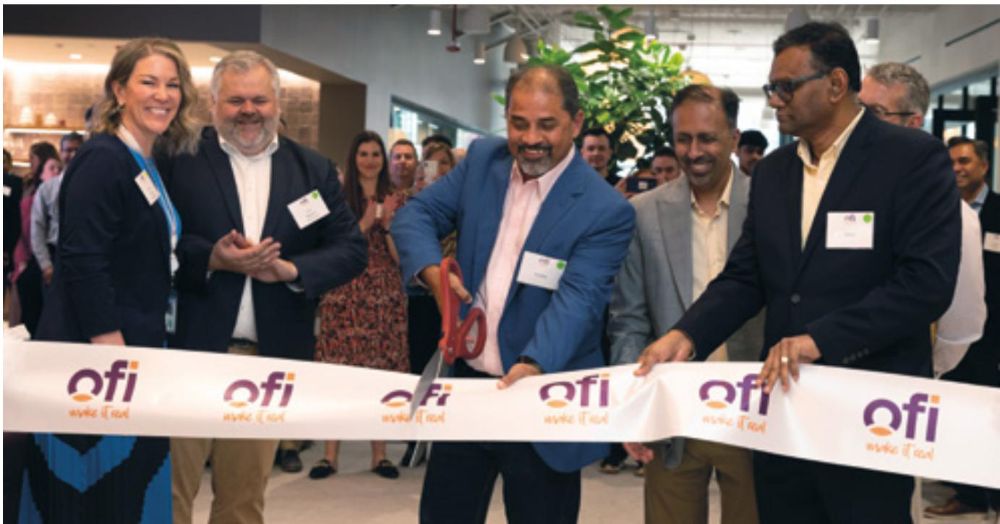  
ofi opens new North American headquarters and Customer Solutions Centre in Chicago

# Intangible Capital: Enhancing barbeque innovation

ofi and 利思客, Cisco Barbeque Supply Chain collaborate to spice up the barbecue culinary industry. The partnership will be powered by offi's new Shanghai Customer Solutions Centre, unlocking new co-creation opportunities for China and Asia Pacific.

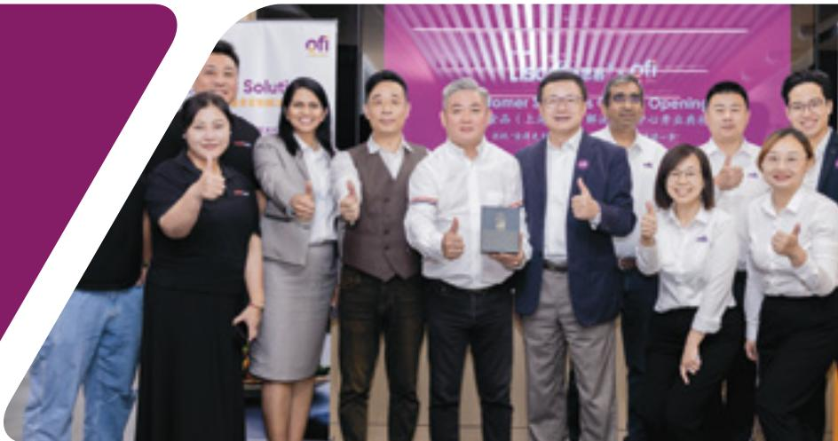

# Key highlights

Volume

3.4 mMT

+2.1%

EBIT/IC

7.4%

+30 basis points

EBIT

S\(1,070.7 m

+29.1%

Invested Capital

S$17.4 bn

+47.7%

Customers

\~11,000

Employees

\~18,000

Looking internally, our people are our greatest asset, and we are focused on creating and maintaining a safe and inclusive workspace that supports diversity and equity, where every individual can feel the challenge, see the impact and know they matter. 99

# Building and being ofi

As we build ofi for the future, we are also being ofi in the way we live our Purpose, values and behaviours every day. We are optimising our organisation to be fit for the future, with the right capabilities and ways of working, with clear roles and responsibilities to increase business impact.

We continued to perform well in our ambitious safety, quality, food safety, sustainability and customer-centricity focus by applying our continuous improvement tools. We improved the global auditing programme for safety, serious injury and fatality assessments in all our sites, which has driven improvements in safety culture and leadership. A similar approach to quality and food safety was introduced with our 'See It, Say it, Sort it' assessment programme, which aided in progressing out-methodologies, standard operating procedures and the leadership culture to drive improved performance.

In 2024, we reset global grading and implemented a total reward strategy that amplifies our entrepreneurial heritage and enhances our new capabilities, by recognising collaborative, winning behaviours. We also launched LinkedIn Learning, a powerful tool for both managers and employees to support individual career development, and we undertook preparatory work to launch an all-employee engagement survey in 2025.

offi's operational excellence tools are embedded as a way of life in our operations and supply chains, and materially delivered value in costs and sustainability in over 400 separate projects around the globe in 2024. Cost step-changes from labour efficiency and yield improvements were seen notably in our private label production facilities as well as all other manufacturing facilities. These improvements were coupled with many successful sustainability projects, such as a biomass boiler addition in New Zealand, solar arrays in Turkey and Vietnam, new electric e-pusher and barge transportation in the Netherlands, and upcycling of our spices by-products to meet the innovative needs of our customers.

# Sustainability

We launched our sustainability strategy, Choices for Change, which is guided by our Purpose to be the change for good food and a healthy future, and which includes concrete, ofi-wide 2030 sustainability targets. Our ambition is to be the preferred partner for positive change for every stakeholder in our value chain, from plant to palate. As sustainability experts embedded in farming communities, we offer our customers and partners the traceability, insights, capability and choices to drive positive change.

Beyond impacting farmer livelihoods, which remains a key imperative, our expert teams are working with our many partners, including customers, NGOs, certification agencies, development finance institutions, local governments, and of course the farmers themselves, to tackle the entrenched social issues in the communities where we work and climate change, which is increasingly affecting farmers and their crops. Regenerating landscapes where agriculture and nature co-exist is equally vital.

We are able to do this because of our presence in the heart of farming communities, and the integrated capacity that we have built to deliver the final ingredients and solutions to our customers globally through our manufacturing plants and innovation centres in the major consumption markets. This enables us to create real impact across the supply chain, and equip customers with a powerful provenance narrative for their consumers while also catering to the increasing regulatory reporting and compliance requirements.

We are taking all proactive measures to mitigate the risk of deforestation in our third-party supply chains, working closely with our suppliers to implement sustainable sourcing practices, conducting rigorous audits, and leveraging technology to enhance traceability. Our readiness for EU Deforestation Regulation (EUDR) not only aligns with our sustainability goals but also strengthens our reputation as a trusted partner in the food industry.

I am pleased to see our sustainability focus externally recognised. Sustainability has included ofi in its 2025 ESG top-rated companies list, ranking us among the top  $7 \%$ of companies in the food products industry. This year, we also undertook our first standalone CDP assessment, where we were rated ‘B’ on both Climate and Water. It is also heartening to have two tiers of our sustainable sourcing solution system, AtSource, recognised as equivalent schemes against the Sustainability Farm Assessment FSA 3.0 from the SAI platform, obtaining the silver and gold equivalence levels respectively for our spices, cocoa, coffee and nuts products. This FSA equivalence is especially valuable for our customers, helping them to meet their sustainable sourcing programme targets with measurable impact when purchasing AtSource products.

# Outlook

The past year has been one of significant achievements and strategic progress for our company. We have navigated market challenges, optimised risk-adjusted returns, and made further investments for our future growth. Our strong financial performance, coupled with our commitment to sustainability and innovation, positions us well for continued success. While the commodity markets are, and may continue to remain, volatile, we are well-positioned to support and add value to our customers, and we remain cautiously optimistic of delivering our medium-term guidance of high single-digit adjusted EBIT growth. I would like to thank our employees, customers and shareholders for their unwavering support and dedication. Together, we will continue to build a sustainable and prosperous future for our company.

A Shekhar

CEO, ofi

# Sloping Agricultural Land Technology (SALT) in cocoa in Indonesia

Working with Mars and the Deutsche Gesellschaft für Internationale Zusammenarbeit (GIZ) GmbH – funded by the German Government – ofi's cocoa team in Indonesia started testing and implementing Sloping Agricultural Land Technology (SALT), involving planting cocoa trees alongside fruit trees, timber and food crops.

Regenerative agriculture is an important part of how Mars supports sustainable cocoa production. As land use in the lowlands moves to rice for food security, it is key we focus on rehabilitating cocoa in the highlands. Mars appreciates ofi's innovative approaches, such as Sloping Agricultural Land Technology, to help farmers transition to diversified cocoa agroforestry in upland growing conditions, which helps to improve soil health, increase biodiversity and farmers' resilience to a changing climate. 99

Fay Fay Choo,

Asia Cocoa Director, Mars

# The power of integration at scale

# Ingredients and Solutions

Ability to provide complete package to customers – from single ingredients to value-added finished products

Value-added

processing,

innovation and

co-creation

Global

manufacturing

presence in both

origin and

destination markets

Strong innovation

capabilities across

the value chain, from

plant science to

customer solutions

Ecosystem

partnerships and

co-creation with

customers

Categories and

channels expertise

diversified offering across

One-stop,

vertically integrated

and value-added

solutions...

...with a global footprint

and strong innovation

capabilities...

...serving customers

globally

#

${c}_{6}{a}_{5}$  co7

Cooee, dairy, nuts

# Global Sourcing

Supply chain expertise and global presence, enabling differentiated sustainability and traceability impact

Farming, origination

and sourcing

Global footprint and

presence in all key

origins

Direct and indirect

network of farmers

globally

Sustainability and

traceability at the

heart of business with

social, environmental

and economic impact

Deep market

research and risk

management

expertise

# ofi: Operating group-level highlights1

In 2024, ofi navigated an operating environment characterised by increased volatility, record price peaks, and supply challenges across several key products. Prices for cocoa beans, coffee, pepper, and cashews saw significant increases that persisted at elevated levels across most of the year.

Despite these challenges, our extensive scale, diverse portfolio, and vertically integrated operations enabled the company to effectively manage through the turbulence, support its supplier network, deliver for customers, and continue executing its strategy.

2024 net volume growth was  $2.1\%$  to 3.4 million MT, led by the Ingredients & Solutions segment, as we prioritised selective growth opportunities and supporting the needs of our customers, rather than pursuing only volume growth. Revenues grew by a strong  $40.1\%$  to S $\$ 21.8$  billion, driven primarily by the pass- through of input price increases.

ofi's focus on prioritising selective growth opportunities, combined with continued strategic progress towards becoming a more customer-centric, solutions-focused business, led to double-digit EBIT growth of  $29.1\%$  year-on-year, reaching S\ $1,070.7 million. Adjusted EBIT grew by \(27.5\%$  to S\\)1,115.0 million.

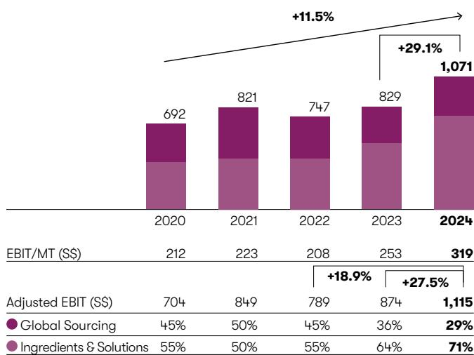  
Earnings Before Interest and Tax* (S$ million)  
1,071  
Invested capital" (S$ million)

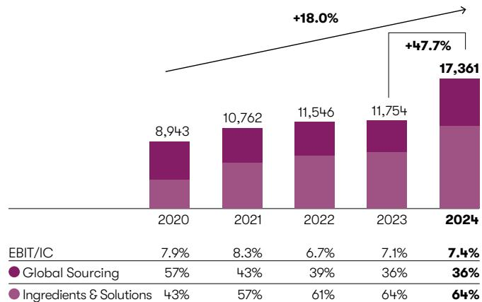  
17,361

This strong performance reflects both continued strategic progression and increased margins to compensate for the higher risk and capital deployment. While both reporting segments contributed to EBIT growth, Ingredients & Solutions was the key driver, building on top of the strong and resilient Global Sourcing foundation, which was pressure tested during this volatile period.

Working capital represented the significant majority of invested capital growth, which increased by S $5.6 billion to S$ 17.4 billion. This was due to sharp and persistent increases in prices of several key input raw materials, including cocoa, coffee, pepper and cashew nuts. However, it is important to note that almost all of this is reflected in higher readily marketable inventory (RMI).

Proactive and tight controls on operational cycle time, dynamic inventory management and cash flow discipline, helped limit the absolute capital deployed vis-à-vis the extent of the underlying input price increase.

Despite the large increase in invested capital, returns (EBIT on average invested capital or EBIT/IC) increased to  $7.4\%$  compared to  $7.1\%$  in 2023, on account of strong EBIT growth which reflects our ability to secure additional margins to compensate for the elevated capital, with the typical lag.

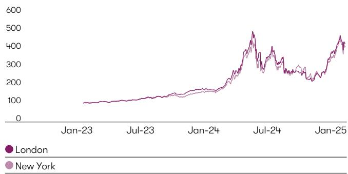  
Cocoa  
Price rebased to 100

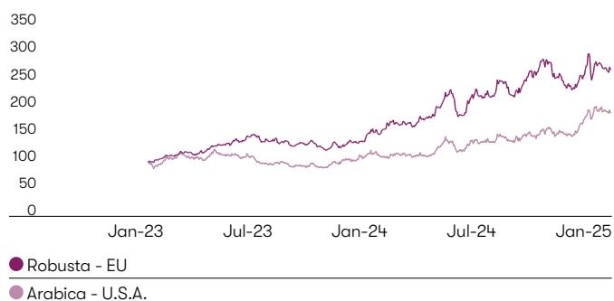  
Coffee  
Price rebased to 100  
Invested capital mix

(S$ million)

17,361

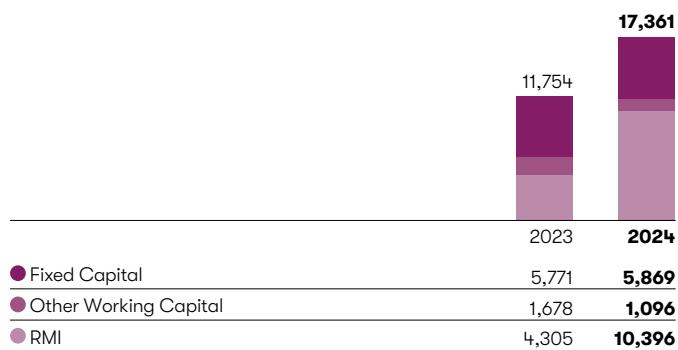

# ofi: Segmental-level highlights

# Global sourcing

Despite wider market supply challenges, ofi leveraged its sourcing network scale, diversification, and farmer relationships to good effect. The Global Sourcing segment reported volume growth of  $0.3\%$  year-on-year to 2.7 million MT, which reflects increases in coffee and dairy, offset by reduced cocoa volumes. Revenue grew by  $43.5\%$  to  $\$ 14.1$  billion, driven by the pass-through of raw material price increases, particularly in cocoa and coffee.

Global Sourcing teams excelled in navigating volatile raw material markets, showcasing their expertise and the strength and resilience of our sourcing platform. The deliberate strategy to prioritise capital deployment in opportunities that optimise risk-adjusted returns led to a greater focus on captive volumes for ingredient processing over some external sales opportunities for this segment.

Global Sourcing EBIT grew by  $6.1\%$  to S\ $313.1 million, driven by stronger cashew sales and margins, a normalisation of peanut operations and cocoa. This growth was partially offset by softer performance in coffee due to selective capital allocation and increased hedging costs. Adjusted EBIT grew by \(5.9\%$  to S\\)319.0 million.

Invested capital increased by S $2.1 billion to S$ 6.3 billion, primarily due to price-led increases in working capital from sharply elevated raw material prices compared to the prior year. The business maintained a hyper-focus on tight capital management controls to keep the working capital increase below the price rises seen in certain commodities. Fixed capital remained largely unchanged.

As a result of higher invested capital and the deliberate choice to prioritise selective growth opportunities, EBIT/IC was  $6.0\%$  versus  $6.8\%$  in 2023.

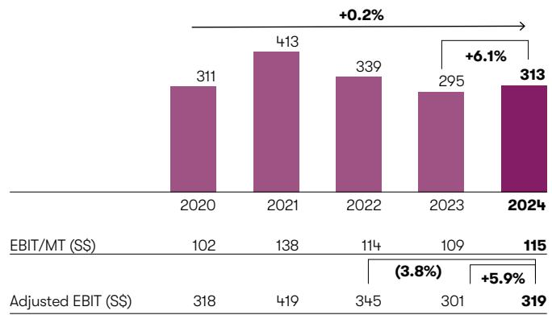  
Earnings Before Interest and Tax* (S$ million)  
313  
Invested capital" (S$ million)

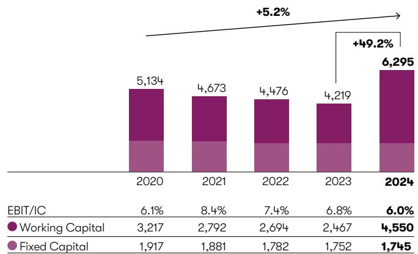  
6,295

# Ingredients & Solutions

The Ingredients & Solutions segment delivered volume growth of \(4.1\%\) year-on-year to 1.3 million MT, driven by dairy, nuts, and spices. Cocoa and coffee volumes remained broadly stable, benefitting from off’s integrated supply chain and the strength of its Global Sourcing platform. Segment revenue increased by \(51.8\%\) to S\\(12.6 billion, driven by strong price growth, particularly in cocoa and coffee from the pass-through of higher input raw material prices.

EBIT grew by  $41.8\%$  year-on-year to S $\$ 757.6$ million, reflecting both continued strategic progression and increased margins to compensate for elevated levels of capital and risk. Growth was led by cocoa, dairy, and spices, supported by continued contribution from the more recent investments in Olde Thompson and the New Zealand and Malaysia dairy processing facilities. However, soluble coffee margins were pressured by higher input costs, and the U.S.A. industrial spices market faced softer demand. Adjusted EBIT grew by  $38.9\%$  to S $\$ 796.0$ million.

Invested capital increased by S\ $3.5 billion to S\$ 11.1 billion driven by the price-led working capital increases previously outlined, while fixed capital remained stable. This was more than offset by the strength of EBIT growth, driving EBIT/IC higher at  $8.1\%$  versus  $7.3\%$  in 2023.

# Earnings Before Interest and Tax*

(S$ million)

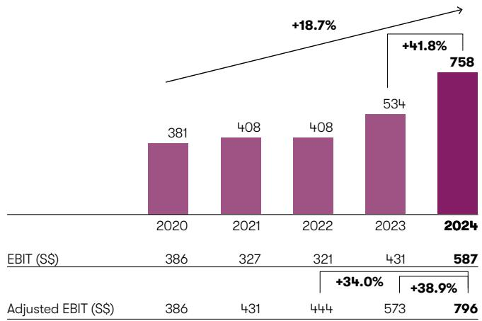  
758

# Invested capital

(S$ million)

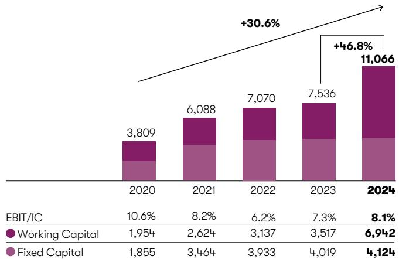  
11,066

# The power and value of ofi's integrated business model

Since offi's formation in 2020, the company has seen its business model tested through multiple market disruptions. We have successfully navigated these challenges while continuing to execute strategy and deliver on medium-term targets. We have delivered 11.5% EBIT compounded annual growth between 2020 and 2024, ahead of medium-term guidance for high single-digit growth. This is led by the Ingredients & Solutions segment, in line with our strategy to become a more solutions-led, customer-centric organisation.

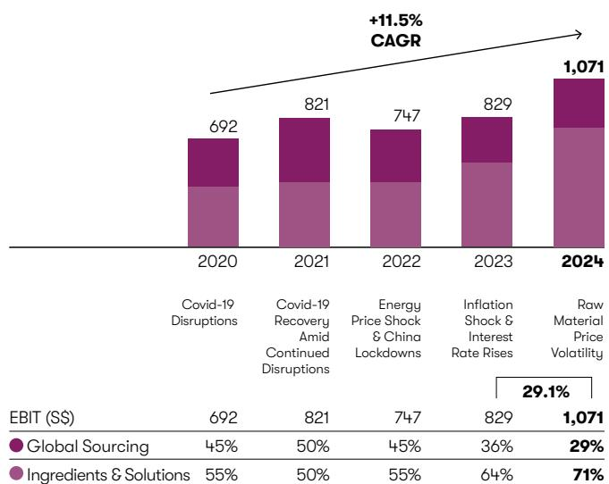  
Earnings Before Interest and Tax*  
(S$ million) 1,071

ofi's performance is enabled by its integrated business model, which offers customers end-to-end solutions within and across five complementary product platforms that leverage deep sourcing foundations. Our presence across the supply chain enables us to innovate and add value at each stage.

# Integrated supply chain - a spicy example

ofi's spices product platform exemplifies many of the attributes and advantages of a fully integrated value chain. From the start, we can apply our plant science expertise to improve farming productivity, the resilience of supply, and the quality and functionality of products and ingredients. For example, ofi's onion seed breeding programme provides farmer networks in the U.S.A. and Egypt with high solid variety onion seeds that improve yields and reduce water requirements.

Our in-origin footprint in major spice-producing origins, such as Vietnam, also enables us to support farmers and collaborate with customers to deliver sustainability impact projects, such as farmer trainings on good agricultural practices and regenerative farming practices, and providing farmers with welfare support. This further strengthens our customer relationships and farmer networks, to secure a reliable, traceable, transparent and sustainable global supply of the spices raw material to be processed into ingredients at our facilities.

During processing, we apply our ingredients expertise to achieve the quality, value and functionality that customers require. In Vietnam, for example, we process locally grown peppercorns and cinnamon bark, among other spices, into sterilised ground ingredients. Equally, in the U.S.A., we process raw onion, garlic and chilli peppers into sterilised dehydrated ingredients, such as ground, granulated and minced formats.

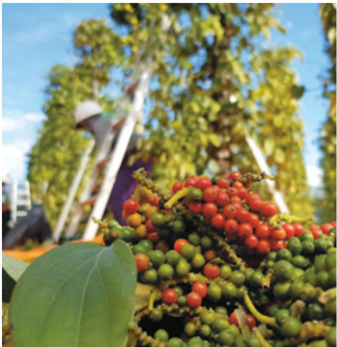  
Pepper harvesting, Vietnam

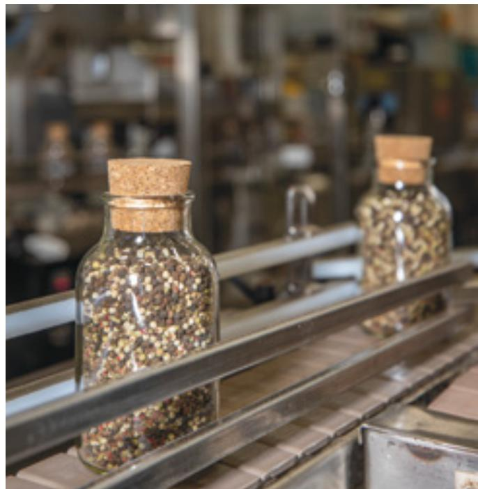  
Spices private label facility, U.S.A.

# Manufactured Capital: ofi's end-to-end solutions support innovative growth ecosystems

ofi F&B Solutions partners with iD Fresh Food, a breakthrough global food company, to launch clean-label spice blends for the India market.

iD is committed to redefining quality and transparency in the industry. We are happy to partner with ofi in creating wholesome, fresh, pesticide- and adulteration-free spices. These spices undergo 20 rigorous quality checks from farm to pack, along with advanced testing for over 80 unsafe molecules. The launch of clean-label spices is a proud step for iD in providing adulteration-free meals to over 400 million people in major Indian cities, and reinforces our commitment to safe and healthy meals. 99

Musthafa PC, Global CEO & Co-Founder, iD Fresh Food

At the end of offi's spices value chain, we provide customers with custom solutions and co-creation opportunities through private label products. In the U.S.A., offi is a leading supplier of private label spices, blends and seasonings, which are manufactured and packaged at its two U.S.A.-based Olde Thompson plants or its Vietnam factories.

Full integration enables us to leverage the advantages of our supply chain in our end-to-end customer solutions. From crop intelligence, sustainability impacts and supply surety, to quality control, traceability, and innovation – at each step, we provide greater value to customers, enhancing relationships and margin profiles.

# Digitisation - a force multiplier

Digitisation is a key enabler and multiplier of offi's value creation, which is made possible by the integrated supply chain. We have developed, and continue to develop and embed, innovative digital solutions across the value chain.

Digitisation starts on the farms where we source from approximately 2.4 million farmers in highly fragmented and complex supply chains, sometimes across remote and inaccessible areas. Deep rooted, on-the-ground presence in origins brings us closer to farmers, enabling collection of supply chain data and delivery of improvements at every step. Digital tools help us to provide traceability and transparency, right back to specific farms and farmer groups. To date,  $\sim 90\%$  of our directly sourced volumes are traceable (to farm, farmer group, cooperative or community level).

From granular deforestation mapping and child labour monitoring to Al-powered carbon measurement tools, our latest digital advancements leverage the capabilities of our sustainable sourcing solution system, AtSource. AtSource can provide customers with detailed data and insights on where and how their ofi ingredients are sourced, including social and environmental impacts. This accelerates collaborative progress towards sustainability ambitions, as well as providing food and beverage companies with enhanced and third-party verified traceability and transparency, ahead of new regulations in Europe and beyond.

ofi's digital experts designed a 'Track and Trace' solution which integrates information from on-the-ground digital apps and enterprise resource planning (ERP) systems to enable traceability from farm plots to customers, providing visibility at scale across the supply chain. The enhanced Track and Trace system is the backbone of adherence to regulatory compliance, such as the EU Deforestation Regulation (EUDR). One such app is the ofi Farmer Information System (OFIS) which helps to gather, process and analyse information about farmers and the first mile of the supply chain. OFIS is a survey tool built to bridge digital gaps with isolated farmers who lack internet connections. Data is collected by field teams and includes farm GPS locations, yields, and community information such as the nearest schools. We feed OFIS data into AtSource, giving customers a transparent and detailed view of their supply chains. With a clearer view of what is happening on the ground, ofi and the farmers we work with can maximise the effectiveness of their efforts, and plan development programmes that are better suited to farmers' needs.

Another example is 'ofi Direct', an app that modernises our sourcing approach by enabling farmer transactions directly with us. This gives farmers more control over their sales and earnings while also digitally tracing crops back to them. Additionally, the app offers farmers access to advice, financing and supplies.

# Intellectual Capital: How we deliver data and insights through the supply chain

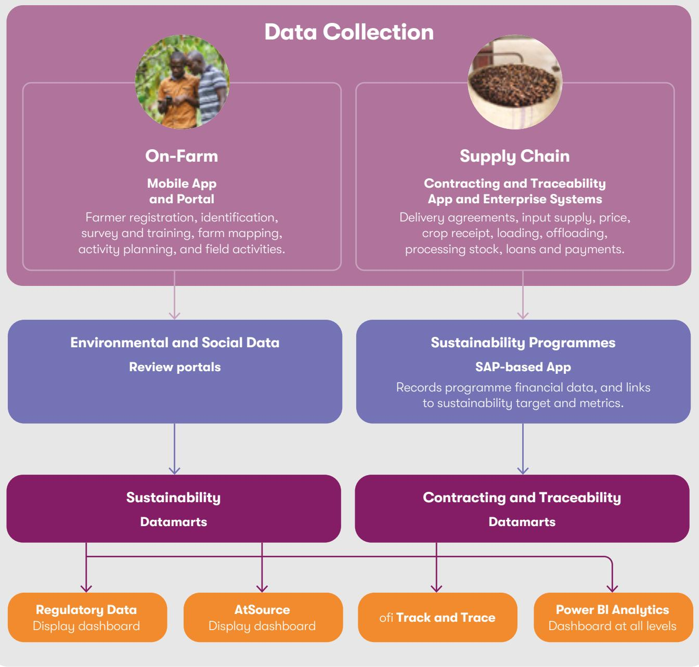

In Brazil, where the coffee supply chain is complex and fragmented, ofi Direct is streamlining our trading with local producers by creating a digital bridge that removes traditional intermediate steps in the supply chain. The platform enables producers to track coffee prices in real time, manage contracts, and handle transactions completely online. This simplifies contract negotiations, reduces trading bureaucracy and creates a more efficient, transparent marketplace. For producers, it means they can make faster, more informed decisions about their coffee sales. For us, it means better, more transparent data, more direct relationships with reduced transaction costs, and a competitive edge in sourcing high-quality coffee.

The future for digitisation within the supply chain at ofi is known more widely as 'Supply Chain 4.0'. This refers to implementation of extensive automation, advanced robotics and sensors widely across the supply chain, that utilise connected networks and the 'internet of things' to gather and analyse big data that enables constant optimisation and drives efficiency. In the near term, we expect to make significant advances with automation and analytics of our big data, providing a taste of the benefits to be cemented over the medium-to-long term as we adopt a network-focused mindset.

# Managing market disruptions – ofi’s expertise

Various market disruptions over recent years have tested and proven off's longstanding capabilities, and 2024 was no different. Supply chain diversification, transparency and application of digital tools are some of the aids that we use to successfully navigate such disruptions. By leveraging in-origin insights, we have a deep understanding of source regions and crop development. This knowledge enables us to anticipate, position for and respond to local challenges, such as low yields, ahead of the market. Furthermore, our global scale and diversification reduce dependency on any single origin, spreading risk across multiple regions and providing supply surety for customers.

Strong customer relationships are built on trust and reliability. ofi's integrated business model and customer-centric approach enables us to provide reliable supply, at consistent quality, with outstanding service. Our up-to-date local market intelligence helps customers to position during volatile market conditions, while strengthening relationships and ofi's value with those customers.

Managing market risks effectively is a cornerstone of our strategy. The company mitigates price risk and protects margins using a combination of hedging tools, including futures markets where applicable. Market trends are continuously monitored and strategies adjusted accordingly to stay ahead of potential risks.

In addition, ofi maintains the financial flexibility to navigate disruptions and capitalise on growth opportunities through prudent capital management and liquidity practices. By maintaining a strong balance sheet and access to various financing options, the company can swiftly respond to changing market conditions. Combined with a focus on risk-adjusted returns that prioritises investments offering the optimal balance of risk and reward, we can deliver sustainable growth and long-term value for shareholders.

# Integrating new capabilities – expanding of its value chain

ofi is driving growth and long-term value by executing its strategy to become a more solutions-led, customer-centric organisation. In 2024, ofi accelerated its focus and continued to build out innovation and solutions capabilities. From beverages and confectionery, to culinary and snacking, the company is taking its application and R&D capabilities to the next level to provide an end-to-end integrated customer experience, one that is built on deep consumer, category and application understanding.

In the latest step of ofi's journey to enhance its category solutions capabilities, the company launched a new commercial platform in January 2024 - ofi F&B Solutions - which is part of the Ingredients & Solutions reporting segment.

The new F&B Solutions platform consolidates offi's current application and category solutions capabilities, and innovation infrastructure, into a dedicated platform to better support a diverse range of customer requirements.

This will open up more on-trend and inspired product ideation opportunities, fresh ideas that can be commercialised through the ofi network, or via its co-manufacturing ecosystem, increasing speed to market. Most importantly, we can strengthen relationships with customers and help make their ambitions real.

Customers looking to co-create new consumer concepts or new application solutions, particularly with a combination of ofi ingredients, are now supported by ofi F&B Solutions, with its five CSCs in Amsterdam, Bangalore, Chicago, Shanghai and Singapore, as well as our consumer insights and strategic accounts teams based around the world. This is supplemented by the F&B Solutions teams' continued leveraging of the strengths of our five product platforms – their global and sustainable supply chain capabilities, complementary portfolio of ingredients, and extensive ingredient expertise to provide comprehensive product solutions that delight consumers, grow customer businesses and create real change for people and the planet.

# Manufactured Capital: Partnering with local innovators

ofi F&B Solutions collaborates with Esteh Indonesia, a fast-growing foodservice chain with over 900 outlets, to deliver premix blends for iced chocolate-based beverages.

# Making Choices for Change

In 2024, ofi launched its first cross-enterprise sustainability strategy, Choices for Change. This is the latest step in a sustainability journey spanning more than two decades, from our first dedicated customer sustainability programme in 2004, to the development of tailored sustainability strategies for each of our product supply chains in the 2020s. Now, this overarching strategy makes it easy for customers and stakeholders to understand our approach, progress and impact across all products and ingredients.

Guided by our Purpose to 'Be the change for good food and a healthy future', Choices for Change lays out our ambitions for sustainable choices. It defines what we aspire to deliver by 2030, supported by annual milestones, and how we aim to make this real – with our farmers, our customers and other partners across our supply chains. It translates our Purpose into actions and underpins our corporate strategy to be a high-growth, sustainable ingredients business.

# Choices for Change: Our 2030 targets

Focused on four interconnected pillars, built on the foundation of supply chain excellence.

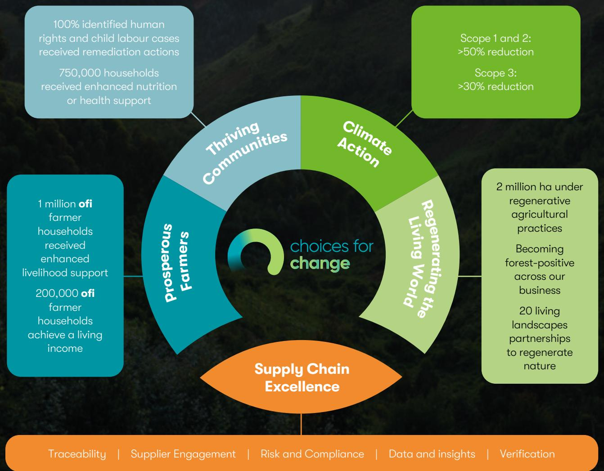

# Designing Choices for Change

To ensure the strategy aligns with stakeholder expectations and meets rapidly changing regulatory requirements, we used a comprehensive double materiality assessment to identify our most material topics. This identified economic opportunity, human rights, climate change, ecosystems and biodiversity, and traceability as the areas where we can have the greatest impact, mitigate the largest risks and capitalise on the greatest opportunities. They form the backbone of the Choices for Change strategy. Choices for Change also integrates learnings from the successes and setbacks of programmes and partnerships spanning hundreds of farming communities across our products and origins over the last two decades.

# Our ambitions and targets

Through our local businesses across the globe, we seek to enhance farmers' livelihoods, safeguard human rights, achieve net zero greenhouse gas (GHG) emissions by 2050, and regenerate the living world in farming landscapes. We have set impactful targets for each of these four ambitions, based on the best available data and insights from each product platform. The wide view we take across the value chain means we know how to set targets that deliver interconnected benefits – farmer livelihoods influence every link of the chain, from safeguarding children's rights to restoring the ecosystems that regulate global climate.

Critically, we have taken a highly structured approach to how we will deliver these targets – outlining in each pillar our action plan to achieve impact. Our progress is supported by a suite of policies, specialist manuals, digital tools, as well as verified traceability, data and insights supplied through AtSource.

ofi Industry ESG

# Top Rated

by Sustainability

# Launching Choices for Change

A strategy alone is not enough. Bringing together partners from across our value chain, from employees in our operations to farmers in the fields, is vital to delivering change. Throughout 2024, we worked hard to bring Choices for Change to life and give it meaning for the day-to-day lives of those who have a role to play in delivering it.

During the development of the strategy, we consulted with a range of stakeholders, including some of our largest customers, to check alignment with their expectations and ambitions. At the launch, we were joined by representatives from some of our sustainability partners including Mars and the Sustainable Food Lab, to present the strategy and its genesis to a wide range of stakeholders through a virtual event with Innovation Forum, a specialist stakeholder engagement platform for sustainability. Our Chief Sustainability Officer, Roel Van Poppel, and Global Head of Sustainability Impact, Dr Christopher Stewart, shared further detail on Innovation Forum's weekly podcast in September.

Supporting our teams to understand and get behind the sustainability goals that we are striving to achieve, is critical. We run webinars to share the strategy with employees across geographies and functions. Our global intranet hosts a wide range of resources on Choices for Change and our action plans for delivering our targets. These are supported by a suite of handbooks launched last year by our central sustainability experts, to provide origin teams with guidance and practical tips on implementing programmes on low-carbon coffee, regenerative agriculture, and women's inclusion, with more in development.

# The foundations for delivering change

Enabling better choices to be made, right across the value chain, is the essence of this strategy. Our presence in the heart of farming communities and our deep, collaborative partnerships with customers enable us to create real impact across the supply chain, while catering to increasing reporting and compliance requirements. Choices for Change will help us deliver our ultimate ambition: to be the preferred partner for positive change for every stakeholder in our value chain, from plant to palate.

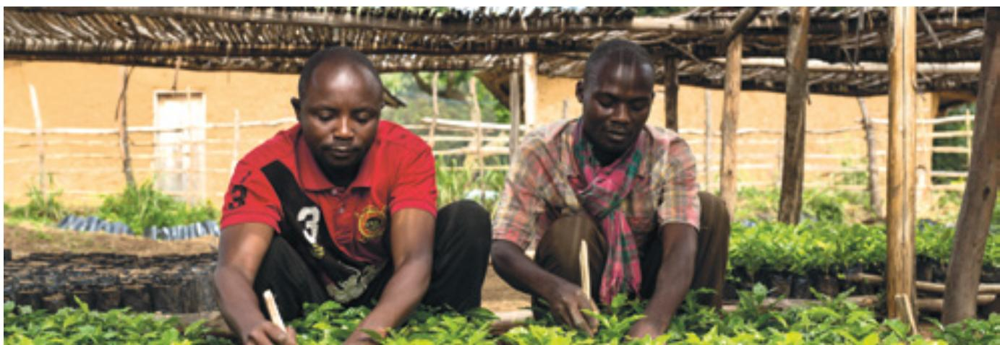  
Tending saplings in a coffee nursery

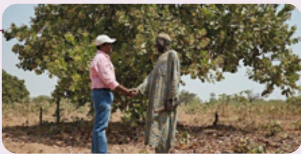

1989

to 2000

# Started as a natural part of doing business

- Engaging with farming communities who gave us the ‘licence to operate’ locally in our origins.  
- Strengthened direct relationships with smallholder farmers.  
- 'Do good' and 'do good business'.

# 2000 to 2011

# Embedding 'mutuality'

- Unlocking mutual value across supply chain.  
Focus on expertise.  
- Birth of 'Corporate Responsibility & Sustainability'.  
2004: First documented customer 'sustainability' programme initiated by Cocoa in Indonesia.  
2010: Launched award-winning Olam Livelihood Charter.

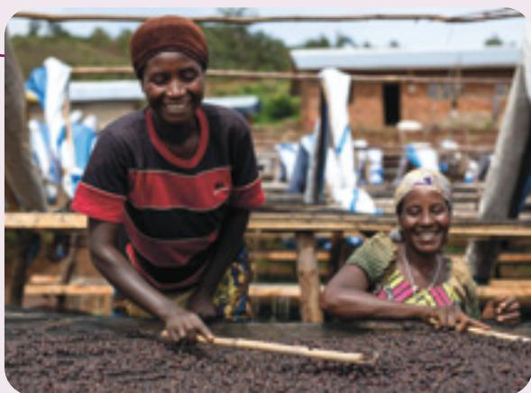

# 2011 to 2020

# Launched Purpose: 'growing responsibly'

- Multiple customer-led programmes launched, amid increased desire for third-party certifications.  
2015: Launch of digital farmer information tool, OFIS.  
2017: Launch of digital traceability tool, Olam Direct.  
2018: Developed award-winning AtSource sustainable sourcing solution to support customers' sustainability journeys.  
2019: Launched first dedicated sustainability strategy, Cocoa Compass.

# 2020 onwards

# Preferred partner of choice for positive change

- ofi's Purpose is to 'be the change for good food and a healthy future'.  
- 2024: Launch of Choices for Change, our cross-enterprise sustainability strategy, and 2030 targets to deliver impact at scale and be the 'partner of choice for positive change'.

# Placing sustainability at the heart of the ofi business

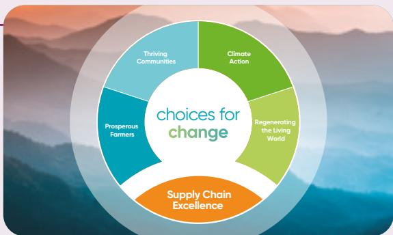

# Striving for a food- secure future

Transforming food, feed and fibre for a more sustainable future

Our products

Grains & oilseeds

Wheat milling & pasta

Edible oils

Rice

Specialty grains & seeds

Animal feed & protein

Cotton

Rubber

Wood products

Risk management solutions

Freight

Sugar & bioenergy

10,000+

employees

10,600

customers

$^{\text{A}}$  primary workforce

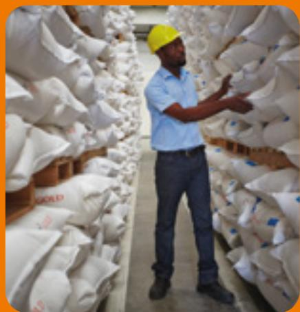

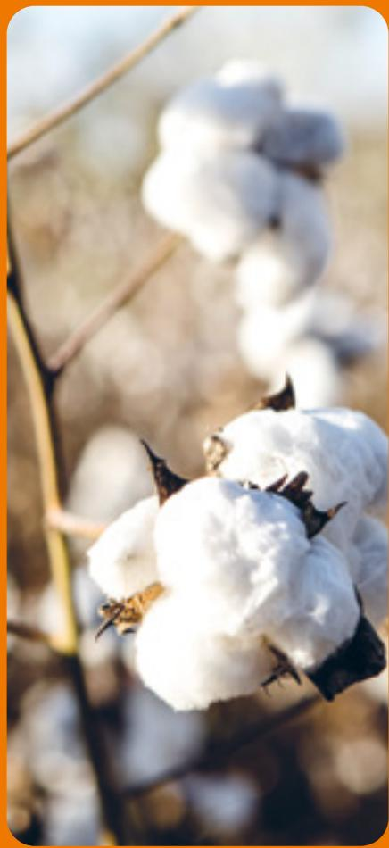

64

Tier 1 and 2 facilities

45.1 m

metric tonnes handled

S$33.2 bn

in revenue  
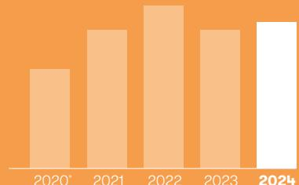  
* 2020 financial results for operating groups have been restated to reflect intra-group adjustments

Olam Agri is a market-leading and differentiated global food, feed and fibre agri-business, focused on high-growth emerging markets with a proven track record of delivering high growth, high capital efficiency and high returns.

Our products and services include grains and oilseeds, wheat milling and pasta, animal feed and protein, edible oils, rice, specialty grains and seeds, cotton, wood products, rubber, sugar and bioenergy, freight and risk management solutions. We unlock value for customers, enable farming communities to prosper sustainably and strive for a food-secure future.

# Transforming food, feed and fibre to cultivate a sustainable and food-secure future

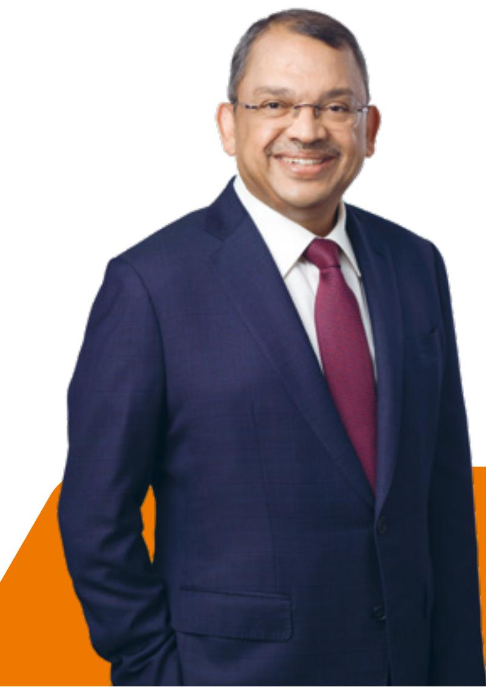

66 Olam Agri has sustained its growth momentum, and we continue to profitably grow in each of our three business segments. Together with SALIC, we expect to further deliver on our shared vision and focus on sustainable sourcing to meet the rising demand for food, feed and fibre across key markets. 99

Sunny Verghese

Executive Director,

Co-Founder & CEO

# Key highlights

Volume

45.1 mMT

+14.0%

Sales Revenue*

S$33,171.4 m

+5.9%

EBIT*

S\(1,023.8 m

+5.8%

Invested Capital

S$6,720.4 m

+23.1%

Customers

10,600

Employees^

10,000+

$\hat{\Lambda}$  primary workforce  
* Excludes exceptional items

# 2024 performance

Olam Agri is a market-leading and differentiated global food, feed and fibre agri-business, focused on high-growth emerging markets. We have a proven track record of delivering high growth, high capital efficiency and high returns. Our products and services include grains and oilseeds, wheat milling and pasta, animal feed and protein, edible oils, rice, specialty grains and seeds, sugar and bioenergy, cotton, wood products, rubber, freight management and commodity financial services. We unlock value for customers, enable farming communities to prosper sustainably, and strive for a food-secure future.

Olam Agri maintained its growth momentum in 2024 with higher sales volumes and operating profit (EBIT), despite persistent headwinds of high interest rates, currency volatility and economic slowdown in key markets.

Sales volume grew  $14.0\%$ , representing a 5.5 million metric tonne (MT) increase to 45.1 million MT in 2024, up from 39.5 million MT in 2023. A high volume growth from Food & Feed – Origination & Merchandising led to this increase. Revenues grew by  $5.9\%$  to S\ $33.2 billion in 2024, from S\$ 31.3 billion in 2023, due to lower prices for most commodities.

EBIT grew  $5.8\%$  year-on-year to S $\$ 1,023.8$ million in 2024 from S $\$ 967.7$ million in 2023, led by a  $32.2\%$  growth in Fibre, Agri- industrials & Ag Services. Even with volumes growing at  $14.0\%$ , EBIT per MT was only marginally lower from S $\$ 24$ in 2023, remaining strong at S $\$ 23$ in 2024.

Invested capital grew by  $23.1\%$  or  $\$ 1.3$ billion to reach  $\$ 6.7$ billion as at end- 2024 with additions across all segments and the bulk of the increase was for working capital investment, resulting in a decline in EBIT/IC to  $16.8\%$  in 2024 from  $18.3\%$  in 2023.

The economic, financial, trade, regulatory and climate-related challenges facing global agribusiness means agility, collaboration and entrepreneurialism are needed to navigate the shifting landscape. At the same time, opportunities for growth abound and we can capitalise on these, thanks to our first-mover advantage in the highest-growth consumption markets for food, feed and fibre where rising population growth, changing dietary preferences and a greater focus on nutrition and food security are propelling demand.

# Operational highlights

We continued to focus on growth across our three business segments - Origination & Merchandising, Processing & Value-Added and Fibre, Agri-industrials & Ag Services. Our operating capabilities, asset-light model in origination and merchandising, and market understanding, particularly in high-growth markets across Africa, Asia and the Middle East, enabled us to continue to meet the demand for food, feed and fibre against shifting global trade flows.

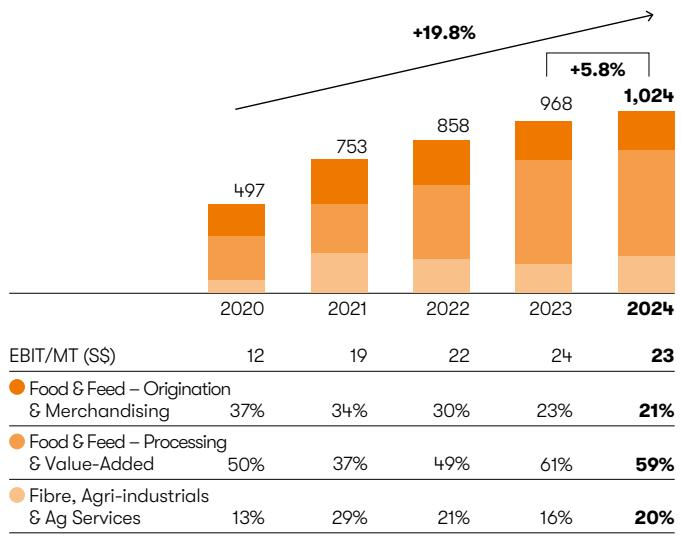  
Earnings Before Interest and Tax* (S$ million)  
1,024

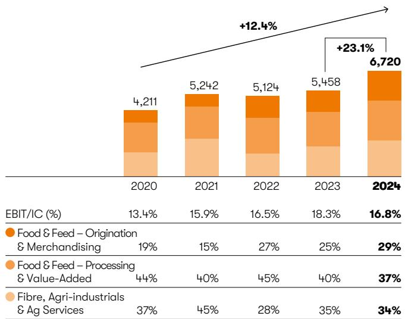  
Invested capital" (S$ million)  
6,720

# Manufactured Capital: Meeting the growth in demand for feed and protein in Africa

In 2024, we continued to strengthen and expand our animal feed and protein capabilities with the acquisition of Avisen SARL in Senegal.

Its high-quality products, efficient distribution network and technical advisory services for farmers have established it as one of the country's leading poultry feed suppliers. This extends our feed and protein presence in West Africa, while generating synergies with our wheat milling business in Senegal. Since the completion of the acquisition, the business has seen strong growth, which is expected to continue, due to rising market demand for high-quality feed amongst farmers. In addition, we are supporting fish and poultry farmers (downstream) on best practices linked with water quality, hygiene and animal health, thereby enhancing the profitability of our farmers.

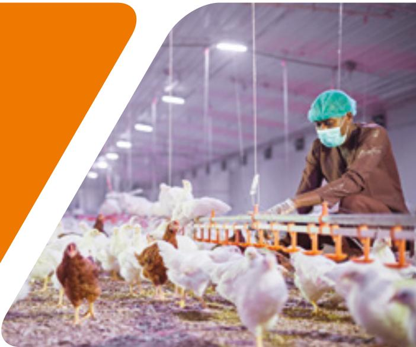

We announced the completion of the acquisition of Avisen SARL in March 2024 for approximately US$22 million. The acquisition of Avisen, one of Senegal's major feed suppliers, aligns with our strategy to strengthen and expand our animal feed and protein capabilities. It also extends our feed and protein presence in West Africa, where we are one of the leading animal feed and day-old chick producers in Nigeria. In addition, the acquisition offers synergies with our wheat milling business in Senegal, and allows us to improve the quality and cost efficiency of products for the Senegalese market.

Our soybean processing facility in Kwara State, Nigeria became operational in the second half of 2024. The 250,000 MT facility is integrated with our existing animal feed operations. Sourcing soybeans solely from local producers, the facility enables us to meet the rising demand for high-quality feed and oil, while supporting local farmers, strengthening agricultural development in the region, and ensuring local food security.

In September 2024, we commenced constructing a state-of-the-art pasta production facility at our wheat milling factory at Kpone near Tema, Ghana. The facility will expand our current consumer flour and rice product portfolio in Ghana, to support the growing demand for locally produced products and ensuring local food security.

Our wheat milling & pasta business unveiled a new addition to its growing line up of premium food products. Mama's Pride macaroni was launched in Nigeria, building on the success of Mama's Pride spaghetti, which debuted the previous year. These products underscore our commitment to delivering nutritious, high-quality, affordable food products and improving nutrition and food security.

In Côte d'lvoire we opened our third cotton gin, in Kong, which further expands our capacity in the country. It strengthens our commitment to the cotton sector, offering farmers greater access to quality infrastructure and services, and reliable market access.

Our employees remain central to our growth and success. We are committed to a safe and inclusive workplace that values and respects each employee. Developing and strengthening our culture is fundamental to this. Throughout the year, we initiated the rollout of a series of employee workshops to embed our Purpose, values and behaviours, alongside the relaunch of our signature leadership programme Building Winning Business Models. We launched our new employee value proposition – Freedom to Transform – to inspire and empower our employees to make positive impacts to grow our business and fulfil our Purpose. We continue to regularly listen to and engage with our employees. This year, we launched a refreshed digital channel, The Loop, to promote greater communication, collaboration and engagement for employees.

We continued to step up our focus to achieve a zero-incident culture to ensure that everyone in our business strives so they and their colleagues can go home safely every day. This year saw a considered impetus in instilling 'See it, Say it, Stop it' across all our locations through on-site programmes and initiatives. One such initiative included the launch of the Fleet Safety League in Nigeria to help eliminate vehicle-related safety incidents. Technology-led through the use of installed Al cameras and GPS-tracking systems, it improves the safety and health of our people and the efficiency and reliability of our delivery processes. During the year, we demonstrated our commitment to safety with a significant safety milestone at our soybean processing facility construction project, which clocked up 500,000 safe hours – the equivalent of over 20,833 days, or just over 57 years.

Read more in the Safety and health section of this report on pages 127 to 129.

Our commitment to food quality and safety remains unwavering, as we worked to enhance our practices further and strengthen processes and procedures across our operations. Our focus on food safety and quality extended beyond our own operations by assessing the performance of suppliers, as well as supporting initiatives to improve standards in the sectors we serve, such as through the Grains Hygiene Standard Management (GHSM) programme in Ghana. The programme includes workshops, training sessions, and incentive schemes to promote adherence to hygiene standards and food safety, supported by standardised hygiene evaluations and third-party controllers who provide support and ensure compliance.

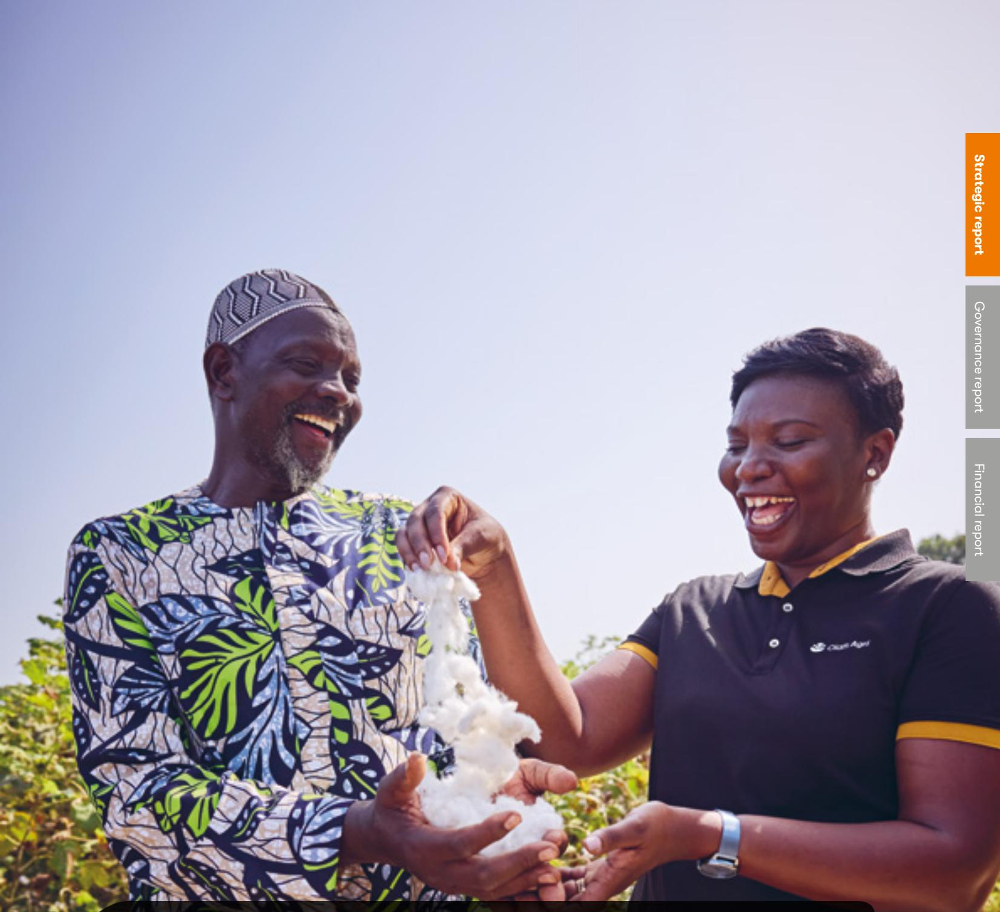

# Intangible Capital: Freedom to Transform

At Olam Agri, we are committed to creating a workplace where employees thrive, grow and make meaningful contributions to a sustainable future. Our newly defined Employee Value Proposition (EVP) focuses on three core pillars: Culture, Career and Contribution, which guide everything we do.

This holistic approach to employee growth and development has been recognised by the Top Employers Institute, which named Olam Agri a Top Employer in ten countries, including Cameroon, Côte d'lvoire, Ghana, Mozambique, Nigeria, Senegal, South Africa, Australia, the Netherlands and Switzerland. We are also honoured to be recognised as a Top Employer in Africa for the fifth consecutive year. This achievement reflects our dedication to creating an empowering environment where employees feel supported, valued and able to contribute meaningfully to both the company's success and the wider industry.

The recognition from the Top Employers Institute affirms our ongoing commitment to excellence in people practices, from creating an inclusive culture to offering career development opportunities that align with our people's aspirations. We aim to create an environment where our employees can thrive, innovate and contribute to a sustainable future.

# Growing our position as a global agribusiness

In February 2025, Olam Group announced an agreement to sell  $44.58\%$  in Olam Agri to the Saudi Agricultural and Livestock Investment Company (SALIC) for approximately US$1.78 billion (S$2.35 billion) at an implied  $100\%$  equity valuation for Olam Agri of US$4.0 billion. SALIC will own a controlling  $80.01\%$  stake in Olam Agri, which will cease to be a subsidiary of Olam Group.

Olam Group will also sell its remaining  $19.99\%$  stake in Olam Agri to SALIC at the end of three years from completion of the above sale at the closing valuation plus  $6\%$  Internal rate of Return (IRR). Olam Agri will then become a wholly owned subsidiary of SALIC.

The  $100 \%$ implied valuation for Olam Agri reflects a  $14 \%$ premium to the US $\$ 3.50$  billion (S $\$ 4$ .30 billion) valuation at the time of SALIC’s initial purchase of its  $35.43 \%$ stake in December 2022. It also represents a  $3.47 \times$ price- to- book value multiple to Olam Agri’s book value of US $\$ 1.15$  billion as of 31 December 2023.

The sale is a significant and exciting step for Olam Agri, strengthening our position as a differentiated global agribusiness and becoming a sustainable and fully integrated food security leader, to meet the rising demand for food, feed and fibre.

Since SALIC's investment, our partnership has unveiled new avenues of growth and potential synergy.

With its strategic mandate in respect of food security and complementary strengths, SALIC and Olam Agri share the same focus on sustainable sourcing and commitment to supporting the world's need for agricultural products.

It will enable us to strengthen our position as a differentiated global agribusiness and become a sustainable and fully integrated food security leader. We are also bolstering our capabilities to create value for customers, enable farming communities to prosper sustainably, and meet the changing needs shaping the global food and agricultural landscape.

Our expertise in sustainable agriculture practices aligns with Saudi Arabia's ambitions to enhance agricultural productivity and domestic agri food capabilities, providing further business growth opportunities.

Our framework for growth continues to focus on four areas:

- Products - leverage our expertise in origination and merchandising to identify new and adjacent products, crops and services that share customers, channels, costs and capabilities with our existing businesses.  
- Capabilities – strengthen and expand our mid-stream value-added processing and manufacturing capabilities, as well as selective upstream farming and downstream packaging, branding, distribution and freight capabilities; use operational excellence, market insights, digital technologies and data analytics to drive additional offerings and value.

- High-growth markets - identify opportunities for selective entry into new origination countries and destination markets by building on our current knowledge, operational expertise and capabilities to expand our businesses, particularly in high-growth regions in Africa, the Middle East and Asia.  
- New businesses - expand into complementary businesses, pinpointing prospective opportunities that allow us to take advantage of the strengths, knowledge and know-how of our current businesses.

# Food & Feed - Origination & Merchandising

Food & Feed – Origination & Merchandising reported normalised sales volumes of 37.3 million MT in 2024, a  $12.3\%$  growth over 33.3 million MT in 2023 on volume increases across grains & oilseeds, edible oils and rice. Revenues were up  $5.1\%$  as lower grain prices offset volume growth. EBIT for the year was fairly flat at S $\$ 221.7$  million (2023: S $\$ 224.4$  million) with EBIT per MT at S $\$ 6$  (2023: S $\$ 7$ ) tracking within the historical range of S $\$ 5$ -8 between 2020 and 2023.

Invested capital grew by  $42.8\%$  or  $\$ 576.8$ million to  $\$ 1.9$ billion as at end- 2024 (2023:  $\$ 1.3$ billion). This came largely from the working capital increase due to higher volumes and elevated prices in edible oils and rice. EBIT/IC declined from  $16.4\%$  in 2023 to  $13.5\%$  in 2024.

Traded volumes for grains & oilseeds were higher compared to 2023, thanks largely to steady demand from our strong global customer network.

There was strong performance from edible oils on buoyant market conditions and firm prices, underpinned by robust demand in India and Southeast Asia. Our expansion in the edible oils market was a notable development, marking a significant step in our growth strategy. Our expanded portfolio created new revenue streams with new suppliers added in Southeast Asia, significantly improving our market position to a leading merchant in Asia. We are now the number one supplier of palm oil in India and Bangladesh, and among the top three in Pakistan. Strengthening our edible oil capabilities was well-received by existing customers, particularly in Asia, Africa, and the Middle East, where we already have a strong presence across several agriculture value chains. Our sourcing strategy is underpinned with sustainability-linked due diligence before any on-boarding, ensuring quality and consistency, which has contributed to high customer interest.

The rice trading business shipped higher volumes in 2024, but on normalised margins compared with an exceptional performance in 2023, when the business was favourably positioned to capitalise on the market's pent-up demand following India's non-basmati rice export restrictions. These restrictions have since been lifted from September 2024. The business successfully pivoted to Vietnam and Thailand, the two largest exporters of rice after India, as was other producing origins in Southeast Asia. This ensures a steady supply of rice to meet the high demand in emergi markets in Asia and Africa. We continue to be the largest exporter of rice from India and have improved our market share despite the shift in trade flows.

We also continue to explore opportunities to strengthen our position as a leading rice exporter globally, and to look at further backward integration into major rice-producing regions in Asia, to ensure better control of availability and quality, as well as to increase margins.

The freight business, which was adversely impacted by the industry downturn during the first half of the year, saw improved performance in H2 2024, as freight rates recovered and freight trading operations restructured to reduce exposure to Capsize vessels. Notwithstanding the recovery, the ocean freight market remains volatile due to ongoing challenges from route diversions and geopolitical uncertainties such as the Middle East conflict, as well as potential new challenges from trade disruptions.

Digitalisation continued to play an important role in our operations. Ongoing efforts to integrate digital solutions into various aspects of the business contributed to improved efficiency and better decision-making. These initiatives included enhancing supply chain management, improving customer interactions, and leveraging data analytics for strategic insights. The integration of digital tools ensured we remained agile and responsive to market dynamics.

Operationally, the focus will be on maintaining our momentum. This includes continuing to optimise supply chains, improving operational efficiencies, and leveraging digital tools to enhance performance. Our strong network in key regions is a critical asset, providing a stable base for growth and expansion, and ensuring we are well-positioned to navigate the challenges and opportunities to drive continued growth and value creation.

Our increased market presence in the edible oils market and the emphasis on sustainability provide a strong platform for future growth. We plan to build on these successes by exploring further opportunities within edible oils, potentially expanding our product range and exploring new geographical markets.

Sustainability will continue to be a guiding principle, with ongoing efforts across our operations. In our soy supply chain, we continue to work closely as a sector alongside other global agricultural trading and processing organisations, producers and downstream partners to increase transparency and find sustainable solutions to tackle deforestation in high-priority biomes.

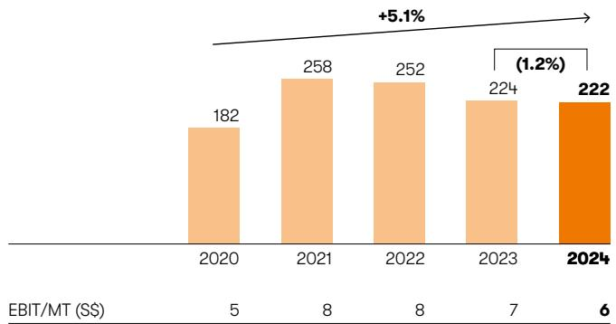  
Earnings Before Interest and Tax* (S$ million)  
222

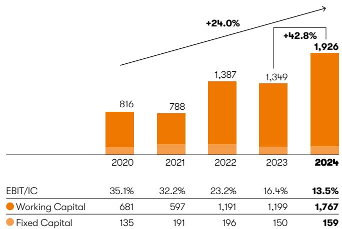  
Invested capital" (S$ million)  
1,926

# Manufactured Capital: Strengthening food security in Africa

To meet the growing needs from rising population, changing consumer preferences and focus on food security, we are supporting a number of strategic initiatives in Africa.

In Ghana, we are building a state-of-the-art pasta production facility at our wheat milling facility in Kpone, near Tema, which will manufacture high-quality, affordable, and nutritious pasta products for consumers in Ghana. As well as supporting local agricultural production by sourcing and milling local wheat, it will reduce the country's reliance on imported products.

In Nigeria, we have partnered with Lake Chad Research Institute to launch 'Crown', a heat-tolerant and super-early durum wheat variety. Tailored to thrive in local climatic conditions, particularly during the harmattan season, this breakthrough variety is empowering women-led cooperatives through comprehensive training, financing, and seed multiplication programmes. Building on these efforts, we have also introduced Mama's Pride macaroni, expanding our successful product range to provide more nutritious, affordable options for Nigerian households.

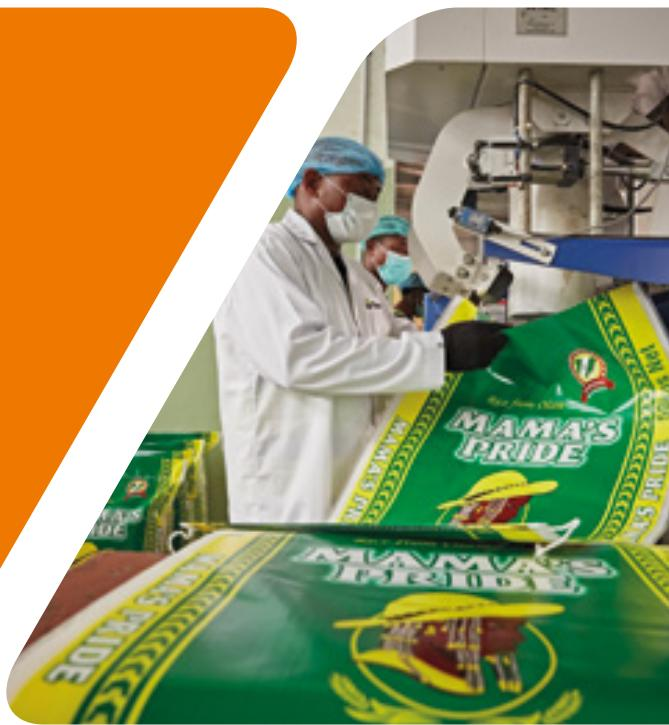

# Food & Feed - Processing & Value-Added

Food & Feed – Processing & Value-Added recorded robust year-on-year volume growth of  $26.8\%$ , with increased contributions from most businesses. However, revenues grew only marginally in 2024, due to the impact of the Naira depreciation on sales of wheat flour, pasta and animal feed in Nigeria, as well as lower sales volumes and revenues from rice distribution and farming.

Nonetheless, the segment posted a higher EBIT of S\ $601.0 million for a year characterised by sharp currency devaluations and high inflation in key consumption markets, compared to its exceptional performance in 2023 (2023: S\$ 591.2 million). EBIT per MT pulled back to S\ $115 (2023: S\$ 143) due to higher volumes in 2024.

Invested capital rose by  $14.3\%$  or  $\$ 314.4$ million to  $\$ 2.5$ billion as at end- 2024. While fixed capital was increased due to our investments in Senegal, soy crushing in Nigeria and acquisition of the edible oil processing asset in Mozambique from the Remaining Olam Group, the bulk of the growth in invested capital was due to working capital growth from higher rice inventory and edible oil processing in Mozambique. Nevertheless, EBIT/IC remained high at  $25.5\%$  in 2024 $^{4}$  against the peak of  $26.3\%$  in 2023.

The wheat milling and pasta business led the growth with normalised margins in 2024, reflecting our successful control and pass-through of input costs. In addition, the stabilisation of the Naira in H2 2024 further supported demand. With operations in Nigeria, Ghana, Cameroon and Senegal, the business performed strongly, recording one of its best ever years in terms of both sales volumes and revenues. While lower input prices benefitted the business, the strong focus on our baker customers was also a determining success factor. Attention to product quality, service excellence and consistency in delivery ensured strong customer loyalty.

This enabled the business to increase its customer base further and cement its position as the provider of the highest-quality flour across all four markets.

We are actively exploring opportunities to grow our presence in value-added wheat-based products like semolina flour and pasta across these markets.

We continue to work closely and strengthen our relationships with customers and suppliers across our businesses and markets. We hosted forums with our grains customers in Nigeria, as our flour, pasta and semolina brands continue to lead key categories, thanks to the support of customers in bakeries and retail stores. Our in-person and online support to baker customers, including our dedicated app, allows us to reach thousands of bakers in West Africa, providing them with access to information to improve baking practices, profitability and business management. Our My Healthy Baker initiative is helping to improve the health and wellbeing of bakers, and enhance food safety within the communities they serve.

The integrated feed & protein business reported stronger earnings despite facing higher costs of feed production during the year. The acquisition of Avisen, the second largest poultry feed supplier in Senegal, contributed to EBIT growth. The successful integration of Avisen saw its capacity utilisation quickly ramp up from its original 100,000 MT at acquisition. The strong demand for high-quality feed will see the business move to expand into adjacent feed varieties, which will enable us to capture new market opportunities and further strengthen our presence in the animal feed industry, as we continue to grow both our poultry and fish feed businesses in Nigeria.

In the fourth quarter of 2024, the feed and protein business started operations at its 250,000 MT soybean crush processing facility in Kwara State in Nigeria. The facility integrates with our existing animal feed operations and sources soybeans exclusively from local farmers to enhance productivity. This will strengthen the availability of input for the integrated feed and protein business, while driving soybean production, a highly profitable cash crop, in and around Kwara State providing farmers with an opportunity to improve their livelihoods. In partnership with the Kwara State government, we have donated soybean threshing machines to farmers in Baruten to enhance efficiency and help farmers achieve higher yields.

The edible oils processing business also contributed to earnings growth due to its enhanced performance in South Africa and acquisition in Mozambique.

Rice, specialty grains & seeds came in lower than 2023, as demand for rice in Africa was affected by inflationary pressures and higher prices, particularly in Ghana due to its currency devaluation and intense competition among local players. Notwithstanding, we retained our position as a leading rice merchant in Africa. We were delighted that we were once again honoured as the Best Bulk Food Importer of Rice in Cameroon by the Port Authority of Douala (PAD), marking our third consecutive year of receiving this esteemed accolade. This award underscores our commitment to importing high-quality rice brands that cater to the diverse needs and preferences of consumers throughout the country.

Our rice business aims to deepen our penetration into the African market, which remains one of the largest consumer markets for rice. By increasing our presence in these markets, the business will be able to capitalise on the high demand thanks to growing populations and a burgeoning middle class. This strategy involves not only increasing volumes but also ensuring a significant portion of the rice is processed internally, thereby improving margins and maintaining a competitive edge.

Strong sustainability programmes in rice are a critical aspect of our strategy, which has enabled us to increase our market share in the European and American markets. We made significant strides in this area, focusing on private labels and sustainable rice supply. This approach has not only helped in growing volumes but also in improving margins. The commitment to sustainability means we are well-placed to fulfil the increasing demand for ethically sourced and environmentally friendly products in these markets.

In our specialty grains & seeds business, our quinoa and chia businesses continue to enjoy healthy demand in developed markets, primarily in North America. We are expanding the sourcing of chia in Paraguay which is the leading exporter of this superfood globally.

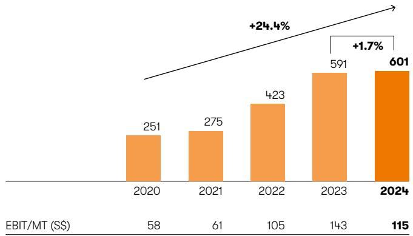  
Earnings Before Interest and Tax* (S$ million)  
601  
Invested capital" (S$ million)

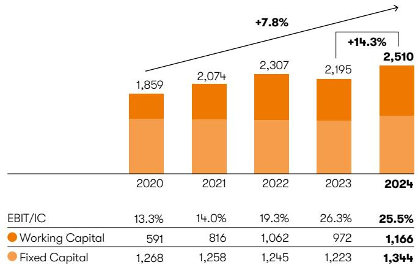  
2,510

# Fibre, Agri-industrials & Ag Services

Fibre, Agri-industrials and Ag Services posted sales volume growth of  $15.9\%$  with all businesses reporting improved volumes, except wood products. Revenue grew by  $13.2\%$  in 2024. The segment achieved higher EBIT, growing  $32.2\%$  over 2023 to S\ $201.1 million in 2024 (2023: S\$ 152.1 million). EBIT per MT recovered to S\\)81, up from S\\(71 in 2023.

Invested capital increased by  $19.4\%$  or  $\$ 371.6$ million to  $\$ 2.3$ billion at end- 2024, primarily on higher working capital due to a change in the product mix in favour of rubber and wood, which have shifted towards higher value-added production. There were also larger cotton receivables due to a temporary shortage of foreign exchange in consumption markets in South Asia. Fixed capital also had a moderate increase from our expansion into sugar milling and bioenergy production in India, and enhanced rubber and wood processing capacities in Côte d’Ivoire and the Republic of Congo respectively. EBIT/IC improved to  $9.6\%$  in 2024 from  $9.1\%$  one year ago.

Rubber was a lead performer, enhanced by its increased processing capacity which came onstream in H2 2023. Firm rubber prices, strong trading margins in Asia on account of supply constraints in key producing countries like Thailand and Vietnam, and high demand for traceable and sustainable rubber across Europe and emerging Asia where we have set up new marketing offices, also supported growth.

Volumes in rubber rose by more than  $60\%$  year-on-year, far exceeding market growth. We saw a significant expansion in traded volumes in Asia, which has grown to account for more than half of our traded volumes within the last two years. We intend to continue to expand our presence in Southeast Asia, notably in Indonesia, Vietnam and Thailand.

In H2 2024, EUDR compliant rubber accounted for more than  $65\%$  of volumes shipped to customers from our production in Côte d'lvoire. We were also able to trade EUDR-compliant rubber from our partner's facility in Indonesia, which marks a significant milestone in a difficult geography with a very long supply chain. The strong systems and processes we have established mean we are already able to fulfil EUDR requirements for customers, with demand expected to grow as the regulations come into force from December 2025. We are investing to expand our rubber processing capacity, which will see an additional facility come into operation by Q1 2025, offering us greater scope to meet the growing demand for ethically sourced natural rubber.

In partnership with Deutsche Gesellschaft für Internationale Zusammenarbeit (GIZ) GmbH, we launched two new initiatives to promote sustainable rubber production, compliant with international requirements, while also enhancing the livelihoods of smallholder farmers. In Indonesia, the land of 42,000 farmers will be mapped via polygon mapping, to facilitate transparency and traceability across the rubber supply chain. 2,000 farmers will receive training on Good Agricultural Practices (GAP), support for legal registration of their land, and support with strengthening their farmer organisations. We will also be contributing to forest preservation and High Conservation Value areas. In Côte d'lvoire, 1,575 rubber community members will receive support for the development of income-generating activities, access to GAP and rubber market information, and the creation of two green tapping schools. 75 cooperatives will be trained on EUDR and zero deforestation, and 300 women community members will be empowered and helped to develop their own activities.

# Intangible Capital: Uplifting the baking community in Africa

For generations, baking has been a livelihood and a cherished craft across Africa, with the potential to transform lives and uplift entire communities. As Africa's largest wheat miller, Olam Agri has been at the heart of this transformation, supporting around 20,000 bakers in West Africa (Nigeria, Ghana, Cameroon and Senegal). Working alongside bakers, we are nurturing talent, fostering entrepreneurship and creating lasting change that extends far beyond the bakery.

In Ghana, our 'Big Baker' project, launched in September 2024, has already reached over 250 underprivileged children in Accra, providing essential baking skills and mentorship. Our 'My Healthy Baker' programme is a nationwide programme aiming to provide vital health screenings to over 6,000 bakers, setting new standards for health practices and food safety across the industry.

In Nigeria, 140 women graduated from our Crown Flour Angels baking academy in 2024, bringing the total number of women trained to over 700 since its launch in 2021. The academy empowers and equips women with practical skills, providing pathways to entrepreneurship, financial independence and food security.

Despite a lower topline, wood products held up well, as it shifted focus from primary to value-added secondary products through certified and EUDR-compliant timber, and compensated for the loss in income from log exports which ceased following the Republic of Congo's ban on such exports. The business also benefitted from enhanced value-added capacity in its operations during the year.

Following slower market demand in the first half of the year, demand was restored in H2 2024 and we were able to capitalise on this through strong customer relationships, and secured several new contracts for 2025.

Operational efficiency was a cornerstone of the wood business's success. We achieved significant operational savings despite rising costs and limitations on the supply of fuel. This was a critical market advantage through the year which will continue to help us meet customer demand.

Our strong ability to offer FSC®-Certified® wood products that meet stringent sustainability standards, remains a determining factor in differentiating ourselves to retain customer trust. This is increasingly important as customers seek to achieve certified and sustainably sourced products, as well as to meet the requirements of the forthcoming EUDR. We have put in place a new customer portal which will streamline EUDR due diligence documentation access and integrate with the EU's portal. Along with our FSC® certification®, this will ensure customers have information for full chain-of-custody traceability from forest to final product.

The cotton market remained subdued throughout 2024, with declining prices and growers at origin delaying sales. Our key markets in South Asia, China and Turkey continued to face weak downstream demand and a slowdown in consumer spending, leading to textile mills operating below optimal capacity. However, signs of political and economic stability in Bangladesh and Pakistan in H2 2024 contributed to a recovery in demand and an uptick in volumes. While overall cotton volumes increased compared to the previous year, supply chain margins remained under pressure due to prevailing macroeconomic challenges.

In Australia, we maintained our strategic focus on expanding market share in New South Wales, while consolidating our position amongst the leading cotton merchants, optimising turnover and capacity utilisation of our ginning and warehouse assets. In the U.S.A., demand was relatively soft in the first half of the year due to higher export volumes from Brazil and Australia, but showed a strong recovery towards the end of 2024. Brazil's crop expansion enabled greater market participation in an intensely competitive environment.

Our commitment to sustainability was reflected in our continued efforts to expand the volumes of sustainably sourced cotton. The Better Cotton Initiative (BCI) and regenagri® programmes saw strong initial progress, particularly in the U.S.A. and Africa. These initiatives remain integral to our long-term strategy, aligning with global shifts toward sustainable and responsible sourcing.

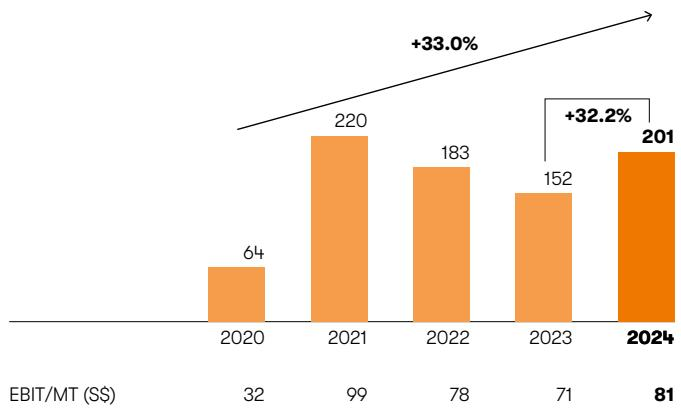  
Earnings Before Interest and Tax* (S$ million)  
201

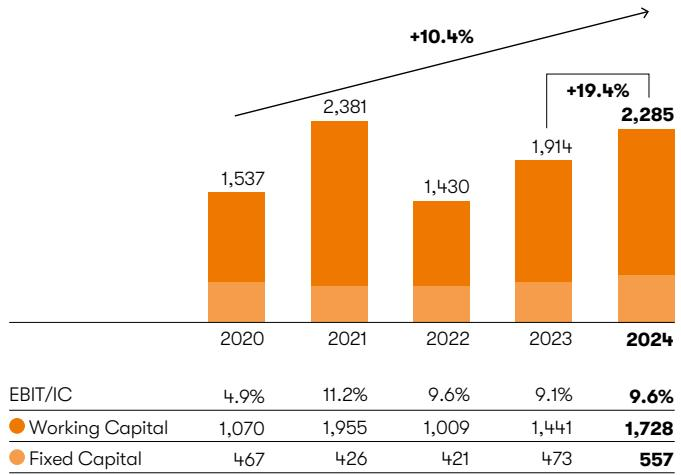  
Invested capital" (S$ million)  
2,285

Commodity Financial Services outperformed in 2024, driven by a significant increase in third-party volumes. This growth was broad-based across various markets and was further supported by the successful expansion into foreign exchange solutions in Brazil and the Middle East. The sugar milling assets which were transferred from the Remaining Olam Group in H2 2023 recorded their first full year of contribution in 2024.

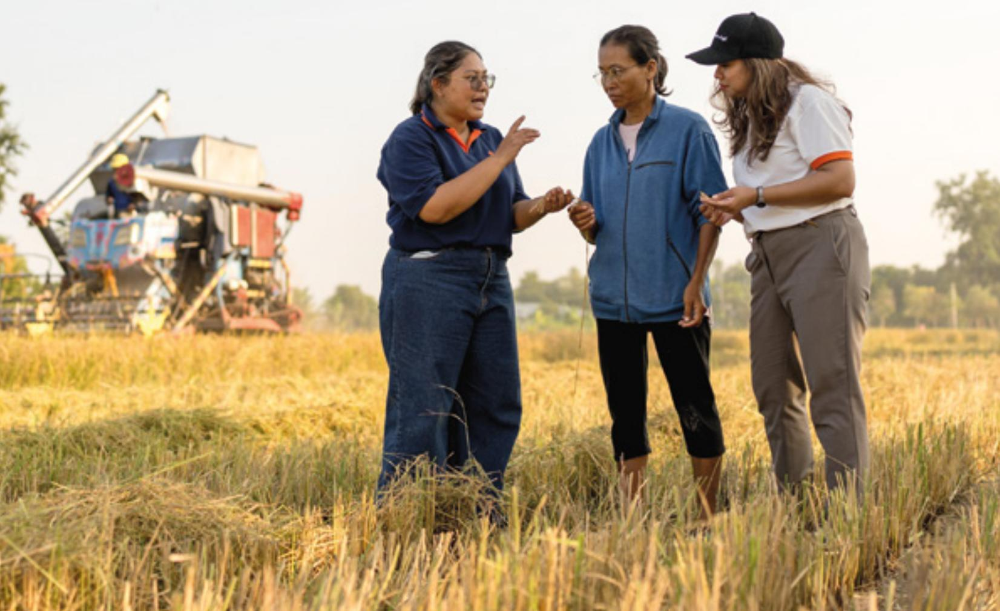

# Strengthening our partnership with GIZ

We reinforced our 15-year partnership with GlZ by signing a new Memorandum of Understanding (MoU) in 2024. This collaboration will further support sustainable, inclusive and climate-resilient agricultural systems in rice, cotton and rubber supply chains across developing markets in Asia, Africa and Latin America.

Our partnership has successfully transformed the rice supply chain to be more sustainable in key regions in Asia. Working alongside the Global Environment Facility, Green Climate Fund, UN Women and local governments across Thailand, Vietnam and India, we help farmers adopt climate-smart practices, improve livelihoods, and reduce environmental impact while strengthening food security.

The success of these initiatives has created a model for scaling sustainable practices that benefit farming communities and the environment. We aim to continue scaling our rice programmes in Asia and to expand our rice operations in Nigeria, as well as initiatives to support cotton farmers in Chad, Togo, and Côte d'lvoire, and in rubber to improve forest protection and farmer prosperity.

# Sustainability

In 2024, we made good progress in transforming our value chains to be more sustainable, positively impacting both people and the environment. We refined our sustainability strategy to better support the climate transition and regenerate agricultural landscapes as we continue to connect the world to essential commodities and improve access to food and nutrition.

We focused on material topics that are the most relevant to our business and help us activate programmes that bring us closer to our sustainability goals and meet our stakeholders' expectations. This follows an earlier review of our products, business activities, social and environmental contexts, and the potential impact of Olam Agri on sustainability risks and opportunities. We also considered expectations from sustainability certifications, financiers, disclosure frameworks, benchmarks, and peer company strategies.

Our goal is to positively impact the climate, nature, and livelihoods across our value chains as we aim to transform food, feed and fibre for a more sustainable and food-secure future. Ensuring that farming can thrive despite climate change, that nature and ecosystems remain healthy, and that farmers prosper are crucial for the future of our business, which relies on robust, resilient, and sustainable food and agriculture systems.

Our sustainability approach includes the below three cross-cutting workstreams:

- Regenerative agriculture includes efforts to improve soil health, biodiversity, water management, resilience, and viability of farming communities, as well as carbon sequestration.  
- Climate transition involves monitoring our footprint, reducing greenhouse gas emissions in our operations and our value chain, and climate adaptation.  
- Nutrition and food security encompasses our end-to-end work to increase availability, affordability, and access to high-quality nutritious foods for our workforce, smallholder farmers and consumers.

Key enablers include social wellbeing, upscaling efforts, ESG risk monitoring and managing data systems, along with strong collaboration with farmer communities, government authorities, customers, donors and other stakeholders.

# Our SPOTT rankings

$8^{\text{th}}$  out of 100 in timber. Score improved by  $2.3\%$ $27^{\text{th}}$  out of 100 in palm. Score improved by  $2.1\%$

# Dr Hamouda Aichi showing a smallholder farmer the technique for soil testing, Côte d'lvoire

1. SPOTT assesses 100 palm oil and 100 timber and pulp producers, processors and traders on their public disclosures regarding their organisation, policies and practices. Improved score is in relation to 2024 versus 2023

# Regenerative agriculture

Our regenerative agriculture framework aims to transform agricultural practices to enhance soil health, biodiversity, water quality, carbon sequestration and farm profitability. We have based it on six key principles: minimising soil disturbance, keeping the soil covered, maintaining living roots in the soil, favouring organic fertiliser sources, maximising farm diversity and promoting livestock-crop synergies. Together, they create a holistic approach to farming that not only improves the environment but also enhances the wellbeing of farmers and their communities. There are three main phases to ensure a positive outcome: contextualisation and prioritisation, assessment and engagement, and implementation.

In the contextualisation and prioritisation phase, we adapt regenerative agriculture practices to the specific challenges and opportunities of the different regions and value chains. This includes mapping degradation hotspots using remote sensing techniques and soil testing to identify areas where soil health, canopy cover, and other indicators are declining. By understanding the state of the landscapes where we operate, we can prioritise actions with the most significant impact.

The assessment and engagement phase focuses on measuring the positive contributions of regenerative agriculture practices to the environment and climate. We adopt a participatory approach involving farmers, business units, coalitions, universities and other stakeholders. This collaborative effort ensures our regenerative agriculture framework aligns with global standards and sustainability ambitions.

We use practice-based and outcome-based metrics to assess the effectiveness of our strategies.

Implementation is the final phase, where we focus on capacity building and rolling out projects and programmes related to regenerative agriculture. This phase supports the overall framework by providing farmers with the necessary resources and training, and enabling them to adopt regenerative practices effectively. The goal is to create a sustainable farming system that benefits both the environment and the livelihoods of those involved. The regenerative agriculture practices we promote include minimum tillage, cover cropping, organic fertiliser application, crop rotations, intercropping, integrated pest management and agroforestry.

We apply a regenerative agriculture scorecard to assess the adoption and impact of regenerative practices. It provides a qualitative and quantitative evaluation of how well these practices are being implemented and their effects on soil quality, biodiversity, water health, carbon sequestration and farm profitability. The scorecard helps us track progress and identify areas for continuous improvement.

Olam Agri's commitment to regenerative agriculture is driven by the urgent need to address the global challenges of soil degradation, biodiversity loss, and climate change. By advancing regenerative agriculture across 500,000 ha in our operations and direct supply, we aim to contribute significantly to a paradigm shift in the agri-food industry.

# Climate transition

Our climate transition framework aligns with the  $1.5^{\circ}\mathrm{C}$  pathway. The aim is to decarbonise supply chains, drive meaningful and sustainable change, and address climate change adaptation.

It encompasses reducing greenhouse gas (GHG) emissions across Scope 1, Scope 2, and key categories within Scope 3, covering both operations and critical value chain emissions.

The action plan includes decarbonisation solutions such as energy efficiency, renewable energy, and nature-based solutions (NBS). We are intensifying efforts to improve energy efficiency across major facilities and increase the use of renewable energy sources. Key focus areas include optimising processing facilities, substituting fossil fuel energy with renewable alternatives, reusing heat waste, recycling biomass waste, and implementing good water stewardship principles.

Nature-based solutions are integral to the framework, focusing on sequestering carbon and reducing emissions through conservation, restoration, and improved land management. These solutions offer benefits such as yield improvement, soil resilience and livelihood enhancement for farmers and communities. Pathways being tested or implemented include afforestation, reforestation, regenerative agriculture practices, Alternate Wetting and Drying (AWD) for rice cultivation, biochar reduction and improved forest management.

Effective monitoring, reporting and verification (MRV) systems are crucial for the success and credibility of NBS initiatives. These systems provide transparency and accountability, track progress, validate outcomes, and ensure alignment with climate targets. Partnerships and collaborations are key to enhancing the scalability and effectiveness of NBS initiatives.

# Dependencies and collaboration

The success of the climate transition framework relies on several interdependent factors, including financing, farmer capacity and capability, technology availability, and supportive government policies. Collaboration between public and private sectors, startups, and non-profit organisations is essential to address these dependencies and accelerate climate action.

Measuring GHG emissions is challenging and relies, in part, on estimates and third-party information. Improved emissions data helps identify specific areas within the supply chain where emissions are highest, allowing targeted and effective interventions. Engaging with suppliers to adopt innovative technologies and implement low-carbon practices is a priority.

So far our framework outlines actions to achieve near-term Scope 1 and 2 GHG reduction targets and approximately one third of Scope 3 reduction goals. The remaining two thirds will require further innovation and scaling in the coming years.

  
Colleagues celebrate achieving gold Status in Olam Agri's Workforce Nutrition Programme, Cameroon

# Nutrition and food security

Our approach aims to improve food security and nutrition for farmers and consumers. It is deeply intertwined with our core businesses and plays a crucial role in enhancing food security. By focusing on producing fortified foods such as flour, rice and edible oils, we are helping improve nutrition security in various regions, particularly in Africa. For instance, our operations in Nigeria, including rice farming and outgrower programmes, as well as fish and poultry feed businesses, contribute significantly to strengthening national food self-sufficiency. These efforts ensure that essential nutrients are accessible to vulnerable populations, improving overall health and wellbeing.

In addition to our core business activities, we strongly emphasise supporting sourcing communities. In West Africa we have provided food crops and agricultural inputs, and delivered training programmes on nutrition and food security to  $\sim 25,000$  households, equipping them with the knowledge and resources needed to improve their food security. These initiatives boost local food production and empower communities to become more self-reliant and resilient against food shortages. We address nutrition through various community-based initiatives. For example, we have provided solar vegetable dryers to women's groups in Chad to enable year-round nutrition, and trained field staff in Nigeria as nutrition trainers. Our efforts extend to improving access to clean water, as seen in our safe water project in Nigeria, which aims to provide safe drinking water to communities.

Our commitment to workforce nutrition further underscores our dedication to food security. By implementing a workforce nutrition toolkit and developing a Workforce Nutrition Scorecard (WNS) in collaboration with the Global Alliance for Improved Nutrition (GAIN) and the Workforce Nutrition Alliance, we ensure our employees have access to balanced and nutritious meals. This initiative has further bolstered the coverage of the WNS, scoring around 65 worksites across Olam Agri.

Moreover, our partnerships with organisations like GAIN and local agri-research companies enable us to explore innovative solutions for delivering nutrition. These collaborative efforts are essential for achieving our ambitious goals, such as improving food security for 200,000 vulnerable farmer households and producing one trillion servings of fortified food by 2030.

By integrating nutrition into our sustainability strategy, Olam Agri is committed to creating a positive impact on the health and wellbeing of farming communities and consumers alike.

# Olam

# Nurturing businesses to grow and create sustained value

The Remaining Olam Group is responsible for nurturing and partially or fully monetising gestating businesses, and developing continuing businesses. It is also responsible for the divestment of non-core assets and businesses, incubating new sustainability and digital platforms for growth and providing IT, digital and shared services.

# Nurturing businesses to help them reach their full potential

The Remaining Olam Group comprises Incubating Businesses (Nupo Ventures) and Olam Global Holdco, which houses the De-prioritised/Exiting Assets earmarked for exit, as well as the Continuing/Gestating Businesses (Olam Palm Gabon, Packaged Foods, ARISE P&L, Rusmolco and Mindsprint).

Key highlights  

<table><tr><td>Volume</td><td>EBIT/IC</td></tr><tr><td>1,160.1 m MT</td><td>(6.3%)</td></tr><tr><td>(8.8%)</td><td>(5.3%)</td></tr><tr><td>EBIT</td><td>Invested Capital</td></tr><tr><td>S$(158.7) m</td><td>S$2,472.1 bn</td></tr><tr><td>(532.3%)</td><td>(2.6%)</td></tr><tr><td>Customers</td><td>Employees</td></tr><tr><td>2,300</td><td>11,500+^</td></tr></table>

Sales volume declined by  $8.8\%$  on reduced volumes from De-prioritised/Exiting Assets and Incubating Businesses, after the sugar milling assets and edible oil processing asset were transferred to Olam Agri in H2 2023 and H2 2024 respectively. Revenues declined  $15.3\%$  with lower revenues across all segments.

EBIT losses increased to S$158.7 million in 2024 (2023: -S$25.1 million) mainly due to non-cash foreign exchange revaluation losses on Euro-denominated parent loans to Olam Palm Gabon (OPG). Incubating Businesses saw reduced losses in the same period.

Invested capital was down \(2.6\%\) to S\\(2.5 billion on reduced fixed capital, mainly because of the transfer of the edible oil processing asset to Olam Agri.

# De-prioritised/Exiting Assets

The De-prioritised/Exiting Assets segment booked an EBIT loss of S$13.1 million in 2024 (2023: -S$11.3 million) primarily from a reduced contribution from the sugar milling and edible oil processing businesses following their transfer to Olam Agri.

Invested capital decreased by S$103.0 million mainly due to the edible oil asset transfer.

  
Earnings Before Interest and Tax*

Invested capital  
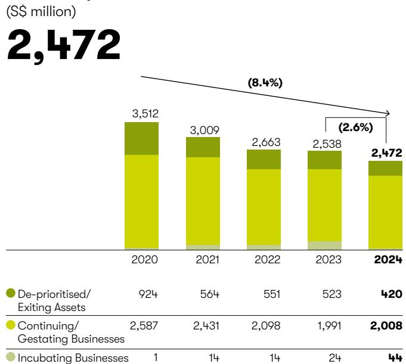  
$^{\wedge}$  primary workforce  
* 2020 and 2021 financial results for operating groups have been restated to reflect intra-group adjustments

# Continuing/Gestating Businesses

Sales volumes from Continuing/Gestating Businesses increased  $2.0\%$  on volume growth from OPG and Rusmolco. However, revenue fell  $6.6\%$  because of the adverse impact of the Naira devaluation on Packaged Foods' Nigerian operations.

The segment sustained an EBIT loss of S$96.1 million in 2024 compared with a profit of S$52.8 million a year ago on higher losses from OPG and ARISE P&L, as well as non-cash foreign exchange revaluation losses on Euro-denominated parent loans to OPG. This was partially offset by improved earnings from Rusmolco, Packaged Foods and Mindsprint. The weaker performance in OPG was caused by the fall in production

yields due to lower rainfall during the year. ARISE P&L's results continued to be dragged down by reduced economic activities in its operating geographies.

Invested capital remained under control at S\\(2.0 billion as at end-2024, with fixed capital in line with the previous year and a moderate increase in working capital.

# Incubating Businesses

The Incubating Businesses in Nupo Ventures scaled back during 2024. While it did not record higher sales volume or revenues for the year, efforts to reduce costs and cash burn helped narrow losses from S\ $66.6 million in 2023 to S\$ 49.5 million in 2024.

# Rusmolco

# Powering excellence in milk production

Rusmolco, a  $100\%$  subsidiary of Olam Group, continues to set new benchmarks in large-scale dairy and crop production in Russia. With a deep know-how that drives operational efficiency, innovation and sustainable farming, we have delivered exceptional growth over the years, with strong financial results in 2024.

# Expanding herd size:

The total herd increased by  $10\%$ , growing from 32,623 to 35,966 animals.

# Higher productivity:

Average milk yield per animal surged from 35.28 litres/day in 2023 to 38.36 litres/day in 2024, with per cow productivity exceeding 41 litres/day.

# Record milk production:

Total milk output rose by  $34\%$ , reaching 216.4 million litres in 2024, up from 161.2 million litres in 2023.

# Improved reproductive performance:

Key parameters, such as pregnancy rate, increased from  $27\%$  to  $35\%$  over the past year.

Rusmolco's continued investment in herd genetics, precision nutrition, biological safety and digital monitoring has reinforced our position as a leader in Russia's dairy sector. As part of Olam Group, we remain committed to sustainable and efficient food production to meet growing consumer demand.

# Sustainability

Our ongoing efforts include:

Recycling  $100\%$  of manure into cow bedding material through bio reactors and organic fertilisers.  
- Engaging in responsible crop rotation and par allocation to retain/rejuvenate soil health and fertility.  
- Reducing chemical crop protection application by  $30\%$  through precision application techniques.  
Recycling  $80\%$  of production process waste (inputs packaging, recycling plastic, paper).  
Preserving and maintaining beehives at the farms.  
- Re-creating parks and orchards at the farms to improve flora and fauna habitat.  
- Improving vital infrastructure (water supply, roads, children's playgrounds) in communities.  
- Improving food security for vulnerable households through initiatives such as subsidised fodder for animals and school starter packs.  
Providing an annual internship to agriculture university students and supporting college students via scholarships.

We are also exploring more ways to reduce our footprint and protect nature, including:

Aiming to reduce our carbon footprint by  $50\%$  per kg of fat- and protein-corrected milk (FPCM) by 2030.  
Aiming for 'zero single-use plastic' by 2030.  
- Improving milk yield quality and quantity sustainably.  
- Reducing enteric methane emissions by introducing feed supplements.  
- Protecting surrounding forests and grasslands.  
- Driving regenerative agriculture practices and nutrient recycling in animal feed production.

# For more information on the Remaining Olam Group businesses

# Olam

Read more on pages 78 to 84.

# MINDSPRINT

Read more on pages 74 to 77.

Read more on pages 64 to 73.

# Fuelling tomorrow's innovation

Harnessing the power of the human spirit to innovate and create a positive impact

# Jiva

Improving the lives of farmers to empower them and create a step-change in their lives

# TRACT

Streamlining sustainability measurement to accelerate supply chain transformation

# Terrascope

Providing enterprises with the data, analytics, and reduction-planning tools that they need to decarbonise their business operations and supply chain

# 25%

The average income increase for farmers, collectors and village-level retailers working with Jiva

Jiva

# Raised

# US$12 million

from existing shareholders and new impact and strategic funds, The Working Capital Fund, PYMWYMIC, and Rabo Investments

TRACT

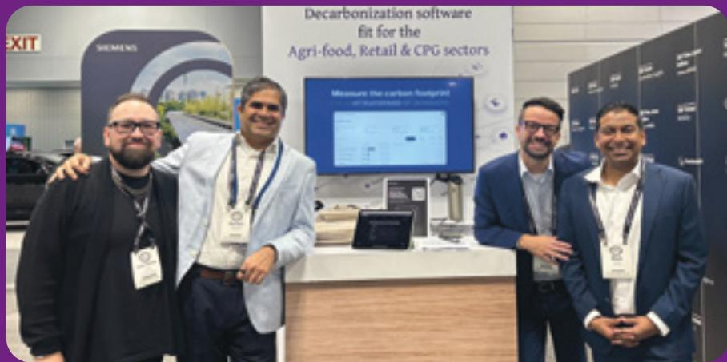

At Nupo Ventures, we spend our time incubating and growing new ventures. Our focus is on devising digital-first solutions to address ESG-related challenges in the food, agriculture and related sectors. We are building profit with Purpose ventures to deliver financial returns to investors while making a positive impact on the planet and communities.

Our platform has measured over

# 533 million

metric tonnes of  $\mathbf{CO}_2$  - equivalent to Australia's annual emissions

Terrascope

# The Nupo Ventures journey

Nupo Ventures emerged from Olam Engine 2.0, an initiative focused on identifying and nurturing the next generation of growth-focused businesses.

Building on the success of its initial portfolio companies, Nupo Ventures was subsequently established as an independent venture studio dedicated to empowering entrepreneurs and startups.

Our mission is to develop and accelerate businesses that deliver not only strong financial returns, but also innovative solutions to pressing societal and environmental challenges. Operating independently of Olam Group's strategic priorities, Nupo Ventures maintains the agility of a venture studio while addressing complex, system-level issues in collaboration with a broad ecosystem of stakeholders.

Our expertise in food and agriculture, paired with early market and customer access through corporate partnerships, gives our portfolio ventures a unique edge in driving impactful innovation. All our ventures aim to create profit with Purpose across the entire ESG spectrum.

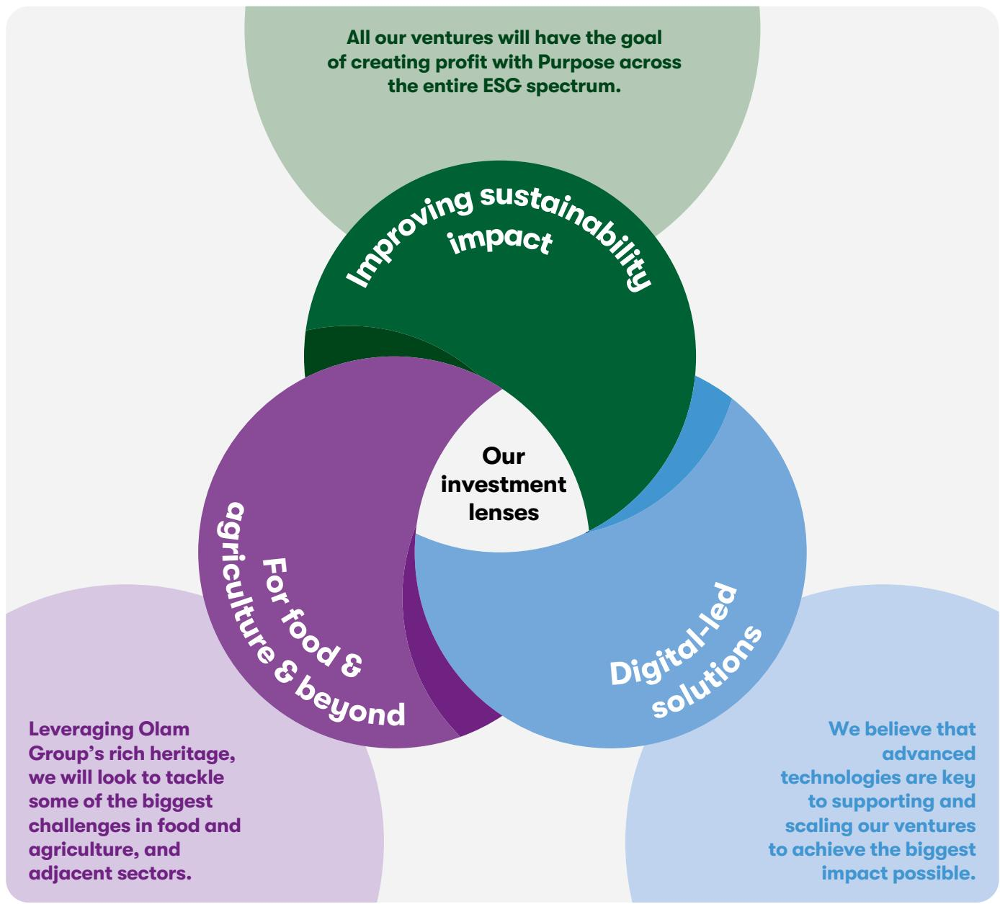

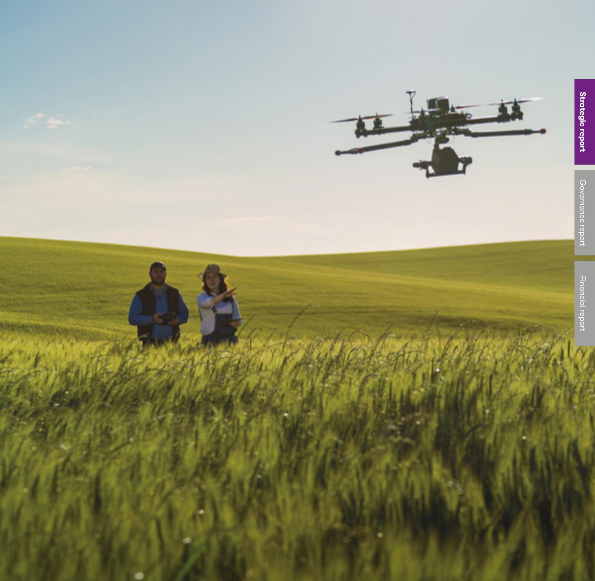

# Our sustainable values

# Drive change

Our planet demands new ways of living and working. At Nupo Ventures, we rise to meet these challenges. Innovation is at the core of all that we do to deliver new solutions.

# Doing things together

Together, we create solutions that change the world. The unparalleled strength of our collaboration is how we put ideas into practice.

# Caring for all

Inclusion is integral to how we solve global sustainability issues. Our work is focused on making sustainability accessible for everyone, and the norm worldwide.

# Daring to think differently

Creative entrepreneurship is key to our success. We push ourselves beyond our comfort zone to think and explore new horizons for a sustainable future.

# Terrascope

Terrascope is a leading carbon measurement and decarbonisation platform, specialising in the land, nature and net zero economy sectors. It enables companies across the world to measure, manage and reduce greenhouse gas (GHG) emissions with transparency and consistency. Combining advanced technology with actionable insights, Terrascope drives impactful climate action.

# Since June 2022 we have built an Al-driven decarbonisation library of over 20,000 initiatives.

In 2024, we achieved key milestones in geographic expansion and client engagement, including entering the U.S.A. market through collaborations with leading brands, including Kellanova and Frutura. Beyond the U.S.A., our platform operates across Europe, Japan, ASEAN, and Australia, supporting a diverse range of clients, as they advance their sustainability goals.

Recent customer success stories include Prime Cotton, a major cotton producer in Azerbaijan, that used the platform to measure emissions across 45,000 ha of farmland and found  $12.3\%$  lower carbon intensity compared to industry benchmarks. Tetra Pak, a global packaging and services leader, used our Product Carbon Footprinting (PCF) tool to analyse 16 stock-keeping units or SKUs in just one month and benchmark products against industry standards to gain a competitive edge. Ohmium, ranked second on TIME's 2024 Top American GreenTech Companies list, partnered with us to set Science-Based Targets and create an actionable transition plan aligned with Race to Zero requirements.

2024 also saw Terrascope forge strategic partnerships, including a pivotal collaboration with Fujitsu Ventures to drive technological innovation and expand platform capabilities. Additionally, the company is collaborating with Amazon Web Services (AWS) on a groundbreaking initiative to enhance its platform with generative AI, reducing  $\mathrm{CO}_{2}$  emissions factor matching error rates by  $>50\%$  and streamlining data processing.

The company's leadership transformed with the appointment of Felipe Daguila as its new Chief Executive Officer. Daguila, who joined Terrascope in 2021 as Chief Commercial Officer and later took on expanded responsibilities as Chief Commercial and Customer Officer, brings strong global leadership experience from his roles at Google and AWS.

As we enter our next phase of growth, we are committed to being the easiest platform to measure and reduce emissions coming from the land, nature and net zero economy sectors. 99

Felipe Daguila, CEO, Terrascope

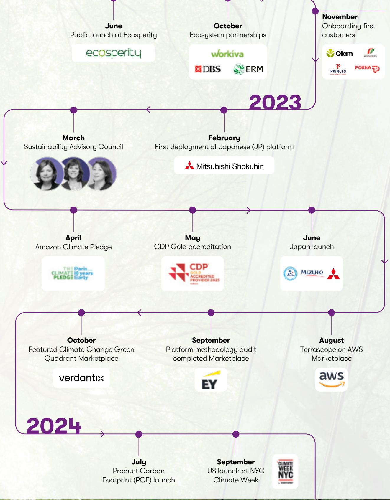  
Key milestones since Terrascope's inception  
2022

# Jiva

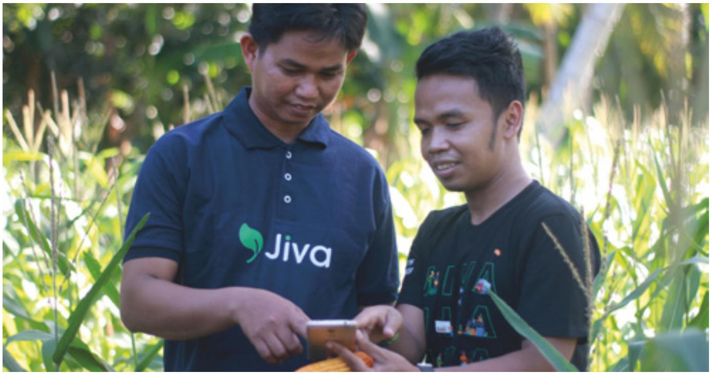  
The Jiva app being used by a farmer and a microcontroller

Smallholder farmers produce around a third of the world's food, and Jiva, a holistic farmer services ecosystem, supports them by uplifting their livelihoods at scale. Jiva provides smallholder farmers with access to high-quality inputs, credit facilities, product markets and Al-driven agronomy advisory – all through a single, trusted ecosystem.

2024 marked another transformative year, with significant milestones achieved in margin growth, revenue growth and network expansion. We achieved a  $300\%+$  improvement in unit economics and a  $500\%$  increase in overall margins. We grew our inputs revenue by  $20\%$ , driven by our expanded retailer, micro-collector and farmer networks. Margins within inputs were strengthened through strong partnerships with international and Indonesian input manufacturers, and establishing our strategic products portfolio.

For Jiva's offtakes business, we successfully launched operations in two additional crops, coconut and rubber, alongside our existing corn, cassava and fresh markets. We also expanded our footprint into South Sumatra, adding to our presence across Java, Sumatra and Sulawesi.

# Fivefold

How much Jiva's margin grew in 2024.

# Threefold

How much Jiva's unit economics improved in 2024.

Our village-level retailer network grew from 1,000 to over 4,000 active participants, creating a significant new channel for input distribution and farmer engagement. Simultaneously, we improved the curation of our micro-collector network, maintaining over 4,000 engaged collectors across Indonesia. These networks enabled us to expand our farmer ecosystem, which now caters to over 150,000 farmers in Indonesia.

A key focus for 2024 has also been the integration of AI in our products, services and systems. We recently introduced AI-sales co-pilots for our teams, enhancing sales efficiency, training and decision-making. We have started integrating AI into our back-end operations, with initial explorations centred on crop and demand forecasting, ensuring a seamless experience for our network participants.

Jiva's impact extends beyond economic growth to creating measurable improvements in livelihoods. For the third consecutive year, our impact survey of over 500 farmers, micro-collectors and retailers confirmed an average  $25\%$  increase in income for participants in the Jiva ecosystem.

The vast majority of respondents believe Java has positively impacted their communities.

In addition to business growth, Jiva's visibility and influence continued to grow on the global stage. We were honoured to showcase Jiva's offering at several prestigious conferences, including IFC's Agribusiness Conference in Ireland, Google's APAC Cloud Technical Summit and multiple other conferences across Southeast Asia.

As we move into 2025, Jiva is poised to deepen its networks further, expand into key crops, and accelerate the adoption of our strategic portfolio of input products to enhance margins. Our mission to uplift livelihoods across smallholder farming communities remains at the heart of everything we do, and we are confident in our ability to deliver an even greater impact in the coming year.

2024 marked a pivotal year for Jiva, as we demonstrated our ability to lead in both offtakes and agricultural inputs. We expanded our retailer network to over 4,000 partners, introduced a new product range, and achieved a  $500 \%$ margin increase by focusing on unit economics. These achievements solidify our trajectory toward profitability, positioning us to become EBITDA positive by 2026.

Ramanarayanan Mahadevan, CEO, Jiva

# TRACT

TRACT is a leading provider of traceability and sustainability data solutions for the global agricultural supply chain. The company's mission is to remove the burden of data management and resolve the debate on methodology, so that companies can focus on driving positive impacts.

TRACT supports global supply chains across 14 commodities, including soy, cocoa, coffee and palm, and is rapidly expanding its reach to empower businesses tackling sustainability challenges. Through TRACT, companies fulfil the requirements of traceability, data collection, risk assessment, deforestation assessment, and legal assessments, as well as creating and submitting due diligence statements to the EU's information system, Traces. This makes it easy for companies, large and small, to keep products flowing in the EU and go beyond the EU's Regulation on Deforestation-free Products (EUDR), meeting the demand for deforestation-free commitments and other regulations like the Corporate Sustainability Due Diligence Directive (CSDDD).

Developed by and for the food and agriculture industry, TRACT is the result of a collaborative effort involving over 50 companies dedicated to transparency and positive change. With initial funding and expertise from Archer-Daniels-Midland Company (ADM), Cargill, Louis Dreyfus Company and Olam Group, TRACT has grown into an independent company led by professionals who understand the sector's unique challenges and opportunities.

With the deadline for EUDR approaching, and increasing attention on carbon reporting, TRACT anticipates growing market demand for its solutions and is well-prepared to support the industry through these critical challenges and opportunities. Throughout 2024, TRACT convened companies in a Technical Working Group to co-design and align on an EUDR deforestation assessment methodology. The methodology was co-created and endorsed by ADM, Cargill, Louis Dreyfus Company, Nestlé, ofi, Olam Agri and Soya Hellas, and was released in September.

2024 was a year of milestones for TRACT. We celebrated our first year of operations as an independent entity; publicly launched a comprehensive platform that serves a diverse range of clients, including suppliers, traders, and leading brands; and released end-to-end coverage to help the industry meet the needs of the EUDR.

We also successfully raised US$12 million from existing and new investors – Rabo Investments, Working Capital Fund and PYMWYMIC – to accelerate our strategic growth plans as an independent entity. We are set to fuel growth and solidify our leadership in sustainability transformation by maintaining focus on transparency and positive change.

2024 was a banner year for us. We launched commercially, and have grown exponentially, both commercially and as an organisation. I'm so proud of the work our team does every day to drive more impact across supply chains. We believe in a future where all of the world's agricultural supply chains are sustainable, and that work starts today. 99

Allison Kopf, CEO, TRACT

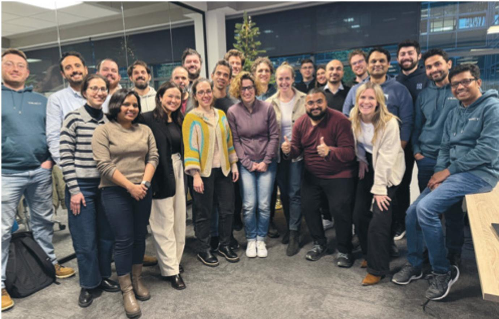  
The TRACT team

TRACT focused on continuing to bring the industry together to collaborate pre-competitively on major sustainability topics around human rights, deforestation and carbon. We continued to grow our product offering, team and reach in the market:

- We expanded platform offerings to include robust and secure data-sharing between members.  
- We launched end-to-end EUDR functionality, including Due Diligence Statements (DDS) creation and submittal.  
We released an industry-aligned and endorsed methodology on Deforestation Assessment.

Hosted

# 19 free educational webinars

for the market and spoke at nine industry-leading events on sustainability.

Grew the team to

# 28 people

and secured new, larger headquarters in Amsterdam.

# The difference starts here

Reimagining the possibilities of digital technology solutions and services

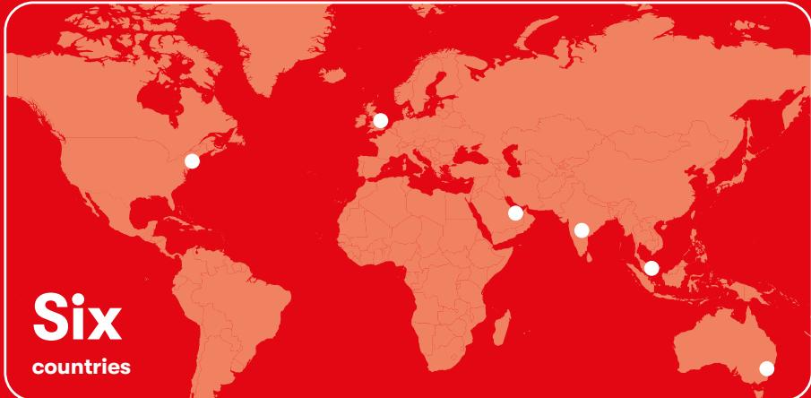

\~3,000

employees

233

entry-level hires made

More than a

quarter

of employees are women

# Our services

# Technology

We drive transformation, through our consulting and implementation services

# Business process

We enable process transformation to deliver impactful business outcomes

# Cybersecurity and privacy

We build cyber resilience and safeguard businesses with fit-for-purpose security solutions

10+

Customer projects undertaken utilising Generative AI use cases

Gold

SAP Partner status, highlighting our commitment to excellence

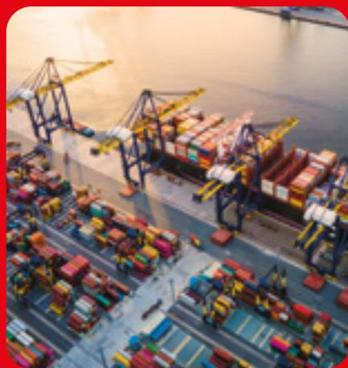

At Mindsprint, we transform an organisation's individual processes to unlock potential. We achieve this by delivering digital solutions to our customers that help give them a competitive edge.

A  $100\%$  -owned subsidiary of Olam Group, we blend the entrepreneurial agility of a startup with the extensive expertise of an established enterprise. Our team consists of domain experts across various fields and digital platforms, who have successfully tackled industry-first challenges.

# Who we serve

Food and agriculture

Retail and Consumer Packaged Goods (CPG)

Manufacturing

Life sciences

# Driving growth through strategic initiatives and key wins

Based in Singapore with approximately 3,000 employees, Mindsprint was initially established to provide IT and cybersecurity services to Olam's operating groups, ofi and Olam Agri. The unique experience and expertise we have gained in navigating complex businesses and supply chains, adapting to evolving regulatory landscapes and driving significant business value within Olam Group, position us as a reliable partner for similar businesses worldwide.

In 2023, the business was carved out of Olam Group to enable us to pursue contracts with third parties. Today, we have adopted a market- and services-aligned structure to tailor our offerings to the specific needs of the food and agriculture, retail and CPG, manufacturing and life sciences sectors. This approach allows us to provide more relevant solutions for driving growth and customer satisfaction.

# Key milestones in 2024

# Development of go-to-market strategy

During the year, we established a comprehensive 'go-to-market' strategy for Mindsprint's IT services to engage our target markets. This strategy outlines our sales channels, marketing initiatives, customer acquisition tactics and pricing models to position our offerings effectively, meet the specific needs of our clients and ensure sustainable growth.

# Contract wins

We engaged in several IT transformation projects across diverse industries and geographies. Key projects include:

- Middle East: SAP S/4HANA implementation and customer collaboration portal development for a grain and commodity trading company;  
- Europe and India: ITOM and ITSM services for a global leader in piping systems;

- India: Automation of weather forecasting and thermal inspection for a leading renewable energy company; and  
U.S.A.: Revamping the technology stack and implementing a recommendation engine for a renowned jewellery designer.

# Strategic announcements

Mindsprint partnered with MedAdvisor Solutions in the healthcare sector to improve patient medication management. This collaboration will use our AI-enabled cloud platforms to create MedAdvisor's next-generation patient engagement platform. The focus is on providing personalised experiences, enhancing patient education, improving medication adherence and setting a new standard in healthcare technology.

# Technology and innovation

We stay at the forefront of new technologies, such as Artificial Intelligence (AI), to deliver innovative solutions. AI is rapidly transforming industries, creating both challenges and opportunities. It is impacting not only our customers but also IT services companies like us.

As per HFS Research, in 2024,  $34\%$  of Generative (Gen) AI use cases were around prediction,  $28\%$  personalisation,  $24\%$  productivity and  $14\%$  other areas. On this basis, we have developed several real-world applications1 for enterprises:

- We offer a multi-lingual omnichannel conversational AI assistant, designed to address the challenges of employees in remote locations, such as plantations and factories.  
- Our intelligent manufacturing AI-cloud platform optimises production processes, enhances yield and improves quality by suggesting optimal operating parameters based on data analysis.

- We developed a suite of software tools designed to improve the efficiency and innovation of companies and their employees, including:  
- RenovX modernises older computer systems;  
- Catalyst uses AI to help sales and marketing;  
- Nexa utilises AI across stages of the software development lifecycle;  
- DevXtreme was developed using open-source Large Language Models (LLMs) and helps programmers write code faster. An AI-based companion is integrated in the development environment along with a portal for assisted coding. We have rolled this out to the entire developer community in Mindsprint, and internal users have reported significant time savings already; and  
- a private AI tool which offers similar benefits to ChatGPT, but with more security.

While building solutions, we prioritise security, compliance, and our customers' evolving business needs. As we look forward, we are committed to pushing the boundaries of what is possible with AI and democratising it to meet individual and organisational priorities.

# Recognition and awards

Mindsprint was certified as a Great Place to Work. We also received the ‘Excellence in Business Process Services Award 2024’ at the Shared Service Summit & Awards. This recognition highlights our commitment to pioneering business workflow innovations, and sets a new benchmark for excellence.

In addition, we won the 'Technology Senate Award' in Enterprise Apps for our TruTrace platform. The TruTrace initiative enhances supply chain transparency and efficiency by integrating supplier, production and logistics data. It addresses challenges in visibility and compliance while reducing environmental impact and fostering customer trust.

During the year, we achieved SAP Gold Partner status, highlighting our commitment to excellence. This recognition is backed by strong customer testimonials and our innovative offerings in key areas, including SAP Analytics, S/4HANA Cloud and SAP GROW Solutions.

Received the excellence in Business Process Service Award 2024

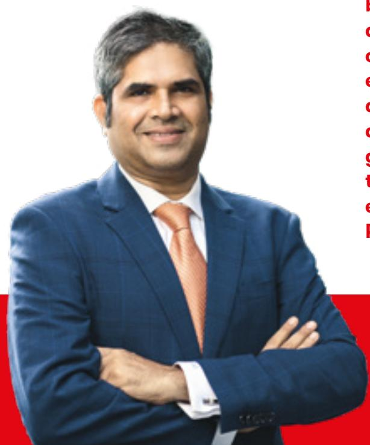

66 Mindsprint is rapidly evolving from a captive Global Capability Centre (GCC) to an independent AI-centric technology services company. We are expanding beyond food and agri into retail, CPG, manufacturing, and healthcare, while continuing to serve existing customers. 2025 will see us focus on AI-first in everything we do, customer acquisition, leveraging account-based marketing to grow key accounts, and forging strategic partnerships to extend our global market reach. We are investing in a state-of-the-art Customer Experience Centre to enhance client engagement, and are driving innovation through R&D and agile development. 99

Suresh Sundararajan, Co-Founder and CEO, Mindsprint

# Developing and nurturing businesses

Driving strategic growth by leveraging our unique competitive strengths

# Enhancing a local agricultural economy in Gabon

Olam Palm Gabon (OPG), our joint venture with the Republic of Gabon, delivered a steady operational performance through the year.

While extreme dry weather and higher water deficit in Gabon saw a  $9\%$  decline in yields for OPG versus 2023, our efforts to enhance the efficiency of plantation operation and production costs continued to result in cost savings and operational improvements.

Harvesting costs decreased by  $16\%$  through effective contract management and better utilisation of the vehicle fleet, and fertiliser costs saw a  $19\%$  reduction through improved strategic sourcing. Continuous improvements to harvesting standards and faster crop evacuation helped increase our oil quality by  $28\%$ . Oil extraction rates in the mills increased by  $3\%$  and  $1\%$  for crude palm and palm kernel oil respectively, partially compensating for the reduction in yields.

In April, our oil refinery was upgraded and, despite the downtime for this project, saw an  $8 \%$ growth in volumes from 2023. Momentum was maintained for both oil and soap, with  $5 \%$ growth for both products versus last year, primarily attributable to domestic demand in Gabon.

Our large-scale sub-surface drip irrigation project, which was developed to improve yields, continues to make good progress. In estates where Phase One is already in operation, results showed that palm yields have increased as planned in active irrigation and fertigation areas compared to non-irrigated areas. Phase Two went into operational service in February, while work on Phase Three is expected to be completed by mid-2025.

Olam Rubber Gabon (ORG), also a joint venture with the Republic of Gabon, saw a strong operational performance. Production volumes increased by  $19\%$  versus 2023, while revenue per tonne rose  $24\%$  year-on-year. While the vast majority of rubber remains sourced from our own plantations, we continued with opportunistic purchasing to take advantage of strong rubber prices through the majority of 2024.

New digital solutions were implemented across both OPG and ORG. We introduced a system to minimise field losses and optimise transport costs in the palm plantations. Integrated with an innovative AI-powered application, it is designed to leverage advanced image processing and machine learning techniques to automate the counting and grading of more than 40 million fresh fruit bunches (FFBs) annually. A procurement platform was also deployed to streamline processes, improve efficiency, and enhance transparency.

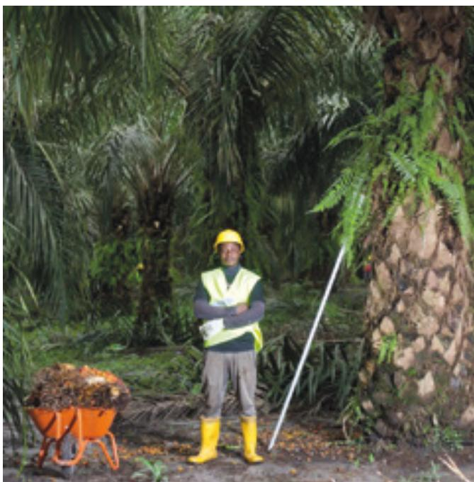  
A harvester gathering fresh fruit bunches of palm for milling, Gabon

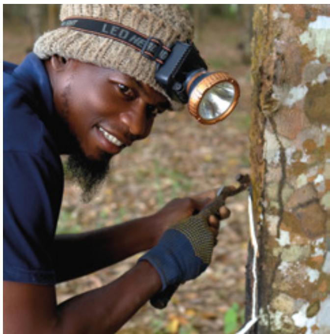  
A tapper collecting rubber from a rubber plantation, Gabon

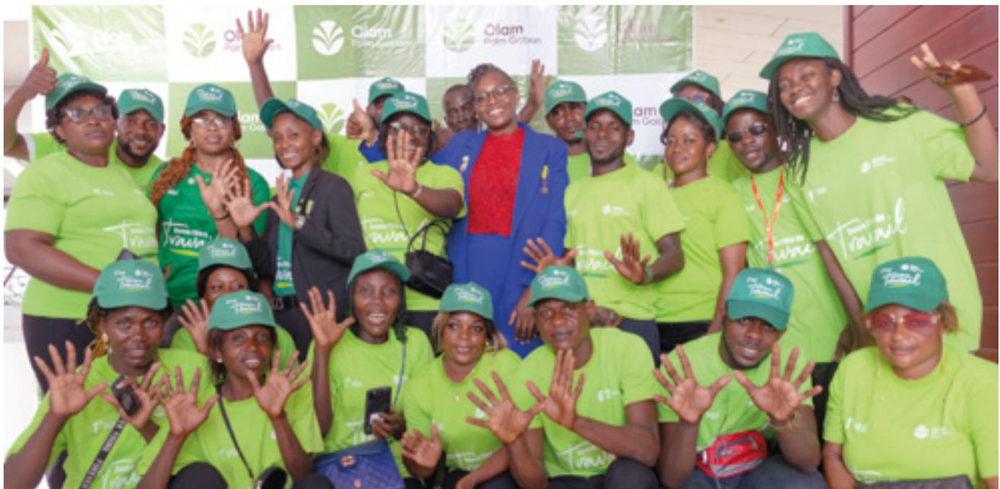  
The OPG team celebrating Labour Day, Gabon

# Safety and health

In 2024, we made significant progress in workplace safety. In the last three years OPG has achieved a four-fold reduction in the number of accidents and more than a forty-fold decrease in lost-time injuries. This notably reduced the Lost Time Injury Frequency Rate (LTIFR) to 0.17, which is low for the industry sector and region. ORG saw a  $50\%$  improvement in its LTIFR. These outstanding achievements are the culmination of several key initiatives implemented throughout the year. These include GPS vehicle tracking to monitor nearly 300 vehicles in real-time, to optimise routes, schedules and minimise driver fatigue. The business reinforced speed monitoring for vehicles to mitigate the risk of road accidents, as well as continued regular alcohol testing for drivers.

# Our people

Engagement with employees and their representatives continued progressively through the year, with agreements signed for both OPG and ORG employees. We also continued to recognise employee performance across all our sites – this included a long-service celebration for more than 235 OPG employees and almost 90 ORG employees. As part of our focus on diversity and inclusion, a women's network was set up. This network supports development via training, coaching and mentoring, as well as supporting initiatives for girls in secondary schools.

# Sustainability

In 2024, we reaffirmed our commitment to environmental stewardship and biodiversity. More than half of our palm and rubber concessions, totalling 150,000 ha, are dedicated to biodiversity conservation. Within these protected areas, a dedicated biodiversity protection team works daily to maintain the ecosystems' integrity. This environmental unit plays a crucial role in monitoring flora and wildlife, preventing poaching, and ensuring conservation efforts are effective and sustainable.

OPG continued its partnership with the National Agency for National Parks (ANPN) on a research programme observing elephant movement and behaviour, to promote co-existence between wildlife and agricultural activities. This collaboration has provided valuable insights to better understand and manage how elephants interact with plantations through GPS tracking and DNA sampling. In 2025, this partnership aims to further understand elephant behaviour to both protect the plantation from damage and ensure elephant conservation within the protected areas. Among the main outcomes to date are:

- a more precise census of the elephant population within our landscape through DNA;  
- an accurate display of elephant territories and movements using tracking on 15 elephants; and  
- the precise location of areas with high risk of elephant intrusion, which allow boundaries and operations to be adapted to ensure a harmonious co-existence.

Our palm oil mills are committed to efficient resource management, ensuring sustainable and eco-friendly operations. We have continuously achieved a negative carbon footprint, meaning our operations sequester more carbon than they emit. One of our key achievements is the generation of our own energy by capturing methane produced from mill effluents. Through biogas technology, we can power our facilities, and therefore significantly reduce our reliance on external energy sources, such as diesel. We take pride in our comprehensive waste recycling programme and all waste generated in our production process is repurposed. For example:

- fibres from fruit bunches are reused in boilers to create steam used for energy production and fruit sterilisation;  
water in our processing units is treated and reused for fertigation, providing essential nutrients to our crops; and  
- solid waste, such as empty fruit bunches and palm kernel cakes, are recycled as organic manure and fertiliser, enhancing soil structure, health and productivity.

# Did you know?

# 100%

of Olam Rubber Gabon's plantation attained maturity in 2024.

OPG remains the largest  $100\%$  RSPO-Certified palm producer in Africa, maintaining our certifications in 2024. Our seat at the RSPO Board of Governors was renewed in November, reflecting our active role and interest in staying at the forefront of certification and sustainability practices. We also maintained our ISCC (International Sustainability and Carbon Certification) certification, which has extended its scope to include wastes and residues, further enhancing our commitment to the responsible management of our by-products through recycling. For the fifth consecutive year, ORG renewed its ISO 14001 certification, ensuring a continuous improvement of our environmental management.

OPG and ORG remain committed to paving the way for excellence and to promoting sustainable and responsible production practices in the African palm oil and rubber sectors, and we are exploring expanding our certification scope to other standards such as GMP+ and additional ISOs.

Through our longstanding engagement with rubber and palm communities, by 2024 we have:

- Provided support to 16,000 people in communities around the plantations by providing essential socio economic infrastructure (lights, schools, water wells, dispensaries, etc.), and income-generating activities.  
- Set up 440 socio economic projects, with over 20 realised in 2024.  
- Initiated a Livelihood Development Plan (LDP) where projects focus on a range of areas such as agriculture and entrepreneurship (including infrastructure development and services).

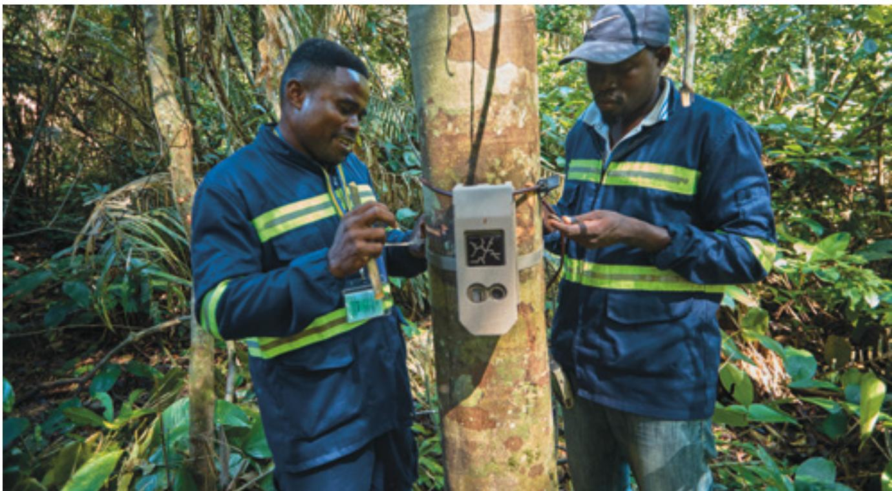  
Colleagues set camera traps to monitor wildlife activity and habitat use within High Conservation Values (HCV) in the Moutassou region, Gabon

# Offering consumers differentiated and innovative products

Our packaged foods business, Caraway, maintained a robust performance in 2024 despite headwinds. Commodity cost inflation, currency depreciation, high inflation and high interest rates continued to reduce consumers' disposable income and constrain trade working capital.

In 2024, our brands continued to engage with consumers via TV, radio, digital and outdoor communication, increasing visibility at the point of sale and through experiential interactions. To offer customers good quality products at a range of price points, we reworked our portfolio to ensure representation across different price tiers, particularly in biscuits, sweets and dairy beverages.

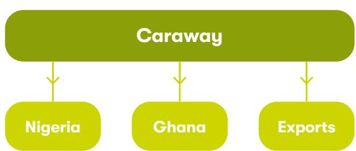

We have reorganised Caraway into three business units: Nigeria, Ghana and Exports (catering to the Francophone markets and beyond) under a new leadership structure, to focus on current geographies and build a future growth engine. We have also optimised overhead costs, the benefits of which will flow through in 2025. In our biggest geography, Nigeria, we have launched a revised strategy for 2025 and beyond.

While our culinary portfolio continued its healthy performance, two major achievements in 2024 were the turnaround of the biscuits business in Ghana, which saw it regain market leadership, and the sweets business in Nigeria. This was achieved following a portfolio strategy reset, a focus on distribution and on disruptive innovations, such as breakfast bars in Ghana and premium lollipops in Nigeria.

Pricing pressures remained in 2024. At Caraway, we worked on improving margins by re-engineering our products to make them more affordable without compromising performance, driving a product mix shift and improving manufacturing efficiency.

We continued working on our nutrition commitment to design and rework formulations to provide health benefits through fibre and vitamin enrichment in select offerings such as tomato mix and beverages. At the same time, we minimised the use of ingredients that constitute a health risk including reducing fat and sugar in biscuits and beverages. For example, overall we have reduced fat in Perk Milk Shortcake by  $10\%$  and by  $6.5\%$  in Pure Bliss Milk Cookies.

Caraway continued to drive key areas of productivity, cost control, quality and food safety. In addition we further developed our collaboration with third-party manufacturers for existing and new product launches.

# Using innovation as a major driver

While we continued to provide mass-market offerings in both Nigeria and Ghana, we launched two disruptive innovations, a breakfast bar in Ghana (Granola Bar and Nutribar endorsed by the NutriSnax brand) and premium lollipops in Nigeria (Popzilla). We test-launched seasoning powders in Nigeria and Ghana and made our first foray into cereals in Ghana. We also introduced Aktiv-Yo, our value-for-money drinking yoghurt in Nigeria. Overall, we have developed a strong innovation funnel that will drive future growth.

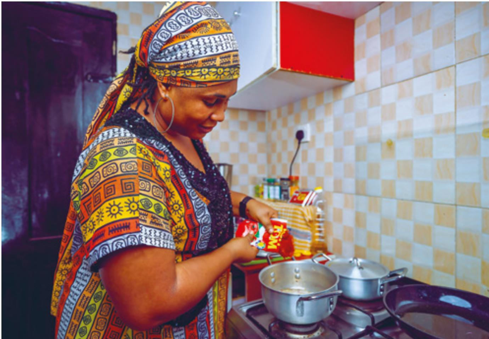  
Vitamin-enriched tomato mix, a popular choice in Nigerian kitchens

# Sustainability

Caraway is committed to sustainability through energy efficiency, water consumption, carbon emission and waste reduction targets, and social and livelihood initiatives, including diversity and women's empowerment.

Key 2024 sustainability initiatives included:

- Continuous improvement on initiatives for energy efficiency and conservation, including assessing solar energy solutions and implementing actions from our energy audits.  
- The design and order of a larger-capacity effluent treatment plant in Ghana tomato paste, in the context of the volume trend.  
- Working with in excess of 1,000 farmers to provide training on yield improvement practices and post-harvest loss.  
- Promoting diversity and women's empowerment through GROW (Globally Reaching Olam Women) activities in the workplace.

In excess of

1,000

tomato farmers worked with to improve their yields and post-harvest loss.

# Sustainability in the Remaining Olam Group

We are re-imagining global agriculture through our operational ability to make a material impact on improving farmer livelihoods, increasing community wellbeing, and regenerating our living world.

# Sustainability priorities

<table><tr><td>Our aims</td><td>Summary</td></tr><tr><td>Climate-positive
Minimise climate and material footprint</td><td>We are working to reduce the environmental footprint of our business by reducing GHG emissions, increasing energy efficiency and use of renewables, reducing water-use intensity and improving waste management in our operations.</td></tr><tr><td>Nature-positive
Protect and regenerate</td><td>We are protecting ecosystems, biodiversity and watersheds in the locations where we operate.</td></tr><tr><td>Livelihoods-positive
Foster inclusive livelihoods</td><td>We are working to improve livelihoods in communities where we operate and reduce social inequalities for women, youths and marginalised groups.
We are strengthening safety and health to support the wellbeing of our employees, and focusing on promoting inclusivity and improving diversity across our organisation.</td></tr><tr><td>Livelihoods-positive
Feed and nourish the world</td><td>We are working with our suppliers, customers and our employees to strengthen food security and improve access to affordable food and nutrition.</td></tr><tr><td>Good governance
Govern well and source responsibly</td><td>We are working to responsibly source our materials and services across our operations and supply chains.</td></tr></table>

# Read more about our sustainability-related work

# Olam

Read more on pages 78 to 84.

# MINDSPRINT

Read more on pages 74 to 77.

Read more on pages 64 to 73.

# Sustainability

Sustainability is woven into the fabric of our everyday decision-making

We are re-imagining global agriculture through our ability to make a material impact to improve farmer livelihoods, increase community wellbeing, and regenerate our living world.

# Sustainability framework

# Our Purpose

To re-imagine global agriculture and food systems

# Our Vision

To be the most differentiated and valuable global food and agri-business by 2040

# Governing Objective

To maximise long-term intrinsic value for our continuing stakeholders

# Our Pillars

# Social

# People and Culture

The talent, skills and inspiration of our workforce, and our responsibility to provide a safe and healthy workplace where employees' rights are respected.

The relationships we forge and nurture with suppliers and the communities where we operate for long-term success.

# Environment

The land, water, biodiversity, favourable climate and other ecosystem services required for food, feed and fibre crops to grow.

Our Focus Areas  

<table><tr><td>Food Loss, Waste &amp; Packaging</td><td>Includes reducing post-harvest losses, sustainable consumption and packaging.</td><td>12</td></tr><tr><td>Nutrition &amp; Health</td><td>Includes food security, and access to clean water and sanitation.</td><td>3</td></tr><tr><td>Education &amp; Skills</td><td>Includes learning and development, and engagement with our employees and our communities.</td><td>4</td></tr><tr><td>Climate Action</td><td>Includes decarbonisation and climate adaptation.</td><td>5</td></tr><tr><td>Safe &amp; Decent Work</td><td>The talent, skills and inspiration of our workforce, and our responsibility to provide a safe and healthy workplace where employees&#x27; rights are respected.</td><td>6</td></tr><tr><td>Diversity &amp; Inclusion</td><td>Includes promoting diversity and inclusion within our Company and in our farming communities.</td><td>5</td></tr><tr><td>Healthy Ecosystems</td><td>Includes reducing deforestation and protecting biodiversity.</td><td>13</td></tr><tr><td>Water</td><td>Includes reducing water consumption in our own operations and our farming communities.</td><td>15</td></tr><tr><td>Healthy Soils</td><td>Includes precision and regenerative agriculture.</td><td>12</td></tr><tr><td>Economic Opportunity</td><td>Includes Living Wage, Living Income, improving farm production and access to markets.</td><td>1 of 1</td></tr><tr><td>Responsible Sourcing</td><td>Includes traceability, transparency and supplier engagement in our direct supply chains.</td><td>1 of 1</td></tr><tr><td>Prosperous Farmers and Food Systems</td><td>Purpose Outcome
Thriving Communities</td><td>Regeneration of the Living World</td></tr></table>

# Embedding sustainable and responsible business practices

# Our approach to sustainability

Sustainability is woven into the fabric of our everyday decision-making as a business, not as a separate goal or intention. To determine what is material to our business, we have collated multiple environmental and social indicators across our Focus Areas connected and aligned with the UN Sustainable Development Goals (SDGs) and the 10 Principles of the UN Global Compact. The continued development of AtSource – our sustainable sourcing solution – has enabled us to gain deeper insights into environmental and social impacts. The AtSource indicators used to assess environmental and social impact are informed and influenced by inputs from various sources including customer audits, enquiries from NGOs and banks, international standards, civil society scorecards and frameworks, and industry platforms. The resultant Focus Areas have been mapped against our operations and supply chains to identify risks and opportunities. Olam Agri and ofi have each developed separate goals and discrete Sustainability Frameworks which are tailored to their respective strategies and reflect business operations in preparation for demerger from the Group. For the purpose of this report, the following pages offer an update on the continued progress against the Olam Group Framework and goals as they remain relevant.

Our Sustainability Framework enables us to translate our Purpose into practice.

We define three key outcomes:

prosperous farmers and food systems;  
thriving communities; and  
- regeneration of the living world.

# How we govern sustainability

We have been reporting in reference to the GRI Framework since 2016 and have continued to report against the Sustainability Accounting Standards Board (SASB). The index reports for these can be found on olamgroup.com/investors/annual-reports. The Sustainability Committee (SC), a dedicated Board Committee that assists the Board in ensuring the Company's attention to Environmental, Social and Governance (ESG) issues and sustainability, meets every quarter to review and consider sustainability matters, concerns, trends and developments that could impact the Group. The SC provides regular updates to the Board.

The Company has in place a set of key performance indicators and associated monitoring processes in place to drive our sustainability goals. As a response to the requirement under the Listing Rules for sustainability reporting to be subject to internal review, the Internal Audit (IA) function has already worked with management in incorporating additional sustainability controls within the scope of the Group's Integrated Risk Assurance Framework.

The IA function has also initiated specific ESG reviews in accordance with the annual IA plan, covering key ESG controls and reporting metrics with focus on accuracy and completeness.

The Listing Rules 720(7) require all Directors to undergo training on sustainability matters. All Directors have completed the prescribed sustainability training.

Read more in the Sustainability Committee section of our Governance Report on pages 197 to 199.

# Supplementary Sustainability Disclosures 2024

We have published a Supplementary Sustainability Disclosures report, which is designed to be a companion to this main report, and contains all relevant sustainability data aligned with GRI standards. This is available on our website.

# Code of Conduct

A Code of Conduct has been developed for both ofi and Olam Agri employees. This is updated as and when it is required, and is based on the values and everyday behaviours that have fostered Olam Group's culture over the years. Access to training on the Code of Conduct is available to all employees across ofi, Olam Agri and the Remaining Olam Group. All employees are required to attest on an annual basis. Visit the Ethics and Compliance section of each respective website for more information.

# Read more about:

Partnering for greater scale and impact pages 89 to 90

Our impact across our value chain page 91

Engaging with our stakeholders pages 92 to 93

Areas important to our stakeholders pages 94 to 96 and potential impact

Environment pages 97 to 110

Social pages 111 to 121

People and culture pages 122 to 131

Response to the TCFD pages 132 to 140

Preparations for adopting TNFD page 141

Risk management pages 142 to 145

Multi-capital accounting pages 146 to 162

(Integrated Impact statement)

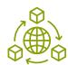

# Responsible supply chains

Developing responsible and sustainable agricultural supply chains where prosperous farmers and growers, thriving rural communities, and healthy ecosystems co-exist is central to our Purpose. Across multiple supply chains and geographies, we work closely with farmers to build long-term relationships based on responsible business practices and trust. This is underpinned by our policies, including our Supplier Code, that set out the standards and principles we expect of our suppliers. We continue to focus on transformative actions, and strive to create a more transparent supply chain by improving traceability, and continue to evolve to meet customer and regulatory requirements. Olam Group's focus on avoiding deforestation in smallholder supply chains also means it is well-placed to comply with any applicable requirements. We implement transformative actions and create more transparency for each stage of the supply chain journey, collaborating with farmers, suppliers, governments and NGOs with the aim of delivering real and lasting progress.

For more supply chain information, visit ofi pages 37 to 40 and Olam Agri pages 50 to 58.

# Safety and health

We value safety and are constantly evolving our approach to drive more effective engagement with safety issues. Our objective is to continue to embed a zero-incident culture and create a working environment where everyone returns home safely. This includes identifying and managing major safety risks such as driving, working at height or working with energy. We empower all employees and contractors to report unsafe conditions or behaviour. For more detailed information, visit our People and culture chapter on pages 122 to 131.

# Food safety

We operate highly integrated supply chains, working with large-scale growers and smallholders to provide training, quality seeds and other inputs, coupled with the highest standards of quality and microbiological control at our processing plants in origin and in destination markets, thereby reducing food safety risks. We are committed to high food quality and safety standards, and adopt granular vigilance to keep in step with the standards and requirements of governments and various legislative bodies. We have achieved the Food Safety Standard Certifications and are working to align with the Global Food Safety Initiative (GFSI) and the International Organization for Standardization (ISO). For more information on individual business updates, visit ofi pages 26 to 43 and Olam Agri pages 44 to 60.

# Anti-bribery and corruption

All employees are routinely required to undergo online training to familiarise themselves with the Anti-Bribery and Corruption Policy, one of the many core Policies set out in the Code of Conduct. Completion of the training is tracked and monitored by the relevant ethical business and legal compliance teams. The status is then reported to Internal Audit and the Audit and Risk Committee under Olam's IRAF on a quarterly basis.

Visit pages 194 to 195 of the Governance report or the Ethics and Compliance section of ofi and Olam Agri's websites for more information.

# Data privacy and cybersecurity

We are committed to collecting information in compliance with all applicable rules and regulations.

The Group takes a comprehensive, multi-tiered approach to cybersecurity. Our team of dedicated IT security experts, combined with robust infrastructure and policies, enables mitigation against electronic viruses, ensures privacy of software deployed throughout the Group, and employs data leakage prevention controls.

More information on data privacy and security is available via the respective policies on ofi and Olam Agri's websites.

# Whistleblowing

All employees are encouraged to report actual or suspected illegal activity and wrongdoing that may be a breach of the Company's Code(s) or Policies. Such reporting may be conducted openly or anonymously without fear of reprisals or concerns, and a dedicated whistleblowing platform enables anonymous and confidential reporting. This is accessible on our external websites and internally on the Group's employee engagement platform.

Visit pages 194 to 195 of the Governance report or the Ethics and Compliance section of each respective website for more information.

# Partnering for greater scale and impact

For UN member states to achieve the UN Sustainable Development Goals by 2030, and for the Company to meet our own targets, we must collaborate across our industry and beyond. Partnerships not only allow us to share knowledge, but to gain greater access to financial and non-financial resources. In line with SDG 17, to ensure no one is left behind, we support global and industry-wide initiatives to advance positive and sustainable change, as well as collaborating with multiple organisations.

<table><tr><td colspan="3">Types of partner: Platform Commitment/certification Project partner</td></tr><tr><td rowspan="2">Food Loss, Waste &amp; Packaging</td><td>Champions 12.3</td><td>FutureBridge</td></tr><tr><td>Sustainable Rice Platform (SRP)</td><td></td></tr><tr><td rowspan="2">Nutrition &amp; Health</td><td>Global Alliance for Improved Nutrition (GAIN)</td><td>Asili (Democratic Republic of Congo)</td></tr><tr><td>Workforce Nutrition Alliance</td><td>Health Right Association</td></tr><tr><td rowspan="3">1 POVERTY 3 GOODBEARD AND WELLBEARD 6 GOODBEARD</td><td>Food and Agriculture Organization (FAO)</td><td>We Need to Talk Association</td></tr><tr><td>ISEAL</td><td>Alive and Thrive</td></tr><tr><td>Elucid</td><td>Programme National de Nutrition en Côte d'lvoire</td></tr><tr><td rowspan="2">Education &amp; Skills</td><td>UN Women's Empowerment Principles</td><td>Essex University</td></tr><tr><td>Capitals Coalition</td><td>The British Academy</td></tr><tr><td rowspan="3">1 POVERTY 4 GOODBEARD 5 GOODBEARD 8 GOODBEARD</td><td>Accounting for Sustainability (A4S)</td><td>Cornell University</td></tr><tr><td>Save the Children</td><td>Lake Chad Research Institute</td></tr><tr><td>Korea International Cooperation Agency (KOICA)</td><td></td></tr><tr><td rowspan="9">Climate Action</td><td>Agriculture Sector Roadmap to 1.5°C</td><td>Global Environment Facility (GEF)</td></tr><tr><td>Business Ambition for 1.5°C (UN Global Compact)</td><td>Green Climate Fund (GCF)</td></tr><tr><td>Science-Based Targets Initiative (SBTi)</td><td>World Cocoa Foundation</td></tr><tr><td>Task Force on Climate-related Financial Disclosures (TCFD)</td><td>Rainforest Alliance</td></tr><tr><td>First Movers Coalition for Food</td><td>Office Ivoirien des Parcs et Réserves (OIPR)</td></tr><tr><td>WBCSD Scope 3 reductions and removals</td><td>Sustainable Agriculture Network (SAN)</td></tr><tr><td>Global Forest Watch</td><td>Fundación Global Nature</td></tr><tr><td>TRACT</td><td>The Palladium Group</td></tr><tr><td>Global Land Programme (GLP)</td><td>California Water Action Collaborative</td></tr><tr><td rowspan="5">Safe &amp; Decent Work</td><td>IDH Living Income Steering Committee</td><td>Funcafé (Guatemala)</td></tr><tr><td>ILO Child Labour Platform (CLP)</td><td>Wageningen University &amp; Research</td></tr><tr><td>FairMatch Support</td><td>Commit to Grow Equality Initiative</td></tr><tr><td>Verité</td><td>Food and Agriculture Organization (FAO)</td></tr><tr><td>ChildFund (India)</td><td></td></tr><tr><td rowspan="4">Diversity &amp; Inclusion</td><td>WBCSD Equity Action</td><td>International Labour Organization (ILO)</td></tr><tr><td>Deutsche Gesellschaft für Internationale Zusammenarbeit (GIZ) GmbH</td><td colspan="1">UN Women</td></tr><tr><td>Solidaridad</td><td colspan="1">Sustainable Trade Initiative (IDH)</td></tr><tr><td>International Rescue Committee (IRC)</td><td colspan="1">Winrock International</td></tr><tr><td rowspan="7">Healthy Ecosystems</td><td>Cool Farm Alliance</td><td>Nectary</td></tr><tr><td>Global Platform for Sustainable Natural Rubber (GPSNR)</td><td colspan="1">Wildlife Conservation Society (WCS)</td></tr><tr><td>HCV Network (HCVN)</td><td colspan="1">Programme de Promotion de l'exploitation Certificée des Forets (PPECF)</td></tr><tr><td>Programme for the Endorsement of Forest Certification (PEFC)</td><td colspan="1">Lincoln Park Zoo</td></tr><tr><td>WBCSD Forests Solutions Group</td><td colspan="1">Gembloux Agro-Bio Tech University (GxABT)</td></tr><tr><td>Integrated Biodiversity Assessment Tool (IBAT)</td><td colspan="1">International Rice Research Institute (IRRI)</td></tr><tr><td>PT Catur Adhimukti</td><td colspan="1">Task Force for Nature-related Financial Disclosures (TNFD)</td></tr><tr><td>Water</td><td>UN CEO Water Mandate</td><td></td></tr><tr><td rowspan="9">Healthy Soils</td><td>Sustainable Market Initiative Agribusiness Taskforce (Reg Ag) (SMI)</td><td>International Center for Agricultural Research in the Dry Areas (ICARDA)</td></tr><tr><td>Sustainable Agriculture Initiative Platform (SAI Platform)</td><td colspan="1">Peterson</td></tr><tr><td>ICRAF</td><td colspan="1">Biocare</td></tr><tr><td>MC Agri Alliance (MCAA)</td><td colspan="1">Stringbio</td></tr><tr><td>Centre de coopération internationale en recherche agronomique pour le développement (Cirad)</td><td colspan="1">Université de Lomé</td></tr><tr><td>Syngenta</td><td colspan="1">Centre National de Recherche Agronomique (CNRA)</td></tr><tr><td>Nature+ NGO</td><td colspan="1">ITRAD (TCHAD)</td></tr><tr><td>Bayer Crop Science</td><td colspan="1">regenagri®</td></tr><tr><td>International Finance Corporation (IFC)</td><td colspan="1"></td></tr><tr><td rowspan="11">Economic Opportunity</td><td>Anker Research Institute (ARI)</td><td>Rikolto</td></tr><tr><td>Better Cotton Initiative (BCI)</td><td colspan="1">Solidaridad</td></tr><tr><td>Cotton made in Africa (CmiA)</td><td colspan="1">UNACOOPEC-CI</td></tr><tr><td>Grow Asia</td><td colspan="1">Anker Research Institute</td></tr><tr><td>IDH Living Wage Call to Action</td><td colspan="1">ACDI VOCA</td></tr><tr><td>WBCSD Corporate</td><td colspan="1">FT USA</td></tr><tr><td>WBCSD Agriculture and Food Taskforce</td><td colspan="1">FT International</td></tr><tr><td>International Coffee Organization (ICO)</td><td colspan="1">Development Alternatives, Inc. (DAI)</td></tr><tr><td>Living Income Community of Practice</td><td colspan="1">US Department of Agriculture (USDA)</td></tr><tr><td>African Cotton Foundation (ACF)</td><td colspan="1">Dairy Sustainability Framework</td></tr><tr><td>National Rural Livelihood Mission</td><td colspan="1">SOCODEVI</td></tr><tr><td rowspan="3">Responsible Sourcing</td><td>FSC®</td><td>Palm Oil Collaboration Group (POCG)</td></tr><tr><td>Global Platform for Sustainable Natural Rubber (GPSNR)</td><td colspan="1">Round Table on Responsible Soy Association (RTRS)</td></tr><tr><td>International Union for Conservation of Nature (IUCN)</td><td colspan="1">Roundtable on Sustainable Palm Oil (RSPO)</td></tr></table>

1. Certified licence numbers are: FSC-C014998 / FSC-C128941 / FSC-C104637 / FSC-C156094 / FSC-C005457

# Our impact across our value chain

We identify focus areas in our value chain and consider how these can be impacted by us and also where they could impact us. We focus on our potential to have a positive impact but it is important that we also look at the potential risks.

We assess the level of relevance and importance in that segment of the value chain, which allows us to seek partnerships and resources accordingly. Doing our job well means having a positive impact, and most initiatives have a positive impact beyond the area they are listed under.

  
Level of impact:

  
Nutrition & Health

# Farming

  
Education & Skills

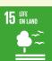  
Healthy Ecosystems

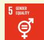  
Climate Action

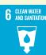  
Water

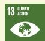  
Safe & Decent Work

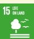  
Healthy Soils

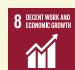  
Diversity & Inclusion

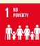  
Economic Opportunity

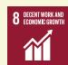

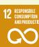  
Food Loss, Waste & Packaging

  
Nutrition & Health

# Sourcing

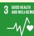  
Education & Skills

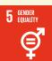  
Climat Action

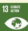  
Safe & Decent Work

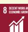  
Diversity & Inclusion

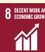

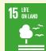  
Healthy Ecosystems

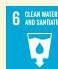  
Water

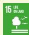  
Healthy Soils

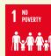  
Economic Opportunity

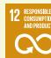  
Food Loss, Waste & Packaging

# Distribution

  
Nutrition & Health

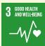  
Education & Skills

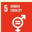  
Climate Action

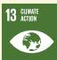  
Safe & Decent Work

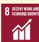

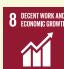  
Diversity & Inclusion

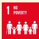  
Economic Opportunity

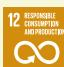  
Food Loss, Waste & Packaging

  
Nutrition & Health

# Processing,

# Manufacturing & R&D

  
Education & Skills

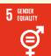  
Healthy Soils

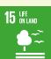  
Economic Opportunity

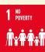  
Food Loss, Waste & Packaging

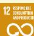

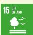  
Healthy Ecosystems

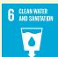  
Water

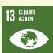  
Climate Action

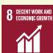  
Safe & Decent Work

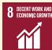  
Diversity & Inclusion

# Customer

  
Nutrition & Health

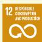  
Food Loss, Waste & Packaging

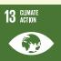  
Climate Action

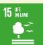  
Healthy Soils

  
Nutrition & Health

# Consumer

  
Climate Action

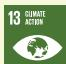  
Healthy Soils

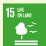

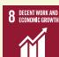  
Diversity & Inclusion

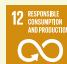  
Food Loss, Waste & Packaging

# Engaging with our stakeholders

We value and recognise the importance of maintaining engagement with our stakeholders. We have a commitment to open and constructive dialogue and to listening to different stakeholder views that help us to share knowledge, improve understanding, maintain trust and support us to deliver against our strategic, commercial and sustainability priorities.

The table below sets out how we have engaged with each of our key stakeholders.

<table><tr><td>Stakeholder</td><td>Why we engage</td><td>How we engaged in 2024</td></tr><tr><td>Employees</td><td>Our employees are our most important asset and their talent, capabilities and commitment is critical to our continued long-term performance. We are committed to fostering a strong culture and values to enable every employee to feel valued, and to have the opportunity to fulfil their potential.</td><td>Regular and open dialogue through in-person and virtual meetings, briefings, conferences and safety sessions, at all levels.Surveys and feedback.Leader updates and townhall meetings at operating group, business, function and country levels.Digital channels including our employee apps and email.Engagement forums with employees and employee representatives.Training and capability building, such as leadership programmes and values workshops.Employee Resource Groups (ERGs) to support engagement and inclusion.</td></tr><tr><td>Customers</td><td>We strive to be the partner of choice for our customers. Through our collaborations we aim to identify, innovate, and deliver products, services, and solutions that meet their needs and unlock mutual value.</td><td>Regular direct interactions and day-to-day dialogue.Face-to-face meetings, site visits, virtual sessions and reviews.Industry and sector events, forums, exhibitions that include in-person, virtual and hybrid sessions.</td></tr><tr><td>Investors</td><td>Our equity and debt capital providers are fundamental to enabling us to pursue and execute our strategy. We aim to ensure shareholders, potential investors, analysts, and debt capital providers understand our strategy, growth potential and performance, including ESG impacts.</td><td>Investor and shareholder meetings and outreach programmes, including participation in investor forums.Investor briefings and live webcasts on half-yearly results and major announcements. Regular engagement with financial stakeholders, including banks and lenders, on geopolitical and macro-economic issues, and updates on progress of our Re-organisation. Resources for investors on olamgroup.com.</td></tr><tr><td>Suppliers</td><td>Our suppliers and partners play an important role in helping us to deliver our products and services and to operate our business efficiently. We work closely to build long-term relationships with both smallholder and large-scale farmers across multiple supply chains and geographies, underpinned by our Supplier Code adapted by offi and Olam Agri respectively. We are also strengthening relationships with our key non-commodity suppliers.</td><td>• Direct engagement with global, regional and local suppliers across our supply chains to manage continuity of supply and mitigate risks and impacts arising from market-related events.
• Engagement with farmers and producers for directly originated volumes in line with our Supplier Code and through our sustainability programmes.
• Strategic programme for non-commodity suppliers in key areas including marine freight, equipment, fertilisers, pesticides and packaging.</td></tr><tr><td>Communities</td><td>The trust and support of the communities where we work and operate is essential. In multiple locations and markets, we provide employment opportunities, contribute to economic prosperity, and provide essential support to local communities.</td><td>• Regular engagement through multiple channels including in-person meetings, consultations, email, newsletters to share updates and exchange perspectives.
• Continued support for local communities through programmes and projects that provide in-kind and financial support to improve access to education, healthcare, nutrition and income-generating opportunities.
• Open dialogue to listen and address issues that concern or may impact communities.</td></tr><tr><td>Government</td><td>We engage constructively with governments, policy makers and regulators in each of the markets where we operate, particularly in relation to existing and proposed policies and regulations which may influence our business and our licence to operate.</td><td>• Open and constructive engagement with national and local governments, and regulators, to support development of the food and agricultural sector, strengthen food security, improve the livelihoods of farmer households, and support sustainable production practices.
• All interactions are compliant with all applicable laws and carried out in a transparent manner in line with our Code of Conduct. We do not support or fund political parties, candidates or any groups that promote party interests.</td></tr><tr><td>Civil society</td><td>We engage and partner with NGOs, development organisations, industry groups and academia to help advance efforts to protect our environments, safeguard farmer livelihoods and deliver a more food secure future.</td><td>• Actively engage in industry, sector and multistakeholder initiatives on key topics and programmes.
• Direct engagement with NGOs on key issues to exchange knowledge, improve understanding and discuss actions and progress.
• Partnership and collaboration with universities, research institutions and development organisations to develop and implement projects to deliver tangible impacts.</td></tr></table>

# Areas important to our stakeholders and potential impact

<table><tr><td>Areas of impact</td><td>Level of stakeholder interest</td><td>Potential impact on business/reputation</td><td>Relevant SDG indicators</td><td>Read more</td></tr><tr><td colspan="5">Food Loss, Waste &amp; Packaging</td></tr><tr><td>Post-harvest losses</td><td>Medium</td><td>Low</td><td>12.3</td><td>Pages 83, 110, 111, 131</td></tr><tr><td>Consumer food waste</td><td>Low</td><td>Low</td><td>12.3</td><td>Page 110</td></tr><tr><td colspan="5">Nutrition &amp; Health</td></tr><tr><td>Product safety</td><td>Medium</td><td>High</td><td>2.1</td><td>Pages 30, 48, 52, 54, 88</td></tr><tr><td>Product nutrition</td><td>Medium</td><td>Medium</td><td>2.1</td><td>Pages 82, 119 to 121</td></tr><tr><td>Community health</td><td>Medium</td><td>High</td><td>3.3</td><td>Pages 41, 52, 54, 60, 114, 117, 119, 120</td></tr><tr><td>Food and nutrition security</td><td>High</td><td>Medium</td><td>2.1, 2.2</td><td>Pages 119 to 121, 124, 130, 131, 156, 160</td></tr><tr><td>Water, Sanitation and Hygiene (WASH)</td><td>Medium</td><td>Medium</td><td>6.1, 6.2, 6.a, 6.b</td><td>Pages 120, 124, 130, 131</td></tr><tr><td colspan="5">Education &amp; Skills</td></tr><tr><td>Supporting access to schools</td><td>Medium</td><td>Medium</td><td>4.1, 4.2</td><td>Pages 81, 113, 114, 116, 128, 154, 155</td></tr><tr><td>Literacy and numeracy</td><td>Low</td><td>Medium</td><td>4.6</td><td>Pages 114, 117, 155, 159, 160</td></tr><tr><td>Youth and next-generation skills</td><td>Medium</td><td>High</td><td>4.3, 4.4</td><td>Pages 108, 114, 118</td></tr><tr><td colspan="5">Climate Action</td></tr><tr><td>Science-Based Target (SBTi)</td><td>High</td><td>High</td><td>2.4, 13.2</td><td>Pages 97, 98, 140</td></tr><tr><td>GHG emissions</td><td>High</td><td>High</td><td>9.4, 13.2</td><td>Pages 42, 59, 97, 98, 100, 103, 134, 140, 148, 150, 152, 153, 161, 162</td></tr><tr><td>% renewable energy</td><td>Medium</td><td>High</td><td>7.2</td><td>Pages 59, 100, 101, 136, 162</td></tr><tr><td>Packaging (renewable, recyclable etc.)</td><td>Medium</td><td>Low</td><td>12.5</td><td>Pages 63, 110</td></tr><tr><td colspan="5">Safe &amp; Decent Work</td></tr><tr><td>Safety and health</td><td>High</td><td>Medium</td><td>8.8</td><td>Pages 30, 48, 80, 88, 127, 129</td></tr><tr><td>Living wage</td><td>Medium</td><td>Medium</td><td>1.2, 1.4</td><td>Page 130</td></tr><tr><td>Collective bargaining and freedom of association/labour relations</td><td>High</td><td>Medium</td><td>8.8</td><td>Pages 80, 130</td></tr><tr><td>Grievance mechanisms</td><td>High</td><td>High</td><td>8.8</td><td>Pages 116, 130</td></tr><tr><td>Human rights</td><td>High</td><td>High</td><td>8.5, 8.7, 8.8, 10.2, 16.2</td><td>Pages 41, 42, 102, 104, 113, 115, 116, 124, 130</td></tr><tr><td>Child labour</td><td>High</td><td>High</td><td>8.7, 16.2</td><td>Pages 38, 41, 114-116, 118, 144</td></tr><tr><td>Forced, bonded labour</td><td>Medium</td><td>High</td><td>8.7, 16.2</td><td>Pages 116, 144</td></tr><tr><td colspan="5">Diversity &amp; Inclusion</td></tr><tr><td>Women in senior roles in the workplace</td><td>High</td><td>Medium</td><td>5.5, 10.2</td><td>Pages 75, 80, 123</td></tr><tr><td>Female farmer empowerment</td><td>Medium</td><td>Medium</td><td>5.5, 10.2, 5.a, 5.b</td><td>Pages 52, 54, 100, 105, 108, 112, 114, 116 to 118, 120, 121, 153</td></tr><tr><td>Discrimination/racism in the workplace</td><td>Medium</td><td>Medium</td><td>10.2</td><td>Pages 49, 117, 123</td></tr><tr><td colspan="5">Healthy Ecosystems</td></tr><tr><td>Reducing deforestation</td><td>High</td><td>High</td><td>11.4, 15.1, 15.2</td><td>Pages 38, 54, 98, 102-105, 132, 136</td></tr><tr><td>Biodiversity</td><td>Medium</td><td>Medium</td><td>15.5, 15.7</td><td>Pages 31, 58, 80, 100, 102, 106, 139, 141, 150, 153</td></tr><tr><td>Living landscapes</td><td>Medium</td><td>High</td><td>15.1, 15.2, 15.3, 15.b</td><td>Pages 41, 138</td></tr><tr><td colspan="5">Water</td></tr><tr><td>Water stress/scarcity</td><td>Medium</td><td>Medium</td><td>6.4</td><td>Page 132, 137, 144, 162</td></tr><tr><td>Protection of water courses</td><td>Medium</td><td>Medium</td><td>6.3, 6.6</td><td>Pages 59, 84, 100, 108, 109</td></tr><tr><td>Effluent/wastewater</td><td>Low</td><td>Medium</td><td>6.3</td><td>Pages 83, 109, 161, 162</td></tr><tr><td colspan="5">Healthy Soils</td></tr><tr><td>Soil degradation</td><td>Medium</td><td>High</td><td>15.3</td><td>Pages 58, 147</td></tr><tr><td>Pesticides/herbicides</td><td>Medium</td><td>Medium</td><td>15.3</td><td>Pages 109, 148 to 150, 153, 160</td></tr><tr><td>Fertiliser access and use</td><td>Medium</td><td>High</td><td>15.3</td><td>Pages 58, 98, 100, 108, 109, 148, 149, 153, 160</td></tr><tr><td colspan="5">Economic Opportunity</td></tr><tr><td>Living income</td><td>High</td><td>High</td><td>1.2, 1.4</td><td>Pages 111 to 113, 156</td></tr><tr><td>Farmers' productivity</td><td>Medium</td><td>High</td><td>1.2, 1.4, 2.3, 2.4, 2.a, 8.2</td><td>Pages 37, 53, 83, 98, 100, 106, 108, 110 to 112, 114, 149, 155, 157, 159</td></tr><tr><td>Land rights</td><td>Medium</td><td>Medium</td><td>1.4</td><td>Pages 105, 117</td></tr><tr><td>Resilience to external shocks</td><td>High</td><td>High</td><td>1.5, 2.4, 3.3, 13.1 13.3</td><td>Pages 31, 98, 108, 132, 135, 136, 138, 139</td></tr><tr><td colspan="5">How we work</td></tr><tr><td>Anti-bribery and corruption</td><td>Medium</td><td>High</td><td>16.5</td><td>Pages 88, 145</td></tr><tr><td>Ethics and compliance</td><td>High</td><td>High</td><td>16.5</td><td>Pages 87, 88, 104, 105, 115, 130, 145</td></tr><tr><td>Transparency and traceability</td><td>High</td><td>High</td><td>16.6</td><td>Pages 38, 42, 54, 55, 59, 88, 100, 102 to 105</td></tr><tr><td>Animal welfare</td><td>Medium</td><td>Medium</td><td>2.3, 2.4, 15.7, 15.c</td><td>Page 48, 63</td></tr><tr><td>Supplier management</td><td>High</td><td>High</td><td>12.2, 12.6</td><td>Pages 88, 93, 115</td></tr><tr><td>Community relations</td><td>High</td><td>Medium</td><td>12.8</td><td>Pages 54, 60, 81, 93</td></tr></table>

In June, a small protest by the climate activist group Extinction Rebellion (XR), took place at the Koog cocoa processing facility in the Netherlands. The protest was part of XR's monthly Air Raid Alarm (Climate Alarm) campaign which saw protests held across multiple companies and other locations in the Netherlands. At Koog, they mainly wanted to highlight the impact of ammonia emissions from the 'dutching' process on the environment, and also to point out the inequalities in the cocoa sector supply chain and impact of deforestation.

In the cocoa processing sector, ammonia is emitted during the production process as part of alkalisation, or 'dutching', which darkens the colour and modifies the flavour of cocoa nibs. The amount of ammonia released during production and in the alkalisation process at the Koog facility was reduced by  $84\%$  following the installation of Regenerative Thermal Oxidizers (RTOs), in 2022.

In line with the requirements of our local authority permit on ammonia emissions, we installed additional best-available technology in 2024 and expect to reduce our Koog ammonia emissions total by over  $95\%$  in 2025, from the 2020 baseline.

The social and environmental challenges of the production of cocoa in Ghana were highlighted in a report on the sector by Mighty Earth, published in December 2024. Two areas were examined within the report, and ofi advised that it does not source from one, while cocoa farms within the second had legal status. For more information on how we address deforestation challenges in the cocoa supply chain, please see the latest Cocoa Compass Impact Report, published in December 2024.

In September 2024, Olam Group announced a settlement with the Commodity Futures Trading Commission (CFTC). In settling the matter, Olam agreed to pay US$3.25 million without admitting or denying the CFTC's findings. Olam cooperated fully with the Commission's investigation, which identified reporting violations resulting from Olam's delayed reporting of five sales of U.S.A. cotton in August and September 2021. The Company regards full adherence to the regulatory requirements in all the jurisdictions where it operates as a core principle of its business.

# Environment

We have a responsibility to protect the environment around us – not just by reducing our own environmental impact to help combat climate change, but to promote best practices across our industry, partners and supply chains. Our approach to protecting the environment should not be seen in isolation, but in conjunction with our other key sustainability focus areas – including policies and targets – within this report.

# Climate action

# Carbon footprint and targets

The Group aligns with the Greenhouse Gas (GHG) Protocol to measure carbon emissions: direct emissions from owned or controlled sources (Scope 1); indirect emissions from purchased energy (Scope 2); and indirect emissions that occur in the value chain (Scope 3) are quantified/calculated.

Olam Group has been a signatory of the 'Business Ambition for  $1.5^{\circ}\mathrm{C}$ ' commitment with approved targets since 2019. Olam Agri has set its GHG reduction target in line with SBTi  $1.5^{\circ}\mathrm{C}$  alignment guidance and is committed to seek validation of this target by SBTi in the next two years.

Olam Agri commits to reducing its GHG emissions from baseline year 2022:1

- Energy and industry emissions Reduce Scope 1, 2 and 3 GHG emissions by  $42\%$  by 2030.  
- Forest, land and agriculture (FLAG) emissions Reduce Scope 1 and 3 GHG emissions by  $30.3\%$  by 2030.

Measuring Olam Group's carbon footprint is the first step in informing our climate transition approach. To improve the accuracy of carbon footprint measurements, we use corporate footprint accounting tools and processes aligned with the GHG Protocol. The Group uses Terrascope, a digital platform that enables companies to measure their emissions comprehensively and accurately, for GHG baselines and annual updates.

SBTi-aligned target-setting for Olam Agri is the next step of its climate transition strategy. ofi used Terrascope for its target-setting submission to SBTi.

For further details on both Olam Agri and offi's GHG reduction targets, please refer to Olam Group's 2024 Carbon Disclosure Project (CDP) disclosure.

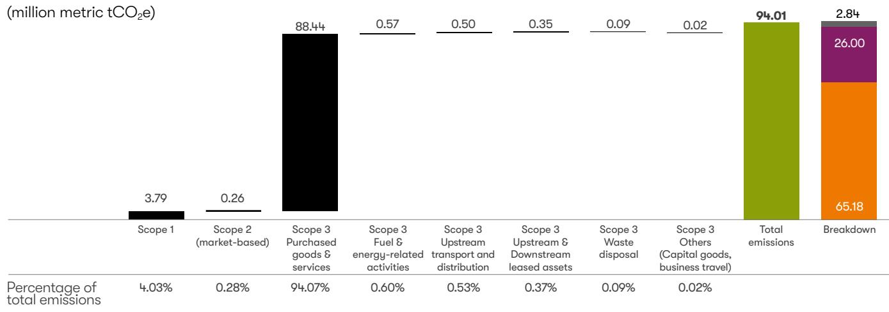  
Olam's total emissions in 2024

Olam Agri

ofi

Remaining Olam Group

Read more on Olam Group's 2024 emissions in our Supplementary Sustainability Disclosures report.

1. In line with the SBTi Corporate Near-term Criteria, the targets will cover at least  $95\%$  of total Scope 1 and 2 emissions, and at least  $67\%$  of total Scope 3 emissions. The Forest, Land and Agriculture (FLAG) Science Based Target Setting Guidance and absolute contraction approach was used to set the SBTi-aligned targets. There is no guidance available for the agriculture sector with reference to the sectoral decarbonisation approach  
We have applied the latest version of emission factors from Ecoinvent (version 3.11), DEFRA 2024, IEA 2024, agri-footprint (version 6.3) in line with industry best practice to utilise latest up-to-date emission factors.  
- Freight business: 2.79 million tCOe.  
Biogenic carbon: 2.14 million  $\mathrm{tCO_2e}$  arising from carbon dioxide emissions from biogenic sources have been categorised under "biogenic carbon" which is outside scopes 1, 2 and 3, in line with the Greenhouse Gas Protocol Agricultural Guidance. This accounting treatment of biogenic emissions is expected to undergo some changes as an updated guidance "GHG Protocol Land Sector and Removals" is expected to be released later this year.  
- Scope 2 location-based emissions: 0.33 million  $\mathrm{tCO_2e}$ .

ofi and Olam Agri, with inputs from external partners and consultants, have put in place target-setting and decarbonisation plans. A health check was conducted on all GHG data to model potential reductions, and a roadmap was developed to guide decarbonisation efforts for each business platform. Further data gaps required for ofi's SBTi submission were filled and validated targets were set for key origins within each business.

As Land-Use Change (LUC) emissions, especially historical deforestation, are the major drivers of off's Scope 3 emissions overall, particularly for cocoa and coffee, a specialist partner, AdAstra, was brought in to accurately estimate the impacts these have across key origin countries and model the impact of ending deforestation. These models are now incorporated into our forecasts and underline the weight given to work to end deforestation in our supply chains.

# Decarbonisation strategies

Once the carbon footprint and reduction targets are established, the next step is to develop strategies and programmes to tackle carbon emissions. Olam Group's operating groups have decarbonisation strategies in place which are refined and developed on an ongoing basis.

There are three levers to reduce the Group's carbon footprint:

1. energy efficiencies;  
2. climate-smart agriculture and nature-based solutions; and  
3. changing sourcing patterns.

# Verification of emissions reductions

ofi's aim is to generate and offer verified low-carbon volumes of cocoa, coffee and dairy in 2025, aiming to expand our offering to help customers meet their own Scope 3 emissions reductions targets, and demonstrating our ability to achieve our climate targets.

Working with SustainCert, $^2$  a verification platform that validates the design and verifies the impact of value chain interventions, we applied verification for carbon reduction projects in cocoa, coffee and dairy. This included establishing an auditing workflow and implementing consistent documentation, monitoring and reporting systems. This verification covers projects on dairy farms in New Zealand and Poland, which use feed additives to reduce methane. In our cocoa supply chain, we are auditing tree planting projects implemented in 2021 to verify the amount of GHG emissions these projects have removed/will remove from the atmosphere.

More accurate emission factors (enabled by enhanced product traceability) may also contribute to reducing the reported GHG footprint.

The strategy, which covers GHG emissions across Scope 1, Scope 2 and key categories within Scope 3, encompassing both our own operations and critical value chain emissions, is focused on accelerating transformative actions to decarbonise supply chains and drive meaningful and sustainable change.

Many decarbonisation solutions have a dual climate benefit – firstly, cutting carbon emissions in operations and across supply chains; and secondly facilitating climate change adaptation and improving climate resilience.

Regenerating nature to minimise and avoid any negative impacts is a key area of focus. Regenerative agriculture, agroforestry and reforestation initiatives, targeting an improvement in soil health in sourcing regions, play a role in reducing emissions in the following ways:

- carbon can be sequestered in soils and trees;  
- climate-smart practices including fertiliser and residue management, crop husbandry and yield optimisation can reduce emissions per tonne of product;

Methane emissions, such as from rice farming and coffee-washing stations, can be reduced by adopting better water management practices; and post-harvest losses can be cut by improving processing, drying and storage operations and facilities.

Working in partnership with our farmers and suppliers, we are undertaking a number of initiatives to improve practices and reduce emissions. ofi's award-winning Carbon Scenario Planner helps model the outcomes and most cost-effective interventions of different carbon reduction options for emissions on suppliers' farms (Scope 3), which are by far the largest contributor to our carbon footprint and that of our customers. We can then work closely with farmers and suppliers to incentivise and apply climate-smart practices, as well as end unacceptable land-use change, such as deforestation.

In 2024, Olam Agri's cotton business in Côte d'lvoire launched its regenagri® carbon insetting programme, a pioneering initiative to promote sustainable cotton production and reduce carbon emissions within the supply chain in the country. This programme aims to enhance cotton yields and lower production costs, while enabling farmers to benefit economically from insetting carbon credits. By integrating regenerative agriculture practices, it improves farm resilience to climate change and contributes to our sustainability goals. Alongside our partners, we continue to work directly with farmers to enhance and measure carbon sequestration, implement regenerative practices, and ensure the long-term sustainability of cotton production.

1. AdAstra offers data and expertise along agricultural supply chains to assess impact and make informed decisions. For more information, visit adastra.eco  
2. SustainCert is an independent Validation and Verification Body (WVB) for climate impact. For more information visit sustain-cert.com

# Calculating carbon capture for cocoa agroforestry

Since joining the Cocoa and Forests Initiative in 2017, ofi has been working towards helping all cocoa farmers who are participating in sustainability programmes in Ghana and Côte d'lvoire to convert their farms to agroforestry management.

As we are now able to measure tree survival rates, we can combine this with our Al-powered Carbon Stock Monitoring tool to provide a detailed assessment estimate of the carbon these trees have sequestered. This tool can also be used to show the carbon savings in specific customer supply chains and support them with long-term carbon reduction strategies. We provided one of our customers, a large chocolate brand, with a snapshot of the carbon sequestration and ecosystem benefits of agroforestry planted on specific farms in Côte d'lvoire. It showed that between the project starting in 2022 and the end of 2024, over 825,000 shade and fruit trees were planted, with a survival rate of  $80\%$ , which would sequester over 32,000 tonnes of carbon emissions.

Our wood business in the Republic of Congo launched a comprehensive Life Cycle Analysis (LCA) initiative to assess the environmental footprint of its Sapeli kiln-dried timber and other product lines, underscoring our commitment to sustainability and transparency within the forestry sector. This initiative utilises a 'cradle-to-gate' approach, examining impacts from raw material extraction to the factory gate, with modelling of potential end-of-life scenarios. A key element is the integration of independently verified Environmental Product Declarations (EPDs), providing stakeholders with transparent lifecycle performance data. This rigorous analysis allows us to refine processes, minimise environmental impacts, enhance resource efficiency and benchmark our products against alternative materials, highlighting the benefits of sustainably sourced timber.

Working with our partners and customers is key to continued progress and impact. ofi runs many customer-linked climate targets programmes across its origins with leading businesses. For example, with a global coffee customer in Peru, our coffee team has delivered GHG reductions by working with farmers on crop rejuvenation and crop residue management. On our own coffee estates, we continued our three-year partnership with Starbucks in Zambia, to convert pulp waste from coffee production into high-quality compost and biochar1 and to identify the most effective applications. Used on farms to reduce the use of nitrogen-based fertiliser, this is expected to reduce Scope 1 GHG emissions from agriculture, improve yields and sustain essential soil biodiversity.

In 2024, to deliver success at scale across multiple origins and geographies, ofi added a climate-smart cocoa manual to its Climate Action toolkit, which includes a list of practices and training guides tailored to support on-the-ground teams who implement climate action interventions. This is supported by our digital tools, which also include a carbon sequestration monitoring tool for scaled monitoring of removals.

For Scope 1 and 2 emissions, alongside exploring operating and process efficiencies, innovation and energy conservation, we are investing in renewable energy generation and switching to green grid electricity.

In our freight business, Olam Agri has adopted the ZeroNorth platform that optimises the routes taken by ships transporting our commodities, thereby supporting the Group's overall decarbonisation efforts. By using ZeroNorth's advanced Voyage Optimisation platform, Olam Agri can optimise fuel efficiency and time spent at sea for chartered vessels.

As part of our collective journey towards reducing our carbon footprint, Olam Group is improving energy efficiency and increasing our share of energy from renewables in our processing facilities. Olam Agri installed a large solar farm at our rice mill facility in Nigeria, which follows a similar initiative at our head office in Lagos in 2023. The solar farm will primarily be used to power our operations, resulting in cleaner, greener and more sustainable production processes.

# Carbon Offsetting Rice Emissions (CORE) in India

The CORE India project, a partnership between Olam Agri, Deutsche Gesellschaft für Internationale Zusammenarbeit (GIZ) GmbH, IRRI, and UN Women, empowers smallholder rice farmers to reduce GHG emissions (particularly methane from flooded fields) through climate-smart practices, including Alternate Wetting and Drying (AWD). Currently working with 13,353 farmers (11,882 women and 1,471 men) across three Indian states, the project provides climate-sensitive technologies, best practices and support for carbon credit accreditation. The goal by 2026 is to train 20,000 farmers, reduce  $\mathrm{CO}_{2}$  emissions by 90,000 tonnes, and empower 2,500 women farmers as leaders and entrepreneurs.

# Partnering with GIZ

Olam Agri has signed a Memorandum of Understanding (MoU) with GIZ to scale up sustainable development in the global agri-food sector. Three key objectives of the MoU are to: support sustainable food production at a range of scales towards climate adaptation while protecting and preserving soil health, biodiversity, and water resources; to improve the livelihoods of smallholder farmers and provide them with access to key services and inclusive opportunities; and to establish sustainability and traceability across agriculture supply chains.

Read more on how we are strengthening our partnership with GIZ on page 56 of the Olam Agri section.

66 The signing of this MoU with Olam Agri marks a pivotal step forward in our collaborative efforts towards sustainable food production. I am very happy and grateful that we can deepen and broaden our cooperation efforts simultaneously. We look forward to enhancing the scope and impact of our successful projects in climate-smart farming. 99

Anna Sophie Herken, Managing Director, GIZ

ofi has introduced solar panels for renewable energy generation in sites in Germany, Indonesia, Nigeria, Turkey and Vietnam. We also added another biomass boiler at our dairy facility in New Zealand, in addition to those which started operating in 2023 in the Netherlands and Germany.

As part of its decarbonisation strategy, ofi is now operating circular biomass boilers at cocoa processing factories in Brazil, Côte d'lvoire, Indonesia, Singapore, the Netherlands and Germany. These boilers use cocoa shells, a by-product of the production process, as fuel to generate steam, which in turn powers the production of cocoa ingredients at our factories. The boilers can reduce natural gas usage and  $\mathrm{CO}_{2}$  emissions at these facilities by up to  $50\%$ . In 2024, this resulted in a reduction of over  $4,900\mathrm{tCO}_{2}\mathrm{e}$  of natural gas emissions. The project was shortlisted for the edie Circular Innovation Sustainability Award.

In the Netherlands, ofi and the Commodity Centre Group created a cocoa bean warehouse terminal powered exclusively by green energy at the port of Amsterdam. Nearly 7,000 solar panels have been installed in the roof, covering an area the size of two football pitches. This has the potential to reduce  $\mathrm{CO}_{2}$  emissions by 1,350 tonnes per year.

# Did you know?

Educating our supply chain on the benefits of sustainably produced agricultural products is only one side of the equation. Co-creating solutions with customers is the other vital side. To help achieve this, Olam Agri is one of more than 20 corporate and research partners in the food sector that make up the First Movers Coalition for Food, participating in the row-crops (soy, maize, wheat) and rice value chain workstreams. This is a World Economic Forum (WEF) initiative, supported by the Emirates Government, working to foster market demand for low-emission agricultural products that support the transition to net zero and nature-positive food systems.

# Working with CGIAR

66 The CGIAR's Excellence in Agronomy Initiative, facilitated by IITA, has been privileged to work with ofi on farming systems and topics that matter to smallholder farmers in the tropics. In the climate action space, efforts have focused on the sustainable intensification of cocoa production, the scaling of climate-smart coffee systems, and the development of metrics for regenerative agriculture and decarbonisation of production systems. 99

Bernard Vanlauwe,

Research Director and Global Lead of EiA IITA (CGIAR)

# Renewable energy in almond orchards

In 2024, ofi installed a state-of-the-art renewable energy power plant adjacent to its almond orchard in Kerabury, New South Wales, Australia. The plant combines solar panels with a battery storage system and can generate up to 14MWh of solar energy annually - enough to meet  $80\%$  of the orchard's energy requirements. This installation reduces our annual GHG emissions by approximately 5,500 tonnes of  $\mathrm{CO}_{2}$  equivalent and decreases peak-load demands on the local power grid.

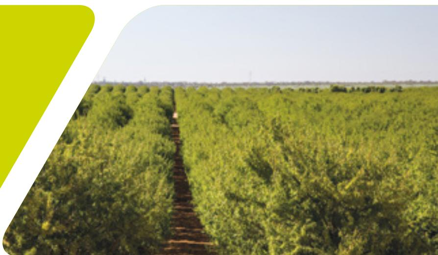

# Healthy ecosystems

We want to protect the biodiversity and ecosystems that support our supply chains and our operations, and enable farmers and their communities to prosper. Identifying high-risk areas by mapping our supply areas against forests, biodiversity, soil quality and natural water systems is critical in order to: (i) work with our suppliers to improve traceability and meet customer and regulatory expectations such as EUDR; (ii) to collaborate with industry action platforms such as the COP26 Agriculture Sector Roadmap to  $1.5^{\circ}\mathrm{C}$  and the COP28 Action Agenda on Regenerative Landscapes; and (iii) to take action on the ground through activities such as reforestation, integrated pest management, and wildlife protection.

We operate in landscapes with rich biodiversity, carbon sinks and ecosystems, many of which are exposed to multiple pressures including expanding agriculture and human activities that lead to forest loss and degradation. We strive to achieve tangible transformational impacts at scale over the long term by protecting, restoring and enhancing the services provided by nature to farmers and wider communities. We believe that scaled-up efforts in strategically important landscapes are essential to tackling systemic challenges such as poverty, human rights and deforestation, involving multiple partners and a landscape-scale vision for positive change.

Both ofi and Olam Agri used internally developed tools to prioritise landscape-level programmes. ofi used its internal Living Landscape framework to benchmark the status of around 30 large-scale supply sheds (including existing landscape-scale partnerships and its future pipeline) and will use the insights to guide the implementation of its target to achieve 10 landscape partnerships by 2025 and 20 by 2030.

# First edible oil refineries in Mozambique to gain RSPO certification

Fasorel SARL, Olam Agri's edible oil refinery business in Mozambique with facilities in Matola and Beira, achieved the significant milestone of being awarded the Roundtable on Sustainable Palm Oil (RSPO) certificate in recognition of its unparalleled commitment to sustainable sourcing and processing of palm oil. This global certification sets Fasorel apart from its peers as it is the only industry participant in the country to hold this accreditation and serves as a call to action for other companies in the region to adopt similar sustainable and responsible practices.

# Assessing ecosystem risks

ofi and Olam Agri harness both internal and external capabilities and technologies to assess deforestation, biodiversity, climate change, soil and land degradation-related risks across their processing facilities and sourcing regions. These include farmer field-mapping capabilities, such as the Olam Farmer Information System and Olam Agri's Spyder, and external sources such as Global Forest Watch, IBAT, Aquaduct and IUCN STAR.

We have conducted biodiversity risk assessments of 88 primary (Tier 1) $^{1}$  and secondary (Tier 2) $^{2}$  sites (68 Olam Agri, 20 OGH) using the Integrated Biodiversity Assessment Tool (IBAT-Pro) for multi-site reporting. These sites, encompassing a variety of operations – including cotton, wood, rubber, edible oils, integrated feed and protein, wheat, sesame, rice, and specialty grains – include large and small processing facilities, as well as large owned or operated warehouses. Smaller warehouses and corporate offices were excluded unless they shared a location with one of the aforementioned sites.

We used a 10-kilometre radius for the assessment to analyse the impact of processing activities on ecosystems. Of the 88 sites assessed, 39 are within 10-kilometres of a nationally or internationally recognised Protected Area and 20 are within 10-kilometres of a Key Biodiversity Area. When categorised according to the IBAT STAR Threat/ Abatement (STAR-T) score, four are considered high risk and 84 are considered between extremely low, very low or low risk.

Using the IBAT Alliance Enterprise Multi-Site Reporting, all 145 of ofi's Tier 1 and Tier  $2^{2}$  processing facility sites have been assessed for biodiversity risk. We have 74 sites within 10-kilometres of a nationally or internationally recognised Protected Area and 59 sites within 10-kilometres of a Key Biodiversity Area. Of the 145 sites, 86 are considered low, very low or extremely low risk. 59 are considered medium or high risk based on their STAR Threat/Abatement (STAR-T) scores.

# Agriculture Sector Roadmap to  $1.5^{\circ}\mathrm{C}$

Alongside 12 other global agribusinesses, Olam Group is a signatory to the COP26 Agriculture Sector Roadmap to  $1.5^{\circ}\mathrm{C}$ , and Olam Agri and ofi support the sectoral roadmaps for soy, palm and cocoa. Both are actively engaged in working groups to coordinate efforts, and in several initiatives to drive the impact at scale.

The Soy Sector Roadmap, signed by eight major soy trading and processing companies, aims to reduce emissions from land-use change in key South American biomes, aligned with the Paris Agreement's  $1.5^{\circ}\mathrm{C}$  pathway. In 2024, several actions were taken to advance the Roadmap objectives as a sector. These included hiring a Project Management Officer to strengthen governance, expanding the initiative to Argentina and Paraguay with a focus on the Chaco region, and conducting a baseline study for soy expansion in the Cerrado, serving as a pilot for other biomes. Furthermore, the signatories engaged with civil society and donor governments to report progress, clarify questions and explore opportunities for joint solutions in the lead-up to COP30.

The signatories also collaborated to further elaborate the Roadmap Operating Model, establishing parameters to make it operationally practical, focusing on monitoring direct and indirect suppliers. Under the operating model, companies will overlay soy production with deforested and converted areas for direct suppliers using an annually updated georeferenced layer, starting 1 January 2025. Indirect sourcing is traced to the first aggregation point, and a risk assessment will be conducted on a municipality level.

As a sector, we are working towards enhancing traceability and transparency in the soy supply chain. As published in the Soy Collective Progress Report by TFA, in the Roadmap Operating Model, FOB/Swap operations (i.e. traded volumes between signatories) are considered compliant due to mutual commitment, but traceability is needed when buying from non-signatories. At Olam Agri, we enhanced traceability in our origination volumes in 2024 and further segregated our volumes between Roadmap signatories versus non-signatories at port level, to improve traceability and comply with the Roadmap.

Olam Agri estimated GHG emissions for Brazilian purchased soy using the state-level emission factor (for origination volumes) and weighted average region-level emission factor (for traded volumes) instead of the Brazilian average (country-level) emission factor. The approach of using sourcing region-level traceability to inform emission factors is documented in the Accountability Framework initiative (AFi) guidance. The increased specificity of the emission factors has allowed us to differentiate between the land-use change owing to soy sourced from the Amazon biome versus that sourced from the non-Amazon biome, reducing the carbon intensity (per MT) by  $18\%$  for traded volumes compared with previous year (or nearly 2.8 million  $\mathrm{MTCO_2e}$ , based on FY23 traded volumes). We intend to continue to enhance transparency and traceability in the soy supply chain in 2025 in line with the Roadmap.

All signatories of the palm sector trade Roadmap are participants in the Palm Oil Collaboration Group (POCG). Progress by companies in the palm sector on No Deforestation, No Peat, and No Exploitation (NDPE) against the Implementation Reporting Framework (NDPE-IRF) has been enhanced this year. This tool has been developed by the POCG, facilitated by Proforest, to enable aligned progress reporting on NDPE commitments and awareness, and uptake is being encouraged across the sector.

We have maintained  $100\%$  traceability to mill (TTM) since 2020 and have achieved over  $80\%$  traceability to plantations (TTP) for our global volume, including the traded (direct and indirect) volumes. All three refineries under Olam Agri are RSPO-Certified and all of Olam Palm Gabon's (OPG) mills, refineries and plantations are RSPO-Certified. For NDPE-IRF, Olam Group (Olam Agri and OPG) achieved  $73.9\%$  delivering (on No-Deforestation) and  $73.3\%$  delivering (on No-Peat Expansion), and we continue to strive towards  $100\%$  delivering. In the 2024 SPOTT Sustainable Palm Oil assessment, Olam Group obtained a score of  $77\%$  and is among the top third of companies reporting under SPOTT. For further information on deforestation free volumes and traceability, please refer to the 2024 CDP Forest response for Olam Group.

# Updates on the EU Deforestation Regulation

Alongside proactive efforts to regenerate our living world, Olam Group is working to help customers meet increasing legislative requirements, including the forthcoming EU Deforestation Regulation (EUDR). The regulation mandates that, by the end of December 2025, any company placing products on or exporting from the EU market must conduct due diligence to guarantee that specified products are deforestation-free and comply with applicable local laws. These products include palm oil, soy, coffee, cocoa, timber, and rubber, as well as derived products like tyres or beef.

Olam Group has a history of working to address deforestation in smallholder supply chains. Our sourcing policies, traceability solutions and additional monitoring actions mean that we are well-placed to meet EUDR requirements before they become enforceable. This involves further investing in human resources and funding, tailored mapping and other digital systems, and engaging with partners and farmers. Our existing traceability and information systems already provide much of the data required for compliance and have been enhanced to ensure EUDR readiness, including traceability to individually mapped farms. We regularly perform extensive deforestation risk assessments using Google Earth Engine's planetary libraries and Global Forest Watch.

Traceability, sustainability analytics, promoting agroforestry and advancing sustainability programmes will help ofi and our customers meet EUDR requirements in coffee and cocoa ahead of time. Our deforestation risk assessments provide near real-time and historical monitoring of more than one million farm plots (including other commodities) mapped using our digital solutions, which are then followed up with field verification and inspection of flagged risks.

Similarly, Olam Agri has chain-of-custody in place for both its rubber and wood businesses to meet EUDR requirements. The rubber business ensures complete traceability from pallet to plantation, providing detailed chain-of-custody information via TruTrace. This in-house system aggregates data from our Olam Farmer Information System (OFIS), Digital Supplier Engagement (DSE), and SAP systems, offering full value chain visibility, including intermediaries. TruTrace also facilitates Know Your Customer (KYC) checks and risk assessments, including deforestation assessments using Global Forest Watch Pro for new suppliers. As a GPSNR signatory, Olam Agri champions sustainable natural rubber.

Our wood products, sold to the EU, originate from our 2.1 million ha of FSC®-Certified natural forest concessions in the Republic of Congo. This region features low deforestation rates and abundant forest cover. Our operations exceed EUDR requirements through sustainable practices, including nearly 20 years of Reduced Impact Logging (RIL), harvesting less than one tree per hectare every 30 years, which is significantly below regulatory limits. We employ a selective harvesting model based on the forest's natural regeneration capacity, and  $25\%$  of our concessions are permanently protected for conservation or community use.

# ofi supports its customers on EUDR

- Understanding the regulation: direct engagement with EU Commission, industry associations and sectoral forums;  
- Planning for success: product and function teams coordinating across key areas - field activities, sourcing, logistics, data management and traceability;  
-  $100\%$  traceable farm mapping as applicable: traceability and farm mapping from the farm through aggregators into our supply chains using GPS pins and polygons for farms larger than four hectares;  
- Risk assessment: deforestation, human rights risk and legality assessments are applied to our supply chains at different scales from landscape to farm plot;  
Field monitoring: ground verification of potential non-compliance risk flags to confirm causes and draw an action plan; and  
- Multi-stakeholder collaborations: working with sectoral alliances and governments to strengthen governance, and support traceability and compliance systems.

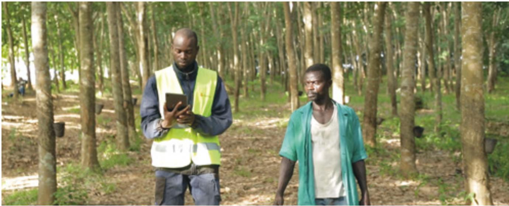  
Olam Agri enumerator collecting data in a rubber plantation, Côte d'lvoire

Our FSC®1 certification ensures chain-of-custody traceability from forest to final product. Enhanced by satellite image deforestation tracking and a digitised, tree-level tracking system, our processes provide robust transparency. A new customer portal will further streamline EUDR due diligence documentation access, integrating with the EU's portal. These measures position Olam Agri as a reliable supplier and sustainable forestry leader, exceeding not only EUDR but also standards like the UK Timber Regulation (UKTR) and the Lacey Act. Information and updates on our FSC®1 certification, licence numbers and concession maps are available on our website.

Consistent with our  $1.5^{\circ}\mathrm{C}$  Agriculture Roadmap commitment, we will source deforestation-free soy in the Chaco, Cerrado, and Amazon biomes by January 2025, and convert non-forest primary native vegetation no later than 2030. Our direct origination volumes in the soy supply chain in Brazil are fully traceable, though Olam Agri's sale of soybeans to the EU forms an insignificant portion of its total soy trading business.

Most of Olam Group's palm oil exported to the EU originates from our 63,300 ha,  $100\%$  RSPO-Certified OPG plantations, ensuring complete traceability and control. OPG monitors forest cover via ground patrols and drone surveys, and all production/conservation areas are precisely mapped using publicly available GIS polygons. Despite low EU sales volumes, we are committed to EUDR compliance, ensuring traceable, deforestation-free supply chains and aligning with our sustainability goals. Olam Agri's palm volume to Europe is negligible. Regardless, we are committed to sustainable and traceable supply chains with the commitment aiming to achieve '100% Delivering' status under the NDPE-IRF by the end of 2025 for our Olam Agri refineries, as per the  $1.5^{\circ}\mathrm{C}$  Agriculture Roadmap.

# Olam Agri's EUDR compliance and rubber traceability

Our Rubber IMPRINTS (Identification, Mitigation of Potential Risk In Navigating the Transformation of the Supply chain) programme has mapped almost 20,000 smallholder geolocations. In Côte d'Ivoire, a total of 24,000 farmers have been mapped since 2023, covering over 150,000 ha. Last year we mapped more than 8,400 ha, and a new collaboration with Preferred by Nature has added over 2,000 mapped farmers. Enumerators across these initiatives are trained on EUDR requirements. Through IMPRINTS, we supported our third-party partner factory, Rubber Jaya Lampung (RJL), in South Lampung to achieve EUDR compliance and EcoVadis certification.

We also expanded our GIZ partnership with two new rubber sector initiatives. In Côte d'lvoire, 75 cooperatives will receive EUDR training and consultations on social and environmental challenges, and 300 women producers will be trained in leadership and income generation. A green school for good tapping practices will also be established. In Indonesia, the collaboration will promote EUDR and other related standards, including farmer organisation creation, land tenure legality access, and good agricultural practices training for 2,000 farmers.

# 24,000 farmers

have been mapped in Côte d'lvoire since 2023, covering over 150,000 ha.

# Healthy soils

Healthy soils are essential for the climate-friendly production of food. Growing populations, the over-application and non-optimal use of fertilisers and synthetic nutrients, and poor land management practices – all are contributors to unhealthy and degraded soil. Degraded soil can be found in approximately one third1 of the Earth's land area. Not only does this impact the environment but also farmers' livelihoods – poor soils lead to poor yields, which result in lower incomes.

By committing to the protection and restoration of degraded soils through the use, and promotion, of regenerative agriculture practices, we can help restore soils in areas where we operate and in our supply chains and, in turn, improve farmer resilience and food security. Nature-based/ regenerative agriculture solutions that improve water management, or support the sequestration of carbon, play a role in mitigating both physical and transitional climate risks.

# Regenerative agriculture

Regenerative agriculture has emerged as a key solution to the pressing global challenges of deteriorating soil health, biodiversity loss, stagnating yields and intensifying climate extremes. To scale regenerative agriculture, we take a farmer-centric approach that is based on working with nature to build and, where necessary, restore or enhance natural capital (soil, water, biodiversity and climate) on farms and surrounding areas, optimising inputs and ceasing the use of harmful practices. Regenerative agriculture is gaining traction among agri-food industry leaders, civil society and farming communities. As well as having a positive impact on soil, water, biodiversity and climate, it also improves resilience through climate change adaptation, higher yields and improved profitability.

To improve soil health and water quality, enhance biodiversity and tackle climate change, we have a set of six principles that work together to enhance carbon sequestration and increase farm profitability:

1. minimise soil disturbance;  
2. keep soil covered;  
3. keep living roots in the soil;  
4. favour organic input sources;  
5. maximise farm diversity; and  
6. maximise livestock-crop synergies.

# Soil

Soil health can be improved by composting, cover cropping and erosion control, and careful soil amendments that remediate nutrient deficiencies or chemical imbalances.

# Water

Irrigation technology can lead to better water management, while soil organic matter and structure contribute both to good drainage and to soil water retention.

# Biodiversity

On-farm biodiversity can be improved with integrated pest management, intercropping, agroforestry or natural set-asides, and wildlife corridors.

# Climate

Farming GHG emissions can be reduced through climate-smart practices and preventing land-use change, and carbon is removed from the atmosphere into trees and soil, on- and off-farm.

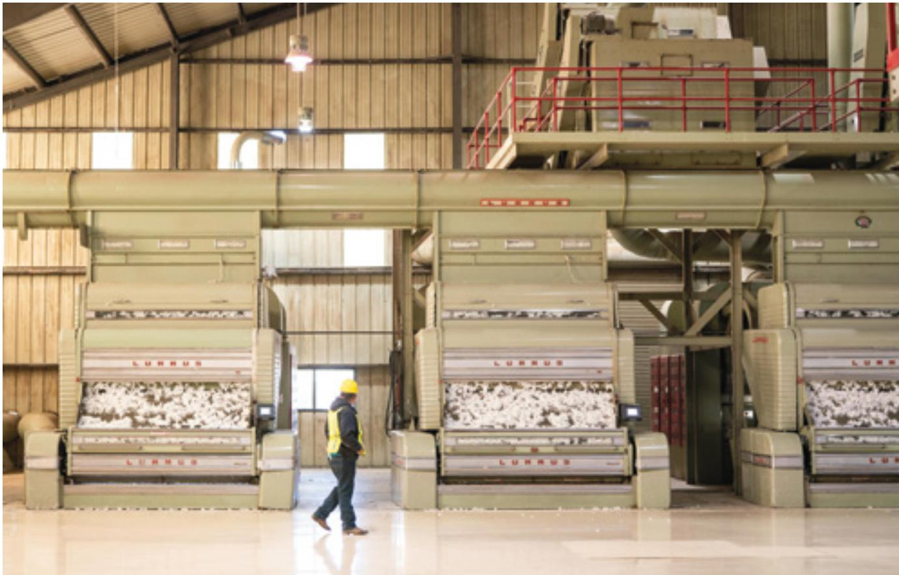  
Our cotton gins run efficiently throughout the season with careful maintenance programmes, U.S.A.

# Promoting regenerative agriculture in cotton in Togo

Two key projects were launched by Olam Agri in 2024 to initiate the transition to regenerative agriculture in cotton fields in Togo. The first project, supported by the University of Essex, integrates regenerative practices to strengthen supply chain sustainability by identifying practices, developing an adoption scorecard, facilitating farmer knowledge exchange, and creating a dissemination guidebook. The second project, funded by The British Academy, explores scaling regenerative practices, investigating farmer perceptions of climate change impact, co-developing inclusive agricultural systems, and establishing a Policy Lab to inform climate-resilient solutions in Togo.

Our cotton business in the U.S.A. collaborated with 39 producers across 16,000 ha on a regenagri® certification programme. The programme includes three gins, and all certified cotton is stored in an Olam Agri warehouse. This regenagri® cotton was sold in seven markets, working with over a dozen customers, including one leading international brand. 250,000 ha of land in the cotton production area of Côte d'lvoire were also certified under the regenagri® standard in 2024.

Read more about the environment and social impacts of regenerative agriculture for cotton farmers in Côte d'lvoire on pages 147 to 151 of the Multi-capital accounting section.

Olam Agri has implemented a three-year Supporting Sustainable Cotton Production (SSCP) project in partnership with Solidaridad in Côte d'lvoire and Chad. The project has been supported by the Sustainability and Value Added in Agricultural Supply Chains programme from GIZ, on behalf of the German Federal Ministry for Economic Cooperation and Development (BMZ).

# Did you know?

Olam Agri is one of  $25+$  leading food and agriculture organisations that joined forces through the COP28 Action Agenda on Regenerative Landscapes. The goal is to accelerate the transition to regenerative agriculture in high-impact landscapes at scale.

In total, the project aims to assist 32,500 cotton producers, including women and youths in Togo, Côte d'lvoire and Chad. The aim is to encourage sustainable cotton production with minimised chemical inputs and environmental impact, while enhancing climate change resilience. As part of the project, more than 7,000 farmers have been trained in Côte d'lvoire, more than 8,500 in Togo and just over 11,000 in Chad. 600 farmer field schools (FFS) have been established in Côte d'lvoire, more than 400 in Togo and over 350 in Chad – a powerful example of how collaboration can unite communities and ensure a sustainable cotton future.

As part of the SSCP project, Olam Agri established a Rural Service Centre in Chad. This initiative aims to enhance access to agricultural services and financial support for cotton farmers. By providing essential equipment such as transport, harvesting tools and IT infrastructure, we have empowered local communities and improved agricultural practices. This project demonstrates our commitment to sustainable agriculture and the development of resilient rural communities in Chad.

In addition, the project led to the development of infographic material on sustainability standards from child protection to good agricultural practices, which have been distributed to field agents in the project areas.

ofi's dedicated regenerative agriculture team has developed a framework that shapes our strategy, accompanied by an implementation flow to ensure a consistent and effective approach to every project we undertake. The approach is based on key design principles to ensure it is robust, scalable, actionable and relevant. In 2024, we trained agronomists from seven origin countries across Latin America and Asia on context-specific and farmer-centric best practices to guide their training with farmers.

Subsequent practices implemented included training smallholder coffee farmers in East Java, Indonesia on pruning, shade management, and the benefits of precision fertiliser. We created an agronomy toolbox for these farmers, including a crop forecasting protocol and tools for nutrient diagnosis, soil liming, cover crops and weed control, and pest and disease monitoring.

In Brazil, where coffee farms tend to be larger and more mechanised, we have worked with over 400 farmers across 22,000 ha on improving nutrient management, particularly on the use of nitrogen as a fertiliser. Our agronomists visit these farms three times a year to work with farmers on pest management, soil fertilisation and erosion prevention practices with the aim of helping participating farmers improve yields while reducing fertiliser use and associated carbon emissions.

# Did you know?

The 2024 Reuters Sustainability Awards shortlisted of in the Business Transformation category for pioneering work in natural capital accounting. We are applying multi-capital accounting to assess the year-on-year monetary impact of selected coffee and cocoa programmes. In addition, Olam Agri's sustainable rice project in Asia, 'Better Rice, Better Life', was shortlisted as a finalist across two categories for the 2024 SABRE Awards Asia-Pacific.

# AI and robotics are helping to protect pollinators and our favourite almond snacks

ofi has replaced  $\sim 2,800$  of its traditional wooden beehives in California with the BeeHome™, an AI - and robotics-powered hive developed by our partner Beewise, that provides remote automated beekeeping at scale. In 2024, ofi was able to preserve the lives of over 6.3 million bees by using BeeHomes™ in our orchards in California.

  
Smallholder rice farming in Vietnam

# Water

The effective management of freshwater resources across both our own operations and that of our supply chains is critical to everything we do. Ensuring high water quality, understanding risks and protecting resources are key areas of focus. We are a signatory to the CEO Water Mandate, a UN Global Compact initiative that mobilises business leaders on water, sanitation and Sustainable Development Goals. Our commitment to the Mandate forms part of our strategy to understand, mitigate and manage our water risks.

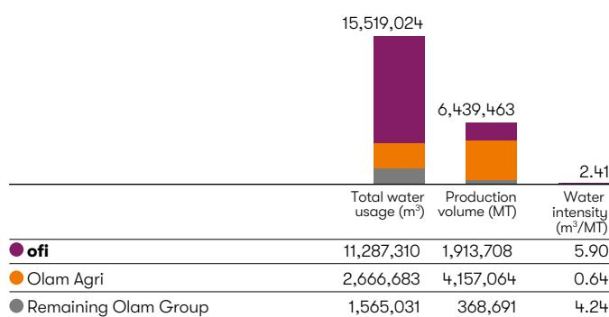  
Olam Group processing water usage

Read more about Olam Group's water management in our Supplementary Sustainability Disclosures report.

In India, Thailand and Vietnam, Olam Agri has been working with smallholder farmers to adopt more sustainable approaches to rice farming. One of these is Alternate Wetting and Drying (AWD). Traditionally, rice paddies are flooded year-round, but AWD involves alternating periods of flooding and draining to dramatically reduce water use and GHG emissions without compromising yield or quality. We are implementing techniques such as machine-transplanting, drones for pesticide spraying and laser land-levelling, which not only makes farming less labour-intensive but also improves water and fertiliser management.

ofi, supported by Starbucks, has invested in eco-pulpers on coffee farms in Mexico to reduce water consumption and environmental pollution in the primary coffee processing stage. Our measurements show these pulpers can reduce water usage by up to  $80\%$  compared to traditional methods, without any impact on quality. As well as avoiding water use in pulping and washing, eco-pulpers remove the need for wastewater ponds resulting from the traditional water-based process, which create GHG emissions and can cause pollution in local water sources. The local team installed nine new pulpers on coffee farms in Chiapas and Veracruz, to complement six pulpers which have been in place since 2021. Farmers are being trained to use the new pulpers from early 2025.

# Food loss, waste and packaging

Globally,  $40\%$  of all food produced gets lost or wasted instead of consumed. Much of this food is lost during harvesting, drying, storing and transportation. As well as working to reduce losses at its own operations, Olam Agri is strategically placed to help smallholder farmers across its supply chains reduce on-farm losses. Production systems across less-developed countries are relatively less efficient and streamlined, so we work with farmers to reduce losses and increase efficiencies.

Olam Agri aims to reduce post-harvest losses by  $50\%$  in our direct smallholder supply chain programmes where farmers experience high losses. Reducing losses has multiple benefits: preserving farmers' yields, increasing their incomes, and reducing land and carbon footprint per unit of production.

We completed 10 out of 12 baseline studies by 2024, and identified four with higher losses. The studies examine losses at each stage – including harvesting, threshing, winnowing, and storing, whatever may apply to a particular crop – enabling us to pinpoint hotspots for action. We have piloted tailored solutions, such as hermetic and insect-free storage, low-budget moisture assessment, and motorised harvesting in our Nigeria wheat supply chain. Our goal for 2025 is to scale these interventions up further and expand them to our sesame supply chain.

Olam Agri works with wider industry efforts to reduce post-harvest loss through its membership and co-Chair position in Champions 12.3, a coalition of executives from governments, businesses and civil society committed to achieving SDG 12.3 (on food loss and waste) by 2030. We are the first company to have signed up for the 10x20kx30 initiative, a collaborative effort of 10 farm-facing companies to engage at least 20,000 smallholders to halve their on-farm losses by 2030.

Olam Agri is also a member of the World Business Council for Sustainable Development (WBCSD) Taskforce on Post-Harvest Loss and is co-leader of the Sustainable Rice Platform (SRP) Food Loss and Waste Task Force.

# Packaging

In 2024, ofi completed an initial trial of mono-polyethylene pouches for one of its largest customers. These single material pouches are easier to recycle and typically have a lower carbon footprint than other packaging due to their lightweight structure. We achieved  $\mathsf{H}_2\mathsf{R}$  (How2Recycle) certification for these pouches, meaning that consumers can take items marked with this label to participating retail stores where they can be collected for recycling. We will transition all packaging for this large customer to these new pouches by the end of Q1 2025.

In addition, ofi's packaging Centre of Excellence team has identified a mono-polyethylene film that works within its current processing and packaging facilities. This will help achieve the same recycling certification. In 2024, the film was tested with two of our largest customers' products.

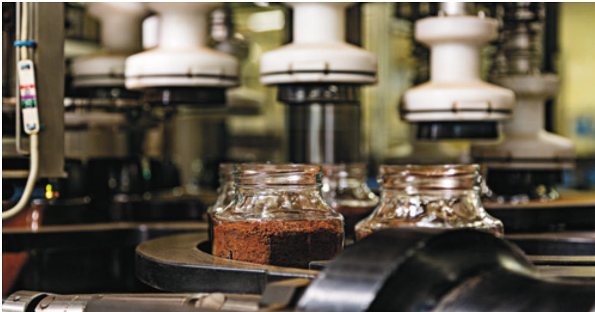  
ofi's packaging Centre of Excellence continues to explore alternative packaging solutions, without compromising product quality  
1. Defined as over  $10\%$  harvest and post-harvest loss, as assessed in baseline studies

# Social

Millions of farmers from all around the world supply us with the raw materials we need for our operations. They range from those who manage large-scale, mechanised farms growing produce such as peanuts, almonds or soy to smallholders farming a few hectares of land to produce a wide range of crops from spices and coffee to cotton and rice. Our business depends on the security of supply that comes from resilient farming communities, where producers have the opportunity to prosper and achieve a decent standard of living for themselves and their families.

# Economic opportunity

Improving the livelihoods of producers delivers benefits for the farmers themselves, as well as for the environment and our Company. Sustainable practices help protect the environment and increase resilience, which in turn help safeguard the supply of ingredients and raw materials for the future.

Helping farmers grow their incomes is achieved in a number of ways:

- increasing yields – helping farmers to have healthier soils through regenerative practices, access to better quality and quantity of inputs such as seeds and fertilisers, improved knowledge on good agricultural practices through our field staff providing training and coaching, as well as through our farmer field schools and farmer exchanges;  
- reducing costs – securing cost efficiencies through bulk purchases of agri-inputs, and helping farmers manage nutrients better (for example, by soil and leaf sampling so farmers apply only what is needed), and to apply integrated fertility management practices that incorporate organic fertilisers/compost/bokashi or natural pest control;  
- reducing harvest and post-harvest losses – deploying best practices so harvest losses can be reduced, enabling farmers to retain more of what they grow and therefore earn more income; and  
diversifying income sources – mobilising Village Savings and Loan Associations (VSLAs), which help self-finance income-generating activities, and supporting activities such as vegetable growing and poultry farming, through which farmers can grow their income streams.

In 2024, our field teams continued to help farmers transition to sustainable practices and enhance yields, capture efficiencies and maximise their incomes, and also supported farmers' efforts to diversify their revenue streams so that overall income levels can grow and become more resilient. Our agronomists' and plant scientists' insights and work play a key role in helping farmers access improved techniques and interventions.

To ensure our programmes have a meaningful impact on the lives of farmers and communities, we are working to customise interventions so that they align closely with farmers' specific needs and contexts. The multiple dimensions of poverty in agricultural supply chains mean that making meaningful improvements to farmers' livelihoods requires a holistic approach. Thus we have developed tools that enable us to monitor and measure key indicators, such as the living income gap, so that we are able to tailor training and direct resources to where they are needed most. Identifying and facilitating alternative sources of income is a means of closing the living income gap. This helps tackle other issues, such as child labour and deforestation.

# 531,000+ farmers

benefitted from livelihood support including training, agricultural inputs, credit, infrastructure and other forms of support through customer and industry-wide partnerships.

The Living Income Community of Practice defines a 'Living Income' as the net annual income required for a household in a particular place to afford a decent standard of living for all members of that household. Elements of a decent standard of living include food, water, housing, education, healthcare, transportation, clothing, and other essential needs, including provisions for unexpected events.

Our shared living income calculator, the Living Income Gap Heuristic Tool (LIGHT), allows us to assess what proportion of farmers in our different supply chains achieve a living income and, for those who are not, to understand the size and nature of the gap. The tool estimates farmers' total net household income which can then be compared to the relevant living income benchmark, a challenging process involving thousands of farmers across both of its and Olam Agri's supply chains.

Since launching our living income calculator in 2021, we have used it to assess living income gaps in 21 supply chains. In 2024, Olam Agri and ofi expanded its application, evaluating several new origins. ofi assessed coffee farmers in Nicaragua, Guatemala, India, and Mexico, along with cashew farmers in Côte d'lvoire, while Olam Agri assessed Togo cotton, Côte d'lvoire rubber, and Peru superfoods (assessment pending completion). Living income gap hotspots were identified in Côte d'lvoire, Mexico, and Guatemala, where over three quarters of surveyed coffee farmers earned below the living income threshold. The calculator simulated the impact of specific income drivers, enabling local teams to select appropriate interventions. These included promoting good agricultural practices for higher yields, optimising nutrient management for lower costs, and exploring diverse employment opportunities.

In 2024, the tool was refined to incorporate more detailed information about farmer segment characteristics and the necessary levers for achieving a living income within each segment. We continued efforts to make this tool available to the wider industry.

# Partnership with 100WEEKS

In 2024, an impact assessment of ofi's pilot project with NGO 100WEEKS in Uganda's Sironko district revealed that livelihood support delivered to approximately 100 coffee farmers between September 2022 and August 2023, unlocked longer-term benefits and capabilities for the farmers one year after the project's completion. The partnership provided 100 coffee farmers at the bottom of the pyramid with weekly cash transfers and training to alleviate debt pressures and incentivise farm investment.

Data results for the post-programme survey in August 2024 showed that the share of farmers in the project deemed 'non-poor' by the Multidimensional Poverty Index (MPI) was  $68\%$  compared to the  $16\%$  baseline in 2022. In a similar trend, household food security improved from an  $11\%$  baseline to  $71\%$ , which is over  $10\%$  higher than the national benchmark at the time.

Small changes in farming technology, such as introducing affordable and efficient sustainable harvesting technologies, can also make a real difference in farmers' lives while supporting the broader food system.

# Protecting traditional palm oil extracting methods in Nigeria

In the heart of Ondo State, Nigeria, women meticulously harvest oil palm fruit, using traditional extraction methods rooted in centuries of indigenous knowledge. These techniques are crucial to the livelihoods of the women and their families. Olam Agri protects this, while at the same time, improving women's livelihoods across Nigeria's palm oil value chain and prioritising environmental sustainability and safety. Processes at Olam Agri's RSPO-Certified refinery in Lagos City, Ruyat Oil, have been adapted so that it can accept and efficiently process this oil. By making this adaptation, Olam Agri can continue to support these communities and preserve the traditional, non-mechanised palm oil extraction methods. Our refinery began with a capacity of 100 metric tonnes (MT) per day, and has since expanded to 200 MT per day.

Both Olam Agri and ofi strive to lift the incomes of farmer households and close the living income gap, assessed with the help of the LIGHT tool. We target 200,000 ofi farmer households achieving a living income by 2030, and a further 500,000 Olam Agri farmer households increasing their net incomes by 2030. At Olam Agri, this includes sponsoring a full living income benchmark study in rural Benue State, Nigeria. The results of the study provided invaluable insights into the living conditions of our rice and sesame farming communities. In all the major ofi supply chains, approximately the top  $30\%$  of coffee farmers supply about  $70\%$  of the total coffee volume, while the bottom  $50\%$  of farmers generally supply less than  $20\%$  of the total volume.1 Finding ways to help this bottom  $50\%$  to improve their yield and return on effort and investment, in conjunction with alternative economic opportunities, is key to addressing Living Income.

In addition to LIGHT, which can assess the living income gap and trends at a farmer-group level, ofi developed a cocoa Farmer Income Tool which it has used since 2022 to provide living income insights for individual farmers. Only  $13\%$  of cocoa farmers sampled in 2023 achieved a living income but this varies greatly across and even within origins. In 2024, Cocoa continued to evolve its methods to provide even more powerful insights and develop more effective interventions.

Tackling the complex challenge of improving total household incomes requires a deep understanding of the influencing factors and innovative approaches to reduce living income gaps. Olam Agri, ofi and Wageningen University & Research (WUR), joined forces with other organisations and companies in a public-private partnership to understand better the sustainability of agricultural commodities from around the world. As a result of this collaboration, we have developed sustainability risk profiles for over 100 commodities sourced from various countries. The profiles cover Olam Agri's and ofi's key products and origins. They specifically examine eight human rights risks and nine key environmental risks. We are currently developing an interactive dashboard to ensure these risk profiles are easily accessible. The service, which is expected to launch in 2025, will allow users to explore the sustainability profiles and gain a clearer picture of potential risks in the supply chain. ofi contributed to a research paper from WUR, which assesses the means to accelerate the path to a living income for smallholder coffee farming households.

The livelihoods, wellbeing and health of farmers and families can be improved by strengthening the economic ecosystems within the communities in which they live. By providing support for farmer associations, access to finance, education, farming equipment, local service providers and more, farmers and their communities can generate additional income streams. This, in turn, can bring about a virtuous circle that promises to improve livelihoods further in the future. Additional income enables farmers and communities to invest more into their farms, send more children to school and so continue to improve.

Education is one tool that can be used to transform lives and strengthen communities. Olam Agri runs several scholarship programmes across its operations. In 2024, Olam Agri's Nigerian rice business awarded 87 scholarships to indigenous students in Nasarawa State as part of its annual scholarship programme. Since its inception in 2014, the programme has been a powerful tool of change, benefitting over 700 students and providing them with the financial assistance they need to pursue their academic goals.

# Sustainable forest management

In 2024, Olam Agri's wood business advanced wildlife management by collaborating with Nature+, Gembloux Agro-Bio Tech, the University of Liège, and Cornell University. Acoustic sensors, environmental DNA analysis, and camera traps monitor wildlife activity and habitat use across our concessions, informing operational strategy adjustments to minimise environmental impact.

Our participation in DYNAFAC, a collective of organisations that monitor forest dynamics and work to improve forest management plans, further strengthens sustainable forest management. DYNAFAC uses forest inventories and continuous monitoring systems across diverse ecological zones to gather data on tree growth and forest dynamics. One annual measurement of approximately 3,500 trees across sites provides data on growth, mortality and regeneration, informing timber extraction and conservation strategies, and quantifying tree species growth rates. The next DYNAFAC report will be published in 2025.

# Collaborating with Wageningen University & Research

66

ofi has been collaborating with Wageningen University & Research for several years: in 2021, a first collaboration on Human Rights risks scores set the basis for a wider and deeper public-private partnership, establishing risk scores for 15 human rights and environmental risk themes for 14 agri-food sectors for due diligence purposes (Wageningen Food Views Due Diligence Dashboard). In 2024, we also collaborated on a paper exploring the idea of estimating farmer return on labour investment, to better understand living income and how it relates to the cash crop (e.g. coffee). WUR values of its dynamic collaboration, the time and expertise it brings to discussions, as well as the dataset it made available for the paper "Return on household labour: a means to accelerate the path to a living income for smallholder coffee-farming households. 99

Yuca Waarts, Senior Researcher, Sustainable Value Chain Development, Wageningen University & Research (WUR)

In Nigeria, Olam Agri's grains business pioneered a community-driven model by equipping 20 wheat farmers in Kano and Jigawa States with handheld mechanical harvesters and training them as harvesting service providers. These tools significantly cut harvest time, ease physical strain and reduce grain loss – trials showed a potential to reduce losses during harvesting by up to  $90\%$ . Farmers were trained in equipment maintenance, enabling them to improve their own harvest efficiency while offering harvesting services to neighbouring farmers for additional income. Beyond wheat, the machines can be used for crops such as rice during the off-season, creating a longer window for additional income. This dual benefit allows service providers to earn extra revenue from rentals, while neighbouring farmers are able to reduce labour costs and crop losses, and so increase their marketable yields.

Building on a successful pilot, Olam Agri expanded the roll-out of ZeroFly Storage – a hermetic, insect-proof storage solution – and DryCard, a low-cost tool to assess grain moisture and prevent spoilage, to 200 wheat farmers. The aim is to scale these technologies across Nigeria and adapt them to other crops, such as sesame, to broaden the impact they have on farmer resilience and food security.

Our sustainability programmes are not confined to farmers across our supply chains but also extend downstream to customers both in our wheat milling and our feed businesses. They too require support in terms of scaling up, education, training, gender equality and inclusion.

Olam Agri reaffirmed its commitment to inclusive growth and sustainable livelihoods across its wheat-milling value chain, through a growing suite of transformative baker-focused initiatives in Nigeria, Ghana, Senegal and Cameroon. These programmes, spanning vocational training, health advocacy, and entrepreneurial empowerment, help address systemic challenges, and at the same time, empower communities.

In Ghana, the Grains Hygiene Standards Management (GHSM) Programme, now in its second year, has seen 1,200 bakeries receive specialised training on enhanced hygiene practices and introduced a rewards scheme to promote adherence to these standards.

Complementing GHSM, the My Healthy Baker Programme, initiated in 2022, provides free medical screenings for bakers and bakery employees. And the Big Baker initiative, a collaboration with the Ennoble Africa Foundation, reached over 250 underprivileged children in Accra (Ghana) with training in baking skills and mentorship focused on nurturing their entrepreneurial potential. For more information, visit the Olam Agri business section on page 54.

# Did you know?

Village Savings and Loan Associations (VSLAs) provide communities with flexible, low-risk access to finance for managing household cash flow, addressing life events, or funding small businesses.

Since 2021, Olam Agri and its partners, including IDH and Solidaridad, have established approximately 700 VSLAs in cotton-growing regions across West Africa, with approximately 300 established in 2024. Collectively, these VSLAs serve around 10,000 members. In partnership with Save the Children and GIZ, Olam Agri's rubber business has launched two partnerships in Côte d'lvoire which will create at least 40 new VSLAs, serving an additional 550 members.

In 2024, more than 1,300 of VSLAs were active, supporting members (who are primarily women) with access to finance in the cocoa supply chain. An independent evaluation by the Fair Labor Association in Côte d'Ivoire highlighted that VSLAs have improved its members' household income and saving habits, which contributed to food and health expenses and supporting children's education. This was reflected in the higher school enrolment rate of their children compared to non-VSLA members.

# Multi-dimensional programme to improve cocoa

Working in partnership with its customer, the chocolate brand Alfred Ritter GmbH & Co. KG, ofi worked with over 8,000 cocoa farmers in Nigeria to deliver a package of farming, health and financial support. Farmers were trained on a range of good agricultural practices which, when applied diligently, can increase yields and enhance bean quality. Agronomy support was complemented by training farmers on financial literacy and children's rights, the latter resulting in our field staff taking remediation actions on 60 identified cases of child labour. 500 farmers also benefitted from an eye health campaign and improved access to clean drinking water with the installation of five boreholes.

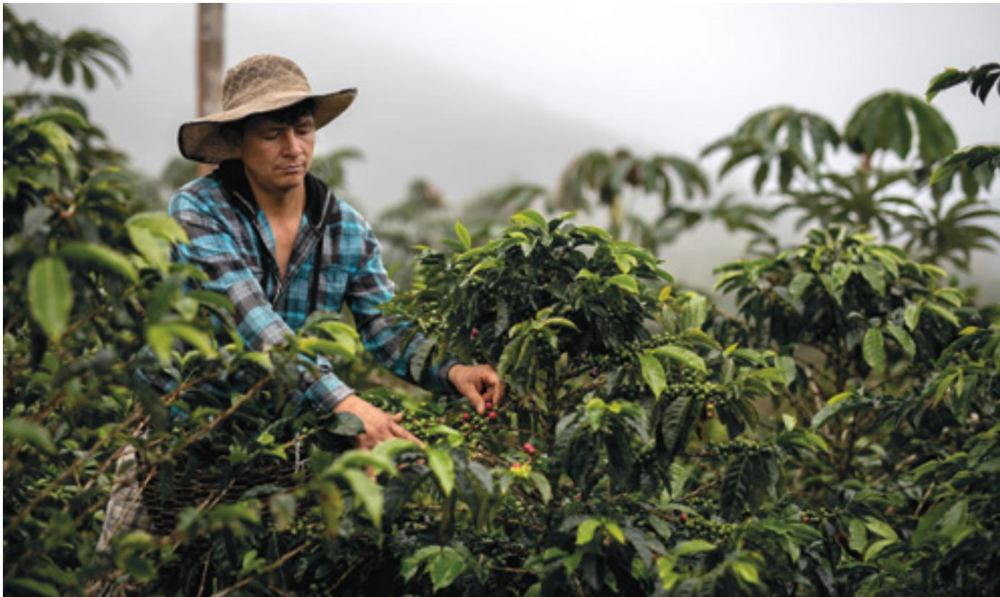  
Smallholder farmer harvesting coffee cherries, Peru

# Safe and decent work

We have adopted a multi-level approach when it comes to safeguarding human rights across our supply chains. We target our efforts at the individual, community and national levels, as we believe this is the most effective way to improve conditions for the farmers and their families who, for the most part, live and work in remote rural areas where there are limited infrastructure and educational facilities. We work with partners who are experts in their fields, such as the International Labour Organization (ILO), the Child Labour Platform, and the Child Learning and Educational Facility (CLEF).

We are working to make sustainability risk information more accessible to the agri-industry and related stakeholders.

Identifying the risk of child labour is a core part of our human rights due diligence approach. Child labour is a risk we assess regularly. Where a particular hotspot has been identified, the next step is to gain a deeper understanding of the risks involved and then develop an intervention that is tailored and effective. We achieve this by using Child Labour Monitoring and Remediation Systems (CLMRS). CLMRS help us identify children at risk of, or in situations of, child labour, so that we can engage with families to support in areas such as improving and enabling school attendance. ofi continued to roll out CLMRS across the majority of its supply chains where there are high risks of child labour. CLMRS now cover more than 270,000 farmer households in 13 countries, including the nine countries where we directly source cocoa, as well as two coffee origins, Guatemala and Côte d'lvoire, and two nut regions, Nigeria for cashew, and Turkey for hazelnuts.

We adopt a bottom-up and a top-down approach to identify those currently in a situation of child labour as well as those who are at risk.

- Bottom-up. Field officers collect data on communities and individual farming households to identify children at risk and tailor interventions.  
- Top-down. We run deep-dive risk assessments on those supply chains that have been flagged as high risk.

This two-pronged approach provides context and insights into the causes of human rights violations, which helps develop interventions to address child protection and labour rights issues. Preventative actions are also identified. All interventions are based on best practices collaborating with communities, local authorities, and other stakeholders where appropriate.

All of suppliers are required to engage with and sign ofi's Agri Supplier Code (ASC) every year to promote their compliance with our responsible sourcing requirements. To go a step further in ensuring the Code supports positive behaviour, especially for suppliers who are not in programmes and sustainability schemes, we established an ASC verification process and will progressively roll it out across supply chains. Through a sampling methodology that prioritises suppliers with large volumes and low certification levels, ASC verification helps origin teams identify key areas of support required by suppliers. Based on these insights, teams will be better positioned to develop action plans to support suppliers in meeting ASC standards.

Following the findings of a study on the cotton supply chain in Côte d'lvoire, Olam Agri integrated Gender and Decent Work Monitoring Committees (CGSTD) into cotton certification frameworks (BCI, CMEA, regenagri®) across our cotton business's Regional Directorates and Producer Units in Côte d'lvoire. This initiative, supported by members of the public and private sectors, aims to enhance gender equity and women's participation in cotton production, and ensure fair, safe working conditions by addressing child labour, forced labour, harassment, violence and discrimination.

Aligned with recommendations from a Child Labour Risk Assessment, the committees will:

- strengthen safety nets (e.g. insurance, emergency funds);  
- establish protocols for reporting and remediation;  
- promote responsible recruitment practices (including for seasonal farmers); and  
- prioritise investments in productivity, mechanisation, and education to reduce labour risks.

Delivering safe and decent work includes ensuring that all our supply chains are covered by a grievance mechanism so that anyone, anywhere in the supply chain can raise concerns about human rights. In 2024, ofi launched the Speak Out! system, which is designed to enable supply chain stakeholders to register concerns directly via the website or through localised phone numbers. The system allows stakeholders to report anonymously and raise complaints on behalf of others.

Olam Agri also strengthened its grievance mechanisms by improving accessibility and streamlining the resolution process. The updated Grievance Management Policy makes individual businesses responsible for resolving grievances against them, their employees, and their suppliers, with clearly defined escalation rules. Businesses are tasked with the responsibility of ensuring that grievance channels are accessible to their stakeholders, that there is a defined grievance resolution process, and that all grievances are registered.

# Coffee Kindergartens initiative

On International Coffee Day, ofi's Coffee Kindergartens initiative won the Best Sustainability Initiative category at the World Coffee Innovation Awards.

Supported by our specialty coffee business, Covoya, local coffee teams set up Coffee Kindergartens in areas identified as high risk through community surveys, which are part of the CLMRS. They offer a safe space for children to play and learn during the school holidays while their parents harvest coffee on the farms.

The success of the first Coffee Kindergarten in Guatemala, run in partnership with NGO Funcafé in 2020, attracted support from donors and customers and allowed us to expand the initiative and run 22 Kindergartens in 2024 in Guatemala and two in Honduras and Nicaragua with a local NGO, Educo.

# Raising awareness of human rights in Chad

Following a 2020 risk assessment that indicated high rates of child labour in Chad, Olam Agri's local cotton team conducted a field study with expert partners to determine the risks and causes in cotton-growing regions of Chad, and to develop actions to minimise and eliminate it. Based on the study results, they focused on raising awareness of human rights, specifically children's rights, and developed eight chapters of comics to educate approximately 1,500 children from farming households in five cotton-growing areas. These comics, designed for children aged 10 to 17, will be distributed across the different regions during awareness-raising sessions with producers (through farmer field schools, women's groups and VSLAs).

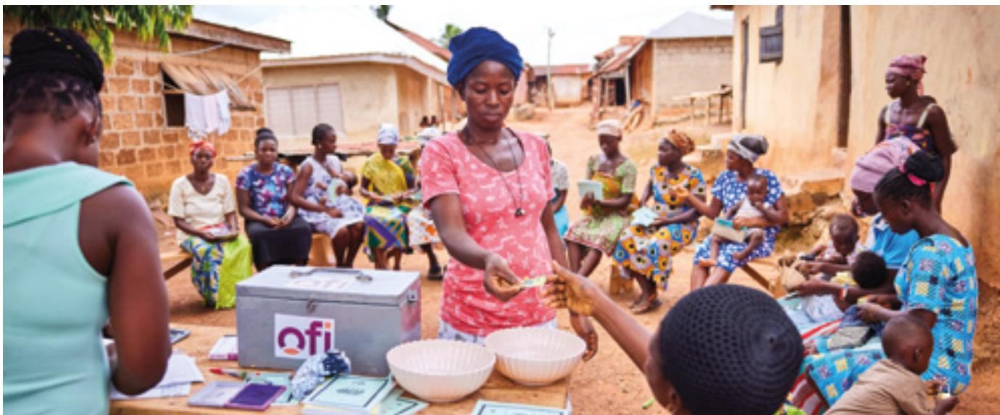  
Women farmers meet as part of a Village Savings and Loans Association, Ghana

# Diversity and inclusion

With our broad operational and geographic footprint, along with our large and extensive supply chains, we can help bring about positive change for a wide range of issues. One of these is discrimination, particularly against high-risk groups such as women, youths, indigenous populations and those with disabilities and underlying health conditions.

Globally,  $38\%$  of all women are employed in agrifood systems1 and empowering them is essential for building a more equitable and sustainable future for agriculture. There is the danger, however, of falling into a 'gender-blind' trap: the assumption that equal treatment will automatically lead to fairness. In reality, deep-rooted cultural barriers and biases can prevent women from fully participating and benefitting. While well-intentioned, the gender-blind approach fails to address the unique challenges women face, such as cultural barriers or limited access to resources.

By embracing gender-sensitive and transformative approaches, we are cultivating a future where every farmer, regardless of gender, can thrive and contribute to a sustainable world. From providing training to improving literacy and health awareness, we have developed a suite of programmes to help close the gap, and at the same time build women's confidence. We are working to generate wider awareness of the issues women face and the value of equity across all sections of the population. By breaking down barriers, we can help bring about changes in behaviours and attitudes.

In addition to our own programmes, ofi and Olam Agri participate in industry platforms, such as the World Business Council for Sustainable Development (WBCSD) and Business Commission to Tackle Inequality (BCTI). We have been a signatory to the UN Women's Empowerment Principles for many years, through which we have been promoting gender equality in our supply chain, helping women take control of their finances and gain access to credit and bank accounts.

1. The status of women in agrifood systems: https://openknowledge.fao.org/ items/adc0741f-9de2-4d09-ae68-b19cc871601a

In Chad, building on existing gender awareness campaigns, Olam Agri's cotton field agents made the case for women's participation in cotton farming directly to village chiefs and landowners in 2023. This resulted in 75 women's groups (925 members) gaining access to 254.5 ha of land for cotton cultivation. In 2024, this initiative was expanded, with 75 new groups (with over 700 members) farming 360 ha. As a further example of how momentum breeds further progress, a group of 50 women near Moundou have obtained cooperative certification, opened a bank account and now manage 14 ha of land. From this land they produce a variety of crops and have established a solar-powered vegetable garden with our support.

In 2024, ofi's activities supported over 87,000 women to improve their livelihoods through GAP training, inputs, credit, technical skills and income diversification resources. We have set a dedicated target to scale our efforts and reach 250,000 women with enhanced livelihood support by 2030 under ofi's Choices for Change strategy.

# Empowering women entrepreneurs in Senegal

Olam Agri's MAMIE (Making African Mothers Independent & Entrepreneurs) initiative empowers women entrepreneurs in Senegal, particularly beignet bakers, through training in literacy, numeracy, pastry-making, and business skills. Participants receive start-up kits to grow their ventures, aiming to uplift 5,000 women by 2030.

In 2024, the programme expanded with a two-month course for 50 women in Dakar and Touba, covering cooking, literacy, health, entrepreneurship, accounting, IT, and environmental safety, to strengthen their professional and personal development.

Read more in the Olam Agri business section on page 52.

# Did you know?

As part of Olam Agri's climate-resilient and regenerative cotton production project in Chad, in partnership with IDH, more than 17,000 people were educated on both gender and child labour issues in 2024.

The Café Delas programme in Brazil was created by ofi to promote gender equality by ensuring women farmers producing specialty coffee are paid directly for their produce. In 2024, over 40 women farmers across the state of Minas Gerais received training on the effects of climate change on coffee production, and agronomy practices and methodologies to help mitigate them. The training also covered management techniques and technology to improve farm efficiency as well as individual wellbeing. We reinvest a percentage of every sale of Café Delas specialty coffee into initiatives to support the farmers, empowering them to succeed.

In Nigeria, the Crown Flour Angels (CFA) programme, an initiative launched by Olam Agri's wheat-milling business, aims to empower women by providing access to comprehensive baking training. Launched in 2021, the programme focuses on practical skills that foster entrepreneurship, financial independence, and food security. In 2024, 140 women received training, bringing the total number of women trained since the programme's inception to 700.

To deliver change at scale, ofi has created centrally coordinated frameworks that can be tailored and implemented locally. A global toolkit has been developed to guide efforts to improve women's inclusion in agricultural supply chains where they play a significant role as landowners, family workers, hired workers, extension agents and traders. The Women's Inclusion Toolkit helps field teams identify opportunities across four key pillars of action: training advisory and手持holding; access to infrastructure, services and inputs; access to finance and markets; and community development initiatives. Teams using the toolkit take a quick assessment to place themselves on a progressive roadmap to improve women's inclusion in their supply chains, and select from a comprehensive compendium of activities and case studies to implement in their regions.

Another key area of focus has been supporting incomes and job opportunities for youths. Olam Agri's rubber business in Côte d'lvoire launched a partnership with Save the Children, which seeks to address youth unemployment and economic vulnerability for families in Côte d'lvoire's La Mé and Indénie-Djuablin regions. By promoting youth wellbeing, strengthening parental resilience, and advancing community development through entrepreneurial initiatives, the project empowers out-of-school youths and their families socio-economically. As well as directly benefitting 1,200 young people and 1,200 VSLA parent members, it will reach approximately 15,000 individuals indirectly in the La Mé region. In the Aniassué region of Abengourou Department, the project already supports six existing VSLAs (120 members across three communities) with a further six new groups – one per community annually – to be established to engage 240 additional members, thereby scaling economic opportunities and resilience. We are targeting a further 300 community members to be empowered through income-generating activities and women leadership through a similar project with GIZ.

# Working with Save the Children

Our project with Olam Agri's rubber business in Côte d'lvoire will enable young girls and boys, between 14 and 24 years old, to acquire skills and opportunities to build a better future, while improving the financial situation of vulnerable families. We are delighted to be working with Olam Agri on this vital initiative.

Cissé Sononsa,

Operation and Programme Manager,

Save the Children

# Nutrition and health

We are committed to supporting global food security through a multi-faceted approach. We help countries grow more food, we contribute to national food security through local production, and we provide fortified foods that address micronutrient deficiencies, such as Olam Agri's local rice and animal feed businesses which significantly bolster domestic food production in Nigeria.

Fortified foods are a core part of Olam Agri's business, improving nutrition security across various products and countries. On a more local level, we work directly with farmers and communities to improve access to nutritious food. In Côte d'lvoire, for instance, our cotton team provides food crop support to all 20,000 farmers in our supply chain.

These broader initiatives are complemented by targeted programmes. We recognise that many farmers who supply us with crops struggle to provide enough food for themselves and their families. Olam Agri conducted food security baseline assessments across all direct supply chains in Africa, focusing on products such as rice, wheat, sesame, cotton and rubber. The surveys captured data on household dietary diversity, food availability, affordability, seasonality and, critically, water access. This data allows the unique challenges faced by different supply chains and geographies to be better understood.

We continue to address this health and nutrition gap through our sustainability teams and partners, including Funcafé, TechnoServe, Côte d'lvoire's National Nutrition Programme, Global Alliance for Improved Nutrition (GAIN), CARE, and the Tulsi Chanrai Foundation, which delivers solutions to improve access to clean water, healthcare services and supplies and nutritious food. 2024 saw further progress with both new and existing programmes that are designed to address the most pressing food security needs identified by our assessments.

In Togo, Olam Agri conducted a nutrition training workshop for over 240 field technicians and cotton producers, a key milestone in our Food Secure Project. This training was conducted in conjunction with the University of Kara's Nutrition Department. Prior to the training, a survey was carried out in the Savannes pilot region, followed by focus group discussions in all operational regions. This allowed us to assess producers' dietary habits, analyse the nutritional quality of local foods and develop tailored recommendations.

ofi has made nutrition and health a central part of its efforts to create thriving communities under its Choices for Change strategy, and is committed to reaching 750,000 households in the communities where we operate to improve their nutrition and health by 2030. To achieve this, ofi is currently developing a toolkit for our field teams to guide their engagement with farmer households and communities on health and nutrition. The approach ranges from adding a health and nutrition module into existing training programmes, to embedding the topic as a key impact area in multi-stakeholder landscape projects. The toolkit will help teams analyse and validate nutrition and health risks, prioritise actions and implement impactful programmes.

# Improving water security in Nigeria

Olam Agri is working to improve water access through targeted interventions, including the repair, rehabilitation, and construction of water wells. In Nigeria, our Safe Water project reaches communities that are home to almost 34,000 people across our rice, sesame, wheat, and integrated fruit supply chains in Jigawa, Kano, Nasarawa, Benue and Kaduna states. To date, 18 water facilities, including hand pumps and solar-powered boreholes, have been rehabilitated or constructed. GoFlow water purifiers have also been installed in 12 Nigerian communities, benefiting communities that are home to approximately 43,000 people. In 2024, we also built 13 water pumps in Chad, in collaboration with CMIA and IDH.

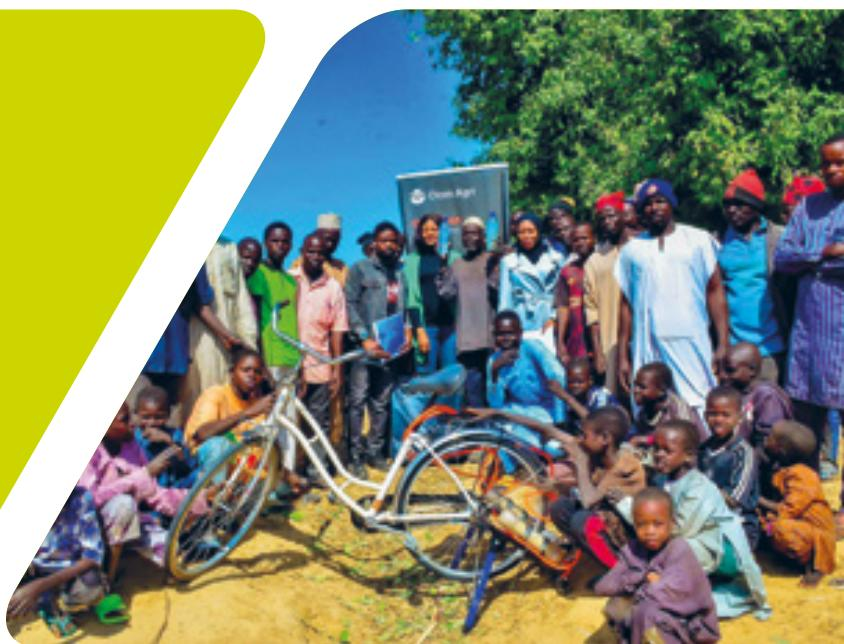

1. CARE works with some of the most at-risk communities around the world to address poverty. For more information, visit care.org

ofi is using the Infant Malnutrition System Alert (IMSA) smartphone-based application to geolocate cases of malnutrition in Côte d'lvoire, where one in five children experience stunted growth and development. This digital solution, shortlisted in 2024 for the edie Social Sustainability Project of the Year award, replaces existing paper-based screening questionnaires, thereby enabling real-time alerts and earlier detection and treatment.

We know, from experience working in these communities and from public studies, that infant malnutrition can be largely attributed to a lack of education and low literacy rates, particularly among mothers, so we are also aiming to educate 5,000 people (1,000 people per district) through healthy eating campaigns by 2028. In 2024, ofi's Côte d'lvoire teams and volunteers helped to screen over 22,000 children in cashew communities in the Béoumi district using the IMSA app, as well as manual screening, with 370 moderate and acute cases of malnutrition identified and referred to healthcare facilities. This was achieved in partnership with Côte d'lvoire's National Nutrition Programme (PNN).

In Togo, Olam Agri's cotton business's Health Caravan initiative provides free medical consultations and treatment to vulnerable populations in remote villages. Medical teams offer a wide range of services and health education to promote long-term wellbeing. Over the past two years, these caravans have reached more than 2,000 people in numerous villages across Togo, including Tapkamba, Hélota, Wéli, Adogbénou, Amakpame, Yebour, Katchamba and Atakpara. The positive impact of these initiatives has inspired us to expand our efforts and continue bringing healthcare to the heart of more rural communities.

To enhance sanitation and health in local communities and schools, ofi's spices operations in India have constructed toilets, benefitting 220 farmers and farm workers, as well as 221 school children. Additionally, they provided menstrual health and hygiene training to 525 schoolgirls and distributed reusable sanitary pads to them. To address health issues, four medical camps were organised, reaching 485 farmers and farm workers for early detection and treatment of diseases.

In Zambia, 350 members of the community surrounding our estates are benefitting from training on good nutrition and breastfeeding with support from ofi's coffee team. In addition to this, in four schools in the community, a programme around menstrual health and hygiene was implemented, reaching 1,118 female students. This included distribution of reusable sanitary pads, along with training. The goal was not only to support menstrual health and hygiene, but also to reduce any absenteeism related to menstruation.

# Did you know?

Rice is a staple food for more than half the world's population. By fortifying staple foods, we are combatting what nutrition experts call 'hidden hunger'. Even if people get the calories they need, they are often lacking critical micronutrients. This can lead to persistent public health problems. By 2030, we aim to deliver 1 trillion servings of fortified food – from rice, wheat flour and edible oil – to provide essential micronutrients to over 250 million people each day. So far, we have delivered almost 400 billion fortified food servings across our rice, flour and oil businesses.

# Healthy Living programme

ofi's Healthy Living programme funds initiatives to improve the health and wellbeing of employees, farmers and communities in supply chains and workplaces around the world. For 2024-2027, our focus is WASH: safe water, sanitation and hygiene to live, grow and thrive.

In the cocoa supply chain in Nigeria, the ofi Healthy Living programme focused on enhancing both nutrition and menstrual health and hygiene. We provided training on improving nutrition and distribution of seeds through VSLAs to 172 farmer families. Additionally, we combined training on menstrual hygiene with distribution of reusable sanitary pads among female farmers and their daughters, reaching over 800 women. Men and boys were also encouraged to participate in the training, helping them gain a better understanding of menstrual health and hygiene, and fostering a supportive environment for women.

# Economic opportunity

Smallholders in sustainability programmes (total farmers)

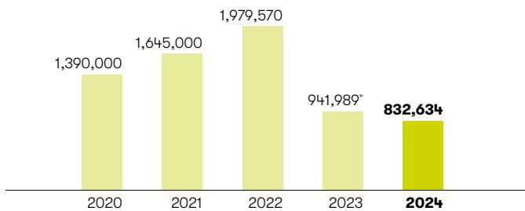

# Diversity and inclusion

Women economically empowered within our supply chain (% female farmers)

# Nutrition and health

Farmers and community members reached with nutrition/food security support

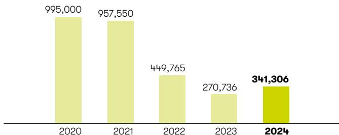

# Nutrition and health

Increasing availability of micronutrient-fortified foods (servings in billions)

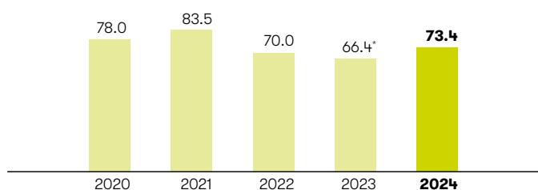

# People and culture

As a Group, we employ almost 92,000 people. Of these,  $57\%$  are employed through staffing contractors or do seasonal or temporary roles. Such a large workforce brings with it a responsibility to ensure the wellbeing, safety and health of all our people. We are committed to fostering a safe and inclusive workplace that respects and values everyone, and provides the tools and training to continue to deliver and thrive.

# Culture and work environment

As well as building on the entrepreneurial spirit, integrity, sense of mutual respect and commitment to sustainability that have driven Olam Group's success over the decades, ofi and Olam Agri have defined their own set of values:

# Olam Agri's values

We are Collaborative;  
We are Agile;  
We are Resourceful;  
We are Entrepreneurial; and  
We are Sustainable.

At Olam Agri, our Purpose is to transform the food and agriculture sector for a more sustainable future. We view our values and our culture as the enablers in delivering our Purpose.

Our values are intrinsic to what we are and how we operate as an organisation. We have continued to embed our Purpose and values with the rollout of a series of workshops across our operations in Africa, with more planned in other regions. In tandem with these workshops, the year saw the relaunch of our signature leadership programme, Building Winning Business Models, specifically focused on Olam Agri.

The programme, which is instrumental in aligning our leaders and institutionalising our business model, fosters a deeper understanding of our strategic direction and creates opportunities for leaders from different parts of Olam to connect, collaborate and build enduring partnerships.

# ofi's values

We are Driven;  
We are Curious;  
We are Open; and  
We Care.

ofi has continued to evolve and grow to prepare for the future by embedding our values across all facets of our business. Our Purpose is to be the change for good food and a healthy future, it guides our strategy, informs our decision-making and sits at the core of the brand. We have been on a journey to develop and embed our Purpose since we were created in 2021, and 2024 has seen us focus on execution and impact creation. Every product and function has made a series of action commitments for how they can bring our Purpose to life.

To bring our Purpose and values to life requires us to put that in the context of our journey of 'building and being ofi'. To accelerate our journey, we have introduced a CEO-led programme in 2024 targeting our Top 300 leaders, whereby our CEO, A Shekhar, directly engages with diverse cohorts of employees on ofi's story. The programme focuses on our value drivers and enablers, creating a common understanding, shared experience and a platform for our leaders to collectively shape the way forward together.

# Inclusion, diversity and equity (IDE)

We believe in enhancing our innovation, creativity and business performance by building a more inclusive and stronger culture. Everyone should feel welcome, appreciated and respected.

ofi has focused on strengthening workplace inclusion, improving psychological safety for all employees and delivering against our IDE goals, with a particular focus on increased female representation through inclusive hiring practices, sourcing strategies and development of internal talent. Equal opportunities for women continues to be a key area of focus, specifically fostering an environment where women have fair representation and support for equitable growth. During the year, Olam Agri completed the training of a DEI hiring panel to remove any unconscious bias from the selection process and so bolster inclusivity. ofi also continues to make progress on ambitions to increase overall female representation in senior roles, with a focus on ensuring balanced candidate slates for hiring diverse talent. Through our Outstanding Women's Network (OWN), we bring senior female talent together to enable peer-to-peer coaching, sharing of learnings, mentoring opportunities and increase visibility to enhance growth and increase impact.

Olam Agri launched the empOWer 30 programme in connection with International Women's Day, focused on five areas: ERG expansion, career advancement opportunities, community expansion, equitable journey and access (e.g. measuring recruitment, promotion, opportunities for growth and employee perception), and support from Corporate Executive. The aim is to develop a strong pipeline of female talent and increase the percentage of women in middle and top management positions to  $30\%$  by 2030. The first session commenced in April with 30 women leaders and, through a partnership with WeQual, enabled participants to interact with some of the 350 global leaders who attend the monthly interactive sessions.

Our 'Voice of Change' platform allows employees to provide feedback, share experiences and suggest improvements related to diversity and inclusion. This digital platform uses AI-driven analytics to identify trends and areas for improvement.

ofi undertook a Fair Employment baseline assessment across the majority of our countries, driving improvements across the fair employment standards, strengthening our policies and ensuring a consistent approach while keeping with local laws and regulations. Creating a culture of inclusion begins with our leaders, and we introduced a new two-part leadership series – focused on promoting an inclusive workplace and psychological safety – for our Top 150 leaders. These focused on practical and meaningful ways we can foster inclusion within and across our teams and create psychological safety that encourages all employees to use their voice, share their perspective and bring their authentic self to work for even greater business impact.

# Progressing our Employee Resource Groups (ERGs)

ofi and Olam Agri continued to focus on leveraging our ERGs across 2024. These voluntary, employee-led groups aim to foster a diverse, inclusive workplace aligned with the organisation's respective mission, values, goals and business practices.

offi's G.R.O.W. (Globally Reaching offi Women) accelerates the growth of our female talent pipeline, while we are also introducing new ERGs such as NEURO (Neurodiverse Experience Understanding & Respect at offi) in North America, which focuses on neurodiversity and mental health.

Similarly, Olam Agri has 14 ERGs that cater to different communities and groups of employees. The ERG for women is the largest, spanning 14 countries and providing women with a platform to reach out and support each other.

# Employee engagement

We provide employees with a range of opportunities to let us know how we are doing, what we are doing well, which areas need more work and what else we need to do.

Olam Agri's annual employee engagement survey showed that  $80\%$  of employees enjoy working at Olam Agri and  $87\%$  of employees feel positive about their wellbeing, a  $2\%$  increase on the previous year. While encouraging, we understand there is more work for us to do.

Olam Agri refreshed our internal communications with the launch of a new digital channel called 'The Loop', with almost 5,000 employees enrolled, and launched a new employee value proposition – Freedom to Transform. The aim of the latter is to bolster talent retention and acquisition by communicating what Olam Agri has to offer as an employer to jobseekers and employees alike, with a new LinkedIn Life page, an internal and external communications campaign, a refreshed talent hub, goal-setting guidance and an onboarding video to support this.

Olam Agri was recognised as a Top Employer in ten countries, including Cameroon, Côte d'lvoire, Ghana, Mozambique, Nigeria, Senegal, South Africa, Australia, the Netherlands, and Switzerland. The recognition from the Top Employers Institute, the global authority on recognising excellence in people practices, highlights Olam Agri's status as a global employer of choice, committed to empowering its employees to thrive both professionally and personally within a purpose-driven organisation that champions diversity, inclusion, and collaboration.

As part of the journey, of 'building and being ofi', there is continued focus on strengthening ofi as a great place to work. We launched a new employee listening strategy 'Voice', which involves a new multi-faceted approach to understanding our people through a steady drum beat of listening and acting on employee feedback. Voice is designed to gain insights into what matters most to our employees and to support people managers and leadership teams to act on employee feedback in a focused, timely and visible way. We believe that we can positively build the ofi experience for all employees, evolve our culture and ensure everyone feels heard, included, and enabled to perform at their best.

# Learning and development

We foster a culture of learning across all levels of the business, integrating new colleagues, educating and training our employees and further embedding our culture and values within the organisation. This is integral to ensure equal opportunities for all.

To reach as wide an audience as possible across our global operations, we utilise digital platforms and their potential to democratise access to learning. Olam Agri and ofi have invested in access to LinkedIn Learning which offers over 21,000 courses in various languages taught by industry experts on a broad range of topics from sustainability, business, technology, software and interpersonal skills. It is continuously updated to reflect latest trends, insights and research and is a powerful tool for both managers and employees to take ownership of their individual career development. Olam Agri has curated courses for business and functional challenges, which has helped to bring the utilisation rate to  $98\%$ .

Not only does digital learning increase our reach but it also enables us to make full use of the resources available through partnerships with educational establishments, such as universities. Olam Agri has partnered with 23 universities for our middle management certificate programmes, while our advanced leadership management courses include sessions from top universities such as Harvard, MIT, NUS, INSEAD, Cambridge and UC Berkeley.

Our online sustainability training platform delivers predominantly externally sourced modules, both at an introductory level and on more specific subjects that fall within the three pillars of climate, nature and livelihoods. Training programmes include areas such as Scope 1, 2 and 3 emissions, carbon trading, human rights, processing, manufacturing, sustainability finance, safety and trading.

We value curiosity because it drives us to be lifelong learners, and we know that creating a learning culture is key to supporting our individual and collective growth. Olam Agri delivered 99,584 hours of training, an increase of  $24\%$  on 2023, with each user spending an average of 29 hours learning. These figures do not take into account all of the informal training opportunities delivered.

ofi's approach to learning and development is tailored to our people's needs according to their role and the stage in their career. In 2024, we delivered 123,311 hours of training with 11,817 unique learners – an average of 10.4 hours of training per active learner. Nearly  $37.5\%$  of participants were women. This was further supplemented with locally relevant training delivered by our country and regional teams.

# Talent management

Our talent management strategy continually evolves and covers the full cycle of an employee's time with us.

For those just starting out, we have programmes focused on identifying and nurturing talent at grassroots level. These centrally run programmes are rolled out locally across the various regions where we have a presence.

Olam Agri's Graduate Trainee Scheme is a 12-month training programme designed to bridge the gap between academic knowledge and practical workplace skills. In 2024, we welcomed Graduate Trainees who took part in immersive experiential learning opportunities across the various value chains of the business.

Olam Agri's programmes are also focused on creating and growing our talent pipeline, specifically in critical competencies that help us to scale rapidly. As part of this, we launched our Building Trading Capability course, a proprietary programme covering prop trading, cash trading and associated risk management.

For those employees at career inflection points, we offer individuals support to navigate change. The support we provide is designed to assist newly promoted employees through accelerated learning and group coaching.

For those in more senior positions, our partnerships with various business schools provide executive education to our leaders. Since the programme's inception in 2022, we now offer over 60 courses for enrolment. Courses are both classroom and individual project-based. At the end of the course, many of the participants present their projects and return on investment to the senior executive team.

ofi is building a talent management framework that creates a global common language and enables cross-product, geography and function movement to drive performance. This framework not only helps source and attract top talent that aligns with our strategic goals but plays a role in workforce planning, employee retention and employer brand. Meanwhile, our Talent Council focuses on having the right talent to create the greatest impact in every business and geography, with a priority focus on strategic pipelining for critical talent segments and high-impact roles.

In 2024, we focused on identifying the most beneficial internal talent moves, developing critical talent segments and creating robust development plans for leadership successors. We also streamlined our hiring framework, empowering people managers to partner with Talent Acquisition and HR business partners to reduce time and cost to hire, and deliver a consistent global experience.

With the launch of offi's new Food & Beverage (F&B) Solutions platform, the streamlined talent management framework enabled over 25 seamless career opportunities for internal talent to move into high impact positions. To ensure speedy and effective onboarding and integration, these new employees were immersed in 'Who We Are' training, with a focus on how we enable our customers to win, build deep category knowledge and set KPIs with collective accountabilities.

As of pivots from a global sourcing and ingredients company to being a leading integrated solutions and ingredient supplier in food and beverage, we continue to evolve our people processes in line with our business growth. A key initiative in 2024 was the introduction of a global grading infrastructure and the supporting work on job architecture, which together are critical in laying the foundation for internally consistent and externally relevant talent management programmes, and an important vehicle to facilitate internal career growth and progression and strategic talent moves.

  
Colleagues actively collaborate and support each other as part of our culture

# Leadership development

We offer our employees the input and support they need, when they need them, throughout their careers with us. We continually evolve our programmes and map progress to ensure our future leader pipeline is robust.

Olam Agri introduced senior management training through our partnership with an external coaching provider, which is based around 35 universal competencies that have then been mapped onto our own competencies framework. Each participant on the course selects five competencies, ensuring learning is tailored to what the individual needs and wants.

Our Raising Leaders Programme (RLP) plays a key role in building Olam Agri's internal leadership capabilities and managing and growing the talent pool. In 2024, we ran three cohorts involving 62 employees from Francophone Africa, Africa, Asia-Pacific, Europe and Middle East regions. The RLP covered subjects such as Purpose alignment, self-awareness of manager and leader qualities, time and work prioritisation, effective networking, valuing differences and communicating for impact and team membership.

During the course of 2024, targeted efforts were also invested to re-design the ofi Raising Leaders Programme, a flagship learning journey to develop local bench strength at the regional level, targeting emerging leaders. This year's programme involved 36 selected frontline leaders, from both the APAC and Africa regions.

For junior to mid-level employees, a comprehensive suite of self and team leadership-related virtual, instructor-led offerings, co-curated with industry learning partners, were made available via our Global Open Learning Calendar. Learning themes included Managers Essentials, Functional Capabilities, Communication and Collaboration, Foundational Digital Skills and Customer First. This learning series benefitted 353 employees, through self-service registration.

People managers are pivotal in bridging the gap between strategy and execution, ensuring that organisational goals are met, and performance is delivered through our people. With the continued evidence that people join companies and leave managers, people manager effectiveness has never been more important as we are 'building and being of'.

We have introduced a quarterly people manager town hall to more intentionally engage, inform and equip our people managers. In 2024, the focus was on how people managers are engaging their teams, setting expectations and the quality of their performance, coaching and development conversations.

# Training in action – building a learning culture and developing learning capabilities

A state-of-the-art Learning Lounge was launched at the Olam Agri Singapore headquarters and has facilitated approximately 1,000 hours of learning within the first six months.

1,000 hours (approximately) of learning in 2024

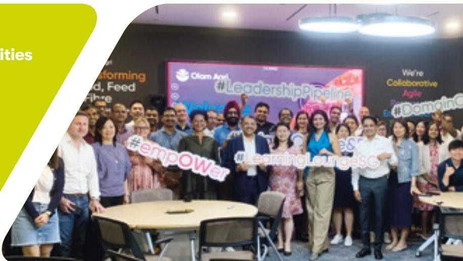

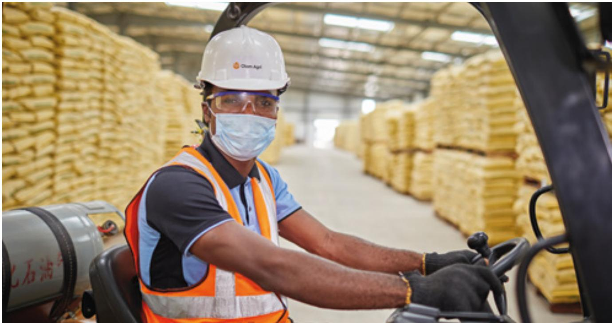  
Safety and health is of paramount importance across all of our activities and locations

# Safety and health

With operations in 60 countries in multiple products and across multiple parts of the value chain, our activities range from working with smallholder farming communities to operating large-scale mechanised farms and orchards, from trucking and transportation, and from processing and manufacturing to office work. Each requires processes and procedures to manage its respective risks and hazards.

Tier 1 facilities are large manufacturing plants  
- Tier 2 facilities are primary processing plants and upstream operations  
Tier 3 facilities are warehouses  
Tier 4 are offices.

The Group-wide safety programme has been tailored to reflect the safety priorities of each operating group. Protecting life by creating a zero-incident culture requires a commitment from each employee. We empower each employee and contractor to stop work whenever they recognise an unsafe condition or unsafe behaviour. This is communicated through our 'See it, Say it, Stop it' (Olam Agri) and 'Stop. Think. Protect' and 'Safety starts with me' (ofi) communications campaigns. Our objective is to create a working culture where everyone returns home safely.

Through communications campaigns and awareness sessions, we highlight the correlation between near misses and incidents to emphasise the importance of identifying and reporting hazards, and stopping and preventing unsafe acts. This includes identifying and managing key safety risks such as driving, working at height and working with energy.

Olam Agri and ofi have both implemented technologies and programmes to promote safe driving. Underpinned by regular governance calls to ensure that data is leveraged to drive behavioural change, technologies, including cameras, geographical positioning systems and braking sensors, are being introduced across our fleet of cars, scooters, trucks and tractors. Throughout 2024, ofi continued to roll out telematics and video telematics to company vehicles in the most critical locations to monitor and ultimately improve driver safety behaviours. These have been installed in over 208 vehicles in East Africa. We now plan to focus on introducing these technologies to our operations in West Africa.

# Ensuring safety for our drivers

Olam Agri launched the Fleet Safety League in Nigeria as part of our drive towards ensuring 'Safer Driver, Safer Trucks, Safer Roads and Safer Regions'. The League focuses on increasing ownership of safety while implementing operational processes during take-off and delivery of goods to customers. The aim is to eliminate overall safety incidents which will not only improve the safety and health of our people but also improve efficiency and reliability in our delivery process. The process is technologically driven through Al cameras and GPS-tracking systems. Quarterly reports are generated and reviewed, with the best performing regions rewarded. The fleet safety team in Nigeria was recognised for its improved safety performance at the AfriSafe awards this year.

Our Heart and Mind initiative focuses on family engagement, visiting drivers' homes to build relationships and provide road safety education. Drivers are selected based on an analysis of their driving data, including any violations or incidents. As part of this, the Child Education Support programme prioritises driver development by providing assistance and educational grants for the children of low-risk drivers pursuing higher education. The grants are designed to support children's education and at the same time encourage safe driving. Drivers identified as low-risk, using driver and vehicle technology, are eligible for education grants for their children. This approach is aimed at not only improving road safety but also contributing to the long-term wellbeing of the drivers and their families.

# Overall safety performance

The LTIFR was recorded as 0.11 at Olam Agri and 0.29 at ofi. Please see the 'Fatalities and LTIFR in 2024' and 'Fatalities and LTIFR in 2024 for Tier 1 Facilities' tables for further information.

Fatalities and LTIFR in 2024 - Olam Group  

<table><tr><td></td><td>Africa</td><td>Americas</td><td>Asia Pacific</td><td>Europe</td><td>Total</td></tr><tr><td>Fatalities</td><td>8</td><td>0</td><td>2</td><td>0</td><td>10</td></tr><tr><td>LTIFR</td><td>0.09</td><td>0.67</td><td>0.13</td><td>0.98</td><td>0.19</td></tr></table>

Fatalities and LTIFR in 2024 for Tier 1 Facilities – Olam Group  

<table><tr><td></td><td>Africa</td><td>Americas</td><td>Asia Pacific</td><td>Europe</td><td>Total</td></tr><tr><td>Fatalities</td><td>1</td><td>0</td><td>0</td><td>0</td><td>1</td></tr><tr><td>LTIFR</td><td>0.06</td><td>0.78</td><td>0.13</td><td>1.24</td><td>0.23</td></tr></table>

Despite our progress and our best efforts, we could not prevent the loss of 10 lives in 2024, which were primarily resulting from vehicle-related and fall from height incidents.

Olam Agri reported fatal incidents that resulted in the loss of seven lives: two permanent employees and five contract workers. Four of the incidents occurred on our premises, with three outside our premises. Vehicle and mobile equipment-related incidents remained the most significant causes, followed by a fall from height.

  
Colleagues are provided with the correct PPE in relation to their job, and are trained how to use it

ofi reported three fatal incidents: one on our premises, caused by a fall from height while performing work on a roof, and two on public roads where a vehicle was involved in the fatality of a member of the public.

OGH did not record any fatalities in 2024.

For each serious injury and fatality, a detailed investigation is conducted, and the findings and corrective actions were reviewed reviewed by the Board committee and the leadership team.

A Serious Injuries and Fatality (SIF) prevention programme expanded in 2024 across all locations. The programme aims to facilitate teams in identifying potential hazards and assess effectiveness of countermeasures taken to better prevent and eliminate SIF occurrences.

To facilitate training and culture building, Olam Agri and ofi used a digital platform from third-party providers to deliver training and promote and share safety learnings. Teams also continued to provide training, such as first aid and around particular medical needs, such as seizures and external haemorrhage.

# Global safety roadmap

Ensuring the safety and wellbeing of all our employees remains a priority for the Group, and all our respective operating groups have approached this by developing a strong safety culture.

ofi has developed a Global Safety Roadmap, 'An Even Safer ofi', which sets out priorities across six areas:

1. exposure reduction;  
2. knowledge building;  
3. operational excellence;  
4. code compliance;  
5. digitalisation; and  
6. building a winning safety team.

Throughout 2024, each region has progressed aligned tactical plans with support from the global safety team, the businesses and regional leadership.

The first Roadmap priority is to reduce exposures within our seven Life Saving Rules. Self-assessments and reviews continue to be rolled out across our facilities to mitigate against Serious Injury and Fatality (SIF), with outputs informing local action planning. These generate corrective and preventive actions which are monitored through a regular management review process. We undertook SIF visits to 27 facilities in 2024 and 259 self-assessments were completed.

Improved reporting of Process Safety Incidents and Events was also introduced in 2024 to better differentiate occurrences according to their seriousness.

We empower all employees and contractors to report unsafe conditions or behaviours and to stop any activities they think may result in injury. In 2024, 10,790 'stop work' actions were initiated by employees, up from 5,745 in 2023, suggesting ongoing efforts to educate and give recognition are having the desired impact.

Number of facilities across the Group (excluding Tier 4/offices)  

<table><tr><td rowspan="2"></td><td colspan="3">ofi</td><td colspan="3">Remaining Olam Group</td><td colspan="3">Olam Agri</td></tr><tr><td>Tier 1</td><td>Tier 2</td><td>Tier 3</td><td>Tier 1</td><td>Tier 2</td><td>Tier 3</td><td>Tier 1</td><td>Tier 2</td><td>Tier 3</td></tr><tr><td>Africa</td><td>5</td><td>27</td><td>68</td><td>13</td><td>7</td><td>16</td><td>23</td><td>23</td><td>67</td></tr><tr><td>Americas</td><td>12</td><td>40</td><td>59</td><td>0</td><td>0</td><td>0</td><td>1</td><td>2</td><td>3</td></tr><tr><td>Asia Pacific</td><td>13</td><td>54</td><td>53</td><td>0</td><td>2</td><td>0</td><td>2</td><td>11</td><td>1</td></tr><tr><td>Europe</td><td>9</td><td>2</td><td>0</td><td>0</td><td>10</td><td>0</td><td>0</td><td>2</td><td>0</td></tr><tr><td>Total</td><td>39</td><td>123</td><td>180</td><td>13</td><td>19</td><td>16</td><td>26</td><td>38</td><td>71</td></tr></table>

# Did you know?

500,000 safe hours were recorded at Olam Agri's soy crushing project site in Ilorin, Nigeria. That is the equivalent of over 20,833 days, or just over 57 years. This significant milestone reflects the team's commitment to safety and was marked by a visit from the Kwara State Commissioner for Business Innovation and Technology.

# e-learning safety training platform

ofi's globally accessible e-learning safety training platform, launched in 2023, continues to drive high levels of engagement among employees which, in turn, is driving action. Active users of the platform continue to increase, totalling 1,505 at the end of 2024 and amassing some 1,163 hours of learning collectively during the year.

Around 500 different e-learning safety training modules are available to employees. Mandated modules for safety teams cover a range of training topics – from safe work permits to fire safety, fall prevention and protection to confined space entry.

Quarterly Leadership Safety webinars took place in all regions throughout 2024, reflecting local prioritised needs. Among these, 24 were webinars on mental health (EMENA), hearing conservation (Americas) and traffic safety (Brazil and CAA).

# Employee and labour rights

Guided by the United Nations Declaration of Human Rights, the ILO Declaration on Fundamental Principles and Rights at Work, and related international covenants, our approach to employee and labour rights is centred around ensuring basic human values that are essential to our social and economic lives are upheld.

The Group's commitment to upholding human values extends beyond engaging and protecting our own workforce. We also engage with our suppliers so that human rights are protected and respected across our supply chain.

All our operational sites are required to meet and implement Level One of our Fair Employment Policy. Further steps and actions are then required when an individual site develops and grows. Our Internal Audit team assesses the implementation of our policies in our owned operations, using a risk-based approach.

During 2024, the Internal Audit team identified improvement areas relating to employees' overtime and minimum wages management, training and development, grievance redressal mechanism, casual labour management, gender disparity, compliance to WASH standards (Water supply, sanitation and hygiene) etc., in a few locations. The findings have been shared with the management and actions are being taken to address each of the identified areas of improvement.

Through our sustainable sourcing solution AtSource, ofi has access to a wide range of data on our workforce for customers. For example, for estates and orchards, indicators include the number of female employees and female managers, percentage of employees trained on labour rights and practices, percentage of households reporting sufficient food supply year-round, and number of employees occupying a position that can carry hazard risk.

# Labour and

# management relations

Our upstream farming and plantation operations are extensive. We take our responsibility to each and every employee seriously and we commit to an extensive range of labour practices across our supply chains.

During the reporting process for 2024, 406 grievances were filed, 388 cases were resolved and three cases were carried over from 2023. As a result of audits and inspections, we identified five human rights-related cases.

# Speaking out

We are committed to upholding high standards of behaviour and compliance across the organisation. We collectively agree we all have a commitment to 'do what is right' and speak out, where necessary.

A Code of Conduct has been developed for both ofi and Olam Agri employees, based on the values and everyday behaviours that have fostered Olam Group's culture over the years. Access to training on the Code of Conduct is available to all employees across ofi, Olam Agri and the Remaining Olam Group. Additionally, there is a grievance mechanism and whistleblowing platform that is anonymous and guarantees both the absence of retaliation and an independent investigation of issues raised.

# Living wage

Paying living wages is an important way that companies can contribute to economies that support decent livelihoods and inclusive growth. While this is a significant undertaking for any global company, a proper understanding of the actual costs and possible gaps is the first step in identifying the pathway towards living wages for all. Following Olam Group's living wage gap baselining activity, in partnership with Social Accountability International and the Anker Research Institute, we continue to progress our internal roadmap to help close these gaps.

# Health and wellbeing

According to The World Bank's Investment Framework for Nutrition 2024, the scaling-up of nutrition interventions is estimated to generate US$2.4 trillion in economic benefits. For every dollar invested in addressing undernutrition, a return of US$23 is expected.

At the Nutrition for Growth (N4G) Summit in 2022, ofi and Olam Agri made a public commitment that  $100\%$  of the combined primary workforce will have access to nutrition support by 2030.

Many members of our workforce live and work in countries with high malnutrition rates. To tackle this issue and improve nutrition, ofi and Olam Agri have partnered with the Workforce Nutrition Alliance (WNA). Through this partnership, both operating groups have aligned their respective approaches to tackling malnutrition to the four pillars of a healthy workforce nutrition programme:

- Healthy food at work;  
Nutrition education;  
Nutrition-focused health checks; and  
- Breastfeeding support.

ofi and Olam Agri have undertaken baseline assessments to define areas for improvement and create bespoke action plans for each worksite, which are revisited annually to track progress, celebrate successes and adjust the approach. To increase engagement, interactive activities including cooking classes, nutrition challenge, healthy snack options and personalised nutrition plans have been introduced. ofi has partnered with the Global Alliance for Improved Nutrition (GAIN) and the Institute for Development Studies (IDS) to assess the financial case for workers' nutrition across low- and middle-income countries in Asia, Africa and Latin America.

Currently,  $70\%$  of ofi primary employees have access to nutrition support, compared to  $25\%$  at baseline in 2022. As a result, the Global Nutrition Report (GNR) Nutrition Accountability Framework concluded that ofi is on track to reach its commitment. In addition, Olam Agri is on track to reach its fortification goal.

ofi is rolling out the Workforce Nutrition Scorecard, which was developed by the Workforce Nutrition Alliance, across all worksites. This approach is allowing a better understanding of where we currently stand compared to our targets. In addition, it serves as a conversation starter at the worksite level to identify opportunities to progress our offering further.

Olam Agri has digitised the scorecard self-assessment process, developing a new platform, based on the Workforce Nutrition Alliance's methodology. This has made monitoring and supporting the progress of our workforce nutrition (WFN) goals more agile and robust. The platform enables the worksites to access their scorecard nutrition programme and gather insights on their historical performance. We have supported colleagues from India, Senegal, Côte d'lvoire and Nigeria to participate in Workforce Nutrition Alliance's masterclass, which empowers nutrition programme managers to develop and deploy a successful nutrition and health programme at their respective worksites.  $84\%$  of our worksites' have a status of Bronze and above, which indicates an active 'access to nutrition'2 programme at the workplace.

Olam Agri also participated in the N4G Summit roundtable conference on 'Business Contribution to Nutrition', where we highlighted the potential for the private sector to support nutrition via the biofortification of foods, reducing postharvest loss and providing nutrition in the workplace.

Currently, all our worksites in Ghana and Cameroon have achieved the GOLD category in the WFN scorecard and we launched an annual WFN competition to reward the best-performing worksites.

# Did you know?

Olam Agri featured in WNA's 'Humans Behind Workforce Nutrition: A Case Study Booklet'. This report showcases successful workforce nutrition programmes from companies that participated in the 2023 workforce nutrition masterclass.

# Workforce Nutrition Alliance (WNA) masterclass

Since 2020, ofi has been collaborating with the WNA and using its self-assessment scorecard and guidebooks to advance nutrition support for its employees. As part of this collaboration, 2024 saw five members of the Zambia coffee and Vietnam nuts and spices teams participate in the WNA's workforce nutrition masterclass. In addition, we were invited as a Lighthouse Leader to present at the Workforce Nutrition Alliance's webinar, 'Nurturing Success From Day One: The Business Benefits of Investing in Family-First Programmes at Work', to showcase how our breastfeeding support initiatives are embedded in our sustainability strategy.

Following successful collaboration in Vietnam, Alive and Thrive and ofi have partnered to launch the Happy Workforce Programme in Egypt. The programme addresses four components:

- breastfeeding support as part of a family-friendly workplace;  
nutrition and health promotion;  
water, sanitation, and hygiene (WASH); and  
mental health.

CID Consulting will take the lead in implementing this programme at our operations. This marks the programme's first launch in the Middle East and North Africa Region, and aims to improve the nutrition and wellbeing of employees and workers in global supply chains.

1. Sites with 20 or more primary workforce  
2. An ‘access to nutrition’ programme is defined as the state where there are active initiatives under two or more pillars of WFN. The pillars of WFN are Healthy Food at Work, Nutrition Education, Nutrition-focused health checkups and Breastfeeding Support

# Response to the Task Force on Climate-related Financial Disclosures (TCFD)

As a leading agri-business committed to ensuring transparency and action around climate-related risks and opportunities, Olam Group (Olam) supports the recommendations of the Financial Stability Board's Task Force on Climate-related Financial Disclosures (TCFD). The identification, assessment and management of climate-related risks and opportunities are periodically reviewed and improved upon. In preparation for reporting climate-related disclosures in line with the IFRS Sustainability Disclosure Standards by the financial period starting on or after January 1 $^{\text{st}}$  2025, as mandated by the Singapore Exchange Regulation (SGX RegCo), Olam has also begun assessing and addressing any gaps between its current reporting and the requirements of the IFRS Standards.

In line with the TCFD recommendations, Olam's approach and progress towards managing climate-related risks and opportunities are laid out in the sections below.

# Governance

# The Board's oversight of and management's role in assessing and managing climate-related risks and opportunities

The Sustainability Committee (SC) is a Board committee that supports the Board in managing risks and opportunities related to environmental, social and governance (ESG) topics, including climate change, and monitoring the implementation of the Group's ESG strategy, initiatives, policies and investments. The SC's responsibilities include overseeing the integration of ESG perspectives into Olam's corporate strategy, reviewing global ESG issues and trends and assessing their potential impact on the Group, and reviewing progress made on various initiatives. The SC actively monitors the effectiveness of the various ESG initiatives and programmes, and the incorporation of ESG considerations into Olam's investment decision process and financial planning. Since 2022, all members of the Board have completed mandatory training on ESG topics including climate change.

Climate-related risks and controls are integrated into Olam's Integrated Risk and Assurance Framework (IRAF) process, as part of the quarterly assessments of risk exposures and effectiveness of controls. Findings from the IRAF process are reviewed quarterly by the SC and the Audit and Risk Committee.

The Corporate Responsibility and Sustainability (CR&S) heads for each of ofi, Olam Agri and the remaining businesses, as well as the respective Group heads for Environment, Safety and Health, attend the SC meetings to provide updates.

The SC regularly engages with the CR&S functions in the formulation and implementation of policies and initiatives for climate risk mitigation and resilience. To inform this process, the CR&S functions actively assess climate-related risks on an operational level, such as by monitoring deforestation and water stress in supply chains. Along with the Group's business units, CR&S also explores opportunities through climate-smart products. The CR&S functions have organised workshops to engage business leaders in identifying potential risks and opportunities, as well as to establish goals and targets with respect to sustainability, including climate-related matters.

On a company-wide strategic level, dedicated teams in the Finance function are responsible for compiling the TCFD report based on annual identification, measurement, assessment and monitoring of potential financial impacts of climate-related risks and opportunities across operations, businesses and geographies. The teams also uses multi-capital valuation techniques to estimate the economic value of impacts to, and dependencies on, nature and communities, to inform business decisions. In 2024, the teams organised a climate workshop, aimed at raising awareness on the topic of climate change. The workshop was attended by leaders of various business units and functions.

Read more on pages 197 to 199 within the Governance section of this report.

# Strategy

# Building climate resilience and leveraging opportunities

Olam has dedicated significant resources to understanding the impact of climate change on its businesses and supply chains. Using selected scenarios which are elaborated upon in the section below, Olam has conducted in-depth climate risk and opportunity assessments in alignment with the TCFD recommendations. In 2024, Olam strengthened its approach and expanded the scope of assessment to identify climate-related risks and opportunities across a wider range of business operations and supply chains. The outputs from these assessments are being used to inform new investments and business strategies that span the short-, medium-, and long-term time horizons.

The impact of climate change on Olam's business is assessed using climate scenario analysis – this process aids Olam in the formulation of its risk management strategies. Two categories of risks are evaluated, namely:

- Transition risks: Risks related to the transition to a low-carbon economy, which may entail extensive policy, legal, technology, and market-related changes to address mitigation and adaptation requirements related to climate change.  
- Physical risks: Risks associated with physical impacts from climate change that could affect assets and the value chain. Acute weather conditions such as floods and

droughts, as well as chronic climatic changes, such as extreme long-term temperature changes, are some of the hazards which could potentially disrupt business operations and have been explored within this assessment.

Following industry best practices, Olam has selected publicly available climate scenarios for use in transition and physical risk analyses as described in the following table. Given that the climate modelling outputs are subject to uncertainty, two alternative scenarios have been chosen to simulate the range of plausible outcomes.

<table><tr><td></td><td>Transition Risk</td><td>Physical Risk</td></tr><tr><td>Time Horizon</td><td colspan="2">Near term: &lt; 4 years
Medium term: 4-10 years
Long term: &gt; 10 years</td></tr><tr><td>Scenario Sources</td><td>Network for Greening of the Financial Systems (NGFS) Scenarios¹</td><td>The Intergovernmental Panel on Climate Change (IPCC)&#x27;s Shared Socio-economic Pathways (SSPs)²</td></tr><tr><td rowspan="4">Scenario Descriptions</td><td>Net Zero 2050 Scenario 1.5°C</td><td>SSP1-2.6 Scenario &lt;2°C</td></tr><tr><td>An ambitious scenario that limits global warming to 1.5°C through stringent climate policies and innovation, reaching net zero carbon emissions around 2050. Physical risks are relatively low, but transition risks are high.</td><td>Aggressive mitigation scenario in which carbon emissions decline to net zero after 2050, resulting in global average temperatures rising by 1.3-2.4°C (best estimates at 1.8°C) by 2100 relative to pre-industrial levels (1850-1900).</td></tr><tr><td>Current Policies Scenario &gt;3°C</td><td>SSP5-8.5 Scenario &gt;4°C</td></tr><tr><td>Assumes that only currently implemented policies are preserved. Emissions grow until 2080, leading to about 3°C of warming and severe physical risks.</td><td>Low mitigation scenario in which carbon emissions triple by 2075 and average global temperatures rise by 3.3-5.7°C (best estimates at 4.4°C) by 2100 relative to pre-industrial levels.</td></tr><tr><td>Business Scope</td><td>• All of the Group&#x27;s Tier 1³ and a significant portion of its Tier 2⁴ processing facilities, as well as some upstream assets. The analysis covers Olam businesses including integrated feed and protein, fibre, edible oils, rubber, rice, grains, wood products, sesame, cocoa, coffee, edible nuts, spices and dairy.
• Freight business unit (BU).
• Products covered by EU Regulation on Deforestation-free products including palm oil, soy, timber, rubber, cocoa and coffee (EUDR).</td><td>• All of the Group&#x27;s Tier 1 and a significant portion of its Tier 2 processing facilities, as well as upstream assets covering operations across several value chains globally. The analysis covers Olam businesses including integrated feed and protein, fibre, edible oils, rubber, rice, grains, wood products, sesame, cocoa, coffee, edible nuts, spices and dairy.</td></tr></table>

Based on the climate scenario analyses performed, the key transition and physical risks identified, as well as climate mitigation and adaptation strategies, are outlined on the following pages.

1. NGFS Scenarios Portal  
2. IPCC AR6 WGI SPM  
3. Tier 1 facilities are large manufacturing plants  
4. Tier 2 facilities are primary processing plants and upstream operations

# Transition risk analysis

Olam's transition risk analysis in relation to market, reputation, policy, and technology, is regularly refined to understand Olam's agility and resilience in transitioning to a lower-carbon model and creating new growth opportunities. The following table summarises the Company's approach in analysing the four categories of transition risks.

# Policy

Policy risks were quantified using NGFS shadow carbon prices as a proxy for overall policy risks, as well as the latest available information on existing and emerging direct carbon pricing and other climate-related policies.

# Overall policy risks using NGFS shadow carbon prices as a proxy

Olam uses NGFS' database of shadow carbon prices under various climate scenarios for the countries in which Olam conducts business. Shadow carbon prices are defined as the marginal abatement cost of an incremental tonne of greenhouse gas (GHG) emissions. Prices are influenced by the stringency of policy as well as how technology costs will evolve. It is a proxy for overall climate policy ambition and effectiveness, accounting for a variety of real-world climate policies (carbon tax, subsidies, environmental standards, etc.). In other words, the shadow carbon price is distinct from and may differ from actual carbon pricing (e.g., carbon taxes) announced by governments currently or in future. In reality, governments are pursuing a range of fiscal and regulatory policies, which have varying costs and benefits.

NGFS has partnered with climate experts and economists to design a set of climate scenarios, which are designed to explore the possible impacts of climate change on the economy and the financial system. The NGFS scenarios were selected for analysis due to their extensive global coverage and country granularity. Each NGFS scenario explores a different set of assumptions for how climate policy, emissions, and temperatures evolve.

NGFS models the shadow carbon price under each climate scenario using integrated assessment models which take as their inputs: population, technology, and climate-related information, among others. These models are used to assess the changes in energy, land-use and policy needed to meet a particular temperature outcome or carbon budget, on which the shadow carbon price is modelled.

Policy risks were quantified by applying shadow carbon pricing on Olam's Scope 1 and 2 GHG emissions from processing facilities and upstream assets.

The following assumptions have been made:

- Olam's GHG emissions decrease linearly until 2030, in line with its intended SBTi-aligned commitments (more details in the Metrics and Targets section) —

by  $42\%$  for energy and industry-related GHG emissions; and  
- by  $30.3\%$  for forest, land and agriculture-related GHG emissions.

- Potential climate-related policies (represented by shadow carbon pricing) are applicable to Scope 1 emissions from Olam's processing, plantations, farms and forest concessions.  
- Potential costs of climate-related policies (represented by shadow carbon pricing) applicable to power suppliers (Scope 2) are passed through in full to Olam.  
- There is no pass-through of potential shadow carbon pricing to Olam's customers for a conservative estimate.

# Existing and emerging direct carbon pricing and other climate-related policies

Olam monitors any potential direct carbon pricing exposure (related to Scope 1 emissions) using data from the World Bank's Carbon Pricing Dashboard² which provides details about direct carbon pricing instruments around the world, namely emissions trading systems and carbon taxes.

From 2024, the scope of the EU's Emissions Trading System (EU ETS), will be extended to cover maritime emissions from all large ships entering EU ports. Hence, the carbon pricing risk for the freight BU has been estimated using EU Allowance (EUA) prices.

In view of the EU Deforestation Regulation (EUDR), which is expected to be applicable from 30 December 2025, the opportunities and risks of potential additional costs to ensure compliance have also been analysed.

# Technology

Technology risks include capital investments in low-carbon technology. Olam has analysed the costs and benefits for possible low-carbon technologies to assist in identifying strategic tradeoffs between the various technologies over time. By assessing the feasibility and tradeoffs between multiple potential technologies, Olam will be better-equipped to select the most appropriate technology for the Group to reach its decarbonisation goals.

# Market / Reputational

Market and reputational risks were assessed qualitatively, and assessments will be refined subsequently.

1. NGFS Scenarios for central banks and supervisors  
2. Carbon Pricing Dashboard | Up-to-date overview of carbon pricing initiatives

# Policy and legal

The tables below show the key risks identified and the corresponding risk ratings arising from carbon policy and other policies.

# Overall policy risks using NGFS shadow carbon pricing as a proxy1

<table><tr><td>Value chain</td><td>Risk Assessment*</td><td>Risk Rating per Scenario</td><td>Strategies for Climate Resilience</td></tr><tr><td>Olam&#x27;s Processing Assets</td><td>The potential policy risk exposure on Olam&#x27;s assets, which may be directly applicable to emission-generating assets or passed to Olam through increased cost of utilities.</td><td>Current Policies &gt;3°C</td><td>The Group&#x27;s decarbonisation roadmap for processing operations encompasses the evaluation and adoption of various low-carbon solutions, including installing or sourcing more renewable energy, converting to energy, efficient technologies, and utilising waste-to-energy technologies using biomass residues across significant operations. 
Read more on pages 97 to 110 within the Environment section of this report.</td></tr><tr><td>Olam&#x27;s Upstream Assets</td><td>At the business unit level, there are no BUs vulnerable to high policy risk.</td><td>Current Policies &gt;3°C</td><td>Olam follows a multi-pronged approach to emission reduction in its upstream assets and supply chain. The key decarbonisation levers are nature-based solutions and changing sourcing patterns. Some of Olam&#x27;s ongoing initiatives are as follows: 
• regenerative agriculture to sequester carbon in soils and plants, including agroforestry; 
• sustainable rice farming; 
• sustainable forest management; 
• reducing post-harvest loss by improving processing, drying and storage operations; 
• commitments such as no-deforestation, traceability efforts, industry collaboration, and certifications for sustainable production and sourcing. 
Read more on pages 102 to 108 within the Environment: Healthy ecosystems and Healthy soils sections of this report.</td></tr></table>

# Risk Rating Legend

# Olam Group level

High: >S$135 million  
Medium: S$25 million to S$135 million  
Low: <S$25 million

# Business Unit level

High: >S\\(65 million  
Medium: S$15 million to S$65 million  
Low: <SS15 million

# Asset level

High: >S$15 million  
Medium: S$5 million to S$15 million  
Low: <S\$5 million

1. NGFS shadow carbon prices are defined as the marginal abatement cost of an incremental tonne of greenhouse gas emissions. It is a proxy for overall climate policy ambition and effectiveness, accounting for a variety of real-world climate policies  
* Estimations of financial impact are based on inherent risks before accounting for any risk mitigation measures

# Existing and emerging direct carbon pricing and other climate-related policies

Per the Group's internal assessment and according to information from the World Bank, Olam is not currently exposed to any significant, quantifiable direct carbon pricing risk relating to emissions from Olam's processing facilities or upstream assets. Refer below for the Group's exposure to the EU's Emissions Trading System (EU ETS) for our freight BU and the potential risks arising from the EUDR.

Analyses of potential risks arising from the EU ETS and EUDR are detailed below.

<table><tr><td>Value chain</td><td>Risk Assessment</td><td>Risk Rating</td><td>Strategies for Climate Resilience</td></tr><tr><td>EU&#x27;s Emissions Trading System (EU ETS)</td><td>There is a low risk of carbon pricing exposure faced by the freight business under the EU ETS, which was effective for the maritime sector from 2024 onwards.</td><td>↓</td><td>The freight business has invested in the ZeroNorth platform which enables operational efficiency and integration of otherwise siloed shipping processes across chartering, vessel maintenance, route planning and bunkering, which enables emission reduction.
Read more on pages 97 to 110 within the Environment section of this report.</td></tr><tr><td>EU Regulation on Deforestation-free products (EUDR)</td><td>The EUDR requires due diligence proving that agriculture commodities including palm oil, soy, timber, rubber, cocoa and coffee, as well as derived products, placed on the EU market are deforestation-free and in compliance with applicable local laws.
There is a low risk of potential additional one-time and recurring costs to ensure compliance with EUDR, which is expected to be effective from 30 December 2025 onwards.</td><td>↓</td><td>Olam is continuing to focus on avoiding deforestation in smallholder supply chains and advancing sustainability programmes.
The Company&#x27;s sourcing policies, traceability solutions and the additional monitoring actions mean that it is well-placed to meet the EUDR obligations before they are expected to become enforceable from 30 December 2025.
Read more on pages 102 to 105 within the Healthy ecosystems section of this report.</td></tr></table>

# Risk Rating Legend

# Olam Group level

High: >S$135 million  
Medium: S$25 million to S$135 million  
Low: <S$25 million

# Business Unit level

High: >S\\(65 million  
Medium: S$15 million to S$65 million  
Low: <S$15 million

# Asset level

High: >S$15 million  
Medium: S$5 million to S$15 million  
Low: <S$5 million

# Technology

Technology risks include the costs of transitioning to lower-emissions technologies in Olam's facilities and supply chains.

In Olam's facilities, this includes investments in biomass boilers and other energy-efficient processes. Olam assesses the potential costs for investments into such technologies, with the support of its continued partnership with Schneider Electric, to evaluate and adopt various low-carbon technologies including renewable energy and energy-efficient solutions across significant operations.

In Olam's supply chains and upstream assets, this includes the costs to field test and deploy technologies – including Alternate Wetting and Drying (AWD) for rice farming, biochar, afforestation or reforestation, and other nature-based solutions – and the potential for these technologies to be unsuccessful or unevenly adopted by farmers. In addition, the Group has developed sector-leading tools, including the Carbon Scenario Planner and AtSource, its sustainable sourcing solution, to measure its climate-related impacts while giving customers granular and verified data for their

own reporting needs. These platforms will help to drive the Group's strategic decision-making and enhance the accuracy and completeness of its reported climate metrics.

# Market

Market risks can include loss of revenue and/or missed growth opportunities due to shifts in consumer preferences such as dietary shifts away from perceived carbon-intensive products. Olam is assessing market-related risks and constantly monitors market developments and the carbon footprint of Olam's products.

# Reputation

Reputational risks generally arise from increased stakeholder concern if a company is perceived not to be meeting societal expectations on climate action. The top concerns for stakeholders, particularly NGOs, are the agriculture sector's role in climate change, its impact on biodiversity and forests, and the practice of burning biomass and wood. Olam assesses reputational risks arising from climate change, along with other sustainability-related matters, as part of the enterprise risk management framework.

# Physical risk analysis

Olam has reviewed and monitored its exposure to various physical climate risks across its numerous value chains on an ongoing basis for several years. To date, the Company has assessed its exposure across its Tier 1 processing facilities, most of its Tier 2 facilities, and a selection of upstream assets. In future years, the analysis will be extended to the wider supply chain. The analysis aims to evaluate the climate hazards faced by the Company across its global operations. The IPCC scenarios have been chosen for this analysis due to their global consensus and credibility, given that they are recognised and used by governments, businesses and investors worldwide.

- Olam assesses exposure to physical climate risks based on asset type and geolocation of the asset. The purpose of these assessments is to screen high-risk assets for further investigation. The assessments were performed using physical climate risk modelling methodologies, and integrate many of the latest advances in climate change science.  
- Climate models are also used to estimate financial impact. Olam continues to refine its methodologies and assumptions to reflect the future possible impacts across its value chains.

The climate risks identified are described in more detail below.

<table><tr><td>Physical Risk</td><td>Risk Description and potential impact</td><td>Physical Risk Type</td><td>Timeframe</td></tr><tr><td>Heat and Extreme Temperatures</td><td>Heat stress and extreme temperatures can impact multiple areas – human productivity and health, infrastructure, equipment efficiency and cooling costs. Within the Group&#x27;s operations, heat stress could also lead to reduced crop yields and quality.</td><td rowspan="2">Chronic</td><td></td></tr><tr><td>Drought and Water Stress</td><td>Droughts and water stress occur where a region experiences low enough precipitation over a long enough period to cause an imbalance between the water that is needed and the water that is supplied. Below-average precipitation levels will affect agriculture and water supplies. Frequency of extended drought is expected to increase worldwide, with the impacts of drought on the Group potentially leading to reduced crop yields and reduced processing facilities&#x27; functionality due to water scarcity.</td><td></td></tr><tr><td>Wildfires</td><td>Wildfires pose a significant risk to farms and other agricultural operations. Hot, dry weather can increase the risk of fires spreading, especially in areas with inadequate water supplies. Wildfires could pose a risk to the Group&#x27;s operations through the impact on human wellbeing, damage to infrastructure and equipment and lost produce from the Group&#x27;s upstream assets.</td><td rowspan="3">Acute</td><td>Medium
– Long term</td></tr><tr><td>Flooding (pluvial, fluvial and coastal)</td><td>Much of the world is susceptible to significant changes in sea levels and extreme flood events. Within the Group&#x27;s operations, exposure to pluvial, fluvial or coastal flooding could result in unforeseen operational shutdowns, cleanup and repair costs, product losses and reduced crop yields and quality.</td><td></td></tr><tr><td>Wind and Tropical Cyclones</td><td>The threat from wind is subtle and varied, arising primarily from powerful storms. Olam has characterised extremes in wind speeds (storms) and how they might evolve in a changing climate. Within the Group&#x27;s operations, winds and storms could result in unforeseen operational shutdowns, cleanup and repair costs, product losses and reduced crop yields and quality.</td><td></td></tr></table>

The methodologies for climate-related risk and opportunity assessments are rapidly evolving and the approaches and tools are expected to mature over time. There is inherent uncertainty in modelling outputs under future scenarios and the uncertainty is expected to be higher for longer time horizons. Due to this uncertainty, only the modelled average annual losses until 2030 are disclosed in this report. Climate scenarios used for investigating the potential consequences of climate change, even though plausible, are often simplified representations of future climates. The statements and results summarised in this report do not represent forecasts of expected risk and outcomes. Instead, they aim to explore plausible futures for financial risk assessment.

The table below shows the key inherent risks identified and the corresponding risk classifications.

<table><tr><td>Value chain</td><td>Risk Assessment*</td><td>Risk Rating per Scenario</td><td>Strategies for Climate Resilience</td></tr><tr><td rowspan="4">Olam&#x27;s Processing Assets</td><td>The key climate hazard risks identified for Olam&#x27;s processing operations are flooding and extreme temperatures. Flooding could lead to losses from business interruption and cleanup and repair costs. Extreme temperatures could lead to an increase in cooling costs and HVAC degradation, and a decrease in employee productivity.</td><td>SSP5-8.5 &gt;4°C</td><td>Climate risk analysis has been incorporated into the due diligence performed as part of decision-making for new investments. The results of this analysis are holistically taken into consideration to form a more complete view of the investment risk.</td></tr><tr><td>By business unit, the Group&#x27;s greatest exposure to physical climate risks is within its cocoa and coffee businesses.</td><td>SSP1-2.6 &lt;2°C</td><td>In addition, assessments are used to screen existing high-risk assets for further investigation and risk-mitigating investments.</td></tr><tr><td>By country, the potential financial impacts are mostly concentrated in Germany, Vietnam, and Nigeria due to the relatively high absolute value of processing assets in these countries.</td><td></td><td></td></tr><tr><td>A total of two assets have been identified as vulnerable to high physical climate risk, which make up about 2% of the assets in the scope of physical climate risk analysis.</td><td></td><td></td></tr></table>

# Risk Rating Legend

# Olam Group level

#

High: >S$135 million

Medium: S$25 million to S$135 million

Low: <S$25 million

# Business Unit level

#

High: >S$65 million

Medium: S$15 million to S$65 million

Low: <S$15 million

# Asset level

High: >S$15 million

Mg

Low:<S$5 million

Olam's principle for climate resilience is to advance and scale up existing efforts for wider impact, integrating both decarbonisation and climate adaptation into its commercial strategies, while collaborating across the industry to address systemic and governance issues. The climate mitigation and adaptation strategies for the key transition and physical risks identified are outlined in the sections above.

Across its operations, Olam applies top standards and policies for sustainability governance and norms:

- Implementation of policies including: Olam Living Landscapes Policy; Olam Plantations, Concessions and Farms Code; Olam Supplier Code.  
- Proactive support for communities under AtSource+ and AtSource∞, sustainable and responsible procurement under a wide variety of voluntary certification schemes for sustainable agriculture and resource production (including Rainforest Alliance, FairTrade, Organic, RSPO and FSC®) and participation in alliances such as the Sustainable Rice Platform and World Cocoa Foundation.

Olam also conducts holistic sustainability risk and opportunity assessments for new CapEx proposals, including climate risks and opportunities, to incorporate potential impacts of these into the investment decision-making process.

Olam recognises the importance of enhancing collaboration within the ecosystem of actors to enable decarbonisation and climate adaptation throughout value chains within the agriculture and forestry sectors. Apart from engaging with smallholder farmers through its sustainability programmes, Olam maintains partnerships with institutions that play an important role in creating a sustainable future. Some of these partnerships include:

- research agencies, such as those for seed technology development and testing;  
governments, for alignment with local priorities, programmes and regulations;  
international development agencies, which can bring financial and technical assistance;  
- financial institutions, both large and small, to help finance the climate transition; and  
certification and standard setters, both for sustainability certifications and for carbon project development.

Olam's approach to building climate resilience in its upstream assets and supply chains is focused around the following areas:

- Adapt to climate change by improving farming practices and access to technology (e.g., climate-smart farming) and climate-resilient seed varieties (e.g., Seeds for the Future Foundation).  
- Build resilience in farmer livelihoods by increasing household incomes, through promoting crop diversification and other opportunities such as entrepreneurship, strengthening local farmer cooperatives; and improving access to savings and loans facilities such as through Village Savings and Loans Associations (VSLA).  
- Regenerate soils and ecosystems through nature-related solutions, including regenerative agriculture practices such as agroforestry, crop rotation, composting, mulching, soil erosion control, integrated soil fertility management and integrated pest management.  
- Sustainable forest management and healthy ecosystems e.g., Reduced Impact Logging (RIL) and wildlife management in Olam Agri's wood business in the Republic of Congo. Biodiversity plays an important role in regulating the climate, thus making a key contribution to climate change mitigation and adaptation. Healthy ecosystems will be more resilient to climate change and so more able to maintain the supply of ecosystem services on which Olam depends.

Read more on pages 102 to 108 within the Environment: Healthy ecosystems and Healthy soils sections; and pages 111 to 114 within the Social section of this report.

# Leveraging climate-related opportunities

Olam continues to capitalise on new opportunities being presented as a result of climate change. Below we have provided further information on these opportunities for the Group:

- Development of products and services for the low-carbon economy:

individual product sustainability strategies such as Cocoa Compass, Coffee LENS, Nut Trails, Dairy Tracks, the Sustainable Rice Platform, FSC®(wood products), RSPO (palm oil), and regenagri®(cotton);  
- public commitments to various initiatives and alliances, including the Cocoa and Forests Initiative (CFI) and Rainforest Alliance;  
traceability/sustainability management platforms including AtSource and Terrascope; and  
- farmer engagement platforms including Digital Direct² and Jiva.³

- Gaining access to new and emerging markets:

- market opportunities due to regulations and policy changes, such as the EUDR, are constantly monitored. Olam is well positioned to meet the EUDR obligations, which could lead to Olam being a preferred supplier for EUDR-compliant commodities for its customers; and  
- market opportunities due to changing consumer preferences such as for plant-based products that present the opportunity to create new products, and markets across the dairy and nuts product platforms.

- Improving access to capital, possibly reducing the cost of capital, and forming partnerships with development finance institutions (DFIs) and other relevant partners.

1. Certified licence numbers are: FSC-C014998 / FSC-C128941 / FSC-C104637 / FSC-C156094 / FSC-C005457  
2. Digital Direct is a smartphone app developed in-house that enables farmers to actuate sales contracts directly online  
3. Jiva is a farmer services app, offering solutions such as digital loans, farm supplies, agronomic advice and access to market. For more information, visit Jiva.ag

# Risk management

Olam continually updates its risk management methodology to keep it in line with industry best practices. The Company has a risk management framework designed to rigorously identify and assess the likelihood and impact of risks, and to manage the actions necessary to mitigate impact. The process identifies risks from a top-down strategic perspective and a bottom-up business perspective. The Company takes a holistic approach to enterprise-wide risk management, monitoring a wide range of both quantifiable and non-quantifiable risks across each value chain.

Climate-related risks and their potential financial impacts are identified through scenario analyses described in the Strategy section. Climate-related opportunities are identified and assessed yearly and are incorporated in business strategy regularly. During such meetings, leaders of various business units assess trends in the market and identify climate-related opportunities to be incorporated into the long-term strategy of the business. Decisions are made at the business unit level, as such opportunities are typically specific to the product and geography. Market developments are constantly monitored as described in the Strategy section. Olam reviews its climate-related risks and opportunities on an ongoing basis, along with monitoring changes in the regulatory landscape, to assess their continued relevance to the businesses as well as the impact achieved through the targeted strategies. As appropriate, the risks and opportunities are updated, and the associated strategies are amended to address an evolving climate landscape.

Olam has an Integrated Risk and Assurance Framework (IRAF) in place to ensure the adequacy and effectiveness of internal controls, ensure accountability across all business units and functions, and act as a mechanism to assist the Board and Board Committees in their review of risks and controls. The Internal Audit team drives a quarterly process where the effectiveness of control measures is reviewed by business units, functional heads and lastly the Internal Audit team. The control assessments are then presented to the SC and Audit and Risk Committee. The risk assessments assist the Board with the identification of the main risks and evaluation of the effectiveness of the risk management systems, processes and mitigation plans. To institutionalise climate risk management, climate risks and controls have been integrated into the IRAF process. As the climate-related risk assessment evolves, the identified risks and controls integrated into the IRAF process will be enhanced concurrently.

Read more on pages 142 to 145 within the Risk management section, and pages 187 to 196 within the Governance section of this report.

# Metrics and targets

Olam has been a signatory of the 'Business Ambition for 1.5 C' commitment with approved targets since 2019.

Olam Agri commits to reducing its GHG emissions from baseline year 2022 in line with the Science Based Targets Initiative (SBTi) which are aligned with the Paris Agreement:

- Energy and industry emissions: Reduce Scope 1, 2 and 3 GHG emissions by  $42\%$  of 2022 baseline emissions by 2030.  
- Forest, land and agriculture (FLAG) emissions: Reduce Scope 1 and 3 GHG emissions by  $30.3\%$  of 2022 baseline emissions by 2030.

At COP27, Olam joined with 14 global agri-commodity companies in the Agriculture Sector Roadmap to  $1.5^{\circ}\mathrm{C}$ , aiming to reduce emissions from land-use change consistent with a  $1.5^{\circ}\mathrm{C}$  pathway. Olam continues to participate in the soy, palm and cocoa sectors in this roadmap.

Olam closely monitors its progress towards its GHG reduction targets by tracking its Scope 1, 2 and 3 GHG emissions in line with the GHG Protocol, and takes action to decarbonise its farms, factories and supply chains.

Limited assurance over Olam Agri's GHG emissions, including Scope 1, Scope 2 and Scope 3 emissions, has been completed by PricewaterhouseCoopers LLP in April 2024, in accordance with Singapore Standard on Assurance Engagements 3000 (Revised) – Assurance Engagements other than Audits or Reviews of Historical Financial Information and Singapore Standard on Assurance Engagements 3410 – Assurance Engagements on Greenhouse Gas Statements. Olam Agri's GHG emissions account for  $69\%$  of Olam Group's total GHG emissions (Scope 1, Scope 2 and Scope 3). For the GHG assurance report, please refer to the Olam Agri website.

Read more in Supplementary Sustainability Disclosures 2024, and on pages 97 to 101 within the Environment section of this report.

# Looking forward

Olam continues to engage with farmers and other supply chain partners to address its climate-related impacts, dependencies, risks and opportunities. Recognising that the majority of its emissions occur at farm level in the supply chain, Olam will continue to develop and implement significant efforts on the ground to deliver climate adaptation and mitigation solutions, such as improved nutrient management, soil and biomass carbon sequestration, and climate-smart farming.

For further highlights on the progress towards Olam's decarbonisation ambition, please refer to the Environment section of this report. Olam will continue to enhance its disclosures as it progresses its climate agenda and strives to meet its climate-related commitments.

# Preparations for adopting TNFD

As part of our commitment to be an early adopter of the Taskforce on Nature-related Financial Disclosures (TNFD), Olam1 will disclose its respective nature-related dependencies, impacts, risks and opportunities (DIROs) in line with TNFD recommendations from FY2025. While Olam has historically assessed its nature-related risks, preparations have begun this year to align these assessments and disclosures with the TNFD framework.

Olam followed the TNFD's Locate, Evaluate, Assess and Prepare (LEAP) approach, and additional sector guidance, for the identification and assessment of nature-related issues presented below. The scope of the assessment included 169 direct operations and upstream sourcing locations for 10 commodities: wood, rubber, cotton, rice, wheat, soy, maize, palm oil, coffee and nuts (almonds).

<table><tr><td>Phase</td><td>Steps taken</td><td>Key External Sources Used</td></tr><tr><td>Locate</td><td>169 locations were reviewed for potential materiality and sensitivity: 
·Potentially material locations were identified through a double materiality assessment, considering both dimensions, i.e.: 
i. Impact materiality—locations with business operations associated with potentially significant nature-related impacts and dependencies; and 
ii. Financial materiality—locations where nature-related risks and opportunities are potentially significant for the business. 
·Sensitive locations were identified as locations where the interface with nature is significant in terms of biodiversity importance, ecosystems integrity, water quality and quantity, indigenous rights, etc.</td><td>IBAT; Protected Planet; WWF Risk Filter Suite; WRI Aqueduct Water Risk Atlas; Science-based Targets Network (SBTN) High-Impact Commodity List and Materiality Screening Tool and Landmark.</td></tr><tr><td>Evaluate</td><td>32 locations from the Locate phase were prioritised for evaluating nature-related dependencies and impacts. Evaluation was conducted: 
·based on relevant impact drivers, including land-use change, water use, impact on indigenous communities, soil pollution and waste; and 
·using quantitative metrics and qualitative considerations.</td><td rowspan="3">SBTN and ENCORE Materiality Screening Tools; Global Forest Watch; SBTN Land Technical Guidance and Freshwater Technical Guidance; Copernicus Sentinel satellite imagery; Water Footprint Assessment Tool; SBTN State of Nature Water layers and dataset, and GBF 2030 targets.</td></tr><tr><td>Assess</td><td>Nature-related risks and opportunities were identified and assessed based on dependencies and impacts highlighted in the Evaluate phase: 
·risks: assessed against the SBTN-defined thresholds, which are aligned with Global Biodiversity Framework (GBF) targets, and policy changes (e.g., EUDR); and 
·opportunities: assessed revenue potential from sustainable products that enable nature-positive outcomes.</td></tr><tr><td>Prepare</td><td>Findings from analyses conducted in all prior phases will be synthesised and appropriately incorporated according to the four pillars under TNFD: 
·governance for oversight and management processes of nature-related DIROs; 
·strategy for establishing the Group&#x27;s plan to mitigate risks and reduce harmful impacts and dependencies; 
·risk management for identifying, assessing, and managing nature-related DIROs; and 
·metrics and targets, including both core and sector-specific metrics for tracking Olam&#x27;s progress towards achieving nature-positive outcomes.</td></tr></table>

# Principal risks and uncertainties

The Group tracks various risks across 11 risk categories. Each of the risks is monitored by a specific function, and assessed on the likelihood of occurrence and potential impact on a three-point scale (high/medium/low).

The Internal Audit function collates inputs from the relevant functions every quarter for presentation to and discussion with the Board and the Audit and Risk Committee. The risk assessments assist the Board with identifying the main risks and their associated processes, systems and mitigation plans.

The Risk Office monitors and controls trading risks, credit risk, counterparty risk and transactional currency risk. Value-at-Risk (VaR) is measured for trading risks and transactional currency risk. The Risk Office is organised into two teams, each headed by a Chief Risk Officer - one in charge of risk monitoring and control for ofi; and the other in charge of risk monitoring and control for Olam Agri and the Remaining Olam Group.

The table on the following page provides an overview of how the Group mitigates each risk and whether it has stayed stable, increased or decreased over the year.

# The Board and three Board Committees oversee risk management

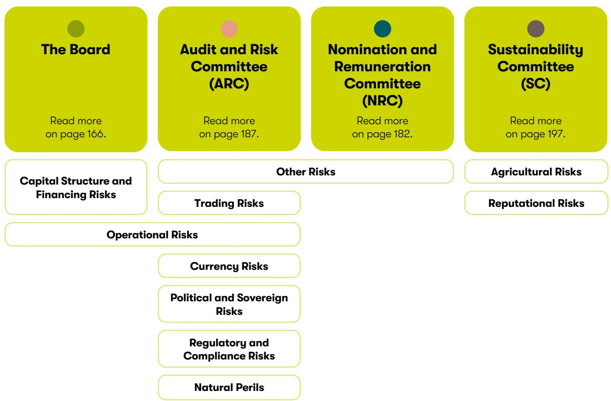

# Risk overview and ownership matrix

<table><tr><td>Risk type</td><td>Ownership and sub-risks</td><td>Mitigation</td><td>Developments in 2024</td></tr><tr><td>Trading Risks</td><td>Audit and Risk Committee
• Price Risk
• Basis Risk
• Structure Risk
• Arbitrage Risk
• Liquidity Risk</td><td>The Board sets Group-level risk envelopes (including market risk VaR) as part of the annual risk budgeting exercise. The Risk Office allocates risk limits across businesses and tracks exposures for adherence to set limits. The Group hedges price risk on various futures exchanges across the world.</td><td>Cocoa prices rose sharply during the year on supply concerns in West Africa, more than doubling as a result. Coffee prices also rose during the second half of the year, also on supply concerns in the major origins. Cotton prices and basis levels witnessed heightened volatility during the first half of the year.</td></tr><tr><td rowspan="3">Operational Risks</td><td>Audit and Risk Committee
• Credit Risk
• Counterparty Risk</td><td>The Board sets Group-level risk envelopes (including nominal credit and counterparty risk limits) as part of the annual risk budgeting exercise. The Risk Office allocates limits across businesses, and limits on individual parties are set in accordance with defined approval hierarchies. The Risk Office tracks exposures. Credit insurance, bank guarantees, post-dated cheques and cash advances are employed as risk mitigants.</td><td>Contract performance risk increased, particularly on the supplier side, due to sharp increases in cocoa and coffee prices. Cotton customer counterparty risk rose on lower prices.</td></tr><tr><td>Audit and Risk Committee
• Stock Risk
• Quality Risk
• Fraud Risk
• Systems and Controls Failure Risk</td><td>Documented procedures and audit programmes are in place to ensure physical inventory verification in terms of quantity and quality, grade, age, shelf-life and liquidity, and that procedures for payments, receipts and confirmations are properly implemented and governed to ensure fraud risk is mitigated.</td><td>The process of regular review and monitoring is in place, and there has been additional effort to further enhance mitigating controls of stock risk due to heightened inventory prices. We continue to work on adding to and enhancing existing systemic controls.</td></tr><tr><td>The Board
• Project Execution Risk
• Asset Utilisation Risk</td><td>A thorough analysis of the project economics is undertaken to stress and evaluate potential impacts to project returns; documented procedures exist to ensure functional buy-in from all relevant stakeholders; and asset utilisation risk is mitigated through procedures and protocols which govern operational excellence.</td><td>Current total network utilisation does vary across our facilities. Most of our assets are well-positioned to accommodate the current demand as well as incremental increases. Where there are opportunities for step changes in demand, plans for asset expansion are in place. Where demand has stabilised and efficiencies of production have materialised, plans for asset rationalisation have been identified and undertaken.</td></tr><tr><td>Currency Risks</td><td>Audit and Risk Committee
• Transactional Currency Risk
• Translational Currency Risk</td><td>The Group's functional currency is the US dollar, which is also the dominant transactional currency. The Board sets Group-level risk envelopes (including transactional currency risk VaR) as part of the annual risk budgeting exercise. The Risk Office allocates risk limits for transactional non-USD exposures across businesses, and tracks exposures for adherence to set limits. The Group accesses spot and forward FX markets as well as local currency borrowings to hedge transactional currency risk.</td><td>The Nigerian Naira continued to depreciate through the first half of the year, before stabilising in the second half.</td></tr><tr><td>Agricultural Risks</td><td>Sustainability Committee
• Weather Risk
• Pests and Diseases Risk
• Agronomy/GAP (Good Agricultural Practices) Risk</td><td>To mitigate risks such as weather, disease and yields, which can impact agricultural production and development, we work in our managed concessions and farms and with producers on mitigation and adaptation measures such as good agricultural practices, to optimise resources, and we are exploring climate-smart agricultural practices.
We seek to improve wider understanding of issues in the agri-complex amongst stakeholders.
We have developed more and better indicators – including high-level hotspotting and field-level studies – which help monitor social and environmental risks such as soil degradation, climate risk, human rights and food insecurity.</td><td>We have strengthened our evaluation processes throughout the supply chain when assessing any new investments. This includes, but is not limited to, climate, water and soil health, human rights and deforestation risks. We have developed further breadth and granularity of our high-level risk hotspotting against forest loss, water stress, biodiversity and soil health indicators. This is bolstered by continued improvement in our supply chain mapping.
Regenerative agriculture is a key solution to the challenges we face and we continue to progress our work in this area. Olam Agri's cotton business in Côte d'lvoire launched its regenagri® Carbon Inserting programme, a pioneering initiative to promote sustainable cotton production and reduce carbon emissions within the supply chain in the region. And offi's dedicated regenerative agriculture team trained agronomists from seven origin countries across Latin America and Asia, on context-specific and farmer-centric best practices to guide their training with farmers</td></tr><tr><td>Political and Sovereign Risks</td><td>Audit and Risk Committee
• Duty, Tariff and Export/Import Ban
• Asset Nationalisation Risk
• Selective Discrimination Risk
• Forced Abandonment Risk
• Terrorism/Kidnapping Risk</td><td>The Group has a deep-seated presence in many of the countries in which it operates, built over many years, and has consequently gained substantial knowledge of local practices while maintaining the necessary relevant insurances.</td><td>The current geopolitical environment continues to impose a heightened risk of damage or loss due to war, civil commotion, asset nationalisation, and forced abandonment. Nonetheless, the Group continues to manage these risks with substantial knowledge of local practices, advice and support from expert consultants, and constant monitoring of ground circumstances.</td></tr><tr><td>Capital Structure and Financing Risks</td><td>The Board
• Interest Rate Risk
• Funding Liquidity
• Margin Call Risk
• Credit Metrics Risk
• Activist Investor Risk
• Short-Seller Attack Risk</td><td>The Group has a strong base of long-term shareholders. We maintain strong banking relationships, providing committed banking lines, thereby assuring good liquidity.</td><td>We continue to diversify our capital and funding base via a combination of bank and non-bank sources including an AED loan, an Islamic banking facility and an ECA-linked financing, as well as private placements of notes to institutional investors. Read more in our Group CFO's review on pages 18 to 25.</td></tr><tr><td>Reputational Risks</td><td>Sustainability Committee
• Social Risk
• Economic Opportunity
• Safe and Decent Work
• Safety and Health Risk
• Food Safety and Product Recall Risk
• Environmental Risk
• Climate Action
• Healthy Ecosystems
• Water
• Soil Health
• Waste</td><td>Our brand and reputation are vital to maintaining trust and engagement with our stakeholders, such as employees, customers, investment community, suppliers and partners. To strengthen our ethical and compliance standards and to meet environmental and social standards, which may impact our reputation, the Group has a suite of policies, codes and standards which include our Code of Conduct, Crisis Escalation Procedure, Fair Employment Policy, Anti-Bribery and Corruption Policy, Whistleblowing Policy, Living Landscapes Policy, Plantations, Concessions and Farms Code, and Supplier Code. The Group is a signatory to the Task Force on Climate-related Financial Disclosures (TCFD). Read more on pages 132 to 140.</td><td>We continually review sustainability risks through screening against global indices for human rights, food security, climate change, water stress and forest loss. More detailed analysis may be conducted where risks are identified.
Olam Agri, offi, WUR and others are participating in a project to develop a methodology that allows to assess risks (e.g. child labour, forced labour, violence and harassment). Through this, we've developed sustainability risk profiles for over 100 commodities sourced from various countries. Read more on page 113.
We measure our carbon footprint across the three Scopes – direct emissions, indirect emissions from purchased energy, and indirect emissions from our supply chain – in line with the GHG Accounting Protocols.
We use Terrascope to assist companies with managing and reducing their carbon emissions.</td></tr><tr><td rowspan="2">Regulatory and 
Compliance 
Risks</td><td>Audit and Risk 
Committee
·Market Compliance</td><td>The Group's Market Compliance 
Office (MCO) is a global function 
whose role is to ensure that 
the Group is fully compliant 
with regulations as they apply 
to global exchange-traded 
and over-the-counter derivatives.</td><td>EMIR Refit was adjusted in 2024 in the EU 
and UK, and new reporting requirements were 
imposed by the Monetary Authority of Singapore 
(MAS) in Singapore in 2024. All changes 
in applicable regulatory and reporting 
requirements were met on time. 
Trading continues on multiple soft 
commodity markets. 
The global regulatory landscape remains stable. 
The MCO has improved its market compliance 
programme, with the implementation of new 
trade surveillance controls, and improved 
policies and processes following an assurance 
audit by KPMG.</td></tr><tr><td>Audit and Risk 
Committee
·Bribery/Corruption Risk
·Other Regulatory Risk
·Transfer Pricing Risk
·Taxation Risk</td><td>Olam Group has in place a 
comprehensive Legal Compliance 
Programme which includes Its Code 
of Conduct and policies relating 
to Anti-Bribery and Corruption, 
Conflicts of Interest, Competition 
Law, Sanctions, and many other 
legal risks. The Compliance 
Programme includes global employee 
training to maintain awareness along 
with relevant systems and controls 
to ensure implementation and 
enforcement. These serve as 
a primary deterrent against 
such risks. 
Regarding Transfer Pricing, most 
geographies have detailed policies 
in place to guide them on arm's 
length pricing, ensuring compliance 
with all applicable tax laws.</td><td colspan="1">The Global Legal Compliance programme 
continues to be developed and improved 
to address key risks. 
The Code of Conduct and all related global 
policies are reviewed annually, with training 
updated and conducted routinely. 
The Anti-Bribery and Corruption (ABC) Policy, 
along with Gifts and Entertainments controls and 
monitoring were enhanced significantly in 2024. 
A significantly improved Whistleblowing system 
(The Speak Out platform) was implemented 
and rolled out globally in 2024. This allows for 
reporting in multiple languages and channels 
for anonymous communication in line with 
regulatory requirements. 
Global visitation of higher-risk countries 
continues. The Group continues to monitor 
existing and developing sanctions and 
counterparties, and to ensure business activities 
are compliant with applicable regulations.</td></tr><tr><td>Natural 
Perils</td><td>Audit and Risk 
Committee
·Pandemic Risk
·Fire Risk
·Flood Risk
·Earthquake Risk
·Hurricane/ Typhoon/ 
Storm Risk</td><td>The Group maintains insurance 
cover against risk of natural 
disasters, such as flood, fire, 
earthquakes and storms.</td><td>There have been no material developments 
in 2024. The Group continues to monitor 
risks and maintain localised business continuity 
plans and drills where relevant.</td></tr><tr><td rowspan="2">Other Risks</td><td>Audit and Risk 
Committee
·Cybersecurity Risk
·IT Risk</td><td>The Group employs IT security 
experts, as well as having in place 
IT cybersecurity infrastructure to 
mitigate against electronic viruses, 
ensure currency of software deployed 
throughout the Group, and employ 
data leakage prevention controls.</td><td>As many of the Group's employees continued 
to work flexibly, the IT and digital capabilities 
continued to be leveraged, to ensure that online 
working is seamless and associated 
cybersecurity risks are minimised. Read more on 
cyber risks and cybersecurity in our Audit and 
Risk Committee section on pages 187 to 196.</td></tr><tr><td>Nomination and 
Remuneration 
Committee
·Key Persons Risks</td><td>Succession plans are in place and 
are reviewed annually to provide a 
second line of leadership from within 
the Group's Operating Committee 
and Management Committee.</td><td colspan="1">New organisational structures were put in place 
for each operating group. The structure and 
framework for succession continues to be 
reviewed and strengthened both organically 
and through recruitment. A strong second line 
of leadership has been embedded across 
the various businesses, regions and functions 
of the respective operating groups, and there 
is a focus on developing the talent pipeline 
to be future-ready.</td></tr><tr><td>Strategic 
Risks</td><td>The Board</td><td colspan="2">All strategic risks are overseen by the Board and the 
office of the CEO.</td></tr></table>

# Driving an integrated mindset through multi-capital accounting

Olam Group (Olam) strives to deliver long-term value by embedding Natural, Social and Human Capital impacts and dependencies into business strategy and key decision-making analyses and processes.

The food system forms an inextricable link between people's health and planet health. Food production and supply chains need to be transformed to meet the needs of people and the environment. As a leading food and agri-business supplying food, ingredients, feed and fibre worldwide, Olam believes in playing an integral role in the food system transformation and delivering consistent returns to all our stakeholders through extensive management of our non-financial capitals.

Olam focuses especially on the Natural, Social and Human Capitals which are not assessed in conventional accounting and reporting frameworks. A dedicated department within the Finance function was established to holistically approach multi-capital valuation and accounting and embed the same into business decision-making. Olam is among the first organisation in Singapore to report detailed Natural Capital accounts.

Multi-capital accounting (MCA) is an approach that addresses the complexity of agriculture and food systems, recognising they are inextricably intertwined with, and underpinned by, the natural environment and society. Olam references the Natural, Social and Human Capital protocols issued by the Capitals Coalition which are frameworks to identify and measure the value that the organisation receives from Natural, Social and Human Capitals. This approach enables a holistic understanding of the system in which Olam operates, leading to integrated decision-making which benefits our whole set of stakeholders. Olam sits on the Capitals Coalition Advisory Panel to provide input and guidance that feeds into the Coalition's strategic development. Through the Advisory Panel, Olam leads and advocates for a capitals approach in the agriculture sector, and develops and leads collaborative projects on behalf of the Coalition.

MCA enables Olam to lead the sector towards achieving regenerative and sustainable agricultural and food systems. With a holistic understanding of its dependencies and impacts on Natural, Social and Human Capitals, Olam can make informed business decisions to address externalities and enhance positive impacts. Olam endeavours to be a resilient and reliable partner for all its stakeholders by creating long-term value. With MCA, Olam is better equipped to mitigate the risks and seize the opportunities presented by environmental and social challenges such as climate change, biodiversity loss and social inequities, thus strengthening the resilience of our business ecosystem.

# Driving a mindset change

Assessing and quantifying our environmental and social impacts and dependencies in monetary terms enables us to communicate our sustainability performance with both internal and external stakeholders in a common business language. This drives a mindset change as stakeholders begin to recognise the economic value of the benefits derived from non-financial capitals.

# Internalising externalities

Olam strives to internalise externalities by using valuation methodologies (often based on environmental economics concepts) to translate our impacts and dependencies on the environment and society into monetary values, working with businesses to incorporate these into financial analyses that drive business strategy and inform key business decisions.

# Delivering long-term value for all stakeholders

Multi-stakeholder involvement and engagement is at the heart of Olam's way of operating. MCA allows Olam to achieve this in a systematic manner by striving to incorporate quantified impacts into decisions that impact the lives and livelihoods of various stakeholders.

# Assessing the Natural and Social Capital impact of regenerative agriculture for cotton farmers in Côte d'lvoire

Olam Agri is a major player in the cotton industry in Côte d'lvoire, operating under its subsidiary SECO (Société d'Exploitation Cotonnière Olam). Through its integrated ginning and contract farming model, Olam Agri supports more than 20,000 farmers in the Tchologo region to improve their farming practices and livelihoods. To strengthen the adoption of sustainable agricultural practices, Olam Agri has launched a global regenerative agriculture programme. In Côte d'lvoire, Olam Agri has achieved regenagri® certification for  $100\%$  of its directly sourced cotton, totalling more than 256,915 ha of land. Olam Agri's cotton is also certified by Cotton made in Africa (CmiA) and audited by Better Cotton (BC) during the 2024/2025 cotton season, highlighting its commitment to sustainable and ethical production.

Increasing pressure from commercial agriculture has resulted in the destruction of natural vegetation, leaving exposed topsoil vulnerable to erosion due to rainfall. Persistent droughts in the past decades have aggravated soil degradation and affected agricultural production. A severe infestation of an invasive new species of jassid pests, which appear resistant to existing pesticides, was estimated to have caused up to  $50\%$  crop losses in Côte d'lvoire and other West African countries following a drought in 2022.

Regenerative agriculture addresses the challenges posed by climate change, soil erosion and pest infestations. By prioritising soil health and biodiversity, regenerative practices can restore degraded ecosystems, improve water retention and crop resilience, and enhance farmer livelihoods. They can also reduce greenhouse gas emissions and minimise pollution from synthetic fertilisers and pesticides, ultimately benefitting human health and the economy.

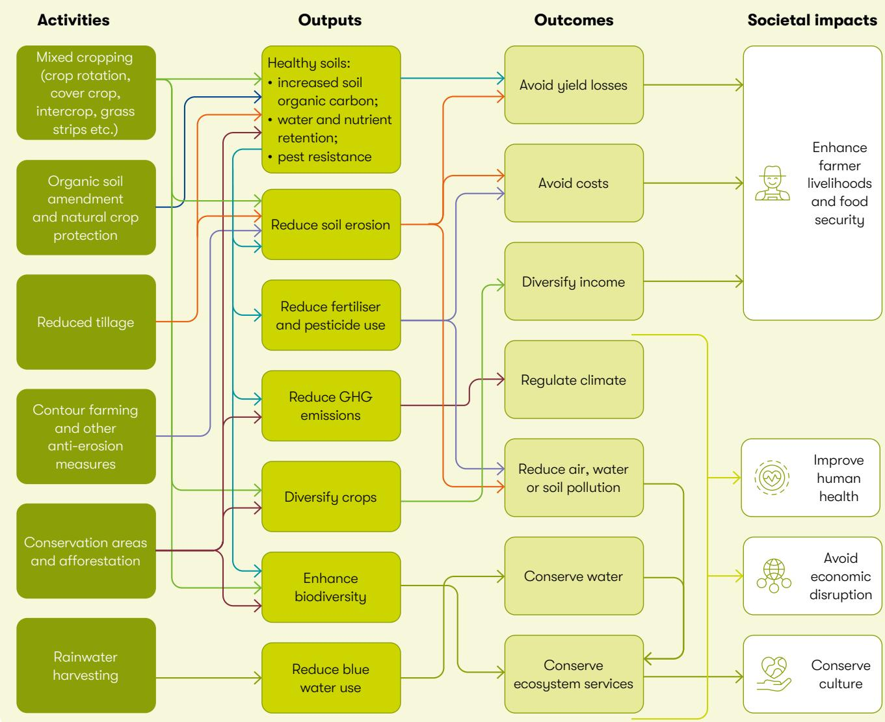  
Impact map of regenerative agriculture practices

Since 2020, Olam Agri has been providing training to smallholder cotton farmers in Côte d'ivoire to gradually transition to regenerative agriculture practices including mixed cropping, organic soil amendment, natural crop protection, reduced tillage, contour farming, afforestation and rainwater harvesting. Olam Agri also supports farmers by funding costs such as for seeds, as well as monitoring progress through soil testing and analysis that inform input needs.

# Natural and Social Capital Profit & Loss Statement for regenerative agriculture practices in cotton farming, Côte d'lvoire

<table><tr><td>Impact valuation (added/deducted) for regenerative agriculture practices during the 2022/2023 cotton farming campaign in Côte d&#x27;lvoire,* compared to conventional farming</td><td>Value to Society ($)</td></tr><tr><td>Natural and Social Capital Enhancements (+ impacts)</td><td></td></tr><tr><td>Enhancement of farmer livelihoods</td><td></td></tr><tr><td>Projected avoidance of yield losses and additional carbon credit income^</td><td>16,189,032</td></tr><tr><td>Reduced costs of synthetic fertiliser use</td><td>13,664,126</td></tr><tr><td>Reduced costs of pesticide use</td><td>3,458,416</td></tr><tr><td>Reduced water pollution from synthetic fertiliser use</td><td>17,226,885</td></tr><tr><td>Reduced air, water and soil pollution from pesticide use</td><td>422,631</td></tr><tr><td>Reduced GHG emissions</td><td></td></tr><tr><td>Improvement in soil organic carbon and reduction in synthetic fertiliser use, pesticide use and energy for irrigation and tillage</td><td>1,876,415</td></tr><tr><td>Conservation of ecosystem services in conservation areas</td><td>7,298,243</td></tr><tr><td>Natural and Social Capital Profit/(Loss)</td><td>60,135,748</td></tr></table>

* Based on 2022/2023 campaign data collected from Olam Agri's contract farmers that were audited for the regenagri® certification. Audit of 2023/2024 campaign data is still ongoing  
^ Net Present Value of projected benefits, based on a conservative assumption that it will take around six years from the 2022/2023 campaign for Olam Agri's contract farmers to achieve a steady state of implementing regenerative agriculture practices and for the consequent benefits to materialise

# Impacts of Olam Agri's regenerative agriculture interventions in cotton farming, Côte d'lvoire

# Activities

# Mixed cropping systems

Olam Agri is promoting the growth of legumes for biological nitrogen fixation, improving soil fertility without synthetic fertilisers. As of the 2022/2023 campaign, Olam Agri has trained about 4,400 farmers to grow legumes in mixed cropping systems including crop rotation, cover crops, intercropping and grass strips.

About  $45 \%$ and  $70 \%$ of the cotton farm area managed by Olam Agri’s contract farmers practised cover cropping and intercropping respectively, growing various plants including fodder grass, wild paddy, beans, mango, cashew and soybeans. The farmers had an average of five crops in rotation (cotton, maize, sorghum, soybean and other beans).

During the 2023/2024 campaign, Olam Agri continued to train more than 13,000 farmers on mixed cropping systems. Olam Agri aims to explore local leguminous species to increase farmer engagement and facilitate adoption and commercialisation in local markets.

# Organic soil amendment (natural fertilisation) and natural crop protection

Olam Agri's strategy is to reduce synthetic fertilisers by promoting the use of organic soil amendments which help to maintain the fertility of soil in the long term.

Olam Agri introduced a fermented activated composting method, Bokashi, to cotton farmers. 320 lead farmers along with 2,400 members of their communities were trained on Bokashi, allowing the production of 250 tonnes of compost for the 2022/2023 campaign. More than 13,000 farmers have been trained in composting techniques during the 2023/2024 campaign.

With the technical support of ICAC and CIRAD, a pilot covering 100 ha was initiated to promote biochar production from crop residue biomass, otherwise mainly left on the field. About 2,800 farmers were trained during 2023/2024, and Olam Agri continues to scale biochar production and application while testing the soil for results.

Olam Agri aims to reduce synthetic pesticide application by training farmers on the production of bio-solutions with local ingredients such as neem oil and installation of sticky pads and pheromone traps.

# Outputs

# 1. Healthy soil

a. Replenishment of organic matter and better nutrient retention thus reduced dependency on synthetic fertilisers: The average synthetic fertiliser application rate per hectare of Olam Agri's contract farmers is about  $56\%$  lower than that of average cotton farmers in Côte d'Ivoire.2

b. Pest resistance and better weed control thus reduced dependency on pesticides: The average pesticide application rate per hectare of Olam Agri's contract farmers is about  $20\%$  lower than that of average cotton farmers in Côte d'ivoire.2

c. Increase in soil organic carbon (SOC), a good indicator of soil health: The average SOC in the cotton fields of Olam Agri's contract farmers is  $0.28\%$ . Olam Agri is committed to increasing the SOC value to at least  $1\%$  within five years. Research suggests a potential increase in SOC with the use of:3

- practices such as incorporation of crop residues, use of green manures, cover crops, frequent use of perennial grasses in annual crop rotations, and regular application of manure: up  $44\%$  
no-till system with minimal soil disturbance: up  $4 \%$

# Outcomes/Impacts

# 1. Enhancement of farmer livelihoods

a. Avoided yield losses and climate resilience: Sub-Saharan Africa is vulnerable to droughts and floods that cause enormous economic losses. Under a regenerative scenario, sub-Saharan crop yields can be \(4\%\) and \(13\%\) higher than business as usual, by 2030 and 2040 respectively. Potential avoided yield losses and carbon credit income are estimated to be about S\\(800 per farmer.5  
b. Diversification of source of income, food, and feed: A diversity of crops can diversify revenue streams and mitigate income shocks. Daily calorific intake per capita may increase across sub-Saharan Africa by 2040 up to  $16\%$  when agriculture is regenerative, and nutrition improves as more diverse food crops are produced.4  
c. Associated with reduced dependency on synthetic fertilisers and pesticides, a farmer is estimated to save S\\(840 on the costs of synthetic fertilisers and pesticides.

1. Outcomes and impacts are computed based on 2022/2023 campaign data collected from Olam Agri's contract farmers that were audited for the regenagri® certification. Audit of 2023/2024 campaign data is still ongoing  
2. Based on data extracted from the International Cotton Advisory Committee's Cotton Production Data Portal: icacdatabase.de.r.appspot.com  
3. Based on data for dry tropical climate from the 2019 Refinement to the 2006 IPCC Guidelines for National Greenhouse Gas Inventories https://www.ipcc-nggip.iges.or.jp/public/2019rf/pdf/4_Volume4/19R_V4_Ch05_Cropland.pdf  
4. regenerative agriculture in africa report 2021 compressed.pdf  
5. The potential price premiums due to improved quality of produce have not been included. Olam Agri will continue to update its methodology as more appropriate valuation data becomes available

# Impacts of Olam Agri's regenerative agriculture interventions in cotton farming, Côte d'Ivoire (continued)

# Activities

# Reduced tillage

Olam Agri promotes reduced tillage practices by raising awareness of their advantages and providing training to farmers. The Company discovered and introduced a reduced tillage technique that utilised specific farm equipment which allowed farmers to till twice as fast as the typical full plow method used. In 2022/2023,  $83\%$  of cotton fields managed by Olam Agri's contract farmers applied conservation tillage techniques.

# Soil erosion control

The erosion control programme, developed by Olam Agri with the technical support of IFC, aims to reduce soil erosion that results in loss of valuable soil and damage caused by the submergence of roads and fields in the lowest areas. The programme has four steps:

- Gully treatment (restoration of existing damages)  
- Preventive measures (grass strips or planted earth bunds)  
- Contour farming  
- Revegetation of living hedges (more details under the conservation areas and afforestation section).

Olam Agri provided training to 7,350 cotton farmers to adopt soil erosion practices between 2018 and 2022, allowing the rehabilitation of agricultural areas unsuitable for production.

# Outputs

d. Reduced GHG emissions associated with potential increase in SOC and reduced synthetic fertiliser use, pesticide use and energy for irrigation and tillage: The average GHG emissions per tonne of cotton of Olam Agri's contract farmers are about  $30\%$  lower than that of cotton farmers in major cotton-producing countries: China, India and U.S.A.  
e. Better water retention capacity.  
2. Protection against soil erosion: Soil erosion rate is potentially reduced by  $50\%$  due to the partial adoption of soil protection measures (including crop rotation, no-tillage, field barriers, cover crops, organic fertiliser application, crop residues on field, and intercropping) by CmiA-Certified cotton farmers in Côte d'lvoire.2  
3. Diversification of crops grown as a source of income, food, and feed.3  
4. Increased biodiversity at farm level.3

# Outcomes/Impacts1

2. Reduced water pollution associated with the leakage of synthetic fertilisers, due to reduced dependency on synthetic fertilisers and reduction in soil erosion rate, is estimated to create societal value of about S\\(180 per hectare of cotton produced. The societal impacts include conservation of ecosystem services and human health due to reduced eutrophication.  
3. Reduced air, water and soil pollution due to reduced dependency on pesticide use is estimated to create societal value of about S\\(4 per hectare of cotton produced. The societal impacts include conservation of ecosystem services and human health due to reduced pesticide pollution.  
4. Reduced GHG emissions are estimated to create societal value of about S\\(40 per tonne of cotton produced. The societal value of climate mitigation relates to the avoided impacts of climate change, including impacts on human health and ecosystems, as well as economic disruptions from production disruptions and physical damages.

# Impacts of Olam Agri's regenerative agriculture interventions in cotton farming, Côte d'lvoire (continued)

# Activities

# Conservation areas and afforestation

Olam Agri works with local institutions to identify useful trees to increase the level of participation among farmers in its afforestation efforts.

A diversity of species provides multiple uses including nitrogen-fixation, pest control, fruits, firewood, forage, biofuel, and timber.

In partnership with Côte d'lvoire's Ministry of Water and Forests, during the 2022/2023 campaign:

- 5,450 trees have been planted as living hedges in 22 villages  
- 9,800 trees have been planted as forest in 7 villages

During the 2023/2024 campaign, 15,930 saplings were planted. For the 2024/2025 campaign, the target is to plant 45,000 saplings.

During the 2022/2023 campaign, it is estimated that  $30\%$  of lands managed by Olam Agri's contract farmers are conservation areas, hedgerows, buffer strips and unfarmed land. The area of land dedicated to conservation has been enlarged by more than  $0.5\%$  during the year.

# Outputs

1. Healthy soils (see item 1 above for details of outputs). Research suggests a potential increase in SOC by  $10\%$  from growing perennial tree crops such as fruit and nut trees compared to land cultivated for annual crops.2  
2. Protection against soil erosion (see item 2 above for details of outputs).  
3. Diversified sources of income (fruit trees, fodder, medicinal plants, timber, charcoal production, etc.).  
4. Carbon sequestration  
5. Climate adaptation by creating microclimate conducive to locals.  
6. Increased infiltration of rainwater into water table and improved water quality  
7. Wildlife habitat

# Outcomes/Impacts

The societal value of ecosystem services in conserved grasslands is more than S\\(300 per hectare of area conserved. Ecosystem services, underpinned by biodiversity, are the direct and indirect contributions of ecosystems to human wellbeing, including provisioning, regulating, supporting and cultural services.

A more comprehensive analysis of the outcomes and impacts of afforestation, especially the carbon sequestration potential of the trees planted will be performed upon intended verification for carbon credit registration.

# Assessing the Natural and Social Capital impacts of Alternate Wetting and Drying (AWD) training for rice farmers in India

Besides its significant water footprint, wet rice cultivation is a large contributor to methane emissions. Smallholder rice farmers are vulnerable to the impacts of climate change, including the increasing volatility of precipitation and extreme temperatures and droughts. Moreover, while women take on a large share of the work, they often have limited access to productive resources, agricultural knowledge regarding innovative cultivation methods and economic opportunities.

The Carbon Offsetting Rice Emissions (CORE)1 project, run by Olam Agri in partnership with GIZ,2 International Rice Research Institute and UN Women, aims to train 20,000 smallholder farmers in the use of technologies and practices to reduce GHG emissions from 2023 to 2026. As part of the CORE project in 2023 and 2024, Olam Agri provided training on Alternate Wetting and Drying (AWD) to about 15,000 smallholder farmers, of whom more than  $80\%$  were women.3 AWD is a climate-friendly rice cultivation technique where fields are flooded only periodically, leading to positive impacts that are scientifically proven and recognised by international standard-setters.

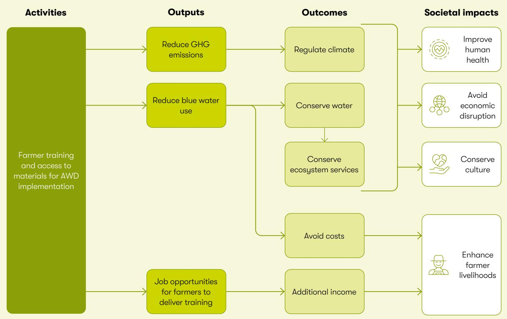  
Impact map of providing support to rice farmers in India for AWD implementation

1. India: giz2024- en-core-india-factsheet.pdf  
2. The project was co-financed by GIZ from public funds of the German Federal Ministry for Economic Cooperation and Development  
3. While farmers have also been trained on Gender Mainstreaming in the Rice Value Chain in 2023 and 2024, the benefits of women empowerment have not been included in this report, pending data

# Estimated annual Natural Capital impact of methane and nitrous oxide emissions per hectare

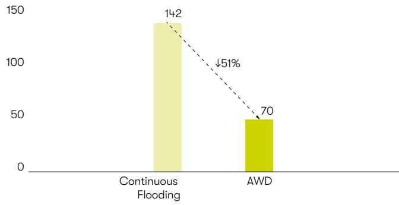  
(SS/ha)

To compare the impacts of continuous flooding (used in traditional rice farming) and AWD, methane and nitrous oxide emissions were monitored using gas chambers in Haryana, India in 2023. The annual societal value of impacts associated with GHG emissions were estimated to be reduced by  $51\%$  per hectare. In total, the farms trained on AWD are estimated to potentially decrease societal impacts by more than  $4,400\mathrm{tCO}_{2}\mathrm{e}$  of GHG emissions in 2023 and 2024. This translates to a societal value of approximately  $\S\S 530,000^{1}$  associated with the reductions in emissions.

The abovementioned trainings in 2023 and 2024 were conducted by more than 190 rice farmers, of whom about \(80\%\) were women. They were trained to become master trainers and given the opportunity to earn additional income amounting to a societal value of about S\\(150 each.

# Natural and Social Capital valuation approach notes and assumptions

# - Potential avoided yield losses and carbon credit income for farmers due to regenerative agriculture:

Once a steady state of implementation is in place, typically after six to ten years, regenerative agriculture practices should increase farmers' profits through avoided yield loss and carbon credit income by an estimated EUR178 per hectare. Given that Olam Agri has achieved a score of \(77\%\) in its regenagri® certification based on 2022/2023 cotton campaign data, the Company has taken a conservative assumption that it will take around six years to achieve large-scale adoption of regenerative agriculture practices. The net present value of potential avoided yield loss and carbon credit income is estimated to be S\\(165 per hectare, after adjusting for purchasing power parity and price-level index differences between Germany and Côte d'lvoire. As this estimation was derived from a study of German farmers growing cereal and oilseed crops, there is a limitation in its application to cotton farmers in Côte d'lvoire. Olam will continue to update its methodology as more appropriate valuation data becomes available.

- GHG emissions: Olam has applied a Social Cost of Carbon (SCC) of US$90 (S$120) per tCO2e³ to value the «costs to society of climate change impacts due to GHG emissions, measured by a global GDP reduction.  
- Air, water and soil pollution from fertiliser and pesticide use: Olam has applied environmental prices4 to account for emissions of nitrogen (N) and phosphorus (P) to water (from fertiliser use), and emissions of pesticide chemicals to air, water and soil (from pesticide use). As these environmental prices are derived from studies conducted in European countries, there is a limitation in their application to other locations since the damage costs of environmental pollution can vary widely according to local circumstances. Olam will continue to update its methodology as more appropriate valuation data becomes available.  
- Ecosystem services: Ecosystem services, underpinned by biodiversity, are the direct and indirect contributions of ecosystems to human wellbeing, including provisioning, regulating, supporting and cultural services. Olam has applied the Total Economic Value of US$232 (S$311) per hectare per year of world's grasslands to value the ecosystem services of conservation areas in Côte d'lvoire.  
- Social impact of reduced fertiliser and pesticide costs for farmers: The impact of reduced fertiliser and pesticide use on farmers' livelihoods has been assessed based on average fertiliser and pesticide costs in the relevant country, adjusted by purchasing power parity.  
- Social impact of additional income for farmers: The impact of additional income on farmers' livelihoods has been assessed based on average additional income per farmer, adjusted by purchasing power parity from the relevant currency.

1. Pending actual data to be collected, the GHG gas chamber results from Haryana were extrapolated to estimate the total impact of all the farmers trained throughout India in 2023 and 2024. The societal value of reduction in water use has not been included in this report, pending data availability  
2. The Case for Regenerative Agriculture in Germany—and Beyond  
3. We have used the mid-point of SCC recommended by Massachusetts Institute of Technology (Pindyck, R S. 2019, The social cost of carbon revisited)  
4. Environmental prices from CE Delft Environmental Prices Handbook EU28 Version (2015), corrected for inflation and purchase power parity  
5. McVittie, A. & Hussain, S. (2013) The Economics of Ecosystems and Biodiversity – Valuation Database Manual. The Economics of Ecosystems and Biodiversity (TEEB): Geneva

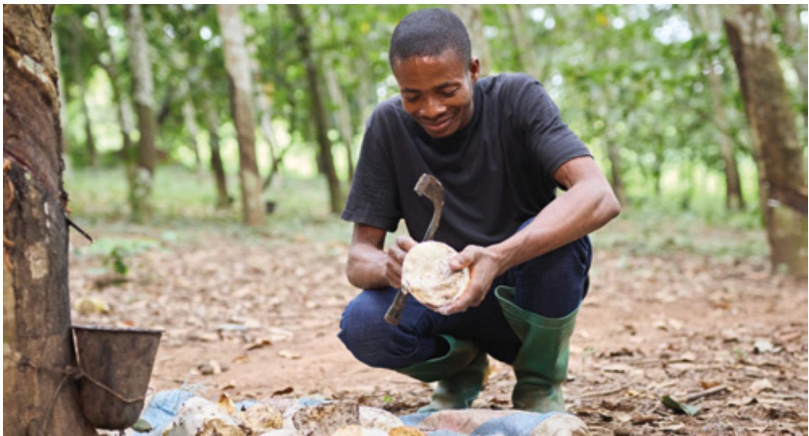  
Rubber tapper collects cup lump rubber, Côte d'lvoire

# Assessing the Social Capital impacts of uplifting efforts for rubber farmers in Côte d'Ivoire

Gouassou, which means bonus, is a biannual recognition ceremony launched in 2017 by Olam Agri's subsidiary Olam Agri Rubber Cl. Gouassou rewards the best rubber cooperatives and growing partners for their loyalty, quality, and volume of rubber products by presenting them with vehicles, equipment, and supplies that serve to improve farmer livelihoods. Since 2017, it is estimated that the rewards distributed by Olam Agri have created societal value amounting to more than S$6 million, contributing to the uplift of over 20,000 farmers' livelihoods. The rewards have supported farmers in aspects including transport, education, technology, and occupational safety. Olam Agri also distributed seeds for growing food crops, which can generate additional income or be used for subsistence. The societal value created for farmers is presented below.

# Social Capital Profit & Loss Statement for Olam Agri's rubber farmer loyalty programme

<table><tr><td>Impact valuation (added/deducted) for the rubber farmer loyalty programmein Côte d&#x27;lvoire for the financial years ended 31 December 2017 to 2024</td><td>Value to Society(£)</td></tr><tr><td>Social Capital Enhancements (+ impacts)</td><td></td></tr><tr><td>Provision of the following to farmers:</td><td></td></tr><tr><td>Food crop seeds for subsistence or additional revenue</td><td>192,895</td></tr><tr><td>Farm equipment</td><td>455,345</td></tr><tr><td>Education materials for children</td><td>239,510</td></tr><tr><td>IT equipment</td><td>148,983</td></tr><tr><td>Personal transport vehicles</td><td>155,766</td></tr><tr><td>Vehicles for delivery of rubber produce</td><td>5,467,717</td></tr><tr><td>Cash awards</td><td>189,271</td></tr><tr><td>Social Capital Profit/(Loss)</td><td>6,849,487</td></tr></table>

Impacts of Olam Agri's rubber farmer loyalty programme in Côte d'Ivoire and notes to valuation approach  

<table><tr><td>Provided by Olam</td><td>Benefit to farmers</td><td>Valuation method</td><td>Value to society per farmer/ cooperative1</td></tr><tr><td>Food crop seeds</td><td>Food crop seeds include chilli, tomato, aubergine, and cucumber seeds and can be grown for farmers’ consumption or sold for additional revenue. Crops are generally able to be grown from seeds without significant additional inputs.</td><td>Additional revenue for the relevant growing periods based on the market price of respective crops</td><td>S$585 per farmer</td></tr><tr><td>Farm equipment</td><td>New farm equipment can lead to improved harvesting efficiency such as: 
• tapping knives, which can reduce tree damage during the tapping process; 
• boots, which reduce injury rate and consequent lost time and revenue; and 
• machetes, which increase ease of navigating rubber plantation shrubbery.</td><td>Cost price of respective harvesting equipment</td><td>S$7 per farmer</td></tr><tr><td>Education materials for children</td><td>Education materials are provided for farmers’ children and include school bags and school kits (consisting of books, stationery, etc.). These materials can be particularly important in Côte d’Ivoire, where poverty and limited home literacy resources are leading causes of a significant primary school dropout rate.</td><td>Cost price of education materials</td><td>S$13 per farmer</td></tr><tr><td>IT equipment</td><td>Mobile phones and laptops provided are used by farmer cooperatives and individual farmers for purposes including payment disbursement and receipts, accounting functions, day-to-day communication, networking, etc. In a China-based study, the use of smartphone tools by farmers was correlated with large increases in income generation due to reduced cost of information, improvement in farmer skills and health, and increased networking.2</td><td>Cost price of IT equipment</td><td>S$404 per farmer or cooperative</td></tr><tr><td>Personal transport vehicles</td><td>Motorbikes provided for personal transport are necessary for both personal and business-related uses. They serve the function of last-mile rubber deliveries for roads that may be too narrow or difficult for larger delivery vehicles to traverse.</td><td>Cost price of motorbikes</td><td>S$1,227 per farmer</td></tr><tr><td>Vehicles for delivery of rubber produce</td><td>Vehicles provided include tricycles, small trucks, and large trucks. Vehicle ownership provides an important source of certainty to farmers on timely goods delivery, and consequent receipt of payment for goods. These vehicles require large capital investment or significant rental costs which can impose difficulties on farmers’ cashflows.</td><td>Avoided vehicle rental less diesel costs, based on observed market prices. Vehicles assumed to have a useful life of 10 years.</td><td>S$54,677 per farmer cooperative</td></tr><tr><td>Cash awards</td><td>Direct cash give-outs are useable according to each farmers’ individual needs to improve their livelihoods.</td><td>Face value of cash awards</td><td>S$57 per farmer</td></tr></table>

1. Value of benefits that a farmer/cooperative receives for each type of item/benefit provided by Olam, calculated as the average value of benefits provided within that category  
2. Quantifying the Income-Increasing Effect of Digital Agriculture: Take the New Agricultural Tools of Smartphone as an Example

# Social Capital Impact Valuation: Valuing the impact of agriculture-related interventions for coffee farmers in Honduras using the Social Return on Investment (SROI) framework

ofi continued its work in Honduras in 2024, looking to narrow the Living Income (LI) gap1 of approximately 1,000 coffee farmers, and conducted a Social Capital Impact Valuation to evaluate the third year of the programme. The scope of this year's valuation covered income generation-related interventions across the October 2023 – September 2024 crop year and evaluating the change seen versus the prior crop year, October 2022 – September 2023.

Tailored services and support were set up and delivered to different farmer segments, which maximised the farmers' return on investment. The segments were categorised into four clear groups; A, B, C and D, based on differing socio-economic characteristics.

Farmers in Segment A perform better in many socio-economic parameters and are typically more entrepreneurial. Comparatively, Segment D farmers face substantial difficulties in maintaining their livelihoods due to a lack of resources, whilst farmers in Segments B and C share a mixture of the socio-economic characteristics seen across Segments A and D.

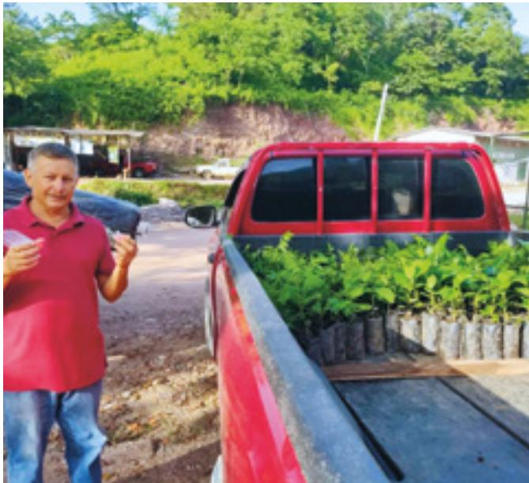  
Crop seedling kits for Segment B-D farmers

# Key programme interventions

The following interventions were implemented with a view to support coffee farmers' yields and in turn their incomes:

<table><tr><td>Intervention</td><td>Segment A</td><td>Segment B</td><td>Segment C</td><td>Segment D</td></tr><tr><td>Good Agricultural Practices (GAP) training – covering areas such as pruning, weeding, and harvesting</td><td>x</td><td>✓</td><td>x</td><td>✓</td></tr><tr><td>Pulp residue management and compost creation training – delivered to select farmers in Segment D</td><td>x</td><td>x</td><td>x</td><td>✓</td></tr><tr><td>Integrated pest management training – including the distribution of agrochemical handbooks</td><td>✓</td><td>✓</td><td>✓</td><td>✓</td></tr><tr><td>Agricultural inputs – provided farming toolkits with saws, pruning scissors and backpack pumps</td><td>x</td><td>x</td><td>x</td><td>✓</td></tr><tr><td>Farmer nutrition – delivered crop seedling kits to improve farmers’ nutrition and provided access to a nutritionist to train farmers on how to have a balanced diet</td><td>x</td><td>✓</td><td>✓</td><td>✓</td></tr><tr><td>Solar dryers – assisted farmers in setting up solar driers including user training</td><td>x</td><td>x</td><td>x</td><td>✓</td></tr><tr><td>Rainforest Alliance (RA) certification support</td><td>x</td><td>x</td><td>✓</td><td>✓</td></tr></table>

1. A living income gap represents the value that a household would need to earn on top of their actual income to meet their basic needs. Source: Living Income: https://www.living-income.com/the-concept

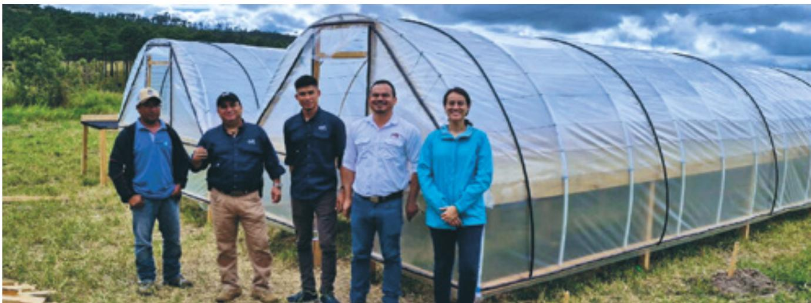  
Agricultural Inputs: Solar dryers for Segment D farmers

# Results

As depicted in Figure 1, coffee farmers in Segments C and D saw increased yields, which equated to an annual increase in income of approximately US $1,900 per farmer\(^1$  and US\)590 per farmer $^2$  respectively. This was driven by the GAP training, which focused on good soil management and improved shading control.

Segments A and B reported lower yields in 2023-2024, which was due in part to the crop pruning and rejuvenation intervention, which leaves those hectares with a reduced coffee production. The benefit of this intervention is typically seen in the longer term, over a four-to-five-year period. Despite the decrease, the yields generated still attracted a price premium due to certified production. It is worth noting that with the rejuvenation intervention and subsequent drop in production, only Segments A and B can cover this negative financial impact, whilst still being in a position to continue improving their revenue streams.

# Valuation framework

The impact of the interventions implemented by offi's coffee team in Honduras on the community was assessed through a social value creation approach framework – Social Returns on Investment (SROI).4

SROI = Net Return in US$/Total Investments in US$ =
(Total Outcome in US$ – Total Investments in US$/Total Investments in US$)

Where,5

Total Outcome in US$ = Quantity x Proxy financial value
x (1 - deadweight %) x (1 - displacement %)
x (1 - attribution %) x (1 - drop-off %)

Figure 1: Farmer segmentation by average yield and average hectares  

<table><tr><td rowspan="2">Segment</td><td>Yield in 2022-2023</td><td>Yield in 2023-2024</td><td>Difference</td><td>Average farm area</td><td>Total difference</td><td>% Difference</td></tr><tr><td>GBE kg/ha</td><td>GBE kg/ha</td><td>GBE kg/ha</td><td>ha</td><td>GBE kg</td><td>%</td></tr><tr><td>A</td><td>Big land, high yield</td><td>1,890.14</td><td>1,728.38</td><td>(161.76)</td><td>10.35</td><td>(1,674.22)</td></tr><tr><td>B</td><td>Small land, high yield</td><td>1,792.85</td><td>1,519.00</td><td>(272.85)</td><td>1.78</td><td>(485.67)</td></tr><tr><td>C</td><td>Big land, low yield</td><td>902.50</td><td>943.26</td><td>41.76</td><td>8.90</td><td>371.66</td></tr><tr><td>D</td><td>Small land, low yield</td><td>844.76</td><td>908.24</td><td>64.48</td><td>1.66</td><td>107.04</td></tr></table>

1. Segment C mostly produced Wet Parchment (certified). Considering US\\(2.59 as the average cost per kilogramme of wet parchment (certified) in Honduras  
2. Segment D mostly produced Wet Parchment (conventional). Considering US$2.79 as the average cost per kilogramme of wet parchment (conventional) in Honduras  
3. Segments A and B mostly produced Dry Parchment (certified). Considering US\\(2.80 as the average cost per kilogramme of dry parchment (certified) in Hondurast  
4. SROI Guide: https://www/socialvalueint.org/guide-to-sroi  
5. Attribution percent is not considered, as the results are attributed to all stakeholders who have partnered on the select interventions, enabling a systemic approach towards Social Capital enhancement. Impact is generated collaboratively and collectively by all stakeholders that have contributed monetarily/non-monetarily. Since the assessment is for change versus the prior year, drop-off is already considered in the SROI calculation

# Valuation approach

The scope of this valuation primarily covered income generation-related interventions across the October 2023 –

September 2024 crop year, and evaluating the change seen versus the prior crop year. Understanding the value created by these interventions is based on two key aspects: reviewing the data collected, and engagement between ofi's field and local teams in Honduras and the farmers and communities.

Once the material outcome indicators were finalised and data collected, we were able to value these indicators using the most comparable financial value, known as a financial proxy. The financial proxies were identified primarily through existing data, as well as secondary research. The valuation process involved analysing each material outcome indicator while considering four key factors – deadweight, displacement, drop-off, and attribution.

The below impact map illustrates the 'theory of change' and the relationship between the programme's inputs, outputs, and outcomes.

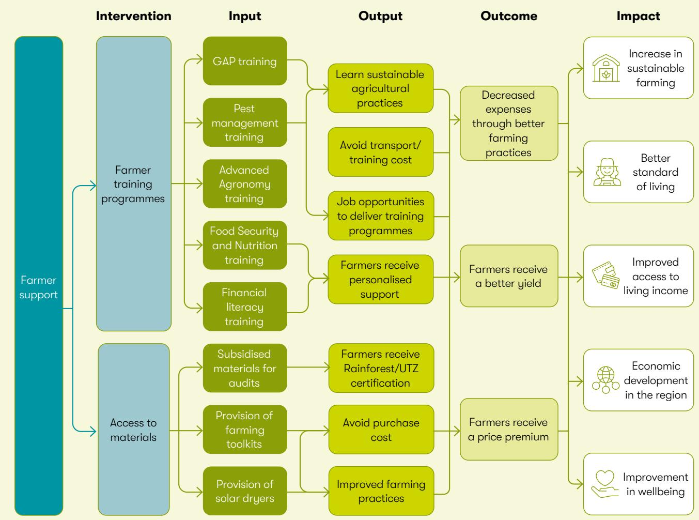  
SROI result

1. Four criteria are considered for determining impact:

- Deadweight: estimation of the value that would have been created without the interventions;  
- Displacement: assessment of how much of the intervention displaced other outcomes;  
- Dttribution: assessment of how much the outcome was due to a contribution; and  
- Drop-off: estimation of the proportion of outcomes not sustained

The SROI valuation for the October 2023 – September 2024 crop year indicated that for every dollar invested, a total of approximately two dollars' worth of social value was achieved. Therefore, an SROI ratio of 2:1. When combining this result with the 8:1 SROI valuation seen across the two-year period from October 2021 to September 2023, the total SROI delivered for the programme between 2021 and 2024 is 5:1.

As expected, the social returns are greater at the beginning of a multi-year project when an improvement intervention(s) is introduced, and the incremental benefits gradually lessen year-on-year. However, it is important to ensure that the year-on-year positive impact is maintained, ensuring that farmers are continuing to embed best practices and learnings each year.

The table below shows the social returns covering the October 2023 – September 2024 crop year and the prior crop year. Line items under Social Capital Enhancements and Deteriorations are calculated by applying valuation proxies (i.e. monetisation factors) to the social outcomes. The table depicts the changes in interventions seen across the crop years. There were four new Social Capital enhancements conducted (highlighted below). Some interventions like Good Agricultural Practices (GAP) training and provision of agricultural inputs continued, although to a lesser degree, and still generated value across both crop years. Please refer to Figure 2 Notes to valuation table for more details on financial proxies used in the valuation.

Social Capital Profit & Loss Statement for selected social interventions in Honduras  

<table><tr><td>Impact Valuation (added/deducted)</td><td>Oct 2022 – Sept 2023 US$</td><td>Oct 2023 – Sept 2024 US$</td></tr><tr><td>a. Social Capital Enhancement (+ impacts)</td><td>2,041,446</td><td>636,198</td></tr><tr><td>Advanced agronomy training (including financial literacy)</td><td>1,704,298</td><td>0</td></tr><tr><td>Good Agricultural Practices (GAP) training</td><td>140,998</td><td>46,213</td></tr><tr><td>Direct market access</td><td>1,262</td><td>0</td></tr><tr><td>Demonstration plots</td><td>3,611</td><td>0</td></tr><tr><td>Pulp residue management &amp; compost creation training</td><td>0</td><td>10,976</td></tr><tr><td>Integrated pest management training</td><td>0</td><td>81,144</td></tr><tr><td>Provision of agricultural inputs</td><td>191,276</td><td>9,976</td></tr><tr><td>Food security &amp; farmer nutrition</td><td>0</td><td>7,452</td></tr><tr><td>Rainforest Alliance Certification support</td><td>0</td><td>480,437</td></tr><tr><td>b. Social Capital Deteriorations (- impacts)</td><td>0</td><td>0</td></tr><tr><td>Social Capital Profit/(Loss) (a-b)</td><td>2,041,446</td><td>636,198</td></tr></table>

# Learnings

A key learning from last year's SROI valuation focused on how to improve the way in which farmers' feedback is captured. As a result, the team in Honduras held focus group discussions to better understand farmers' opinions. The insights highlighted that farmers valued the tailored assessments, as it led to more meaningful and targeted interventions, and that the agronomical assessments and technical support provided was considered beneficial.

Below are a few key areas the project team identified to further enhance positive impacts in future programmes:

1. As the benefits of crop pruning and rejuvenation are seen four-to-five years post-implementation, it is important to establish other interventions to ensure yields increase in farming areas that are not undergoing rejuvenation. Improving income diversification for farmers will also alleviate the pressure of revenue losses from the rejuvenation intervention.  
2. Further monitor the outcome of distributing crop seedlings and providing nutrition training, to better understand if there has been a reduction in nutrition-related illnesses and if there has been a cost saving due to reduced spend on food purchases.

3. Collaborate with other local stakeholders across the value chain such as local NGOs, local government, Honduran Institute of Coffee (IHCAFE) and cooperatives. Building more relationships around the programme can lead to improved infrastructure, policy changes and stronger farmer organisation.  
4. Introduce a control group of farmers, so that we can compare and have a clearer view of the additional impacts that farmers receive from ofi's interventions.

The insights gained from the Social Capital Impact Valuation are critical for refining ofi's tailored interventions in future programmes, and in turn further augment farmers' livelihoods and maximise social value.

Figure 2: Notes to valuation table  

<table><tr><td>Stakeholder</td><td>Outcome indicator name</td><td>Financial proxy</td><td>Financial proxy value</td></tr><tr><td rowspan="15">Farmers
Direct beneficiaries of the programme.
The key objective is to enhance their livelihoods.</td><td>Learn better agricultural practices through GAP training</td><td>Average cost of external GAP training per person in Honduras</td><td>US$13 per farmer</td></tr><tr><td>Transportation cost saved for obtaining similar GAP training externally</td><td>Commuting cost avoided for obtaining similar support/training (annual average)</td><td>US$228 per farmer based on a six-month period training course</td></tr><tr><td>Access to materials to set up solar dryers and user training</td><td>Average cost of a solar dryer plus the cost to deliver the materials</td><td>US$256 per farmer</td></tr><tr><td>Access to farming toolkits (saws, pruning scissors, backpack pumps)</td><td>Average cost of farming toolkits saved plus average cost of transportation to procure</td><td>US$29 per farmer</td></tr><tr><td>Reduction in fertiliser use, due to pulp residue management and compost creation training</td><td>Estimated cost of fertilisers saved</td><td>US$1,120 per farmer</td></tr><tr><td>Reduction in pesticide use, due to provision of agrochemicals handbook and Integrated Pest Management training</td><td>Estimated cost of pesticides saved</td><td>US$1,035 per farmer</td></tr><tr><td>Improved nutrition through access to crop seedling kits</td><td>Average cost of crop seedling kits saved plus average cost of transportation to procure seedlings</td><td>US$28 per farmer</td></tr><tr><td>Improved health due to nutritionist training</td><td>Estimated training cost saved per farmer if they had attended a similar training externally</td><td>US$19 per farmer</td></tr><tr><td>Access to Rainforest Alliance (RA) certification</td><td>Average annual increase in yield per farmer</td><td>US$1,238 per farmer</td></tr><tr><td>Learning better agriculture practices through advanced agronomy training</td><td>Annual average training cost saved per farmer</td><td>US$123 per farmer</td></tr><tr><td>Increased financial skills and knowledge on personal financial management through financial literacy training</td><td>Annual average training cost saved per farmer</td><td>US$34 per farmer</td></tr><tr><td>Increased income associated with training (including premium on good quality produce)</td><td>Average annual increase in yield per farmer and price of wet (or dry parchment), certified or conventional</td><td>US$1,186 per farmer</td></tr><tr><td>Direct market access</td><td>Cost saved on finding alternative to direct procurement, or cost saved in developing market linkages by employing third-parties</td><td>US$6 per farmer</td></tr><tr><td>Access to coffee seedlings and other materials for the development of a coffee nursery</td><td>Average annual cost of coffee seeds saved including average cost of transportation to procure seedlings</td><td>US$14 per farmer</td></tr><tr><td>Access to practical examples of success of implementing new practices (e.g. demonstration plots)</td><td>Average investment needed to establish demonstration plot/section individually</td><td>US$15 per farmer</td></tr><tr><td>Trainers¹
Responsible for implementing and managing the programme.</td><td>Access to employment opportunity locally (along with new professional skills learnt)</td><td>Average cost of trainer salary</td><td>US$1,290 per trainer</td></tr></table>

1. We have accounted for trainers (our own team of agronomists) as they were part of the sustainability programme

# Natural Capital Valuation: Assessing Natural Capital Costs for two large coffee facilities

In this analysis, we evaluated two of ofi's major soluble coffee facilities on GHG and water use-related Natural Capital Costs (NCC). The two facilities are in very different locations. Café Outspan in Ho Chi Minh City, Vietnam is Southeast Asia's largest independent soluble coffee facility. The facility has state-of-the-art manufacturing lines for spray dried, freeze-dried, granule and frozen coffee extract in bulk. The second facility considered for this study is SEDA Outspan, located in Palencia, Spain, which produces and packs soluble coffee. The facility is equipped with a state-of-the-art line, with capability to pack products in various private label formats, serving customers in Europe and rest of the world.

Natural Capital Profit & Loss Statement for two processing facilities, showing GHG NCC and water use NCC  

<table><tr><td rowspan="2">Impact valuation (added/deducted) for the financial years ended 31 December</td><td colspan="3">Value to society and environment (US$)</td></tr><tr><td>2021</td><td>2022</td><td>2023</td></tr><tr><td>Natural Capital Enhancement (+ impacts)</td><td>3,918,694</td><td>3,473,497</td><td>3,506,708</td></tr><tr><td>Wastewater treated</td><td>3,918,694</td><td>3,473,497</td><td>3,506,708</td></tr><tr><td>Water consumption: rainwater</td><td>-</td><td>-</td><td>-</td></tr><tr><td>Natural Capital Deteriorations (- impacts)</td><td>(13,985,970)</td><td>(12,300,656)</td><td>(10,854,055)</td></tr><tr><td>Social Cost of Carbon</td><td>(7,801,429)</td><td>(6,832,629)</td><td>(5,980,771)</td></tr><tr><td>GHG emissions: grid electricity</td><td>(7,801,429)</td><td>(6,832,629)</td><td>(5,980,771)</td></tr><tr><td>GHG emissions: non-renewable fuels</td><td></td><td></td><td></td></tr><tr><td>Shadow price of water</td><td>(6,184,541)</td><td>(5,468,027)</td><td>(4,873,284)</td></tr><tr><td>Water consumption: groundwater including well and borehole</td><td></td><td></td><td></td></tr><tr><td>Water consumption: municipal supply</td><td>(6,184,541)</td><td>(5,468,027)</td><td>(4,873,284)</td></tr><tr><td>Water consumption: surface water supply (dam/river/stream)</td><td></td><td></td><td></td></tr><tr><td>Water consumption: tanker trucks</td><td></td><td></td><td></td></tr><tr><td>Natural Capital Profit/(Loss) net impact</td><td>(10,067,276)</td><td>(8,827,159)</td><td>(7,347,347)</td></tr></table>

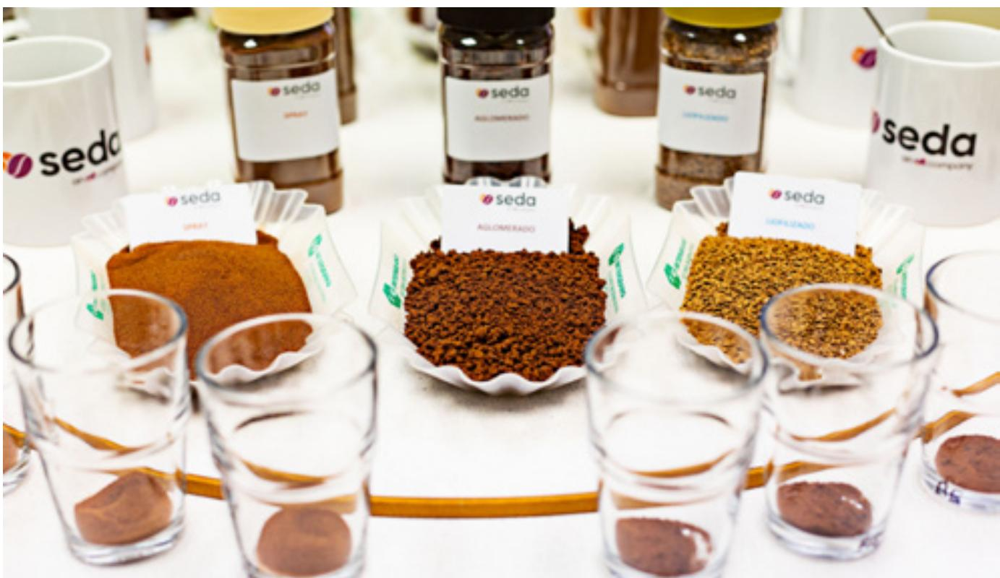  
Soluble coffee samples at the SEDA Outspan facility, Spain

Natural Capital Cost from processing (US$/tonne)  
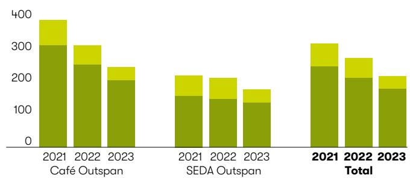  
Water use Natural Capital Cost  
GHG Natural Capital Cost

# GHG emissions

The soluble coffee facilities demonstrated positive performance by reducing annual emissions while increasing annual processed volume. By transitioning to renewable energy sources and implementing more energy-efficient processes, the environmental impact significantly decreased. Between 2021 and 2023, the processed volume increased by  $6\%$ , yet emissions decreased by  $23\%$ . The Vietnam facility reduced its energy and emissions footprint by transitioning from coal to biomass for steam, diesel to compressed natural gas for roasting, and optimising electricity usage in cooling and ventilation. High electricity prices in Spain led to a decrease in freeze-dried coffee processing, an energy-intensive activity, which consequently reduced the facility's energy intensity.

In the overall energy mix, which includes both renewable and non-renewable energy sources, the Share of Renewable Energy (SORE) rose from  $44\%$  in 2021 to  $55\%$  in 2023. The Vietnam and Spain facilities have set SORE targets of  $59\%$  and  $48\%$  for 2025, respectively.

Consequently, the emissions intensity  $(\mathrm{tCO}_{2}\mathrm{e}$  per tonne) reduced by  $28\%$ , from 2.79 in 2021 to 2.02 in 2023. This improvement has also led to a  $28\%$  decrease in associated Natural Capital Costs (US$ per tonne of soluble coffee), falling from US$251 to US$182.

The progress supports ofi's 2030 target to reduce Scope 1 and 2 GHG emissions by  $50\%$  against a 2020 baseline, as set out in its coffee sustainability strategy, Coffee LENS and overarching Choices for Change sustainability strategy.

# Water use

ofi is making significant progress in water stewardship at its facilities. The Natural Capital Cost (US$ per tonne of soluble coffee) associated with net water consumption decreased by 43%, from US$73 in 2021 to US$42 in 2023. This improvement is due to a two-pronged approach: reducing overall gross water consumption intensity (m³ per tonne of soluble coffee) by 26% and increasing the proportion of wastewater discharged and treated to 71%² in 2023 from 62% in 2021 across the facilities.

The facility in Vietnam achieved a  $41\%$  reduction in gross water consumption intensity and achieved a reduction in water consumption by adding the Interstage Stripping Mode (ISS) into the extraction process. Meanwhile, the facility in Spain increased the proportion of wastewater discharged and treated, reaching  $82\%$  in 2023, and incorporated smaller actions like reverse osmosis recovery optimisation and evaporative condenser renewal. Wastewater is initially treated at each facility and then transferred to third-parties for advanced treatment, ensuring it meets required quality and compliance levels.

The shadow price $^3$  of water  $(\mathsf{US}\mathbb{S} / \mathsf{m}^3)$  remained relatively consistent over the three years at both locations, $^4$  a result of flat actual water tariffs and baseline water stress.

Disclaimer: Olam's Natural and Social Capital accounting analyses are not related to financial results or financial reporting. The analyses and insights are specific to the selected operations and are based on economic estimates of non-monetary goods and services; they should not be used outside the context of Olam's analyses. All methodologies are based on well-established databases and frameworks. However, as they depend on third-party expert studies, all values are indicative estimations provided to inform decisions in relation to the management of Natural and Social Capital impacts. Results from the Natural and Social Capital Valuation analyses may be readjusted according to further methodological refinements.

1. This is the blended/weighted average emissions intensity across the two facilities  
2. These are blended/weighted average figures across the two facilities  
3. We have made a historical update to our facility shadow prices due to a methodological refinement  
4. Water Shadow Prices: Vietnam (2021: US$3.30, 2022: US$3.29, 2023: US$3.28), Spain (2021: US$4.06, 2022: US$4.04, 2023: US$3.98)

# General information

This information is intended to help readers understand the basis of our financial reporting and analysis contained in this Annual Report 2024.

For financial reporting purposes, the structure and segmentation of Olam Group's operating groups and businesses are as follows:

<table><tr><td>Operating groups</td><td>Businesses</td><td>Reporting segments</td><td>Key performance metrics</td></tr><tr><td>ofi</td><td>Cocoa, coffee, dairy, nuts, spices</td><td>Global Sourcing 
Ingredients &amp; Solutions</td><td>Segment-level Volume, Revenue, EBIT, Adjusted EBIT, EBIT per MT, Invested Capital (IC), EBIT/IC</td></tr><tr><td>Olam Agri</td><td>Grains and oilseeds, freight, edible oils, integrated feed and proteins, rice, specialty grains and seeds, cotton, wood products, rubber, risk management services</td><td>Food &amp; Feed – Origination &amp; Merchandising 
Food &amp; Feed – Processing &amp; Value-Added 
Fibre, Agri-industrials &amp; Ag Services</td><td>Segment-level Volume, Revenue, EBIT, EBIT per MT, Invested Capital (IC), EBIT/IC</td></tr><tr><td>Remaining Olam Group</td><td>Olam Global Holdco (De-prioritised assets, continuing businesses and gestating assets, including Ruskolco, Olam Palm Gabon, Packaged Foods, ARISE P&amp;L), Mindsprint and Nupo Ventures</td><td>De-prioritised/Exiting Assets 
Continuing/Gestating Businesses (including Mindsprint) 
Incubating Businesses (Nupo Ventures)</td><td>Segment-level Volume, Revenue, EBIT, Invested Capital (IC), EBIT/IC</td></tr><tr><td>Consolidated Olam Group</td><td></td><td></td><td>Volume, Revenue, EBIT, Invested Capital (IC), EBIT/IC, ROIC, ROE, FCF from Operations</td></tr></table>

# Definitions of key financial metrics

Sales Volume: Sale of goods in metric tonne (MT) equivalent. There are no associated volumes for freight, Risk Management Solutions and Mindsprint.

Revenue: Sale of goods and services Income: Includes sale of scrap materials, commissions and claims income and fair value gain on investments held for trading. Negative goodwill, gain on sale of assets and other non-recurring, exceptional items which are part of Other Income in the audited consolidated financial statements, are classified as Exceptional Items.

Cost of Sales: Cost of goods sold, shipping and logistics, commissions and claims expenses and the net measurement of derivative assets.

Selling, General and Administrative Expenses: Employee benefit costs, manufacturing overheads, travel expenses and other direct expenses.

Other Operating Expenses: Unrealised foreign exchange gain/loss and other expenses.

Net changes in fair value of biological assets: Records changes in the fair value of agricultural produce growing on bearer plants and livestock.

Exceptional Items: One-off, non-recurring items, including negative goodwill and related transaction costs, gain/loss on sale of assets/business, gain/loss on buyback of bonds, impairment loss, finance charges on pre-payment of loans and non-recurring business restructuring expenses. Tax expenses associated with these items are also presented as Exceptional Items.

EBITDA: Earnings Before Interest, Tax, Depreciation and Amortisation (EBITDA), and excludes Exceptional Items.

EBIT: Earnings Before Interest and Tax, and excludes Exceptional Items.

Adjusted EBIT: Earnings Before Interest and Tax, excludes Exceptional Items, and adjusted for amortisation of acquired intangibles.

PAT: Net profit after tax.

PATMI: PAT less minority interest.

Operational PATMI: PATMI excluding Exceptional Items.

Total Assets: Except in the financial and performance highlights where total assets comprise non-current assets and current assets in the balance sheet, Total Assets are net of trade payables and accruals, derivative financial instruments (current liabilities), provision for taxation, other current liabilities and non-current liabilities, and deferred tax liabilities.

Invested Capital (IC): Excludes cash and bank balances, deferred tax assets/liabilities, provision for tax, fixed deposits and other current/non-current assets.

EBIT/IC: EBIT on average invested capital based on beginning and end-of-period invested capital.

Return on Equity: Excludes impact of capital securities distribution on net income and capital securities on equity.

Operational Return on Equity: Excludes exceptional items and impact of capital securities distribution on net income, and capital securities on equity.

Operational Earnings Per Share: Earnings excluding exceptional items per ordinary share.

Net Gearing: Ratio of Net Debt (gross debt less cash) to Equity (before fair value adjustment reserves).

Net Gearing (adjusted): Net gearing adjusted for readily marketable inventories that are liquid, hedged and/or sold forward, operating as near-cash assets on the balance sheet, and secured receivables are supported by letters of credit or documents through banks.

Interest Coverage: Profit Before Tax plus gross finance costs divided by gross finance costs.

Free Cash Flow to Firm (FCFF): Operating cash flow less changes in working capital, cash taxes, capital expenditures, investments and divestments.

Free Cash Flow to Equity (FCFE): FCFF less net interest paid.

ROIC: Return (net operating profit after tax) on invested capital.

Note: Due to rounding, the numbers and percentages presented throughout the Strategic Report may not add up precisely to the totals and percentages provided in the Financial Report.

Disclaimer: Certain sections of our 2024 Annual Report have been audited. The sections that have been audited are set out in the Independent Auditor's report (pages 211 to 214), and include pages 215 to 286 of the Financial report. Readers should note that legislation in Singapore governing the preparation and dissemination of financial statements may differ from legislation in other jurisdictions. Except where you are a shareholder, this material is provided for information only and is not intended to confer any legal rights on you. This Annual Report does not constitute an invitation to invest in the Company's shares. Any decision you make relying on this information is solely your responsibility. The information given is as of the dates specified, is not updated and any forward-looking statement is made subject to the reservation specified in the following paragraph.

# Cautionary statement

This Annual Report may contain forward-looking statements. Words such as 'expect', 'anticipate', 'intend' or the negative use of these terms and other similar expressions of future performance or results and their negatives are intended to identify such forward-looking statements. These forward-looking statements are based upon current expectations and assumptions regarding anticipated developments and other factors affecting the Group. They are not historical facts, nor are they guarantees of future performance.

Because these forward-looking statements involve risks and uncertainties, there are important factors that could cause actual reports to differ materially from those expressed or implied by these forward-looking statements, including among others, competitive pricing and activity, demand levels for the products that we supply, cost variances, the ability to maintain and manage key supplier and customer relationships, supply chain sources, currency values, interest rates, the ability to integrate acquisitions and complete planned divestitures, physical risks, environmental risks, the ability to manage regulatory, tax and legal matters and resolve pending matters within current estimates, legislative, fiscal and regulatory developments, political, economic and social conditions in the geographic markets where the Group operates and new or changed priorities of the Company's or its subsidiaries' Boards.

These forward-looking statements speak only as of the date of this Annual Report. Except as required by any applicable law or regulation, the Group expressly disclaims any obligation or undertaking to release publicly any updates or revision to any forward-looking statements contained herein to reflect any change in the Group's expectations with regard thereto or any change in events, conditions or circumstances on which any such statement is based.

# Governance report

166 Governance at a Glance  
168 Meet the Board  
173 Purposeful Governance  
182 Nomination and Remuneration Committee report  
187 Audit and Risk Committee report  
197 Sustainability Committee report  
200 Managing stakeholder relationships

# Governance at a Glance

The Group complies with the Principles of Singapore's 2018 Code of Corporate Governance (the "Code") by purposefully applying the Provisions of the Code across the Group's governance framework.

It is the role of the Board of Directors, along with members of the management team, to ensure that the Group complies with the Code and that, as a result, the business continues to be governed purposefully for the benefit of all its stakeholders. The Directors fulfil this role both via their work on the Board itself and through the various Board Committees on which they sit. As the graphic below shows, the Group currently has three standing Board Committees, all of which sit below the Board.

The below graphic details the various Board Committees of the Group:

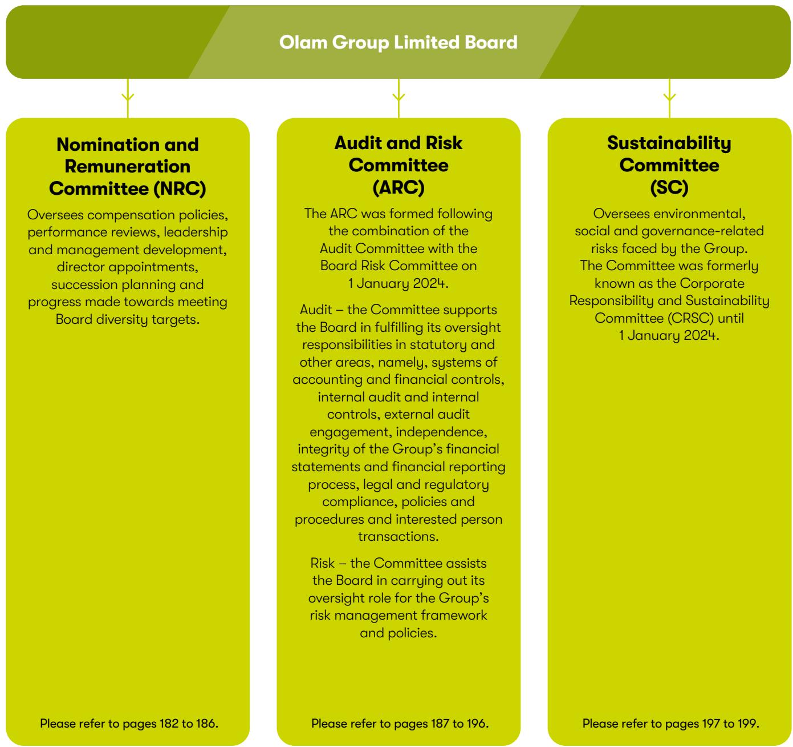

# Our Board

Board Committee Membership  

<table><tr><td>Board</td><td>Membership</td><td colspan="2">Tenure1</td></tr><tr><td>Lim Ah Doo</td><td>Chairman</td><td colspan="2">8 years</td></tr><tr><td>B N</td><td>Independent Non-executive</td><td></td><td></td></tr><tr><td>Sunny George Verghese</td><td>Executive</td><td colspan="2">28 years</td></tr><tr><td>S</td><td>Co-Founder and Group CEO</td><td></td><td></td></tr><tr><td>Yap Chee Keong</td><td>Independent Non-executive</td><td colspan="2">9 years and 3 months</td></tr><tr><td>A B N</td><td></td><td></td><td></td></tr><tr><td>Marie Elaine Teo</td><td>Independent Non-executive</td><td colspan="2">9 years and 3 months</td></tr><tr><td>A S</td><td></td><td></td><td></td></tr><tr><td>Shuji Kobayashi</td><td>Non-executive</td><td colspan="2">2 years</td></tr><tr><td>A N</td><td></td><td></td><td></td></tr><tr><td>Joerg Wolfgang Wolle (Dr)</td><td>Independent Non-executive</td><td colspan="2">5 years</td></tr><tr><td>N</td><td></td><td></td><td></td></tr><tr><td>Ajai Puri (Dr)</td><td>Independent Non-executive</td><td colspan="2">5 years</td></tr><tr><td>A S</td><td></td><td></td><td></td></tr><tr><td>Nagi Adel Hamiyeh</td><td>Non-executive</td><td colspan="2">5 years</td></tr><tr><td>Yuji Tsushima</td><td>Non-executive</td><td colspan="2">1 year</td></tr><tr><td>S</td><td></td><td></td><td></td></tr><tr><td>Tran Phuoc (Lucas)</td><td>Independent Non-executive</td><td colspan="2">7 months</td></tr><tr><td>A</td><td></td><td></td><td></td></tr></table>

1. Since Olam International Limited prior to the Scheme of Arrangement up to 31 December 2024  
Committee Chairman

A Audit and Risk Committee B Board Strategy Execution Committee N Nomination and Remuneration Committee S Sustainability Committee

# Board changes during 2024 and up to 18 March 2025

During the year under review and up to 18 March 2025, the Board and Board Committees have undergone changes as listed below:

- The Board Steering Committee was dissolved on 4 March 2024.  
- Dr Ajai Puri assumed chairmanship of the Sustainability Committee at the conclusion of 2024 AGM on 25 April 2024.  
- The Board Strategy Execution Committee was established on 6 September 2024.  
- Mr Tran Phuoc (Lucas) was appointed as a Non-executive and Independent Director of the Company and as a member of the Audit and Risk Committee with effect from 16 September 2024.

# Changes to be implemented at the conclusion of the annual general meeting to be held in 2025

- The appointment of Mr Yap Chee Keong, if re-elected, as non-executive and non-independent Deputy Chairman of the Board.  
- The separation of the Audit and Risk Committee into two Board Committees, namely, the Audit Committee and the Risk Committee.  
- The appointment of Mr Yap Chee Keong as Chairman of the Risk Committee, and the appointment of Mr Tran Phuoc (Lucas), Dr Ajai Puri and Mr Shuju Kobayashi as members of the Risk Committee.  
- The assumption as Chairman of the Audit Committee by Mr Tran Phuoc (Lucas).

# Meet the Board

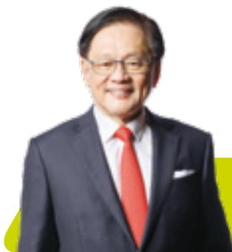  
Lim Ah Doo (75)

# B N

# Chairman, Non-executive and Independent Director

Date of Appointment as Chairman:

15 March 2022

Date of last re-election:

25 April 2024

Academic and Professional Qualification(s):

- Degree (Honours) in Engineering, Queen Mary College, University of London, UK  
- Master in Business Administration, Cranfield School of Management, UK  
Current Directorships of Other Listed Companies:  
GDS Holdings Ltd (Director)  
Principal Commitments:  
U Mobile Sdn Bhd (Director)  
DayOne Data Center Limited (Co-Chairman and Director)  
Other Principal Commitments Including Directorships for the Last 5 years (Past):  
- Commissioner to the High-Level Commission on Carbon Pricing and Competitiveness by World Bank Group  
Virtus HoldCo Limited  
- STT Global Data Center Private Limited  
Singapore Technologies Telemedia Pte. Ltd.  
STT Communications Ltd.  
- STT Global Data Centres India Private Limited  
- Olam International Limited  
GP Industries Limited  
Singapore Technologies Engineering Limited

# Experience and Exposure:

Mr Lim Ah Doo has over 40 years of broad and in-depth experience in the banking and corporate sectors. In banking, his past working experience includes an 18-year career at Morgan Grenfell (1977 to 1995), during which he held several key positions, including that of Chairman of Morgan Grenfell (Asia) Limited, and led several landmark transactions. In the corporate sector, he held the top executive position at a leading global resource-based group, and has been director of several large-sized public and private companies in and outside of Singapore. Mr Lim was previously the President and subsequently the Non-executive Vice Chairman of RGE Pte. Ltd. (formerly known as RGM International Pte Ltd). Mr Lim chaired the Capital and Investment Committee of Olam Group Limited until 1 January 2024.

Mr Lim was a director and Chairman of Olam International Limited since 2016 prior to the Scheme of Arrangement that was completed on 15 March 2022 with Olam Group Limited taking over the listing entity status on SGX-ST from Olam International Limited as part of the Group's re-organisation.

He is currently the Co-Chair of DayOne Data Center Limited, a director with the listed entity GDS Holdings Ltd and a Director of U Mobile Sdn. Bhd.

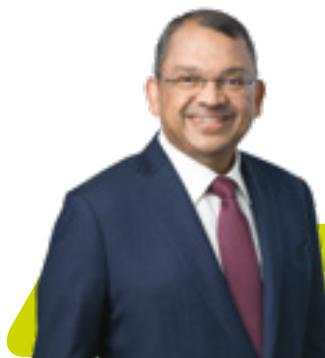  
Sunny George  
Verghese  
(65)

# s

# Executive Director, Co-Founder and Group CEO

Date of Appointment as Director: 26 August 2021

Date of last re-election:

25 April 2023

Academic and Professional Qualification(s):

Postgraduate Degree in Business Management, Indian Institute of Management, Ahmedabad, India  
- Advanced Management Program, Harvard Business School, USA

Current Directorships of Other Listed Companies: Nil

Principal Commitments:

- Champions 12.3 (Co-Chair)  
- The Business Commission to tackle Inequality (BCTI) (Co-Chair)  
Policy Advisory Council for the Australian Centre for International Agricultural Research (ACIAR) (Member)  
Climate Impact Exchange (CIX) (Observer, CIX International Advisory Council)  
- SMI Agribusiness task force (Member)  
- World Business Council for Sustainable Development (WBCSD)'s Imperatives Advisory Board (Co-Chair)  
JOil (S) Pte. Ltd. (Chairman)  
- Carbon Solutions Holdings Pte. Ltd. (Chairman & Non-Executive Director)  
- Carbon Solutions Platform Pte. Ltd. (Chairman & Non-Executive Director)  
- Carbon Solutions Services Pte. Ltd. (Chairman & Non-Executive Director)  
- Carbon Solutions Investments Pte. Ltd. (Chairman & Non-Executive Director)
- ofi Group Limited (Director)  
- Olam Agri Holdings Limited (Director)  
- Olam Global Agri Pte. Ltd. (Director)  
Caraway Pte. Ltd. (Director)

Other Principal Commitments including Directorships for the last 5 years (Past):

Chairman of World Business Council for Sustainable Development (WBCSD)  
- Member of Emerging Stronger Task Force (EST), Government of Singapore  
Human Capital Leadership Institute Pte Ltd (Chairman)  
- Olam International Limited (Director)

# Experience and Exposure:

Mr Sunny George Verghese co-founded Olam after he was mandated by Kewalram Chanrai Group (KC Group) to build an agricultural products business for the KC Group – Mr Verghese started his career with Unilever in India before joining the KC Group in 1989. He has also previously been Chair of CitySpring Infrastructure Management Pte. Ltd, a listed Business Trust in Singapore and was also a Commissioner of the Business & Sustainable Development Commission (BSDC). Mr Verghese has previously held the role of Chairman of International Enterprise Singapore and served on the Board of Trustees of the National University of Singapore.

Mr Verghese has won several awards including 'Outstanding Chief Executive' at the Singapore Business Awards in 2007, 'Ernst & Young Entrepreneur of the Year' for Singapore in 2008 and 'Best CEO of the Year 2011' at the Singapore Corporate Awards. He was awarded the Public Service Medal by the Government of the Republic of Singapore in 2010.

Mr Verghese was a director of Olam International Limited prior to the Scheme of Arrangement that was completed on 15 March 2022 with Olam Group Limited taking over the listing entity status on SGX-ST from Olam International Limited as part of the Group's re-organisation.

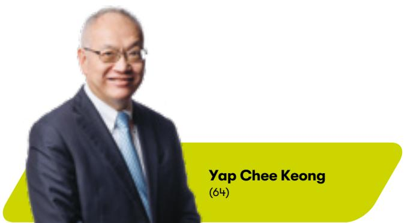

# A B

# Non-executive and Independent Director

Date of Appointment as Director: 15 March 2022

Date of last re-election: 25 April 2023

Date of next re-election: 25 April 2025

Academic and Professional Qualification(s):

- Bachelor of Accountancy, National University of Singapore  
- Fellow, Institute of Singapore Chartered Accountants and Certified Public Accounts, Australia  
Fellow, Singapore Institute of Directors

Current Directorships of Other Listed Companies:

- Seatrium Limited (formerly known as Sembcorp Marine Ltd) (Deputy Chair)  
- Sembcorp Industries Ltd (Director)  
Shangri-La Asia Limited (Director)

Principal Commitments:

Singapore Life Holdings Pte. Ltd. (formerly known as Aviva Singlife Holdings Pte. Ltd.) (Director)  
Professional Investment Advisory Services Pte Ltd (Chairman)  
- Ensign Infosecurity Pte Ltd (Director)  
PIL Pte. Ltd. (Director)  
The Assembly of Christians of Singapore Ltd (Director)

Other Principal Commitments including Directorships for the last 5 years (Past): Maxeon Solar Technologies Ltd  
- Olam International Limited  
Bayberry Limited  
MediaCorp Pte Ltd

# Experience and Exposure:

Over the course of his career, Mr Yap Chee Keong has held a number of high-level management positions, including Executive Director of The Straits Trading Company Limited and Chief Financial Officer of Singapore Power Limited. Mr Yap has also held various senior roles at a number of multinational and listed companies. He has previously been a board member of the Accounting and Corporate Regulatory Authority, a member of the Public Accountants Oversight Committee, part of the MAS/SGX/ACRA Work Group that reviewed the Guidebook for Audit Committees in Singapore, and also the MAS/SGX/ACRA/SID Review Panel that developed a Guide for Board Risk Committees in Singapore.

Mr Yap was a director of Olam International Limited prior to the Scheme of Arrangement that was completed on 15 March 2022 with Olam Group Limited taking over the listing entity status on SGX-ST from Olam International Limited as part of the Group's re-organisation.

# A S

# Non-executive and Independent Director

Date of Appointment as Director:

15 March 2022

Date of last re-election:

25 April 2023

Academic and Professional Qualification(s):

- Bachelor of Arts (Honours) in Experimental Psychology, Oxford University, UK  
MBA, INSEAD

Current Directorships of Other Listed Companies:

Nil

Principal Commitments:

ICHX Tech Pte. Ltd. (Director)  
Mapletree Investments Pte. Ltd. (Director)  
Tantallon Capital Advisors (Senior Advisor)  
The TENG Company Ltd. (Chairman)  
Capital International Fund (Director)  
Tsao Foundation (Director)  
- Duke-NUS Medical School (Governing Board Member)

Other Principal Commitments including Directorships for the last 5 years (Past):

- Olam International Limited  
Mapletree Oakwood Holdings Pte. Ltd.  
G.K. Goh Holdings Limited  
- Monde Nissin Corporation (Director)

Experience and Exposure:

Ms Marie Elaine Teo brings her extensive investment experience across a broad range of industries and markets to bear in assessing opportunities and challenges in the future. She has over 20 years of investment experience, primarily with Capital Group companies where she focused on Asian banks and global emerging markets, both as an analyst and as an investment manager. Ms Teo was formerly the Chairman of Capital International Research, Inc. and Managing Director of Capital International Inc., Asia. Prior to the merger of the Board Risk Committee with the Audit Committee to form the Audit and Risk Committee, Ms Teo chaired the Board Risk Committee

Ms Teo was also a director of Olam International Limited prior to the Scheme of Arrangement that was completed on 15 March 2022 with Olam Group Limited taking over the listing entity status on SGX-ST from Olam International Limited as part of the Group's re-organisation.

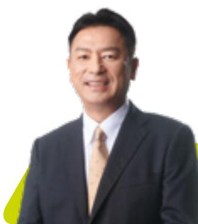  
Shuji Kobayashi (56)

# A N

# Non-executive Director

Date of Appointment as Director:

5 May 2023

Date of last re-election:

25 April 2024

Date of next re-election:

25 April 2025

Academic and Professional Qualification(s):

- Bachelor of Economics, West Virginia University, Morgantown, USA  
- Advanced Management Program, Wharton Business School, University of Pennsylvania, Philadelphia, USA

Current Directorships of Other Listed Companies:  
- Itoham Yonekyu Holdings, Inc. (Director)

Principal Commitments:

- Mitsubishi Corporation (Senior Vice President, General Manager, Food Industry Group CEO Office)

Other Principal Commitments including Directorships for the last 5 years (Past): Mitsubishi Corporation Life Sciences Limited

MC Agri Alliance Ltd.  
- Nosal Corporation

MC Life Sciences Holdings Limited

Experience and Exposure:

Mr Shuji Kobayashi is currently the Senior Vice President of Mitsubishi Corporation (MC), a conglomerate listed on the Tokyo Stock Exchange. Mr Kobayashi has over 20 years' experience in the Food & Agriculture industry during which he has held managerial roles globally, including the USA, Brazil, Australia, Indonesia, China, Singapore, and Japan. In his current role, Mr Kobayashi is the Head of Food Industry Group CEO Office and oversees the strategy and key investments of the Food Industry portfolio, which includes Livestock, Meat & Dairy Products, Global Fast Moving Consumer Goods, Food Resources, Produce & Marine Products and Food Sciences.

Prior to his current role, Mr Kobayashi was the Division Chief Operating Officer (COO), Food Resources Division, overseeing MC's global food ingredients origination and merchandising operations, including corn, wheat, soybean, cocoa and coffee, and the manufacturing of products, such as animal feed, wheat flour and sugar. During his executive management career at MC, Mr Kobayashi previously served in the Corporate Strategy & Planning Department. Prior to the merger of the Board Risk Committee with the Audit Committee to form the Audit and Risk Committee, Mr Kobayashi was a member of both the Board Risk Committee and the Audit Committee. Mr Kobayashi was also formerly a member of the Capital and Investment Committee before it was dissolved on 1 January 2024.

  
Joerg Wolfgang Wolle (Dr)  
(67)

# N

# Non-executive and Independent Director

Date of Appointment as Director:

15 March 2022

Date of last re-election:

25 April 2024

Academic and Professional Qualification(s):

- PhD in Engineering "summa cum laude", Technical University Chemnitz, Germany  
Executive Development Program, IMD Lausanne, Switzerland  
Stanford Executive Program, GSB Stanford University, Palo Alto, CA, USA

Current Directorships of Other Listed Companies:

Kuehne + Nagel International Ltd. (Chair)  
Klingelnberg AG (Chair)

Principal Commitments:

Kuehne Holding Ltd. (Director)  
Kuehne Foundation (Member, Board of Trustees)  
Other Principal Commitments including Directorships for the last 5 years (Past):  
- Olam International Limited

Experience and Exposure:

Appointed CEO of Siber Hegner Ltd. in 2000, Dr Joerg Wolle was instrumental in the 130-year-old Asian-focused trading company's rapid turnaround. He led the transformation of the company into the leading business services and distribution group in the ASEAN region with more than 33,000 specialised staff following its merger with two other Swiss-based Asia-focused distribution companies. During his tenure as CEO, sales and profits grew three- and six-fold respectively and the company was listed on the Zurich Stock Exchange. Between 2002 and 2017, he was President and CEO of DKSH Holding Ltd., becoming its chairman in 2017, a position he held until 2019. Dr Wolle was a member of the Supervisory Board of Louis Dreyfus Company B.V. (2014 to 2018) and a member of the Board of Directors of UBS Ltd (2006 to 2009) and Diethelm Keller Holding Ltd. (2004 to 2019). Dr Wolle is currently Chairman of Kuehne + Nagel International Ltd and Klingelnberg AG.

Dr Wolle was a director of Olam International Limited prior to the Scheme of Arrangement that was completed on 15 March 2022 with Olam Group Limited taking over the listing entity status on SGX-ST from Olam International Limited as part of the Group's re-organisation.

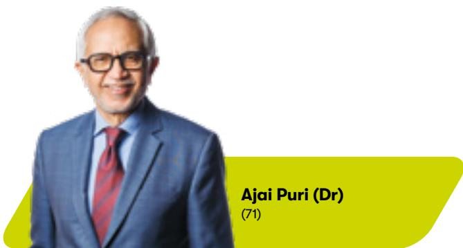

# Non-executive and Independent Director

Date of Appointment as Director: 15 March 2022

Date of last re-election: 25 April 2024

Academic and Professional Qualification(s):

MBA, Crummer Business School, Rollins College, USA  
- PhD (Food Science), University of Maryland, USA  
Current Directorships of Other Listed Companies:  
- Fresh Del Monte Produce Inc. (Director)
- IMI PLC (Director)

Principal Commitments:

- California Farms LP (Director)

Other Principal Commitments including Directorships for the last 5 years (Past):

- Olam International Limited  
Firmenich SA  
Tate and Lyle PLC  
Global Alliance for Improved Nutrition (G.A.I.N.)  
- Britannia Industries Ltd.

# Experience and Exposure:

Dr Ajai Puri brings more than three decades of global food and agriculture industry experience. His wide-ranging expertise spans the fields of innovation, science and technology, supply chain development, product integrity and consumer marketing. From 1981 to 2003, Dr Puri worked at Minute Maid (part of The Coca-Cola Company) where he held a variety of roles in areas such as research and development, marketing and general management. On leaving Coca-Cola in 2003, he held the position of Senior Vice President - Science and Technology for the company's juice business in North America. Between 2003 and 2007, Dr Puri was Executive Board Member and President - Research, Development and Product Integrity at Amsterdam-based Royal Numico N.V., a specialist nutrition company. He has previously held a number of non-executive roles at firms including Firmenich SA (2014-2023), Tate & Lyle PLC (2012-2021), Nutreco NV (2009-2015), Barry Callebaut AG (2011-2014) and Britannia Industries Ltd (2009-2024). Dr Puri is currently a Non-executive Director at Fresh Del Monte Produce Inc., IMI PLC, and privately held California Farms LP. Dr Puri was formerly a member of the Capital and Investment Committee before it was dissolved on 1 January 2024.

Dr Puri was a director of Olam International Limited prior to the Scheme of Arrangement that was completed on 15 March 2022 with Olam Group Limited taking over the listing entity status on SGX-ST from Olam International Limited as part of the Group's re-organisation.

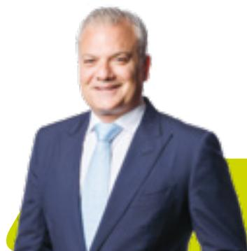  
Nagi Adel Hamiyeh (56)

# Non-executive Director

Date of Appointment as Director: 15 March 2022

Date of last re-election: 25 April 2022

Date of next re-election: 25 April 2025

Academic and Professional Qualification(s):

- Master of Science degree in Civil and Environmental Engineering, Massachusetts Institute of Technology, USA  
- Bachelor of Science in Civil Engineering, University of Texas, USA

Current Directorships of Other Listed Companies:

- Seatrium Limited (Director)  
- Sembcorp Industries Limited (Director)

Principal Commitments:

- Temasek International (Head, Europe, Middle East and Africa)  
- ofi Group Limited (Director)  
EM TOPCO Limited (Director)

Other Principal Commitments including Directorships for the last 5 years (Past): Olam International Limited

Aquarius Healthcare Investments Pte. Ltd.  
- Canopus Healthcare Investments Pte. Ltd.  
Carinus Healthcare Investments Pte. Ltd.  
- Gallienus Healthcare Investments Pte. Ltd.  
- Imperius Healthcare Investments Pte. Ltd.  
Lebanese International Finance Executives  
- Polaris Healthcare Investments Pte. Ltd.  
Sheares Healthcare China Holdings Pte. Ltd.  
Sheares Healthcare Group Pte. Ltd.  
Sheares Healthcare Holdings Pte. Ltd.  
Sheares Healthcare International Holdings Pte. Ltd.  
Sheares Healthcare Management Pte. Ltd.  
- Sigma Healthcare Management Pte. Ltd.  
Sirius Healthcare Investments Pte. Ltd.  
Tana Africa Capital Limited  
Tana Africa Investment Managers Limited  
- Valerius Healthcare Investments Pte. Ltd.  
- CapitaLand Group Pte. Ltd.  
CLA Real Estate Holdings Pte. Ltd.  
- Starttree Investments Pte Ltd  
- Olam Agri Holdings Limited  
Dream International BV  
Kyanite Investment Holdings Pte. Ltd.  
Kyanite Investment Holdings (I) Pte. Ltd.

# Experience and Exposure:

Mr Nagi Hamiyeh brings 31 years of experience in strategy, corporate finance, mergers and acquisitions (M&A), growth equity, private equity and public investing in multiple industries across the globe. During his career, he has worked closely with companies undergoing consolidation or restructuring processes, as well as with portfolio companies on value uplift opportunities. He has also led the development of various greenfield platforms by way of M&A and organic growth.

Mr Hamiyeh was formerly Head of Portfolio Development Group at Temasek. He is currently Head of Investment in Europe, Middle East and Africa. Mr Hamiyeh joined Temasek in 2005 and over the course of his career has led the firm's Natural Resources, Industrials, Consumer and Real Estate Investment Teams. He has also been Temasek's Joint Head of Investment Group, Joint Head of Enterprise Development Group and Head of Africa and Middle East, Australia, and New Zealand.

Mr Hamiyeh was formerly a member of the Capital and Investment Committee before it was dissolved on 1 January 2024. He was also a director of Olam International Limited prior to the Scheme of Arrangement that was completed on 15 March 2022 with Olam Group Limited taking over the listing entity status on SGX-ST from Olam International Limited as part of the Group's re-organisation.

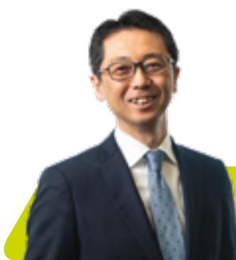  
Yuji Tsushima (55)

# s

# Non-executive Director

Date of Appointment as Director:

4 March 2024

Date of last re-election:

25 April 2024

Academic and Professional Qualification(s):

B.A. Economics, The University of Tokyo, Japan  
- Advanced Management Program, INSEAD Business School, Fontainebleau, France  
- General Management Program, Harvard Business School, Massachusetts, USA

Current Directorships of Other Listed Companies:

Nil

Principal Commitments:

- Mitsubishi Corporation (Division Chief Operating Officer, Food Resources Division)  
MC Agri Alliance Ltd. (Director)  
Premier Foods Holding Pte. Ltd.

Other Principal Commitments including Directorships for the last 5 years (Past):

- Kadoya Sesame Mills Incorporated  
Mitsubishi Corporation Life Sciences Limited  
Kewpie Malausia Sdn. Bhd.  
Nissin Foods (U.S.A.) Co., Inc.  
- YSW & Co., Ltd.  
Shandong Luling Fruit Juice Co., Ltd.  
Dan Kaffe (Malaysia) Sdn Bhd  
imperfect Inc.  
- Indo Nissin Foods Private Ltd.  
Nissin Foods (Thailand) Co., Ltd  
PT. Nissin Foods Indonesia  
PT. MC Living Essentials Index  
- Oriental Coffee Alliance Sdn. Bhd.  
PT. Kaneka Foods Indonesia  
Ipanema Agricola S.A.  
- Ipanema Comercial e Exportadora S.A.  
- PT. MCdelica Food Indonesia  
- Sesaco Corporation  
MC Food Holdings Asia Pte. Ltd.  
- Lluvia Limited  
Aventine Limited

# Experience and Exposure:

Mr Yuji Tsushima has over 30 years of experience in the global food and beverage industry. He is currently the Division Chief Operating Officer (COO), Food Resources Division of Mitsubishi Corporation (MC), a conglomerate listed on the Tokyo Stock Exchange. He joined MC in 1993 and has since held various managerial roles at MC in Tokyo as well as in its overseas offices, including the USA and Indonesia. In his current role as Division COO, Mr Tsushima oversees MC's various food and beverage interests from agri-products procurement, trading, processing to sales and marketing of consumer products.

  
Tran Phuoc (Lucas) (60)

# A

# Non-executive and Independent Director

Date of Appointment as Director:

16 September 2024

Date of next re-appointment:

25 April 2025

Academic and Professional Qualification(s):  
- Bachelor of Commerce, University of New South Wales, Australia  
- Member, Singapore Institute of Chartered Accountants  
Member, Singapore Institute of Directors

Current Directorships of Other Listed Companies:

- Singapura Finance Limited (Director)  
Kim Heng Ltd (Director)  
Natural Cool Holdings Limited (Director)

Principal Commitments:  
Seviora Holdings Pte. Ltd. (Director)  
Pick Network Pte. Ltd. (Director)  
- WLT Assurance LLP (Partner)

Other Principal Commitments including Directorships for the last 5 years (Past):

- RSM Chio Lim LLP  
KPMG LLP

# Experience and Exposure:

Mr Tran Phuoc (Lucas) is a partner in WLT Assurance LLP. He is currently independent director on various boards of private and listed companies. The listed companies include Singapura Finance Limited, Kim Heng Ltd and Natural Cool Holdings Limited, in which he is also the Chair of the Audit Committee. Mr Tran is a qualified chartered accountant with over 35 years of public accounting experience, not including his experience as a chief financial officer. He was a former partner of KPMG LLP, with extensive experience in auditing, advising on financial reporting requirements as well as regulatory compliance matters relating to the Companies Act and SGX-ST listing rules, IPO, restructuring exercises, due diligence and merger and acquisitions.

# Purposeful Governance

At Olam Group, our Purpose is to 'Re-imagine Global Agriculture and Food Systems' to help meet the needs of a growing global population and, at the same time, have a positive impact on farming communities, our planet and our stakeholders. To ensure the delivery of our Purpose, we have in place a robust corporate governance framework based on Singapore's 2018 Code of Corporate Governance (the "Code") and its 13 principles.

This Corporate Governance section of the Annual Report shows how we strive to comply with the Code and its principles and sets out how the Group's practices and processes relate to and satisfy the Code's provisions, or any other variation thereof. Where applicable, cross-references to other sections within the broader document are included as well as explanations of any actions taken by the Group to address any differences there may be between its practices and the Code.

The following sections detail how Olam satisfies Principles 1, 2 and 3 of the Code.

# Principle 1

The Company is headed by an effective Board which is collectively responsible and works with management for the long-term success of the Company.

# An Effective Board

A key role of the Board is to ensure the Group delivers for all stakeholders by providing strong leadership to the business and also by offering guidance and advice to the Senior Management Team. To enable the Board to achieve this and discharge its statutory and fiduciary duties effectively, both on an individual and a collective basis, its membership is comprised of individuals that have diverse backgrounds, experience and skillsets, and includes Directors that are deemed to be independent. During the year under review, independent Directors including the Chair continued to account for more than  $50\%$  of the Board's membership.

All Directors, both independent and non-independent, are expected to exercise independent and objective judgement for the benefit of the Group and its stakeholders. With this in mind, the capacity of Directors to discharge their fiduciary responsibilities and duties in the best interests of the Company at all times, their understanding of the business and its operations, and their ability to discuss issues objectively with one another, are all key criteria in annual Board, peer and Chair performance evaluation assessments.

# Key Functions of the Board Include:

- Providing entrepreneurial leadership, setting strategic objectives and ensuring that the Group has the financial and human resources to deliver on its objectives – as part of this, the Board regularly reviews the execution and implementation of the Group's Strategic Plans, including the ongoing Re-organisation;  
- Overseeing and reviewing the Group's operational and financial performance;  
- Overseeing the process and framework for evaluating the adequacy of internal controls, including financial, operational, compliance and information technology controls and risk management systems, and satisfying itself that these processes and frameworks are adequate and effective;  
- Monitoring the Group's compliance with any laws and regulations that are relevant to the business, including monitoring the Group's risk of becoming subject to, or violating, any Sanctions Law;  
Assuming responsibility for corporate governance;  
- Setting the Group's values and standards, and ensuring that obligations and responsibilities to all stakeholders are understood and met at all times;  
- Reviewing the compensation framework for, and performance of, the Group CEO, Senior Management and the Board;  
- Reviewing and overseeing Board renewals and the succession plans for the Group CEO and Senior Management;  
- Overseeing and considering corporate responsibility and sustainability issues, policies, standards and strategy in the context of the Company's activities which may have an impact on climate, environmental and social issues; and  
Identifying key stakeholder groups and considering their views and concerns.

# Material Matters

As part of its statutory and fiduciary duties, the Board is required to review and approve material matters. These include:

- The Group's review of strategic options to unlock value for the remaining Olam Group businesses and ofi;  
- The sale of Olam Agri to SALIC as a key and important step forward in the Group's Re-organisation Plan;  
- Any acquisitions, divestments and capital expenditure that exceed the authority limits established under an internal policy adopted by the Board – authority for transactions below those limits are delegated to Board Committees, the Executive Committee and Senior Management;  
- The half-year and full year unaudited results and announcements, and the full year audited financial statements;

# 9.2% EBIT growth

delivered by Olam Group in 2024

Over half of the OGL Board is

# independent

Remain focused on

# pursuing IPOs

Seeking strategic options to unlock value for the remaining Olam Group businesses and ofi, including the pursuit of an ofi IPO

# Amended Board diversity policy with revised target of

# 10-20%

of women on the Board

# Both ofi and Olam have a substantially established

# independent and

# diversified Board

Capital planning and raising, annual budgets, debt refinancing, debt limit and gearing;  
Key policy decision-making process and control;  
Changes to capital, dividend distribution, issuance and share buybacks and changes to shares and other securities;  
- Matters considered not in the ordinary course of the Group's business;  
Changes to the composition of the Board and Board Committees as recommended by the NRC; and  
- Any matter which the Board considers significant enough to require its direct attention or would be critical to the proper functioning of Olam or its business.

For those material matters that require shareholder approval, the Board may, if required under the Companies Act 1967 and/or the Listing Manual of the Singapore Exchange Securities Trading Limited (SGX-ST), appoint an independent valuer or independent financial adviser to evaluate the fairness of the transaction price and offer. The Board communicates any decision made on the material matters to the Board Committees and the Senior Management Team.

# Board Committees

During the year, the following Board Committees assisted the Board with the discharge of its statutory and fiduciary duties:

Audit and Risk Committee (ARC)  
- Board Strategy Execution Committee (BSEC)  
Nomination and Remuneration Committee (NRC)  
Sustainability Committee (SC)

Each Board Committee has clear written Terms of Reference. These set out each committee's role, authority, procedures and qualifications for membership. Each committee reviews its own Terms of Reference from time to time to ensure these reflect the evolving needs of the business, its operations and relevant laws and regulations.

A summary of Board Committee memberships with the names of the respective committee members, the Terms of Reference, delegation of the Board's authority to make decisions and overviews of each Board Committees' activities are provided in the various sections of this Annual Report.

From time to time, one or more sub-committees of the Board may be established to oversee specific projects. Board Committees may also be established on an ad hoc basis for specified periods to support management, provide leadership and to ensure the interests and views of the Company's various stakeholders are represented. During the year, the Board Strategy Execution Committee (BSEC) was established. Comprised of two members, the BSEC looks at specific issues relating to the execution of the Group's Re-organisation plans.

Also during the year, the Board Steering Committee (BSC), which was established in January 2020 to oversee the implementation of the Group's ongoing Re-organisation Plan and was comprised of Non-executive Directors, including the Board Chair, was dissolved and replaced by the BSEC.

# Board and Board Committee Meetings

The Board meets at least five times a year. Board and Board Committee meetings are scheduled at least a year in advance although additional meetings can also be scheduled as and when they are deemed necessary.

During the year, 11 Board and 20 Board Committee meetings were held. Meetings involving the Directors lasted between two and six hours. In addition to the time spent at meetings, the Directors set aside time to read, review, comment and raise queries on the materials provided ahead of each Board and Board Committee meeting. Directors are able to access and provide comments on Board and Board Committee meeting papers and other relevant materials securely via an online platform/electronic device. In accordance with the Constitution of the Company, provision is made for Board and Board Committee meetings to be held electronically if required. The Board, pursuant to the Company's Constitution, and the Board Committees under their respective Terms of Reference, may make decisions by way of written resolution by circulation.

A table showing the Directors' Committee memberships and the number of Board, Board Committee and shareholders' meetings held during the year, along with the attendance of Directors, is included in this report.

Information on Board and Board Committee membership and attendance at Board, Board Committees and shareholders' meetings for the year ended 31 December 2024  

<table><tr><td>Directors</td><td>Membership</td><td>Board</td><td>ARC</td><td>SC</td><td>NRC</td><td>BSEC8</td><td>AGM</td></tr><tr><td>No. of Meetings Held</td><td></td><td>11</td><td>5</td><td>4</td><td>2</td><td>9</td><td>1</td></tr><tr><td rowspan="2">Lim Ah Doo
B N</td><td>Chairman</td><td>11/11</td><td>-</td><td>-</td><td>2/2</td><td>7/9</td><td>1/1</td></tr><tr><td>Independent Non-executive</td><td></td><td></td><td></td><td></td><td></td><td></td></tr><tr><td>Sunny George Verghese
S</td><td>Executive</td><td>11/11</td><td>-</td><td>4/4</td><td>2/27</td><td>-</td><td>1/1</td></tr><tr><td>Marie Elaine Teo
A S</td><td>Independent Non-executive</td><td>10/11</td><td>5/5</td><td>4/4</td><td>-</td><td>-</td><td>1/1</td></tr><tr><td>Yap Chee Keong
A B</td><td>Independent Non-executive</td><td>11/11</td><td>5/5</td><td>-</td><td>2/2</td><td>9/9</td><td>1/1</td></tr><tr><td>Nagi Adel Hamiyeh</td><td>Non-executive</td><td>8/11</td><td>-</td><td>-</td><td>-</td><td>-</td><td>1/1</td></tr><tr><td>Ajai Puri (Dr)1
A S</td><td>Independent Non-executive</td><td>10/11</td><td>5/5</td><td>4/4</td><td>-</td><td>-</td><td>1/1</td></tr><tr><td>Joerg Wolfgang Wolle (Dr)
N</td><td>Independent Non-executive</td><td>7/11</td><td>-</td><td>-</td><td>2/2</td><td>-</td><td>1/1</td></tr><tr><td>Shuji Kobayashi2
A N</td><td>Non-executive</td><td>10/11</td><td>5/5</td><td>1/1</td><td>1/1</td><td>-</td><td>1/1</td></tr><tr><td>Yuji Tsushima3
S</td><td>Non-executive</td><td>8/8</td><td>-</td><td>3/3</td><td>-</td><td>-</td><td>1/1</td></tr><tr><td>Tran Phuoc (Lucas)4
A</td><td>Independent Non-executive</td><td>3/3</td><td>1/1</td><td>-</td><td>-</td><td>-</td><td>-</td></tr><tr><td>Chan Wai Ching5
N</td><td>Co-opted Member of the NRC</td><td>-</td><td>-</td><td>-</td><td>1/2</td><td>-</td><td>-</td></tr><tr><td>Nihal Vijaya Devadas
Kaviratne CBE1
S A</td><td>Independent Non-executive</td><td>4/4</td><td>2/2</td><td>1/1</td><td>-</td><td>-</td><td>1/1</td></tr><tr><td>Hideyuki Hori6
N</td><td>Non-executive</td><td>0/3</td><td>-</td><td>-</td><td>0/1</td><td>-</td><td>-</td></tr></table>

Notes:  
1. Mr Nihal Vijaya Devadas Kaviratne stepped down as a Non-executive and Independent Director of the Company and has relinquished his chairmanship on the SC and membership on the ARC at the conclusion of 2024 AGM on 25 April 2024. Dr Ajai Puri assumed chairmanship on the SC on even date.  
2. Mr Shuji Kobayashi assumed membership on the NRC and relinquished his membership on the SC with effect from 4 March 2024.  
3. Mr Yuji Tsushima was appointed on 4 March 2024 and assumed membership on the SC on even date.  
4. Mr Tran Phuoc (Lucas) was appointed on 16 September 2024 and assumed membership on the ARC on even date.  
5. Ms Chan Wai Ching is a co-opted member of the NRC. Ms Chan is not a Director of the Company.  
6. Mr Hideyuki Hori resigned as Non-executive Director of the Company and relinquished his membership on the NRC with effect from 4 March 2024.  
7. Invited to be present at all NRC meetings.  
8. The BSEC was established on 6 September 2024.

Outside of the regular schedule, the Board is kept up-to-date on developments and issues concerning the Group's business and activities via briefings from key executives and the Senior Management Team throughout the year. The Directors also spend a significant amount of time engaging and participating in Board affairs and governing the Company that cannot be quantified. For example, when reviewing business, global and industry developments and trends, the Directors will typically engage, both on an individual and a collective basis, with other Directors, key executives, such as the Group CEO and Group CFO, the Chair, CEO and CFO of each operating group, as well as other members of the Senior Management Team and external advisers and

consultants. Directors are also provided with updates on individual business units and functions within the Group to help further their understanding of the business and its activities.

External professional advisers – financial advisers, legal advisers and climate risk assessment analysts – are invited from time to time to attend and present at Board and Board Committee meetings to help Directors gain/deepen their understanding of subject matters and to enable them to exercise the right judgement in decision making, as well as, to maintain their understanding of the Group's business and operations.

Key Highlights of the Board's Activities In 2024  

<table><tr><td>Key topics discussed</td><td>Matters considered</td><td>Stakeholders considered</td></tr><tr><td>Re-Organisation</td><td>The Group remains committed to listing ofi and Olam Agri.</td><td>EmployeesCustomers Investors Suppliers</td></tr><tr><td>The Group&#x27;s Re-organisation Plan is focused on highlighting the inherent value embedded within the Group via the separation of the business into three operating groups - ofi, Olam Agri and Remaining Olam Group (OGL). The Re-organisation will also enable each of the three operating groups to develop their own long-term independent growth pathways.</td><td>During the year, the Board continued to review both internal and external factors, such as the business performance of all three operating groups, prevailing capital markets conditions, global macroeconomic developments as well as monitoring the relevant regulatory processes involved. The Board continued to review other strategic options for unlocking the underlying value of the business. In addition, the Board and Board Committees continued their oversight roles for both ofi and Olam Agri through the independent boards and committees of these operating groups. On 24 February 2025, the Board announced the proposed sale of our remaining 64.57% stake in Olam Agri to SALIC at a higher implied 100% equity valuation of US$4.0 billion.</td><td>Communities</td></tr><tr><td>Strategy</td><td>During Board meetings held over the course of the year under review, the Directors continued to monitor and discuss longer-term and strategic issues along with risks and opportunities faced both by the Group and the industry as a whole.</td><td>EmployeesCustomers Investors Suppliers</td></tr><tr><td>Diversity and Inclusion</td><td>The Company recognises that building a diverse and inclusive culture across all levels of the Group is key to securing continued success over the long term. This includes at Board level. A Board Diversity Policy was adopted by the Board in 2020 and revised in 2022 when specific targets for diversity were set. Gender diversity and associated targets include 25% women representation on the Board by 2025 and 30% by 2030. In 2024, it was recognised that, as meeting the targets would run in parallel with the execution of the Re-organisation Plan, this could impact the timing of when targets are met. Hence, the gender diversity targets were further refined to 10 to 20% of women on the Board.</td><td>Communities</td></tr></table>

<table><tr><td>Key topics discussed</td><td>Matters considered</td><td>Stakeholders considered</td><td></td></tr><tr><td>Sustainability</td><td>Central to the Group&#x27;s Strategic Plan is delivering for all stakeholders: customers, employees, suppliers, investors, as well as the communities and environment in which we operate.Sustainability is key to the execution of our Strategic Plan and relevant goals and milestones were regularly reviewed by the Board over the course of the year as part of its ongoing monitoring and oversight role.</td><td>EmployeesInvestorsCommunities</td><td>CustomersSuppliers</td></tr><tr><td>Succession Planning</td><td>To ensure the Board has the necessary skillsets, expertise and experience to provide leadership to the Group at all times, strategic succession planning is a key area of focus for the Board on an ongoing basis.The Board has been preparing for the retirement of one Non-executive Director in 2025 when her nine-year service limit is reached.Work carried out to date includes the identification and evaluation of candidates who have the necessary complementary skillsets and who at the same time can contribute towards the Group meeting its gender diversity targets.</td><td>EmployeesInvestorsCommunities</td><td>Customers</td></tr><tr><td>Geopolitical/Macroeconomic Backdrop</td><td>The Board regularly considered and discussed macroeconomic and geopolitical issues during the year with a focus on the implications these have for the Group and its operations. Among the issues considered were geopolitical conflicts, the outlook for global inflation and interest rates, as well as commodity prices.</td><td>EmployeesInvestorsCommunities</td><td>CustomersSuppliers</td></tr></table>

# Principle 2

The Board has an appropriate level of independence and diversity of thought and background in its composition to enable it to make decisions in the best interests of the Company.

# An Appropriate Level of Independence

Since 2013, the number of Executive Directors on the Board has been limited to two to ensure a greater proportion of independent representation – the Group CEO is currently the only Executive Director sitting on the Board. This is in recognition of how Non-executive Directors (NEDs) help safeguard the interests of all the Group's stakeholders: customers; employees; suppliers; shareholders; other capital providers; and the communities in which the Group operates. NEDs, including independent NEDs are able to provide unbiased and independent advice and judgement; playing an important role in corporate accountability.

The independence of each Director is reviewed by the NRC each year and is measured against both the Code's definition of an Independent Director and in terms of any relationships that may cause a Director to be deemed non-independent. The determination of the NRC's review takes into account the confirmation of independence that each Independent Director completes annually. The confirmation of independence requires each Independent Director to assess their independence robustly by examining the existence of any relationships or dealings that may compromise their independence.

As all Directors are expected to comply fully with the Company's Code of Conduct (CoC), they are required to disclose to the Board any personal interests that could inappropriately influence his or her judgement when acting on behalf of the Company. Directors are expected to disclose the details of any potential conflicts of interest to the Board at the earliest possible opportunity. Should the Director wish to engage or continue with an activity that represents a potential conflict of interest, explicit written approval may be required as stipulated by the Company's CoC.

A Director is considered to be independent if he/she has no familial or commercial relationship with the Group or its officers, its related corporations and substantial shareholders of the Company that could interfere, or be reasonably perceived to interfere, with the exercise of his or her independent business judgement in the best interests of the Company. Pursuant to Rule 210(d)(iv) of the SGX-ST Listing Manual, any Director who has served on the Board for more than nine years will no longer be considered independent.

Following the results of the latest NRC review, the Board has determined that, with the exception of the two Independent NEDs who have served on the Board for more than nine years, the three Non-executive Directors and the Executive Director, the remaining four Directors are to be considered independent.

# Diversity of Thought and Background

The Group seeks to have a Board that is optimal in terms of size, composition and diversity. Having a diversified Board in terms of experience and skillsets helps generate robust and constructive discussions, both inside and outside of Board meetings, on matters of corporate policy, strategy and performance, as well as on geopolitical and macroeconomic issues.

Size: The Board currently consists of 10 Directors. This is the same number as 2023 and 2022.

Composition: Six of the Directors, including the Board Chair, are deemed to be Independent NEDs. The remaining four Directors are comprised of three Non-independent Non-executive Directors and one Executive Director – the Group CEO.

As detailed in the Meet the Board Section of this Annual Report (see pages 168-172) and highlighted in the Board composition statistics on the next page, the current Directors have extensive experience and expertise across a diverse and broad range of business activities and geographies.

Diversity: In recognition of the key role a diverse and inclusive culture plays in delivering sustainable growth across the Group, the Board adopted the Board Diversity Policy (the "Policy") in 2020 with amendments to the Policy approved by the Board in 2022. The Policy sets out targets and timeframes with regards to the Board's composition. These include:

- Gender diversity – gender parity among members of the Board with intermediate targets of  $25\%$  female representation by 2025 and  $30\%$  by 2030.

At the time the above intermediate targets were set, it was recognised that a balance would have to be struck between achieving these while retaining the specific skillsets and experience necessary to execute the ongoing Re-organisation. As a result, female representation on the Board was expected to remain at the  $10 - 20\%$  level over the short-to-medium-term.

Progress has been made however in the composition of the independent Boards for the Group's two operating companies, ofi and Olam Agri, both of which currently have at least  $40\%$  female representation.

- Ethnic/National Diversity - diversified Board membership in terms of ethnicity to reflect the Group's broad operational footprint across a large number of regions and continents.

As a collective, the Board has the following experience and expertise: experience in public-listed companies, Agri and working in Africa, Asia, Middle East, Europe, North/South America and Australia & New Zealand; and expertise in Strategy & Transformation, Investment/M&A, Digital/Information Technology, Human Resources/ Organisation, Risk Management, Governance/Public Policy, Marketing/Sales, Audit/Accounting/Finance. In terms of race and ethnicity, the Board includes ethnic Chinese, ethnic Indian, East Asian and Caucasian. The Board recognises that the skills and expertise required to implement the Group's strategy effectively evolve over time and in line with this both are regularly reviewed by NRC and the Board.

- ESG expertise – The Board is aware of fundamental ESG themes, principles and concerns as well as the Group's ESG framework and targets. At least one Director shall have proven expertise in environmental and social issues

The Board's collective skills and experience along with those of the management team provides the Company with the leadership to execute the strategic plan, deliver results, identify opportunities and navigate through the fast-changing regulatory landscape and complex challenges including all matters relating to ESG.

The Board has delegated responsibility for overseeing the implementation and ongoing monitoring of the Policy to the NRC, which is ideally placed to perform this role as the Committee periodically reviews the Board's effectiveness, size and composition. As part of these reviews, the NRC evaluates the Board's range of skills, industry experience, geographic exposure, training, race, ethnicity, gender and nationality to ensure it is equipped to understand the Group's overall strategy, provide leadership to the business and offer guidance to the Senior Management Team. The NRC's role in the succession planning process also enables the Committee to identify and fill any gaps in the Board's collective experience and skillset and, at the same time, provides opportunities for progress to be made towards achieving the targets set as part of the Board Diversity Policy.

# Board composition statistics

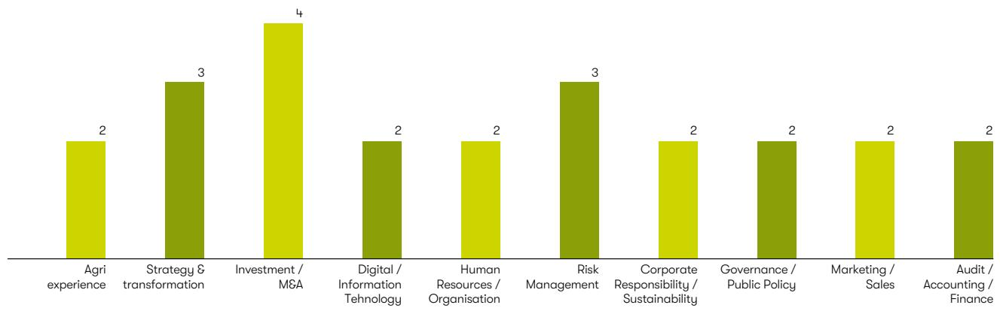  
Sector experience (number of Directors)

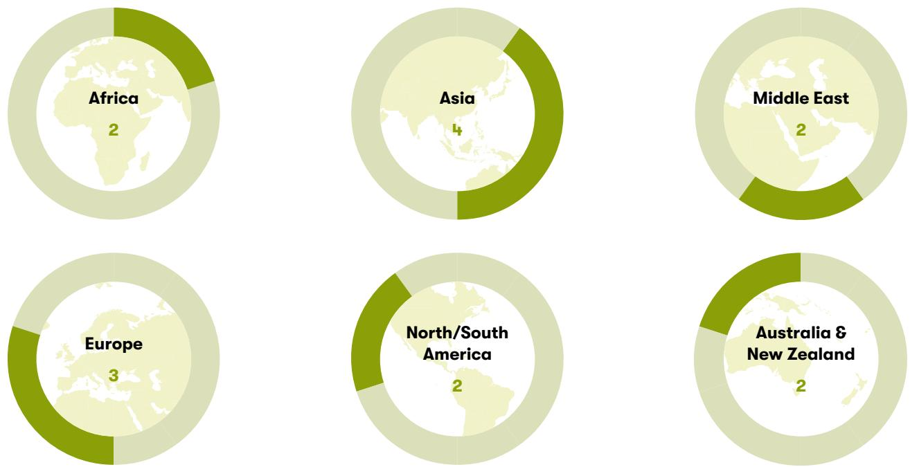  
International experience (number of Directors)

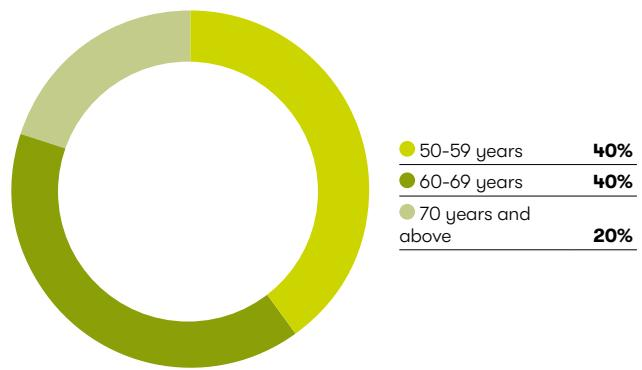  
Age

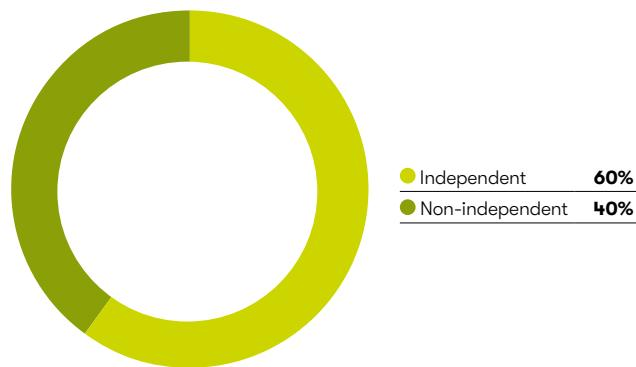  
Board independence

# Induction and Orientation of Directors

Once appointed, new Directors are provided with a comprehensive introduction to the Company, its strategy and business activities via a structured onboarding process. Induction programmes are tailored for all newly appointed Directors, both at Group and main subsidiary levels, but all Directors receive briefings from the Group CEO, CEO of, CEO Olam Agri, the Group CFO and other Heads of functions such as Human Resources, Internal Audit, Risk and Business Unit Heads. Where appropriate, site visits to the Group's operations around the world are arranged to deepen the Directors' understanding of the business and its activities.

New Directors who have no previous experience as a Director of a Singapore-listed company must undergo the mandatory training conducted by an approved provider prescribed by SGX-ST. All newly appointed Directors are required to attend director training as well as sustainability training, as prescribed under the Listing Rules of the SGX-ST.

# Directors' Training and Development

Directors' training and development does not end with the onboarding and induction process. All members of the Board are encouraged and given the support they need to continue their professional development during the term of their appointment. Each year the Group allocates a budget specifically for Directors' training and professional development, while the Board Secretariat is able to assist the Directors with their ongoing professional development, for example, by arranging meetings/visits with Group business and country teams and by providing updates on changes to laws and regulations, such as the Listing Rules of the SGX-ST, the Code, the Companies Act and requirements on directors' duties and responsibilities.

# Ongoing Renewal of the Board

The term of office for newly appointed Independent Non-executive Directors is comprised of two three-year terms with an additional three-year term available at the sole discretion of the Board. Regardless of length of tenure, all Directors, Executive, Non-executive and Independent, are subject to an annual evaluation. Independent Non-executive Directors may be retired by the Board prior to the completion of their term of office after reviewing the recommendation of the NRC.

# Principle 3

There is a clear division of responsibilities between the leadership of the Board and Management, and no one individual has unfettered powers of decision-making.

# Clear Division of Responsibilities

A clear division of responsibility exists between the Chair and Group CEO to ensure an appropriate balance of power and authority is maintained. In line with this, the roles of Chair and Group CEO are separate and held by different individuals:

- The Chair is responsible for the governance process and for ensuring the effectiveness of the Board and Board Committees – Lim Ah Doo is Chair and Independent Non-executive Director of the Company and is not related to either the Group CEO or any other members of the Senior Management Team;

# Induction and orientation of Directors

# Comprehensive and Tailored Programme for Newly Appointed Directors

# 1 Clear terms and vital information provided

Newly appointed Directors are issued with:

- an appointment letter; and  
- an appointment pack which outlines their Board and Board Committee membership details and term of office, fees payable, fiduciary duty and legal obligations of a director, other vital information regarding their appointment and on the Company.

# 2 Orientation and induction

The Board Secretariat facilitates the induction programme for newly appointed Directors comprising:

- initial engagement session with the Director;  
- customisation of the programme based on the Director's profile;  
- meeting with the Group CFO, Global Head of Internal Audit, Global Head of Corporate Responsibility and Sustainability, Business Heads;  
- scheduling briefings by various key trainers on matters of Board responsibilities; governance, fiduciary duties, risk management, safety and health, sustainability, financial reporting and the businesses of the Company;  
- briefings by the Board Chairman and Chairs of Board Committees;  
- an overview of the business, industry, trends and operations with the Group CEO, CEO-ofi; and  
- visits to the Group's key operations.

# 3 First time Director Training and Sustainability Training

All newly appointed Directors are required to attend Director Training as well as sustainability training, prescribed under the Listing Rules of the SGX-ST.

# Ongoing support provided by Corporate Secretarial Office

All newly appointed Directors are further assisted by the Board Secretariat to enable them to appropriately discharge their statutory and fiduciary duties.

- The Group CEO heads the Senior Management Team, has overall responsibility for the Company's operations and effectiveness, and is accountable to the Board for the Group's business and financial performance and for the decisions and actions taken - Sunny George Verghese is Group CEO.

The Chair and Group CEO work closely together on a number of areas including matters that are due to be tabled at, as well as those that arise from, Board meetings. Ahead of Board meetings, the Chair and Group CEO ensure that the Directors are provided with information that is accurate and clear. During Board meetings, the Chair allocates sufficient time to enable the Directors to hold robust and open discussions and to review the matters tabled fully. Following Board meetings, the Chair, the Group CEO and the Company Secretary all monitor the implementation of the Board's decisions, requests and recommendations.

Over the course of the year under review, the Chair and Group CEO regularly discussed topics such as the ongoing Re-organisation Plan, strategic options for Group businesses, Group developments, business performance, governance, compensation structure and policy.

In addition to working closely with the Group CEO, the Chair also presides over Non-executive Directors' discussions on an as and when required basis and is responsible for engaging with shareholders, both during and outside of general meetings. The Chair may request other Directors to attend and participate in briefings and meetings with other stakeholders to explain publicly available information that is deemed to be material.

# Access To Information and Accountability

To ensure Board meetings are effective, the Directors require access to accurate, relevant and clear information. Prior to Board meetings, the Chairs of the Board and Board Committees meet with Senior Management firstly to identify the salient matters and issues to be discussed before reviewing the meeting materials and setting the agenda. The agenda, Board papers, related documents and background materials, including any additional requests for clarification, details and information for each Board and Board Committee meeting, are all then made available to the Directors ahead of each meeting.

During meetings of the Board and Board Committees, Directors are briefed and updated on ongoing programmes and projects. These include the Re-organisation and Group Strategic Plans, the performance of investments, the status of divestments, the Annual Refinancing Plan, budgets and the capital structure. As part of this, members of the management team are invited to attend both Board and Board Committee meetings to discuss the matters tabled for deliberation and provide additional insights. Global Heads of Business Units (BU) are also invited to attend to update the Board on platform-wide performance and plans when required. The Directors are able to seek independent professional advice, paid for by the Company, if they deem this necessary.

At all times, the Board has separate and independent access to the Senior Management Team and the Company Secretary. Over the course of the year under review, Non-executive Directors met with Senior Management Team independently to be briefed on various issues.

# Openness and Transparency

With regards to the conduct of the Company's affairs and the safeguarding of the Company's commercial interests, a policy of openness and transparency has been adopted by the Board.

The Company's financial results are announced as prescribed by the SGX-ST with any media and analyst meetings held concurrently. Financial results and other price-sensitive information are made available to shareholders via SGXNET to the SGX-ST, via press releases, on the Company's website (olamgroup.com) and through media and analyst briefings.

The Group's Investor Relations function plays a key role in keeping investors informed of material corporate developments without prejudicing the business interests of the Company.

# Role of the Company Secretary

The Company Secretary's responsibilities include:

Supporting the Board on corporate governance matters;  
- Monitoring overall compliance with the laws and regulations that are relevant to and adhered to by the Group;  
- Facilitating the effective functioning of the Board and Board Committees in accordance with their Terms of Reference and best practice – the Company Secretary schedules Board/Board Committee meetings at least a year in advance; ahead of meetings, the Company Secretary works closely with the Board Chair and the Chairs of the Board Committees, as well as with key executives of the Company to manage the agenda and the timely delivery of the relevant materials to the Directors; and following meetings, the Company Secretary pursues and manages follow-up actions and reports on matters that arose during the meetings;  
- Supporting the Board Chair with the development of the Board and its processes including evaluation, induction and training;  
- Working closely with the Board Chair and newly appointed Directors to organise appointment letters and information packs, as well as tailored induction plans for the new Directors;  
- Ensuring the Company is in compliance with the Listing Rules of the SGX-ST;  
Facilitating the convening of general meetings and the Company's interaction with shareholders; and  
- Arranging professional advice and input that Directors, either individually or collectively, may require to make informed decisions on matters requiring their decision.

All Directors have separate and independent access to the Company Secretary.

The appointment and removal of the Company Secretary is subject to the approval of the Board.

# Nomination and

# Remuneration Committee (NRC)

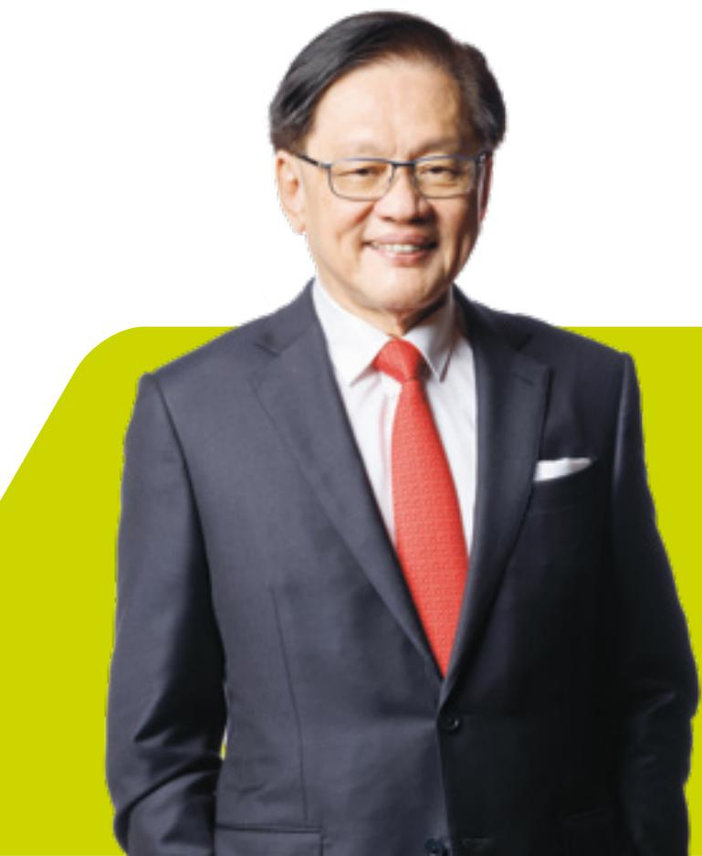

# Members of the NRC

- Lim Ah Doo* (Chair)  
- Yap Chee Keong*  
Joerg Wolfgang Wolle (Dr)*  
Shuji Kobayashi  
Chan Wai Ching\*\*

Number of Committee Members: 5

Number of Independent Directors: 3

Number of Committee meetings held during the year including outside the usual quarterly cycle: 2

Meeting attendance shown on page 175.

* Independent Director  
** Co-opted member

66 The Committee plays a key role in ensuring that the Group has a Board and Senior Management Team in place that are equipped to provide the leadership needed to deliver sustained growth over the long term for the benefit of all stakeholders. 99

Lim Ah Doo, NRC Chair

This report serves to provide details on how the Group complies with Principles 4, 5, 6, 7 and 8 of the Code and the Risk Governance Guidelines issued by Singapore's Corporate Governance Council.

# Purpose

The NRC assists the Board in its oversight of the appointment and reappointment of Directors, Board and management succession planning, performance reviews, leadership and management development and Board and management compensation policies. When discharging its responsibilities, the Committee considers all relevant matters such as each operating group's Strategic Plan and the issues and challenges faced by the Group in the present, as well as those expected in the future.

# Terms of Reference

The NRC is guided by its written Terms of Reference which details the Committee's scope of work and responsibilities. As well as the above oversight roles, the Committee's work and responsibilities include Board evaluation, Board Committee matters, the nominating process, diversity and inclusivity,

and disclosures. During the year, no changes were made to the Committee's Terms of Reference which has been approved by the Board.

# Principle 4: Director Appointments

The Board has a formal and transparent process for the appointment and re-appointment of directors, taking into account the need for progressive renewal of the Board.

The NRC works with the Board to ensure it is comprised of individuals with the background, skills, experience and qualities needed to lead the business not just today but in the future too. The Committee's responsibilities include sourcing, identifying and evaluating suitable Board candidates, determining the composition of the Board and Board Committees, monitoring the Board's size, membership, organisation and function, and advising the Board accordingly. The Committee also works with the Board to safeguard the integrity of its independence when discharging its corporate governance and oversight responsibilities.

# New Appointments, Selection and Re-Nomination of Directors

As part of its responsibilities, the NRC reviews and proposes the selection, appointment and re-nomination of Directors, taking into account the Board's composition, how it functions, as well as the importance, and benefits, of diversity. Potential candidates are sourced and identified through various means, which may include external search consultants and resources, and recommendations from Board members. The NRC then draws up a list of candidates who meet with the Board Chair and any other Board member before being put forward for approval by the Board.

When identifying and evaluating potential Board candidates, the NRC considers the following criteria:

- The scope and nature of the Company's operations and business requirements;  
- Knowledge and experience in areas of value to the Group, including but not limited to risk management, accounting or finance, banking, business or management, investment, industry knowledge, supply chain, strategic planning, customer-based experience or knowledge, environment and sustainability, legal, digital, retail, infrastructure and geographical exposure;  
- Aptitude or experience to understand fully the fiduciary duties of a director and the governance processes of a publicly listed company;  
Independence of mind;  
Competencies and how he/she could meet the needs of the Company and simultaneously complement the skillset of other Board members;  
- Experience and track record in multinational companies;  
- Ability to commit time and effort to discharging his/her responsibilities as a director;  
- Reputation and integrity; and  
- Diversity including both in gender and ethnicity.

# Retirement and Re-Election

All Directors, including the Group CEO who is also a Director of the Company, are required to submit themselves for retirement and re-election at least once every three years. In accordance with Regulation 107 of the Constitution of the Company, one third of Directors retire from office at the Company's AGM every year. The Constitution of the Company also stipulates that newly appointed Directors must submit themselves for re-election at the AGM following their appointment – unless the Director's appointment was voted upon by shareholders at a general meeting. Retiring Directors are eligible for re-election at the AGM.

At the Group's third AGM, which was held on 25 April 2024, three Directors – Mr Lim Ah Doo, Dr Ajai Puri and Dr Joerg Wolle – retired and were subsequently re-elected pursuant to Regulation 107 of the Company's Constitution.

At the Group's 2024 AGM, Mr Nihal Vijaya Devadas Kaviratne CBE retired from the Board having come to the end of the nine-year tenure as prescribed by the Listing Rules of the SGX-ST for Independent Directors. As a result of Mr Kaviratne's retirement, the membership of the Board reduced to nine from ten previously. Following a review on the composition and size of the Board and Board Committees by the NRC, Mr Tran Phuoc (Lucas) was appointed to the Board as an Independent Director in September 2024.

# Succession Planning

It is the NRC's responsibility to review Board succession planning and composition. When doing so, the Committee considers a number of factors, including but not limited to the nine-year tenure as prescribed by the Listing Rules of the SGX-ST for Independent Directors; the ongoing Re-organisation Plan; the business environment; current challenges and issues faced; and targets embedded in the Board Diversity Policy which states that no candidate for Board membership is excluded on grounds of gender, race, ethnicity and nationality.

The NRC maintains a list of suitable and qualified candidates for membership of the Board, the names of whom are sourced via recommendations from reputable third parties and organisations. The Committee also uses external partners to identify and screen potential candidates.

In accordance with the Listing Rules of the SGX-ST for Independent Directors, two Independent Non-executive Directors, namely Ms Marie Elaine Teo and Mr Yap Chee Keong have served on the Board for more than nine years. Ms Marie Elaine Teo is set to retire from the Board at the 2025 AGM. As part of the succession planning process, during the year under review, the NRC commenced sourcing of candidates who have the required experience and skillsets and who would at the same time contribute towards the Board's gender diversity targets.

The NRC also fulfils an oversight role for succession planning at the Company's two operating groups. Both Olam Agri and ofi have their own NRCs that are responsible for overseeing succession planning at their respective operating groups. In February 2025, the Group announced the sale of  $44.58\%$  in Olam Agri to SALIC and the sale of the remaining  $19.99\%$  stake in Olam Agri to SALIC at the end of three years.

The Group will focus on seeking strategic options to unlock value for the remaining Olam Group businesses and ofi, including the pursuit of an ofi IPO. The Group NRC will continue with this monitoring role while the Re-organisation Plan is ongoing to ensure ofi have the correct organisational structure and processes in place as well as the full suite of functionality.

# Principle 5: Formal Annual Assessment

The Board undertakes a formal annual assessment of its effectiveness as a whole, and that of each of its Board committees and individual Directors.

# Assessing the Effectiveness of the Board

The effectiveness of the Board is assessed both on a collective and an individual director basis.

- Assessment of the Board as a collective is based on a number of criteria recommended by the NRC. In total there are 49 individual assessment areas that fall under 12 sections. The criteria include, but are not limited to, the Board's composition, its leadership, processes, strategy and implementation, risk and crisis management, effectiveness of Board Committees and stakeholder management.

An evaluation of the effectiveness of the Board takes place each year. This exercise is overseen by the NRC but undertaken by an independent third party that is not connected to the Group. The assessment looks at a wide range of factors including the Board's strengths, areas that can be improved on and time spent discussing financial, operational and strategic matters over the course of the year. The NRC discusses the results of the evaluation, along with any comments and recommendations made, before making its own recommendations for consideration by the Board.

During the year, the Nasdaq Boardvantage board evaluation platform was used to conduct an independent Board evaluation exercise. The end to end process was facilitated using the Nasdaq Boardvantage platform to ensure confidentiality and fairness in the collation of ratings and feedback. The results of the exercise were reviewed by the NRC and tabled at the Board meeting for discussion. Areas of weakness and opportunities were discussed; next steps were agreed for monitoring by the NRC.

- Assessment of individual Directors, including the Board Chair, is carried out on an 'exception' basis. Criteria used include individual contribution, involvement, conduct at meetings, execution of agreed matters, interaction with the Board, industry and functional expertise.

When assessing performance on an individual basis, consideration is given by the NRC to each Director's board memberships, commitments outside of the Company and whether sufficient time and attention has been given by the individual to the Group's affairs. No limit on the number of board representations a Director holds has been imposed by the NRC as the Directors have demonstrated their commitment and effectiveness in discharging their duties and responsibilities to the Group and have at the same time avoided both actual and potential conflicts of interest that could be caused by serving on other boards.

- Assessment of Board Committees' performance is carried out on a regular basis to ensure the committees continue to provide effective support to the Board. When deemed necessary, changes to the composition, purpose and function of the relevant committee will be made.

Key information regarding the members of the Board is disclosed in the Board of Directors section of this report on pages 168 to 172. These pages detail the Directors' academic and professional qualifications, the Board Committees they serve on, either as a member or as a Chair, the date of their first appointment as a Director, date of their last re-election/re-appointment, current directorships in other listed companies, principal commitments and their experience and exposure. Information relating to Directors' shareholdings and interests in Olam is disclosed in the Directors' Statement of the financials section of this Report.

# Principle 6, 7 and 8: Remuneration

The Board has a formal and transparent procedure for developing policies on Director and Executive remuneration, and for fixing the remuneration packages of individual Directors and key management personnel. No Director is involved in deciding his or her own remuneration.

The level and structure of remuneration of the Board and key management personnel are appropriate and proportionate to the sustained performance and value creation of the company, taking into account the strategic objectives of the company.

The company is transparent on its remuneration policies, level and mix of remuneration, the procedure for setting remuneration, and the relationships between remuneration, performance and value creation.

# Non-executive Directors

Remuneration for the Group's Non-executive Directors is benchmarked against peer companies and is comprised of a base fee. The level of fee paid takes into account Board membership, Board Committee membership(s), Chairmanships and attendance fees.

The Board adopted the existing framework governing remuneration for Non-executive Directors on the recommendation of the NRC. The framework, which seeks to provide equitable and adequate remuneration for Non-executive Directors, considers:

- The responsibilities and average amount of time spent by Directors at Board and Board Committee meetings;  
- The discussions they have beyond formal meetings among their fellow Directors and with management, external advisors and consultants; and  
- The review of materials in the discharge of their responsibilities.

A table detailing fees payable to the Non-executive Directors of the Company is set out in this report. Fees are paid to Non-executive Directors in arrears on a quarterly basis for the current financial year following shareholder approval at the AGM.

# Directors' Fees Paid in FY2024

The aggregate fees paid to the Non-executive Directors of the Company for the financial year ended 31 December 2024 amounted to S $1,883,331.07 (excluding fees paid to a Director for his/her directorship with a subsidiary of the Company and car-related benefits for Chairman). The overall level of fees paid is lower than the sum of S$ 2,700,000 that was approved for payment as Directors' fees during the year under review. Of the regular aggregate fees paid to Non-executive Directors during the year, S$399,525.54 was paid out in the form of shares in the Company under the OG Share Grant Plan.

A breakdown of the fees paid to the Company's Non-executive Directors for the year ended 31 December 2024 is set out in the following table. Details of the compensation of Directors for FY2024 and FY2023 are also provided in Note 32 of the financial section within this report.

Name  
FY2024  
SS  

<table><tr><td colspan="2">Non-executive Directors</td></tr><tr><td>Lim Ah Doo1</td><td>695,912.42</td></tr><tr><td>Yap Chee Keong</td><td>231,000.00</td></tr><tr><td>Marie Elaine Teo</td><td>156,000.00</td></tr><tr><td>Ajai Puri (Dr)</td><td>212,170.33</td></tr><tr><td>Joerg Wolfgang Wolle (Dr)</td><td>125,500.00</td></tr><tr><td>Nagi Hamiyeh</td><td>92,000.00</td></tr><tr><td>Shuji Kobayashi</td><td>165,068.68</td></tr><tr><td>Yuji Tsushima</td><td>112,057.69</td></tr><tr><td>Tran Phuoc (Lucas)</td><td>38,122.28</td></tr><tr><td>Nihal Vijaya Devadas Kaviratne CBE</td><td>58,208.79</td></tr><tr><td>Hideyuki Hori</td><td>16,703.30</td></tr><tr><td colspan="2">NRC Co-opted member</td></tr><tr><td>Chan Wai Ching2</td><td>26,500.00</td></tr><tr><td colspan="2">Directorship on Subsidiary</td></tr><tr><td>Nihal Vijaya Devadas Kaviratne CBE3</td><td>29,233.87</td></tr></table>

The aforementioned fees paid out quarterly in arrears were based on the fees' framework set out in this report. Details of the compensation of directors and key management personnel for FY2023 and FY2022 may be referred to in Note 32 of the Financial Report.  
1. The fees paid included fixed fee as Chairman (S\\(600,000), fees as member of the Board Strategy Execution Committee (S\\)50,000) and car-related benefits (S\\(45,912.42).  
2. Co-opted member on the NRC. Ms Chan Wai Ching is not a director.  
3. Fees paid as Independent and Non-executive Chairman of Caraway Pte. Ltd., a 75:25 joint venture subsidiary of the Company.

# Proposed Directors' Fees for FY2025

For the year ending 31 December 2025, aggregate Directors' fees of up to S\\(2,500,000 have been recommended for shareholder approval at the Company's Fourth AGM. This total is based on the Directors' fees framework and includes an additional provision for developments that may occur during the year ending 31 December 2025 that would be deemed over and above the normal course of business for the Directors - for example, the appointment of new Directors, additional Board and Board Committee meetings, Board offsites, the formation of ad-hoc and/or new Board Committees and the co-opting of members to the Board Committees.

To align the interests of Directors with those of shareholders, approximately  $30\%$  of the total remuneration of Non-executive

Directors (excluding certain Non-executive Directors who, under their separate arrangements with their employers, do not retain their Directors' fees), will be payable in the form of equity in the Company. As a result, Non-executive Directors would receive approximately  $70\%$  of their total Director's fees in cash with the remaining balance received in the form of Olam Group shares. Non-executive Directors who receive equity in the Company as part of their total remuneration are expected to hold Olam shares of a value equivalent to approximately one year's basic retainer during their Board tenure. In the event a Non-executive Director leaves the Company prior to the acquisition or transfer of the shares, the Director's fees due will be paid in cash.

The equity component of Non-executive Director remuneration is typically paid out after the announcement of the Company's unaudited full year financial statements, and may be in the form of either existing shares (which may be shares held in treasury) and/or new shares. If it is paid in the form of existing shares, the actual number of Shares to be awarded to each such Non-executive Director holding office at the time of payment will be determined by reference to the volume weighted average price of a Share on SGX-ST over the 10 trading days after the date of the announcement by the Company of its unaudited full year financial statements for FY2025. The number of Shares to be awarded will be rounded down to the nearest hundred and any residual balance will be settled in cash.

Nature of appointment S\$  

<table><tr><td colspan="2">Board of Directors</td></tr><tr><td>Chairman (Fixed fee)1</td><td>600,000</td></tr><tr><td>Base fee (Deputy Chairman)</td><td>130,000</td></tr><tr><td>Base fee (Member)</td><td>70,000</td></tr><tr><td>Lead Independent Director</td><td>25,000</td></tr></table>

# Audit and Risk Committee

# Sustainability Committee

Nomination and Remuneration Committee  

<table><tr><td>Chairman&#x27;s fee</td><td>50,000</td></tr><tr><td>Member&#x27;s fee</td><td>25,000</td></tr></table>

1. Chairman would be paid fixed fee, the attendance fee and membership fee of ad-hoc committees.

<table><tr><td>Attendance fee</td><td>Board</td><td>Committee</td></tr><tr><td>Home city meeting
&lt; 4 hours round trip travel time</td><td>3,000</td><td>1,500</td></tr><tr><td>In-region meeting
Between 4 to 15 hours round trip travel time</td><td>5,000</td><td>2,500</td></tr><tr><td>Out-of-region meeting
&gt; 15 hours round trip travel time</td><td>10,000</td><td>5,000</td></tr><tr><td>Conference call</td><td>600</td><td>400</td></tr><tr><td>Odd hours</td><td>1,200</td><td>750</td></tr><tr><td colspan="3">Attendance fee - Board Offsite</td></tr><tr><td>Home city meeting
&lt; 4 hours round trip travel time</td><td></td><td>6,000</td></tr><tr><td>In-region meeting
Between 4 to 15 hours round trip travel time</td><td></td><td>10,000</td></tr><tr><td>Out-of-region meeting
&gt; 15 hours round trip travel time</td><td></td><td>20,000</td></tr></table>

# Executive Directors and Other Key Executives

The Company's guiding framework for remuneration for key executive positions is centred around the recognition that attracting, motivating and retaining highly talented individuals is key to the continued success of the business. The framework adopted helps foster alignment between the interests of the key executives and those of all the Group's stakeholders with both individual performance as well as the attainment of the Company's strategic objectives rewarded. The Company's strategic objectives are both financial and non-financial; a reflection of the recognition that value creation is not just limited to shareholders but to all stakeholders including the communities in which the Group operates. Sustainability is one such non-financial objective and is included in all three of the Group's KPIs for key executives – financial, operational and strategic.

To attract and retain talented individuals, the Company seeks to benchmark executives' compensation with that of similar performing companies. The target is for the Group to remain in the top 25 percentile among its peers, taking into consideration the individual's performance, qualifications and experience. This requires the NRC to keep abreast of comparative remuneration among the Group's peers.

The Company's performance-based remuneration system is flexible and responsive. Where possible, any resulting increase in pay following a peer group analysis will be linked to actual performance. The NRC recognises that remuneration needs to be appropriate and proportionate to sustained performance and value creation, and that care is taken to ensure that the link between performance and remuneration is clear.

# Remuneration Structure

Total remuneration for Executive Directors and other key executives is made up of an annual fixed cash component and performance-linked incentives. Selecting appropriate performance metrics for annual and long-term incentive plans supports the implementation of the Group's Re-organisation Plan, strategy, the ongoing generation of shareholder value and the alignment of the interests of Executive Directors and other key executives with those of shareholders and other stakeholders:

- Annual fixed component – this is comprised of an annual basic salary and other fixed allowances. The base salary reflects the market worth of the position, but this may vary depending on responsibilities, qualifications and the experience that the individual brings to the role;

- Performance-linked incentives – this includes a  $60\%$  short-term cash incentive and a  $40\%$  deferred cash incentive, both of which are tied to the Company’s and the individual’s performance. The proportion of the performance-related component of the Executive Directors and other key executives’ remuneration increases as the individuals move higher up the organisation.

The annual performance incentive is tied to both the Company's and the individual executive's performance to support the Group's strategy and the ongoing enhancement of shareholder value. Long-term incentives reinforce the delivery of growth and shareholder value over the long term, drive an ownership culture and help retain key talent. These incentives are subject to a performance-related claw-back if long-term sustained performance targets are not met. Since the launch of the Re-organisation Plan, the Company's long-term incentives have been in the form of deferred cash incentives to be paid equally across four years.

When measuring performance, a balanced scorecard approach, incorporating both financial and non-financial metrics, is used with targets set at appropriate threshold, target, stretch and exceptional performance levels. Other factors such as qualification and experience are also considered.

Finally, as part of the Executive Director and top key executive remuneration package, the Company contributes towards the Singapore Central Provident Fund where applicable to the individual.

Disclosure of Top Key Executive Remuneration  

<table><tr><td>Remuneration band</td><td>No. of executives</td></tr><tr><td>$750,000 to S$1,000,000</td><td>2</td></tr><tr><td>$1,000,000 to S$1,250,000</td><td>1</td></tr><tr><td>$1,750,000 to S$2,000,000</td><td>1</td></tr><tr><td>$4,500,000 to S$4,750,000</td><td>1</td></tr></table>

# Remuneration of Employees who are immediate family members of a Director or the Group CEO

No employee of the Company and its subsidiaries whose remuneration exceeded S$100,000 during the year under review was an immediate family member of a Director, the Group CEO or a substantial shareholder of Olam.

An immediate family member is defined as a spouse, child, adopted child, stepchild, brother, sister or parent.

Level and mix of remuneration of the Group CEO and Executive Director for the year ended 31 December 2024  

<table><tr><td rowspan="2">Remuneration</td><td>Salary
(including employer
provident fund)</td><td>Variable or
performance related
income/bonuses</td><td>Benefits in kind</td><td>Total</td><td rowspan="2">Shares held
in trust</td></tr><tr><td>$</td><td>$</td><td>$</td><td>$</td></tr><tr><td>Sunny George Verghese</td><td>1,251,338</td><td>5,446,500</td><td>239,426</td><td>6,937,264</td><td>1,511,650</td></tr></table>

1. The trust was set up to satisfy the unvested RSA and that unvested shares of the Company under the RSA was fully issued and/or transferred by Olam International Limited to the trustee prior to the Scheme of Arrangement to hold under the trust. These shares will be released by the trustee to Mr Sunny Verghese in accordance with the original vesting schedule of the RSA, and subject to the same conditions for vesting as provided in the RSA and under the Olam SGP.

# Audit & Risk Committee (ARC)

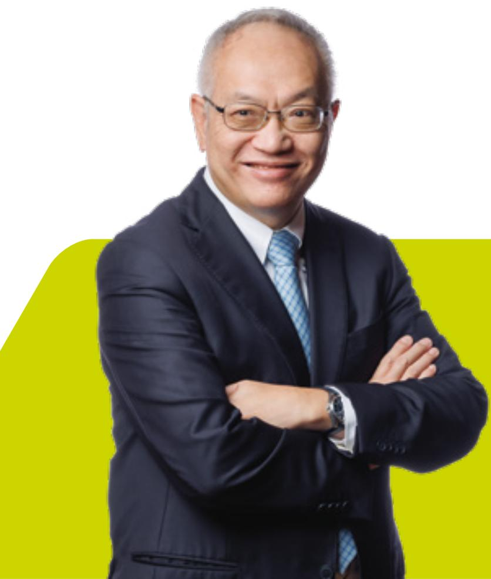

# Members of the ARC

Yap Chee Keong* (Chair)  
Tran Phuoc (Lucas)*  
Marie Elaine Teo*  
Ajai Puri  $(\mathsf{Dr})^{*}$  
Shuji Kobayashi

Number of Committee Members: 5

Number of Independent Directors: 4

Number of Committee meetings held during the year including outside the usual quarterly cycle: 5

Meeting attendance shown on page 175.

* Independent Director

66 The ARC has in the course of the year focused on tightening controls, ensuring collaboration amongst Finance, Internal Audit, Functions, Business units, and Country Management. 99

Yap Chee Keong, ARC Chair

This report serves to provide details on how the Group complies with Principles 9 and 10 of the Code and the Risk Governance Guidelines issued by Singapore's Corporate Governance Council.

As of 1 January 2024, the Audit and Board Risk Committees were combined and renamed the Audit and Risk Committee. As a result, this is the first annual review of the Audit and Risk Committee's (ARC) work and activities which covers the year ended 31 December 2024.

# Purpose

The purpose of the ARC is two-fold:

1. Audit – to support the Board's discharging of its statutory and other responsibilities regarding the following:

a. Internal controls;  
b. Financial and accounting matters;  
c. Operational, compliance and information technology controls; and  
d. Business and financial risk management policies and systems.

2. Risk –to ensure, with the support of the various Group functions and other Board Committees, that management maintains a robust system of risk management and internal controls, and continues to instil a culture that fosters effective risk governance across the Group to safeguard the interests of the Company and its shareholders. The Committee’s responsibilities include:

a. Reviewing with management the Group's framework, guidelines, policies and systems to govern the process for assessing and managing risks;  
b. Reviewing and recommending annual risk limits and trading risk budgets;  
c. Reviewing benchmarks for, and major risk exposures from, such risks;  
d. Requesting, receiving and reviewing reports from management on risk exposures;  
e. Identifying and evaluating new risks at an enterprise level and tabling a report to the Board;  
f. Reviewing the report and findings under the Integrated Risk and Assurance Framework;  
g. Reviewing market compliance updates and issues reported; and  
h. Reviewing annually the Insurance Strategy and Plan.

The Committee is also responsible for ensuring that the effectiveness of all the above are reviewed at least annually, either by the external or internal auditors.

# Terms of Reference

The ARC is guided by its written Terms of Reference which set out the detailed scope of the Committee's work and responsibilities.

The Committee continues to have explicit authority to investigate any matter that falls within the scope of its Terms of Reference and has full access to, and the cooperation of, management. Furthermore, the ARC has full discretion to invite any Director, key executive or officers of the Company to attend its meetings to enable it to discharge its functions properly and to support the Board's oversight of the Company's risk management framework and policies. The Committee also has access, through management, to external counsels, advisors and consultants.

The Committee's Terms of Reference has been approved by the Board but will be reviewed by the ARC at regular intervals.

# Principle 9 - Risk

The Board is responsible for the governance of risk and ensures that Management maintains a sound system of risk management and internal controls to safeguard the interests of the Company and its shareholders.

Central to the Group's approach to the governance of risk is compliance with the recommendations contained in the Code and the Risk Governance Guidelines issued by Singapore's Corporate Governance Council.

The Group has in place mechanisms and systems firstly to identify risks that are inherent in the Group's business model and strategy, as well as those that arise from external factors and other exposures; and secondly, to monitor closely any key identified risks that could have an adverse impact on the Group, its strategy, reputation and long-term viability.

# Internal Controls

The Company has a robust system of internal controls that has been developed to provide reasonable assurance regarding the delivery of the Group's related objectives. To ensure the internal controls continuously reflect the evolving needs of the Group and its businesses and the changing regulatory backdrop, they are regularly reviewed and if necessary adapted so that they remain fit for purpose. Every quarter, the ARC and the management team are kept informed of any areas that have been identified as being in need of strengthening or any gaps in the internal controls system that need to be filled. The ARC also reviews on a quarterly basis management responses and remedial action taken on the significant findings and observations arising from reviews of the internal control system. If deemed necessary, the ARC will meet with the relevant Business/Function/Country Head to discuss the findings of the reviews further. The ARC Chair may also visit overseas operations.

The internal controls system is comprised of a series of frameworks, policies and procedures. These include:

- Internal Audit, including specialised audits and external auditor work;  
- An enterprise risk management framework that focuses on the effectiveness of the Company's risk management plans, systems, processes and procedures;  
- An information security controls framework and CISO monitoring; and  
- The Integrated Risk and Assurance Framework (IRAF) which covers all the Group's functions and operating groups.

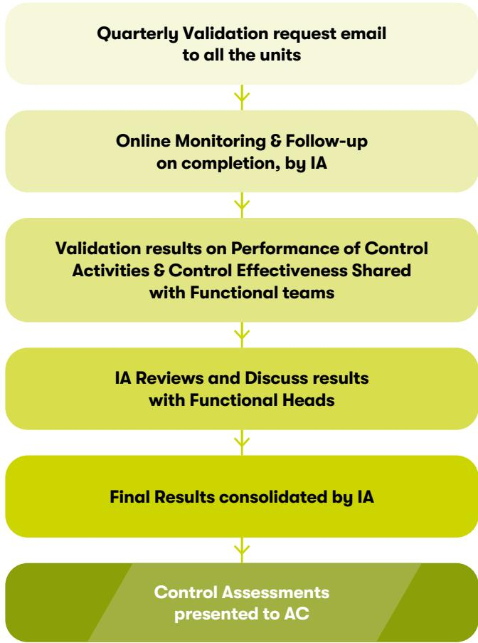  
Integrated Risk and Assurance Framework

All risks are reported under the IRAF, which includes an assessment of the likelihood of each risk occurring along with its potential impact. By incorporating the level, impact, frequency and ownership of risk, the IRAF provides a single view of assurance for a range of risks. It also provides assurance on the adequacy and effectiveness of the risk and internal controls frameworks across the Group's key activities – financial, operational, compliance, information technology and risk management. The platform is therefore a useful tool when the Board and Board Committees are reviewing risk.

The IRAF has been designed to assess the likelihood and impact of any identified risks on a continual and rigorous basis, as well as to manage any required remedial actions to be or already taken. To ensure alignment with industry best practices, the Company continually updates its approach to managing risk:

- Risk identification - risks are identified both from a top-down strategic perspective and from a bottom-up business perspective; and  
- Risk monitoring – the Company takes a holistic approach to enterprise-wide risk, which covers a range of both quantifiable and non-quantifiable risks across each step of the value-chain.

In all, the Group's risk framework assesses the effectiveness of controls across risk events within 11 categories – a list of all 49 risks, the 11 categories and mitigating action taken can be found on pages 142 to 145 of this report. All risks are evaluated on a qualitative basis, while certain risks are also assessed quantitatively.

# How the IRAF Works

The process for validating the performance and effectiveness of the various controls starts with a validation request email being sent to all business units each quarter. The IA function, which is responsible for monitoring the process, shares the validation results on the performance of control activities and control effectiveness with the function teams. IA also reviews the results with function heads ahead of presenting the final assessments to the ARC. By providing a holistic view of risk, the IRAF helps reduce the risk of duplication, bridge gaps across Group functions and ensures accountability across the Group's four lines of defence.

The ARC regularly reviews the IRAF at its quarterly meetings and, if necessary, challenges the IRAF to satisfy itself that the controls for the Group including the operating businesses, remain relevant. At the sub-Group level, the IRAF has been adapted to reflect the specific challenges and issues each operating group faces. As a result, both Olam Agri and ofi have their own separate IRAF platforms that have been tailored to their own needs. The Group IRAF incorporates the risks and controls included at the individual operating group level.

During the year, the Committee reviewed with the management team the IRAF approach and comprehensiveness with the support and advice of KPMG. The review culminated into the implementation of IRAF 2.0 which included a thorough review of the line 1 and line 2 as well as the risks identification process at entity and country level. IRAF 2.0 is intended to further support the ARC and Board in providing confirmation to shareholders on internal controls under the Listing Rule requirement.

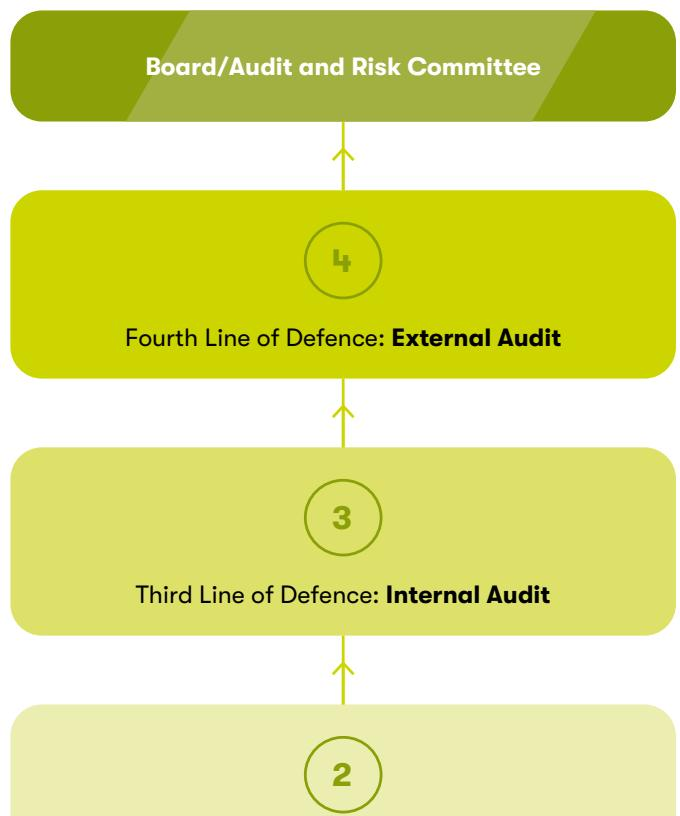  
Olam's Lines of Defence

Second Line of Defence: Functions  
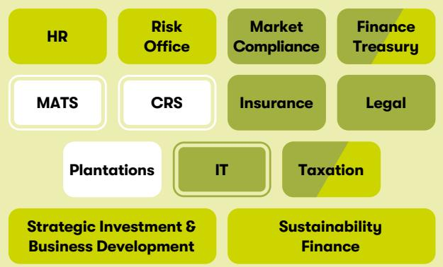  
HO Coverage  
Region Coverage  
Legal entity coverage

1

  
First Line of Defence: Business Units

Olam

  
Functions comprising First and Second Line of Defence

make it real

Olam Agri

# Risk and Market Compliance Offices

When discharging its risk oversight role, the ARC is supported by the Risk Offices and Market Compliance functions of the Company's operating groups – Olam Agri and ofi:

# Risk Offices

The Risk Offices at Olam Agri and ofi are mandated to allocate trading risk limits across their respective businesses based on trading and market conditions along with competitive position and track record.

# Market Compliance Office

The ofi Compliance function and Olam Agri Market Compliance Office, jointly referred to herein as the "Market Compliance Office" (MCO) monitor and manage their respective exchange and over-the-counter derivative trading activities to ensure compliance with exchange rules and regulatory requirements. This includes, but is not limited to, trade surveillance, monitoring of position limits and other exchange rules, compliance with applicable regulatory reporting requirements and providing training, on an annual basis and additionally as required, for traders to foster a culture of compliance to prevent breaches and regulatory issues. Any breaches of exchange regulations or regulatory requirements are identified and escalated to the ARC by the Chief Compliance Officer.

During the year, trading risk limits were presented to the ARC for review and approved as part of the annual budgeting exercise. Trading risk limits cover market risk, currency risk, credit risk and counterparty risk. Risk limits are recalibrated where necessary. In addition, the ARC met with the ofi and Olam Agri Chief Compliance Officers on a quarterly basis where they reviewed and discussed the MCO's activities and any findings. The ARC was also kept up to date on the adoption of a new trade surveillance system – the NASDAQ Trade Surveillance System, which is viewed as the global standard for trade surveillance.

# The Group's Risk Governance Structure

- In Olam Agri, both the Chief Risk Officer and the Head of Market Compliance Office (MCO) report to the CEO - Operations.  
- In ofi, the Head of Risk reports to the CFO and the Head of MCO reports to the Head of Compliance who reports to the Head of Legal; and  
- The respective Risk Offices at Olam Agri and offi are responsible for identifying, assessing, measuring and monitoring risks and providing the Company's Senior Management Team and the Board with an assurance that all risks borne by the Company are within set risk limits.

# Principle 10 – Audit

The Board has an Audit Committee (AC) which discharges its duties objectively.

# Key functions

In terms of the Committee's key audit functions, these remain unchanged from previous years and include the following:

- Reviewing with the external auditors their Audit Plan, their evaluation of the system of internal controls, their report and management letter to the ARC, management responses and the allocation of audit resources according to the key business and financial risk areas, as well as the optimum coverage and efforts between the external and internal auditors;  
- Reviewing the half-year and annual financial statements before submission to the Board of Directors for approval;  
- Reviewing with management any significant accounting policies, estimates, and judgments made, salient accounting matters, changes to the accounting standards, issues and developments with a direct impact on financial statements, major operating risk areas, the overview of all Group risk on an integrated basis, significant adjustments resulting from the audit, the going concern statement, compliance with accounting standards and compliance with any SGX and statutory/ regulatory requirements;  
- Reviewing the proposed scope of the Internal Audit function, the performance of the Internal Audit function, Internal Audit's report on their audit findings and remediation and approving the Internal Audit Plan as and when there are changes;  
- Reviewing internal controls and procedures, ensuring coordination between the external auditors, the internal auditors and management, reviewing the assistance given by management to the auditors and discussing problems and concerns, if any, arising from the interim and final audits, and any matters which the auditors may wish to discuss (in the absence of management where necessary);  
- Reviewing the assurance from the Group CEO and the Group CFO on the financial records and financial statements;  
- Reviewing and discussing with the internal auditors, external auditors and management any suspected fraud or irregularity, or suspected infringement of any relevant laws, rules or regulations, which has, or is likely to have, a material impact on the Group's operating results or financial position, and management responses to the same;  
- Monitoring the Company's risk of becoming subject to, or violating, any Sanctions Law, and ensuring timely and accurate disclosures to SGX and other relevant authorities;  
- Considering the appointment or re-appointment of the external auditors and matters relating to the resignation or dismissal of the auditor;  
- Reviewing the scope and results of the audit and its cost-effectiveness, and the independence and objectivity of the external auditors, annually;  
- Reviewing the adequacy and independence of the internal auditors;

- Reviewing interested person transactions (IPT) falling within the scope of the IPT mandate and Chapter 9 of the SGX-ST Listing Manual;  
- Understanding the specific policies and procedures in place to identify conflict of interests, misconduct, bribery, corruption-related risks including how policies and procedures are operationalised;  
- Undertaking such other reviews and projects as may be requested by the Board of Directors and reporting to the Board of Directors its findings from time to time on matters arising and requiring the attention of the ARC; and  
- Undertaking such other functions and duties as may be prescribed by statute and the Listing Rules or recommended by the Code and by such amendments made thereto from time to time.

To help the Committee discharge its responsibilities effectively, members of the management team are regularly invited to attend the ARC's meetings to review and provide/receive updates on matters such as Group performance, salient accounting matters, legal, compliance and sanctions-related matters, interested person transactions, information technology and cybersecurity controls, tax compliance and internal audit findings (including whistleblowing report and fraud).

During the year, the GCFO, the CFOs for each operating group, internal and external auditors, CRO, CISO, Group Legal Counsel, Global Head for Tax, Country and Function Heads were invited to attend ARC meetings to discuss a number of matters including:

Changes in accounting policies and practices;  
- Developments in local and global tax regimes;  
- Internal audit plan and findings;  
- Accounting issues that have an impact on the Group's financials;  
Key audit matters;  
- Major operating risk areas along with an overview of all Group risk on an integrated basis;  
The going concern statement;  
- Compliance with accounting standards;  
- Compliance with any SGX and statutory/regulatory requirements; and  
- Matters of significance in the audit of the financial statements

In addition, ahead of each formal meeting, the Chair of the ARC meets with the external auditors, internal auditors and key management personnel to discuss and review matters. The Chair also ensures that the Committee is provided with all relevant information, and any additional assurances that may be required, in good time ahead of each meeting.

Outside of the regular ARC meetings, the Chair met with the audit committee chairs of Olam Agri and ofi, and key management personnel including the Group Chief Financial Officer (GCFO), the Chief Executive Officer for ofi, Global Head of Internal Audit, Chief Risk Officer (CRO), Chief Information Security Officer (CISO), and Global Head for Tax.

# Key Audit Matters

As listed above in the Committee's key functions, the ARC is responsible for reviewing the unaudited financial statements of the Company prior to the release of the announcement of the financial results and the despatch of the audited financial statements to shareholders. The Committee also reviews with Management the adequacy, structure and content of the results announcements to ensure the content has been presented clearly and fairly to all stakeholders. In line with this, during the year the ARC reviewed the Group's half-year unaudited and annual audited financial statements for the year ended 31 December 2024. Members of the management team and the external auditors were in attendance during the review process to discuss key audit matters as well as the assumptions taken and the estimates made for those matters that involved a high degree of estimation and the exercise of managerial judgement.

Based on the reviews of these assumptions and estimations, the Committee concurs with the basis and assessment of the Key Audit Matters disclosed in the Independent Auditors' Report.

# External Auditors

External auditors report their findings and recommendations independently to the ARC at the Committee's quarterly meetings. The external auditors update the Committee on any changes that have either been made (or proposed) to the financial reporting and accounting standards and the impact these could have on the Company's financial statements, tax matters, policies and their audit of the Company's systems of internal control. The external auditors are also available to meet with the ARC outside of the quarterly meetings cycle to discuss any issues of concern without Management being present.

Each year, the Committee carries out a review of all non-audit services provided by the external auditors to ascertain their independence and objectivity against an established boundary condition. Following the review carried out during the year, the ARC was satisfied that the non-audit services provided by the external auditors would not impact their independence.

The table on the right along with Note 7 of the financial statements within this report set out the amount of fees paid to the external auditors for audit and non-audit services for FY2024.

Non-audit Services Review  

<table><tr><td></td><td>2024
$$&#x27;000</td><td>2023
$$&#x27;000</td></tr><tr><td>Auditors&#x27; remuneration:</td><td></td><td></td></tr><tr><td>·Ernst &amp; Young LLP, Singapore</td><td>7,686</td><td>6,223</td></tr><tr><td>·Other member firms of
Ernst &amp; Young Global</td><td>10,359</td><td>10,076</td></tr><tr><td>Non-audit fees:</td><td></td><td></td></tr><tr><td>·Ernst &amp; Young LLP, Singapore1</td><td>1,224</td><td>2,408</td></tr><tr><td>·Other member firms of
Ernst &amp; Young Global1</td><td>275</td><td>173</td></tr></table>

1. In the current financial year, non-audit fees paid to Ernst & Young LLP, Singapore mainly relate to the work performed for financial due diligence of Olam Agri.

# Tenure of Audit Partners

Under SGX rules, an audit partner at an external auditor may only be in charge of five consecutive annual audits for the same client. Christopher Wong was designated as the audit partner at Ernst & Young LLP since the financial year ended 31 December 2019. Having completed the five annual audits, Lee Wei Hock replaced Christopher Wong as the audit partner. Ernst & Young LLP, being the external auditor, therefore met this requirement during the year under review. As a result, the Company satisfied the requirements on Rules 712, 713 and 715 of the SGX-ST Listing Manual in relation to the appointment of auditors.

# Internal Audit

Providing oversight for financial, accounting, administrative, computing, sustainability, statutory compliance, asset management, control systems and other operational activities, the Internal Audit (IA) function covers all of the Group's operations and activities, including those of its controlled entities. Through the Integrated Risk and Assurance Framework (IRAF), IA also has a key role to play in the Group's risk management and governance processes. Working closely with the Management team to ensure risk management and internal risk controls across the Group are effective and robust, the Group's IA function serves as a key line of defence.

The Internal Audit function has three main components: Audit work; Automated oversight; and Advisory/consulting.

Audit work has three main components: Field Audits; Specialist/Thematic Audits; and IT Audits.

- The frequency of Field Audits, which are core audits of Group subsidiaries, depends on factors such as size and past findings. Based on these factors, each subsidiary falls under one of three priority categories: High, where an audit is required each year; Medium, where an audit is required every two years; and Low, where an audit is required every three years;  
- Specialist/Thematic Audits can cover all geographies and all areas of the business; and  
- IT Audits on all aspects of IT including systems resilience, cybersecurity and ransomware.

Automated oversight is focused on deploying technology to extend the IA team's capacity and reach and has three elements:

- Data analytics - enables trading and operational activities to be constantly monitored;  
- Integrated Risk and Assurance Framework – incorporates the principal risks faced by the Group. The framework also covers the critical controls that are in place to mitigate these with the control validation mechanism underpinned by the three lines of defence principle; and  
- Whistleblowing Policy – empowers employees to report fraudulent activity anonymously to the IA team via an independent platform. Reports of fraudulent activity are then investigated by the IA team who then share any findings with the Senior Management Team and the ARC.

Advisory/Consulting - focuses on raising awareness of risks and fraud internally via regular training sessions and other activities. Comprised of individuals with the relevant

All internal audits are carried out in accordance with standards set by both internationally and nationally recognised professional bodies, such as The Institute of Internal Auditors' Standards for the Professional Practice of Internal Auditing. Internal Audit findings/ ratings regarding the performance of managers are taken into account by Human Resources.

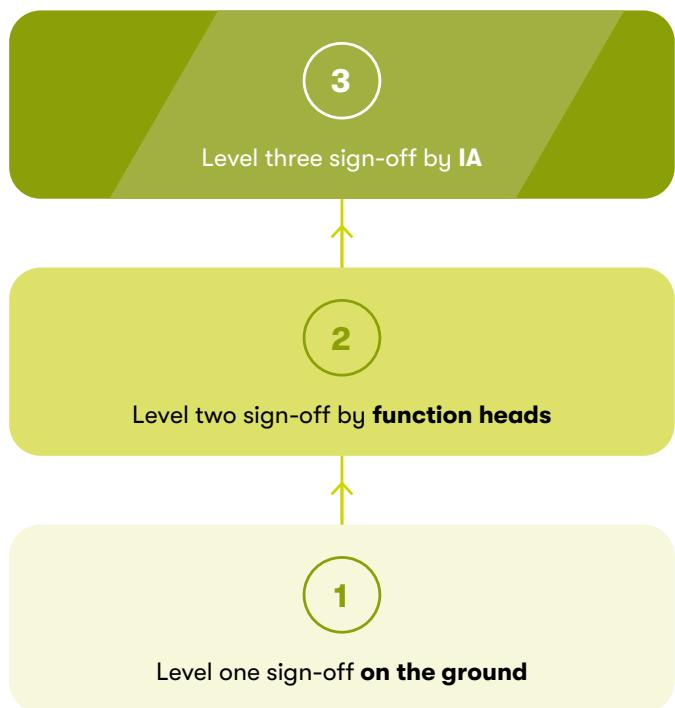  
Three Lines of Defence Principle

qualifications and experience, the IA function is fully empowered to discharge its duties effectively. In addition, the team has at all times:

- full, free and unrestricted access to all books, personnel, documents, accounts, property, vouchers, records, correspondence and other Company data;  
- the right to enter all Group premises and to request any officer of the Company to provide information and/or explanations that are deemed necessary for the team to form an opinion on the probity of action and adequacy of systems and/or controls; and  
- has access to specialist auditors, as well as technical tools so that the effectiveness of the internal processes and risk management processes can be regularly tested against the evolving nature of concerns and issues.

# ARC Oversight of Internal Audit

The Head of IA reports directly to the ARC Chair, and provides quarterly updates to the ARC. The ARC also meets with the Head of IA without the presence of Management annually. Based on the review of the report provided by IA, the ARC may invite Country Management teams, Business Unit Heads or Function Heads to attend the ARC meetings to discuss any relevant incident(s) and remediation action to ensure that any risks are addressed promptly. The Committee is also actively involved in the appointment, ongoing evaluation and replacement/dismissal of the Head of Internal Audit.

The Committee also regularly reviews the IA team's activities and performance. The review is comprehensive and includes:

the Internal Audit Plan;  
- any fraud reporting and complaints received from the whistleblower platform and management responses;  
- the ability of the IA team to discharge its duties effectively and that no limitation had been imposed on its activities;  
- the scope of the IA function to ensure it covers all the Group's key operational, financial and related activities;  
- the composition of the IA Team, along with its size, skillset and resources, to ensure internal audits continue to be executed effectively and at the same time meet the evolving needs of the Group's businesses; and  
- the adequacy of the reports generated to satisfy itself that the IA function is effective, independent and has appropriate standing within the Company – this forms part of the Committee's detailed reviews of the three-year rolling Internal Audit Plan.

# Ethics, Compliance and Whistleblowing

# Ethical business programme

The Company is committed to setting, and adhering to, high ethical conduct standards to ensure integrity, transparency and ethical behaviour are embedded in our business practices.

Both operating groups, Olam Agri and offi, have in place their own Codes of Conduct. These set out the Company's policies that all employees are required to comply with, along with what is expected in terms of behaviour.

In addition, all employees routinely undergo online training to familiarise themselves with the Anti-Bribery and Corruption (ABC) Policy – the Company has a zero-tolerance approach to bribery, fraud and corruption – as well as other relevant policies set out in the Code of Conduct manual. Training is mandatory, with completion tracked and monitored by the Group's Legal Compliance Team. Updates on the status are then reported to the Internal Audit and the Audit and Risk Committee under the IRAF on a quarterly basis, with periodic reminders and updates on the EBP communicated to all staff. As part of its ongoing training programmes, during the year of its held training workshops on competition law which were attended by over 1,000 individuals.

Policies are reviewed and, where deemed necessary, updated on an annual basis. For example, during the year under review, ofi updated its ABC Policy which included a revision to thresholds for gifts and entertainment as well as updates to reporting and approvals procedures.

# Whistleblowing

Olam has in place a whistleblowing policy which sets out procedures for reporting a misconduct or wrongdoing by the Group and its officers.

During the year, Speak Up – a dedicated whistleblowing platform – was launched. Speak Up allows all employees to report actual or suspected wrongdoing, unethical practices or illegal activity that is in breach of its Code(s) or policies in good faith and without fear of reprisals or any other concerns. The platform achieves this by ensuring discreet reporting and is available on the Group's external websites and internally on Workplace – the Group's employee engagement platform.

The Group's Whistleblowing Policy sets out guidelines for investigations to ensure all reported incidents or complaints are adequately brought to the notice of the stakeholders concerned and that remedial action has been initiated. All reports received are dealt with by the relevant function promptly and independently, depending on the issue being reported. Those using the whistleblowing platform are also advised to report any suspicions of retaliatory action immediately to the Legal or HR functions to protect them from retaliation for raising a compliance or integrity issue.

The Audit and Risk Committee is provided with quarterly updates on the status of ongoing complaints.

# Whistleblowing Investigation Process

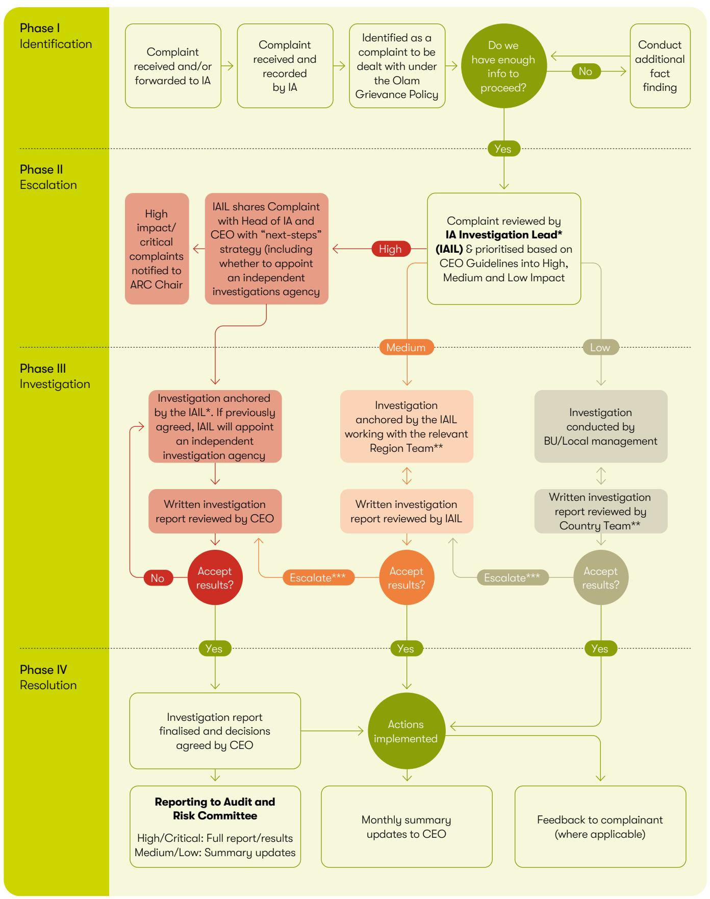  
* Supported by HR and Legal as deemed necessary.  
\*\* Regional/Country team to consist of members from regional/country leadership team, Legal and HR  
\*\*\* Investigation results to be escalated to higher forum if results indicate a more serious breach

# Financial Limits

Board approval is required for investments and divestments exceeding certain threshold limits, as well as CAPEX transactions and any financing and refinancing outside of the approved Annual Refinancing Plan, net debt and gearing limits. For transactions below set limits, authority is delegated to the management team. Reserve matters, such as equity issuance, dividends and other distributions require the Board's specific approval. Operating and capital expenditure, goods and services procurement and acquisition and disposal of investments are subject to authorisation and financial approval limits.

# Board Statement on Group Risk Management Systems and Internal Controls

The Board has received assurance from the Group CEO and the Group CFO that:

- The financial records have been properly maintained and the financial statements give a true and fair view of the Company's operations and finances;  
- From their review with the risk owners of their assessments of the standard operating procedures framework, escalation reporting, breaches and assurance processes, they are satisfied with the adequacy and effectiveness of the Company's risk management and internal controls systems; and  
- The Company has implemented adequate and effective control measures to protect its exposure to and interests in relation to any sanctions-related risks.

Based on the work carried out under the IRAF and performed by the line 1 and line 2 and the internal and external auditors, the assurance received from the Group CEO and the Group CFO as well as the reviews undertaken by various Board Committees:

- The Board, with the concurrence of the ARC, is of the view that the Group's risk management systems are adequate and effective; and  
- The Board, with the concurrence of the ARC, is of the opinion that the internal controls, addressing the financial, operational, compliance (including sanctions-related risk) and information technology controls of the Company, are adequate and effective to meet the needs of the Group in its current business environment.

The Board notes that the internal audit and the internal controls systems put in place by management provide reasonable assurance against material financial misstatements or loss, and assurance reliability, relevance and integrity of information (including financial information), completeness of records, safeguarding of assets, effectiveness and efficiency of operations and compliance with applicable policies, laws and regulations. However, it is opined that such assurance cannot be absolute in view of the inherent limitations of any internal audit and internal controls system against the occurrence of significant human and system errors, poor judgement in decision-making, losses, fraud or other irregularities.

# Sustainability Committee (SC)

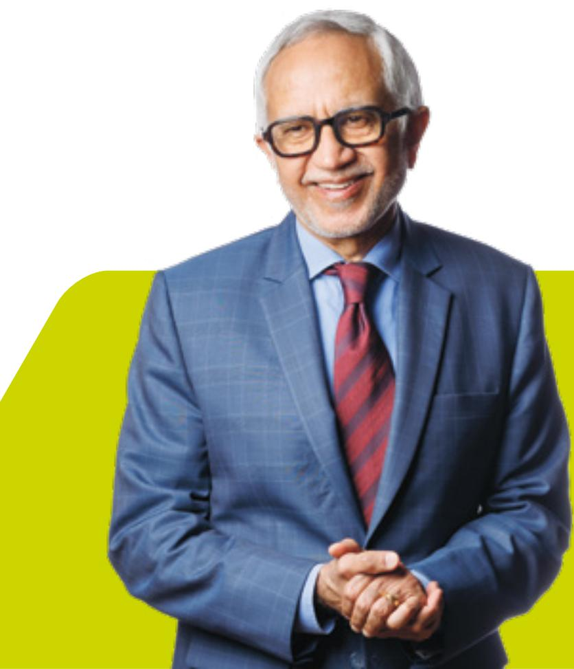

# Members of the SC

- Ajai Puri (Dr)* (Chair)  
Sunny George Verghese  
Marie Elaine Teo*  
Yuji Tsushima

Number of Committee Members: 4

Number of Independent Directors: 2

Number of Committee meetings held during the year including outside the usual quarterly cycle: 4

Meeting attendance shown on page 175.

* Independent Director

66 We operate in a dynamic and fast-changing environment. We therefore have to be proactive in how we manage change but, at the same time, we have to ensure we continue to adhere to our overall sustainability strategy and policy framework. It is the Sustainability Committee's responsibility to make sure this happens. 99

Ajai Puri (Dr), SC Chair

The Committee's name was changed from the Corporate Responsibility and Sustainability Committee to the Sustainability Committee on 1 January 2024.

The year under review saw the Committee change its name and its Chair following the retirement of Nihal Vijaya Devadas Kaviratne CBE. The focus and purpose of the Committee, however, remain unchanged. Having served on the Sustainability Committee since 2019, the new Chair, Dr Ajai, has, over the years, played a key role in the crafting of the Company's sustainability strategy. His appointment as Chair therefore represents continuity in terms of the work the Committee does to ensure sustainability is embedded across the business and its activities. The SC achieves this through its oversight of the implementation of the Group's sustainability strategy as well as the management of environmental, social and governance-related risks.

With the ongoing Re-organisation of the Group, the SC continues to play an important role in ensuring the programmes being deployed at the operating group level are fully aligned with the overall sustainability strategy and policy framework of the Olam Group.

This report provides an overview of the work and activities of the SC during the year ended 31 December 2024.

# Purpose

As an agriculture-based business, the Group has for many years recognised the importance of sustainability to the future of both Olam and the wider sector. As a result, the Company was among the first within the industry to embed sustainability principles within its core business operations across multiple dimensions including climate action, diversity, equity and inclusion, economic opportunity, ecosystems and soils, nutrition and health, water and waste reduction, industrial safety and employee security. This is an ongoing process, however, one which the Sustainability Committee oversees.

As part of its oversight role of the Group's sustainability policies and projects, both at the formulation and implementation stages, the SC's responsibilities include, but are not limited to, the following specific matters arising under the scope and duties of the Committee:

- Reviewing and recommending to the Board the Corporate Responsibility and Sustainability (CR&S) vision and strategy for the Group;  
Overseeing the integration of CR&S perspectives into the Company's strategy and businesses;  
- Reviewing global CR&S issues and trends, and assessing their potential impact on the Group;  
- Monitoring the implementation of strategy as well as policies and investments in the CR&S area through the CR&S function;  
- Reviewing progress made on various initiatives;  
- Reviewing the state of the Group's Safety and Health measures and status;  
- Supporting management's response to crises where required;  
- Reviewing the Company's report and statement on sustainability activities, commitment and involvement, and its sustainable sourcing platform;  
- Reviewing the adequacy of the CR&S function; and  
- Reviewing the findings from the Integrated Risk and Assurance Framework Report that relate to the SC's oversight role.

# Terms of Reference

The SC is guided by its written Terms of Reference which details the Committee's scope of work and responsibilities, including those listed above. During the year, the Committee members reviewed the SC's Terms of Reference and deemed no changes were necessary. The Committee's Terms of Reference has been approved by the Board.

# Oversight Role

To fulfil its oversight role, the Committee monitors the implementation and effectiveness of the Company's ESG initiatives and programmes, both at Group and operating unit levels. The SC also oversees how these are embedded across the business and how corporate responsibility and sustainability issues, including how the management team reports on them, are incorporated in the Company's investment decision process.

The SC is also charged with monitoring the safety, health and wellbeing of employees. Reflecting the Group's zero-tolerance culture to fatal accidents, the SC reviews the Group Head of Safety's Safety and Health Report at each quarterly meeting. The Committee is also regularly updated on any safety issues and concerns on an ad hoc basis. Further details on the Group's Safety and Health measures can be found in the People and Culture: Safety and Health section of this report.

To help the Committee discharge its responsibilities effectively:

- The SC works closely with the Group's CR&S function which is responsible for embedding ESG standards and best practices across the Group's operations in addition to leading the Group's response to social and environmental issues;  
- CR&S function heads for each of the operating groups – offi, Olam Agri and the remaining businesses – regularly attend the Committee’s meetings to report on their activities. In addition, the Group Head for Safety and Health attends all of the Committee’s meetings;  
- External consultants may be brought in to help further the knowledge of the Committee's members on certain matters;  
- Members of the SC are able to visit the Company's global operations to monitor the CR&S function's activities on the ground and also to gain deeper insights into the policies and projects; and  
- The Committee is kept informed of the Company's discussions with relevant non-governmental organisations.

# Key Areas of Focus for the Committee in 2024

Topics discussed and reviewed during the Committee's quarterly meetings include:

- Environmental initiatives – the Committee reviewed a number of initiatives including conservation activities in Gabon and work to increase the use of renewable energy at the Company's processing facilities, specifically in Nigeria;  
- Governance matters – the SC oversaw the adoption of new grievance and stakeholder engagement policies at Olam Agri. The Committee also reviewed the Group's policies on human rights for both employees and the supply chain;  
- Livelihoods - during the year the Committee reviewed progress made with regards to initiatives centred around generating economic opportunities for smallholder farmers across the Group's supply chain;  
- Regenerative agriculture initiatives, involving identifying priority regions for action based on indicators of soil and ecosystem health and improving soil health in the supply chain through support to local farmers;  
- The roll-out of the Group's ESG strategy and progress made towards achieving the Company's 2030 sustainability goals. These are focused on advancing the Company's efforts to reduce its impact on the climate, regenerate ecosystems, improve livelihoods and ensure good governance. Further information on how the Group manages its impact on Climate Change can be found in the Environment: Climate Action section of this report;  
- Environmental and social risk management practices and processes, such as supply chain mapping and satellite monitoring, pre-investment ESG due diligence systems, as well as the IRAF (Integrated Risk and Assurance Framework);  
- The Group's sustainability policy framework, including the Living Landscapes Policy, Supplier Code and Water, Sanitation and Hygiene standard. The SC reviewed the benchmarking of these policies against standards and norms that stakeholders, including banks and investors, use/are familiar with when carrying out their own ESG due diligence. The Committee examined how the key policy framework could be improved upon further;  
- Decarbonisation pathways and climate transition planning – the Committee reviewed the Company’s initial climate transition plan. Drafted by third-party consultants Bain & Co, the report included a carbon footprint mapping exercise. It also identified key actionable areas for the reduction/avoidance of GHG emissions using nature-based and energy efficient solutions. Following its review of the plan, the Committee approved the further expansion of the Company’s decarbonisation strategies;

- Health initiatives – those reviewed by the Committee included a programme to provide nutritious meals to the workforce to ensure employees have one good meal a day. The SC also looked at the results of a review carried out by food experts on the nutritional content of the Group's products and recommendations made to improve this;  
- Safety performance – as well as monitoring relevant metrics, such as the Lost Time Injury Frequency Rate, the Committee looked at actions being taken to improve the Group's safety culture and performance. For example, the Group is focused on reducing road-related accidents. To achieve this, the Group is continually modernising its fleet of vehicles with newer models that come with improved safety features. Telematics systems are also being installed in vehicles. These provide data that can be used to educate drivers on best practices and enhance safety. The programme has already seen Al-based telematics camera systems installed in all vehicles in the Nigerian grains business. The positive trends already being observed led to Olam Agri's Fleet operations for the Nigeria Grains business winning the prestigious Africa Safety Award for Excellence (AfriSAFE) 2024 in the category of Best Company on Health and Safety Performance in Fleet Management;

- Compliance with new sustainability reporting requirements – these were formally introduced during the year, however, the Company had already been satisfying these requirements for a number of years. The Group continues to benchmark itself against additional metrics currently not required as it strives to continue to be at the forefront of raising sustainability standards across the industry; and  
- The CR&S central function's organisational structure and processes - ongoing monitoring helps ensure that policies, procedures and goals are reflected in the respective business strategies of the three operating groups and that these are aligned with the overall Group strategy.

# Managing Stakeholder Relationships

Olam Group Limited engages its many and diverse stakeholder groups regularly, fostering open dialogue, sharing and interactions that inform its corporate, operational and sustainability strategy considerations, so as to deliver maximum impact.

# Inclusive Approach

The Group has a presence in a wide spread of geographies and carries out a diverse range of activities. It follows that the Company has a stakeholder base that is also broad and diverse.

In terms of geographies in which the Group has an operational presence, these include both developed and emerging markets.

In terms of activities the Group undertakes, these include growing, sourcing, trading, processing, logistics and distributing agricultural food, industrial raw materials, food ingredients and solutions. With regards to sustainability, a large number of the Company's activities may be classified as being 'high risk' and as a result, engaging and working effectively with stakeholders at every level of the Group and across all businesses and geographies is a priority to ensure long-term success.

Below is a list of the Group's stakeholders:

Employees and contract workers;  
- Investors;  
Large and small-scale farmer suppliers;  
Non-farmer suppliers;  
- Local communities in which we operate;  
- Customers ranging from multi-national brands and retailers to SMEs;  
Campaigning NGOs;  
Technical NGOs who are often also partners;  
- Financiers, including Development Finance Institutions;  
- Governments;  
Regulatory bodies, such as the commodity exchanges;  
Industry standards bodies;  
Trade associations;  
- Certification partners; and  
- Foundations.

Principles 11, 12 and 13 of Singapore's 2018 Code of Corporate Governance (the "Code") centres around how companies treat and engage with shareholders and other stakeholders:

# Principle 11

The Company treats all shareholders fairly and equitably in order to enable them to exercise shareholders' rights and have the opportunity to communicate their views on matters affecting the Company. The Company gives shareholders a balanced and understandable assessment of its performance, position and prospects.

# Principle 12

The Company communicates regularly with its shareholders and facilitates the participation of shareholders during general meetings and other dialogues to allow shareholders to communicate their views on various matters affecting the Company.

# Principle 13

The Board adopts an inclusive approach by considering and balancing the needs and interests of material stakeholders, as part of its overall responsibility to ensure that the best interests of the Company are served.

Details on how the Group engages with its key stakeholders, the various types of partnerships that are in place and the material issues and areas that matter to Olam's stakeholders can be found in the Engaging with our stakeholders section of the Strategic Report of this report.

Engagement with shareholders and investors of the Company is led by the Group Investor Relations, with members of Senior Management including the Group CEO and CFO actively participating. Investor relations activities are also supported by the Board and the Global Corporate Responsibility & Sustainability (CRS) team for environmental, social and governance matters.

In line with its commitment to transparency, fairness and equity in its dealings with all its shareholders, the Group adheres to all laws and regulations that govern a company listed and traded on the SGX-ST.

# Investor Relations events in 2024

# 28 February

# Media and Analysts Conference on Second-Half and Full Year 2023 results

Hybrid Meeting and Live Webcast

# 12 April

# SIAS Pre-AGM Shareholder Engagement Meeting

In-Person

# 25 April

# Third Annual General Meeting

Hybrid Meeting and Electronic Voting

# 14 August

# Media and Analysts Conference on Half Year 2024 results

Hybrid Meeting and Live Webcast

# Fair, Timely and Equitable Engagements

# Financial results and corporate developments

The Group regularly provides information on corporate strategy, financial and non-financial performance, and various environmental, social and governance matters to shareholders, investors and analysts (collectively referred to as the 'Investing Community') and key intermediaries such as financial media, brokers and independent research organisations. To ensure all shareholders are treated fairly and equitably, the Group is committed to delivering salient information in a fair, transparent and timely manner:

- Meetings between the Group and members of the Investing Community cover mainly publicly disclosed company information announced via SGXNET or which has been deemed non-material or non-price sensitive;  
- The Company reports financial results via live webcast in consideration of its global reach. The full financial statements, along with relevant press releases, management discussions and analyses, and presentation materials that are provided at the briefings would have been disseminated earlier through SGXNET outside trading hours. In addition, the materials are posted on the Company's website (olamgroup.com) and distributed by email to subscribers and investors who have consented to receive the Group's news alerts;

- As and when it is appropriate to do so, the Company provides updates on strategy, as well as on operating and financial conditions;  
- Outside of the financial results calendar, the Group holds media and analyst conferences and teleconference calls, which are also webcast live, to communicate material corporate developments;  
- The Group's Investor Relations website at olamgroup.com/ investors serves as a central resource for salient and timely information. In addition, Company announcements, news, investor presentations, webcasts, transcripts of conference calls, historical financial information on spreadsheets, annual reports, upcoming events, the shareholding structure, answers to investors' frequently asked questions and dividend information can all be found on the website. Contact details for investors to submit feedback and questions to the Group Investor Relations Team are also available; and  
- Following the Re-organisation of the Group, both of its and Olam Agri have their own dedicated websites which serve as additional information hubs for their respective operating groups. Information that can be found on these two websites include details of the respective Board of Directors, Senior Leadership Teams, business activities, products and solutions, and CRS initiatives.

# Dealing in Securities

The Group has an established policy for dealings in the securities of the Company by its Directors and employees. The policy, which is based on the SGX-ST Listing Rules, sets out the implications of insider trading and provides guidance on dealings. The policy states that:

- The Company, its Directors and employees must not deal in the Company's securities at any time after a price-sensitive development has occurred, or has been the subject of a decision, until the price-sensitive decision has been publicly announced;  
- The Group, its Directors and executives are not permitted to deal in the Company's securities one month prior to the publication of the half-yearly and annual financial results. The no-dealing period ends at the close of trading on the date of the announcement of the relevant results. Directors and employees of the Company are notified of close periods for dealing in the Company's securities, as well as any special dealings restriction that may be imposed from time to time; and  
- Directors who deal in the shares and any other securities of the Company are required to notify the Company within two business days of becoming aware of the transaction. Directors and employees are encouraged that personal investment decisions should be geared towards the long term. Short-term speculative trading in the Company's securities is discouraged.

# Material Contracts

There were no material contracts involving the interests of any Director or controlling shareholder entered into by the Company or any of its subsidiaries. In addition, no material contracts have been subsisted since the end of the year ended 31 December 2024.

# Interested Person Transactions

All transactions with interested persons are reviewed by the internal auditors and reported to the Audit and Risk Committee (ARC) for approval. The transactions are carried out on normal commercial terms and are not prejudicial to the interests of the Company or its minority shareholders. The Company's disclosures in respect of interested person transactions (IPT) for the year ended 31 December 2024 are as follows:

<table><tr><td>Parties</td><td>FY2024 aggregate value of all interested person transactions $</td></tr><tr><td>Singapore Telecommunications Limited</td><td>620,901</td></tr><tr><td>MS Commercial Pte Ltd</td><td>6,446,192</td></tr><tr><td>DBS Bank Limited</td><td>4,060,830</td></tr><tr><td>Standard Chartered Bank</td><td>4,091,212</td></tr></table>

The Company has not obtained a general mandate from shareholders for interested party transactions. None of the above transactions with the same interested person amounts to  $3\%$  or more of the Group's latest audited net tangible assets.

In the event any members of the Audit and Risk Committee have an interest in an IPT under review or any business or personal connection with the parties or any of its associates, the relevant ARC member shall abstain from any decision-making procedure in respect of that IPT, and the review and approval of that IPT will be undertaken by the remaining members of the ARC where applicable. If there is only one member of that approving authority or where all the members of the relevant approving authority of the IPT are conflicted, the approval from the next higher approving authority shall be sought.

Shareholders of the Company who are interested persons of an IPT shall also abstain from voting their shares on a resolution put to the vote of shareholders in relation to the approval of such an IPT. Directors who are deemed an interested person of an IPT that requires the approval of shareholders will abstain from voting his/her holding of shares (if any) on any resolution put to the vote of shareholders in relation to the approval of any IPT. Directors will also decline to accept appointment as proxy for any shareholder to vote in respect of such resolution unless the shareholder concerned shall have given specific instructions in his/her proxy form as to the manner in which his/her votes are to be cast in respect of such resolution.

# Providing a Clear Understanding of the Business and Industry

The Group recognises the importance of providing clear and concise information to the Investing Community, to foster deeper understanding and knowledge of the Company's business and activities.

With this in mind, the Group strives to ensure all disclosures and supporting collaterals are thorough and easy to understand when preparing information for release.

# Opportunity to Communicate

The Group encourages two-way communication between the Company and the Investing Community. By providing an open communication channel, the Group can better understand the views, expectations and requirements of the Investing Community. These can in turn be taken into account during the Company's decision-making process.

The Group strives to accommodate requests for meetings or calls from the Investing Community to discuss Group-related matters, provided the Company is not in a closed period, such as prior to the issue of financial results. Similarly, as long as the Company is in a position to do so, the Board and Management Team will always look to respond to investors regarding a particular matter or concern.

Feedback from the Investing Community has an important role to play when reviewing the Group's strategic plans. In line with this, the Company utilises webcasts, social media, video and mobile applications and third-party proxies to engage with the Investing Community and obtain feedback on the Company's strategy and direction. Other key tools used by the Group Investor Relations Team include investor surveys, perception studies on specific issues, as well as outreach programmes.

Retail shareholder communication is also facilitated by the Securities Investors' Association of Singapore (SIAS) while employee shareholder communication is promoted through internal channels and spaces, such as the Workplace, town halls, and ask-me-anything conversations with senior leaders.

# Participation of Shareholders

All shareholders enjoy rights as stipulated under the Singapore Companies' Act and the Constitution of the Company. As well as the right to participate in profit distributions, these include the right to attend and vote at Annual General Meetings (AGMs) by person or proxy.

The Group promotes fair and equitable treatment of all shareholders and recognises that the AGM serves as an effective forum for two-way communication between it and its shareholders. The AGM provides the Board and Senior Management Team with a platform on which to communicate directly with shareholders, while shareholders have the opportunity to ask questions and share their views on the Company.

The Group therefore encourages greater shareholder participation at AGMs and strives to facilitate shareholder attendance at these meetings:

Shareholders are informed of the details of AGMs, including time and place, via circulars and notices published in newspapers;  
- The Company's AGMs are held in Singapore's city centre, making them easily accessible for the majority of shareholders;  
- Indirect investors who hold Olam shares through a nominee company or custodian bank or through a CPF agent bank are able to attend and vote at AGMs;  
Shareholders can attend AGMs either in person or via electronic means;  
- Board members, including the Chairs of all Board Committees and key executives of the Senior Management Team, attend the AGMs and make themselves available to shareholders;  
- The external auditors are present to address shareholder queries; and  
- During AGMs, the Group CEO delivers a presentation on the Group's financial performance and progress made over the course of the year under review.

# Voting on Resolutions at AGMs

Matters requiring shareholder approval, such as the re-election of Directors and the approval of Directors' fees, are treated as distinct subjects and submitted to shareholders at the AGM as separate resolutions. Voting and vote tabulation procedures are declared and presented to shareholders via a video before the AGM commences. Since 2011, electronic poll voting has been utilised to provide greater transparency and improve the efficiency of the voting system. Shareholders attending the AGM either in person or via a representative are entitled to vote on a one-share, one-vote basis on each of the resolutions by poll, using an electronic voting system.

Ahead of each vote, sufficient time is allocated to allow shareholders to ask questions and raise issues on each tabled resolution. All questions asked and all issues raised are recorded in the minutes. Since 2019, the minutes of all general meetings are available to view on the Company's website (olamgroup.com/investors).

The Company appoints an independent scrutiner to count and validate the votes cast at the AGM with the results of all votes cast for and against in respect of each resolution, including abstaining votes, instantaneously displayed at the meeting and announced on SGXNET after the AGM.

# Dividend Policy

The Company does not have a fixed dividend policy as the Directors seek to recommend dividends that are consistent with the Company's overall governing objective of maximising intrinsic value for its shareholders. Dividends to be paid to shareholders will be proposed at the AGM and an explanation on the level of payout recommended will be provided in the explanatory notes of the Notice to AGM. Please refer to the explanatory note in this report for more information.

# Third AGM Of Olam Group Limited

The Company's third AGM followed the same hybrid format - held both in-person and electronically - that was deployed at the second AGM. Shareholders or duly appointed proxies were therefore able to attend the AGM in person or participate through a live stream. Shareholders also had the option to appoint the Chair of the Meeting as proxy to vote on their behalf. All shareholders who attended or participated through the live stream were able to observe the proceedings, ask questions and vote in real-time.

Ahead of the AGM, a summary booklet was mailed to those shareholders with a registered address in Singapore, along with an announcement that was released on SGXNET, that set out information on pre-registration, submission of questions and voting at the Third AGM, including CPF and SRS investors.

The Board members present at the Third AGM were:

# Chair of the Board and Board Committees

<table><tr><td>Lim Ah Doo, Chair of the Board, BSC and NRC</td></tr><tr><td>Yap Chee Keong, Chair of the ARC</td></tr><tr><td>Marie Elaine Teo, Chair of the BRC</td></tr><tr><td>Nihal Vijaya Devadas Kaviratne CBE, Chair of the SC*</td></tr></table>

# Board Members

<table><tr><td>Shuji Kobayashi, Non-executive Director</td></tr><tr><td>Sunny George Verghese, Group CEO and Executive Director</td></tr><tr><td>Ajai Puri (Dr), Non-executive and Independent Director*</td></tr><tr><td>Nagi Adel Hamiyeh, Non-executive Director</td></tr><tr><td>Joerg Wolfgang Wolle (Dr), Non-executive and Independent Director*</td></tr><tr><td>Yuji Tsushima, Non-executive Director</td></tr></table>

\* Via video conference

The independent scrutinyeer for the Third AGM was RHT Governance, Risk & Compliance (Singapore) Pte. Ltd.

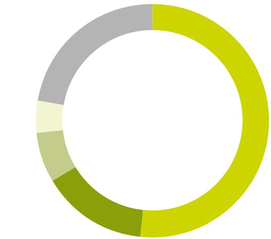  
Diversified shareholder base with long-term relationships

Temasek 51.8%  
Mitsubishi Corporation 14.6%  
Kewalram Chanrai Group 7.0%

Directors 4.4%  
Other institutional and public 22.2%

Note: As of end-2024, about  $6.9\%$  of total issued share capital was held by institutional investors. (Source: Nasdaq)

The Group regularly tracks and analyses changes to its shareholder base to ensure its various investor engagement and targeting programmes remain relevant and appropriate. Through systematic monitoring and detailed tracking of investor interactions, we can ensure targeted and meaningful communications while measuring the effectiveness of our outreach programmes and refining our investor relations approach and strategy.

# Financial report

206 Directors' statement  
211 Independent auditor's report  
215 Consolidated profit and loss account  
216 Consolidated statement of comprehensive income  
217 Balance sheet  
218 Statements of changes in equity  
221 Consolidated cash flow statement  
223 Notes to the Financial Statements  
287 Corporate information  
288 Shareholding information  
290 Notice of Annual General Meeting  
298 Addendum to the Annual Report 2024 Proxy form

# Directors' statement

The directors are pleased to present their statement to the members together with the audited consolidated financial statements of Olam Group Limited (the 'Company') and its subsidiary companies (the 'Group') and the balance sheet and statement of changes in equity of the Company for the financial year ended 31 December 2024.

# 1. Opinion of the directors

In the opinion of the directors,

i. the financial statements set out on pages 215 to 286 are drawn up so as to give a true and fair view of the financial position of the Group and of the Company as at 31 December 2024, changes in equity of the Group and of the Company, the financial performance and the cash flows of the Group for the financial year ended on that date; and  
ii. at the date of this statement there are reasonable grounds to believe that the Company will be able to pay its debts as and when they fall due.

# 2. Directors

The directors of the Company in office at the date of this statement are:-

Lim Ah Doo

Sunny George Verghese

Yap Chee Keong

Tran Phuoc (Lucas) (Appointed on 16 September 2024)

Marie Elaine Teo

Joerg Wolfgang Wolle (Dr.)

Ajai Puri (Dr.)

Nagi Adel Hamiyeh

Shuji Kobayashi

Yuji Tsushima (Appointed on 4 March 2024)

# 3. Arrangements to enable directors to acquire shares and debentures

Except as disclosed in this report, neither at the end of nor at any time during the financial year ended 31 December 2024 was the Company a party to any arrangement whose objects are, or one of whose objects is, to enable the directors of the Company to acquire benefits by means of the acquisition of shares or debentures of the Company or any other body corporate.

# 4. Directors' interests in shares and debentures

According to the register of the directors' shareholdings, none of the directors holding office at the end of the financial year had any interest in the shares or debentures of the Company or its related corporations, except as follows:

<table><tr><td rowspan="2">Name of directors</td><td colspan="3">Held in the name of the director or nominee</td><td colspan="3">Deemed interest</td></tr><tr><td>As at 1.1.2024 or date of appointment, if later</td><td>As at 31.12.2024</td><td>As at 21.1.2025</td><td>As at 1.1.2024 or date of appointment, if later</td><td>As at 31.12.2024</td><td>As at 21.1.2025</td></tr><tr><td colspan="7">The Company Olam Group Limited (a) Ordinary shares</td></tr><tr><td>Lim Ah Doo1</td><td>520,400</td><td>710,900</td><td>710,900</td><td>-</td><td>-</td><td>-</td></tr><tr><td>Sunny George Verghese1</td><td>167,131,277</td><td>168,145,095</td><td>168,145,095</td><td>-</td><td>-</td><td>-</td></tr><tr><td>Yap Chee Keong1</td><td>198,371</td><td>268,271</td><td>268,271</td><td>-</td><td>-</td><td>-</td></tr><tr><td>Marie Elaine Teo</td><td>173,900</td><td>241,000</td><td>241,000</td><td>-</td><td>-</td><td>-</td></tr><tr><td>Joerg Wolle (Dr.)1</td><td>63,298</td><td>104,798</td><td>104,798</td><td>-</td><td>-</td><td>-</td></tr><tr><td>Ajai Puri (Dr.)1</td><td>83,194</td><td>141,794</td><td>141,794</td><td>-</td><td>-</td><td>-</td></tr></table>

1. Held in trust by a trustee or nominee on behalf of the director.

# 4. Directors' interests in shares and debentures continued

<table><tr><td rowspan="2">Name of directors</td><td colspan="3">Held in the name of the director or nominee</td><td colspan="3">Deemed interest</td></tr><tr><td>As at 1.1.2024or date ofappointment,if later</td><td>As at31.12.2024</td><td>As at21.1.2025</td><td>As at 1.1.2024or date ofappointment,if later</td><td>As at31.12.2024</td><td>As at21.1.2025</td></tr><tr><td colspan="7">Subsidiaries of the Company&#x27;s ultimateholding company</td></tr><tr><td>Temasek Group of companies(a)Mapletree Logistics Trust Management Ltd(Units in Mapletree Logistics Trust)</td><td></td><td></td><td></td><td></td><td></td><td></td></tr><tr><td>Lim Ah Doo1</td><td>215,200</td><td>215,200</td><td>217,826</td><td>-</td><td>-</td><td>-</td></tr><tr><td>(b)Singapore Technologies Engineering Ltd(Ordinary Shares)</td><td></td><td></td><td></td><td></td><td></td><td></td></tr><tr><td>Lim Ah Doo1</td><td>126,200</td><td>126,200</td><td>138,500</td><td>-</td><td>-</td><td>-</td></tr><tr><td>(c)Mapletree Industrial Trust Management Ltd.(Units in Mapletree Industrial Trust)</td><td></td><td></td><td></td><td></td><td></td><td></td></tr><tr><td>Marie Elaine Teo</td><td>11,800</td><td>11,800</td><td>11,800</td><td>-</td><td>-</td><td>-</td></tr><tr><td>(d) Astrea VI Pte Ltd(3.00% bonds due 2031)</td><td></td><td></td><td></td><td></td><td></td><td></td></tr><tr><td>Yap Chee Keong</td><td>$30,000</td><td>$30,000</td><td>$30,000</td><td>-</td><td>-</td><td>-</td></tr><tr><td>(e) Ascott Residence Trust(3.88% fixed rate perpetual securities)</td><td></td><td></td><td></td><td></td><td></td><td></td></tr><tr><td>Yap Chee Keong</td><td>$250,000</td><td>-</td><td>-</td><td>-</td><td>-</td><td>-</td></tr><tr><td>(f) Musel Private Trust (Unit holdings)</td><td></td><td></td><td></td><td></td><td></td><td></td></tr><tr><td>Marie Elaine Teo</td><td>800</td><td>800</td><td>800</td><td>-</td><td>-</td><td>-</td></tr><tr><td>(g)Mapletree Real Estate Advisors Pte. Ltd.(Unit holdings in Mapletree Europe Income Trust(held through ADDX))</td><td></td><td></td><td></td><td></td><td></td><td></td></tr><tr><td>Marie Elaine Teo1</td><td>1,655</td><td>1,655</td><td>1,655</td><td>-</td><td>-</td><td>-</td></tr><tr><td>(h)Mapletree US Logistics Private Trust(MUSLOG)</td><td></td><td></td><td></td><td></td><td></td><td></td></tr><tr><td>Marie Elaine Teo</td><td>300</td><td>300</td><td>300</td><td>-</td><td>-</td><td>-</td></tr><tr><td>(i)Mapletree China Logistics Investment PrivateFund (MCLIP)</td><td></td><td></td><td></td><td></td><td></td><td></td></tr><tr><td>Marie Elaine Teo</td><td>200</td><td>200</td><td>200</td><td>-</td><td>-</td><td>-</td></tr></table>

1. Held in trust by a trustee or nominee on behalf of the director.

# 5. Share option scheme and share grant plan

These share plans are administered by the Nomination & Remuneration Committee ("NRC"), which comprises the following directors and co-opted member:-

Lim Ah Doo

Yap Chee Keong

Joerg Wolfgang Wolle (Dr.)

Shuji Kobayashi

Chan Wai Ching (Co-opted)

# Olam Group Share Grant Plan ("OG SGP")

The Company had adopted the Olam Group Share Grant Plan (the "OG SGP") at the Extraordinary Annual General Meeting on 18 February 2022 as part of Scheme of Arrangement exercise that was completed subsequently on 15 March 2022 with Olam Group Limited taking over the listing entity status on SGX-ST from Olam International Limited as part of the Re-organisation.

There was no issuance of share grants under the OG SGP in the financial year ended 31 December 2024. The OG SGP had expired on 30 October 2024.

# Jiva Employee Option Plan ("JEOP")

Jiva AG Pte. Ltd. ("Jiva"), an indirect subsidiary of the Company, has implemented the Jiva Employee Option Plan (the "JEOP") which was approved and adopted by the shareholders of Jiva on 19 April 2021.

JEOP was set up to provide its employees with an opportunity to share in the growth in the value of Jiva and to encourage them to improve the performance of Jiva and its subsidiaries (the "Jiva Group") and Jiva's return to shareholders; and enable Jiva to attract and retain skilled and experienced employees and motivate them to contribute to the success of the Jiva Group. Participation in the JEOP is restricted to directors and employees of the Jiva Group selected by the Jiva Board of Directors administering the JEOP ("Eligible Person"). Controlling shareholders of Jiva and their associates are not eligible to participate in the JEOP.

The total number of shares in the capital of Jiva which may be issued or delivered pursuant to the options granted under the JEOP on any date shall not exceed  $15\%$  of the total number of Jiva Shares (excluding any treasury shares and subsidiary holdings) on the day preceding that date. Until options vest and are exercised, participants will have no interest in the underlying Jiva shares, and options will not carry any shareholder rights (such as voting or dividend rights).

Jiva had granted an aggregate of 5,917,000 options under the JEOP to 185 Eligible Persons since the adoption of the plan. At the end of the current financial year, 4,174,718 (2023: 4,335,718) options remain outstanding for 132 (2023: 159) Eligible Persons. During the current financial year, the aggregate number of new shares issued pursuant to the JEOP did not exceed  $15\%$  of the issued share capital of Jiva.

# Terrascope Employee Option Plan ("TEOP")

Terrascope Pte. Ltd. ("Terrascope"), an indirect subsidiary of the Company, has implemented the Terrascope Employee Option Plan (the "TEOP") which was approved and adopted by the shareholders of Terrascope on 22 August 2022.

TEOP was set up to provide its employees with an opportunity to share in the growth in the value of Terrascope and to encourage them to improve the performance of Terrascope and its subsidiaries (the "Terrascope Group") and Terrascope's return to shareholders; and enable Terrascope to attract and retain skilled and experienced employees and motivate them to contribute to the success of the Terrascope Group. Participation in the TEOP is restricted to directors and employees of the Terrascope Group selected by the Terrascope Board of Directors administering the TEOP ("Eligible Person"). Controlling shareholders of Terrascope and their associates are not eligible to participate in the TEOP.

The total number of shares in the capital of Terrascope which may be issued or delivered pursuant to the options granted under the TEOP on any date shall not exceed  $15\%$  of the total number of Terrascope Shares (excluding any treasury shares and subsidiary holdings) on the day preceding that date. Until options vest and are exercised, participants will have no interest in the underlying Terrascope shares, and options will not carry any shareholder rights (such as voting or dividend rights).

Terrascope had granted an aggregate of 3,390,000 options under the TEOP to 32 Eligible Persons since the adoption of the plan. At the end of the current financial year, 1,340,000 (2023: 2,380,000) options remain outstanding for 21 (2023: 21) Eligible Persons. During the current financial year, the aggregate number of new shares issued pursuant to the TEOP did not exceed  $15\%$  of the issued share capital of Terrascope.

# 5. Share option scheme and share grant plan continued

# Mindsprint Employee Option Plan ("MEOP")

Mindsprint Pte. Ltd. ("Mindsprint"), an indirect subsidiary of the Company, has implemented the Mindsprint Employee Option Plan (the "MEOP") which was approved and adopted by the shareholders of Mindsprint on 20 December 2023.

MEOP was set up to provide its employees with an opportunity to share in the growth in the value of Mindsprint and to encourage them to improve the performance of Mindsprint and its subsidiaries (the "Mindsprint Group") and Mindsprint's return to shareholders; and enable Mindsprint to attract and retain skilled and experienced employees and motivate them to contribute to the success of the Mindsprint Group. Participation in the MEOP is restricted to employees of the Mindsprint Group selected by the Mindsprint Board of Directors administering the MEOP ("Eligible Person"). Controlling shareholders of Mindsprint and their associates are not eligible to participate in the MEOP.

The total number of shares in the capital of Mindsprint which may be issued or delivered pursuant to the options granted under the MEOP on any date shall not exceed  $15\%$  of the total number of Mindsprint Shares (excluding any treasury shares and subsidiary holdings) on the day preceding that date. Until options vest and are exercised, participants will have no interest in the underlying Mindsprint shares, and options will not carry any shareholder rights (such as voting or dividend rights).

Mindsprint had granted an aggregate of 15,400,000 options under the MEOP to 27 Eligible Persons since the adoption of the plan. At the end of the current financial year, 13,000,000 options remain outstanding for 23 Eligible Persons. During the current financial year, the aggregate number of new shares issued pursuant to the MEOP did not exceed  $15\%$  of the issued share capital of Mindsprint.

# Restricted share awards granted under Olam International Limited Share Grant Plan

Olam International Limited ("OIL") had awarded Restricted Share Awards ("RSA") to eligible employees pursuant to the terms of the Olam Share Grant Plan adopted on 30 October 2014 and amended on 20 May 2020 and prior to its cancellation when the Scheme became effective on 15 March 2022 ("Scheme Effective Date"). For the RSA granted in FY2018, FY2019, FY2020 and FY2021 which would normally vest on 1 April 2022, the Olam International Nomination and Remuneration Committee ("Olam NRC") has approved their vesting by early March 2022. For the balance RSA, the Olam NRC has determined that a trust be set up by Olam Holdings to be used to satisfy the RSA and that unvested Shares ("OG Shares") under the RSA shall be issued and/or transferred by OIL to the trustee prior to the Scheme Effective Date to hold under the trust. The trustee will hold such OG Shares on trust so as to satisfy the outstanding RSA. The said OG Shares will be released by the trustee to the respective RSA holders in accordance with the original vesting schedule of the RSA, and subject to the same conditions for vesting as provided in the RSA and under the Olam SGP, save for limited exceptions in which the continued employment requirement may not apply.

52,887,753 OG Shares were issued and/or transferred by OIL to the trust when the Scheme became effective. As at the current financial year end, 17,601,888 (2023: 34,434,687) OG Shares remained unvested.

# 6. Audit and Risk Committee

This section is to be read in conjunction with the additional disclosures on the ARC provided in the Corporate Governance section of the Company's Annual Report to shareholders.

The Company had announced on 28 December 2023 that as of 1 January 2024, the Audit Committee (the “AC” or the Committee) was combined with the Board Risk Committee to form the Audit and Risk Committee (the “ARC” or “Committee”). The ARC comprises five Non-Executive Directors of which the majority are independent. The members of the ARC are Mr. Yap Chee Keong (Chairman), Mr. Tran Phuoc (Lucas), Ms. Marie Elaine Teo, Mr. Shuju Kobayashi and Dr. Ajai Puri.

The ARC performed its functions in accordance with the Companies Act 1967, the Listing Manual of the SGX-ST and the Code of Corporate Governance 2018, which include, amongst others, the following:

- Review of the Group's half-yearly and annual financial statements and quarterly business performance for recommendation to the Board;  
- Review of the salient accounting matters and legal and regulatory matters that may have a material impact on the financial statements and related compliance policies and programmes;  
- Review, with the external auditors, their scope of work, audit plans, the results of their examinations and evaluation of the Group's internal accounting control systems, the adequacy of the Company's system of accounting controls, the cooperation given by the Management of the Company to the external auditors;  
- Review the adequacy of the Group's material internal controls, including financial, operational, compliance and information technology controls and risk management systems through the integrated risk assurance framework;  
- Review the assurance given by the Group CEO and GCFO in relation to the adequacy and effectiveness of the Group's risk management and internal control systems;  
Review, with the internal auditors, their scope of work and organisation, their audit plans, quarterly report of the results of their audits of the business, operations and functions and whistle-blowers' reports;  
Review the adequacy, independence and effectiveness of the internal auditors;  
Review the adequacy, independence and objectivity of the external auditors; and  
Review the interested person transactions (as defined in Chapter 9 of the Listing Manual of the SGX-ST).

During the year under review, the ARC:

- held meetings with the external auditors and internal auditors in separate executive sessions to discuss any matters that these groups believed should be discussed privately with the ARC;  
made recommendations to the Board of Directors in relation to the external auditor's reappointment; and  
- reported key issues discussed and actions taken from the ARC meetings to the Board of Directors with such recommendations as the ARC considered appropriate.

The ARC has reviewed and considered the audit and non-audit arrangements and services provided by Ernst & Young LLP and considered the nature and extent of such arrangements and services performed by the external auditors. The Committee has opined that these arrangements and services would not affect the independence of Ernst & Young LLP.

The ARC has recommended to the Board the re-appointment of Ernst & Young LLP as independent external auditor of the Company at the forthcoming Annual General Meeting of the Company on 25 April 2025.

# 7. Auditor

Ernst & Young LLP have expressed their willingness to accept re-appointment as independent external auditor.

On behalf of the Board of Directors,

Lim Ah Doo

Director

Sunny George Verghese

Director

24 March 2025

# Independent Auditor's report

For the financial year ended 31 December 2024 To the Members of Olam Group Limited

# Report on the financial statements

We have audited the accompanying financial statements of Olam Group Limited (the 'Company') and its subsidiaries (collectively, the 'Group') set out on pages 215 to 286 which comprise the balance sheets of the Group and the Company as at 31 December 2024, the statements of changes in equity of the Group and the Company and the consolidated profit and loss account, consolidated statement of comprehensive income and consolidated cash flow statement of the Group for the financial year then ended, and a material accounting policy information and other explanatory information.

In our opinion, the accompanying consolidated financial statements of the Group, the balance sheet and the statement of changes in equity of the Company are properly drawn up in accordance with the provisions of the Companies Act 1967 (the "Act") and Singapore Financial Reporting Standards (International) in Singapore (the "SFRS(I)s") so as to give a true and fair view of the consolidated financial position of the Group and the financial position of the Company as at 31 December 2024 and of the consolidated financial performance, consolidated changes in equity and consolidated cash flows of the Group and changes in equity of the Company for the year ended on that date.

# Basis for opinion

We conducted our audit in accordance with Singapore Standards on Auditing (SSAs). Our responsibilities under those standards are further described in the Auditor's Responsibilities for the Audit of the Financial Statements section of our report. We are independent of the Group in accordance with the Accounting and Corporate Regulatory Authority (ACRA) Code of Professional Conduct and Ethics for Public Accountants and Accounting Entities (the "ACRA Code") together with the ethical requirements that are relevant to our audit of the financial statements in Singapore, and we have fulfilled our other ethical responsibilities in accordance with these requirements and the ACRA Code. We believe that the audit evidence we have obtained is sufficient and appropriate to provide a basis for our opinion.

# Key audit matters

Key audit matters are those matters that, in our professional judgement, were of most significance in our audit of the financial statements of the current period. These matters were addressed in the context of our audit of the financial statements as a whole, and in forming our opinion thereon, and we do not provide a separate opinion on these matters. For each matter below, our description of how our audit addressed the matter is provided in that context.

We have fulfilled our responsibilities described in the Auditor's responsibilities for the audit of the financial statements section of our report, including in relation to these matters. Accordingly, our audit included the performance of procedures designed to respond to our assessment of the risks of material misstatement of the financial statements. The results of our audit procedures, including the procedures performed to address the matters below, provide the basis for our audit opinion on the accompanying financial statements.

1. Impairment assessment of property, plant and equipment, goodwill and indefinite/finite life intangible assets

The Group has significant property, plant and equipment, goodwill and indefinite/finite life intangible assets as disclosed in Notes 11 and 12 to the financial statements. Management performs periodic and annual impairment reviews of goodwill, intangible assets with indefinite/finite life and impairment assessments for identified property, plant and equipment where there are indications of impairment. Recoverable values of the property, plant and equipment, goodwill and indefinite/finite life intangible assets are determined based on fair value less costs to sell or value in use assessment where relevant and are performed by management with the help of independent professional valuers where applicable. These assessments involve judgement exercised in fair value less costs to sell and in value in use assessments, future revenues (yield), operating costs, growth rates and discount rates. The estimates and assumptions used in the cashflow projections which form the basis of recoverable amounts require significant judgement due to the inherent estimation uncertainty. As such, we have considered this to be a key audit matter.

For fair value less costs to sell calculation where an independent professional valuer is involved, we have reviewed, with the assistance of our internal valuation specialist, the competence, capabilities and objectivity of the independent professional valuer, evaluated the appropriateness of methodology used in the fair valuation report, tested the information and key assumptions used in the fair valuation report by comparing prices used to the internal and external sources of data and the available market prices at year end and checked the computational accuracy of the valuations and evaluated the reasonableness of the outcomes by considering reasonably plausible changes to the key assumptions.

# Key audit matters continued

For the value in use assessment, we have obtained the business units' cash flow forecasts assessment prepared by management and evaluated the reasonableness of management's key assumptions including forecast cash flows focusing on revenues and earnings before interest, tax, depreciation and amortisation ('EBITDA'). We also assessed the appropriateness of discount rates with the assistance of our internal valuation specialist where required and growth rates to historical and market trends to assess the reliability of management's forecast.

We also reviewed the adequacy of the Group's disclosures in relation to property, plant and equipment, goodwill and indefinite/finite life intangible assets as disclosed in Notes 11 and 12 to the financial statements.

# 2. Valuation of biological assets

The Group operates various farms and plantations for which the dairy cows, poultry, agricultural produce ('fruits on trees') and annual crops are accounted for at fair value. These significant biological assets are fair valued by management and/or independent professional valuers engaged by the Group using industry/market accepted valuation methodology and approaches. As the measurement of fair value involves judgement on the assumptions and estimates used considering that climate risks factors could have an impact on the key assumptions, we have considered this to be a key audit matter.

We obtained the valuations of biological assets prepared by management and/or independent professional valuers engaged by the Group. We reviewed the fair value reports, together with our internal valuation specialists where required, for appropriateness of the fair value methodology used and reasonableness of the key assumptions used, including forecast cash flows, discount rates, yield rates for the plantations and market prices of the fruits or nuts/crop and livestock. To the extent that independent professional valuers are involved, we reviewed the competence, capabilities and objectivity and evaluated the appropriateness of the valuation models used by independent professional valuers.

We also reviewed the adequacy of the Group's disclosures in relation to biological assets as disclosed in Note 13 to the financial statements.

# 3. Valuation of financial instruments

The Group entered into various financial instruments which are required to be carried at fair value as disclosed in Notes 34 and 35 to the financial statements. These include fair value of financial assets and financial liabilities relating to Level 3 financial instruments. Estimation uncertainty is high for these financial instruments where significant valuation inputs are unobservable and judgement is involved on the assumptions and estimates used and therefore, this is considered a key audit matter.

We have reviewed and assessed the controls over identification, measurement and management of valuation risk, and evaluated the methodologies, inputs and assumptions used by the Group in determining fair values as at year end. We have evaluated the assumptions and models used or performed an independent valuation to assess the reasonableness of the computed fair value with the help of our internal valuation specialist where required. The review also included testing of the evidence supporting significant unobservable inputs utilised in Level 3 measurements in the fair value hierarchy as outlined in Notes 34 and 35 to the financial statements, which included assessing management's valuation assumptions against independent proxy price quotes, recent transactions and other verifiable supporting documentation.

We have also reviewed the adequacy of disclosures of fair value risks and sensitivities in Notes 34 and 35 to the financial statement to reflect the Group's exposure to valuation risk.

# Information other than the Financial Statements and Auditor's Report Thereon

Management is responsible for the other information. The other information in the Annual Report 2024 comprises the information included in (i) Strategic Report, (ii) Governance Report and (iii) Directors' Statement (within the Financial Report) sections, but does not include the financial statements and our auditor's report thereon. Our opinion on the financial statements does not cover the other information and we do not express any form of assurance conclusion thereon.

In connection with our audit of the financial statements, our responsibility is to read the other information and, in doing so, consider whether the other information is materially inconsistent with the financial statements or our knowledge obtained in the audit or otherwise appears to be materially misstated. We have nothing to report in this regard.

# Responsibilities of Management and Directors for the Financial Statements

Management is responsible for the preparation of financial statements that give a true and fair view in accordance with the provisions of the Act and SFRS(l)s, and for devising and maintaining a system of internal accounting controls sufficient to provide a reasonable assurance that assets are safeguarded against loss from unauthorised use or disposition; and transactions are properly authorised and that they are recorded as necessary to permit the preparation of true and fair financial statements and to maintain accountability of assets.

In preparing the financial statements, management is responsible for assessing the Group's ability to continue as a going concern, disclosing, as applicable, matters related to going concern and using the going concern basis of accounting unless management either intends to liquidate the Group or to cease operations, or has no realistic alternative but to do so.

The directors' responsibilities include overseeing the Group's financial reporting process.

# Auditor's responsibilities for the Audit of the Financial Statements

Our objectives are to obtain reasonable assurance about whether the financial statements as a whole are free from material misstatement, whether due to fraud or error, and to issue an auditor's report that includes our opinion. Reasonable assurance is a high level of assurance, but is not a guarantee that an audit conducted in accordance with SSAs will always detect a material misstatement when it exists. Misstatements can arise from fraud or error and are considered material if, individually or in the aggregate, they could reasonably be expected to influence the economic decisions of users taken on the basis of these financial statements.

As part of an audit in accordance with SSAs, we exercise professional judgement and maintain professional scepticism throughout the audit. We also:

- Identify and assess the risks of material misstatement of the financial statements, whether due to fraud or error, design and perform audit procedures responsive to those risks, and obtain audit evidence that is sufficient and appropriate to provide a basis for our opinion. The risk of not detecting a material misstatement resulting from fraud is higher than for one resulting from error, as fraud may involve collusion, forgery, intentional omissions, misrepresentations, or the override of internal control.  
- Obtain an understanding of internal control relevant to the audit in order to design audit procedures that are appropriate in the circumstances, but not for the purpose of expressing an opinion on the effectiveness of the Group's internal control.  
- Evaluate the appropriateness of accounting policies used and the reasonableness of accounting estimates and related disclosures made by management.  
- Conclude on the appropriateness of management's use of the going concern basis of accounting and, based on the audit evidence obtained, whether a material uncertainty exists related to events or conditions that may cast significant doubt on the Group's ability to continue as a going concern. If we conclude that a material uncertainty exists, we are required to draw attention in our auditor's report to the related disclosures in the financial statements or, if such disclosures are inadequate, to modify our opinion. Our conclusions are based on the audit evidence obtained up to the date of our auditor's report. However, future events or conditions may cause the Group to cease to continue as a going concern.  
- Evaluate the overall presentation, structure and content of the financial statements, including the disclosures, and whether the financial statements represent the underlying transactions and events in a manner that achieves fair presentation.  
- Plan and perform the group audit to obtain sufficient appropriate audit evidence regarding the financial information of the entities or business units within the group as a basis for forming an opinion on the group financial statements. We are responsible for the direction, supervision and review of the audit work performed for purposes of the group audit. We remain solely responsible for our audit opinion.

Independent Auditor's report continued

For the financial year ended 31 December 2024

To the Members of Olam Group Limited

# Auditor's responsibilities for the Audit of the Financial Statements continued

We communicate with the directors regarding, among other matters, the planned scope and timing of the audit and significant audit findings, including any significant deficiencies in internal control that we identify during our audit.

We also provide the directors with a statement that we have complied with relevant ethical requirements regarding independence, and to communicate with them all relationships and other matters that may reasonably be thought to bear on our independence, and where applicable, related safeguards.

From the matters communicated with the directors, we determine those matters that were of most significance in the audit of the financial statements of the current period and are therefore the key audit matters. We describe these matters in our auditor's report unless law or regulation precludes public disclosure about the matter or when, in extremely rare circumstances, we determine that a matter should not be communicated in our report because the adverse consequences of doing so would reasonably be expected to outweigh the public interest benefits of such communication.

# Report on other legal and regulatory requirements

In our opinion, the accounting and other records required by the Act to be kept by the Company and by those subsidiary corporations incorporated in Singapore of which we are the auditors have been properly kept in accordance with the provisions of the Act.

The engagement partner on the audit resulting in this independent auditor's report is Lee Wei Hock.

Ernst & Young LLP

Public Accountants and

Chartered Accountants Singapore

24 March 2025

# Consolidated Profit and Loss Account

For the financial year ended 31 December 2024

<table><tr><td rowspan="2"></td><td rowspan="2">Note</td><td colspan="2">Group</td></tr><tr><td>2024$&#x27;000</td><td>2023$&#x27;000</td></tr><tr><td>Sale of goods and services</td><td>4</td><td>56,158,492</td><td>48,271,991</td></tr><tr><td>Other income</td><td>5</td><td>122,947</td><td>126,304</td></tr><tr><td>Operating expenses – direct</td><td>6</td><td>(51,319,000)</td><td>(44,032,505)</td></tr><tr><td>Net gain from changes in fair value of biological assets</td><td>13</td><td>176,051</td><td>66,304</td></tr><tr><td>Depreciation and amortisation</td><td>10, 11, 12</td><td>(755,655)</td><td>(721,008)</td></tr><tr><td>Other expenses</td><td>7</td><td>(2,585,561)</td><td>(2,169,090)</td></tr><tr><td>Finance income</td><td></td><td>181,737</td><td>157,972</td></tr><tr><td>Finance costs</td><td>8</td><td>(1,757,897)</td><td>(1,291,061)</td></tr><tr><td>Share of results from joint ventures and associates</td><td></td><td>(19,645)</td><td>1,968</td></tr><tr><td>Profit before taxation</td><td></td><td>201,469</td><td>410,875</td></tr><tr><td>Income tax expense</td><td>9</td><td>(73,135)</td><td>(59,878)</td></tr><tr><td>Profit for the financial year</td><td></td><td>128,334</td><td>350,997</td></tr><tr><td>Attributable to:</td><td></td><td></td><td></td></tr><tr><td>Owners of the Company</td><td></td><td>86,423</td><td>278,721</td></tr><tr><td>Non-controlling interests</td><td></td><td>41,911</td><td>72,276</td></tr><tr><td></td><td></td><td>128,334</td><td>350,997</td></tr><tr><td>Earnings per share attributable to owners of the Company (cents)</td><td></td><td></td><td></td></tr><tr><td>Basic</td><td>25</td><td>1.43</td><td>6.50</td></tr><tr><td>Diluted</td><td>25</td><td>1.41</td><td>6.41</td></tr></table>

# Consolidated Statement of Comprehensive Income

For the financial year ended 31 December 2024

<table><tr><td rowspan="2"></td><td colspan="2">Group</td></tr><tr><td>2024
$&#x27;000</td><td>2023
$&#x27;000</td></tr><tr><td>Profit for the financial year</td><td>128,334</td><td>350,997</td></tr><tr><td>Other comprehensive income</td><td></td><td></td></tr><tr><td>Items that may be reclassified subsequently to profit or loss:</td><td></td><td></td></tr><tr><td>Net (loss)/gain on fair value changes during the financial year</td><td>(57,534)</td><td>11,479</td></tr><tr><td>Recognised in the profit and loss account on occurrence of hedged transactions</td><td>33,136</td><td>(9,154)</td></tr><tr><td>Foreign currency translation adjustments</td><td>(58,511)</td><td>(440,872)</td></tr><tr><td>Share of other comprehensive income of joint ventures and associates</td><td>(15,811)</td><td>7,003</td></tr><tr><td>Other comprehensive income for the year, net of tax</td><td>(98,720)</td><td>(431,544)</td></tr><tr><td>Total comprehensive income for the year</td><td>29,614</td><td>(80,547)</td></tr><tr><td>Attributable to:</td><td></td><td></td></tr><tr><td>Owners of the Company</td><td>(12,344)</td><td>(60,644)</td></tr><tr><td>Non-controlling interests</td><td>41,958</td><td>(19,903)</td></tr><tr><td></td><td>29,614</td><td>(80,547)</td></tr></table>

<table><tr><td rowspan="3"></td><td rowspan="3">Note</td><td colspan="2">Group</td><td colspan="2">Company</td></tr><tr><td>2024</td><td>2023</td><td>2024</td><td>2023</td></tr><tr><td>$&#x27;000</td><td>$&#x27;000</td><td>$&#x27;000</td><td>$&#x27;000</td></tr><tr><td colspan="6">Non-current assets</td></tr><tr><td>Property, plant and equipment</td><td>11</td><td>6,032,756</td><td>6,082,671</td><td>-</td><td>-</td></tr><tr><td>Right-of-use assets</td><td>10</td><td>905,017</td><td>791,032</td><td>-</td><td>-</td></tr><tr><td>Intangible assets</td><td>12</td><td>2,571,500</td><td>2,537,749</td><td>-</td><td>-</td></tr><tr><td>Biological assets</td><td>13</td><td>673,492</td><td>557,025</td><td>-</td><td>-</td></tr><tr><td>Subsidiary companies</td><td>14</td><td>-</td><td>-</td><td>6,364,945</td><td>6,153,355</td></tr><tr><td>Deferred tax assets</td><td>9</td><td>520,085</td><td>321,828</td><td>-</td><td>-</td></tr><tr><td>Investments in joint ventures and associates</td><td>15</td><td>253,981</td><td>277,383</td><td>-</td><td>-</td></tr><tr><td>Other non-current assets</td><td>21</td><td>54,868</td><td>66,039</td><td>-</td><td>-</td></tr><tr><td></td><td></td><td>11,011,699</td><td>10,633,727</td><td>6,364,945</td><td>6,153,355</td></tr><tr><td colspan="6">Current assets</td></tr><tr><td>Amounts due from subsidiary companies (net)</td><td>16</td><td>-</td><td>-</td><td>520,150</td><td>643,410</td></tr><tr><td>Trade receivables</td><td>17</td><td>4,276,922</td><td>3,336,467</td><td>-</td><td>-</td></tr><tr><td>Margin accounts with brokers</td><td>18</td><td>1,219,193</td><td>-</td><td>-</td><td>-</td></tr><tr><td>Inventories</td><td>19</td><td>16,091,950</td><td>9,810,052</td><td>-</td><td>-</td></tr><tr><td>Advance payments to suppliers</td><td>20</td><td>700,457</td><td>870,678</td><td>-</td><td>-</td></tr><tr><td>Cash and short-term deposits</td><td>33</td><td>3,329,674</td><td>3,581,626</td><td>921</td><td>13,998</td></tr><tr><td>Derivative financial instruments</td><td>34</td><td>7,403,316</td><td>3,952,664</td><td>-</td><td>-</td></tr><tr><td>Other current assets</td><td>21</td><td>1,192,473</td><td>1,162,282</td><td>-</td><td>-</td></tr><tr><td></td><td></td><td>34,213,985</td><td>22,713,769</td><td>521,071</td><td>657,408</td></tr><tr><td>Non-current assets held for sale</td><td>21</td><td>-</td><td>1,145</td><td>-</td><td>-</td></tr><tr><td></td><td></td><td>34,213,985</td><td>22,714,914</td><td>521,071</td><td>657,408</td></tr><tr><td colspan="6">Current liabilities</td></tr><tr><td>Trade payables and accruals</td><td>22</td><td>(5,001,718)</td><td>(4,989,691)</td><td>(2,448)</td><td>(3,033)</td></tr><tr><td>Margin accounts with brokers</td><td>18</td><td>-</td><td>(189,549)</td><td>-</td><td>-</td></tr><tr><td>Borrowings</td><td>24</td><td>(9,811,858)</td><td>(6,419,392)</td><td>-</td><td>-</td></tr><tr><td>Lease liabilities</td><td>24</td><td>(162,733)</td><td>(131,039)</td><td>-</td><td>-</td></tr><tr><td>Derivative financial instruments</td><td>34</td><td>(8,336,354)</td><td>(3,041,608)</td><td>-</td><td>-</td></tr><tr><td>Provision for taxation</td><td></td><td>(290,105)</td><td>(261,790)</td><td>-</td><td>-</td></tr><tr><td>Other current liabilities</td><td>23</td><td>(612,537)</td><td>(420,981)</td><td>-</td><td>-</td></tr><tr><td></td><td></td><td>(24,215,305)</td><td>(15,454,050)</td><td>(2,448)</td><td>(3,033)</td></tr><tr><td>Net current assets</td><td></td><td>9,998,680</td><td>7,260,864</td><td>518,623</td><td>654,375</td></tr><tr><td colspan="6">Non-current liabilities</td></tr><tr><td>Deferred tax liabilities</td><td>9</td><td>(491,754)</td><td>(416,512)</td><td>-</td><td>-</td></tr><tr><td>Borrowings</td><td>24</td><td>(12,168,175)</td><td>(8,893,315)</td><td>-</td><td>-</td></tr><tr><td>Lease liabilities</td><td>24</td><td>(952,027)</td><td>(850,125)</td><td>-</td><td>-</td></tr><tr><td>Other non-current liabilities</td><td>23</td><td>(79,647)</td><td>(66,124)</td><td>-</td><td>-</td></tr><tr><td></td><td></td><td>(13,691,603)</td><td>(10,226,076)</td><td>-</td><td>-</td></tr><tr><td>Net assets</td><td></td><td>7,318,776</td><td>7,668,515</td><td>6,883,568</td><td>6,807,730</td></tr><tr><td colspan="6">Equity attributable to owners of the Company</td></tr><tr><td>Share capital</td><td>26</td><td>6,233,595</td><td>6,233,595</td><td>6,233,595</td><td>6,233,595</td></tr><tr><td>Treasury shares</td><td>26</td><td>(59,014)</td><td>(31,046)</td><td>(59,014)</td><td>(31,046)</td></tr><tr><td>Shares held in trust</td><td>26</td><td>(36,473)</td><td>(62,206)</td><td>-</td><td>-</td></tr><tr><td>Capital securities</td><td>26</td><td>603,314</td><td>603,314</td><td>603,314</td><td>603,314</td></tr><tr><td>Reserves</td><td></td><td>268,476</td><td>583,790</td><td>105,673</td><td>1,867</td></tr><tr><td></td><td></td><td>7,009,898</td><td>7,327,447</td><td>6,883,568</td><td>6,807,730</td></tr><tr><td>Non-controlling interests</td><td></td><td>308,878</td><td>341,068</td><td>-</td><td>-</td></tr><tr><td>Total equity</td><td></td><td>7,318,776</td><td>7,668,515</td><td>6,883,568</td><td>6,807,730</td></tr></table>

# Statements of Changes in Equity

For the financial year ended 31 December 2024

<table><tr><td colspan="15">Attributable to owners of the Company</td></tr><tr><td>31 December 2024Group</td><td>Share capital(Note 26) $&#x27;000</td><td>Treasury shares(Note 26) $&#x27;000</td><td>Share held in trust(Note 26) $&#x27;000</td><td>Capital securities(Note 26) $&#x27;000</td><td>Capital reserves1 $&#x27;000</td><td>Foreign currency translation reserves2 $&#x27;000</td><td>Fair value adjustment reserves3 $&#x27;000</td><td>Share-based compensation reserves4 $&#x27;000</td><td>Revenue reserves $&#x27;000</td><td>Total reserves $&#x27;000</td><td>Total non-controlling interests $&#x27;000</td><td>Total equity $&#x27;000</td><td></td><td></td></tr><tr><td>At 1 January 2024</td><td>6,233,595</td><td>(31,046)</td><td>(62,206)</td><td>603,314</td><td>(362,075)</td><td>(1,972,773)</td><td>(38,528)</td><td>160,679</td><td>2,796,487</td><td>583,790</td><td>7,327,447</td><td>341,068</td><td>7,668,515</td><td></td></tr><tr><td>Profit for the financial year</td><td>-</td><td>-</td><td>-</td><td>-</td><td>-</td><td>-</td><td>-</td><td>-</td><td>86,423</td><td>86,423</td><td>86,423</td><td>41,911</td><td>128,334</td><td></td></tr><tr><td>Other comprehensive income</td><td></td><td></td><td></td><td></td><td></td><td></td><td></td><td></td><td></td><td></td><td></td><td></td><td></td><td></td></tr><tr><td>Net loss on fair value changes during the financial year</td><td>-</td><td>-</td><td>-</td><td>-</td><td>-</td><td>-</td><td>(57,534)</td><td>-</td><td>-</td><td>(57,534)</td><td>(57,534)</td><td>-</td><td>(57,534)</td><td></td></tr><tr><td>Recognised in the profit and loss account on occurrence of hedged transactions</td><td>-</td><td>-</td><td>-</td><td>-</td><td>-</td><td>-</td><td>33,136</td><td>-</td><td>-</td><td>33,136</td><td>33,136</td><td>-</td><td>33,136</td><td></td></tr><tr><td>Foreign currency translation adjustments</td><td>-</td><td>-</td><td>-</td><td>-</td><td>-</td><td>(58,558)</td><td>-</td><td>-</td><td>-</td><td>(58,558)</td><td>(58,558)</td><td>47</td><td>(58,511)</td><td></td></tr><tr><td>Share of other comprehensive income of joint ventures and associates</td><td>-</td><td>-</td><td>-</td><td>-</td><td>-</td><td>(15,811)</td><td>-</td><td>-</td><td>-</td><td>(15,811)</td><td>(15,811)</td><td>-</td><td>(15,811)</td><td></td></tr><tr><td>Other comprehensive income for the financial year, net of tax</td><td>-</td><td>-</td><td>-</td><td>-</td><td>-</td><td>(74,369)</td><td>(24,398)</td><td>-</td><td>-</td><td>(98,767)</td><td>(98,767)</td><td>47</td><td>(98,720)</td><td></td></tr><tr><td>Total comprehensive income for the year</td><td>-</td><td>-</td><td>-</td><td>-</td><td>-</td><td>(74,369)</td><td>(24,398)</td><td>-</td><td>86,423</td><td>(12,344)</td><td>(12,344)</td><td>41,958</td><td>29,614</td><td></td></tr><tr><td>Contributions by and distributions to owners</td><td></td><td></td><td></td><td></td><td></td><td></td><td></td><td></td><td></td><td></td><td></td><td></td><td></td><td></td></tr><tr><td>Transfer to share-based compensation reserve on vesting</td><td>-</td><td>-</td><td>25,733</td><td>-</td><td>-</td><td>-</td><td>-</td><td>(25,733)</td><td>-</td><td>(25,733)</td><td>-</td><td>-</td><td>-</td><td></td></tr><tr><td>Share-based expense</td><td>-</td><td>-</td><td>-</td><td>-</td><td>-</td><td>-</td><td>-</td><td>21,149</td><td>-</td><td>21,149</td><td>21,149</td><td>-</td><td>21,149</td><td></td></tr><tr><td>Purchase of treasury shares</td><td>-</td><td>(28,468)</td><td>-</td><td>-</td><td>-</td><td>-</td><td>-</td><td>-</td><td>-</td><td>-</td><td>(28,468)</td><td>-</td><td>(28,468)</td><td></td></tr><tr><td>Issue of treasury shares for director fees</td><td>-</td><td>500</td><td>-</td><td>-</td><td>-</td><td>-</td><td>-</td><td>-</td><td>-</td><td>-</td><td>500</td><td>-</td><td>500</td><td></td></tr><tr><td>Dividends on ordinary shares(Note 27)</td><td>-</td><td>-</td><td>-</td><td>-</td><td>-</td><td>-</td><td>-</td><td>-</td><td>(265,805)</td><td>(265,805)</td><td>(265,805)</td><td>-</td><td>(265,805)</td><td></td></tr><tr><td>Dividend paid to Minority Shareholder</td><td>-</td><td>-</td><td>-</td><td>-</td><td>-</td><td>-</td><td>-</td><td>-</td><td>-</td><td>-</td><td>-</td><td>(74,148)</td><td>(74,148)</td><td></td></tr><tr><td>Accrued capital securities distribution</td><td>-</td><td>-</td><td>-</td><td>32,581</td><td>-</td><td>-</td><td>-</td><td>-</td><td>(32,581)</td><td>(32,581)</td><td>-</td><td>-</td><td>-</td><td></td></tr><tr><td>Payment of capital securities distribution</td><td>-</td><td>-</td><td>-</td><td>(32,581)</td><td>-</td><td>-</td><td>-</td><td>-</td><td>-</td><td>-</td><td>(32,581)</td><td>-</td><td>(32,581)</td><td></td></tr><tr><td>Total contributions by and distributions to owners</td><td>-</td><td>(27,968)</td><td>25,733</td><td>-</td><td>-</td><td>-</td><td>-</td><td>(4,584)</td><td>(298,386)</td><td>(302,970)</td><td>(305,205)</td><td>(74,148)</td><td>(379,353)</td><td></td></tr><tr><td>Total transactions with owners in their capacity as owners</td><td>-</td><td>(27,968)</td><td>25,733</td><td>-</td><td>-</td><td>-</td><td>-</td><td>(4,584)</td><td>(298,386)</td><td>(302,970)</td><td>(305,205)</td><td>(74,148)</td><td>(379,353)</td><td></td></tr><tr><td>At 31 December 2024</td><td>6,233,595</td><td>(59,014)</td><td>(36,473)</td><td>603,314</td><td>(362,075)</td><td>(2,047,142)</td><td>(62,926)</td><td>156,095</td><td>2,584,524</td><td>268,476</td><td>7,009,898</td><td>308,878</td><td>7,318,776</td><td></td></tr></table>

Attributable to owners of the Company  

<table><tr><td>31 December 2023
Group</td><td>Share capital
(Note 26)
$&#x27;000</td><td>Treasury
shares
(Note 26)
$&#x27;000</td><td>Share
held in
trust
(Note 26)
$&#x27;000</td><td>Capital
securities
(Note 26)
$&#x27;000</td><td>Capital
reserves1
$&#x27;000</td><td>Foreign
currency
translation
reserves2
$&#x27;000</td><td>Fair value
adjustment
reserves2
$&#x27;000</td><td>Share-based
compensation
reserves3
$&#x27;000</td><td>Revenue
reserves
$&#x27;000</td><td>Total
reserves
$&#x27;000</td><td>Total
$&#x27;000</td><td>Total non-
controlling
interests
$&#x27;000</td><td>Total
equity
$&#x27;000</td></tr><tr><td>At 1 January 2023</td><td>6,233,595</td><td>(6,543)</td><td>(88,173)</td><td>603,453</td><td>(+11,848)</td><td>(1,631,083)</td><td>(+40,853)</td><td>163,580</td><td>2,836,970</td><td>916,766</td><td>7,659,098</td><td>423,613</td><td>8,082,711</td></tr><tr><td>Hyperinflation restatement to
1 January 2023*</td><td>-</td><td>-</td><td>-</td><td>-</td><td>-</td><td>-</td><td>-</td><td>-</td><td>1,001</td><td>1,001</td><td>1,001</td><td>-</td><td>1,001</td></tr><tr><td>At 1 January 2023 (Restated)</td><td>6,233,595</td><td>(6,543)</td><td>(88,173)</td><td>603,453</td><td>(+11,848)</td><td>(1,631,083)</td><td>(+40,853)</td><td>163,580</td><td>2,837,971</td><td>917,767</td><td>7,660,099</td><td>423,613</td><td>8,083,712</td></tr><tr><td>Profit for the financial year</td><td>-</td><td>-</td><td>-</td><td>-</td><td>-</td><td>-</td><td>-</td><td>-</td><td>278,721</td><td>278,721</td><td>278,721</td><td>72,276</td><td>350,997</td></tr><tr><td>Other comprehensive income</td><td></td><td></td><td></td><td></td><td></td><td></td><td></td><td></td><td></td><td></td><td></td><td></td><td></td></tr><tr><td>Net gain on fair value changes
during the financial year</td><td>-</td><td>-</td><td>-</td><td>-</td><td>-</td><td>-</td><td>11,479</td><td>-</td><td>-</td><td>11,479</td><td>11,479</td><td>-</td><td>11,479</td></tr><tr><td>Recognised in the profit and
loss account on occurrence
of hedged transactions</td><td>-</td><td>-</td><td>-</td><td>-</td><td>-</td><td>-</td><td>(9,154)</td><td>-</td><td>-</td><td>(9,154)</td><td>(9,154)</td><td>-</td><td>(9,154)</td></tr><tr><td>Foreign currency
translation adjustments</td><td>-</td><td>-</td><td>-</td><td>-</td><td>-</td><td>(348,693)</td><td>-</td><td>-</td><td>-</td><td>(348,693)</td><td>(348,693)</td><td>(92,179)</td><td>(440,872)</td></tr><tr><td>Share of other comprehensive
income of joint ventures
and associates</td><td>-</td><td>-</td><td>-</td><td>-</td><td>-</td><td>7,003</td><td>-</td><td>-</td><td>-</td><td>7,003</td><td>7,003</td><td>-</td><td>7,003</td></tr><tr><td>Other comprehensive income
for the financial year, net of tax</td><td>-</td><td>-</td><td>-</td><td>-</td><td>-</td><td>(341,690)</td><td>2,325</td><td>-</td><td>-</td><td>(339,365)</td><td>(339,365)</td><td>(92,179)</td><td>(431,544)</td></tr><tr><td>Total comprehensive income
for the year</td><td>-</td><td>-</td><td>-</td><td>-</td><td>-</td><td>(341,690)</td><td>2,325</td><td>-</td><td>278,721</td><td>(60,644)</td><td>(60,644)</td><td>(19,903)</td><td>(80,547)</td></tr><tr><td>Contributions by and
distributions to owners</td><td></td><td></td><td></td><td></td><td></td><td></td><td></td><td></td><td></td><td></td><td></td><td></td><td></td></tr><tr><td>Transfer to share-based
compensation reserve on
vesting</td><td>-</td><td>-</td><td>25,967</td><td>-</td><td>-</td><td>-</td><td>-</td><td>(25,967)</td><td>-</td><td>(25,967)</td><td>-</td><td>-</td><td>-</td></tr><tr><td>Share-based expense</td><td>-</td><td>-</td><td>-</td><td>-</td><td>-</td><td>-</td><td>-</td><td>23,066</td><td>-</td><td>23,066</td><td>23,066</td><td>-</td><td>23,066</td></tr><tr><td>Purchase of treasury shares</td><td>-</td><td>(24,870)</td><td>-</td><td>-</td><td>-</td><td>-</td><td>-</td><td>-</td><td>-</td><td>-</td><td>(24,870)</td><td>-</td><td>(24,870)</td></tr><tr><td>Issue of treasury shares for
director fees</td><td>-</td><td>367</td><td>-</td><td>-</td><td>-</td><td>-</td><td>-</td><td>-</td><td>-</td><td>-</td><td>367</td><td>-</td><td>367</td></tr><tr><td>Dividends on ordinary shares
(Note 27)</td><td>-</td><td>-</td><td>-</td><td>-</td><td>-</td><td>-</td><td>-</td><td>-</td><td>(287,714)</td><td>(287,714)</td><td>(287,714)</td><td>-</td><td>(287,714)</td></tr><tr><td>Dividend paid to Minority
Shareholder</td><td>-</td><td>-</td><td>-</td><td>-</td><td>-</td><td>-</td><td>-</td><td>-</td><td>-</td><td>-</td><td>-</td><td>(53,229)</td><td>(53,229)</td></tr><tr><td>Accrued capital securities
distribution</td><td>-</td><td>-</td><td>-</td><td>32,491</td><td>-</td><td>-</td><td>-</td><td>-</td><td>(32,491)</td><td>(32,491)</td><td>-</td><td>-</td><td>-</td></tr><tr><td>Payment of capital securities
distribution</td><td>-</td><td>-</td><td>-</td><td>(32,630)</td><td>-</td><td>-</td><td>-</td><td>-</td><td>-</td><td>-</td><td>(32,630)</td><td>-</td><td>(32,630)</td></tr><tr><td>Total contributions by and
distributions to owners</td><td>-</td><td>(24,503)</td><td>25,967</td><td>(139)</td><td>-</td><td>-</td><td>-</td><td>(2,901)</td><td>(320,205)</td><td>(323,106)</td><td>(321,781)</td><td>(53,229)</td><td>(375,010)</td></tr><tr><td>Changes in ownership interests
in subsidiaries</td><td></td><td></td><td></td><td></td><td></td><td></td><td></td><td></td><td></td><td></td><td></td><td></td><td></td></tr><tr><td>Acquisition of non-controlling
interests without a change in
control</td><td>-</td><td>-</td><td>-</td><td>-</td><td>(17,582)</td><td>-</td><td>-</td><td>-</td><td>-</td><td>(17,582)</td><td>(17,582)</td><td>(12,358)</td><td>(29,940)</td></tr><tr><td>Sale of minority stake in
subsidiary without change in
control^</td><td>-</td><td>-</td><td>-</td><td>-</td><td>67,355</td><td>-</td><td>-</td><td>-</td><td>-</td><td>67,355</td><td>67,355</td><td>-</td><td>67,355</td></tr><tr><td>Proceeds from non-controlling
Interest</td><td>-</td><td>-</td><td>-</td><td>-</td><td>-</td><td>-</td><td>-</td><td>-</td><td>-</td><td>-</td><td>-</td><td>2,945</td><td>2,945</td></tr><tr><td>Total changes in ownership
interests in subsidiaries</td><td>-</td><td>-</td><td>-</td><td>-</td><td>49,773</td><td>-</td><td>-</td><td>-</td><td>-</td><td>49,773</td><td>49,773</td><td>(9,413)</td><td>40,360</td></tr><tr><td>Total transactions with owners
in their capacity as owners</td><td>-</td><td>(24,503)</td><td>25,967</td><td>(139)</td><td>49,773</td><td>-</td><td>-</td><td>(2,901)</td><td>(320,205)</td><td>(273,333)</td><td>(272,008)</td><td>(62,642)</td><td>(334,650)</td></tr><tr><td>At 31 December 2023</td><td>6,233,595</td><td>(31,046)</td><td>(62,206)</td><td>603,314</td><td>(362,075)</td><td>(1,972,773)</td><td>(38,528)</td><td>160,679</td><td>2,796,487</td><td>583,790</td><td>7,327,447</td><td>341,068</td><td>7,668,515</td></tr></table>

* In 2023, the Ghana economy was declared to be hyperinflationary. As a result, SFRS(I) 1-29 Financial Reporting in Hyperinflationary Economies has been applied to the Ghana subsidiary company whose functional currency is the Ghanaian Cedi. The results and financial position of the Group's Ghana subsidiary company was restated to the measuring unit current at the end of the period, with hyperinflationary gains and losses in respect of monetary items being reported in the Profit & Loss account under "Other expenses".  
This relates to the additional amount of US$50,310,000 (approximately S$67,355,000) received during the year ended 31 December 2023 in relation to a post-closing adjustment set out in the share purchase agreement on sale of 35.43% minority stake in Olam Agri Holdings Limited to the SALIC International Investment Company in 2022.

<table><tr><td rowspan="2">31 December 2024Company</td><td colspan="8">Attributable to owners of the Company</td></tr><tr><td>Sharecapital(Note 26) $&#x27;000</td><td>Treasuryshares(Note 26) $&#x27;000</td><td>Capitalsecurities(Note 26) $&#x27;000</td><td>Foreigncurrencytranslationreserves2 $&#x27;000</td><td>Fair valueadjustmentreserves3 $&#x27;000</td><td>Revenuereserves$&#x27;000</td><td>Totalreserves$&#x27;000</td><td>Total$&#x27;000</td></tr><tr><td>At 1 January 2024</td><td>6,233,595</td><td>(31,046)</td><td>603,314</td><td>(217,358)</td><td>5,864</td><td>213,361</td><td>1,867</td><td>6,807,730</td></tr><tr><td>Profit for the financial year</td><td>-</td><td>-</td><td>-</td><td>-</td><td>-</td><td>204,127</td><td>204,127</td><td>204,127</td></tr><tr><td>Other comprehensive income</td><td></td><td></td><td></td><td></td><td></td><td></td><td></td><td></td></tr><tr><td>Net loss on fair value changes during the financial year</td><td>-</td><td>-</td><td>-</td><td>-</td><td>(31,875)</td><td>-</td><td>(31,875)</td><td>(31,875)</td></tr><tr><td>Foreign currency translation adjustments</td><td>-</td><td>-</td><td>-</td><td>229,940</td><td>-</td><td>-</td><td>229,940</td><td>229,940</td></tr><tr><td>Other comprehensive income for the financial year, net of tax</td><td>-</td><td>-</td><td>-</td><td>229,940</td><td>(31,875)</td><td>-</td><td>198,065</td><td>198,065</td></tr><tr><td>Total comprehensive income for the year</td><td>-</td><td>-</td><td>-</td><td>229,940</td><td>(31,875)</td><td>204,127</td><td>402,192</td><td>402,192</td></tr><tr><td>Contributions by and distributions to owners</td><td></td><td></td><td></td><td></td><td></td><td></td><td></td><td></td></tr><tr><td>Purchase of treasury shares</td><td>-</td><td>(28,468)</td><td>-</td><td>-</td><td>-</td><td>-</td><td>-</td><td>(28,468)</td></tr><tr><td>Issue of treasury shares for directors&#x27; fees</td><td>-</td><td>500</td><td>-</td><td>-</td><td>-</td><td>-</td><td>-</td><td>500</td></tr><tr><td>Dividends on ordinary shares (Note 27)</td><td>-</td><td>-</td><td>-</td><td>-</td><td>-</td><td>(265,805)</td><td>(265,805)</td><td>(265,805)</td></tr><tr><td>Accrued capital securities distribution</td><td>-</td><td>-</td><td>32,581</td><td>-</td><td>-</td><td>(32,581)</td><td>(32,581)</td><td>-</td></tr><tr><td>Payment of capital securities distribution</td><td>-</td><td>-</td><td>(32,581)</td><td>-</td><td>-</td><td>-</td><td>-</td><td>(32,581)</td></tr><tr><td>Total contributions by and distributions to owners</td><td>-</td><td>(27,968)</td><td>-</td><td>-</td><td>-</td><td>(298,386)</td><td>(298,386)</td><td>(326,354)</td></tr><tr><td>Total transactions with owners in their capacity as owners</td><td>-</td><td>(27,968)</td><td>-</td><td>-</td><td>-</td><td>(298,386)</td><td>(298,386)</td><td>(326,354)</td></tr><tr><td>At 31 December 2024</td><td>6,233,595</td><td>(59,014)</td><td>603,314</td><td>12,582</td><td>(26,011)</td><td>119,102</td><td>105,673</td><td>6,883,568</td></tr></table>

<table><tr><td colspan="9">Attributable to owners of the Company</td></tr><tr><td>31 December 2023Company</td><td>Sharecapital(Note 26) $&#x27;000</td><td>Treasuryshares(Note 26) $&#x27;000</td><td>Capitalsecurities(Note 26) $&#x27;000</td><td>Foreigncurrencytranslationreserves2 $&#x27;000</td><td>Fair valueadjustmentreserves3 $&#x27;000</td><td>Revenuereserves $&#x27;000</td><td>Totalreserves $&#x27;000</td><td>Total$&#x27;000</td></tr><tr><td>At 1 January 2023</td><td>6,233,595</td><td>(6,543)</td><td>603,453</td><td>(117,623)</td><td>4,941</td><td>175,485</td><td>62,803</td><td>6,893,308</td></tr><tr><td>Profit for the financial year</td><td>-</td><td>-</td><td>-</td><td>-</td><td>-</td><td>358,081</td><td>358,081</td><td>358,081</td></tr><tr><td>Other comprehensive income</td><td></td><td></td><td></td><td></td><td></td><td></td><td></td><td></td></tr><tr><td>Net gain on fair value changes during the financial year</td><td>-</td><td>-</td><td>-</td><td>-</td><td>923</td><td>-</td><td>923</td><td>923</td></tr><tr><td>Foreign currency translation adjustments</td><td>-</td><td>-</td><td>-</td><td>(99,735)</td><td>-</td><td>-</td><td>(99,735)</td><td>(99,735)</td></tr><tr><td>Other comprehensive income for the financial year, net of tax</td><td>-</td><td>-</td><td>-</td><td>(99,735)</td><td>923</td><td>-</td><td>(98,812)</td><td>(98,812)</td></tr><tr><td>Total comprehensive income for the year</td><td>-</td><td>-</td><td>-</td><td>(99,735)</td><td>923</td><td>358,081</td><td>259,269</td><td>259,269</td></tr><tr><td>Contributions by and distributions to owners</td><td></td><td></td><td></td><td></td><td></td><td></td><td></td><td></td></tr><tr><td>Purchase of treasury shares</td><td>-</td><td>(24,870)</td><td>-</td><td>-</td><td>-</td><td>-</td><td>-</td><td>(24,870)</td></tr><tr><td>Issue of treasury shares for directors&#x27; fees</td><td>-</td><td>367</td><td>-</td><td>-</td><td>-</td><td>-</td><td>-</td><td>367</td></tr><tr><td>Dividends on ordinary shares (Note 27)</td><td>-</td><td>-</td><td>-</td><td>-</td><td>-</td><td>(287,714)</td><td>(287,714)</td><td>(287,714)</td></tr><tr><td>Accrued capital securities distribution</td><td>-</td><td>-</td><td>32,491</td><td>-</td><td>-</td><td>(32,491)</td><td>(32,491)</td><td>-</td></tr><tr><td>Payment of capital securities distribution</td><td>-</td><td>-</td><td>(32,630)</td><td>-</td><td>-</td><td>-</td><td>-</td><td>(32,630)</td></tr><tr><td>Total contributions by and distributions to owners</td><td>-</td><td>(24,503)</td><td>(139)</td><td>-</td><td>-</td><td>(320,205)</td><td>(320,205)</td><td>(344,847)</td></tr><tr><td>Total transactions with owners in their capacity as owners</td><td>-</td><td>(24,503)</td><td>(139)</td><td>-</td><td>-</td><td>(320,205)</td><td>(320,205)</td><td>(344,847)</td></tr><tr><td>At 31 December 2023</td><td>6,233,595</td><td>(31,046)</td><td>603,314</td><td>(217,358)</td><td>5,864</td><td>213,361</td><td>1,867</td><td>6,807,730</td></tr></table>

# 1. Capital reserves

Capital reserves represent the premium paid and discounts on acquisition of non-controlling interests, gain on partial disposal of subsidiary which did not result in loss of control, residual amount of convertible bonds net of proportionate share of transaction costs, after deducting the fair value of the debt and derivative component on the date of issuance and the share of capital reserve of a joint venture.

# 2. Foreign currency translation reserves

The foreign currency translation reserves are used to record exchange differences arising from the translation of the financial statements of the Company and the Group's foreign operations whose functional currencies are different from that of the Group's presentation currency as well as the share of foreign currency translation reserves of joint ventures and associates.

# 3. Fair value adjustment reserves

Fair value adjustment reserves record the portion of the fair value changes on derivative financial instruments designated as hedging instruments in cash flow hedges that are determined to be effective hedges.

# 4. Share-based compensation reserves

Share-based compensation reserves represent the equity-settled shares and share options granted to employees. The reserve is made up of the cumulative value of services received from employees recorded over the vesting period commencing from the grant date of equity-settled shares and share options and is reduced by the expiry of the share options.

# Consolidated Cash Flow Statement

For the financial year ended 31 December 2024

<table><tr><td></td><td>2024</td><td>2023</td></tr><tr><td></td><td>$'000</td><td>$'000</td></tr><tr><td>Cash flows from operating activities</td><td></td><td></td></tr><tr><td>Profit before taxation</td><td>201,469</td><td>410,875</td></tr><tr><td>Adjustments for:</td><td></td><td></td></tr><tr><td>Allowance for doubtful debts</td><td>26,780</td><td>17,970</td></tr><tr><td>Amortisation of intangible assets, depreciation of property, plant and equipment and depreciation of right-of-use assets</td><td>755,655</td><td>721,008</td></tr><tr><td>Share-based expense</td><td>21,149</td><td>23,066</td></tr><tr><td>Fair value gain on biological assets (Note 13)</td><td>(176,051)</td><td>(66,304)</td></tr><tr><td>Gain on disposal of joint venture and associate, net (Note 5 and 7)</td><td>(739)</td><td>(6,400)</td></tr><tr><td>Loss/(gain) on disposal and write-off of property, plant and equipment and intangible assets (Note 5 and 7)</td><td>29,936</td><td>(6,404)</td></tr><tr><td>Impairment of investment in joint venture (Note 7)</td><td>-</td><td>22</td></tr><tr><td>Interest income</td><td>(181,737)</td><td>(157,972)</td></tr><tr><td>Interest expense</td><td>1,757,897</td><td>1,291,061</td></tr><tr><td>Inventories written down, net (Note 19)</td><td>80,974</td><td>30,489</td></tr><tr><td>Net monetary (gain)/loss arising from hyperinflationary economies</td><td>(6,364)</td><td>275</td></tr><tr><td>Share of results from joint ventures and associates</td><td>19,645</td><td>(1,968)</td></tr><tr><td>Operating cash flows before reinvestment in working capital</td><td>2,528,614</td><td>2,255,718</td></tr><tr><td>Increase in inventories</td><td>(5,981,034)</td><td>(1,197,768)</td></tr><tr><td>Decrease/(increase) in receivables and other current assets</td><td>1,096,376</td><td>(679,035)</td></tr><tr><td>Decrease/(increase) in advance payments to suppliers</td><td>190,430</td><td>(306,708)</td></tr><tr><td>(Increase)/decrease in margin account with brokers</td><td>(1,387,985)</td><td>253,443</td></tr><tr><td>Increase in payables and other current liabilities</td><td>8,768</td><td>705,221</td></tr><tr><td>Cash flows (used in)/generated from operations</td><td>(3,544,831)</td><td>1,030,871</td></tr><tr><td>Interest income received</td><td>181,737</td><td>157,972</td></tr><tr><td>Interest expense paid</td><td>(1,728,996)</td><td>(1,288,125)</td></tr><tr><td>Tax paid</td><td>(226,117)</td><td>(235,315)</td></tr><tr><td>Net cash flows used in operating activities</td><td>(5,318,207)</td><td>(334,597)</td></tr><tr><td>Cash flows from investing activities</td><td></td><td></td></tr><tr><td>Proceeds from disposal of property, plant and equipment</td><td>71,520</td><td>42,870</td></tr><tr><td>Proceeds from disposal of intangible assets</td><td>19,057</td><td>4</td></tr><tr><td>Purchase of property, plant and equipment</td><td>(657,896)</td><td>(662,974)</td></tr><tr><td>Purchase of intangible assets (Note 12)</td><td>(34,996)</td><td>(33,689)</td></tr><tr><td>Acquisition of subsidiaries, net of cash acquired (Note 12)</td><td>(19,510)</td><td>204</td></tr><tr><td>Investment/loan to associates and joint ventures, net</td><td>(4,556)</td><td>(537)</td></tr><tr><td>Dividends received from associates and joint ventures</td><td>5,452</td><td>5,671</td></tr><tr><td>Sale proceeds and advance received from sale of joint venture</td><td>2,131</td><td>904</td></tr><tr><td>Proceeds from divestment of subsidiary</td><td>-</td><td>67,355</td></tr><tr><td>Net cash flows used in investing activities</td><td>(618,798)</td><td>(580,192)</td></tr><tr><td></td><td>$’000</td><td>$’000</td></tr><tr><td>Cash flows from financing activities</td><td></td><td></td></tr><tr><td>Dividends paid on ordinary shares by the Company</td><td>(265,805)</td><td>(287,714)</td></tr><tr><td>Dividend paid to non-controlling interest shareholder</td><td>(74,148)</td><td>(53,229)</td></tr><tr><td>Acquisition of non-controlling interest</td><td>-</td><td>(29,940)</td></tr><tr><td>Proceeds from non-controlling interest</td><td>-</td><td>2,945</td></tr><tr><td>Proceeds from borrowings, net</td><td>5,923,834</td><td>370,462</td></tr><tr><td>Repayment of lease liabilities</td><td>(154,291)</td><td>(159,397)</td></tr><tr><td>Payment of capital securities, net of distribution</td><td>(32,581)</td><td>(32,630)</td></tr><tr><td>Purchase of treasury shares</td><td>(28,468)</td><td>(24,870)</td></tr><tr><td>Net cash flows generated from/(used in) financing activities</td><td>5,368,541</td><td>(214,373)</td></tr><tr><td>Net effect of exchange rate changes on cash and cash equivalents</td><td>(38,559)</td><td>(243,718)</td></tr><tr><td>Net decrease in cash and cash equivalents</td><td>(607,023)</td><td>(1,372,880)</td></tr><tr><td>Cash and cash equivalents at beginning of period</td><td>3,225,954</td><td>4,598,834</td></tr><tr><td>Cash and cash equivalents at end of period (Note 33)</td><td>2,618,931</td><td>3,225,954</td></tr></table>

# Notes to the Financial Statements

For the financial year ended 31 December 2024

These notes form an integral part of the financial statements.

The financial statements for the financial year ended 31 December 2024 were authorised for issue by the Board of Directors on 24 March 2025.

# 1. Corporate information

Olam Group Limited (the 'Company') is a limited liability company, which is domiciled and incorporated in Singapore. The Company is listed on the Singapore Exchange Securities Trading Limited (SGX-ST).

The Company's immediate holding company is Temasek Capital (Private) Limited and its ultimate holding company is Temasek Holdings (Private) Limited; both companies are incorporated in Singapore.

The principal activities of the Company are those of investment holding. The principal activities of the significant subsidiaries are disclosed in Note 14.

The registered office and principal place of business of the Company is at 7 Straits View, #20-01 Marina One East Tower, Singapore 018936.

# 2. Material accounting policy information

# 2.1 Basis of preparation

The consolidated financial statements of the Company and its subsidiary companies collectively, the Group, and the balance sheet and statement of changes in equity of the Company have been prepared in accordance with Singapore Financial Reporting Standards (International) (SFRS(I)).

The financial statements have been prepared on a historical cost basis except as disclosed in the accounting policies below.

The areas involving a higher degree of judgement or complexity, or areas where assumptions and estimates are significant to the financial statements are disclosed in Note 3.

The financial statements are presented in Singapore Dollars ( $or SGD) and all values in the tables are rounded to the nearest thousand ($ ’000) as indicated.

# 2.2 Changes in accounting policies

The accounting policies adopted are consistent with the previous financial year except that in the current financial year, the Group has adopted all the new and revised standards which are effective for annual financial periods beginning on or after 1 January 2024. The adoption of these standards did not have any effect on the financial performance or position of the Group and the Company with the exception of the following as discussed below.

# 2. Material accounting policy information continued

# 2.3 Standards issued but not yet effective

The Group has not adopted the following standards and interpretations that have been issued but are not yet effective:

<table><tr><td>Description</td><td>Effective for financial year beginning on</td></tr><tr><td>Amendments to SFRS(I) 1-21, SFRS(I) 1: Lack of Exchangeability</td><td>1 January 2025</td></tr><tr><td>Amendments to SFRS(I) 9 &amp; SFRS(I) 7: Amendments to the Classification and Measurement of Financial Instruments</td><td>1 January 2026</td></tr><tr><td>Annual Improvements to SFRS(I)s - Volume 11</td><td>1 January 2026</td></tr><tr><td>Amendments to SFRS(I) 9 &amp; SFRS(I) 7: Contracts Referencing Nature-dependent Electricity</td><td>1 January 2026</td></tr><tr><td>SFRS(I) 18 Presentation and Disclosure in Financial Statements</td><td>1 January 2027</td></tr><tr><td>SFRS(I) 19 Subsidiaries without Public Accountability: Disclosures</td><td>1 January 2027</td></tr><tr><td>Amendments to SFRS(I) 10 &amp; SFRS(I) 1-28 Sale or Contribution of Assets between an Investor and its Associate or Joint Venture</td><td>Date to be determined</td></tr></table>

Except for SFRS(I) 18 Presentation and Disclosure in Financial Statements, the directors expect that the adoption of the other standards and interpretations above will have no material impact on the financial statements in the period of initial application. The nature of the impending changes in accounting policy on adoption of SFRS(I) 18 Presentation and Disclosure in Financial Statements is described below.

# SFRS(I) 1-18 Presentation and Disclosure in Financial Statements

In April 2024, SFRS(I) 18, which replaces SFRS(I) 1-1 Presentation of Financial Statements. SFRS(I) 18 introduces new requirements for presentation within the statement of profit or loss, including specified totals and subtotals was issued. Furthermore, entities are required to classify all income and expenses within the statement of profit or loss into one of five categories: operating, investing, financing, income taxes and discontinued operations, whereof the first three are new.

It also requires disclosure of newly defined management-defined performance measures, subtotals of income and expenses, and includes new requirements for aggregation and disaggregation of financial information based on the identified 'roles' of the primary financial statements (PFS) and the notes.

In addition, narrow-scope amendments have been made to SFRS(I) 1-7 Statement of Cash Flows, which include changing the starting point for determining cash flows from operations under the indirect method, from 'profit or loss' to 'operating profit or loss' and removing the optionality around classification of cash flows from dividends and interest. In addition, there are consequential amendments to several other standards.

SFRS(I) 18, and the amendments to the other standards, is effective for reporting periods beginning on or after 1 January 2027, but earlier application is permitted and must be disclosed. SFRS(I) 18 will apply retrospectively.

The Group is currently working to identify all impacts the amendments will have on the primary financial statements and notes to the financial statements.

# 2. Material accounting policy information continued

# 2.4 Functional and foreign currency

The Group's consolidated financial statements are presented in Singapore Dollars as the Company is domiciled in Singapore.

The Company's functional currency is the United States Dollar ('USD'), which reflects the economic substance of the underlying events and circumstances of the Company as most of the Company's transactions are denominated in USD. Each entity in the Group determines its own functional currency and items included in the financial statements of each entity are measured using that functional currency.

# a. Transactions and balances

Transactions in foreign currencies are measured in the respective functional currencies of the Company and its subsidiaries and are recorded on initial recognition in the functional currencies at exchange rates approximating those ruling at the transaction dates. Monetary assets and liabilities denominated in foreign currencies are translated at the rate of exchange ruling at the balance sheet date. Non-monetary items that are measured in terms of historical cost in a foreign currency are translated using the exchange rates as at the dates of the initial transactions. Non-monetary items measured at fair value in a foreign currency are translated using the exchange rates at the date when the fair value was measured.

The foreign currency translation reserve is reclassified from equity to profit or loss of the Group on disposal of the foreign operation.

# b. Consolidated financial statements

For consolidation purpose, the assets and liabilities of foreign operations are translated into USD at the rate of exchange ruling at the balance sheet date and their profit or loss are translated at the weighted average exchange rates for the year. The exchange differences arising on the translation are recognised in other comprehensive income. On disposal of a foreign operation, the component of other comprehensive income relating to that particular foreign operation is recognised in profit or loss.

In the case of a partial disposal without loss of control of a subsidiary that includes a foreign operation, the proportionate share of the cumulative amount of the exchange differences are re-attributed to non-controlling interest and are not recognised in profit or loss. For partial disposals of associates or joint ventures that are foreign operations, the proportionate share of the accumulated exchange differences is reclassified to profit or loss.

# c. Translation to the presentation currency

The financial statements are presented in Singapore Dollar ('SGD') as the Company's principal place of business is in Singapore.

The financial statements are translated from USD to SGD as follows:-

- Assets and liabilities for each balance sheet presented are translated at the closing rate ruling at that balance sheet date;  
- Income and expenses for each profit and loss account are translated at average exchange rates for the year, which approximates the exchange rates at the dates of the transactions; and  
- All exchange differences arising on the translation are included in the foreign currency translation reserves.

# 2. Material accounting policy information continued

# 2.5 Subsidiary companies, basis of consolidation, business combinations and held for sale

# a. Subsidiary companies

A subsidiary is an investee that is controlled by the Group. The Group controls an investee when it is exposed, or has rights, to variable returns from its involvement with the investee and has the ability to affect those returns through its power over the investee. In the Company's separate financial statements, investments in subsidiaries are accounted for at cost less impairment losses.

A list of the Group's significant subsidiary companies is shown in Note 14.

# b. Basis of consolidation

The consolidated financial statements comprise the financial statements of the Company and its subsidiaries as at the end of the reporting period. The financial statements of the subsidiaries used in the preparation of the consolidated financial statements are prepared for the same reporting date as the Company. Consistent accounting policies are applied to like transactions and events in similar circumstances.

All intra-group balances, income and expenses and unrealised gains and losses resulting from intra-group transactions and dividends are eliminated in full.

Subsidiaries are consolidated from the date of acquisition, being the date on which the Group obtains control, and continue to be consolidated until the date that such control ceases.

Losses within a subsidiary are attributed to the non-controlling interest even if that results in a deficit balance.

A change in the ownership interest of a subsidiary, without a loss of control, is accounted for as an equity transaction. If the Group loses control over a subsidiary, it:

- Derecognises the assets (including goodwill) and liabilities of the subsidiary at their carrying amounts at the date when control is lost;  
- Derecognises the carrying amount of any non-controlling interest;  
- Derecognises the cumulative translation differences recorded in equity;  
- Recognises the fair value of the consideration received;  
- Recognises the fair value of any investment retained;  
- Recognises any surplus or deficit in profit or loss;  
- Reclassifies the Group's share of components previously recognised in other comprehensive income to profit or loss or retained earnings, as appropriate.

# c. Business combinations and goodwill

Business combinations are accounted for by applying the acquisition method. Identifiable assets acquired and liabilities assumed in a business combination are measured initially at their fair values at the acquisition date. Acquisition-related costs are recognised as expenses in the periods in which the costs are incurred and the services are received.

Any contingent consideration to be transferred by the acquirer will be recognised at fair value at the acquisition date. Subsequent changes to the fair value of the contingent consideration which is deemed to be an asset or liability, will be recognised in profit or loss.

Non-controlling interest in the acquiree, that are present ownership interests and entitle their holders to a proportionate share of net assets of the acquiree are recognised on the acquisition date at either fair value, or the non-controlling interest's proportionate share of the acquiree's identifiable net assets.

Any excess of the sum of the fair value of the consideration transferred in the business combination, the amount of non-controlling interest in the acquiree (if any) and the fair value of the Group's previously held equity interest in the acquiree (if any) over the net fair value of the acquiree's identifiable assets and liabilities is recorded as goodwill. In instances where the latter amount exceeds the former, the excess is recognised as gain on bargain purchase in profit or loss on the acquisition date. The accounting policy for goodwill is set out in Note 2.10(a).

# 2. Material accounting policy information continued

# 2.5 Subsidiary companies, basis of consolidation, business combinations and held for sale continued

# d. Held for sale

Non-current assets and disposal groups classified as held for sale are measured at the lower of carrying amount and fair value less costs to sell. Non-current assets and disposal groups are classified as held for sale if their carrying amount will be recovered through a sale transaction rather than through continuing use. This condition is regarded as met only when the sale is highly probable and the asset or disposal group is available for immediate sale in its present condition. Management must be committed to the sale which should be expected to qualify for recognition as a completed sale within one year from the date of classification.

A discontinued operation is a component of an entity that either has been disposed or is classified as held for sale, and:

- represents a separate major line of business or geographical area of operations;  
- is part of a single co-ordinated plan to dispose of a major separate line of business or geographical area of operations; or  
- is a subsidiary acquired exclusively with a view to resale

# 2.6 Transactions with non-controlling interests

Non-controlling interest represents the equity in subsidiaries not attributable, directly or indirectly, to owners of the Company, and are presented separately in the consolidated profit and loss and within equity in the consolidated balance sheet, separately from equity attributable to owners of the Company.

Changes in the Company's interest in a subsidiary that do not result in a loss of control are accounted for as equity transactions. In such circumstances, the carrying amounts of the controlling and non-controlling interests are adjusted to reflect the changes in their relative interests in the subsidiary. Any difference between the amount by which the non-controlling interest is adjusted and the fair value of the consideration paid or received is recognised directly in equity and attributed to owners of the Company.

# 2.7 Joint arrangements

A joint arrangement is a contractual arrangement whereby two or more parties have joint control. Joint control is the contractually agreed sharing of control of an arrangement, which exists only when decisions about the relevant activities require the unanimous consent of the parties sharing control.

A joint arrangement is classified either as joint operation or joint venture, based on the rights and obligations of the parties to the arrangement.

To the extent the joint arrangement provides the Group with rights to the assets and obligations for the liabilities relating to the arrangement, the arrangement is a joint operation. To the extent the joint arrangement provides the Group with rights to the net assets of the arrangement, the arrangement is a joint venture.

The Group recognises its interest in a joint venture as an investment and accounts for the investment using the equity method. The accounting policy for investment in joint venture is set out in Note 2.8.

# 2. Material accounting policy information continued

# 2.8 Joint ventures and associates

An associate is an entity over which the Group has the power to participate in the financial and operating policy decisions of the investee but does not have control or joint control of those policies.

The Group accounts for its investments in associates and joint ventures using the equity method from the date on which it becomes an associate or joint venture.

On acquisition of the investment, any excess of the cost of the investment over the Group's share of the net fair value of the investee's identifiable assets and liabilities represents goodwill and is included in the carrying amount of the investment. Any excess of the Group's share of the net fair value of the investee's identifiable assets and liabilities over the cost of the investment is included as income in the determination of the entity's share of the associate or joint venture's profit or loss in the period in which the investment is acquired.

Under the equity method, the investments in associates or joint ventures are carried in the balance sheet at cost plus post-acquisition changes in the Group's share of net assets of the associates or joint ventures. The profit or loss reflects the share of results of the operations of the associates or joint ventures. Distributions received from joint ventures or associates reduce the carrying amount of the investment. Where there has been a change recognised in other comprehensive income by the associates or joint venture, the Group recognises its share of such changes in other comprehensive income. Unrealised gains and losses resulting from transactions between the Group and associate or joint ventures are eliminated to the extent of the interest in the associates or joint ventures.

When the Group's share of losses in an associate or joint venture equals or exceeds its interest in the associate or joint venture, the Group does not recognise further losses, unless it has incurred obligations or made payments on behalf of the associate or joint venture.

# 2.9 Property, plant and equipment

All items of property, plant and equipment are initially recorded at cost. Such cost includes the cost of replacing part of the property, plant and equipment and borrowing costs that are directly attributable to the acquisition, construction or production of a qualifying property, plant and equipment. The accounting policy for borrowing costs is set out in Note 2.16. The cost of an item of property, plant and equipment is recognised as an asset if, and only if, it is probable that future economic benefits associated with the item will flow to the Group and the cost of the item can be measured reliably.

Subsequent to recognition, all items of property, plant and equipment (except for freehold land) are stated at cost less accumulated depreciation and accumulated impairment losses. Freehold land has an unlimited useful life and therefore is not depreciated. Buildings and improvements are depreciable over the shorter of the estimated useful life of the asset or the lease period, where applicable.

Depreciation of an asset begins when it is available for use and is computed on a straight-line basis over the estimated useful life except for ginning assets of Queensland Cotton Holdings Pty Ltd., which are depreciated using the units of use method. The estimated useful life of the assets is as follows:-

Bearer plants

15 to 30 years

Buildings and improvements

5 to 50 years

Plant and machinery

3 to 25 years; 30 years for ginning assets

Motor vehicles

3 to 5 years

Furniture and fittings

5 years

Office equipment

5 years

Computers

3 years

Bearer plants - Immature plantations are stated at acquisition cost which includes costs incurred for field preparation, planting, farming inputs and maintenance, capitalisation of borrowing costs incurred on loans used to finance the development of immature plantations and an allocation of other indirect costs based on planted hectarage.

Capital work-in-progress is not depreciated as these assets are not yet available for use.

The carrying values of property, plant and equipment are reviewed for impairment when events or changes in circumstances indicate that the carrying value may not be recoverable.

An item of property, plant and equipment is derecognised upon disposal or when no future economic benefits are expected from its use or disposal. Any gain or loss on derecognition of the asset is included in the profit and loss account in the year the asset is derecognised.

# 2. Material accounting policy information continued

# 2.10 Intangible assets

# a. Goodwill

Goodwill is initially measured at cost. Following initial recognition, goodwill is measured at cost less any accumulated impairment losses.

For the purpose of impairment testing, goodwill acquired in a business combination is, from the acquisition date, allocated to each of the Group's cash-generating units that are expected to benefit from the synergies of the combination, irrespective of whether other assets or liabilities of the acquiree are assigned to those units.

The cash-generating unit to which goodwill has been allocated is tested for impairment annually and whenever there is an indication that the cash-generating unit may be impaired. Impairment is determined for goodwill by assessing the recoverable amount of each cash-generating unit (or group of cash-generating units) to which the goodwill relates. Where the recoverable amount of the cash-generating unit is less than the carrying amount, an impairment loss is recognised in the profit and loss account. Impairment losses recognised for goodwill are not reversed in subsequent periods.

Where goodwill forms part of a cash-generating unit and part of the operation within that unit is disposed of, the goodwill associated with the operation disposed of is included in the carrying amount of the operation when determining the gain or loss on disposal of the operation. Goodwill disposed of in this circumstance is measured based on the relative fair values of the operations disposed of and the portion of the cash-generating unit retained.

# b. Other intangible assets

Intangible assets acquired separately are measured initially at cost. Following initial acquisition, intangible assets are measured at cost less any accumulated amortisation and accumulated impairment losses.

The useful lives of intangible assets are assessed as either finite or indefinite.

Intangible assets with finite useful lives are amortised on a straight-line basis over the estimated useful lives and assessed for impairment whenever there is an indication that the intangible asset may be impaired. The amortisation period and the amortisation method are reviewed at least at each financial year end. Changes in the expected useful life or the expected pattern of consumption of future economic benefits embodied in the asset is accounted for by changing the amortisation period or method, as appropriate, and are treated as changes in accounting estimates.

Intangible assets with indefinite useful lives or that are not yet available for use are not subject to amortisation and they are tested for impairment annually or more frequently if the events and circumstances indicate that the carrying value may be impaired either individually or at the cash-generating unit level. Such intangible assets are not amortised. The useful life of an intangible asset with an indefinite useful life is reviewed annually to determine whether the useful life assessment continues to be supportable.

# 2. Material accounting policy information continued

# 2.11 Biological assets

# a. Agricultural produce ('Fruits on trees') and annual crops

The fair value of agricultural produce ('fruits on trees') is estimated using the discounted cash flow model, with any changes recognised in the profit or loss. The fair value takes into account yields, current market prices and related costs. The calculated value is then discounted by a suitable factor to take into account the agricultural risk until maturity.

The annual crops are carried at fair value based on the estimate of the price, yield and cost of the crop at harvest discounted for the remaining time to harvest. Where at any period end, little biological transformation has taken place since initial cost incurred (for example, for seedlings planted immediately prior to the end of a reporting period), the annual crops have been carried at cost which approximates fair value.

# b. Livestock

The fair value of livestock is estimated using the discounted cash flow model, with any resultant gain or loss recognised in the profit or loss. The fair value of livestock takes into account milk yields, market prices of livestock of similar age, breed and generic merit, related costs and discount factor to account for the agricultural risk of the livestock.

# c. Poultry

Poultry are stated at fair value less estimated costs to sell, with any resultant gain or loss recognised in the profit or loss. Costs to sell include all costs that would be necessary to sell the assets. The fair value of poultry is determined based on estimated market price of livestock of similar age, breed and generic merit.

Breeding chickens are carried at fair value, which approximates cost and are amortised over the economic egg-laying lives of the breeding chickens after they start producing eggs.

# 2.12 Impairment of non-financial assets

The Group assesses at each reporting date whether there is an indication that an asset may be impaired. If any indication exists, or when an annual impairment testing for an asset is required, the Group makes an estimate of the asset's recoverable amount. The Group makes an estimate of the asset's recoverable amount with the help of independent professional valuers where applicable.

An asset's recoverable amount is the higher of an asset's or cash-generating unit's fair value less costs of disposal and its value in use and is determined for an individual asset, unless the asset does not generate cash inflows that are largely independent of those from other assets or group of assets. In assessing value in use, the estimated future cash flows expected to be generated by the asset are discounted to their present value using a pre-tax discount rate that reflects current market assessments of the time value of money and the risks specific to the asset. In determining fair value less costs of disposal, recent market transactions are taken into account, if available. If no such transactions can be identified, an appropriate valuation model is used. Where the carrying amount of an asset exceeds its recoverable amount, the asset is written down to its recoverable amount.

Impairment losses are recognised in profit or loss. A previously recognised impairment loss is reversed only if there has been a change in the estimates used to determine the asset's recoverable amount since the last impairment loss was recognised. If that is the case, the carrying amount of the asset is increased to its recoverable amount. That increased amount cannot exceed the carrying amount that would have been determined, net of depreciation, had no impairment loss been recognised previously. Such reversal is recognised in profit or loss. Impairment losses relating to goodwill cannot be reversed in future periods.

# 2. Material accounting policy information continued

# 2.13 Financial instruments

# a. Financial assets

Initial recognition and measurement

Financial assets are recognised when, and only when, the Group becomes a party to the contractual provisions of the instruments. The Group determines the classification of its financial assets at initial recognition.

At initial recognition, the Group measures a financial asset at its fair value plus, in the case of a financial asset not at fair value through profit or loss, transaction costs that are directly attributable to the acquisition of the financial asset. Transaction costs of financial assets carried at fair value through profit or loss are expensed in profit or loss.

Trade receivables are measured at the amount of consideration to which the Group expects to be entitled in exchange for transferring promised goods or services to a customer, excluding amounts collected on behalf of third party, if the trade receivables do not contain a significant financing component at initial recognition.

# Subsequent measurement

Debt instruments - amortised costs

Financial assets that are held for the collection of contractual cash flows where those cash flows represent solely payments of principal and interest are measured at amortised cost. Financial assets are measured at amortised cost using the effective interest method, less impairment. Gains and losses are recognised in profit or loss when the assets are derecognised or impaired, and through amortisation process.

Derivatives

Derivatives are initially recognised at fair value on the date a derivative contract is entered into and are subsequently remeasured to their fair value at the end of each reporting period. Changes in fair value of derivatives are recognised in profit or loss.

# Impairment

For trade receivables, the Group applies a simplified approach in calculating expected credit losses ('ECLs'). The Group recognises a loss allowance based on lifetime ECLs at each reporting date. The Group has established a provision matrix that is based on its historical credit loss experience, adjusted for forward-looking factors specific to the debtors and the economic environment. This is similar for other financial assets on the balance sheet. Impairment losses are reflected in the allowance account of the respective financial asset class on the balance sheet:

- Loan to associate (Note 15)  
Amount due from subsidiary companies, net (Note 16)  
Trade receivables (Note 17)  
- Other current assets - Sundry receivables, export incentives and subsidies receivable, deposits, staff advances and insurance receivables (Note 21)

# Derecognition

A financial asset is derecognised when the contractual right to receive cash flows from the asset has expired. On derecognition of a financial asset in its entirety, the difference between the carrying amount and the sum of the consideration received and any cumulative gain or loss that had been recognised in other comprehensive income for debt instruments, is recognised in profit or loss.

# 2. Material accounting policy information continued

# 2.13 Financial instruments continued

# b. Financial liabilities

Initial recognition and measurement

Financial liabilities are recognised when, and only when, the Group becomes a party to the contractual provisions of the financial instrument. The Group determines the classification of its financial liabilities at initial recognition.

All financial liabilities are recognised initially at fair value plus, in the case of financial liabilities not at fair value through profit or loss, directly attributable transaction costs.

# Subsequent measurement

After initial recognition, financial liabilities that are not carried at fair value through profit or loss are subsequently measured at amortised cost using the effective interest method. Gains and losses are recognised in profit or loss when the liabilities are derecognised, and through the amortisation process.

# Derecognition

A financial liability is derecognised when the obligation under the liability is discharged or cancelled or expires. On derecognition, the difference between the carrying amounts and the consideration paid is recognised in profit or loss. When an existing financial liability is replaced by another from the same lender on substantially different terms, or the terms of an existing liability are substantially modified, such an exchange or modification is treated as a derecognition of the original liability and the recognition of a new liability and the difference in the respective carrying amounts are recognised in profit or loss.

# c. Offsetting of financial instruments

Financial assets and financial liabilities are offset and the net amount is presented in the balance sheets, when and only when, there is a currently enforceable legal right to set off the recognised amounts and there is an intention to settle on a net basis, or to realise the assets and settle the liabilities simultaneously.

# 2.14 Cash and cash equivalents

Cash and cash equivalents comprise cash and bank balances and short-term fixed bank deposits that are subject to an insignificant risk of changes in value. These also include bank overdrafts that form an integral part of the Group's cash management. Cash and cash equivalents carried in the balance sheets are classified and accounted as measured at amortised cost under SFRS(1) 9. The accounting policy for this category of financial assets is stated in Note 2.13.

# 2.15 Inventories

Inventories for commodity trading businesses are measured at fair value less costs to sell, with changes in fair value less costs to sell recognised in the profit or loss in the period of the change.

Other inventories are stated at the lower of cost and net realisable value and are valued on a weighted average cost basis. Net realisable value represents the estimated selling price in the ordinary course of business, less anticipated cost of disposal and after making allowance for damages and slow-moving items.

For fruits on trees that are harvested, these are stated at fair value less estimated point-of-sale costs at the time of harvest (the 'initial cost'). Thereafter these inventories are carried at the lower of initial cost and net realisable value.

Where necessary, allowance is provided for damaged, obsolete and slow-moving items to adjust the carrying value of inventories to the lower of cost and net realisable value.

# 2.16 Borrowing costs

Borrowing costs are capitalised as part of the cost of a qualifying asset if they are directly attributable to the acquisition, construction or production of that asset. Capitalisation of borrowing costs commences when the activities to prepare the asset for its intended use or sale are in progress and the expenditures and borrowing costs are incurred. Borrowing costs are capitalised until the assets are substantially completed for their intended use or sale. All other borrowing costs are expensed in the period they occur. Borrowing costs consist of interest and other costs that an entity incurs in connection with the borrowing of funds.

# 2. Material accounting policy information continued

# 2.17 Provisions

Provisions are recognised when the Group has a present obligation (legal or constructive) as a result of a past event, it is probable that an outflow of resources embodying economic benefits will be required to settle the obligation and the amount of the obligation can be estimated reliably.

Provisions are reviewed at each balance sheet date and adjusted to reflect the current best estimates. If it is no longer probable that an outflow of economic resources will be required to settle the obligation, the provision is reversed. If the effect of the time value of money is material, provisions are discounted using a current pre-tax rate that reflects, where appropriate, the risks specific to the liability. When discounting is used, the increase in the provision due to the passage of time is recognised as a finance cost.

# 2.18 Employee benefits

# a. Defined contribution plan

The Group participates in the national pension schemes as defined by the laws of countries in which it has operations. In particular, the Singapore companies in the Group make contributions to the Central Provident Fund scheme in Singapore, a defined contribution pension scheme. Contributions to defined contribution pension schemes are recognised as an expense in the period in which the related service is performed.

# b. Employee share options scheme/share grant plan

Employees (including senior executives) of the Group receive remuneration in the form of share options or shares as consideration for services rendered ('equity-settled transactions').

The cost of these equity-settled share-based payment transactions with employees is measured with reference to the fair value at the date on which the share subscriptions/options are granted which takes into account market conditions and non-vesting conditions.

This cost is recognised in the profit or loss, with a corresponding increase in the share-based compensation reserve, over the vesting period. The cumulative expense recognised at each reporting date until the vesting date reflects the extent to which the vesting period has expired and the Group's best estimate of the number of options that will ultimately vest. The charge or credit to the profit or loss for a period represents the movement in cumulative expense recognised as at the beginning and end of that period and is recognised in employee benefits expense.

No expense is recognised for options that do not ultimately vest, except for options where vesting is conditional upon a market condition or non-vesting condition, which are treated as vested irrespective of whether or not the market condition or non-vesting condition is satisfied, provided that all other performance and/or service conditions are satisfied. In the case where the option does not vest as the result of a failure to meet a non-vesting condition that is within the control of the Group or the employee, it is accounted for as a cancellation. In such case, the amount of the compensation cost that otherwise would be recognised over the remainder of the vesting period is recognised immediately in profit or loss upon cancellation.

Where the terms of an equity-settled award are modified, an expense is recognised as if the terms had not been modified. In addition, an expense is recognised for a modification, which increases the total fair value of the share-based payment arrangement, or is otherwise beneficial to the employee as measured at the date of modification.

Where an equity-settled award is cancelled, it is treated as if it has vested on the date of cancellation, and any expense not yet recognised for the award is recognised immediately. However, if a new award is substituted for the cancelled award, and designated as a replacement award on the date that it is granted, the cancelled and new awards are treated as if they were a modification of the original award, as described in the previous paragraph.

# 2. Material accounting policy information continued

# 2.19 Leases

Lease contracts, as defined by SFRS(I) 16 Leases, are recorded in the balance sheet, which leads to the recognition of:

- an asset representing a right-of-use of the asset leased during the lease term of the contract;  
- a liability related to the payment obligation.

# Right-of-use assets

Right-of-use assets are measured at cost, which comprise the following - lease liability, lease payments made at or prior to delivery, less lease incentives received, initial direct costs and restoration obligations.

Following initial recognition, right-of-use assets are subsequently measured at amortised cost and depreciated over the term of the lease using the straight-line method.

# Lease liability

The lease liability at commencement date is recognised for an amount equal to the present value of the lease payments over the lease term.

The lease liability is subsequently measured based on a process similar to the amortised cost method using the discount rate: where the liability is increased by the accrued interests resulting from the discounting of the lease liability, at the beginning of the lease period and less payments made. The interest cost for the period as well as variable payments, not taken into account in the initial measurement of the lease liability and incurred over the relevant period are recognised as costs.

# Variable lease payments

The Group has Tiered Revenue Sharing Arrangements' for certain leases of land, buildings, plant and machinery and other assets. Arising from such arrangements are variable lease payments that do not depend on an index or rate and are based on production volumes or revenues of the underlying performance of the respective business units. Such variable lease payments are recognised in profit or loss in the period in which the event that triggers the occurrence of payments.

To the extent that the lease contract is a tiered revenue sharing arrangement in a sale and leaseback transaction, the Group shall measure the right-of-use asset arising from the leaseback at the proportion of the previous carrying amount of the asset that relates to the right-of-use retained by the Group. Accordingly, the Group shall recognise only the amount of any gain or loss that relates to the rights transferred to the buyer-lessor.

# Short-term leases and low-value assets

The Group applies the short-term lease recognition exemption to its short-term leases of land, buildings, plant and machinery and other assets (i.e., those leases that have a lease term of 12 months or less from the commencement date and do not contain a purchase option). It also applies the lease of low-value assets recognition exemption to other assets that are considered to be low value. Lease payments on short-term leases and leases of low-value assets are recognised as expense on a straight-line basis over the lease term.

# 2. Material accounting policy information continued

# 2.20 Revenue from contracts with customers

Revenue is measured based on the consideration to which the Group expects to be entitled in exchange for transferring promised goods or services to a customer, excluding amounts collected on behalf of third parties.

Revenue is recognised when the Group satisfies a performance obligation by transferring a promised good or service to the customer, which is when the customer obtains control of the good or service. A performance obligation may be satisfied at a point in time or over time. The amount of revenue recognised is the amount allocated to the satisfied performance obligation.

# a. Sale of goods

Revenue from sale of goods is recognised at the point in time when control of the asset is transferred to the customer, generally on delivery of the goods as performance obligation is judged to have been satisfied and revenue is therefore recognised.

Revenue is measured at the consideration promised in the contract with a customer, less discounts and rebates.

# b. Sale of services

Revenue from services rendered is recognised in the accounting period in which services are rendered.

# Chartering income

Revenue from time charter hire is recognised on a straight-line basis over the period of the time charter contracts. The portion of the revenue relating to the unexpired time charter period is accounted for as deferred income in the consolidated balance sheet.

Freight income derived from the provision of voyage charters is recognised over the voyage duration as the freight services are rendered. Freight income is recognised as of the date on which a vessel embarks from the port where the cargo was loaded to the discharge of the cargo, and adjustments are made for any portions of uncompleted voyages based on pro-rata basis.

# 2.21 Interest income

Interest income is recognised using the effective interest method.

# 2.22 Government grants, export incentives and subsidies

Government grants, export incentives and subsidies are recognised at their fair values when there is reasonable assurance that the grant will be received and all conditions attached will be complied with. When the grant relates to an expense item, it is recognised in the profit or loss over the period necessary to match it on a systematic basis to the costs that it is intended to compensate. When the grant relates to an asset, the fair value is recognised as deferred capital grant on the balance sheet and is amortised to the profit or loss over the expected useful life of the relevant asset by equal annual instalments.

# 2. Material accounting policy information continued

# 2.23 Taxes

# a. Current income tax

Current income tax assets and liabilities for the current and prior periods are measured at the amount expected to be recovered from or paid to the taxation authorities. The tax rates and tax laws used to compute the amount are those that are enacted or substantively enacted by the end of the reporting period, in the countries where the Group operates and generates taxable income.

Current income taxes are recognised in profit or loss except to the extent that the tax relates to items recognised outside profit or loss, either in other comprehensive income or directly in equity. Management periodically evaluates positions taken in the tax returns with respect to situations in which applicable tax regulations are subject to interpretation and establishes provisions where appropriate.

# b. Deferred tax

Deferred tax is provided using the liability method on temporary differences at the balance sheet date between the tax bases of assets and liabilities and their carrying amounts for financial reporting purposes.

Deferred tax liabilities are recognised for all temporary differences, except:-

- where the deferred tax liability arises from the initial recognition of goodwill or of an asset or liability in a transaction that is not a business combination and, at the time of the transaction, affects neither the accounting profit nor taxable profit or loss; and  
- in respect of taxable temporary differences associated with investments in subsidiaries, associates and interests in joint ventures, where the timing of the reversal of the temporary differences can be controlled and it is probable that the temporary differences will not reverse in the foreseeable future.

Deferred tax assets are recognised for all deductible temporary differences, carryforward of unused tax credits and unused tax losses, to the extent that it is probable that taxable profit will be available against which the deductible temporary differences, and the carryforward of unused tax credits and unused tax losses can be utilised except:-

- where the deferred tax asset relating to the deductible temporary difference arises from the initial recognition of an asset or liability in a transaction that is not a business combination and, at the time of the transaction, affects neither the accounting profit nor taxable profit or loss; and  
- in respect of deductible temporary differences associated with investments in subsidiaries, associates and interests in joint ventures, deferred tax assets are recognised only to the extent that it is probable that the temporary differences will reverse in the foreseeable future and taxable profit will be available against which the temporary differences can be utilised.

# 2. Material accounting policy information continued

# 2.23 Taxes continued

# b. Deferred tax continued

The carrying amount of deferred tax asset is reviewed at each balance sheet date and reduced to the extent that it is no longer probable that sufficient taxable profit will be available to allow all or part of the deferred tax asset to be utilised. Unrecognised deferred tax assets are reassessed at each balance sheet date and are recognised to the extent that it has become probable that future taxable profit will allow the deferred tax asset to be utilised.

Deferred tax assets and liabilities are measured at the tax rates that are expected to apply to the year when the asset is realised or the liability is settled, based on tax rates and tax laws that have been enacted or substantively enacted at the balance sheet date.

Deferred tax relating to items recognised outside profit or loss is recognised outside profit or loss. Deferred tax items are recognised in correlation to the underlying transaction either in other comprehensive income or directly in equity and deferred tax arising from a business combination is adjusted against goodwill on acquisition.

Deferred tax assets and deferred tax liabilities are offset if a legally enforceable right exists to set off current income tax assets against current income tax liabilities and the deferred taxes relate to the same taxable entity and the same taxation authority.

Tax benefits acquired as part of a business combination, but not satisfying the criteria for separate recognition at that date, would be recognised subsequently if new information about facts and circumstances changed. The adjustment would be treated either as a reduction to goodwill (as long as it does not exceed goodwill) if incurred during the measurement period or in profit or loss.

# c. Sales tax

Revenues, expenses and assets are recognised net of the amount of sales tax except:-

- where the sales tax incurred on a purchase of assets or services is not recoverable from the taxation authority, in which case the sales tax is recognised as part of the cost of acquisition of the assets or as part of the expense item as applicable; and  
- where receivables and payables are stated with the amount of sales tax included.

The net amount of sales tax recoverable from or payable to the taxation authority is included as part of receivables or payables in the balance sheet.

# d. Pillar Two income taxes

Pillar Two legislation has been enacted, or substantively enacted, in certain jurisdictions where the Group operates. The Group has performed an assessment of its exposure to Pillar Two top-up taxes for the year ended 31 December 2024. Based on the assessment, the Group has assessed that it qualifies for the Transitional Country-by-Country Reporting Safe Harbour for its material subsidiaries for the financial year ended 31 December 2024 except for subsidiaries in limited jurisdictions where the Pillar Two effective tax rate is below  $15\%$ . The Group has assessed the Pillar Two top-up tax in these limited jurisdictions to not have a significant impact to the Group for the year ended 31 December 2024. The Group continues to follow Pillar Two legislative developments, as further countries enact the Pillar Two model rules, to evaluate the potential future impact on its consolidated results of operations, balance sheets and cash flow.

# 2. Material accounting policy information continued

# 2.24 Segment reporting

For management purposes, the Group is organised into operating segments based on their products and services, which are independently managed by the respective segment managers responsible for the performance of the respective segments under their charge.

The segment managers report directly to the management of the Company which regularly reviews the segment results in order to allocate resources to the segments and to assess the segment performance. Additional disclosures on each of these segments are shown in Note 38, including the factors used to identify the reportable segments and the measurement basis of segment information.

# 2.25 Share capital and share issue expenses

Proceeds from issuance of ordinary shares net of directly attributable expenses are recognised as share capital in equity.

# 2.26 Treasury shares

The Group's own equity instruments which are reacquired (treasury shares) are recognised at cost (including directly attributable expenses) and deducted from equity. No gain or loss is recognised in profit or loss on the purchase, sale, issue or cancellation of the Group's own equity instruments. Any difference between the carrying amount of treasury shares and the consideration received, if reissued, is recognised directly in equity. Voting rights related to treasury shares are nullified for the Group and no dividends are allocated to them respectively.

# 2.27 Perpetual capital securities

The perpetual capital securities do not have a maturity date and the Company is able to elect to defer making a distribution subject to the terms and conditions of the securities issue. The Company is considered to have no contractual obligation to make principal repayments or distributions in respect of its perpetual capital securities issue. Accordingly, the perpetual capital securities do not meet the definition for classification as financial liability and are presented within equity. Distributions are treated as dividends which will be directly debited from equity. Incremental costs directly attributable to the issue of the perpetual capital securities are deducted against the proceeds from the issue.

# 2.28 Contingencies

A contingent liability is:-

a. a possible obligation that arises from past events and whose existence will be confirmed only by the occurrence or non-occurrence of one or more uncertain future events not wholly within the control of the Group; or  
b. a present obligation that arises from past events but is not recognised because:

i. it is not probable that an outflow of resources embodying economic benefits will be required to settle the obligation; or  
ii. the amount of the obligation cannot be measured with sufficient reliability.

A contingent asset is a possible asset that arises from past events and whose existence will be confirmed only by the occurrence or non-occurrence of one or more uncertain future events not wholly within the control of the Group.

Contingent liabilities and assets are not recognised on the balance sheet of the Group, except for contingent liabilities assumed in a business combination that are present obligations and for which the fair values can be reliably determined.

# 2. Material accounting policy information continued

# 2.29 Derivative financial instruments and hedging activities

Derivative financial instruments include forward currency contracts, commodity futures, options, over-the-counter ('OTC') structured products, commodity physical forwards, foreign currency swap and interest rate swap contracts. These are used to manage the Group's exposure to risks associated with foreign currency, commodity price and interest rate fluctuations. Certain derivatives are also used for trading purposes. Such derivative financial instruments are initially recognised at fair value on the date on which a derivative contract is entered into and are subsequently remeasured at fair value. Derivative financial instruments are carried as assets when the fair value is positive and as liabilities when the fair value is negative.

The fair value of forward currency contracts and interest rate derivatives are calculated by reference to current forward exchange rates and interest rates respectively for contracts with similar maturity profiles. The fair values of commodity futures, options, OTC structured products and physical forwards are determined by reference to available market information and market valuation methodology. Where the quoted market prices are not available, fair values are based on management's best estimates, which are arrived at by reference to market prices.

# Hedge accounting

The Group applies hedge accounting for certain hedging relationships which qualify for hedge accounting.

For the purpose of hedge accounting, hedges are classified as:-

- fair value hedges when hedging the exposure to changes in the fair value of a recognised asset or liability or an unrecognised firm commitment; or  
- cash flow hedges when hedging exposure to variability in cash flows that is either attributable to a particular risk associated with a recognised asset or liability or a highly probable forecast transaction or the foreign currency risk in an unrecognised firm commitment.

# a. Fair value hedges

Fair value hedge accounting is applied to hedge the Group's exposure to changes in the fair value portion of such an asset or liability or an identified portion of such an asset or liability that is attributable to a particular risk – commodity price risk that could affect the profit and loss account. For fair value hedges, the carrying amount of the hedged item (inventories) is adjusted for gains and losses attributable to the risk being hedged, the derivative (hedging instrument) is remeasured at fair value, gains and losses from both are taken to the profit and loss account.

When inventories are designated as a hedged item, the subsequent cumulative change in the fair value of these inventories attributable to the hedged commodity price risk is recognised as part of inventories with a corresponding gain or loss in the profit and loss account. The hedging instrument is recorded at fair value as an asset or liability and the changes in the fair value of the hedging instrument are also recognised in the profit and loss account.

The application of hedge accounting is discontinued in cases where the Group revokes the hedging relationship. Effective from SFRS(I) 9, hedging relationships may not be voluntarily revoked unless there is a change in risk management objective. Accordingly, in cases where a hedging relationship ceases to meet the hedge effectiveness requirement relating to the hedge ratio but the risk management objective remains unchanged, the Group adjusts the hedging ratio to re-establish the effectiveness of the hedging relationship. Furthermore, the Group discontinues the application of hedge accounting in cases where there is a change in the risk management objective for the hedging relationship.

# b. Cash flow hedges

For each cash flow hedge relationship, the effective part of any gain or loss on the derivative financial instrument is recognised directly in other comprehensive income. Amounts recognised as other comprehensive income are transferred to profit or loss when the hedged transaction affects profit or loss. The ineffective part of any gain or loss is recognised immediately in the profit and loss account at the time hedge effectiveness is tested.

When a cash flow hedge is discontinued, any cumulative gain or loss previously recognised in other comprehensive income will remain in the cash flow hedge reserve until the future cash flows occur.

If the hedged future cash flow is no longer expected to occur, the net cumulative gain or loss is immediately reclassified to profit and loss account.

# 2. Material accounting policy information continued

# 2.30 Related parties

A related party is defined as follows:

a. A person or a close member of that person's family is related to the Group and Company if that person:

i. has control or joint control over the Company;  
ii. has significant influence over the Company; or  
iii. is a member of the key management personnel of the Group or Company or of a parent of the Company.

b. An entity is related to the Group and the Company if any of the following conditions applies:

i. the entity and the Company are members of the same group (which means that each parent, subsidiary and fellow subsidiary is related to the others).  
ii. one entity is an associate or joint venture of the other entity (or an associate or joint venture of a member of a group of which the other entity is a member).  
iii. both entities are joint ventures of the same third party.  
iv. one entity is a joint venture of a third entity and the other entity is an associate of the third entity.  
v. the entity is a post-employment benefit plan for the benefit of employees of either the Company or an entity related to the Company. If the Company is itself such a plan, the sponsoring employers are also related to the Company.  
vi. the entity is controlled or jointly controlled by a person identified in (a).  
vii. a person identified in (a) (i) has significant influence over the entity or is a member of the key management personnel of the entity (or of a parent of the entity).

# 3. Significant accounting judgements and estimates

The preparation of the Group's financial statements requires management to make judgements, estimates and assumptions that affect the reported amounts of revenues, expenses, assets and liabilities, and the disclosure of contingent liabilities at the reporting date. However, uncertainty about these assumptions and estimates could result in outcomes that could require a material adjustment to the carrying amount of the asset or liability affected in future periods.

# Judgements made in applying accounting policies

In the process of applying the Group's accounting policies, management has made the following judgements, apart from those involving estimations, which have the most significant effect on the amounts recognised in the consolidated financial statements:

# Discontinued operation classification for Olam Agri

In connection with the conditional sale and purchase agreement entered by the Group on 24 February 2025 (Note 39), management considered whether Olam Agri, which is one of the Group's operating segments, ought to be classified as discontinued operation as at 31 December 2024. In making this determination, management considered facts and circumstances that existed at that point in time which included the following, amongst others:

- The offer to purchase received from SALIC (the "Purchaser") during the year ended 31 December 2024 was unsolicited non-binding and indicative in nature, and lapsed in September 2024;  
- An active programme to locate buyer and complete the sale had not been initiated; and  
Hence, Olam Agri was not actively marketed for sale for a price that was reasonable in relation to its fair value.

Based on the above consideration, it is management's judgement that Olam Agri should not be classified as discontinued operation.

# Key sources of estimation uncertainty

The key assumptions concerning the future and other key sources of estimating uncertainty as at the balance sheet date, that have a significant risk of causing a material adjustment to the carrying amounts of assets and liabilities within the next financial year, are discussed below. The Group based its assumptions and estimates on parameters available when the financial statements were prepared. Existing circumstances and assumptions about future developments, however, may change due to market changes or circumstances arising beyond the control of the Group. Such changes are reflected in the assumptions when they occur.

# a. Impairment of goodwill and intangible assets with indefinite/definite useful life

Management performs periodic reviews of goodwill, intangible assets with indefinite/finite life for indication of impairment. The Group estimates the value in use of the cash-generating units to which the goodwill and intangible asset with indefinite/finite useful life is allocated. Estimating the value in use requires the Group, with the help of independent professional valuers where applicable, to make an estimate of the expected future cash flows from the cash-generating units and also to choose a suitable discount rate in order to calculate the present value of those cash flows. The impairment tests are sensitive to forecasted EBITDA, growth rates and discount rates. Changes in these assumptions may result in changes in recoverable values. The carrying amount of the Group's goodwill and indefinite/finite life intangible assets at the balance sheet date is disclosed in Note 12.

# b. Impairment of property, plant and equipment

Management performs impairment reviews for property, plant and equipment where there are indications of impairment. An impairment exists when the carrying value of an asset exceeds its recoverable amount, which is the higher of its fair value less costs to sell and its value in use. The fair value less costs to sell calculation is based on available data from binding sales transactions in an arm's length transaction of similar assets or observable market prices less incremental costs for disposing the asset. The Group had engaged independent professional valuers, where relevant to assess the fair values for certain assets using recognised valuation techniques.

The value in use calculation is based on a discounted cash flow model and requires the Group, with the help of independent professional valuers where applicable, to make an estimate of the expected future cash flows from the cash-generating units and also to choose a suitable discount rate in order to calculate the present value of those cash flows. The value in use calculations are sensitive to forecasted EBITDA, growth rates and discount rates.

Changes in these above assumptions may result in changes in recoverable values. The carrying amount of the Group's property, plant and equipment at the balance sheet date is disclosed in Note 11.

# 3. Significant accounting judgements and estimates continued

Key sources of estimation uncertainty continued

# c. Biological assets

The fair value of biological assets (other than poultry and annual crops) is estimated using the discounted cash flow model, which requires the Group to make an estimate of the expected future cash flows from the biological assets. Key assumptions where judgement is involved include forecast cash flows, discount rates, yield rates for the plantations and market prices of the fruits or nuts/crop and livestock, which is referenced to professional valuations where significant and considering the effect of climate risk factors on the assumptions. The valuation of these biological assets is disclosed in Note 13.

# d. Fair value of financial instruments

Where the fair values of financial instruments recorded on the balance sheet cannot be derived from active markets, the fair values are determined using significant unobservable inputs (Level 3). Due to lack of market corroborated information, the fair values of certain financial instruments are determined using certain management assumptions to estimate the costs of transportation, location-related adjustments, conversion cost and market prices. Changes in assumptions about these factors could affect the reported fair value of financial instruments. The valuation of financial instruments is described in more detail in Note 35.

# e. Taxation

The Group establishes provisions, based on reasonable estimates, of the respective countries in which it operates. The amount of such provisions is based on various factors, such as experience of previous tax audits and differing interpretations of tax regulations by the taxable entity and the relevant tax authority. Such differences of interpretation may arise on a wide variety of issues including transfer pricing arrangements which vary by tax jurisdiction. In addition to the complexity of its tax environment, there is a level of unpredictability of tax authority's assessment of the Group's tax filings, which results in the application of management judgement in ascertaining reasonable estimates.

For open tax years, the Group assesses its liabilities and contingencies based upon the latest information available. Inherent uncertainties exist in estimates of tax contingencies due to complexities of interpretation and changes in tax laws. The Group records reasoned estimates of uncertain tax positions where it is assessed on the balance of probabilities that an adjustment is likely. Management does not anticipate a significant risk of material changes in estimates in this matter in the next financial year.

In addition to the above, deferred tax assets are recognised for all unused tax losses and deductible temporary differences to the extent that it is probable that taxable profit will be available against which the losses or the temporary differences can be utilised. Significant management judgement is required to determine the amount of deferred tax assets that can be recognised, based on the estimated unwinding of the deferred tax against taxable income or taxable temporary differences, together with future tax planning strategies.

The carrying amounts of the Group's provision for taxation, deferred tax assets and deferred tax liabilities at the balance sheet date is disclosed in Note 9.

# 4. Revenue from contracts with customers - disaggregation of revenue

<table><tr><td></td><td colspan="2">Group</td></tr><tr><td></td><td>2024</td><td>2023</td></tr><tr><td></td><td>$&#x27;000</td><td>$&#x27;000</td></tr><tr><td>Types of goods or services</td><td></td><td></td></tr><tr><td>Sale of goods</td><td>55,018,858</td><td>46,805,073</td></tr><tr><td>Sale of services</td><td>1,139,634</td><td>1,466,918</td></tr><tr><td>Total revenue from contracts with customers</td><td>56,158,492</td><td>48,271,991</td></tr><tr><td>Timing of revenue recognition</td><td></td><td></td></tr><tr><td>Goods transferred at point in time</td><td>55,018,858</td><td>46,805,073</td></tr><tr><td>Services transferred over time</td><td>1,010,914</td><td>1,279,949</td></tr><tr><td>Services transferred at point in time</td><td>128,720</td><td>186,969</td></tr><tr><td>Total revenue from contracts with customers</td><td>56,158,492</td><td>48,271,991</td></tr></table>

Revenue from sale of services mainly represents ginning, toll processing income and freight charter income.

For further disaggregation disclosure of revenue from contracts with customers by business and geographical segments – refer to Note 38.

# 5. Other income

Other income included the following:

<table><tr><td></td><td colspan="2">Group</td></tr><tr><td></td><td>2024
$&#x27;000</td><td>2023
$&#x27;000</td></tr><tr><td>Gain on disposal of joint venture and associate</td><td>739</td><td>7,240</td></tr><tr><td>Gain on disposal of property, plant and equipment and intangible assets</td><td>17,622</td><td>-</td></tr><tr><td>Commissions and claims, sale of packaging materials, sales of scrap and others</td><td>104,586</td><td>119,064</td></tr><tr><td></td><td>122,947</td><td>126,304</td></tr></table>

# 6. Operating expenses - direct

The significant portion of the operating expenses - direct pertains to the purchase costs of inventories sold (Note 19). The other directly attributable expenses include:-

<table><tr><td></td><td colspan="2">Group</td></tr><tr><td></td><td>2024 $&#x27;000</td><td>2023 $&#x27;000</td></tr><tr><td>Shipping, logistics, commission and claims</td><td>(3,679,484)</td><td>(3,762,747)</td></tr><tr><td>Foreign exchange on cost of goods sold, net1</td><td>(51,501)</td><td>(44,807)</td></tr><tr><td>(Losses)/gain on derivatives net of fair value changes</td><td>(2,081,794)</td><td>502,719</td></tr><tr><td>Inventories written down, net (Note 19)</td><td>(80,974)</td><td>(30,489)</td></tr><tr><td>Export incentives, subsidies and grant income received2</td><td>67,984</td><td>44,443</td></tr></table>

1. Foreign exchange on cost of goods sold relates to foreign exchange movement arising between the time of purchase of goods and the time of sale of such goods.  
2. Export incentives and subsidies relate to income from government agencies of various countries for subsidised agricultural inputs to farmers and export of agricultural products.

# 7. Other expenses

Other expenses are stated after (charging)/crediting:

<table><tr><td></td><td colspan="2">Group</td></tr><tr><td></td><td>2024
$’000</td><td>2023
$’000</td></tr><tr><td>Loss on disposal of joint venture</td><td>-</td><td>(840)</td></tr><tr><td>(Loss)/gain on disposal and write-off 3 of property, plant and equipment and intangible assets</td><td>(47,558)</td><td>6,404</td></tr><tr><td>Employee benefits expenses (Note 30)</td><td>(1,596,567)</td><td>(1,514,057)</td></tr><tr><td>(Loss)/gain on foreign exchange, net</td><td>(62,741)</td><td>120,599</td></tr><tr><td>Bank charges</td><td>(96,461)</td><td>(76,422)</td></tr><tr><td>Travelling expenses</td><td>(78,796)</td><td>(77,208)</td></tr><tr><td>Transaction costs incurred in business combinations</td><td>(596)</td><td>-</td></tr><tr><td>Impairment loss on financial assets - Trade receivables (Note 17)</td><td>(14,282)</td><td>(9,971)</td></tr><tr><td>Allowance for doubtful debts - Advance payments to suppliers (Note 20)</td><td>(12,498)</td><td>(7,999)</td></tr><tr><td>Impairment of investment in joint venture (Note 15(a))</td><td>-</td><td>(22)</td></tr><tr><td>Re-organisation costs1</td><td>(21,475)</td><td>(61,471)</td></tr><tr><td>Business restructuring costs</td><td>(27,109)</td><td>-</td></tr><tr><td>Auditor&#x27;s remuneration:</td><td></td><td></td></tr><tr><td>Ernst &amp; Young LLP, Singapore</td><td>(7,686)</td><td>(6,223)</td></tr><tr><td>Other member firms of Ernst &amp; Young Global</td><td>(10,359)</td><td>(10,076)</td></tr><tr><td>Non-audit fees:</td><td></td><td></td></tr><tr><td>Ernst &amp; Young LLP, Singapore2</td><td>(1,224)</td><td>(2,408)</td></tr><tr><td>Other member firms of Ernst &amp; Young Global</td><td>(275)</td><td>(173)</td></tr></table>

1. The Re-organisation costs relates to the announcement of 20 January 2020, where the Group announced that it would pursue a re-organisation of its portfolio of businesses into three new operating groups, namely, ofi, Olam Agri and the remaining businesses. The remaining phases of the re-organisation exercise continued into the current financial year.  
2. In the current financial year, non-audit fees paid to Ernst & Young LLP, Singapore mainly relate to the work performed for financial due diligence of Olam Agri.  
3. In the current financial year, write-off of property, plant and equipment relating to the closure of one business within the Group amounts to $45,716,000.

# 8. Finance costs

Finance costs include the following:-

<table><tr><td rowspan="2"></td><td colspan="2">Group</td></tr><tr><td>2024
$&#x27;000</td><td>2023
$&#x27;000</td></tr><tr><td>Interest expense:</td><td></td><td></td></tr><tr><td>• On bank overdrafts</td><td>86,585</td><td>58,834</td></tr><tr><td>• On bank loans</td><td>1,400,094</td><td>1,015,355</td></tr><tr><td>• On medium-term notes</td><td>66,791</td><td>59,961</td></tr><tr><td>• On bonds</td><td>-</td><td>2,884</td></tr><tr><td>• On lease liabilities (Note 10, 24)</td><td>65,477</td><td>57,582</td></tr><tr><td>• Others</td><td>154,154</td><td>118,998</td></tr><tr><td></td><td>1,773,101</td><td>1,313,614</td></tr><tr><td>Less: interest expense capitalised in:</td><td></td><td></td></tr><tr><td>• Property, plant and equipment and bearer plants</td><td>(15,204)</td><td>(22,553)</td></tr><tr><td></td><td>1,757,897</td><td>1,291,061</td></tr></table>

Interest was capitalised to capital work-in-progress and bearer plants by various subsidiaries of the Group at rates ranging from  $7.29\%$  to  $27.3\%$  (2023: from  $6.25\%$  to  $12.47\%$  ) per annum.

# 9. Income tax

# a. Major components of income tax expense

<table><tr><td rowspan="2"></td><td colspan="2">Group</td></tr><tr><td>2024
$&#x27;000</td><td>2023
$&#x27;000</td></tr><tr><td>Profit and loss account</td><td></td><td></td></tr><tr><td>Current income tax:</td><td></td><td></td></tr><tr><td>• Singapore</td><td>41,942</td><td>37,481</td></tr><tr><td>• Foreign</td><td>188,738</td><td>184,717</td></tr><tr><td>(Over)/under provision in respect of prior years</td><td>(19,197)</td><td>1,301</td></tr><tr><td></td><td>211,483</td><td>223,499</td></tr><tr><td>Deferred income tax:</td><td></td><td></td></tr><tr><td>• Singapore</td><td>(114,182)</td><td>(7,615)</td></tr><tr><td>• Foreign</td><td>(24,166)</td><td>(156,006)</td></tr><tr><td>Income tax expense</td><td>73,135</td><td>59,878</td></tr></table>

<table><tr><td></td><td colspan="2">Group</td></tr><tr><td></td><td>2024</td><td>2023</td></tr><tr><td></td><td>$&#x27;000</td><td>$&#x27;000</td></tr><tr><td>Statement of comprehensive income:</td><td></td><td></td></tr><tr><td>Deferred income tax related to items credited directly to other comprehensive income:</td><td></td><td></td></tr><tr><td>Net change in fair value adjustment reserves for derivative financial instruments designated as hedging instruments in cash flow hedges</td><td>64</td><td>(135)</td></tr><tr><td>Deferred tax recorded in other comprehensive income</td><td>64</td><td>(135)</td></tr></table>

# b. Relationship between tax expense and accounting profit

A reconciliation of the statutory tax rate to the Group's effective tax rate ("ETR") is as follows:

<table><tr><td></td><td colspan="2">Group</td></tr><tr><td></td><td>2024
%</td><td>2023
%</td></tr><tr><td>Tax using Singapore tax rate 17% (2023: 17%)</td><td>17.0</td><td>17.0</td></tr><tr><td>Tax effect of non-deductible expenses</td><td>45.8</td><td>7.4</td></tr><tr><td>Higher statutory tax rates of other countries</td><td>24.3</td><td>7.8</td></tr><tr><td>Tax effect on (under)/over provision in respect of prior years</td><td>(9.5)</td><td>0.3</td></tr><tr><td>Tax effect of income taxed at concessionary rate 1</td><td>(33.0)</td><td>(15.7)</td></tr><tr><td>Tax effect on non-taxable/exempt income 2</td><td>(5.3)</td><td>(2.4)</td></tr><tr><td>Tax effect of joint ventures/associates</td><td>0.2</td><td>(0.2)</td></tr><tr><td>Tax effect of deferred tax assets not recognised</td><td>1.1</td><td>-</td></tr><tr><td>Tax effect of deferred tax assets recognised</td><td>(3.7)</td><td>(0.2)</td></tr><tr><td>Tax effect of others, net</td><td>(0.6)</td><td>0.6</td></tr><tr><td>Effective tax rate</td><td>36.3</td><td>14.6</td></tr></table>

1. The Group has two wholly-owned subsidiaries which are approved companies under the Global Trader Programme ('GTP') of Enterprise Singapore. By virtue of this, both subsidiaries under the GTP tax incentive are entitled to a concessionary income tax rate of  $5\%$  for a period of 5 years from (i) 1 January 2023 until and including 31 December 2027 and (ii) 1 January 2022 until and including 31 December 2026, respectively on qualifying activities, products and income. The Group has one wholly-owned subsidiary (2023: one wholly-owned subsidiary) which is an approved company under the Expansion Incentive ('DEI') - International Headquarters ('IHO') award of Singapore Economic Development Board. By virtue of this, the subsidiary is entitled to a concessionary income tax rate of  $5\%$  (2023:  $5.0\%$  ) for a period of 5 years from 1 January 2022 until and including 31 December 2026 on qualifying income derived from the qualifying activities. There are two other wholly-owned subsidiary companies that are taxed at a concessionary income tax rate of  $8\%$  under the Finance and Treasury Centre ('FTC') status awarded by Enterprise Singapore. The concessionary tax rate is for a period of (i) 5 years effective from 1 March 2017 until and including 28 February 2027 (renewed for 1 March 2022 until and including 28 February 2027) and (ii) 5 years from 1 January 2022 until and including 31 December 2026, respectively on qualifying activities and income.  
2. One of the Company's wholly-owned subsidiary companies, Olam Maritime Freight Pte Ltd has been awarded the Approved International Shipping Enterprise status under the Maritime Sector Incentive (MSI-AIS) administered by the Maritime and Port Authority of Singapore (MPA) for a period of 10 years, from 15 August 2022 to 14 August 2032, where income derived from qualifying activities are tax exempt in Singapore. Apart from the above, there are eleven (2023: ten) other subsidiaries within the Group that are taxed at the preferential tax rate ranging from 0% to 17.5% (as opposed to the local headline/statutory tax rates ranging from 17% to 35%) by the local tax authorities for periods ranging from 0 to 9 years (2023: 0 to 6 years), except two subsidiaries which does not have an expiry date on their preferential tax rate. The preferential tax rate for one entity has ended in the current year.

# 9. Income tax continued

# c. Deferred income tax

Deferred tax assets and deferred tax liabilities are offset if a legally enforceable right exists to set off current income tax assets against current income tax liabilities and the deferred taxes relate to the same taxable entity and the same taxation authority.

The amounts, after such offsets, are disclosed on the balance sheet as follows:

<table><tr><td rowspan="2"></td><td colspan="2">Group</td></tr><tr><td>2024
$’000</td><td>2023
$’000</td></tr><tr><td>Deferred tax assets</td><td>520,085</td><td>321,828</td></tr><tr><td>Deferred tax liabilities</td><td>(491,754)</td><td>(416,512)</td></tr><tr><td>Net deferred tax assets/(liabilities)</td><td>28,331</td><td>(94,684)</td></tr></table>

Details of deferred tax assets and liabilities before offsetting is as follows:

<table><tr><td></td><td colspan="2">ConsolidatedBalance Sheets</td></tr><tr><td></td><td>2024</td><td>2023</td></tr><tr><td></td><td>$’000</td><td>$’000</td></tr><tr><td>Deferred tax liabilities on:</td><td></td><td></td></tr><tr><td>Property, plant and equipment</td><td>213,734</td><td>224,400</td></tr><tr><td>Right-of-use assets</td><td>165,497</td><td>143,562</td></tr><tr><td>Intangible assets</td><td>201,226</td><td>194,366</td></tr><tr><td>Fair value adjustment on business combinations</td><td>137,312</td><td>137,144</td></tr><tr><td>Biological assets</td><td>84,462</td><td>80,780</td></tr><tr><td>Revaluation of financial instruments to fair value</td><td>192,222</td><td>60,957</td></tr><tr><td>Unrealised foreign exchange differences</td><td>19,691</td><td>10,112</td></tr><tr><td>Others</td><td>23,350</td><td>23,912</td></tr><tr><td></td><td>1,037,494</td><td>875,233</td></tr><tr><td>Amount offset against deferred tax assets</td><td>(545,740)</td><td>(458,721)</td></tr><tr><td></td><td>491,754</td><td>416,512</td></tr><tr><td>Deferred tax assets on:</td><td></td><td></td></tr><tr><td>Property, plant and equipment</td><td>14,362</td><td>15,422</td></tr><tr><td>Lease liability</td><td>241,405</td><td>219,950</td></tr><tr><td>Intangible assets</td><td>171,291</td><td>169,281</td></tr><tr><td>Fair value adjustment on business combinations</td><td>1,461</td><td>2,396</td></tr><tr><td>Allowance for impairment</td><td>6,580</td><td>4,680</td></tr><tr><td>Inventories written down</td><td>20,155</td><td>3,121</td></tr><tr><td>Revaluation of financial instruments to fair value</td><td>2,273</td><td>473</td></tr><tr><td>Unabsorbed losses</td><td>294,694</td><td>164,586</td></tr><tr><td>Unrealised foreign exchange differences</td><td>119,593</td><td>56,005</td></tr><tr><td>Others</td><td>194,011</td><td>144,635</td></tr><tr><td></td><td>1,065,825</td><td>780,549</td></tr><tr><td>Amount offset against deferred tax liabilities</td><td>(545,740)</td><td>(458,721)</td></tr><tr><td></td><td>520,085</td><td>321,828</td></tr><tr><td>Net deferred tax assets/(liabilities)</td><td>28,331</td><td>(94,684)</td></tr></table>

# 9. Income tax continued

# c. Deferred income tax continued

Details of deferred tax (income)/expenses is as follows:

<table><tr><td></td><td colspan="2">Group</td></tr><tr><td></td><td>2024
$&#x27;000</td><td>2023
$&#x27;000</td></tr><tr><td>Property, plant and equipment</td><td>1,190</td><td>(22,626)</td></tr><tr><td>Right-of-use assets/lease liability</td><td>(4,170)</td><td>(556)</td></tr><tr><td>Intangible assets</td><td>1,043</td><td>7,098</td></tr><tr><td>Fair value adjustment on business combinations</td><td>(16,870)</td><td>(20,066)</td></tr><tr><td>Biological assets</td><td>12,832</td><td>(29,135)</td></tr><tr><td>Revaluation of financial instruments to fair value</td><td>124,741</td><td>30,898</td></tr><tr><td>Allowance for impairment</td><td>(1,980)</td><td>738</td></tr><tr><td>Inventories written down</td><td>(16,859)</td><td>390</td></tr><tr><td>Unabsorbed losses</td><td>(125,931)</td><td>(113,004)</td></tr><tr><td>Unrealised foreign exchange differences</td><td>(59,372)</td><td>(3,921)</td></tr><tr><td>Others</td><td>(52,972)</td><td>(13,437)</td></tr><tr><td>Deferred income tax income</td><td>(138,348)</td><td>(163,621)</td></tr></table>

Movements in deferred tax during the financial year are as follows:-

<table><tr><td></td><td colspan="2">Group</td></tr><tr><td></td><td>2024
$&#x27;000</td><td>2023
$&#x27;000</td></tr><tr><td>As at beginning of year</td><td>(94,684)</td><td>(264,890)</td></tr><tr><td>Business combination (Note 12)</td><td>(4,103)</td><td>-</td></tr><tr><td>Tax income recognised in profit and loss</td><td>138,349</td><td>163,621</td></tr><tr><td>Tax (Expense)/Income recognised in equity</td><td>(64)</td><td>135</td></tr><tr><td>Foreign currency translation adjustments</td><td>(11,167)</td><td>6,450</td></tr><tr><td></td><td>28,331</td><td>(94,684)</td></tr></table>

# Unrecognised tax losses and capital allowances for which no deferred tax assets have been recognised

The Group has tax losses of approximately \(289,058,000 (2023: \)442,900,000) and capital allowances of \(25,245,000 (2023: \)17,613,000) that are available for offset against future taxable profits of the companies in which the losses arose for which no deferred tax asset has been recognised due to the uncertainty of its recoverability. The use of these tax losses is subject to the agreement of the tax authorities and compliance with certain provisions of the tax legislation of the respective countries in which the companies operate and there is no expiry date on the utilisation of such tax losses and capital allowances for offset against future taxable profits, except for amounts of \)176,911,000 (2023: $392,251,000) which will expire over financial years 2025 to 2030.

# Unrecognised temporary differences relating to investments in subsidiaries and joint ventures

At the end of the financial years ended 31 December 2023 and 31 December 2024, no deferred tax liability has been recognised for taxes that would be payable on the undistributed earnings of certain of the Group's subsidiaries and joint ventures as:-

- The Group has determined that undistributed earnings of its subsidiaries will not be distributed in the foreseeable future; and  
- The joint ventures of the Group cannot distribute their earnings until they obtain the consent of both parties. At the end of the reporting period, the Group does not foresee giving such consent.

Such unrecognised taxable temporary differences associated with undistributed retained earnings of investments in subsidiaries and joint ventures amounted to  $408,333,000 (2023:$ 324,035,000). These retained earnings are subject to withholding tax upon distribution.

# 10. Right-of-use assets

<table><tr><td rowspan="2">Group</td><td>Leasehold land</td><td>Leasehold 
buildings</td><td>Water rights</td><td>Other 
assets1</td><td>Total</td></tr><tr><td>$&#x27;000</td><td>$&#x27;000</td><td>$&#x27;000</td><td>$&#x27;000</td><td>$&#x27;000</td></tr><tr><td>As at 1 January 2023</td><td>269,412</td><td>279,470</td><td>112,891</td><td>184,567</td><td>846,340</td></tr><tr><td>Additions/(disposals), net</td><td>18,535</td><td>76,003</td><td>-</td><td>44,995</td><td>139,533</td></tr><tr><td>Charge for the year</td><td>(17,320)</td><td>(73,499)</td><td>(5,005)</td><td>(81,690)</td><td>(177,514)</td></tr><tr><td>Foreign currency translation and hyperinflation adjustments</td><td>(10,597)</td><td>(2,925)</td><td>(1,700)</td><td>(2,105)</td><td>(17,327)</td></tr><tr><td>As at 31 December 2023 and 1 January 2024</td><td>260,030</td><td>279,049</td><td>106,186</td><td>145,767</td><td>791,032</td></tr><tr><td>Additions in relation to business combinations (Note 12)</td><td>-</td><td>46</td><td>-</td><td>105</td><td>151</td></tr><tr><td>Additions/(disposals), net</td><td>(6,950)</td><td>230,976</td><td>-</td><td>77,883</td><td>301,909</td></tr><tr><td>Charge for the year</td><td>(18,339)</td><td>(84,684)</td><td>(4,980)</td><td>(72,284)</td><td>(180,287)</td></tr><tr><td>Foreign currency translation and hyperinflation adjustments</td><td>(8,728)</td><td>5,597</td><td>(6,193)</td><td>1,536</td><td>(7,788)</td></tr><tr><td>As at 31 December 2024</td><td>226,013</td><td>430,984</td><td>95,013</td><td>153,007</td><td>905,017</td></tr></table>

Average remaining amortisation period (years)  

<table><tr><td>-31 December 2024</td><td>1-35</td><td>1-34</td><td>1-20</td><td>1-10</td></tr><tr><td>-31 December 2023</td><td>1-36</td><td>1-39</td><td>1-21</td><td>1-10</td></tr></table>

1. Other assets comprise vessel charter contracts, motor vehicles, office equipment and computers.

# Amount recognised in profit and loss

<table><tr><td></td><td colspan="2">Group</td></tr><tr><td></td><td>2024
$&#x27;000</td><td>2023
$&#x27;000</td></tr><tr><td>Interest expense on lease liabilities (Note 8)</td><td>65,477</td><td>57,582</td></tr><tr><td>Expenses relating to variable leases (included in Cost of Goods Sold)</td><td>30,937</td><td>24,348</td></tr><tr><td>Expenses relating to short-term leases (included in Other Operating Expenses)</td><td>76,788</td><td>79,852</td></tr><tr><td>Expenses relating to leases of low-value assets (included in Other Operating Expenses)</td><td>6,857</td><td>4,555</td></tr></table>

These leases have no contingent rent provision included in the contracts. Lease terms do not contain restrictions on the Group's activities concerning dividends, additional debt or further leasing. The Group had total cash outflows for leases of  $334,232,000 in the current financial year (2023:$ 321,251,000).

11. Property, plant and equipment  

<table><tr><td>Group</td><td>Freehold land S&#x27;000</td><td>Buildings and improvements S&#x27;000</td><td>Plant and machinery S&#x27;000</td><td>Other assets1 S&#x27;000</td><td>Capital work-in-progress S&#x27;000</td><td>Bearer plants S&#x27;000</td><td>Total S&#x27;000</td></tr><tr><td colspan="8">Cost</td></tr><tr><td>As at 1 January 2023</td><td>232,388</td><td>2,372,054</td><td>3,155,179</td><td>445,563</td><td>829,376</td><td>2,090,209</td><td>9,124,769</td></tr><tr><td>Additions in relation to business combinations</td><td>-</td><td>246</td><td>670</td><td>213</td><td>-</td><td>-</td><td>1,129</td></tr><tr><td>Additions</td><td>397</td><td>57,651</td><td>153,012</td><td>64,176</td><td>363,196</td><td>23,416</td><td>661,848</td></tr><tr><td>Disposals</td><td>(1,668)</td><td>(11,752)</td><td>(45,944)</td><td>(25,222)</td><td>(27,219)</td><td>-</td><td>(111,805)</td></tr><tr><td>Reclassification</td><td>(8,048)</td><td>172,086</td><td>413,782</td><td>13,303</td><td>(589,951)</td><td>(1,172)</td><td>-</td></tr><tr><td>Foreign currency translation and hyperinflation adjustments</td><td>(5,105)</td><td>(55,024)</td><td>(106,549)</td><td>(8,539)</td><td>12,864</td><td>9,586</td><td>(152,767)</td></tr><tr><td>As at 31 December 2023 and 1 January 2024</td><td>217,964</td><td>2,535,261</td><td>3,570,150</td><td>489,494</td><td>588,266</td><td>2,122,039</td><td>9,523,174</td></tr><tr><td>Additions in relation to business combinations (Note 12)</td><td>5,520</td><td>1,878</td><td>5,231</td><td>539</td><td>100</td><td>-</td><td>13,268</td></tr><tr><td>Additions</td><td>96</td><td>52,222</td><td>127,905</td><td>49,016</td><td>420,534</td><td>8,123</td><td>657,896</td></tr><tr><td>Disposals and write-off</td><td>(10,656)</td><td>(34,425)</td><td>(33,495)</td><td>(22,786)</td><td>(26,293)</td><td>(72,102)</td><td>(199,757)</td></tr><tr><td>Reclassification</td><td>28,484</td><td>92,653</td><td>268,184</td><td>18,625</td><td>(407,946)</td><td>-</td><td>-</td></tr><tr><td>Foreign currency translation and hyperinflation adjustments</td><td>(14,856)</td><td>(52,689)</td><td>(76,568)</td><td>(6,522)</td><td>(13,791)</td><td>(59,218)</td><td>(223,644)</td></tr><tr><td>As at 31 December 2024</td><td>226,552</td><td>2,594,900</td><td>3,861,407</td><td>528,366</td><td>560,870</td><td>1,998,842</td><td>9,770,937</td></tr><tr><td colspan="8">Accumulated depreciation and impairment loss</td></tr><tr><td>As at 1 January 2023</td><td>820</td><td>668,880</td><td>1,304,520</td><td>257,905</td><td>-</td><td>872,512</td><td>3,104,637</td></tr><tr><td>Charge for the year</td><td>-</td><td>116,154</td><td>232,058</td><td>64,764</td><td>-</td><td>55,217</td><td>468,193</td></tr><tr><td>Disposals</td><td>-</td><td>(6,641)</td><td>(31,072)</td><td>(22,035)</td><td>-</td><td>-</td><td>(59,748)</td></tr><tr><td>Reclassification</td><td>-</td><td>400</td><td>(1,660)</td><td>904</td><td>-</td><td>356</td><td>-</td></tr><tr><td>Foreign currency translation and hyperinflation adjustments</td><td>(12)</td><td>(14,701)</td><td>(57,262)</td><td>(5,028)</td><td>-</td><td>4,424</td><td>(72,579)</td></tr><tr><td>As at 31 December 2023 and 1 January 2024</td><td>808</td><td>764,092</td><td>1,446,584</td><td>296,510</td><td>-</td><td>932,509</td><td>3,440,503</td></tr><tr><td>Charge for the year</td><td>-</td><td>125,175</td><td>242,697</td><td>68,597</td><td>-</td><td>59,824</td><td>496,293</td></tr><tr><td>Disposals and write-off</td><td>(545)</td><td>(19,716)</td><td>(27,076)</td><td>(19,815)</td><td>-</td><td>(31,798)</td><td>(98,950)</td></tr><tr><td>Reclassification</td><td>70</td><td>322</td><td>(62)</td><td>120</td><td>-</td><td>(450)</td><td>-</td></tr><tr><td>Foreign currency translation and hyperinflation adjustments</td><td>(29)</td><td>(28,754)</td><td>(36,212)</td><td>(4,652)</td><td>-</td><td>(30,018)</td><td>(99,665)</td></tr><tr><td>As at 31 December 2024</td><td>304</td><td>841,119</td><td>1,625,931</td><td>340,760</td><td>-</td><td>930,067</td><td>3,738,181</td></tr><tr><td colspan="8">Net carrying value</td></tr><tr><td>As at 31 December 2024</td><td>226,248</td><td>1,753,781</td><td>2,235,476</td><td>187,606</td><td>560,870</td><td>1,068,775</td><td>6,032,756</td></tr><tr><td>As at 31 December 2023</td><td>217,156</td><td>1,771,169</td><td>2,123,566</td><td>192,984</td><td>588,266</td><td>1,189,530</td><td>6,082,671</td></tr></table>

1. Other assets comprise motor vehicles, furniture and fittings, office equipment and computers.

The Group's land, buildings, plant and machinery with a carrying amount of  $81,002,000 (2023:$ 95,196,000) have been pledged to secure the Group's borrowings as set out in Note 24.

Bearer plants consist of mature and immature almond orchards, coffee, pepper, palm and rubber plantations. All trees within the Group's mature plantations presently consist of trees aged between 8 and 26 years (2023: 8 and 25 years). Immature plantations mainly consist of almond orchards and pepper trees aged between 1 and 8 years (2023: 1 and 8 years) amounting to  $17,248,000 (2023:$ 84,754,000).

At the end of the financial year, the Group's total planted area of plantations is approximately 106,056 (2023: 108,193) hectares, excluding hectares for those commodities whose plantations are not managed by the Group.

# 11. Property, plant and equipment continued

# Impairment testing of property, plant and equipment

In 2024, management had identified impairment indicators in relation to its palm plantation and performed the impairment assessment. The recoverable amount as at 31 December 2024 has been determined based on a value in use calculation using cash flow projections from financial budgets approved by management covering a period of 17 years (2023: 18 years). The discount rates applied to cash flow projections is  $10.5\%$  (2023:  $12.0\%$ ) and cash flows beyond the remaining life of the trees are extrapolated using a  $3.5\%$  growth rate (2023:  $3.5\%$ ). It was concluded that the value in use exceeds the carrying value and there is no impairment as at 31 December 2024.

The calculations of value in use for the CGUs are most sensitive to the following assumptions:-

Forecasted EBITDA – Forecasted EBITDA are based on average values achieved at prevailing market conditions at the start of the budget period.

Growth rates – The growth rates indicated are as estimated by the management based on published industry research and do not exceed the long-term average growth rate for the industries relevant to the CGU. At  $1.00\%$  change in growth rate assumption, the recoverable value would change by  $15.7\%$  (2023:  $13.6\%$ ).

Discount rates – Discount rates reflect management's estimate of risks specific to each CGU. This is the benchmark used by management to assess operating performance and to evaluate future investment proposals. At  $1.00\%$  change in discount rate assumption, the recoverable value would change by  $6.5\%$  (2023:  $3.5\%$ ). An increase in discount rate applied in the cash flow projections from  $10.5\%$  to  $12.0\%$ , all things equal, would result in an impairment.

# 12. Intangible assets

<table><tr><td>Group</td><td>Goodwill $&#x27;000</td><td>Customer relationships $&#x27;000</td><td>Brands and trademarks1 $&#x27;000</td><td>Software $&#x27;000</td><td>Water Rights2 $&#x27;000</td><td>Concession Rights3 $&#x27;000</td><td>Others4 $&#x27;000</td><td>Total $&#x27;000</td></tr><tr><td colspan="9">Cost</td></tr><tr><td>As at 1 January 2023</td><td>1,375,558</td><td>672,833</td><td>521,138</td><td>178,833</td><td>9,573</td><td>85,853</td><td>163,632</td><td>3,007,420</td></tr><tr><td>Additions in relation to business combinations</td><td>-</td><td>44</td><td>-</td><td>-</td><td>-</td><td>-</td><td>-</td><td>44</td></tr><tr><td>Additions</td><td>-</td><td>-</td><td>1,569</td><td>27,367</td><td>-</td><td>-</td><td>4,753</td><td>33,689</td></tr><tr><td>Disposals</td><td>-</td><td>-</td><td>-</td><td>(1,833)</td><td>-</td><td>-</td><td>(2,091)</td><td>(3,924)</td></tr><tr><td>Foreign currency translation and hyperinflation adjustments</td><td>(12,159)</td><td>6,177</td><td>(7,486)</td><td>(1,027)</td><td>(139)</td><td>6,778</td><td>(17,352)</td><td>(25,208)</td></tr><tr><td>As at 31 December 2023 and 1 January 2024+</td><td>1,363,399</td><td>679,054</td><td>515,221</td><td>203,340</td><td>9,434</td><td>92,631</td><td>148,942</td><td>3,012,021</td></tr><tr><td>Additions in relation to business combinations (Note 12)</td><td>7,039</td><td>4,478</td><td>-</td><td>-</td><td>-</td><td>-</td><td>2,249</td><td>13,766</td></tr><tr><td>Additions</td><td>-</td><td>-</td><td>27</td><td>27,900</td><td>-</td><td>-</td><td>7,069</td><td>34,996</td></tr><tr><td>Disposals</td><td>(1,959)</td><td>-</td><td>-</td><td>(13,843)</td><td>(9,148)</td><td>-</td><td>(1,415)</td><td>(26,365)</td></tr><tr><td>Reclassification</td><td>-</td><td>-</td><td>-</td><td>4,818</td><td>-</td><td>-</td><td>(4,818)</td><td>-</td></tr><tr><td>Foreign currency translation and hyperinflation adjustments</td><td>30,625</td><td>6,964</td><td>(6,456)</td><td>6,518</td><td>(180)</td><td>(3,725)</td><td>2,061</td><td>35,807</td></tr><tr><td>As at 31 December 2024</td><td>1,399,104</td><td>690,496</td><td>508,792</td><td>228,733</td><td>106</td><td>88,906</td><td>154,088</td><td>3,070,225</td></tr><tr><td colspan="9">Accumulated amortisation and impairment</td></tr><tr><td>As at 1 January 2023</td><td>13,658</td><td>157,384</td><td>23,709</td><td>76,952</td><td>-</td><td>62,893</td><td>66,389</td><td>400,985</td></tr><tr><td>Amortisation</td><td>-</td><td>43,078</td><td>-</td><td>20,872</td><td>-</td><td>5,097</td><td>6,254</td><td>75,301</td></tr><tr><td>Disposals</td><td>-</td><td>-</td><td>-</td><td>(1,052)</td><td>-</td><td>-</td><td>(604)</td><td>(1,656)</td></tr><tr><td>Foreign currency translation and hyperinflation adjustments</td><td>(196)</td><td>11,316</td><td>(339)</td><td>(578)</td><td>-</td><td>4,792</td><td>(15,353)</td><td>(358)</td></tr><tr><td>As at 31 December 2023 and 1 January 2024+</td><td>13,462</td><td>211,778</td><td>23,370</td><td>96,194</td><td>-</td><td>72,782</td><td>56,686</td><td>474,272</td></tr><tr><td>Amortisation</td><td>-</td><td>42,921</td><td>-</td><td>25,721</td><td>-</td><td>4,714</td><td>5,719</td><td>79,075</td></tr><tr><td>Disposals</td><td>(1,959)</td><td>-</td><td>-</td><td>(13,077)</td><td>-</td><td>-</td><td>(1,415)</td><td>(16,451)</td></tr><tr><td>Reclassification</td><td>-</td><td>-</td><td>-</td><td>(220)</td><td>-</td><td>-</td><td>220</td><td>-</td></tr><tr><td>Foreign currency translation and hyperinflation adjustments</td><td>(11,503)</td><td>(5,016)</td><td>(23,368)</td><td>3,008</td><td>-</td><td>(2,817)</td><td>1,525</td><td>(38,171)</td></tr><tr><td>As at 31 December 2024</td><td>-</td><td>249,683</td><td>2</td><td>111,626</td><td>-</td><td>74,679</td><td>62,735</td><td>498,725</td></tr><tr><td colspan="9">Net carrying value</td></tr><tr><td>As at 31 December 2024</td><td>1,399,104</td><td>440,813</td><td>508,790</td><td>117,107</td><td>106</td><td>14,227</td><td>91,353</td><td>2,571,500</td></tr><tr><td>As at 31 December 2023</td><td>1,349,937</td><td>467,276</td><td>491,851</td><td>107,146</td><td>9,434</td><td>19,849</td><td>92,256</td><td>2,537,749</td></tr></table>

# Average remaining amortisation period (years)

<table><tr><td>-31 December 2024</td><td>-</td><td>1-16</td><td>-</td><td>1-10</td><td>-</td><td>1-4</td><td>1-22</td></tr><tr><td>-31 December 2023</td><td>-</td><td>2-14</td><td>-</td><td>1-10</td><td>-</td><td>1-5</td><td>1-23</td></tr></table>

1. Brands and trademarks include 'Caraway', 'OK Foods', 'Olam Sanyo, Nutrifoods', 'US Cotton', 'Jain Farm Fresh Foods', 'Gel Spice' and 'Olde Thompson' brands/trademarks. The useful lives of the brands/trademarks are estimated to be indefinite as management believes there is no foreseeable limit to the period over which the brands/trademarks are expected to generate net cash flows for the Group.  
2. Water rights relate to perpetual access to share of water from a specified consumptive pool. In the current financial year, water rights amounting to \(9,148,000 was disposed for cash of \)19,044,000, which has been received as at year end. The gain on disposal of \(9,896,000 has been recorded in 'Other income' in the profit and loss account.  
3. Concession rights consist of rights to harvest trees in designated areas. Amortisation is charged over the estimated useful life of the concession rights.  
4. Others comprise land use rights, trade names, marketing agreements and non-compete fees. Land use rights relate to rights to land where the Group has acquired plantations. Amortisation is charged over the estimated useful lives of the land use rights.

# 12. Intangible assets continued

# Impairment testing of goodwill and other intangible assets

Goodwill and intangible assets with indefinite lives arising from business combinations have been allocated to the following cash-generating units ('CGU'), for impairment testing:

<table><tr><td></td><td colspan="2">Goodwill</td><td colspan="2">Brands and trademark</td><td colspan="2">Water rights</td></tr><tr><td></td><td>2024
$&#x27;000</td><td>2023
$&#x27;000</td><td>2024
$&#x27;000</td><td>2023
$&#x27;000</td><td>2024
$&#x27;000</td><td>2023
$&#x27;000</td></tr><tr><td>Olam OT Holdings, LLC</td><td>502,892</td><td>486,174</td><td>359,930</td><td>347,965</td><td>-</td><td>-</td></tr><tr><td>Cocoa Processing Business</td><td>251,362</td><td>245,579</td><td>-</td><td>-</td><td>-</td><td>-</td></tr><tr><td>Olam Peanut Shelling Company Inc</td><td>126,071</td><td>121,880</td><td>-</td><td>-</td><td>-</td><td>-</td></tr><tr><td>Universal Blanchers</td><td>67,665</td><td>65,415</td><td>-</td><td>-</td><td>-</td><td>-</td></tr><tr><td>Club Coffee L.P.</td><td>34,409</td><td>36,131</td><td>-</td><td>-</td><td>-</td><td>-</td></tr><tr><td>Olam Spices &amp; Vegetables Ingredients</td><td>9,086</td><td>9,031</td><td>864</td><td>836</td><td>-</td><td>-</td></tr><tr><td>Progida Group</td><td>17,064</td><td>14,078</td><td>-</td><td>-</td><td>-</td><td>-</td></tr><tr><td>Nigeria Wheat Milling Business</td><td>272,955</td><td>263,881</td><td>-</td><td>-</td><td>-</td><td>-</td></tr><tr><td>Olam Investment Australia Holdings</td><td>6,980</td><td>7,428</td><td>-</td><td>-</td><td>-</td><td>9,332</td></tr><tr><td>US Cotton</td><td>6,930</td><td>6,700</td><td>18,437</td><td>17,824</td><td>-</td><td>-</td></tr><tr><td>Packaged Foods brands</td><td>32,194</td><td>31,124</td><td>119,674</td><td>115,696</td><td>-</td><td>-</td></tr><tr><td>Caraway Africa Nigeria Limited</td><td>43,988</td><td>42,526</td><td>-</td><td>-</td><td>-</td><td>-</td></tr><tr><td>Avisen Sarl</td><td>6,832</td><td>-</td><td>-</td><td>-</td><td>-</td><td>-</td></tr><tr><td>Others</td><td>20,676</td><td>19,990</td><td>9,885</td><td>9,530</td><td>106</td><td>102</td></tr><tr><td></td><td>1,399,104</td><td>1,349,937</td><td>508,790</td><td>491,851</td><td>106</td><td>9,434</td></tr></table>

The recoverable amounts of the CGUs have been determined based on value in use calculations using cash flow projections from financial budgets approved by management covering a five-year period. The discount rates applied to the cash flow projections and the forecasted growth rates used to extrapolate cash flows beyond the five-year period are as follows:

<table><tr><td rowspan="2"></td><td colspan="2">Growth rates</td><td colspan="2">Discount rates</td></tr><tr><td>2024 %</td><td>2023 %</td><td>2024 %</td><td>2023 %</td></tr><tr><td>Olam OT Holdings, LLC</td><td>2.00</td><td>2.00</td><td>6.89</td><td>9.00</td></tr><tr><td>Cocoa Processing Business</td><td>2.00</td><td>2.00</td><td>7.48</td><td>9.44</td></tr><tr><td>Olam Peanut Shelling Company Inc</td><td>1.50</td><td>2.00</td><td>6.72</td><td>8.34</td></tr><tr><td>Universal Blanchers</td><td>1.50</td><td>2.00</td><td>6.72</td><td>8.34</td></tr><tr><td>Club Coffee L.P.</td><td>2.00</td><td>2.50</td><td>6.84</td><td>7.81</td></tr><tr><td>Olam Spices &amp; Vegetables Ingredients</td><td>3.00</td><td>5.00</td><td>5.85</td><td>12.00</td></tr><tr><td>Progida Group</td><td>2.00</td><td>1.00</td><td>16.49</td><td>18.35</td></tr><tr><td>Nigeria Wheat Milling Business</td><td>3.00</td><td>3.00</td><td>12.50</td><td>13.79</td></tr><tr><td>Olam Investment Australia Holdings</td><td>-</td><td>-</td><td>7.76</td><td>7.71</td></tr><tr><td>US Cotton</td><td>-</td><td>-</td><td>8.50</td><td>8.32</td></tr><tr><td>Packaged Foods brands</td><td>3.00</td><td>3.00</td><td>16.50</td><td>16.00</td></tr><tr><td>Caraway Africa Nigeria Limited</td><td>3.00</td><td>3.00</td><td>16.50</td><td>15.50</td></tr><tr><td>Avisen Sarl</td><td>-</td><td>-</td><td>15.18</td><td>-</td></tr></table>

The calculations of value in use for the CGUs are most sensitive to the following assumptions:-

Forecasted EBITDA – Forecasted EBITDA are based on average values achieved at prevailing market conditions at the start of the budget period.

Growth rates – The growth rates indicated are as estimated by the management based on published industry research and do not exceed the long-term average growth rate for the industries relevant to the CGUs. At  $1.00\%$  change in growth rate assumption, the recoverable value would change in the range of  $3.5\%$  to  $23.4\%$  (2023:  $2.9\%$  to  $13.2\%$ ).

Discount rates – Discount rates reflect management’s estimate of risks specific to each CGU. This is the benchmark used by management to assess operating performance and to evaluate future investment proposals. At  $1.00\%$  change in discount rate assumption, the recoverable value would change in the range of  $3.8\%$  to  $26.1\%$  (2023:  $3.9\%$  to  $16.2\%$ ).

# 12. Intangible assets continued

# Business combination

During the current financial year, the Group completed the following business combination: -

<table><tr><td></td><td>Avisen
$&#x27;000</td></tr><tr><td>Fair value of assets and liabilities</td><td></td></tr><tr><td>Right-of-use assets (Note 10)</td><td>151</td></tr><tr><td>Property, plant and equipment (Note 11)</td><td>13,268</td></tr><tr><td>Intangible assets (Note 12)</td><td>6,727</td></tr><tr><td>Other non-current assets</td><td>2,845</td></tr><tr><td>Deferred tax assets</td><td>70</td></tr><tr><td>Trade and other receivables</td><td>1,075</td></tr><tr><td>Inventories</td><td>11,087</td></tr><tr><td>Other current assets</td><td>381</td></tr><tr><td>Advance payment to suppliers</td><td>556</td></tr><tr><td>Cash and bank balances</td><td>10,085</td></tr><tr><td></td><td>46,245</td></tr><tr><td>Trade and other payables</td><td>12,518</td></tr><tr><td>Other current liabilities</td><td>1</td></tr><tr><td>Lease liabilities (Note 24)</td><td>51</td></tr><tr><td>Other non-current liabilities</td><td>371</td></tr><tr><td>Deferred tax liabilities</td><td>4,173</td></tr><tr><td></td><td>17,114</td></tr><tr><td>Total identifiable net assets at fair value</td><td>29,131</td></tr><tr><td>Foreign currency translation reserve</td><td>20</td></tr><tr><td>Net identifiable net assets at fair value</td><td>29,151</td></tr><tr><td>Goodwill arising from acquisition (Note 12)</td><td>7,039</td></tr><tr><td></td><td>36,190</td></tr><tr><td>Consideration transferred for the acquisitions:</td><td></td></tr><tr><td>Total consideration</td><td>36,190</td></tr><tr><td>Less: Cash and cash equivalents acquired</td><td>(10,085)</td></tr><tr><td>Less: Settlement of pre-existing intercompany balance</td><td>(6,595)</td></tr><tr><td>Net cash outflow on acquisition of subsidiary</td><td>19,510</td></tr></table>

# Avisen

On 29 February 2024, the Group through its wholly owned subsidiary, Olam Agri Senegal S.A. completed the acquisition of  $100\%$  stake in Avisen SARL ("Avisen") for Euro 20.3 million (approximately $29.6 million). This acquisition aligns with Olam Agri's strategy to strengthen and expand its animal feed and protein capabilities and to invest in proven businesses having strong market positions. It extends the Group's feed and protein presence in West Africa, where it is one of the leading animal feed and day-old chick producers in Nigeria, while generating synergies with its wheat milling business in Senegal.

# Assets acquired and liabilities assumed:

Trade and other receivables acquired comprise gross trade and other receivables amounting to $1,075,000, which approximates fair value. It is expected that the full contractual amount of the receivables can be collected.

The Group measured the acquired lease liabilities using the present value of the remaining lease payments at the date of acquisition. The right-of-use assets were measured at an amount equal to the lease liabilities and adjusted to reflect the favourable terms of the lease relative to market terms.

The deferred tax liability mainly comprises the tax effect of the accelerated depreciation for tax purposes of tangible and intangible assets.

# 12. Intangible assets continued

Business combination continued

# Transaction costs:

Total transaction costs related to all acquisitions of $596,000 have been recognised in the 'Other operating expenses' line item in the Group's profit and loss account for the financial year from 1 January 2024 to 31 December 2024.

# Goodwill arising from acquisitions:

The goodwill of \(7,039,000 comprises the value of expected synergies arising from acquisition and other intangible assets that do not qualify for separate recognition.

# Impact of the acquisitions on profit and loss:

From acquisition date, Avisen has contributed  $0.14\%$  to the Group's sales of goods and  $9.71\%$  to the Group's profits after tax for the financial year. Had the acquisition taken place at the beginning of the financial year, Avisen would have contributed  $0.17\%$  to the Group's sales of goods and  $11.40\%$  to the Group's profit after tax for the financial year.

# 13. Biological assets

<table><tr><td>Group</td><td>Fruits on trees and annual crops
$&#x27;000</td><td>Livestock
$&#x27;000</td><td>Poultry
$&#x27;000</td><td>Total
$&#x27;000</td></tr><tr><td>As at 1 January 2023</td><td>407,290</td><td>146,194</td><td>5,607</td><td>559,091</td></tr><tr><td>Net (reductions)/additions</td><td>(73,584)</td><td>(81,508)</td><td>2,363</td><td>(152,729)</td></tr><tr><td>Capitalisation of expenses</td><td>63,598</td><td>60,361</td><td>-</td><td>123,959</td></tr><tr><td>Net change in fair value less estimated costs to sell</td><td>18,559</td><td>47,745</td><td>-</td><td>66,304</td></tr><tr><td>Foreign currency translation adjustments</td><td>(4,588)</td><td>(34,894)</td><td>(118)</td><td>(39,600)</td></tr><tr><td>As at 31 December 2023 and 1 January 2024</td><td>411,275</td><td>137,898</td><td>7,852</td><td>557,025</td></tr><tr><td>Net (reductions)/additions</td><td>(130,459)</td><td>(66,924)</td><td>(2,258)</td><td>(199,641)</td></tr><tr><td>Capitalisation of expenses</td><td>120,284</td><td>62,059</td><td>-</td><td>182,343</td></tr><tr><td>Net change in fair value less estimated costs to sell</td><td>96,388</td><td>79,663</td><td>-</td><td>176,051</td></tr><tr><td>Foreign currency translation adjustments</td><td>(26,443)</td><td>(16,066)</td><td>223</td><td>(42,286)</td></tr><tr><td>As at 31 December 2024</td><td>471,045</td><td>196,630</td><td>5,817</td><td>673,492</td></tr></table>

# Fruits on trees

During the financial year, the Group harvested approximately 44,655 metric tonnes (2023: 55,423 metric tonnes) of almonds, which had a fair value less estimated point-of-sale costs of approximately $398,101,000 (2023: $272,319,000). The fair value of almonds was determined with reference to the market prices at the date of harvest.

The fair value of fruits on trees (almonds) is estimated using the present value of expected net cash flows from the biological assets. The following table shows the key inputs used:-

Key inputs  
Inter-relationship between key inputs and fair value measurement  

<table><tr><td>Discount rates of 10.0% - 12.0% (2023: 8.0%) per annum</td><td>The estimated fair value decreases as the estimated discount rate per annum increases, and vice versa.</td></tr><tr><td>Market prices approximating $10,028 (2023: $9,038) per metric tonne</td><td>The estimated fair value increases as the respective inputs increase, and vice versa.</td></tr><tr><td>Estimated yields per annum from harvest approximating 51,800 (2023: 51,237) metric tonnes</td><td>The estimated fair value increases as the respective inputs increase, and vice versa.</td></tr></table>

# 13. Biological assets continued

# Annual crops

Annual crops consist of various commodities such as cotton, onions, tomatoes, other vegetables and rice. For onions, tomatoes and other vegetables, the Group provides seeds to farmers to sow and grow. For such annual crops where seeds are provided, the Group continues to control the crops throughout the process as the Group has continued ownership of the seeds (and crops being grown) during the period of growing up to harvest although the farmers take all the harvest risks and bear all the farming costs. The Group has the contractual obligation to buy the produce from these farmers, when these annual crops are harvested, if the specified quality is met. For cotton and rice, the Group manages its own farms.

At the end of the financial year, the Group's total planted area of annual crops is approximately 94,260 (2023: 95,328) hectares, excluding for those commodities where farms are not managed by the Group.

The annual crops have been valued using adjusted cost, based on the estimate of the yield and cost of the crop at harvest discounted for the remaining time to harvest, which approximates fair value.

# Livestock

Livestock relates mainly to dairy cattle in Russia. At the end of the financial year, the Group held approximately 19,000 (2023: 14,000) cows, which are able to produce milk (mature assets) and approximately 20,000 (2023: 19,000) heifers and calves, being raised to produce milk in the future (immature assets). The cows produced approximately 216 million litres (2023: 161 million litres) of milk with a fair value less estimated point-of-sale costs of $192,641,000 (2023: $140,101,000) during the financial year.

The fair value of livestock is determined based on valuations using the income approach by an independent professional valuer using market prices ranging from  $2,472 to$ 5,895 (2023:  $1,889 to$ 4,846) of livestock of similar age, breed and generic merit.

# Poultry

Poultry relates mainly to parent birds (chickens) for producing day-old chicks in Nigeria. At the end of the financial year, the Group held approximately 399,000 chickens in 2024 (2023: 344,000).

# Financial risk management strategies related to agricultural activities

The Group is exposed to financial risk in respect of agricultural activity. The agricultural activity of the Group consists of the management of biological assets to produce marketable output. The primary financial risk associated with this activity occurs due to the length of time between expending cash on the purchase or planting and maintenance of biological assets and on harvesting and ultimately receiving cash from the sale of the marketable output. The Group plans for cash flow requirements for such activities and manages its debt and equity portfolio actively.

# 14. Subsidiary companies

<table><tr><td></td><td colspan="2">Company</td></tr><tr><td></td><td>2024
$&#x27;000</td><td>2023
$&#x27;000</td></tr><tr><td>Unquoted equity shares at cost</td><td>6,133,550</td><td>6,222,745</td></tr><tr><td>Foreign currency translation adjustments</td><td>210,910</td><td>(89,195)</td></tr><tr><td></td><td>6,344,460</td><td>6,133,550</td></tr><tr><td>Loans to subsidiary companies</td><td>20,485</td><td>19,805</td></tr><tr><td></td><td>6,364,945</td><td>6,153,355</td></tr></table>

Loans to subsidiary companies are unsecured, non-interest bearing and are not repayable within the next 12 months.

# Acquisition of remaining  $15 \%$ ownership interest from non- controlling interest in one subsidiary

In 2023, the Group acquired the remaining  $15 \%$ ownership interest in YTS Holdings Pte Ltd for a total consideration of US $22,320,000 (approximately$ 29,940,000). Out of the total consideration, US $19,500,000 (approximately$ 26,157,000) has been paid with US $2,820,000 (approximately$ 3,783,000) to be deferred and paid quarterly over twelve equal instalments of US $235,000 (approximately$ 315,000) each. The net impact on the acquisition amounting to US\)13,107,000 (approximately \(17,582,000) has been adjusted in ‘Capital Reserves’ in equity.

# 14. Subsidiary companies continued

# Composition of the Group

Details of significant subsidiary companies are as follows:

<table><tr><td rowspan="2">Name of company</td><td rowspan="2">Country of incorporation</td><td rowspan="2">Principal activities</td><td colspan="2">Effective percentage of equity held by the Group</td></tr><tr><td>2024%</td><td>2023%</td></tr><tr><td colspan="5">Subsidiaries held by the Company:</td></tr><tr><td>OFI Group Limited</td><td>United Kingdom</td><td>(b)</td><td>100</td><td>100</td></tr><tr><td>Olam Holdings Pte Ltd</td><td>Singapore</td><td>(b)</td><td>100</td><td>100</td></tr><tr><td colspan="5">Subsidiaries held by OFI Group Limited:</td></tr><tr><td>Olam International Limited</td><td>Singapore</td><td>(a) &amp; (b)</td><td>100</td><td>100</td></tr><tr><td>Olam Treasury Pte Ltd</td><td>Singapore</td><td>(d)</td><td>100</td><td>100</td></tr><tr><td>Olam Cocoa Pte Ltd</td><td>Singapore</td><td>(a)</td><td>100</td><td>100</td></tr><tr><td>Olam Cocoa Processing Ghana Limited</td><td>Ghana</td><td>(a)</td><td>100</td><td>100</td></tr><tr><td>Olam Food Ingredients Ghana Ltd</td><td>Ghana</td><td>(a)</td><td>100</td><td>100</td></tr><tr><td>Olam Ivoire SA</td><td>Ivory Coast</td><td>(a)</td><td>100</td><td>100</td></tr><tr><td>Outspan Ivoire SA</td><td>Ivory Coast</td><td>(a)</td><td>100</td><td>100</td></tr><tr><td>Olam Cocoa Processing Côte d&#x27;lvoire</td><td>Ivory Coast</td><td>(a)</td><td>100</td><td>100</td></tr><tr><td>Outspan Nigeria Limited</td><td>Nigeria</td><td>(a)</td><td>100</td><td>100</td></tr><tr><td>Olam Vietnam Limited</td><td>Vietnam</td><td>(a)</td><td>100</td><td>100</td></tr><tr><td>Café Outspan Vietnam Limited</td><td>Vietnam</td><td>(a)</td><td>100</td><td>100</td></tr><tr><td>PT Olam Indonesia</td><td>Indonesia</td><td>(a)</td><td>100</td><td>100</td></tr><tr><td>Olam Food Ingredients India Private Limited</td><td>India</td><td>(a)</td><td>100</td><td>100</td></tr><tr><td>Olam Agricola Ltda.</td><td>Brazil</td><td>(a)</td><td>100</td><td>100</td></tr><tr><td>Olam Holdings Inc</td><td>The United States of America</td><td>(a), (b) &amp; (c)</td><td>100</td><td>100</td></tr><tr><td>Olam Orchards Australia Pty Ltd</td><td>Australia</td><td>(a) &amp; (c)</td><td>100</td><td>100</td></tr><tr><td>Olam Food Ingredients New Zealand Limited</td><td>New Zealand</td><td>(a)</td><td>100</td><td>100</td></tr><tr><td>Seda Outspan Iberia S.L.</td><td>Spain</td><td>(a)</td><td>100</td><td>100</td></tr><tr><td>ofi Tarim Sanaji ve Ticaret A.Ş.</td><td>Turkey</td><td>(a)</td><td>100</td><td>100</td></tr><tr><td>Olam Holdings B.V.</td><td>Netherlands</td><td>(b)</td><td>100</td><td>100</td></tr><tr><td>Olam Cocoa B.V.</td><td>Netherlands</td><td>(a)</td><td>100</td><td>100</td></tr><tr><td colspan="5">Subsidiaries held by Olam Holdings Pte Ltd:</td></tr><tr><td>Olam Agri Holdings Limited</td><td>Singapore</td><td>(b)</td><td>64.57</td><td>64.57</td></tr><tr><td>Olam Global Holdco Pte Ltd</td><td>Singapore</td><td>(b)</td><td>100</td><td>100</td></tr><tr><td>LLC Russian Dairy Company1</td><td>Russia</td><td>(c)</td><td>100</td><td>100</td></tr><tr><td>Gabon Fertilizer Company SA</td><td>Gabon</td><td>(a)</td><td>80</td><td>80</td></tr><tr><td>Olam Palm Gabon SA</td><td>Gabon</td><td>(a) &amp; (c)</td><td>60</td><td>60</td></tr><tr><td>Olam Rubber Gabon SA</td><td>Gabon</td><td>(a) &amp; (c)</td><td>60</td><td>60</td></tr><tr><td>Caraway Pte Ltd</td><td>Singapore</td><td>(a) &amp; (b)</td><td>75</td><td>75</td></tr><tr><td>OK Foods Limited</td><td>Nigeria</td><td>(a) &amp; (b)</td><td>75</td><td>75</td></tr><tr><td>Caraway Africa Nigeria Limited</td><td>Nigeria</td><td>(a)</td><td>75</td><td>75</td></tr><tr><td>Olam Sanyo Foods Limited</td><td>Nigeria</td><td>(a)</td><td>75</td><td>75</td></tr><tr><td>Nutrifoods Ghana Limited</td><td>Ghana</td><td>(a)</td><td>75</td><td>75</td></tr></table>

# 14. Subsidiary companies continued

# Composition of the Group continued

Details of significant subsidiary companies are as follows:-

<table><tr><td rowspan="2">Name of company</td><td rowspan="2">Country of incorporation</td><td rowspan="2">Principal activities</td><td colspan="2">Effective percentage of equity held by the Group</td></tr><tr><td>2024%</td><td>2023%</td></tr><tr><td colspan="5">Subsidiaries held by Olam Agri Holdings Limited:</td></tr><tr><td>Olam Global Agri Pte Ltd</td><td>Singapore</td><td>(a) &amp; (b)</td><td>100</td><td>100</td></tr><tr><td>Olam Maritime Freight Pte. Ltd.</td><td>Singapore</td><td>(e)</td><td>100</td><td>100</td></tr><tr><td>Olam Global Agri Treasury Pte. Ltd.</td><td>Singapore</td><td>(d)</td><td>100</td><td>100</td></tr><tr><td>Olam Agri Ghana Limited</td><td>Ghana</td><td>(a)</td><td>100</td><td>100</td></tr><tr><td>Société d&#x27;exploitation cotonnière Olam</td><td>Ivory Coast</td><td>(a)</td><td>100</td><td>100</td></tr><tr><td>Olam Agri Rubber Côte D&#x27;Ivoire</td><td>Ivory Coast</td><td>(a)</td><td>100</td><td>100</td></tr><tr><td>Cotontchad SN</td><td>Chad</td><td>(a)</td><td>60</td><td>60</td></tr><tr><td>Nouvelle Société cotonnière du Togo</td><td>Togo</td><td>(a)</td><td>51</td><td>51</td></tr><tr><td>Olam Agri Senegal S.A.</td><td>Senegal</td><td>(a)</td><td>100</td><td>100</td></tr><tr><td>Olam Nigeria Limited</td><td>Nigeria</td><td>(a)</td><td>100</td><td>100</td></tr><tr><td>Crown Flour Mills Limited</td><td>Nigeria</td><td>(a)</td><td>100</td><td>100</td></tr><tr><td>Quintessential Foods Nigeria Limited</td><td>Nigeria</td><td>(a)</td><td>100</td><td>100</td></tr><tr><td>Olam Flour Mills Limited</td><td>Nigeria</td><td>(a)</td><td>100</td><td>100</td></tr><tr><td>Olam Hatcheries Limited</td><td>Nigeria</td><td>(a)</td><td>100</td><td>100</td></tr><tr><td>Olam South Africa (Proprietary) Limited</td><td>South Africa</td><td>(a)</td><td>100</td><td>100</td></tr><tr><td>Olam Agri India Private Limited</td><td>India</td><td>(a)</td><td>100</td><td>100</td></tr><tr><td>Olam Brasil Ltda.</td><td>Brazil</td><td>(a) &amp; (c)</td><td>100</td><td>100</td></tr><tr><td>Olam Agri Americas Holdings, Inc.</td><td>The United States of America</td><td>(a) &amp; (b)</td><td>100</td><td>100</td></tr><tr><td>Queensland Cotton Holdings Pty Ltd</td><td>Australia</td><td>(a) &amp; (b)</td><td>100</td><td>100</td></tr><tr><td>Congolaise Industrielle des Bois SA</td><td>Congo</td><td>(a)</td><td>100</td><td>100</td></tr><tr><td>Olam Cam SA</td><td>Cameroon</td><td>(a)</td><td>100</td><td>100</td></tr></table>

(a) Sourcing, processing, packaging and merchandising of agricultural products and inputs.  
(b) Investment holding.  
(c) Agricultural operations.  
(d) Treasury activities.  
(e) Freight operations.

Unless otherwise indicated, the material subsidiaries listed above are audited by Ernst & Young LLP, Singapore and its associated firms for group audit of Olam Group Limited and its subsidiaries.

1. Audited by b1 LLP.

# 15. Investments in joint ventures and associates

<table><tr><td></td><td colspan="2">Group</td></tr><tr><td></td><td>2024
$&#x27;000</td><td>2023
$&#x27;000</td></tr><tr><td>Joint ventures (Note 15(a))</td><td>12,513</td><td>14,126</td></tr><tr><td>Associates (Note 15(b))</td><td>241,468</td><td>263,257</td></tr><tr><td></td><td>253,981</td><td>277,383</td></tr></table>

# a. Investments in joint ventures

<table><tr><td rowspan="2"></td><td colspan="2">Group</td></tr><tr><td>2024
$’000</td><td>2023
$’000</td></tr><tr><td>Unquoted equity shares at cost</td><td>19,023</td><td>20,437</td></tr><tr><td>Loan to a joint venture</td><td>2,465</td><td>528</td></tr><tr><td>Share of post-acquisition reserves</td><td>(6,204)</td><td>(3,854)</td></tr><tr><td>Less: Impairment loss</td><td>(2,255)</td><td>(2,255)</td></tr><tr><td>Foreign currency translation adjustments</td><td>(516)</td><td>(730)</td></tr><tr><td></td><td>12,513</td><td>14,126</td></tr></table>

Key joint ventures of the Group are as follows:

<table><tr><td rowspan="2">Name of company
(Country of incorporation)</td><td rowspan="2">Principal place of business</td><td rowspan="2">Principal activities</td><td colspan="2">Effective percentage of equity held</td></tr><tr><td>2024%</td><td>2023%</td></tr><tr><td>Aztec Agri B.V.1 (Netherlands)</td><td>Indonesia</td><td>Agricultural operations</td><td>50.0</td><td>50.0</td></tr><tr><td>OSC Hanse Dienstleistungs GmbH 2 (Germany)</td><td>Germany</td><td>Agricultural operations</td><td>49.0</td><td>49.0</td></tr><tr><td>Proclass Pty Limited 3 (Australia)</td><td>Australia</td><td>Agricultural operations</td><td>20.0</td><td>20.0</td></tr><tr><td>Cotton JV Pty Limited 3 (Australia)</td><td>Australia</td><td>Agricultural operations</td><td>-</td><td>50.0</td></tr><tr><td>Coleambally Ginning Pty Ltd 3 (Australia)</td><td>Australia</td><td>Agricultural operations</td><td>50.0</td><td>50.0</td></tr></table>

1. Audited by Steens & Partners.  
2. Audited by Walberg Law Tax Strategy GmbH & Cie. KG.  
3. Audited by member firms of Ernst & Young Global.

# Divestment of joint venture

In the current financial year, the Group had entered into an agreement to divest the investment in a joint venture – Cotton JV Pty Limited – for a consideration amounting to approximately $2,131,000 (AUD2,417,000). The sale has been legally completed in 2024 and the net gain on disposal of $739,000 has been recorded in ‘Other income’ in the profit and loss account.

# 15. Investments in joint ventures and associates continued

# a. Investments in joint ventures continued

As of 31 December 2024 and 31 December 2023, no joint venture was individually material to the Group. The summarised financial information in respect of the joint ventures, based on their SFRS(I) financial statements and reconciliation with the carrying amount of the investments in the combined financial statements are as follows:

<table><tr><td rowspan="2"></td><td colspan="2">Group</td></tr><tr><td>2024
$&#x27;000</td><td>2023
$&#x27;000</td></tr><tr><td>Summarised balance sheet</td><td></td><td></td></tr><tr><td>Non-current assets</td><td>35,068</td><td>44,098</td></tr><tr><td>Current assets</td><td>55,992</td><td>59,943</td></tr><tr><td>Total assets</td><td>91,060</td><td>104,041</td></tr><tr><td>Non-current liabilities</td><td>18,587</td><td>19,502</td></tr><tr><td>Current liabilities</td><td>49,834</td><td>55,727</td></tr><tr><td>Total liabilities</td><td>68,421</td><td>75,229</td></tr><tr><td>Net assets</td><td>22,639</td><td>28,812</td></tr><tr><td>Proportion of the Group&#x27;s ownership:</td><td></td><td></td></tr><tr><td>Group&#x27;s share of net assets</td><td>9,361</td><td>13,026</td></tr><tr><td>Loan to a joint venture</td><td>2,465</td><td>528</td></tr><tr><td>Goodwill on acquisition</td><td>127</td><td>124</td></tr><tr><td>Other adjustments</td><td>560</td><td>448</td></tr><tr><td>Carrying amount of the investments</td><td>12,513</td><td>14,126</td></tr><tr><td>Summarised statement of comprehensive income</td><td></td><td></td></tr><tr><td>Revenue</td><td>169,636</td><td>161,503</td></tr><tr><td>Loss after tax</td><td>(2,213)</td><td>(7,166)</td></tr><tr><td>Other comprehensive income</td><td>(207)</td><td>(215)</td></tr><tr><td>Total comprehensive income</td><td>(2,420)</td><td>(7,381)</td></tr></table>

# b. Investments in associates

<table><tr><td rowspan="2"></td><td colspan="2">Group</td></tr><tr><td>2024
$&#x27;000</td><td>2023
$&#x27;000</td></tr><tr><td>Unquoted equity shares at cost</td><td>257,190</td><td>248,828</td></tr><tr><td>Share of post-acquisition reserves</td><td>(23,614)</td><td>14,965</td></tr><tr><td>Loan to associate1</td><td>4,010</td><td>3,876</td></tr><tr><td>Foreign currency translation adjustments</td><td>3,882</td><td>(4,412)</td></tr><tr><td></td><td>241,468</td><td>263,257</td></tr></table>

1. Loan to associate is unsecured, not expected to be repayable within the next 12 months and is interest-free.

# Key associates of the Group are as follows:--

<table><tr><td rowspan="2">Name of company
(Country of incorporation)</td><td rowspan="2">Principal place of business</td><td rowspan="2">Principal activities</td><td colspan="2">Effective percentage of equity held</td></tr><tr><td>2024%</td><td>2023%</td></tr><tr><td>ARISE P&amp;L Limited1
(United Kingdom)</td><td>Gabon</td><td>Managing port and logistics infrastructure</td><td>32.41</td><td>32.41</td></tr><tr><td>Stamford Panasia Shipping Pte Ltd2</td><td>Singapore</td><td>Shipping &amp; logistics</td><td>49.00</td><td>49.00</td></tr><tr><td>Stamford Next Generation Shipping Pte Ltd2</td><td>Singapore</td><td>Shipping &amp; logistics</td><td>49.00</td><td>49.00</td></tr></table>

1. Audited by BDO LLP UK.  
2. Audited by Moore Stephens LLP Singapore.

# 15. Investments in joint ventures and associates continued

# b. Investments in associates continued

# Investment in associate

In 2022, the Group had entered into an agreement to divest the investment in associate - Food Security Holding Company - for a consideration amounting to approximately $25,749,000 (US$18,667,000). The sale has been legally completed in 2023 and the net gain on disposal of $7,156,000 has been recorded in 'Other Income' in the profit and loss account.

As of 31 December 2024 and 31 December 2023, no associate was individually material to the Group. The summarised financial information in respect of the associates based on their SFRS(I) financial statements and reconciliation with the carrying amount of the investment in the combined financial statements are as follows:

<table><tr><td rowspan="2"></td><td colspan="2">Group</td></tr><tr><td>2024
$&#x27;000</td><td>2023
$&#x27;000</td></tr><tr><td>Summarised balance sheet</td><td></td><td></td></tr><tr><td>Non-current assets</td><td>1,409,189</td><td>1,461,040</td></tr><tr><td>Current assets</td><td>621,878</td><td>528,792</td></tr><tr><td>Total assets</td><td>2,031,067</td><td>1,989,832</td></tr><tr><td>Non-current liabilities</td><td>441,588</td><td>424,908</td></tr><tr><td>Current liabilities</td><td>690,088</td><td>567,915</td></tr><tr><td>Total liabilities</td><td>1,131,676</td><td>992,823</td></tr><tr><td>Net assets</td><td>899,391</td><td>997,009</td></tr><tr><td>Proportion of the Group&#x27;s ownership:</td><td></td><td></td></tr><tr><td>Group&#x27;s share of net assets</td><td>241,468</td><td>263,257</td></tr><tr><td>Carrying amount of the investments</td><td>241,468</td><td>263,257</td></tr><tr><td>Summarised statement of comprehensive income</td><td></td><td></td></tr><tr><td>Revenue</td><td>892,166</td><td>847,050</td></tr><tr><td>Profit after tax</td><td>(63,621)</td><td>15,013</td></tr><tr><td>Other comprehensive income</td><td>(48,778)</td><td>22,106</td></tr><tr><td>Total comprehensive income</td><td>(112,399)</td><td>37,119</td></tr></table>

# 16. Amounts due from subsidiary companies (net)

<table><tr><td></td><td colspan="2">Company</td></tr><tr><td></td><td>2024
$&#x27;000</td><td>2023
$&#x27;000</td></tr><tr><td>Loans to subsidiaries, net</td><td>775,036</td><td>810,665</td></tr><tr><td>Non-trade payables</td><td>(254,886)</td><td>(167,255)</td></tr><tr><td></td><td>520,150</td><td>643,410</td></tr></table>

Loans to subsidiaries, net include loan to a subsidiary amounting to  $\\(763,973,000$  (2023:  $\$ 738,577,000 \) ) which bear interest at  $6.90\%$  (2023:  $6.72\%$  ) per annum, repayable on demand and are to be settled in cash. The remaining amounts are non-interest bearing, unsecured, repayable on demand and are expected to be settled in cash.

The other amounts are non-interest bearing, unsecured, subject to trade terms or repayable on demand, and are to be settled in cash.

Amounts due from subsidiary companies (net) denominated in currencies other than the functional currency of the Company are as follows:-

<table><tr><td></td><td colspan="2">Company</td></tr><tr><td></td><td>2024
$&#x27;000</td><td>2023
$&#x27;000</td></tr><tr><td>Singapore Dollar</td><td>(374,203)</td><td>(373,617)</td></tr></table>

# 17. Trade receivables

<table><tr><td rowspan="2"></td><td colspan="2">Group</td></tr><tr><td>2024
$’000</td><td>2023
$’000</td></tr><tr><td>Trade receivables</td><td>3,985,524</td><td>3,041,032</td></tr><tr><td>Indirect tax receivables</td><td>291,398</td><td>295,435</td></tr><tr><td></td><td>4,276,922</td><td>3,336,467</td></tr></table>

Trade receivables are non-interest bearing and are subject to trade terms of 30 to 60 days' terms. They are recognised at their original invoice amounts, which represent their fair values on initial recognition. Indirect tax receivables comprise goods and services, value-added taxes and other indirect forms of taxes.

The Group have factoring facilities utilised by the Company and certain wholly-owned subsidiaries, whereby trade receivables are sold at their nominal value minus a discount ranging from  $2.0\% - 5.0\%$  (2023:  $2.0\% - 5.0\%$  ) in exchange for cash, on a non-recourse basis. The amount of the receivables sold net of discounts and derecognised as at 31 December 2024 amounted to  $1,161,212,000 (2023:$ 867,753,000).

Trade receivables denominated in currencies other than functional currencies of Group companies are as follows:

<table><tr><td></td><td colspan="2">Group</td></tr><tr><td></td><td>2024</td><td>2023</td></tr><tr><td></td><td>$&#x27;000</td><td>$&#x27;000</td></tr><tr><td>Euro</td><td>282,901</td><td>289,801</td></tr><tr><td>United States Dollar</td><td>146,133</td><td>78,108</td></tr><tr><td>Great Britain Pounds</td><td>156,008</td><td>73,268</td></tr></table>

Trade receivables include amounts due from associates of  $16,698,000 (2023:$ 12,657,000) and due from joint ventures of  $1,325,000 (2023:$ 1,139,000) and due from shareholder related companies of  $38,776,000 (2023:$ 11,132,000).

The expected credit loss provision as at 31 December 2024 and 2023 is determined as follows:

<table><tr><td rowspan="2"></td><td colspan="2">Group</td></tr><tr><td>2024
$&#x27;000</td><td>2023
$&#x27;000</td></tr><tr><td>Trade receivables measured at amortised cost</td><td>4,121,399</td><td>3,162,281</td></tr><tr><td>Less: Lifetime expected credit loss for trade receivables</td><td>(135,875)</td><td>(121,249)</td></tr><tr><td>Total trade receivables measured at amortised cost</td><td>3,985,524</td><td>3,041,032</td></tr><tr><td>Movement in allowance accounts:–</td><td></td><td></td></tr><tr><td>As at beginning of year</td><td>121,249</td><td>117,759</td></tr><tr><td>Charge for the year</td><td>35,031</td><td>28,745</td></tr><tr><td>Written back</td><td>(20,749)</td><td>(18,774)</td></tr><tr><td>Written off</td><td>(2,620)</td><td>(3,851)</td></tr><tr><td>Foreign currency translation adjustments</td><td>2,964</td><td>(2,630)</td></tr><tr><td>As at end of year</td><td>135,875</td><td>121,249</td></tr></table>

# Receivables that are past due but not impaired

The analysis of the Group's ageing for receivables that are past due but not impaired is as follows:-

<table><tr><td rowspan="3"></td><td colspan="2">Group</td></tr><tr><td>2024</td><td>2023</td></tr><tr><td>$&#x27;000</td><td>$&#x27;000</td></tr><tr><td>Trade receivables past due but not impaired:</td><td></td><td></td></tr><tr><td>Less than 30 days</td><td>1,090,249</td><td>591,008</td></tr><tr><td>30 to 60 days</td><td>143,286</td><td>108,215</td></tr><tr><td>61 to 90 days</td><td>19,656</td><td>34,818</td></tr><tr><td>91 to 120 days</td><td>41,605</td><td>40,650</td></tr><tr><td>121 to 180 days</td><td>43,564</td><td>11,022</td></tr><tr><td>More than 180 days</td><td>14,872</td><td>23,830</td></tr></table>

# 18. Margin accounts with brokers

Margin accounts are maintained with recognised futures dealers and brokers for trades done on the futures exchanges. These margin accounts move in relation to trades done on futures, variation margins required and prices of the commodities traded.

These amounts reflect the payments made to futures dealers as initial and variation margins depending on the volume of trades done and price movements.

<table><tr><td></td><td colspan="2">Group</td></tr><tr><td></td><td>2024</td><td>2023</td></tr><tr><td></td><td>$’000</td><td>$’000</td></tr><tr><td>Margin deposits with brokers</td><td>1,402,476</td><td>421,042</td></tr><tr><td>Amounts due to brokers</td><td>(183,283)</td><td>(610,591)</td></tr><tr><td></td><td>1,219,193</td><td>(189,549)</td></tr></table>

# 19. Inventories

<table><tr><td rowspan="2"></td><td colspan="2">Group</td></tr><tr><td>2024
$&#x27;000</td><td>2023
$&#x27;000</td></tr><tr><td>Balance sheets:</td><td></td><td></td></tr><tr><td>Commodity inventories at fair value</td><td>11,570,723</td><td>5,757,804</td></tr><tr><td>Commodity inventories at the lower of cost and net realisable value</td><td>4,521,227</td><td>4,052,248</td></tr><tr><td></td><td>16,091,950</td><td>9,810,052</td></tr><tr><td>Profit and loss account:</td><td></td><td></td></tr><tr><td>Inventories recognised as an expense in cost of goods sold inclusive
of the following (charge)/credit:</td><td>(43,686,120)</td><td>(39,138,027)</td></tr><tr><td>• Inventories written down1</td><td>(114,423)</td><td>(52,727)</td></tr><tr><td>• Reversal of write-down of inventories2</td><td>33,449</td><td>22,238</td></tr></table>

1. In the current financial years, an amount of $61,293,000 that relates to inventories written down to their net realisable value relates to the closure of two businesses in the Group.  
2. The reversal of write-down of inventories is made when the related inventories are sold above their carrying amounts.

# 20. Advance payments to suppliers

<table><tr><td rowspan="2"></td><td colspan="2">Group</td></tr><tr><td>2024
$&#x27;000</td><td>2023
$&#x27;000</td></tr><tr><td>Advances to suppliers – procurement of physical commodities</td><td>664,031</td><td>828,867</td></tr><tr><td>Advances to suppliers – capital expenditure</td><td>36,426</td><td>41,811</td></tr><tr><td></td><td>700,457</td><td>870,678</td></tr></table>

Advance payments to suppliers denominated in currencies other than functional currencies of Group companies are as follows:-

<table><tr><td></td><td colspan="2">Group</td></tr><tr><td></td><td>2024</td><td>2023</td></tr><tr><td></td><td>$’000</td><td>$’000</td></tr><tr><td>Euro</td><td>24,948</td><td>45,629</td></tr><tr><td>United States Dollar</td><td>18,281</td><td>24,902</td></tr><tr><td>Great Britain Pounds</td><td>13</td><td>6</td></tr></table>

The movement in the allowance accounts for advance payment to suppliers is as follows:-

<table><tr><td rowspan="2"></td><td colspan="2">Group</td></tr><tr><td>2024
$&#x27;000</td><td>2023
$&#x27;000</td></tr><tr><td>Movement in allowance accounts:-
As at beginning of year</td><td>26,401</td><td>22,863</td></tr><tr><td>Charge for the year</td><td>17,258</td><td>14,895</td></tr><tr><td>Written back</td><td>(4,760)</td><td>(6,896)</td></tr><tr><td>Written off</td><td>(654)</td><td>(2,452)</td></tr><tr><td>Foreign currency translation adjustments</td><td>(1,550)</td><td>(2,009)</td></tr><tr><td>As at end of year</td><td>36,695</td><td>26,401</td></tr></table>

# 21. Other current/non-current assets

<table><tr><td></td><td colspan="2">Group</td></tr><tr><td></td><td>2024</td><td>2023</td></tr><tr><td></td><td>$&#x27;000</td><td>$&#x27;000</td></tr><tr><td>Current:</td><td></td><td></td></tr><tr><td>Sundry receivables1</td><td>376,038</td><td>361,321</td></tr><tr><td>Export incentives and subsidies receivable2</td><td>189,006</td><td>151,312</td></tr><tr><td>Deposits</td><td>44,223</td><td>43,205</td></tr><tr><td>Staff advances3</td><td>9,593</td><td>9,385</td></tr><tr><td>Insurance receivables4</td><td>67,890</td><td>84,091</td></tr><tr><td>Short-term investment</td><td>2,571</td><td>2,347</td></tr><tr><td></td><td>689,321</td><td>651,661</td></tr><tr><td>Prepayments5</td><td>323,644</td><td>387,637</td></tr><tr><td>Advance corporate tax paid</td><td>179,505</td><td>122,984</td></tr><tr><td>Taxes recoverable</td><td>3</td><td>-</td></tr><tr><td></td><td>1,192,473</td><td>1,162,282</td></tr><tr><td>Non-current:</td><td></td><td></td></tr><tr><td>Other non-current assets</td><td>54,868</td><td>66,039</td></tr></table>

1. Included in Sundry receivables is an amount of  $5,646,000 that remains outstanding and to be received in 2025 in relation to the final instalment payment of the sale of a joint venture to a third party in the prior years. Sundry receivables also include amounts due from third parties$ 75,449,000 (2023: $88,877,000) which is non-interest bearing. Amounts due from third parties are unsecured, repayable on demand and are to be settled in cash.  
2. These relate to incentives and subsidies receivable from the Government agencies of various countries for subsidised agricultural input and export of agricultural products. There are no unfulfilled conditions or contingencies attached to these incentives and subsidies.  
3. Staff advances are interest-free, unsecured, repayable within the next 12 months and are to be settled in cash.  
4. Insurance receivables mainly pertain to pending marine, forced abandonment and inventories insurance claims. The outstanding claims are currently being processed by the insurance companies for final settlement.  
5. Prepayments mainly pertain to prepaid shipping and logistics related expenses incurred for sourcing, processing, packaging and merchandising of agricultural products and inputs.

# Non-current assets held for sale

In the previous financial year, the non-current assets held for sale relates to the closed business of NZ Farming System Uruguay in Uruguay amounting to $1,145,000, for which the sale had completed as at 31 December 2024.

# Non-current assets

Non-current assets mainly relates to:

i. Deposits of  $24,497,000 (2023:$ 33,616,000) placed with financial institutions with maturity more than 12 months. These deposits earned interest at bank deposit rates ranging from 5.30% to 11.00% (2023: 5.45% to 9.12%) per annum.  
ii. Loan receivable from a joint venture amounting to  $13,657,000 (2023:$ 13,203,000) that is unsecured, bears interest at  $6.25\%$  per annum and is repayable over the period of 5 years.

# 22. Trade payables and accruals

<table><tr><td rowspan="2"></td><td colspan="2">Group</td><td colspan="2">Company</td></tr><tr><td>2024 $&#x27;000</td><td>2023 $&#x27;000</td><td>2024 $&#x27;000</td><td>2023 $&#x27;000</td></tr><tr><td>Trade payables</td><td>3,960,440</td><td>3,827,949</td><td>-</td><td>-</td></tr><tr><td>Accruals</td><td>867,992</td><td>911,730</td><td>2,448</td><td>3,033</td></tr><tr><td></td><td>4,828,432</td><td>4,739,679</td><td>2,448</td><td>3,033</td></tr><tr><td>Advances received from customers</td><td>88,419</td><td>158,929</td><td>-</td><td>-</td></tr><tr><td>GST payable and equivalent</td><td>84,867</td><td>91,083</td><td>-</td><td>-</td></tr><tr><td></td><td>5,001,718</td><td>4,989,691</td><td>2,448</td><td>3,033</td></tr></table>

Trade payables are non-interest bearing. Trade payables are subject to trade terms of 30 to 60 days' terms while other payables have an average term of two months.

Trade payables and accruals denominated in currencies other than functional currencies of Group companies are as follows:-

<table><tr><td></td><td colspan="2">Group</td><td colspan="2">Company</td></tr><tr><td></td><td>2024
$&#x27;000</td><td>2023
$&#x27;000</td><td>2024
$&#x27;000</td><td>2023
$&#x27;000</td></tr><tr><td>Great Britain Pounds</td><td>659,605</td><td>859,873</td><td>-</td><td>-</td></tr><tr><td>Euro</td><td>596,288</td><td>240,918</td><td>-</td><td>-</td></tr><tr><td>United States Dollar</td><td>56,765</td><td>80,711</td><td>-</td><td>-</td></tr><tr><td>Singapore Dollar</td><td>26,535</td><td>27,051</td><td>2,448</td><td>3,033</td></tr><tr><td>Australian Dollar</td><td>297,810</td><td>286,905</td><td>-</td><td>-</td></tr></table>

Accruals mainly relate to operating costs such as logistics, insurance premiums and employee benefits.

# 23. Other current/non-current liabilities

<table><tr><td rowspan="2"></td><td colspan="2">Group</td></tr><tr><td>2024
$&#x27;000</td><td>2023
$&#x27;000</td></tr><tr><td>Current:</td><td></td><td></td></tr><tr><td>Interest payable on bank loans</td><td>75,352</td><td>55,150</td></tr><tr><td>Sundry payables</td><td>521,260</td><td>349,934</td></tr><tr><td></td><td>596,612</td><td>405,084</td></tr><tr><td>Withholding tax payable</td><td>15,925</td><td>15,897</td></tr><tr><td></td><td>612,537</td><td>420,981</td></tr><tr><td>Non-current:</td><td></td><td></td></tr><tr><td>Other non-current liabilities</td><td>79,647</td><td>66,124</td></tr></table>

# 24. Borrowings and lease liabilities

# Borrowings

<table><tr><td rowspan="2"></td><td colspan="2">Group</td></tr><tr><td>2024
$&#x27;000</td><td>2023
$&#x27;000</td></tr><tr><td>Current:</td><td></td><td></td></tr><tr><td>Bank overdrafts (Note 33)</td><td>706,578</td><td>355,672</td></tr><tr><td>Bank loans</td><td>5,986,459</td><td>2,867,985</td></tr><tr><td>Term loans from banks</td><td>2,989,815</td><td>3,037,390</td></tr><tr><td>Medium-term notes</td><td>129,006</td><td>158,345</td></tr><tr><td></td><td>9,811,858</td><td>6,419,392</td></tr><tr><td>Non-current:</td><td></td><td></td></tr><tr><td>Bank loans</td><td>3,154,455</td><td>825,109</td></tr><tr><td>Term loans from banks</td><td>7,450,853</td><td>6,479,462</td></tr><tr><td>Medium-term notes</td><td>1,562,867</td><td>1,588,744</td></tr><tr><td></td><td>12,168,175</td><td>8,893,315</td></tr><tr><td>Total borrowings</td><td>21,980,033</td><td>15,312,707</td></tr><tr><td>Lease liabilities - Current</td><td>162,733</td><td>131,039</td></tr><tr><td>Lease liabilities - Non-current</td><td>952,027</td><td>850,125</td></tr><tr><td>Total lease liabilities</td><td>1,114,760</td><td>981,164</td></tr><tr><td>Total borrowings and lease liabilities</td><td>23,094,793</td><td>16,293,871</td></tr></table>

Borrowings denominated in currencies other than functional currencies of Group companies are as follows:-

<table><tr><td></td><td colspan="2">Group</td></tr><tr><td></td><td>2024
$&#x27;000</td><td>2023
$&#x27;000</td></tr><tr><td>Singapore Dollar</td><td>599,145</td><td>598,402</td></tr><tr><td>Japanese Yen</td><td>1,514,139</td><td>856,322</td></tr><tr><td>United States Dollar</td><td>740,799</td><td>82,483</td></tr><tr><td>United Arab Emirates Dirham</td><td>1,223,926</td><td>983,309</td></tr></table>

# Bank overdrafts and bank loans

The bank loans and bank overdrafts of the subsidiary companies are repayable within 12 months and bear interest in a range from  $0.001\%$  to  $30.98\%$  (2023:  $0.60\%$  to  $42.00\%$  ) per annum.

Bank loans include an amount of  $30,907,000 (2023:$ 54,414,000) secured by the assets of subsidiaries. The remaining amounts of bank loans are unsecured.

# Term loans from banks

Term loans from banks of the subsidiary companies bear interest at fixed and floating interest rates ranging from  $0.06\%$  to  $29.50\%$  (2023:  $0.06\%$  to  $21.50\%$  ) per annum. Term loans from banks to the subsidiary companies are repayable between one to fourteen years (2023: one to fifteen years).

Term loans from banks include an amount of  $45,007,000 (2023:$ 52,026,000) secured by the assets of subsidiaries. The remaining amounts of term loans from banks are unsecured.

# 24. Borrowings and lease liabilities continued

# Medium-term notes

The Group has a US\(5,000,000,000 Euro medium-term notes ('EMTN') programme which are unsecured. The EMTN are as follows:

<table><tr><td></td><td colspan="3">Group</td></tr><tr><td></td><td>Maturity</td><td>2024 $&#x27;000</td><td>2023 $&#x27;000</td></tr><tr><td>Current:</td><td></td><td></td><td></td></tr><tr><td>Euro medium-term note programme:</td><td></td><td></td><td></td></tr><tr><td>• 2.05% fixed rate notes</td><td>2025</td><td>60,791</td><td>-</td></tr><tr><td>Other medium-term notes:</td><td></td><td></td><td></td></tr><tr><td>• 3.89% fixed rate notes</td><td>2024</td><td>-</td><td>158,345</td></tr><tr><td>• 3.27% fixed rate notes</td><td>2025</td><td>68,215</td><td>-</td></tr><tr><td></td><td></td><td>129,006</td><td>158,345</td></tr><tr><td>Non-current:</td><td></td><td></td><td></td></tr><tr><td>Euro medium-term note programme:</td><td></td><td></td><td></td></tr><tr><td>• 2.05% fixed rate notes</td><td>2025</td><td>-</td><td>65,477</td></tr><tr><td>• 4.00% fixed rate notes</td><td>2026</td><td>599,145</td><td>598,402</td></tr><tr><td>• 3.25% fixed rate notes</td><td>2026</td><td>136,519</td><td>131,941</td></tr><tr><td>• 1.61% fixed rate notes</td><td>2026</td><td>78,150</td><td>84,183</td></tr><tr><td>• 1.403% fixed rate notes</td><td>2026</td><td>47,548</td><td>51,090</td></tr><tr><td>• 6.80% (2023: 6.90%) floating rate notes</td><td>2028</td><td>68,285</td><td>66,015</td></tr><tr><td>• 6.80% floating rate notes</td><td>2029</td><td>88,771</td><td>-</td></tr><tr><td>Other medium-term notes:</td><td></td><td></td><td></td></tr><tr><td>• 3.27% fixed rate notes</td><td>2025</td><td>-</td><td>65,844</td></tr><tr><td>• 3.05% fixed rate notes</td><td>2027</td><td>272,247</td><td>262,788</td></tr><tr><td>• 3.25% fixed rate notes</td><td>2029</td><td>102,428</td><td>99,023</td></tr><tr><td>• 6.80% (2023: 5.33%) floating rate notes</td><td>2028</td><td>34,143</td><td>33,008</td></tr><tr><td>• 7.00% (2023: 5.33%) floating rate notes</td><td>2030</td><td>135,631</td><td>130,973</td></tr><tr><td></td><td></td><td>1,562,867</td><td>1,588,744</td></tr></table>

Lease liabilities  

<table><tr><td></td><td colspan="2">Group</td></tr><tr><td></td><td>2024
$&#x27;000</td><td>2023
$&#x27;000</td></tr><tr><td>As at 1 January</td><td>981,164</td><td>1,027,022</td></tr><tr><td>Additions in relation to business combinations (Note 12)</td><td>51</td><td>-</td></tr><tr><td>Additions/(derecognition), net</td><td>302,577</td><td>124,183</td></tr><tr><td>Accretion of interest (Note 8)</td><td>65,477</td><td>57,582</td></tr><tr><td>Payments</td><td>(219,650)</td><td>(212,496)</td></tr><tr><td>Foreign currency translation adjustment</td><td>(14,859)</td><td>(15,127)</td></tr><tr><td>As at 31 December</td><td>1,114,760</td><td>981,164</td></tr><tr><td></td><td></td><td></td></tr><tr><td>Current</td><td>162,733</td><td>131,039</td></tr><tr><td>Non-current</td><td>952,027</td><td>850,125</td></tr></table>

Lease liabilities include variable rent payments amounting to  $298,141,000 (2023:$ 324,725,000) which is based on expected future harvest yields and future market prices of agricultural products.

Leases amounting to $Nil (2023: $3,836,000) are guaranteed by a subsidiary company.

Lease liabilities bear interest ranging from  $3.00\%$  to  $12.75\%$  (2023:  $1.00\%$  to  $13.50\%$ ) per annum and are repayable between 1 and 36 years (2023: 1 and 37 years).

# 24. Borrowings and lease liabilities continued

# Change in liabilities arising from financing activities

A reconciliation of liabilities arising from financing activities is as follows:

<table><tr><td rowspan="3"></td><td colspan="6">Group</td></tr><tr><td rowspan="2">2023$&#x27;000</td><td rowspan="2">Cash flows$&#x27;000</td><td colspan="3">Non-cash changes</td><td rowspan="2">2024$&#x27;000</td></tr><tr><td>Net movement in lease liabilities$&#x27;000</td><td>Acquisition of subsidiary(Note 12) $&#x27;000</td><td>Foreign exchange movement $&#x27;000</td></tr><tr><td>Bank borrowings (excluding bank overdrafts and lease liabilities)</td><td>13,209,946</td><td>6,036,787</td><td>-</td><td>-</td><td>334,849</td><td>19,581,582</td></tr><tr><td>Lease liabilities</td><td>981,164</td><td>(154,291)</td><td>302,695</td><td>51</td><td>(14,859)</td><td>1,114,760</td></tr><tr><td>Medium-term notes</td><td>1,747,089</td><td>(112,953)</td><td>-</td><td>-</td><td>57,737</td><td>1,691,873</td></tr></table>

<table><tr><td rowspan="3"></td><td colspan="6">Group</td></tr><tr><td>2022</td><td>Cash flows</td><td rowspan="2" colspan="3">Non-cash changes</td><td>2023</td></tr><tr><td>$&#x27;000</td><td>$&#x27;000</td><td>$&#x27;000</td></tr><tr><td></td><td></td><td></td><td>Net movement in lease liabilities</td><td>Acquisition of subsidiary</td><td>Foreign exchange movement</td><td>Acquisition of subsidiary</td></tr><tr><td></td><td></td><td></td><td>$&#x27;000</td><td>$&#x27;000</td><td>$&#x27;000</td><td>$&#x27;000</td></tr><tr><td>Bank borrowings (excluding bank overdrafts and lease liabilities)</td><td>12,846,087</td><td>680,608</td><td>-</td><td>-</td><td>(316,749)</td><td>13,209,946</td></tr><tr><td>Lease liabilities</td><td>1,027,022</td><td>(159,397)</td><td>128,666</td><td>-</td><td>(15,127)</td><td>981,164</td></tr><tr><td>Medium-term notes</td><td>2,082,201</td><td>(310,146)</td><td>-</td><td>-</td><td>(24,966)</td><td>1,747,089</td></tr></table>

# 25. Earnings per share

Basic earnings per share is calculated by dividing the net profit for the year attributable to owners of the Company by the weighted average number of ordinary shares outstanding (excluding treasury shares) during the year.

Diluted earnings per share is calculated by dividing the adjusted net profit attributable to owners of the Company by the weighted average number of ordinary shares outstanding (excluding treasury shares) during the year adjusted for the effects of dilutive shares and options.

The following reflects the profit and share data used in the basic and diluted earnings per share computations for the financial years ended 31 December:

<table><tr><td rowspan="2"></td><td colspan="2">Group</td></tr><tr><td>2024
$&#x27;000</td><td>2023
$&#x27;000</td></tr><tr><td>Net profit attributable to owners of the Company</td><td>86,423</td><td>278,721</td></tr><tr><td>Less: Accrued capital securities distribution</td><td>(32,581)</td><td>(32,491)</td></tr><tr><td>Adjusted net profit attributable to owners of the Company for basic and dilutive earnings per share</td><td>53,842</td><td>246,230</td></tr><tr><td></td><td>No. of shares</td><td>No. of shares</td></tr><tr><td>Weighted average number of ordinary shares on issue applicable to basic earnings per share</td><td>3,774,369,677</td><td>3,791,037,447</td></tr><tr><td>Dilutive effect of performance share plan</td><td>52,866,653</td><td>52,866,653</td></tr><tr><td>Adjusted weighted average number of ordinary shares applicable to diluted earnings per share</td><td>3,827,236,330</td><td>3,843,904,100</td></tr></table>

There have been no other transactions involving ordinary shares or potential ordinary shares since the reporting date and the date of these financial statements.

# 26. Share capital, treasury shares, perpetual capital securities and warrants

# a. Share capital

<table><tr><td rowspan="3"></td><td colspan="4">Group and Company</td></tr><tr><td colspan="2">31 December 2024</td><td colspan="2">31 December 2023</td></tr><tr><td>No. of shares</td><td>$&#x27;000</td><td>No. of shares</td><td>$&#x27;000</td></tr><tr><td>Ordinary shares issued and fully paid1</td><td></td><td></td><td></td><td></td></tr><tr><td>Balance at the beginning and end of year</td><td>3,842,625,185</td><td>6,233,595</td><td>3,842,625,185</td><td>6,233,595</td></tr></table>

1. The holders of ordinary shares are entitled to receive dividends as and when declared by the Group. All ordinary shares carry one vote per share without restriction. The ordinary shares have no par value.

# b. Treasury shares

<table><tr><td rowspan="3"></td><td colspan="4">Group and Company</td></tr><tr><td colspan="2">31 December 2024</td><td colspan="2">31 December 2023</td></tr><tr><td>No. of shares</td><td>$’000</td><td>No. of shares</td><td>$’000</td></tr><tr><td colspan="5">Ordinary shares issued and fully paid</td></tr><tr><td>Balance at beginning of year 1</td><td>25,452,000</td><td>31,046</td><td>4,868,700</td><td>6,543</td></tr><tr><td>Use of treasury shares for share awards/options 2</td><td>(487,500)</td><td>(500)</td><td>(226,700)</td><td>(367)</td></tr><tr><td>Share buyback during the year 3</td><td>25,129,200</td><td>28,468</td><td>20,810,000</td><td>24,870</td></tr><tr><td>Balance at end of year</td><td>50,093,700</td><td>59,014</td><td>25,452,000</td><td>31,046</td></tr></table>

1. All ordinary shares carry one vote per share without restriction. The ordinary shares have no par value.  
2. A total of 487,500 treasury shares were transferred to Non-Executive Directors, representing approximately  $30\%$  remuneration in lieu of cash for the financial year ended 31 December 2024 (2023: 226,700).  
3. These treasury shares relate to those of the Company that were bought back during the current financial year.

# c. Shares held in trust

All remaining Restricted Share Awards ("RSAs") under the OSGP were approved for early vesting and a trust was concurrently set up to allow the unvested RSAs to be issued and/or transferred to the trustee to be held under the trust. Under the trust arrangement, such share awards will be released by the trustee to the respective RSA holders in accordance with the original vesting schedule and subject to the same conditions for vesting as provided in the RSA under the OSGP.

# d. Capital securities

Combined $550,375,000 5.375% Perpetual Capital Securities

On 18 January 2021, 26 April 2021 and 23 November 2021, the Company issued subordinated perpetual capital securities (the ‘capital securities’) with an aggregate combined principal amount of $550,375,000

($250,000,000, $100,000,000, $50,000,000 and $150,375,000 respectively) under the US$5,000,000,000

EMTN Programme. Issuance costs incurred amounting to \(4,040,000 were recognised in equity as a deduction from proceeds.

The capital securities amounting to  $400,000,000 were priced at par and bear a distribution rate of \(5.375\%$  for the first five years. The remaining amount of \)150,375,000 which bears a distribution rate of  $5.375\%$  for the first five years was priced at a premium of  $0.25\%$ .

The distribution rate for all capital securities will then be reset at the end of five years from the issue date of the capital securities and each date falling every five years thereafter. Additionally, Olam may choose to redeem in whole the capital securities on or after the fifth anniversary of the issuance of the capital securities.

# 27. Dividends

Group and Company  

<table><tr><td></td><td>2024</td><td>2023</td></tr><tr><td></td><td>$&#x27;000</td><td>$&#x27;000</td></tr><tr><td>Declared and paid during the financial year ended:-
Dividends on ordinary shares:</td><td></td><td></td></tr><tr><td>• One tier tax-exempted interim dividend for financial year ended 31 December 2024: $0.03 (2023: $0.03) per share</td><td>113,776</td><td>115,005</td></tr><tr><td>• One tier tax-exempted second and final dividend for financial year ended 31 December 2023: $0.04 (2022: $0.045) per share</td><td>152,029</td><td>172,709</td></tr><tr><td></td><td>265,805</td><td>287,714</td></tr><tr><td>Proposed but not recognised as a liability as at:-
Dividends on ordinary shares, subject to shareholders’ approval at the Annual General Meeting:</td><td></td><td></td></tr><tr><td>• One tier tax-exempted second and final dividend for financial year ended 31 December 2024: $0.03 (2023: $0.04) per share</td><td>113,776</td><td>152,687</td></tr></table>

# 28. Capital commitments

Capital expenditure contracted for as at the balance sheet date but not recognised in the financial statements is as follows:-

Group  

<table><tr><td></td><td>2024</td><td>2023</td></tr><tr><td></td><td>$&#x27;000</td><td>$&#x27;000</td></tr><tr><td>Capital commitments in respect of property, plant and equipment</td><td>59,605</td><td>44,532</td></tr></table>

# 29. Contingent liabilities

Company  

<table><tr><td></td><td>2024
$&#x27;000</td><td>2023
$&#x27;000</td></tr><tr><td>Contingent liabilities not provided for in the accounts:</td><td></td><td></td></tr><tr><td>Financial guarantee contracts given on behalf of subsidiary companies that were drawn down at 31 December1</td><td>21,305,286</td><td>17,854,065</td></tr></table>

1. Amounts utilised by subsidiary companies on the bank facilities secured by corporate guarantees amounted to $16,069,549,000 (2023: $11,558,609,000).

The Company has agreed to provide continuing financial support to certain subsidiary companies.

# Legal and regulatory proceedings

The Group is subject to various legal proceedings as detailed below:

i. The Brazilian Public Ministry of Labor filed proceedings in the  $2^{\text{nd}}$  Labor Court in Ilhéus/State of Bahia in Brazil against the Group in connection with the regulatory and enforcement authorities investigations, in which we received a favourable ruling. The Brazilian Government filed an appeal which is pending.  
ii. The Group was named in federal class action lawsuit in the United States District Court in Washington D.C along with several other global chocolate importers alleging regulatory violations in the supply chain. The Group achieved success in the Joint Motion to Dismiss, the plaintiff has appealed and the appeal is pending.

The facts and circumstances of these proceedings are assessed on a regular basis to determine if the criteria for recognising a provision in accordance with SFRS(I) 1-37 are met. At 31 December 2024 and 31 December 2023, the Group has concluded that the recognition criteria have not been met, as such, no liability has been recognised in relation to these matters in the consolidated statement of financial position at the end of the reporting periods as both have been assessed by the Group to be remote.

# 30. Employee benefits expenses

Employee benefits expenses (including executive directors):-

<table><tr><td rowspan="2"></td><td colspan="2">Group</td></tr><tr><td>2024
$&#x27;000</td><td>2023
$&#x27;000</td></tr><tr><td>Salaries and employee benefits</td><td>1,507,019</td><td>1,433,210</td></tr><tr><td>Central Provident Fund contributions and equivalents</td><td>63,485</td><td>55,518</td></tr><tr><td>Retrenchment benefits</td><td>4,914</td><td>2,263</td></tr><tr><td>Share-based expenses (relates to OSGP only)</td><td>21,149</td><td>23,066</td></tr><tr><td></td><td>1,596,567</td><td>1,514,057</td></tr></table>

# a. Olam Share Grant Plan ("OSGP")

On 30 October 2014, the Olam Share Grant Plan ('OSGP') was approved by shareholders of Olam International Limited at an Extraordinary General Meeting. The OSGP is a share-based incentive plan which involves the award of fully-paid shares, when and after pre-determined performance or service conditions are accomplished. The actual number of shares to be delivered pursuant to the award granted will range from  $0\%$  to  $192.5\%$  and  $200\%$  of the base award and is contingent on the achievement of pre-determined targets set out in the three-year performance period and other terms and conditions being met.

The fair value of services received in return for shares awarded is measured by reference to the fair value of shares granted under the OSGP. The estimate of the fair value of the services received is measured based on a Monte Carlo simulation model, which involves projection of future outcomes using statistical distributions of key random variables including share price and volatility of returns. The inputs to the model used for the shares granted are shown below:

<table><tr><td>Plan:</td><td>RSA</td><td>RSA</td></tr><tr><td>Grant date:</td><td>3 March 2022</td><td>9 April 2021</td></tr><tr><td>Dividend yield (%)</td><td>4.421</td><td>4.571</td></tr><tr><td>Expected volatility (%)</td><td>26.603</td><td>23.006</td></tr><tr><td>Risk-free interest rate (%)</td><td>0.985 – 1.564</td><td>0.601</td></tr><tr><td>Expected term (years)</td><td>1.08 – 4.08</td><td>2.98</td></tr><tr><td>Share price at date of grant ($)</td><td>1.78</td><td>1.750</td></tr><tr><td>Fair value at date of grant – RSA ($)</td><td>1.595</td><td>1.556</td></tr></table>

The number of contingent shares granted but not released for RSA awards as at 31 December 2024 was 17,601,888 (2023: 34,434,687).

In 2022, the NRC had determined that a trust be set up by a wholly-owned subsidiary, Olam Holdings Pte. Ltd. to be used to satisfy the unvested RSA and that unvested Shares (defined to be "Olam Group Limited Shares") under the RSA were fully issued and/or transferred by Olam International Limited to the trustee prior to the Scheme Effective Date to hold under the trust. The trustee will hold such Olam Group Limited Shares on trust so as to satisfy the outstanding RSA. The said Olam Group Limited Shares will be released by the trustee to the respective RSA holders in accordance with the original vesting schedule of the RSA, and subject to the same conditions for vesting as provided in the RSA and under the OSGP, save for limited exceptions in which the continued employment requirement may not apply.

# b. Jiva Employee Option Plan ("JEOP")

Jiva AG Pte. Ltd. ("Jiva"), an indirect subsidiary of the Company, has implemented the Jiva Employee Option Plan (the "JEOP") which was approved and adopted by the shareholders of Jiva on 19 April 2021.

The fair value of share options as at the date of grant, is estimated by the Company using the Black Scholes Model, taking into account the terms and conditions upon which the options are granted. The expected life of the option is based on the assumption that the options would be exercised within six months of the vesting date. The expected volatility reflects the assumption that the historical volatility is indicative of future trends, which may not necessarily be the actual outcome.

# 30. Employee benefits expenses continued

# c. Terrascope Employee Option Plan ("TEOP")

Terrascope Pte. Ltd. ("Terrascope"), an indirect subsidiary of the Company, has implemented the Terrascope Employee Option Plan (the "TEOP") which was approved and adopted by the shareholders of Terrascope on 22 August 2022.

The fair value of share options as at the date of grant is estimated by the Company using the Black Scholes Model, taking into account the terms and conditions upon which the options are granted. The expected life of the option is based on the assumption that the options would be exercised within six months of the vesting date. The expected volatility reflects the assumption that the historical volatility is indicative of future trends, which may not necessarily be the actual outcome.

# d. Mindsprint Employee Option Plan ("MEOP")

Mindsprint Pte. Ltd. ("Mindsprint"), an indirect subsidiary of the Company, has implemented the Mindsprint Employee Option Plan (the "MEOP") which was approved and adopted by the shareholders of Mindsprint on 20 December 2023.

The fair value of share options as at the date of grant, is estimated by the Company using the Black Scholes Model, taking into account the terms and conditions upon which the options are granted. The expected life of the option is based on the assumption that the options would be exercised within six months of the vesting date. The expected volatility reflects the assumption that the historical volatility is indicative of future trends, which may not necessarily be the actual outcome.

# 31. Related party disclosures

An entity or individual is considered a related party of the Group for the purposes of the financial statements if: i) it possesses the ability (directly or indirectly) to control or exercise significant influence over the operating and financial decisions of the Group or vice versa; ii) it is subject to common control or common significant influence.

The following are the significant related party transactions entered into by the Group and Company in the ordinary course of business on terms agreed between the parties:-

<table><tr><td></td><td colspan="2">Group</td><td colspan="2">Company</td></tr><tr><td></td><td>2024</td><td>2023</td><td>2024</td><td>2023</td></tr><tr><td></td><td>$&#x27;000</td><td>$&#x27;000</td><td>$&#x27;000</td><td>$&#x27;000</td></tr><tr><td>Subsidiary companies:</td><td></td><td></td><td></td><td></td></tr><tr><td>• Interest received on loans, net</td><td>-</td><td>-</td><td>58,436</td><td>55,954</td></tr><tr><td>• Dividend income received</td><td>-</td><td>-</td><td>159,222</td><td>324,082</td></tr><tr><td>Joint ventures:</td><td></td><td></td><td></td><td></td></tr><tr><td>• Sales of goods</td><td>-</td><td>8,249</td><td>-</td><td>-</td></tr><tr><td>• Purchases</td><td>3,215</td><td>5,195</td><td>-</td><td>-</td></tr><tr><td>• Management fee received</td><td>54</td><td>91</td><td>-</td><td>-</td></tr><tr><td>• Dividend income</td><td>177</td><td>-</td><td>-</td><td>-</td></tr><tr><td>Associates:</td><td></td><td></td><td></td><td></td></tr><tr><td>• Sales of goods</td><td>310,053</td><td>204,902</td><td>-</td><td>-</td></tr><tr><td>• Purchases</td><td>-</td><td>852</td><td>-</td><td>-</td></tr><tr><td>• Dividend income</td><td>5,276</td><td>5,521</td><td>-</td><td>-</td></tr><tr><td>• Commission paid</td><td>529</td><td>726</td><td>-</td><td>-</td></tr><tr><td>Shareholder related companies of the Company:</td><td></td><td></td><td></td><td></td></tr><tr><td>• Sale of goods</td><td>96,109</td><td>147,857</td><td>-</td><td>-</td></tr><tr><td>• Purchases</td><td>57,909</td><td>1,257</td><td>-</td><td>-</td></tr><tr><td>• Commission paid</td><td>29</td><td>27</td><td>-</td><td>-</td></tr></table>

# 32. Compensation of directors and key management personnel

The remuneration of directors and key management personnel during the years is as follows:-

<table><tr><td rowspan="2"></td><td colspan="2">Group</td><td colspan="2">Company</td></tr><tr><td>2024$&#x27;000</td><td>2023$&#x27;000</td><td>2024$&#x27;000</td><td>2023$&#x27;000</td></tr><tr><td>Directors&#x27; fees</td><td>1,913</td><td>3,630</td><td>1,883</td><td>3,555</td></tr><tr><td>Salaries and employee benefits</td><td>16,340</td><td>13,802</td><td>16,340</td><td>13,802</td></tr><tr><td>Central Provident Fund contributions and equivalents</td><td>87</td><td>74</td><td>87</td><td>74</td></tr><tr><td>Share-based expense</td><td>2,018</td><td>2,224</td><td>2,018</td><td>2,224</td></tr><tr><td></td><td>20,358</td><td>19,730</td><td>20,328</td><td>19,655</td></tr><tr><td>Comprising amounts paid to:-</td><td></td><td></td><td></td><td></td></tr><tr><td>Directors of the Company</td><td>10,302</td><td>12,167</td><td>10,272</td><td>12,092</td></tr><tr><td>Key management personnel</td><td>10,056</td><td>7,563</td><td>10,056</td><td>7,563</td></tr><tr><td></td><td>20,358</td><td>19,730</td><td>20,328</td><td>19,655</td></tr></table>

# Directors' interests in Olam Share Grant Plan

At the end of the reporting date, there were no outstanding options/shares that were issued/allocated to the directors and key management personnel.

# 33. Cash and short-term deposits

<table><tr><td rowspan="2"></td><td colspan="2">Group</td><td colspan="2">Company</td></tr><tr><td>2024 $&#x27;000</td><td>2023 $&#x27;000</td><td>2024 $&#x27;000</td><td>2023 $&#x27;000</td></tr><tr><td>Cash and bank balances</td><td>3,064,681</td><td>3,257,332</td><td>921</td><td>13,998</td></tr><tr><td>Deposits</td><td>264,993</td><td>324,294</td><td>-</td><td>-</td></tr><tr><td></td><td>3,329,674</td><td>3,581,626</td><td>921</td><td>13,998</td></tr></table>

Cash at banks earn interest at floating rates based on daily bank deposit rates ranging from  $0.01\%$  to  $43.50\%$  (2023:  $0.01\%$  to  $46.50\%$  ) per annum.

Deposits include short-term and capital guaranteed deposits. Short-term deposits are made for varying periods between 1 and 90 days (2023: 1 and 90 days) depending on the immediate cash requirements of the Group, and interest is earned at floating rates ranging from  $0.20\%$  to  $24.75\%$  (2023:  $1.00\%$  to  $16.75\%$  ) per annum and may be withdrawn on demand.

Cash and bank balances and deposits denominated in currencies other than functional currencies of Group companies are as follows:-

<table><tr><td rowspan="2"></td><td colspan="2">Group</td><td colspan="2">Company</td></tr><tr><td>2024
$&#x27;000</td><td>2023
$&#x27;000</td><td>2024
$&#x27;000</td><td>2023
$&#x27;000</td></tr><tr><td>Euro</td><td>358,740</td><td>465,139</td><td>-</td><td>-</td></tr><tr><td>Great Britain Pounds</td><td>75,415</td><td>131,322</td><td>-</td><td>-</td></tr><tr><td>United States Dollar</td><td>67,988</td><td>79,104</td><td>21</td><td>783</td></tr><tr><td>Singapore Dollar</td><td>22,408</td><td>30,024</td><td>900</td><td>13,215</td></tr><tr><td>Australian Dollar</td><td>3,988</td><td>5,236</td><td>-</td><td>-</td></tr><tr><td>Japanese Yen</td><td>1,152</td><td>3,789</td><td>-</td><td>-</td></tr></table>

# Cash and cash equivalents

For the purpose of the consolidated cash flow statement, cash and cash equivalents comprise the following:

<table><tr><td rowspan="2"></td><td colspan="2">Group</td></tr><tr><td>2024
$&#x27;000</td><td>2023
$&#x27;000</td></tr><tr><td>Cash and bank balances</td><td>3,064,681</td><td>3,257,332</td></tr><tr><td>Deposits</td><td>264,993</td><td>324,294</td></tr><tr><td>Less: Deposits - margin</td><td>(4,165)</td><td>-</td></tr><tr><td>Bank overdrafts (Note 24)</td><td>(706,578)</td><td>(355,672)</td></tr><tr><td></td><td>2,618,931</td><td>3,225,954</td></tr></table>

Bank overdrafts are included in the determination of cash and cash equivalents because they form an integral part of the Group's cash management.

# 34. Financial risk management policies and objectives

The Group and the Company are exposed to financial risks from its operations and the use of financial instruments. The Board of Directors and Audit and Risk Committee review and agree on policies and procedures for the management of these risks, which are executed by the Chief Financial Officer and Head of Risk. The Audit and Risk Committee provides independent oversight to the effectiveness of the risk management process.

The Group's principal financial instruments, other than derivative financial instruments, comprise bank loans, medium-term notes, term loans from banks, cash and bank balances, fixed deposits and bank overdrafts. The main purpose of these financial instruments is to finance the Group's operations. The Group has various other financial assets and liabilities such as trade receivables and trade payables, which arise directly from its operations.

The Group also enters into derivative transactions, including forward currency contracts, commodity futures, commodity options, over-the-counter ("OTC") structured products, foreign currency and interest rate swap contracts. The purpose is to manage the commodity price risk, foreign currency risk and interest rate risk arising from the Group's operations and its sources of financing.

There has been no change to the Group's exposure to these financial risks or the manner in which it manages and measures the risks.

The main risks arising from the Group's financial instruments are commodity price risk, credit risk, foreign currency risk, liquidity risk and interest rate risk. The Board of Directors reviews and agrees on the policies for managing each of these risks and they are summarised below:-

# a. Commodity price risk

Commodities traded by the Group are subject to fluctuations due to a number of factors that result in price risk. The Group purchases and sells various derivative products, primarily exchange-traded futures and options with the purpose of managing market exposure to adverse price movements in these commodities. The Group has established policies and exposure limits that restrict the amount of unhedged fixed price physical positions in each commodity.

The Group also enters into commodity derivatives for trading purposes. The Group's trading market risk appetite is determined by the Board of Directors, with detailed exposure limits recommended by the Executive Risk Committee and approved by the Audit and Risk Committee.

At balance sheet date, if the commodities price index increased by  $1.0\%$  with all other variables held constant, the Group's profit net of tax would have increased by  $32,790,000$  given the net long commodity positions (2023: increased by  $\$37,776,000$  given the net long commodity positions), arising as a result of fair value on Group's commodity futures, options contracts, physical sales and purchases commitments as well as the inventory held at balance sheet date.

# b. Credit risk

Credit risk is limited to the risk arising from the inability of a customer to make payment when due. It is the Group's policy to provide credit terms only to creditworthy customers. These debts are continually monitored and therefore the Group does not expect to incur material credit losses.

For computation of impairment losses on financial assets, the Group uses a provision matrix as presented below:

<table><tr><td>Balance Sheet</td><td>Expected credit loss</td></tr><tr><td>Loan to associate (Note 15)</td><td rowspan="4">Expected credit losses is calculated by considering the historical default experience and the financial position of the counterparties and various external sources of actual and forecast economic information, as appropriate, in estimating the probability of default of each of these financial assets occurring within their respective loss assessment time horizon, as well as the loss upon default in each case.</td></tr><tr><td>Amounts due from subsidiary companies (net) (Note 16)</td></tr><tr><td>Trade receivables (Note 17)</td></tr><tr><td>Other current assets – Sundry receivables, export incentives and subsidies receivable, deposits, staff advances and insurance receivables (Note 21)</td></tr></table>

The carrying amounts of trade receivables, other non-current and current assets, margin accounts with brokers, cash and short-term deposits payments, including derivatives with positive fair value, represent the Group's maximum exposure to credit risk. No other financial assets carry a significant exposure to credit risk. Cash and bank balances and deposits are placed with reputable banks.

# 34. Financial risk management policies and objectives continued

# b. Credit risk continued

# Credit risk concentration profile

The Group determines concentrations of credit risk by monitoring the operating segment profile of its trade receivables on an ongoing basis. The credit risk concentration profile of the Group's trade receivables at the end of the reporting period is as follows:

<table><tr><td></td><td colspan="2">Group</td></tr><tr><td></td><td>2024</td><td>2023</td></tr><tr><td></td><td>$&#x27;000</td><td>$&#x27;000</td></tr><tr><td>By operating segments:</td><td></td><td></td></tr><tr><td>Olam Food Ingredients (&#x27;ofi&#x27;)</td><td>1,168,198</td><td>893,530</td></tr><tr><td>Olam Global Agri (&#x27;Olam Agri&#x27;)</td><td>2,751,625</td><td>2,061,780</td></tr><tr><td>Remaining Olam Group</td><td>65,701</td><td>85,722</td></tr><tr><td></td><td>3,985,524</td><td>3,041,032</td></tr></table>

The Group has no significant concentration of credit risk with any single customer.

# c. Foreign currency risk

The Group trades its products globally and, as a result, is exposed to movements in foreign currency exchange rates. The primary purpose of the Group's foreign currency hedging activities is to protect against the volatility associated with foreign currency purchases and sales of raw materials and other assets and liabilities created in the normal course of business. The Group primarily utilises foreign currency forward exchange contracts and cross-currency interest rate swaps to hedge firm commitments.

The Group has transactional currency exposures arising from sales or purchases that are denominated in a currency other than the respective functional currencies of Group entities. The foreign currencies in which these transactions are denominated are mainly Singapore Dollar (SGD), Great Britain Pounds (GBP), United States Dollar (USD), Australian Dollar (AUD), Euro (EUR) and Japanese Yen (YEN).

The following table demonstrates the sensitivity of the Group's profit net of tax and equity to a reasonably possible change in the SGD, GBP, USD, AUD, EUR and YEN exchange rates, with all other variables held constant.

<table><tr><td rowspan="4"></td><td colspan="4">Group</td></tr><tr><td colspan="2">2024</td><td colspan="2">2023</td></tr><tr><td>Profit net of tax
$&#x27;000</td><td>Equity
$&#x27;000</td><td>Profit net of tax
$&#x27;000</td><td>Equity
$&#x27;000</td></tr><tr><td>Increase/
(decrease)</td><td>Increase/
(decrease)</td><td>Increase/
(decrease)</td><td>Increase/
(decrease)</td></tr><tr><td>SGD - strengthened 0.5%</td><td>337</td><td>3,345</td><td>512</td><td>2,509</td></tr><tr><td>GBP - strengthened 0.5%</td><td>(19,646)</td><td>(24)</td><td>(14,493)</td><td>(9)</td></tr><tr><td>USD - strengthened 0.5%</td><td>(1,878)</td><td>714</td><td>807</td><td>-</td></tr><tr><td>AUD - strengthened 0.5%</td><td>2,394</td><td>(8)</td><td>4,345</td><td>(10)</td></tr><tr><td>EUR - strengthened 0.5%</td><td>(989)</td><td>(780)</td><td>(273)</td><td>(501)</td></tr><tr><td>YEN - strengthened 0.5%</td><td>(5,411)</td><td>-</td><td>(2,805)</td><td>-</td></tr></table>

# 34. Financial risk management policies and objectives continued

# d. Liquidity risk

Liquidity risk is the risk that the Group or the Company will encounter difficulty in meeting financial obligations associated with its financial liabilities or due to shortage of funds.

To ensure continuity of funding, the Group primarily uses short-term bank facilities that are transaction-linked and self-liquidating in nature. The Group also has a multicurrency medium-term notes programme, as well as term loans from banks, to fund its ongoing working capital requirement and growth needs.

The table below summarises the maturity profile of the Group's and the Company's financial liabilities at the balance sheet date based on contractual undiscounted repayment obligations.

<table><tr><td rowspan="2"></td><td colspan="4">2024$&#x27;000</td><td colspan="4">2023$&#x27;000</td></tr><tr><td>One year or less</td><td>One to five years</td><td>Over five years</td><td>Total</td><td>One year or less</td><td>One to five years</td><td>Over five years</td><td>Total</td></tr><tr><td>Group</td><td></td><td></td><td></td><td></td><td></td><td></td><td></td><td></td></tr><tr><td>Financial liabilities:</td><td></td><td></td><td></td><td></td><td></td><td></td><td></td><td></td></tr><tr><td>Trade payables and accruals(Note 22)</td><td>4,828,432</td><td>-</td><td>-</td><td>4,828,432</td><td>4,739,679</td><td>-</td><td>-</td><td>4,739,679</td></tr><tr><td>Other current liabilities (Note 23)</td><td>521,260</td><td>-</td><td>-</td><td>521,260</td><td>349,934</td><td>-</td><td>-</td><td>349,934</td></tr><tr><td>Other non-current liabilities(Note 23)</td><td>-</td><td>79,647</td><td>-</td><td>79,647</td><td>-</td><td>66,124</td><td>-</td><td>66,124</td></tr><tr><td>Borrowings</td><td>10,901,071</td><td>12,546,525</td><td>583,627</td><td>24,031,223</td><td>6,735,728</td><td>9,129,213</td><td>299,858</td><td>16,164,799</td></tr><tr><td>Lease liabilities</td><td>203,194</td><td>614,645</td><td>740,932</td><td>1,558,771</td><td>172,376</td><td>553,679</td><td>793,893</td><td>1,519,948</td></tr><tr><td>Derivative financial instruments (Note 34(f))</td><td>8,336,354</td><td>-</td><td>-</td><td>8,336,354</td><td>3,041,608</td><td>-</td><td>-</td><td>3,041,608</td></tr><tr><td>Total undiscounted financial liabilities</td><td>24,790,311</td><td>13,240,817</td><td>1,324,559</td><td>39,355,687</td><td>15,039,325</td><td>9,749,016</td><td>1,093,751</td><td>25,882,092</td></tr><tr><td>Company</td><td></td><td></td><td></td><td></td><td></td><td></td><td></td><td></td></tr><tr><td>Financial liabilities:</td><td></td><td></td><td></td><td></td><td></td><td></td><td></td><td></td></tr><tr><td>Trade payables and accruals(Note 22)</td><td>2,448</td><td>-</td><td>-</td><td>2,448</td><td>3,033</td><td>-</td><td>-</td><td>3,033</td></tr><tr><td>Total undiscounted financial liabilities</td><td>2,448</td><td>-</td><td>-</td><td>2,448</td><td>3,033</td><td>-</td><td>-</td><td>3,033</td></tr></table>

The table below shows the contractual expiry by maturity of the Company's contingent liabilities and commitments. The maximum amount of the financial guarantee contracts drawn/undrawn are allocated to the earliest period in which the guarantee could be called.

<table><tr><td rowspan="3"></td><td colspan="4">2024</td><td colspan="4">2023</td></tr><tr><td colspan="3">$&#x27;000</td><td rowspan="2">Total</td><td colspan="3">$&#x27;000</td><td rowspan="2">Total</td></tr><tr><td>One year or less</td><td>One to five years</td><td>Over five years</td><td>One year or less</td><td>One to five years</td><td>Over five years</td></tr><tr><td>Company</td><td></td><td></td><td></td><td></td><td></td><td></td><td></td><td></td></tr><tr><td>Financial guarantees</td><td>16,069,549</td><td>-</td><td>-</td><td>16,069,549</td><td>11,558,609</td><td>-</td><td>-</td><td>11,558,609</td></tr></table>

# e. Interest rate risk

The Group's and the Company's exposure to market risk for changes in interest rates relate primarily to floating rate borrowings. Interest rate risk is managed on an ongoing basis such as hedging the risk through interest rate derivatives with the primary objective of limiting the extent to which net interest exposure could be affected by adverse movements in interest rates. The details of the interest rates relating to the interest-earning financial assets and interest-bearing financial liabilities are disclosed in various notes to the financial statements.

At the balance sheet date, if interest rates had moved by 25 basis points with all other variables held constant, the Group's profit net of tax would have changed inversely by  $31,363,000 (2023:$ 34,640,000).

# 34. Financial risk management policies and objectives continued

# f. Derivative financial instruments and hedge accounting

Derivative financial instruments are used to manage the Group's exposure to risks associated with foreign currency and commodity price. Certain derivatives are also used for trading purposes. The Group and Company have master netting arrangements with certain dealers and brokers to settle the net amount due to or from each other.

# Derivatives held for trading

As at 31 December 2024, the settlement dates on open commodity derivatives ranged between 1 and 33 months (2023: 1 and 29 months) and foreign exchange derivatives ranged between 1 and 115 months (2023: 1 and 117 months). As at 31 December 2024, the settlement dates for cross-currency interest rate swaps are expected to occur within 74 months (2023: within 55 months).

The Group's derivative financial instruments that are offset are as follows:

<table><tr><td rowspan="4"></td><td colspan="4">Group</td></tr><tr><td colspan="2">2024</td><td colspan="2">2023</td></tr><tr><td colspan="2">Fair value</td><td colspan="2">Fair value</td></tr><tr><td>Assets$&#x27;000</td><td>Liabilities$&#x27;000</td><td>Assets$&#x27;000</td><td>Liabilities$&#x27;000</td></tr><tr><td>Derivatives held for trading:</td><td></td><td></td><td></td><td></td></tr><tr><td>Commodity contracts</td><td>25,439,522</td><td>(24,300,860)</td><td>9,572,266</td><td>(8,447,579)</td></tr><tr><td>Foreign exchange contracts</td><td>669,335</td><td>(664,462)</td><td>798,940</td><td>(728,411)</td></tr><tr><td>Cross-currency interest rate swaps</td><td>22,018</td><td>(132,334)</td><td>47,494</td><td>(100,476)</td></tr><tr><td>Total derivatives held for trading</td><td>26,130,875</td><td>(25,097,656)</td><td>10,418,700</td><td>(9,276,466)</td></tr><tr><td>Derivatives held for hedging:</td><td></td><td></td><td></td><td></td></tr><tr><td>Commodity contracts</td><td>-</td><td>(1,885,492)</td><td>361</td><td>(226,829)</td></tr><tr><td>Fair value hedge</td><td>-</td><td>(1,885,492)</td><td>361</td><td>(226,829)</td></tr><tr><td>Foreign exchange contracts - Cash flow hedge</td><td>9,256</td><td>(19,369)</td><td>3,863</td><td>(8,450)</td></tr><tr><td>Cross-currency interest rate swaps - Cash flow hedge</td><td>-</td><td>(70,560)</td><td>-</td><td>-</td></tr><tr><td>Interest rate swaps - Cash flow hedge</td><td>-</td><td>(92)</td><td>4</td><td>(127)</td></tr><tr><td>Cash flow hedge</td><td>9,256</td><td>(90,021)</td><td>3,867</td><td>(8,577)</td></tr><tr><td>Total derivatives held for hedging</td><td>9,256</td><td>(1,975,513)</td><td>4,228</td><td>(235,406)</td></tr><tr><td>Total derivatives, gross</td><td>26,140,131</td><td>(27,073,169)</td><td>10,422,928</td><td>(9,511,872)</td></tr><tr><td>Gross amounts offset in the balance sheet</td><td>(18,736,815)</td><td>18,736,815</td><td>(6,470,264)</td><td>6,470,264</td></tr><tr><td>Net amounts in the balance sheet</td><td>7,403,316</td><td>(8,336,354)</td><td>3,952,664</td><td>(3,041,608)</td></tr></table>

# 34. Financial risk management policies and objectives continued

# f. Derivative financial instruments and hedge accounting continued

The Group applies hedge accounting in accordance with SFRS(I) 9 for certain hedging relationships which qualify for hedge accounting. The effects of applying hedge accounting for expected future sales and purchases on the Group's balance sheet and profit and loss are as follows:-

<table><tr><td></td><td></td><td colspan="4">Group</td></tr><tr><td></td><td></td><td colspan="2">2024</td><td colspan="2">2023</td></tr><tr><td></td><td>Line item in the Balance Sheets where the hedging instrument is reported:</td><td>Assets$&#x27;000</td><td>Liabilities$&#x27;000</td><td>Assets$&#x27;000</td><td>Liabilities$&#x27;000</td></tr><tr><td colspan="2">Fair value hedge – Commodity contracts</td><td></td><td></td><td></td><td></td></tr><tr><td>Hedged item:</td><td></td><td></td><td></td><td></td><td></td></tr><tr><td>Inventories</td><td>Inventories</td><td>6,799,242</td><td>-</td><td>2,431,879</td><td>-</td></tr><tr><td>Sales and purchase contracts</td><td>Derivative assets</td><td>337,562</td><td>-</td><td>243,953</td><td>-</td></tr><tr><td>Hedging instruments:</td><td></td><td></td><td></td><td></td><td></td></tr><tr><td>Commodity contracts</td><td>Derivative assets/(liabilities)</td><td>-</td><td>(1,885,492)</td><td>361</td><td>(226,829)</td></tr><tr><td colspan="2">Cash flow hedge – Foreign exchange contracts</td><td></td><td></td><td></td><td></td></tr><tr><td>Hedged item:</td><td></td><td></td><td></td><td></td><td></td></tr><tr><td>Forecasted transactions denominated in foreign currency</td><td>Fair value adjustment reserves</td><td>136,414</td><td>(839,188)</td><td>755,687</td><td>-</td></tr><tr><td>Hedging instruments:</td><td></td><td></td><td></td><td></td><td></td></tr><tr><td>Foreign exchange contracts</td><td>Derivative assets/(liabilities)</td><td>9,256</td><td>(19,369)</td><td>3,863</td><td>(8,450)</td></tr><tr><td colspan="2">Cash flow hedge – Cross-currency interest rate swap contracts</td><td></td><td></td><td></td><td></td></tr><tr><td>Hedged item:</td><td></td><td></td><td></td><td></td><td></td></tr><tr><td>Forecasted transactions denominated in foreign currency</td><td>Fair value adjustment reserves</td><td>63,428</td><td>-</td><td>-</td><td>-</td></tr><tr><td>Hedging instruments:</td><td></td><td></td><td></td><td></td><td></td></tr><tr><td>Foreign exchange contracts</td><td>Derivative assets/(liabilities)</td><td>-</td><td>(70,560)</td><td>-</td><td>-</td></tr><tr><td colspan="2">Cash flow hedge – Interest rate swap</td><td></td><td></td><td></td><td></td></tr><tr><td>Hedged item:</td><td></td><td></td><td></td><td></td><td></td></tr><tr><td>Forecasted transactions denominated in foreign currency</td><td>Fair value adjustment reserves</td><td>-</td><td>(92)</td><td>-</td><td>(122)</td></tr><tr><td>Hedging instruments:</td><td></td><td></td><td></td><td></td><td></td></tr><tr><td>Interest rate swaps</td><td>Derivative assets/(liabilities)</td><td>-</td><td>(92)</td><td>4</td><td>(127)</td></tr></table>

# 34. Financial risk management policies and objectives continued

# f. Derivative financial instruments and hedge accounting continued

# Fair value hedge - Commodity contracts

The Group is exposed to price risk on the purchase side due to increase in commodity prices, on the sales sides and inventory held to decrease in commodity prices. Therefore, the Group applies fair value hedge accounting to hedge its commodity prices embedded in its inventories, sales and purchase contracts and uses commodity derivatives to manage its exposure. The Group determines its hedge effectiveness based on the volume of both hedged item and hedging instruments.

For the relevant commodity derivatives used for the above hedge accounting purposes, the forecasted transactions are expected to occur within 1 to 33 months (2023: 1 to 31 months). These commodity derivatives held for hedge accounting are used to hedge the commodity price risk related to inventories, sales and purchases contracts. The fair value adjustments included in the carrying amount of the inventories as of 31 December 2024 amounts to $3,318,944,000 (2023: $669,507,000).

# Cash flow hedge - Foreign exchange contracts

For the relevant foreign exchange derivatives used for the above hedging accounting purposes, the forecasted transactions are expected to occur within 18 months (2023: 31 months). The fair value of these derivatives recorded in the 'Other Comprehensive Income' are reclassified through the profit and loss account upon occurrence of the forecasted transactions and this amounts to \(33,136,000 (2023: \)9,154,000) for the current financial year. The net hedging loss recognised in the 'Other Comprehensive Income' in relation to such transactions amounts to \)10,113,000 (2023: loss of $4,587,000) in the current financial year.

# Cash flow hedge - Cross-currency interest rate swaps

The Group entered into cross-currency swap contracts in order to hedge the currency and interest rate exposures of two JPY and one RMB term loans drawn down by the Group. The hedge on the interest exposure linked to future interest payments on these term loans is booked at fair value through other comprehensive income as a cash flow hedge.

Gains or losses on the revaluation of the term loans at closing rate are transferred to other comprehensive income to offset any gains or losses on cross-currency swap contracts. The critical terms of these swap contracts and their corresponding hedged items are matched, and the Group expects a highly effective hedging relationship with the swap contracts and the value of the corresponding hedged items to change systematically in opposite direction in response to movements in the underlying interest rate and exchange rates.

# Cash flow hedge - Interest rate swaps

The Group entered into interest rate swap contracts to hedge against fluctuation in the international rates (EURIBOR or SOFR) on the floating rate exposure of its Structured Letter of Credit ("SLC") and bank loans. All interest rate derivative financial instruments are in a cash flow hedge relationship resulting in changes in fair value are being recognised in other comprehensive income. As at 31 December 2024, these hedges are effective until 2025 (2023: 2024) with 3-months SOFR (2023: 3-months EURIBOR/SOFR) rate of  $4.63\%$  (2023:  $5.35\%$  to  $5.40\%$  ) per year.

# 35. Fair values of assets and liabilities

# a. Fair value hierarchy

The Group classifies fair value measurements using a fair value hierarchy that is dependent on the valuation inputs used as follows:

- Level 1 - Quoted prices (unadjusted) in active market for identical assets or liabilities that the Group can access at the measurement date,  
- Level 2 - Inputs other than quoted prices included within Level 1 that are observable for the asset or liability, either directly or indirectly, and  
- Level 3 – Unobservable inputs for the asset or liability.

# b. Fair value of assets and liabilities that are carried at fair value

The following table shows an analysis of assets and liabilities carried at fair value by level of fair value hierarchy:-

<table><tr><td rowspan="3"></td><td colspan="8">Group</td></tr><tr><td colspan="4">2024</td><td colspan="4">2023</td></tr><tr><td>Quoted prices in active markets for identical instruments (Level 1) $&#x27;000</td><td>Significant other observable inputs (Level 2) $&#x27;000</td><td>Significant unobservable inputs (Level 3) $&#x27;000</td><td>Total $&#x27;000</td><td>Quoted prices in active markets for identical instruments (Level 1) $&#x27;000</td><td>Significant other observable inputs (Level 2) $&#x27;000</td><td>Significant unobservable inputs (Level 3) $&#x27;000</td><td>Total $&#x27;000</td></tr><tr><td colspan="9">Recurring fair value measurements</td></tr><tr><td colspan="9">Financial assets:</td></tr><tr><td colspan="9">Derivative financial instruments:</td></tr><tr><td>Commodity contracts</td><td>385,399</td><td>6,211,445</td><td>105,863</td><td>6,702,707</td><td>666,128</td><td>2,365,329</td><td>70,906</td><td>3,102,363</td></tr><tr><td>Foreign exchange contracts</td><td>-</td><td>669,335</td><td>-</td><td>669,335</td><td>-</td><td>798,940</td><td>-</td><td>798,940</td></tr><tr><td>Foreign exchange contracts - cash flow hedge</td><td>-</td><td>9,256</td><td>-</td><td>9,256</td><td>-</td><td>3,863</td><td>-</td><td>3,863</td></tr><tr><td>Cross-currency interest-rate swaps</td><td>-</td><td>22,018</td><td>-</td><td>22,018</td><td>-</td><td>47,494</td><td>-</td><td>47,494</td></tr><tr><td>Interest rate swaps - cash flow hedge</td><td>-</td><td>-</td><td>-</td><td>-</td><td>-</td><td>4</td><td>-</td><td>4</td></tr><tr><td></td><td>385,399</td><td>6,912,054</td><td>105,863</td><td>7,403,316</td><td>666,128</td><td>3,215,630</td><td>70,906</td><td>3,952,664</td></tr><tr><td colspan="9">Financial liabilities:</td></tr><tr><td colspan="9">Derivative financial instruments:</td></tr><tr><td>Commodity contracts</td><td>3,844,308</td><td>3,538,907</td><td>66,322</td><td>7,449,537</td><td>1,289,513</td><td>887,367</td><td>27,264</td><td>2,204,144</td></tr><tr><td>Foreign exchange contracts</td><td>-</td><td>664,462</td><td>-</td><td>664,462</td><td>-</td><td>728,411</td><td>-</td><td>728,411</td></tr><tr><td>Foreign exchange contracts - cash flow hedge</td><td>-</td><td>19,369</td><td>-</td><td>19,369</td><td>-</td><td>8,450</td><td>-</td><td>8,450</td></tr><tr><td>Cross-currency interest-rate swaps</td><td>-</td><td>132,334</td><td>-</td><td>132,334</td><td>-</td><td>100,476</td><td>-</td><td>100,476</td></tr><tr><td>Cross-currency interest-rate swap - cash flow hedge</td><td>-</td><td>70,560</td><td>-</td><td>70,560</td><td>-</td><td>-</td><td>-</td><td>-</td></tr><tr><td>Interest rate swaps - cash flow hedge</td><td>-</td><td>92</td><td>-</td><td>92</td><td>-</td><td>127</td><td>-</td><td>127</td></tr><tr><td></td><td>3,844,308</td><td>4,425,724</td><td>66,322</td><td>8,336,354</td><td>1,289,513</td><td>1,724,831</td><td>27,264</td><td>3,041,608</td></tr><tr><td colspan="9">Non-financial assets:</td></tr><tr><td>Biological assets (Note 13)</td><td>-</td><td>-</td><td>673,492</td><td>673,492</td><td>-</td><td>-</td><td>557,025</td><td>557,025</td></tr><tr><td>Inventories (Note 19)</td><td>-</td><td>10,813,347</td><td>757,376</td><td>11,570,723</td><td>-</td><td>5,181,996</td><td>575,808</td><td>5,757,804</td></tr></table>

# Determination of fair value

All derivative financial instruments are valued using a valuation technique with market observable inputs. The most frequently applied valuation techniques include forward pricing and swap models, using present value calculations. The models incorporate various inputs including the credit quality of counterparties, foreign exchange spot and forward rates, interest rate curves and commodity price curves.

Commodity contracts, inventories, interest rate swaps and cross currency interest rate swaps are valued based on the following:

- Level 1 - Based on quoted closing prices at the balance sheet date;  
- Level 2 - Valued using valuation techniques with market observable inputs. The models incorporate various inputs including the broker quotes for similar transactions, credit quality of counterparties, foreign exchange spot and forward rates, interest rate curves and forward rate curves of the underlying commodities; and  
- Level 3 - Valued using inputs that are not based on observable inputs such as historical transacted prices and estimates.

The fair value of biological assets has been determined through various methods and assumptions. Please refer to Note 13 for more details.

# Transfer out of Level 3

In the year ended 31 December 2024, certain commodity contracts which were valued based on Level 3 in the previous financial year, are valued based on Level 2 in the current financial year, basis availability of significant observable inputs, unlike in the previous financial year 31 December 2023.

# 35. Fair values of assets and liabilities continued

# c. Level 3 fair value measurements

i. Information about significant unobservable inputs used in Level 3 fair value measurements

The significant unobservable inputs used in the valuation of biological assets are disclosed in Note 13.

The following table shows the information about fair value measurements of other assets and liabilities using significant unobservable inputs (Level 3):-

<table><tr><td>Recurring fair value measurements</td><td>Valuation techniques</td><td>Unobservable inputs</td><td>Percentage</td></tr><tr><td>Financial assets/liabilities:</td><td></td><td></td><td></td></tr><tr><td>Commodity contracts</td><td>Comparable market approach</td><td>Premium on quality per metric tonne</td><td>0% to 24% (2023: 0% to 36%)</td></tr><tr><td>Commodity contracts</td><td>Comparable market approach</td><td>Discount on quality per metric tonne</td><td>0% to 24% (2023: 0% to 36%)</td></tr><tr><td>Non-financial assets:</td><td></td><td></td><td></td></tr><tr><td>Inventories</td><td>Comparable market approach</td><td>Premium on quality per metric tonne</td><td>0% to 29% (2023: 0% to 36%)</td></tr><tr><td>Inventories</td><td>Comparable market approach</td><td>Discount on quality per metric tonne</td><td>0% to 26% (2023: 0% to 36%)</td></tr></table>

Impact of changes to key assumptions on fair value of Level 3 financial instruments

The following table shows the impact on the Level 3 fair value measurement of assets and liabilities that are sensitive to changes in unobservable inputs that reflect reasonably possible alternative assumptions. The positive and negative effects are approximately the same.

<table><tr><td rowspan="3"></td><td colspan="2">2024</td><td colspan="2">2023</td></tr><tr><td></td><td>Effect of reasonably possible alternative assumptions</td><td></td><td>Effect of reasonably possible alternative assumptions</td></tr><tr><td>Carrying amount $&#x27;000</td><td>Profit/(loss) $&#x27;000</td><td>Carrying amount $&#x27;000</td><td>Profit/(loss) $&#x27;000</td></tr><tr><td colspan="5">Recurring fair value measurements</td></tr><tr><td colspan="5">Financial assets:</td></tr><tr><td>Commodity contracts</td><td>105,863</td><td>4,919</td><td>70,906</td><td>2,434</td></tr><tr><td colspan="5">Financial liabilities:</td></tr><tr><td>Commodity contracts</td><td>(66,322)</td><td>(6,603)</td><td>(27,264)</td><td>(3,257)</td></tr><tr><td colspan="5">Non-financial assets:</td></tr><tr><td>Biological assets – discount rate increased by 0.5%</td><td></td><td>(2,453)</td><td></td><td>(1,570)</td></tr><tr><td>Biological assets – discount rate decreased by 0.5%</td><td></td><td>2,453</td><td></td><td>1,585</td></tr><tr><td>Biological assets – pricing increased by 1.0%</td><td>673,492</td><td>7,369</td><td>557,025</td><td>2,437</td></tr><tr><td>Biological assets – pricing decreased by 1.0%</td><td></td><td>(7,369)</td><td></td><td>(2,437)</td></tr><tr><td>Biological assets – yields increased by 1.0%</td><td></td><td>4,912</td><td></td><td>3,863</td></tr><tr><td>Biological assets – yields decreased by 1.0%</td><td></td><td>(4,912)</td><td></td><td>(3,863)</td></tr><tr><td>Inventories</td><td>757,376</td><td>7,420</td><td>575,808</td><td>5,688</td></tr></table>

In order to determine the effect of the above reasonably possible alternative assumptions, the Group adjusted the following key unobservable inputs used in the fair value measurement:-

- For certain commodity contracts and inventories, the Group adjusted the market prices of the valuation model by  $1\%$ .  
- For biological assets, the Group adjusted the key assumptions applied to fair values of the valuation model as follows: (i) discount rate by  $0.5\%$  and (ii) pricing and yields by  $1.0\%$  each.

# 35. Fair values of assets and liabilities continued

# c. Level 3 fair value measurements continued

# ii. Movements in Level 3 assets and liabilities measured at fair value

The following table presents the reconciliation for all assets and liabilities measured at fair value, except for biological assets (Note 13), based on significant unobservable inputs (Level 3):-

<table><tr><td></td><td>Commodity contracts - assets $&#x27;000</td><td>Commodity contracts - liabilities $&#x27;000</td><td>Inventories $&#x27;000</td><td>Biological assets $&#x27;000</td></tr><tr><td>At 1 January 2023</td><td>90,074</td><td>(19,397)</td><td>386,787</td><td>559,091</td></tr><tr><td>Total gain/(loss) for the year</td><td></td><td></td><td></td><td></td></tr><tr><td>• Included in profit or loss</td><td>(19,168)</td><td>(7,867)</td><td>143,422</td><td>66,304</td></tr><tr><td>Growth/Birth (net of harvest/sale)</td><td>-</td><td>-</td><td>-</td><td>(68,370)</td></tr><tr><td>Purchases and sales, net</td><td>-</td><td>-</td><td>45,599</td><td>-</td></tr><tr><td>At 31 December 2023 and 1 January 2024</td><td>70,906</td><td>(27,264)</td><td>575,808</td><td>557,025</td></tr><tr><td>Total gain/(loss) for the year</td><td></td><td></td><td></td><td></td></tr><tr><td>• Included in profit or loss</td><td>102,785</td><td>(79,937)</td><td>80,006</td><td>176,051</td></tr><tr><td>• Transfer from level 3 to level 2</td><td>(67,828)</td><td>40,879</td><td>(213,321)</td><td>-</td></tr><tr><td>Growth/Birth (net of harvest/sale)</td><td>-</td><td>-</td><td>-</td><td>(59,584)</td></tr><tr><td>Purchases and sales, net</td><td>-</td><td>-</td><td>314,883</td><td>-</td></tr><tr><td>At 31 December 2024</td><td>105,863</td><td>(66,322)</td><td>757,376</td><td>673,492</td></tr></table>

# d. Fair value of financial instruments by classes that are not carried at fair value and whose carrying amounts are reasonable approximation of fair value

i. Cash and short-term deposits, trade receivables, other current assets, margin accounts with brokers, amounts due from subsidiary companies (net), trade payables and accruals, other current liabilities and bank overdrafts The fair values of these financial instruments approximate their carrying amounts at the balance sheet date because of their short-term maturity.  
ii. Loan to associate, bank loans and term loans from banks

The carrying amount of loan to associates, bank loans and term loans from banks are an approximation of fair values as they are subjected to frequent repricing (floating rates) and/or because of their short-term maturity.

# e. Fair value of financial instruments by classes that are not carried at fair value and whose carrying amounts are not reasonable approximation of fair value

# i. Loans to subsidiary companies

Loans to subsidiary companies are repayable only when the cash flow of the entities permits. Accordingly, the fair value of these amounts is not determinable as the timing of the future cash flow arising from these balances cannot be estimated reliably.

# ii. Medium-term notes and other bonds

The fair value of financial assets and liabilities by classes that are not carried at fair value and whose carrying amounts are not reasonable approximation of fair value are as follows:-

<table><tr><td></td><td colspan="2">Group</td></tr><tr><td></td><td>Carrying amount
$&#x27;000</td><td>Fair value
$&#x27;000</td></tr><tr><td>31 December 2024</td><td></td><td></td></tr><tr><td>Financial liabilities:</td><td></td><td></td></tr><tr><td>Medium-term notes</td><td>1,691,873</td><td>1,694,026</td></tr><tr><td>31 December 2023</td><td></td><td></td></tr><tr><td>Financial liabilities:</td><td></td><td></td></tr><tr><td>Medium-term notes</td><td>1,747,089</td><td>1,545,664</td></tr></table>

The fair value of medium-term notes and all bonds is determined directly by reference to their published market bid price (Level 1) or valued using valuation techniques with market observable inputs (Level 2), where relevant at the end of the respective financial years.

# 36. Capital management

The Group manages the capital structure by a balanced mix of debt and equity. Necessary adjustments are made in the capital structure considering the factors vis-à-vis the changes in the general economic conditions, available options of financing and the impact of the same on the liquidity position. Higher gearing is used for funding more liquid working capital needs and conservative gearing is used for long-term capital investments.

No changes were made in the objectives, policies or processes during the financial years ended 31 December 2023 and 31 December 2024.

As at balance sheet date, gearing ratios are as follows:

<table><tr><td></td><td colspan="2">Group</td></tr><tr><td></td><td>2024</td><td>2023</td></tr><tr><td>Gross debt to equity:</td><td></td><td></td></tr><tr><td>• Before fair value adjustment reserve</td><td>3.27 times</td><td>2.21 times</td></tr><tr><td>Net debt to equity:</td><td></td><td></td></tr><tr><td>• Before fair value adjustment reserve</td><td>2.79 times</td><td>1.73 times</td></tr></table>

In order to manage its capital structure, the Group may issue debt of either a fixed or floating nature, arrange credit facilities, issue medium-term notes, issue new shares or convertible bonds and adjust dividend payments.

# 37. Classification of financial assets and financial liabilities

<table><tr><td rowspan="3"></td><td colspan="6">Group</td></tr><tr><td colspan="3">2024</td><td colspan="3">2023</td></tr><tr><td>Amortised cost $&#x27;000</td><td>Fair value through Other Comprehensive Income $&#x27;000</td><td>Fair value through Profit or Loss $&#x27;000</td><td>Amortised cost $&#x27;000</td><td>Fair value through Other Comprehensive Income $&#x27;000</td><td>Fair value through Profit or Loss $&#x27;000</td></tr><tr><td colspan="7">Financial assets:</td></tr><tr><td>Loan to associate (Note 15(b))</td><td>4,010</td><td>-</td><td>-</td><td>3,876</td><td>-</td><td>-</td></tr><tr><td>Trade receivables (Note 17)</td><td>3,985,524</td><td>-</td><td>-</td><td>3,041,032</td><td>-</td><td>-</td></tr><tr><td>Margin accounts with brokers (Note 18)</td><td>1,219,193</td><td>-</td><td>-</td><td>-</td><td>-</td><td>-</td></tr><tr><td>Other current assets (Note 21)</td><td>689,321</td><td>-</td><td>-</td><td>651,661</td><td>-</td><td>-</td></tr><tr><td>Other non-current assets (Note 21)</td><td>54,868</td><td>-</td><td>-</td><td>66,039</td><td>-</td><td>-</td></tr><tr><td>Cash and short-term deposits (Note 33)</td><td>3,329,674</td><td>-</td><td>-</td><td>3,581,626</td><td>-</td><td>-</td></tr><tr><td>Derivative financial instruments (Note 34(f))</td><td>-</td><td>9,256</td><td>7,394,060</td><td>-</td><td>3,867</td><td>3,948,797</td></tr><tr><td></td><td>9,282,590</td><td>9,256</td><td>7,394,060</td><td>7,344,234</td><td>3,867</td><td>3,948,797</td></tr><tr><td colspan="7">Financial liabilities:</td></tr><tr><td>Trade payables and accruals (Note 22)</td><td>4,828,432</td><td>-</td><td>-</td><td>4,739,679</td><td>-</td><td>-</td></tr><tr><td>Margin account with brokers (Note 18)</td><td>-</td><td>-</td><td>-</td><td>189,549</td><td>-</td><td>-</td></tr><tr><td>Other current liabilities (Note 23)</td><td>596,612</td><td>-</td><td>-</td><td>405,084</td><td>-</td><td>-</td></tr><tr><td>Other non-current liabilities (Note 23)</td><td>79,647</td><td>-</td><td>-</td><td>66,124</td><td>-</td><td>-</td></tr><tr><td>Borrowings (Note 24)</td><td>21,980,033</td><td>-</td><td>-</td><td>15,312,707</td><td>-</td><td>-</td></tr><tr><td>Lease liabilities (Note 24)</td><td>1,114,760</td><td>-</td><td>-</td><td>981,164</td><td>-</td><td>-</td></tr><tr><td>Derivative financial instruments (Note 34(f))</td><td>-</td><td>90,021</td><td>8,246,333</td><td>-</td><td>8,577</td><td>3,033,031</td></tr><tr><td></td><td>28,599,484</td><td>90,021</td><td>8,246,333</td><td>21,694,307</td><td>8,577</td><td>3,033,031</td></tr></table>

<table><tr><td rowspan="3"></td><td colspan="6">Company</td></tr><tr><td colspan="3">2024</td><td colspan="3">2023</td></tr><tr><td>Amortised cost $&#x27;000</td><td>Fair value through Other Comprehensive Income $&#x27;000</td><td>Fair value through Profit or Loss $&#x27;000</td><td>Amortised cost $&#x27;000</td><td>Fair value through Other Comprehensive Income $&#x27;000</td><td>Fair value through Profit or Loss $&#x27;000</td></tr><tr><td colspan="7">Financial assets:</td></tr><tr><td>Amount due from subsidiary companies (net) (Note 16)</td><td>520,150</td><td>-</td><td>-</td><td>643,410</td><td>-</td><td>-</td></tr><tr><td>Cash and short-term deposits (Note 33)</td><td>921</td><td>-</td><td>-</td><td>13,998</td><td>-</td><td>-</td></tr><tr><td></td><td>521,071</td><td>-</td><td>-</td><td>657,408</td><td>-</td><td>-</td></tr><tr><td colspan="7">Financial liabilities:</td></tr><tr><td>Trade payables and accruals (Note 22)</td><td>2,448</td><td>-</td><td>-</td><td>3,033</td><td>-</td><td>-</td></tr><tr><td></td><td>2,448</td><td>-</td><td>-</td><td>3,033</td><td>-</td><td>-</td></tr></table>

# 38. Segmental information

The Group's supply chain activities of sourcing, processing and merchandising span across a broad range of agricultural products.

The new segmentation has been done in the following manner:-

- Olam Food Ingredients ("ofi") - Cocoa, Coffee, Nuts, Spices and Dairy  
- Olam Global Agri ("Olam Agri") - Grains, Animal Feed & Protein, Edible Oil, Rice, Cotton, Rubber, Wood Products and Commodity Financial Services  
- Remaining Olam Group – De-prioritised businesses (Rubber Plantations, Fertiliser, Infrastructure and Logistics, and other de-prioritised assets), Continuing/Gestating businesses (Palm Plantations, Russian dairy and Packaged foods) and Incubating businesses (Engine 2 growth platforms)

Segment results, assets and liabilities include items directly attributable to a segment as well as those that can be allocated on a reasonable basis. Unallocated items mainly comprise corporate cash, fixed deposits, other receivables and corporate liabilities such as taxation and borrowings. Assets which are unallocated are common and shared by segments and thus it is not practical to allocate them.

Management monitors the operating results of its business units separately for the purpose of making decisions about resource allocation and performance assessment. The measure used by management to evaluate segment performance is different from the operating profit or loss in the consolidated financial statements, as explained in the table in Note 38(a).

Group financing (including finance cost), which is managed on a group basis, and income tax which is evaluated on a group basis are not allocated to operating segments.

The turnover by geographical segments is based on the location of customers regardless of where the goods are produced. The assets and capital expenditure are attributed to the location of those assets.

# a. Business segments

<table><tr><td rowspan="2"></td><td colspan="2">Olam Food Ingredients</td><td colspan="2">Olam Global Agri</td><td colspan="2">Remaining Olam Group</td><td colspan="2">Consolidated</td></tr><tr><td>2024$&#x27;000</td><td>2023$&#x27;000</td><td>2024$&#x27;000</td><td>2023$&#x27;000</td><td>2024$&#x27;000</td><td>2023$&#x27;000</td><td>2024$&#x27;000</td><td>2023$&#x27;000</td></tr><tr><td colspan="9">Segment revenue:</td></tr><tr><td>Sales to external customers</td><td>21,825,759</td><td>15,583,465</td><td>33,172,766</td><td>31,319,640</td><td>1,159,967</td><td>1,368,886</td><td>56,158,492</td><td>48,271,991</td></tr><tr><td>Segment result (EBIT)</td><td>1,070,648</td><td>829,270</td><td>1,023,832</td><td>967,736</td><td>(158,712)</td><td>(25,147)</td><td>1,935,768</td><td>1,771,859</td></tr><tr><td>Finance costs</td><td></td><td></td><td></td><td></td><td></td><td></td><td>(1,757,897)</td><td>(1,291,061)</td></tr><tr><td>Finance income</td><td></td><td></td><td></td><td></td><td></td><td></td><td>181,737</td><td>157,972</td></tr><tr><td>Exceptional items1</td><td>(134,232)</td><td>(188,185)</td><td>(16,517)</td><td>-</td><td>(7,390)</td><td>(39,710)</td><td>(158,139)</td><td>(227,895)</td></tr><tr><td>Profit before taxation</td><td></td><td></td><td></td><td></td><td></td><td></td><td>201,469</td><td>410,875</td></tr><tr><td>Taxation expense</td><td></td><td></td><td></td><td></td><td></td><td></td><td>(73,135)</td><td>(59,878)</td></tr><tr><td>Profit for the financial year</td><td></td><td></td><td></td><td></td><td></td><td></td><td>128,334</td><td>350,997</td></tr><tr><td>Segment assets</td><td>28,336,659</td><td>17,023,446</td><td>8,905,727</td><td>8,087,548</td><td>2,886,198</td><td>3,104,727</td><td>40,128,584</td><td>28,215,721</td></tr><tr><td>Unallocated assets2</td><td></td><td></td><td></td><td></td><td></td><td></td><td>5,097,100</td><td>5,132,920</td></tr><tr><td></td><td></td><td></td><td></td><td></td><td></td><td></td><td>45,225,684</td><td>33,348,641</td></tr><tr><td>Segment liabilities</td><td>10,976,040</td><td>5,269,177</td><td>2,185,328</td><td>2,630,012</td><td>176,704</td><td>321,659</td><td>13,338,072</td><td>8,220,848</td></tr><tr><td>Unallocated liabilities3</td><td></td><td></td><td></td><td></td><td></td><td></td><td>24,568,836</td><td>17,459,278</td></tr><tr><td></td><td></td><td></td><td></td><td></td><td></td><td></td><td>37,906,908</td><td>25,680,126</td></tr><tr><td colspan="9">Other segmental information:</td></tr><tr><td>Depreciation and amortisation</td><td>428,667</td><td>389,303</td><td>192,925</td><td>194,869</td><td>134,063</td><td>136,836</td><td>755,655</td><td>721,008</td></tr><tr><td>Share of results from joint ventures and associates</td><td>(3,757)</td><td>714</td><td>1,493</td><td>1,266</td><td>(17,381)</td><td>(12)</td><td>(19,645)</td><td>1,968</td></tr><tr><td>Investments in joint ventures and associates</td><td>10,194</td><td>14,946</td><td>15,845</td><td>17,667</td><td>227,942</td><td>244,770</td><td>253,981</td><td>277,383</td></tr><tr><td>Capital expenditure</td><td>356,287</td><td>411,189</td><td>214,291</td><td>141,241</td><td>87,318</td><td>109,418</td><td>657,896</td><td>661,848</td></tr></table>

# 38. Segmental information continued

# b. Geographical segments

<table><tr><td rowspan="2"></td><td colspan="2">Asia, Middle East and Australia</td><td colspan="2">Africa</td><td colspan="2">Europe</td><td colspan="2">Americas</td><td colspan="2">Eliminations</td><td colspan="2">Consolidated</td></tr><tr><td>2024$&#x27;000</td><td>2023$&#x27;000</td><td>2024$&#x27;000</td><td>2023$&#x27;000</td><td>2024$&#x27;000</td><td>2023$&#x27;000</td><td>2024$&#x27;000</td><td>2023$&#x27;000</td><td>2024$&#x27;000</td><td>2023$&#x27;000</td><td>2024$&#x27;000</td><td>2023$&#x27;00</td></tr><tr><td colspan="13">Segment revenue:</td></tr><tr><td>Sales to external customers</td><td>27,841,697</td><td>23,720,288</td><td>6,726,373</td><td>7,467,927</td><td>13,364,566</td><td>9,104,191</td><td>8,225,856</td><td>7,979,585</td><td>-</td><td>-</td><td>56,158,492</td><td>48,271,991</td></tr><tr><td>Intersegment sales</td><td>275,095</td><td>247,842</td><td>42,549</td><td>146,883</td><td>-</td><td>-</td><td>1,565</td><td>1,372</td><td>(319,209)</td><td>(396,097)</td><td>-</td><td>-</td></tr><tr><td></td><td>28,116,792</td><td>23,968,130</td><td>6,768,922</td><td>7,614,810</td><td>13,364,566</td><td>9,104,191</td><td>8,227,421</td><td>7,980,957</td><td>(319,209)</td><td>(396,097)</td><td>56,158,492</td><td>48,271,991</td></tr><tr><td>Non-current assets4</td><td>2,905,198</td><td>2,958,823</td><td>3,798,901</td><td>3,577,452</td><td>1,052,990</td><td>946,571</td><td>3,254,610</td><td>3,150,881</td><td>-</td><td>-</td><td>11,011,699</td><td>10,633,727</td></tr></table>

# Revenue from third party customers

Within Asia, Middle East and Australia and Americas, sales to external customers amounted to  $8,187.4 million (2023:$ 8,236.1 million) and  $5,499.9 million (2023:$ 5,057.7 million) were from China/Hong Kong and United States of America respectively.

Other than China/Hong Kong and United States of America, no single country including Singapore accounted for  $10\%$  or more of the Group's revenue for the year ended 31 December 2024 and 31 December 2023.

Specifically, sales to external customers amounted  $4,666.8 million (2023:$ 3,393.0 million) was from Singapore.

# Non-current assets

Within Africa and Americas, non-current assets of \(1,605.9 million (2023: \)1,668.3 million), \)1,348.2 million (2023: $1,332.5 million) and $2,598.4 million (2023: $2,451.1 million) were from subsidiaries located in Gabon, Nigeria and United States of America respectively.

Specifically, non-current assets of  $939.9 million (2023:$ 790.0 million) were from subsidiaries in Singapore.

# c. Information on major customers

The Group has no single customer accounting for more than  $10\%$  of the turnover.

1. Exceptional items included the following items of expenses:

<table><tr><td rowspan="3"></td><td colspan="2">Group</td></tr><tr><td>2024</td><td>2023</td></tr><tr><td>$’000</td><td>$’000</td></tr><tr><td>Fair value loss on biological assets – Australia Almonds</td><td>-</td><td>(166,424)</td></tr><tr><td>Re-organisation costs (Note 7)</td><td>(21,475)</td><td>(61,471)</td></tr><tr><td>Business restructuring costs</td><td>(136,664)</td><td>-</td></tr><tr><td></td><td>(158,139)</td><td>(227,895)</td></tr></table>

In the current financial year, finance costs of  $1,757,897,000 includes an exceptional item amounting to$ 397,000 in relation to the Re-organisation.

2. The following unallocated assets items are added to segment assets to arrive at total assets reported in the consolidated balance sheet:-

<table><tr><td></td><td colspan="2">Group</td></tr><tr><td></td><td>2024
$&#x27;000</td><td>2023
$&#x27;000</td></tr><tr><td>Cash and bank balances</td><td>3,064,681</td><td>3,257,332</td></tr><tr><td>Fixed deposits</td><td>264,993</td><td>324,294</td></tr><tr><td>Other current/non-current assets</td><td>1,247,341</td><td>1,228,321</td></tr><tr><td>Non-current assets held for sale</td><td>-</td><td>1,145</td></tr><tr><td>Deferred tax assets</td><td>520,085</td><td>321,828</td></tr><tr><td></td><td>5,097,100</td><td>5,132,920</td></tr></table>

# 38. Segmental information continued

3. The following unallocated liabilities items are deducted from segment liabilities to arrive at total liabilities reported in the consolidated balance sheet:-

<table><tr><td rowspan="2"></td><td colspan="2">Group</td></tr><tr><td>2024
$&#x27;000</td><td>2023
$&#x27;000</td></tr><tr><td>Borrowings</td><td>21,980,033</td><td>15,312,707</td></tr><tr><td>Lease liabilities</td><td>1,114,760</td><td>981,164</td></tr><tr><td>Deferred tax liabilities</td><td>491,754</td><td>416,512</td></tr><tr><td>Other current/non-current liabilities</td><td>692,184</td><td>487,105</td></tr><tr><td>Provision for taxation</td><td>290,105</td><td>261,790</td></tr><tr><td></td><td>24,568,836</td><td>17,459,278</td></tr></table>

4. Non-current assets mainly relate to property, plant and equipment, intangible assets, biological assets, investments in joint ventures and associates and long-term investments.

# 39. Events occurring after the reporting period

On 24 February 2025, Olam Group Limited and its wholly-owned subsidiaries, Olam Holdings Pte. Ltd. ("OHPL") and Olam Agri Pte. Ltd. ("OAPL", and together with OHPL, the "Vendors"), have entered into a conditional sale and purchase agreement (the "SPA") with the Saudi Agricultural & Livestock Investment Company ("SALIC") (the "Purchaser"), pursuant to which the Vendors have agreed to sell, and the Purchaser has agreed to purchase a  $64.57\%$  stake in Olam Agri in two tranches:

(a) Tranche 1 – SALIC will, subject to closing conditions, acquire a 44.58% stake in Olam Agri for US$1.78 billion (S$2.35 billion), based on a 100% equity valuation of US$4.00 billion (S$5.28 billion), resulting in SALIC holding a controlling 80.01% stake; and  
(b) Tranche 2 – as regards the remaining  $19.99\%$  stake:

- Put option – Olam Group will have a put option to sell the above stake, which is exercisable within 60 days following the second anniversary of the Tranche 1 completion date; and  
- Call option – SALIC will have a call option to acquire the same stake during the period commencing on the SPA Completion Date and ending on the third anniversary of the Tranche 1 completion date (both dates inclusive)

The consideration of Tranche 2 shall be (i) a base consideration of approximately US$799.6 million, plus (ii) an amount of additional consideration equal to US$197,162 per day multiplied by the number of days from (and including) 1 June 2025 up to (and including) the Tranche 1 completion date; and plus (iii) a six per cent (6%) IRR compounded on annual basis from the SPA Completion Date to the date the option consideration is paid (both dates inclusive).

Upon exercise and completion of the put or call option, SALIC will own  $100\%$  of Olam Agri.

An estimate of the financial effect cannot be reliably made due to uncertainty as to whether and when the respective put or call option will be exercised which will result in different option consideration amount.

# Corporate information

as at 18 March 2025

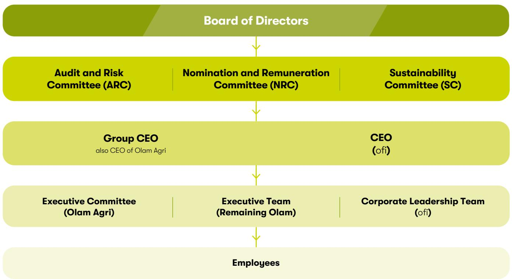  
'ofi' denotes Olam Food Ingredients

# Directors

Lim Ah Doo

Sunny George Verghese

Yap Chee Keong

Tran Phuoc (Lucas)

Marie Elaine Teo

Joerg Wolfgang Wolle (Dr)

Ajai Puri (Dr)

Nagi Hamiyeh

Shuji Kobayashi

Yuji Tsushima

# Company Secretary

Michelle Tanya Kwek

# Registered office

7 Straits View #20-01,

Marina One East Tower

Singapore 018936

Telephone: (65) 6339 4100

Fax: (65) 6339 9755

# Auditor

Ernst & Young LLP

One Raffles Quay

North Tower, Level 18

Singapore 048583

Partner in charge:

Lee Wei Hock

(since financial year 31 December 2024)

# Principal bankers

Abu Dhabi Commercial Bank P.J.S.C.

Australia and New Zealand Banking

Group Limited

Banco Bilbao Vizcaya Argentina S.A.

Banco Santander, S.A.

BNP Paribas

Citibank N.A.

Commonwealth Bank of Australia

DBSBankLtd

Emirates NBD Bank P.J.S.C.

First Abu Dhabi Bank P.J.S.C.

ING Bank N.V.

JPMorgan Chase Bank N.A.

Mizuho Bank, Ltd

MUFG Bank, Ltd

National Australia Bank Limited

Natixis

Rabobank International

Scotiabank

Standard Chartered Bank

Sumitomo Mitsui Banking Corporation

The Hongkong and Shanghai Banking

Corporation Limited

Unicredit Bank AG

Westpac Banking Corporation

# Shareholding information

# Substantial Shareholders

(As recorded in the Register of Substantial Shareholders as at 18 March 2025)

<table><tr><td>No.</td><td>Name of Shareholder</td><td>Direct Number of Shares1</td><td>Deemed Number of Shares1</td><td>% Held</td></tr><tr><td>1.</td><td>Breedens Investments Pte. Ltd.(2)</td><td>1,603,412,218</td><td>-</td><td>42.28</td></tr><tr><td>2.</td><td>Aranda Investments Pte. Ltd.(2)</td><td>359,736,514</td><td>-</td><td>9.49</td></tr><tr><td>3.</td><td>Seletar Investments Pte Ltd(2)</td><td>-</td><td>1,963,148,732</td><td>51.77</td></tr><tr><td>4.</td><td>Temasek Capital (Private) Limited(2)</td><td>-</td><td>1,963,148,732</td><td>51.77</td></tr><tr><td>5.</td><td>Temasek Holdings (Private) Limited(2)</td><td>-</td><td>1,963,148,732</td><td>51.77</td></tr><tr><td>6.</td><td>Mitsubishi Corporation(3)</td><td>554,689,829</td><td>-</td><td>14.63</td></tr><tr><td>7.</td><td>Kewalram Singapore Limited(4)</td><td>265,000,000</td><td>-</td><td>6.99</td></tr><tr><td>8.</td><td>Chanrai Investment Corporation Limited(4)</td><td>-</td><td>265,000,000</td><td>6.99</td></tr><tr><td>9.</td><td>Kewalram Chanrai Holdings Limited(4)</td><td>-</td><td>265,000,000</td><td>6.99</td></tr><tr><td>10.</td><td>GKC Trustees Limited (as trustees of Girdhar Kewalram Chanrai Settlement)(4)</td><td>-</td><td>265,000,000</td><td>6.99</td></tr><tr><td>11.</td><td>MKC Trustees Limited (as trustees of Hariom Trust)(4)</td><td>-</td><td>265,000,000</td><td>6.99</td></tr><tr><td>12.</td><td>DKC Trustees Limited (as trustees of Damodar Kewalram Chanrai Settlement)(4)</td><td>-</td><td>265,000,000</td><td>6.99</td></tr></table>

# Notes:

1. Percentages of interests are calculated based on the total number of issued ordinary Shares being 3,792,531,485 as at 18 March 2025 (excluding treasury shares).  
2. Temasek Holdings (Private) Limited's ("Temasek") interest arises from the direct interest held by Breedens Investments Pte. Ltd. ("Breedens") and Aranda Investments Pte. Ltd. ("Aranda").

(A) Temasek's interest through Breedens 42.28%

(i) Breedens has a direct interest in  $42.28\%$  of voting Shares of the Company.  
(ii) Breedens is a subsidiary of Seletar Investments Pte Ltd ("Seletar").  
(iii) Seletar is a subsidiary of Temasek Capital (Private) Limited ("Temasek Capital").  
(iv) Temasek Capital is a subsidiary of Temasek.

(B) Temasek's deemed interest through Aranda 9.49%

(i) Aranda has a direct interest in  $9.49\%$  of voting shares of the Company.  
(ii) Aranda is a subsidiary of Seletar.  
(iii) Seletar is a subsidiary of Temasek Capital.  
(iv) Temasek Capital is a subsidiary of Temasek.

Total interest of Temasek 51.77%

3. Total interest of Mitsubishi Corporation 14.63%  
4. Kewalram Singapore Limited ("KSL") is a wholly-owned subsidiary of Chanrai Investment Corporation Limited ("CICL"), which in turn is a wholly-owned subsidiary of Kewalram Chanrai Holdings Limited ("KCHL"). By virtue of Section 4(7)(d) of the Securities and Futures Act 2001, each of CICL and KCHL are deemed to be interested in the voting shares of the Listed Issuer ("Shares").

GKC Trustees Limited (as trustees of Girdhar Kewalram Chanrai Settlement) ("GKC Settlement"), MKC Trustees Limited (as trustees of Hariom Trust) ("Hariom Trust") and DKC Trustees Limited (as trustees of Damodar Kewalram Chanrai Settlement) ("DKC Settlement") are shareholders of KCHL. By virtue of Section 4(5) of the Securities and Futures Act (Chapter 289 of Singapore), each of the GKC Settlement, Hariom Trust and DKC Settlement are deemed to be interested in the voting shares of the Listed Issuer.

CICL, KCHL, GKC Settlement, Hariom Trust and DKC Settlement are deemed interested in the Shares in which KSL has a direct interest.

Total interest of the Kewalram Group 6.99%

# Statistics of Shareholdings

As at 18 March 2025

<table><tr><td>Issued and fully Paid-up Capital</td><td>S$6,233,595,001.3556</td></tr><tr><td>Number of Ordinary Shares in issue (excluding Treasury Shares)</td><td>3,792,531,485</td></tr><tr><td>Number of Ordinary Shares held as Treasury Shares</td><td>50,093,700</td></tr><tr><td>Percentage of Treasury Shares held against the total number of Issued Ordinary Shares</td><td>1.321%</td></tr><tr><td>Class of Shares</td><td>Ordinary Shares</td></tr><tr><td>Voting Rights</td><td>One vote per share</td></tr></table>

# Distribution of Shareholdings

<table><tr><td>Size of Shareholdings</td><td>No. of Shareholders</td><td>%</td><td>No. of Shares</td><td>%</td></tr><tr><td>1 – 99</td><td>168</td><td>2.06</td><td>6,469</td><td>0.00</td></tr><tr><td>100 – 1,000</td><td>779</td><td>9.55</td><td>581,726</td><td>0.02</td></tr><tr><td>1,001 – 10,000</td><td>4,635</td><td>56.82</td><td>23,638,648</td><td>0.62</td></tr><tr><td>10,001 – 1,000,000</td><td>2,537</td><td>31.10</td><td>121,533,745</td><td>3.20</td></tr><tr><td>1,000,001 and above</td><td>38</td><td>0.47</td><td>3,646,770,897</td><td>96.16</td></tr><tr><td>Total</td><td>8,157</td><td>100.00</td><td>3,792,531,485</td><td>100.00</td></tr></table>

# Twenty Largest Shareholders

<table><tr><td>No.</td><td>Name</td><td>No. of Shares</td><td>%</td></tr><tr><td>1</td><td>Breedens Investments Pte Ltd</td><td>1,603,412,218</td><td>42.28</td></tr><tr><td>2</td><td>HSBC (Singapore) Nominees Pte Ltd</td><td>624,765,833</td><td>16.47</td></tr><tr><td>3</td><td>Aranda Investments Pte Ltd</td><td>359,736,514</td><td>9.49</td></tr><tr><td>4</td><td>Citibank Nominees Singapore Pte Ltd</td><td>344,348,310</td><td>9.08</td></tr><tr><td>5</td><td>Kewalram Singapore Limited</td><td>265,000,000</td><td>6.99</td></tr><tr><td>6</td><td>DBS Nominees (Private) Limited</td><td>154,890,108</td><td>4.08</td></tr><tr><td>7</td><td>DBS Vickers Securities (Singapore) Pte Ltd</td><td>59,894,449</td><td>1.58</td></tr><tr><td>8</td><td>Daiwa Capital Markets Singapore Limited</td><td>57,500,000</td><td>1.52</td></tr><tr><td>9</td><td>DBSN Services Pte. Ltd.</td><td>44,200,882</td><td>1.17</td></tr><tr><td>10</td><td>Raffles Nominees (Pte.) Limited</td><td>21,500,897</td><td>0.57</td></tr><tr><td>11</td><td>OCBC Securities Private Limited</td><td>17,155,943</td><td>0.45</td></tr><tr><td>12</td><td>ABN AMRO Clearing Bank N.V.</td><td>12,980,924</td><td>0.34</td></tr><tr><td>13</td><td>UOB Kay Hian Private Limited</td><td>12,788,357</td><td>0.34</td></tr><tr><td>14</td><td>Phillip Securities Pte Ltd</td><td>9,448,027</td><td>0.25</td></tr><tr><td>15</td><td>United Overseas Bank Nominees (Private) Limited</td><td>7,764,320</td><td>0.20</td></tr><tr><td>16</td><td>iFast Financial Pte. Ltd.</td><td>6,250,725</td><td>0.16</td></tr><tr><td>17</td><td>Maybank Securities Pte. Ltd.</td><td>5,209,951</td><td>0.14</td></tr><tr><td>18</td><td>CGS International Securities Singapore Pte. Ltd.</td><td>5,018,574</td><td>0.13</td></tr><tr><td>19</td><td>OCBC Nominees Singapore Private Limited</td><td>4,171,151</td><td>0.11</td></tr><tr><td>20</td><td>Moomoo Financial Singapore Pte. Ltd.</td><td>3,145,824</td><td>0.08</td></tr><tr><td colspan="2">Total</td><td>3,619,183,007</td><td>95.43</td></tr></table>

# Public Float

Approximately  $22.14\%$  of the Company's Shares are held in the hands of the public. Accordingly, the Company has complied with Rule 723 of the Listing Manual of the SGX-ST.

# Notice of Annual General Meeting

# Olam Group Limited

(Company Registration No. 202180000W)  
(Incorporated in The Republic of Singapore with limited liability)  
(the "Company")

The Company will be holding the Fourth Annual General Meeting convened on Friday, 25 April 2025 at 2.00 p.m. Singapore time ("AGM" or "Meeting") at Heliconia Junior Ballroom, Level 3, Marina Bay Sands Convention Centre, 10 Bayfront Avenue, Singapore 018956. This is a fully in person meeting with NO virtual participation.

# Attending the Meeting

(a) Shareholders of the Company (“Shareholders”) who wish to attend the Meeting will need to register in person at the registration counters outside the AGM venue on the day of the AGM. There is NO pre-registration required. Registration for attendance at the Meeting will commence at 1.00 p.m. Singapore time on that day. Attendees must present their original NRIC/Passport for verification and registration on the day of the Meeting, and must comply with all health and safety measures and requirements put in place by the building/venue management at the Physical Meeting, failing which they may not be admitted into or may be asked to leave the Meeting. Those who feel unwell are advised not to attend the Meeting.

# Arrangements for Investors holding Shares through Relevant Intermediaries

(b) Investors who hold Shares through a relevant intermediary (as defined in Section 181 of the Companies Act 1967 of Singapore (“Companies Act”)) or a depository agent (as defined in Section 81SF of the Securities and Futures Act 2001 of Singapore) (together, “Relevant Intermediaries”, and such investors, “Investors”) who wish to attend the Meeting should approach their Relevant Intermediary as soon as possible in order for the Relevant Intermediary to make the necessary arrangements for their attendance.

# Submission of Questions

(c) All authenticated Shareholders, CPF/SRS Investors and Investors can submit questions relating to the business of this AGM in advance of the Meeting up till Thursday, 17 April 2025, at 2.00 p.m. Singapore time (i) via electronic mail to email address srs-proxy@boardroomlimited.com; or (ii) via post to Boardroom Corporate & Advisory Services Pte Ltd, the Share Registrar at 1 HarbourFront Avenue #14-07 Keppel Bay Tower Singapore 098632. Shareholders, CPF/SRS Investors and Investors who submit questions in advance of the Meeting should provide their full name, address, contact number, email address and the manner in which they hold Shares (if you hold Shares directly, please provide your account number with The Central Depository (Pte) Limited ("CDP"); otherwise, please state if you hold your Shares through CPF or SRS or a Relevant Intermediary, and if so, which one), for our verification purposes.  
(d) The Company will respond to substantial and relevant questions received by Thursday, 17 April 2025, at 2.00 p.m. Singapore time via an announcement on SGXNET and the Company's website by Sunday, 20 April 2025 at 2.00 p.m. Singapore time (being at least 48 hours prior to the closing date and time for the submission of the Proxy Form). For any questions that are received after Thursday, 17 April 2025 at 2.00 p.m. Singapore time, the Company will respond to such questions either within a reasonable timeframe before the AGM and/or at the AGM itself. When substantially similar questions are received, the Company may group them together and respond to them on a consolidated basis.  
(e) Shareholders, CPF/SRS Investors, proxies and Investors attending the Meeting will be able to ask questions at the Meeting.

# Voting by Shareholders

(f) Shareholders who wish to exercise their voting rights at this AGM may:

(i) (where the Shareholder is an individual) attend and vote "live" at the Meeting;  
(ii) (where the Shareholder is an individual or a corporate) appoint proxy(ies) other than the Chairman of the Meeting to attend and vote "live" at the Meeting on their behalf; and  
(iii) (where the Shareholder is an individual or a corporate) appoint the Chairman of this Meeting as proxy to vote on their behalf.

"Live" voting will be conducted during this AGM. Shareholders and proxies attending the Meeting will be provided with handsets for voting purposes.

Instructions will be provided at the start of the Meeting on how to vote.

# Appointment of Proxies

(g) Shareholders who wish to appoint proxies to attend and vote “live” at this AGM on their behalf must complete and submit the Proxy Form in accordance with the instructions below by Tuesday, 22 April 2025 at 2.00 p.m. Singapore time.

As an alternative, Shareholders may also appoint the Chairman of the Meeting as proxy to vote on their behalf in respect of all the Shares held by them.

If a Shareholder wishes to appoint a proxy or proxies (including the Chairman of the Meeting) to vote at this AGM on their behalf, duly completed Proxy Forms must be deposited with the Company (A) via post to the Share Registrar's office at 1 HarbourFront Avenue #14-07 Keppel Bay Tower Singapore 098632, or (B) via electronic mail to email address srs-proxy@boardroomlimited.com enclosing a clear scanned completed and signed Proxy Form in pdf.

Note: Please refer to the Notes to the Proxy Form for additional documentary requirements in the event the Proxy Form is signed by an attorney or duly authorised officer.

Proxy Forms must be received by the Company by Tuesday, 22 April 2025 at 2.00 p.m. Singapore time (being 72 hours before the time appointed for the holding of this AGM). Proxy Forms can be downloaded from SGXNET (www.sgx.com) or the Company's website (www.olamgroup.com). In the Proxy Form, a Shareholder should specifically direct the proxy on how he is to vote for, vote against, or abstain from voting on, the resolutions to be tabled at this AGM. If no specific direction as to voting is given, the proxy (including the Chairman of the Meeting if he is appointed as proxy) may vote or abstain from voting at his discretion. All valid votes cast via proxy on each resolution will be counted.

The Company may reject any Proxy Form lodged if the Shareholder appointing the proxy is not shown to have Shares entered against his/her/its name in the Depository Register as at 72 hours before the time appointed for holding this AGM as certified by CDP to the Company.

Completion and submission of the Proxy Form shall not preclude a Shareholder from attending and voting at this AGM.

Any appointment of a proxy or proxies (including the Chairman of the Meeting) shall be deemed to be revoked if a Shareholder attends this AGM, and in such event, the Company reserves the right to refuse to admit any person or persons appointed under the Proxy Form to this AGM.

A Shareholder (who is not a Relevant Intermediary) entitled to attend and vote at a meeting of the Company is entitled to appoint one (1) or two (2) proxies to attend and vote on his/her/its behalf. A proxy need not be a Shareholder. Where a Shareholder appoints two (2) proxies, the appointments shall be invalid unless he/she/it specifies the number of Shares to be represented by each proxy.

A Shareholder, who is a Relevant Intermediary, is entitled to appoint more than two (2) proxies to attend and vote at this AGM, but each proxy must be appointed to exercise the rights attached to a different Share or Shares held by such Shareholder. Where such Shareholder appoints two (2) or more proxies, the appointments shall be invalid unless such Shareholder specifies the number of Shares to be represented by each proxy.

# Voting by Investors holding Shares through Relevant Intermediaries and CPF/SRS Investors

(h) Investors holding Shares through Relevant Intermediaries and CPF/SRS Investors may only exercise their votes in the following manner:

(i) attend and vote "live" at this AGM, if they are appointed as proxies by their respective Relevant Intermediaries/CPF Agent Banks/SRS operators; or  
(ii) specify their voting instructions to/arrange for their votes to be submitted by their respective Relevant Intermediaries/ CPF Agent Banks/SRS operators.

Investors holding Shares through Relevant Intermediaries and CPF/SRS Investors who wish to attend and vote at this AGM should approach their respective Relevant Intermediaries/CPF Agent Banks/SRS operators as soon as possible. CPF/SRS Investors who wish to exercise their votes should approach their respective CPF Agent Bank/SRS operator at least seven (7) working days before this AGM (i.e. by Wednesday, 16 April 2025 at 2.00 p.m. Singapore time).

For the avoidance of doubt, Investors holding Shares through Relevant Intermediaries and CPF/SRS Investors should not use the Proxy Form.

# Voting Results

(i) An independent scrutiner will be appointed by the Company to direct and supervise the counting and validation of all valid votes cast through “live” voting at this AGM and through Proxy Forms received as of the above-mentioned deadline. The voting results will be announced during this AGM in respect of the resolutions put to the vote at this AGM. The Company will also issue an announcement on SGXNET on the results of the resolutions put to vote at this AGM.

# Documents and Information Relating to this AGM

Printed copies of the Company's Annual Report for the financial year 2024 ("Annual Report") and Letter to Shareholders will not be sent to Shareholders. However, printed copies of the Notice of AGM, the Request Form and the Proxy Form have been mailed to Shareholders, and are also available on SGXNET (www.sgx.com) and the Company's website (www.olamgroup.com). Shareholders who wish to receive a printed copy of the Annual Report are required to complete the Request Form and return it to the Company (A) via post to the Share Registrar's office at 1 HarbourFront Avenue #14-07 Keppel Bay Tower Singapore 098632, or (B) via electronic mail to email address srs-proxy@boardroomlimited.com.

Shareholders are advised to continue to check SGXNET and the Company's website regularly for any updates relating to this AGM.

NOTICE IS HEREBY GIVEN that the Fourth Annual General Meeting of the Company will be held at Heliconia Junior Ballroom, Level 3, Marina Bay Sands Convention Centre, 10 Bayfront Avenue, Singapore 018956 on Friday, 25 April 2025 at 2.00 p.m. Singapore time for the purpose of considering, and if thought fit, passing, the following resolutions:

<table><tr><td>Ordinary Business</td><td>Ordinary 
Resolutions</td></tr><tr><td>1. To receive and adopt the Directors’ Statement and the Audited Consolidated Financial Statements of the Company for the financial year ended 31 December 2024 (“FY2024”) together with the Auditors’ Report thereon. 
Please refer to the explanatory note (i) provided.</td><td>Resolution 1</td></tr><tr><td>2. To declare a second and final dividend of 3.0 cents per share, tax exempt (one-tier) for the financial year ended 31 December 2024. 
Please refer to the explanatory note (ii) provided.</td><td>Resolution 2</td></tr><tr><td>3. To re-elect the following Directors retiring pursuant to Regulation 107 of the Constitution of the Company (the “Constitution”), and who, being eligible, offer themselves for re-election: 
(a) Mr Nagi Hamiyeh 
(b) Mr Shuju Kobayashi 
(c) Mr Yap Chee Keong 
In addition, to note: 
“That Ms Marie Elaine Teo will retire with effect from the conclusion of the Meeting.” 
Please refer to the explanatory note (iii) provided.</td><td>Resolution 3 
Resolution 4 
Resolution 5</td></tr><tr><td>4. To re-elect Mr Tran Phuoc (Lucas) who will cease to hold office in accordance with Regulation 113 of the Constitution, and who, being eligible, offers himself for re-election: 
Please refer to the explanatory note (iv) provided.</td><td>Resolution 6</td></tr><tr><td>5. To approve the payment of Directors’ fees of up to $2,500,000 for the financial year ending 31 December 2025 (“FY2025”) (2024: $2,700,000). 
Please refer to the explanatory note (v) provided.</td><td>Resolution 7</td></tr><tr><td>6. To re-appoint Messrs Ernst &amp; Young LLP as the auditors of the Company and to authorise the Directors to fix their remuneration. 
Please refer to the explanatory note (vi) provided.</td><td>Resolution 8</td></tr><tr><td>Special Business</td><td>Ordinary 
Resolutions</td></tr></table>

To consider and, if thought fit, to pass the following resolutions as Ordinary Resolutions:

# 7. General Authority to Issue Shares

That pursuant to Section 161 of the Companies Act 1967 of Singapore (the "Companies Act") and Rule 806 of the Listing Manual of the Singapore Exchange Securities Trading Limited ("SGX-ST") (the "Listing Manual"), the Directors be authorised and empowered to:

(a) (i) issue ordinary shares in the capital of the Company ("Shares") whether by way of rights, bonus or otherwise; and/or  
(ii) make or grant offers, agreements or options (collectively, "Instruments") that might or would require Shares to be issued, including but not limited to the creation and issue of (as well as adjustments to) options, warrants, debentures or other instruments convertible into Shares, at any time and upon such terms and conditions and for such purposes and to such persons as the Directors may in their absolute discretion deem fit; and  
(b) (notwithstanding the authority conferred by this Resolution may have ceased to be in force) issue Shares in pursuance of any Instruments made or granted by the Directors while this Resolution was in force,

provided that:

(1) the aggregate number of Shares (including Shares to be issued in pursuance of the Instruments, made or granted pursuant to this Resolution) to be issued pursuant to this Resolution shall not exceed fifty per cent. (50%) of the total number of issued Shares (excluding treasury shares and subsidiary holdings) (as calculated in accordance with sub-paragraph (2) below), of which the aggregate number of Shares to be issued other than on a pro rata basis to shareholders of the Company ("Shareholders") shall not exceed ten per cent. (10%) of the total number of issued Shares (excluding treasury shares and subsidiary holdings) (as calculated in accordance with sub-paragraph (2) below);  
(2) (subject to such calculation as may be prescribed by the SGX-ST) for the purpose of determining the aggregate number of Shares that may be issued under sub-paragraph (1) above, the total number of issued Shares (excluding treasury shares and subsidiary holdings) shall be based on the total number of issued Shares (excluding treasury shares and subsidiary holdings) at the time of the passing of this Resolution, after adjusting for:  
(a) new Shares arising from the conversion or exercise of any convertible securities;  
(b) new Shares arising from exercising share options or vesting of share awards which are outstanding or subsisting at the time of the passing of this Resolution; and  
(c) any subsequent bonus issue, consolidation or subdivision of Shares;  
(3) in exercising the authority conferred by this Resolution, the Company shall comply with the provisions of the Companies Act and the Listing Manual for the time being in force (unless such compliance has been waived by the SGX-ST) and the Constitution; and  
(4) unless revoked or varied by the Company in a general meeting, such authority shall continue in force until the conclusion of the next annual general meeting of the Company ("AGM") or the date by which the next AGM is required by law to be held, whichever is the earlier.

Please refer to the explanatory note (vii) provided.

# 8. Renewal of the Share Buyback Mandate

Resolution 10

That:

(a) for the purposes of the Companies Act, the exercise by the Directors of all the powers of the Company to purchase or otherwise acquire Shares not exceeding in aggregate the Maximum Limit (as defined below), at such price(s) as may be determined by the Directors from time to time up to the Maximum Price (as defined below), whether by way of:

(i) market purchase(s) (each a "Market Purchase") on the SGX-ST; and/or  
(ii) off-market purchase(s) (each an "Off-Market Purchase") in accordance with any equal access scheme(s) as may be determined or formulated by the Directors as they consider fit, which scheme(s) shall satisfy all the conditions prescribed by the Companies Act,

and otherwise in accordance with all other laws and regulations, including but not limited to, the provisions of the Companies Act and listing rules of the SGX-ST as may for the time being be applicable, be and is hereby authorised and approved generally and unconditionally (the "Share Buyback Mandate");

(b) unless revoked or varied by the Company in a general meeting, the authority conferred on the Directors pursuant to this Resolution may be exercised by the Directors at any time and from time to time during the period commencing from the date of the passing of this Resolution and expiring on the earlier of:

(i) the date on which the next AGM of the Company is held or required by law to be held; or  
(ii) the date on which the purchases or acquisitions of Shares by the Company pursuant to the Share Buyback Mandate are carried out to the full extent mandated,

whichever is the earlier;

(c) in this Resolution:

"Maximum Limit" means that number of issued Shares representing not more than five percent. (5%) of the total number of issued Shares (excluding treasury shares and subsidiary holdings) as at the date of the passing of this Resolution, unless the Company has effected a reduction of the share capital of the Company in accordance with the applicable provisions of the Companies Act, at any time during the Relevant Period (as defined below), in which event the total number of issued Shares shall be taken to be the total number of issued Shares as altered (excluding any treasury shares that may be held by the Company from time to time and subsidiary holdings);

"Relevant Period" means the period commencing from the date of passing of this Resolution and expiring on the date the next AGM of the Company is held or is required by law to be held, whichever is the earlier; and

"Maximum Price" in relation to a Share to be purchased or acquired, means the purchase price (excluding brokerage, stamp duties, commission, applicable goods and services tax and other related expenses) which shall not exceed  $105\%$  of the Average Closing Price.

where:

"Average Closing Price" means the average of the closing market prices of the Shares over the last five (5) Market Days (a "Market Day" being a day on which the SGX-ST is open for trading in securities), on which transactions in the Shares were recorded, before the day on which the purchase or acquisition of Shares was made or, as the case may be, the day of the making of the offer pursuant to the Off-Market Purchase, and deemed to be adjusted for any corporate action that occurs during the relevant five (5) Market Days and the day on which the Market Purchase was made, or as the case may be, the day of the making of the offer pursuant to the Off-Market Purchase; and

"day of the making of the offer" means the day on which the Company announces its intention to make an offer for an Off-Market Purchase, stating therein the purchase price (which shall not be more than the Maximum Price) for each Share and the relevant terms of the equal access scheme for effecting the Off-Market Purchase; and

(d) the Directors and/or any of them be and are hereby authorised to do all acts and things and to execute all such documents as may be required or as they or he or she may consider necessary, desirable or expedient or in the interests of the Company to give effect to the transactions contemplated and/or authorised by this Resolution.

Please refer to the explanatory note (viii) provided.

By Order of the Board

Michelle Tanya Kwek

Company Secretary

Singapore, 9 April 2025

# Please read the following notes and the explanatory notes to the resolutions as set out below before deciding how to vote.

# Personal data privacy:

By submitting an instrument appointing a proxy(ies) and/or representative(s) to attend, speak and vote at the AGM and/or any adjournment thereof, (i) a member of the Company consents to the collection, use and disclosure of the member's personal data by the Company (or its agents) for the purpose of the processing and administration by the Company (or its agents) of proxies and representatives appointed for the AGM (including any adjournment thereof) and the preparation and compilation of the attendance lists, minutes and other documents relating to the AGM (including any adjournment thereof) recordings and transmitting images and/or voice recordings, and in order for the Company (or its agents) to comply with any applicable laws, listing rules, regulations and/or guidelines (collectively, the "Purposes"); (ii) warrants that where the member discloses the personal data of the member's proxy(ies) and/or representative(s) to the Company (or its agents), the member has obtained the prior consent of such proxy(ies) and/or representative(s) for the collection, use and disclosure by the Company (or its agents) of the personal data of such proxy(ies) and/or representative(s) for the Purposes; and (iii) agrees that the member will indemnify the Company in respect of any penalties, liabilities, claims, demands, losses and damages as a result of the member's breach of warranty.

# Website

The Company's website, www.olamgroup.com, provides more information about the Company, including the latest Annual Report, the Letter to Shareholders, the Notice of AGM and the Proxy Form.

# Explanatory notes of the resolutions to be proposed at the AGM

Resolutions 1 to 10 are proposed as ordinary resolutions. For an ordinary resolution to be passed, more than half of the votes cast must be in favour of the resolution.

# (i) Ordinary Resolution 1

The Companies Act requires the audited consolidated financial statements of the Company for each financial year to be tabled before the Shareholders in a general meeting. The audited consolidated financial statements are to be accompanied by the Directors' Statement and the Auditors' Report thereon. The Directors' Statement and the audited consolidated financial statements for the financial year ended 31 December 2024 ("FY2024") together with the Auditors' Report thereon are provided in the Financial Report of the Annual Report.

A copy may also be read on our website at olamgroup.com/investors.html.

# (ii) Ordinary Resolution 2

Ordinary Resolution 2 is to declare a second and final tax-exempt dividend of 3.0 cents per Share for FY2024. Together with the sum of 3.0 cents per Share of interim dividend declared for the first-half of FY2024, the total dividend for FY2024 is 6.0 cents per Share (approximately $227.5 million). The Company does not have a fixed dividend policy. The Directors' policy is to recommend dividends consistent with the Company's overall governing objective of maximising intrinsic value for its continuing Shareholders. Dividend payments are affected by matters such as the level of the Company's future earnings, results of operations, capital requirements, cash flows, financial conditions, the Company's plans for expansion, general business conditions and other factors, including such legal or contractual restrictions as may apply from time to time or which the Directors may consider appropriate in the interests of the Company.

The Directors will consider all these factors before proposing any dividends. The Company may, by ordinary resolution at a general meeting of Shareholders, declare dividends, but the amount of such dividends shall not exceed the amount recommended by the Directors. The Directors may also declare an interim dividend without seeking Shareholders' approval. Potential investors should note that this statement is a statement of the Company's present intention and shall not constitute a legally binding commitment in respect of the Company's future dividends and dividend pay-out ratio which may be subject to modification (including reduction or non-declaration thereof) in the Directors' sole and absolute discretion. All dividends are distributed as tax-exempt dividends in accordance with the Income Tax Act 1947 of Singapore.

# (iii) Ordinary Resolutions 3, 4 and 5

Mr Nagi Hamiyeh will, upon re-election as a Director, continue his office as Non-executive Director.

Mr Shuji Kobayashi will, upon re-election as a Director, continue his office as Non-executive Director. He will remain as a member of the Audit and Risk Committee ("ARC") and the Nomination and Remuneration Committee ("NRC").

Mr Yap Chee Keong will, upon re-election as a Director, continue as a Non-independent and Non-executive Director, as he has served as a Director for more than nine years pursuant to Rule 210(5)(d)(iii) of the Listing Manual. He will be appointed as the Non-executive Deputy Chair of the Board, Chair of the Risk Committee to be formed after the AGM, and will remain a member of the Board Strategy Execution Committee.

Please refer to the Addendum for the additional information on the aforementioned Directors provided pursuant to Rule 720(6) of the Listing Manual. You may also refer to the Governance Report of the 2024 Annual Report for the profile of each of these Directors.

The aforementioned Directors will refrain from making any recommendation on and, being Shareholders, shall abstain from voting on respective ordinary resolution in relation to their re-election. The aforementioned Directors will also not accept appointment as proxies for any Shareholder to vote in respect of these resolutions unless specific directions as to voting have been specified in the relevant proxy form.

# (iv) Ordinary Resolution 6

Mr Tran Phuoc (Lucas) will, upon re-election as a Director, continue his office as Non-executive Director. He will assume chairmanship of the Audit Committee and be appointed to the NRC. He will be considered independent. The existing ARC will be separated into two committees, namely, the Audit Committee and the Risk Committee. This will be effective after the conclusion of the AGM.

Please refer to the Addendum for the additional information on Mr Tran Phuoc (Lucas) provided pursuant to Rule 720(6) of the Listing Manual. You may also refer to the Governance Report of the 2024 Annual Report for his profile.

Mr Tran Phuoc (Lucas) will refrain from making any recommendation on and, being a Shareholder, shall abstain from voting on the ordinary resolution in relation to his re-election. He will also not accept appointment as proxies for any Shareholder to vote in respect of this resolution unless specific directions as to voting have been specified in the relevant proxy form.

# (v) Ordinary Resolution 7

Ordinary Resolution 7 seeks the payment of up to S$2,500,000 to all Directors (other than the Executive Directors) as Directors' fees for FY2025. The Directors' fees approved for FY2024 were S$2,700,000 with the aggregate fees paid quarterly in arrears to the Non-executive Directors. For Non-executive Directors entitled to receive Directors' fees in the form of shares, approximately 70% of the Directors' fees was paid in cash and approximately 30% in the form of Olam shares. The amount of Directors' fees paid to each Director for FY2024 is disclosed in full on page 185 of the Governance Report of the 2024 Annual Report.

For Directors' fees payable to the Non-executive Directors for FY2025 (excluding certain Non-executive Directors who, under their separate arrangements with their employer, do not retain their Directors' fees), the equity component (comprising approximately  $30\%$  of the Directors' fees) is intended to be paid out after the announcement by the Company of its unaudited full year financial statements for FY2025, with the actual number of Shares to be awarded to each such Non-executive Director holding office at the time of payment to be determined by reference to the volume weighted average price of a Share on SGX-ST over the 10 trading days after the date of the announcement by the Company of its unaudited full year financial statements for FY2025. The number of Shares to be awarded will be rounded down to the nearest hundred and any residual balance will be settled in cash. Each such Non-executive Director is committed to holding, during his or her Board tenure, Shares of a value equivalent to approximately one year's basic retainer. In the event the Non-executive Director leaves the Company prior to the acquisition of the Shares, the directors' fees due to him/her up to his/her date of cessation will be paid to him/her in cash. If Ordinary Resolution 7 is passed, the equity component of the Directors' fees payable to a Non-executive Director may be in the form of either existing shares (which may be shares held in treasury) and/or new shares.

The Non-executive Directors will refrain from making any recommendation on and, being shareholders, shall abstain from voting on Ordinary Resolution 7. The aforementioned Directors will also not accept appointment as proxies for any Shareholder to vote in respect of this resolution unless specific directions as to voting have been specified in the relevant proxy form.

Ordinary Resolution 7, if passed, will facilitate the quarterly payment in arrears of Directors' fees during FY2025 in which the fees are incurred.

# (vi) Ordinary Resolution 8

Ordinary Resolution 8 seeks the re-appointment of Ernst & Young LLP as independent auditors to the Company (the "Auditors") and requests authority for the Directors to set the remuneration of the Auditors.

The Board is careful that the Auditors' independence should not be compromised and the ARC takes responsibility for reviewing the performance of the Auditors and making recommendations about the scope of their work and fees. The ARC has recommended to the Board that the appointment of Ernst & Young LLP should be renewed until the conclusion of the next AGM.

More details on the external auditors and the review by the ARC may be found in the Governance Report on pages 191 to 192 of the 2024 Annual Report.

# (vii) Ordinary Resolution 9

Ordinary Resolution 9, if passed, will empower the Directors, effective until the earlier of (1) the conclusion of the next AGM, or (2) the date by which the next AGM is required by law to be held (unless such authority is varied or revoked by the Company in a general meeting), to issue Shares, make or grant Instruments convertible into Shares and to issue Shares pursuant to such Instruments, up to a number not exceeding, in total, fifty per cent. (50%) of the total number of issued Shares, of which up to ten per cent. (10%) may be issued other than on a pro rata basis to Shareholders. Although the Listing Manual enables the Company to seek a mandate to permit its Directors to issue Shares up to the fifty per cent. (50%) limit if made on a pro rata basis to Shareholders, and up to a sub-limit of twenty per cent. (20%) if made other than on a pro rata basis to Shareholders, the Company is nonetheless only seeking a sub-limit of ten per cent. (10%).

For determining the aggregate number of Shares that may be issued, the total number of issued Shares will be calculated based on the total number of issued Shares (excluding treasury shares and subsidiary holdings) at the time this Ordinary Resolution 9 is passed after adjusting for new Shares arising from the conversion or exercise of any convertible securities or share options or vesting of share awards which are outstanding or subsisting at the time when this Ordinary Resolution 9 is passed and any subsequent bonus issue, consolidation or subdivision of Shares.

# (viii) Ordinary Resolution 10

Ordinary Resolution 10, if passed, will empower the Directors from the date of the passing of this Ordinary Resolution 10 until the earlier of the date of the next AGM of the Company, or the date by which the next AGM of the Company is required by law to be held, to purchase or otherwise acquire, by way of Market Purchases or Off-Market Purchases, up to five per cent. (5%) of the total number of issued Shares (excluding treasury shares and subsidiary holdings) as at the date of the passing of this Ordinary Resolution 10 on the terms of the Share Buyback Mandate as set out in the Letter, unless such authority is earlier revoked or varied by the Company in a general meeting.

The Company may use internal sources of funds or borrowings or a combination of both to finance the Company's purchase or acquisition of Shares pursuant to the Share Buyback Mandate.

The amount of financing required for the Company to purchase or acquire its Shares, and the impact of such purchases or acquisitions of Shares on the Company's financial position, cannot be realistically calculated or quantified as at the date of this Notice of AGM as these will depend on, inter alia, the aggregate number of Shares purchased or acquired, whether the purchase or acquisition is made out of capital or profits, the purchase prices paid for such Shares, the amount (if any) borrowed by the Company to fund the purchases or acquisitions and whether the Shares purchased or acquired are cancelled or held as treasury shares. For illustrative purposes only, the financial effects of the Share Buyback Mandate on the Company and the Group based on the audited consolidated financial statements of the Company for the financial year ended 31 December 2024 and prepared on certain assumptions and bases, are set out in paragraph 2.7 of the Letter.

# Notice of Record Date and Payment Date

As stated in the Notice of Record Date and Payment Date set out in the Company's announcement dated 28 February 2025, the Company wishes to notify Shareholders that the Share Transfer Books and Register of Members of the Company will be closed at 5.00 p.m. on 6 May 2025 for the preparation of dividend warrants. duly completed registrable transfers of Shares received by the Company's Share Registrar, Boardroom Corporate & Advisory Services (Pte) Ltd, at 1 HarbourFront Avenue, #14-07 Keppel Bay Tower, Singapore 098632 up to 5.00 p.m. on 6 May 2025 will be registered to determine shareholders' entitlements to the proposed second and final dividend.

Members whose Securities Accounts with The Central Depository (Pte) Limited are credited with Shares at 5.00 p.m. on 6 May 2025 will be entitled to the proposed second and final dividend. Payment of the dividend, if approved by the members at the AGM to be held on 25 April 2025, will be made on 14 May 2025.

# Addendum to the Annual Report 2024

# Additional Information on Directors seeking Re-election pursuant to Rule 720(6) of the Listing Manual of the SGX-ST

Mr Nagi Hamiyeh, Mr Shuji Kobayashi, Mr Yap Chee Keong and Mr Tran Phuoc (Lucas) are the Directors seeking re-election at the forthcoming annual general meeting of the Company to be convened on 25 April 2025 (“AGM”) under Ordinary Resolutions 3, 4, 5 and 6 as set out in the Notice of AGM dated 9 April 2025 (collectively, the “Retiring Directors” and each a “Retiring Director”).

Pursuant to Rule 720(6) of the Listing Manual of the SGX-ST, the information relating to the Retiring Directors as set out in Appendix 7.4.1 to the Listing Manual of the SGX-ST is set out below:

<table><tr><td>Name of Director</td><td>Mr Nagi Adel Hamiyeh</td><td>Mr Shuji Kobayashi</td><td>Mr Yap Chee Keong</td><td>Mr Tran Phuoc (Lucas)</td></tr><tr><td>Date of Appointment</td><td>15 March 2022</td><td>5 May 2023</td><td>15 March 2022</td><td>16 September 2024</td></tr><tr><td>Date of Last Re-appointment</td><td>25 April 2022</td><td>25 April 2024</td><td>25 April 2023</td><td>N.A.</td></tr><tr><td>Age</td><td>56</td><td>56</td><td>64</td><td>61</td></tr><tr><td>Country of principal residence</td><td>Europe</td><td>Japan</td><td>Singapore</td><td>Singapore</td></tr><tr><td>The Board's comments on this appointment (including rationale, selection criteria, board diversity considerations, and the search and nomination process)</td><td>N.A.</td><td>N.A.</td><td>N.A.</td><td>N.A.</td></tr><tr><td>Whether appointment is executive, and if so, the area of responsibility</td><td>Non-executive</td><td>Non-executive</td><td>Non-executive</td><td>Non-executive</td></tr><tr><td>Job Title (e.g. Lead ID, AC Chairman, AC Member etc.)</td><td>Non-executive Director</td><td>Non-executive Director
Member, Audit Committee ("AC")*
Member, Nomination &amp; Remuneration Committee ("NRC")
Member, Risk Committee ("RC")*</td><td>Deputy Chair of the Board*
Non-independent and Non-executive Director
Chairman, RC*
Member, Board Strategy Execution Committee</td><td>Independent and Non-executive Director
Chairman, AC*
Member, NRC*
Member, RC*</td></tr><tr><td>* after the conclusion of the AGM</td><td></td><td></td><td></td><td></td></tr><tr><td>Professional qualifications</td><td>Master of Science degree in Civil and Environmental Engineering, Massachusetts Institute of Technology, USA
Bachelor of Science in Civil Engineering, University of Texas, USA</td><td>Bachelor of Economics, West Virginia University, Morgantown, USA
Advanced Management Program, Wharton Business School, University of Pennsylvania, Philadelphia, USA</td><td>Bachelor of Accountancy, National University of Singapore
Fellow, Institute of Singapore Chartered Accountants and Certified Public Accounts, Australia
Fellow, Singapore Institute of Directors</td><td>Bachelor of Commerce, University of New South Wales, Australia
Member, Singapore Institute of Chartered Accountants
Member, Singapore Institute of Directors</td></tr><tr><td>Working experience and occupation(s) during the past 10 years</td><td>Mr Nagi Hamiyeh has 31 years of experience in strategy, corporate finance, mergers and acquisitions (M&amp;A), growth equity, private equity and public investing in multiple industries across the globe. During his career, he has worked closely with companies undergoing consolidation and restructuring processes, as well as with portfolio companies on value uplift opportunities. He has also led the development of the various greenfield platforms by way of M&amp;A and organic growth. Mr Hamiyeh was formerly Head of Temasek's Portfolio Development Group. He is currently Head of Investment in Europe, Middle East and Africa. Mr Hamiyeh joined Temasek in 2005 and over the course of his career, he has led the firm's Natural Resources, Industrials, Consumer and Real Estate Investment teams. He has also been Temasek's Joint Head of Investment Group, Joint Head of Enterprise Development Group and Head of Africa and Middle East, Australia, and New Zealand. Mr Hamiyeh was formerly a member of the Capital and Investment Committee before it was dissolved on 1 January 2024. He was also a director of Olam International Limited prior to the Scheme of Arrangement that was completed on 15 March 2022 with Olam Group Limited taking over the listing entity status on SGX-ST from Olam International Limited as part of the Group's re-organisation.</td><td>Mr Shuji Kobayashi is currently the Senior Vice President of Mitsubishi Corporation (MC), a conglomerate listed on the Tokyo Stock Exchange. Mr Kobayashi has over 20 years' experience in the Food and Agriculture industry during which he has held several managerial roles globally including the USA, Brazil, Australia, Indonesia, China, Singapore and Japan. In his current role, Mr Kobayashi as the Head of Food Industry Group CEO Office oversees the strategy and key investments of the Food Industry portfolio, which includes Livestock, Meat &amp; Dairy Products, Global Fast Moving Consumer Goods, Food Resources, Produce and Marine Products and Food Sciences. Prior to his current role, Mr Kobayashi was the Division Chief Operating Officer (COO), Food Resources Division, overseeing MC's global food ingredients origination and merchandising operations, including corn, wheat, soybean, cocoa and coffee, and the manufacturing of products, such as animal feed, wheat flour and sugar. During his executive management career at MC, Mr Kobayashi previously served in the Corporate Strategy &amp; Planning Department. Prior to the merger of the Board Risk Committee with the Audit Committee to form the Audit and Risk Committee, Mr Kobayashi was a member of both the Board Risk Committee and the Audit Committee. Mr Kobayashi was also formerly a member of the Capital and Investment Committee before it was dissolved on 1 January 2024.</td><td>Over the course of his career, Mr Yap Chee Keong has held a number of high-level management positions, including Executive Director of the Straits Trading Company Limited and Chief Financial Officer of Singapore Power Limited. Mr Yap has also held various senior roles at a number of multinational and listed companies. He has previously been a board member of the Accounting and Corporate Regulatory Authority, a member of the Public Accountants Oversight Committee, part of the MAS/SGX/ACRA Work Group that reviewed the Guidebook for Audit Committees in Singapore, and also the MAS/SGX/ACRA/SID Review Panel that developed a Guide for Board Risk Committees in Singapore. Mr Yap was a director of Olam International Limited prior to the Scheme of Arrangement that was completed on 15 March 2022, with Olam Group Limited taking over the listing entity status on SGX-ST from Olam International Limited as part of the Group's re-organisation. Mr Yap is currently the Deputy Chair of Seatrium Limited and sits on various boards including Shangri-La Asia Limited, Sembcorp Industries Ltd, Ensign Infosecurity Pte. Ltd., PIL Pte. Ltd. and Singlife Holdings Pte Ltd.</td><td>Mr Tran Phuoc (Lucas) is a partner in WLT Assurance LLP. He is currently an Independent Director on various Boards of private and listed companies. The listed companies include Singapura Finance Limited, Kim Heng Ltd and Natural Cool Holdings Limited, in which he is also the Chair of the Audit Committee or Audit and Risk Committee. Mr Tran is a qualified chartered accountant with over 35 years of public accounting experience, not including his experience as a chief financial officer. He was a former partner of KPMG LLP, with extensive experience in auditing, advising on financial reporting requirements as well as regulatory compliance matters relating to the Companies Act and SGX-ST listing rules, IPO, restructuring exercises, due diligence and merger and acquisitions.</td></tr><tr><td>Shareholding interest in the listed issuer and its subsidiaries?</td><td>Nil</td><td>Nil</td><td>268,271 ordinary shares</td><td>Nil</td></tr><tr><td>Any relationship (including immediate family relationship) with any existing director, existing executive officer, the issuer and/or substantial shareholder of the listed issuer or of any of its principal subsidiaries</td><td>Nil</td><td>Nil</td><td>Nil</td><td>Nil</td></tr><tr><td>Conflict of interests (including any competing business)</td><td>Nil</td><td>Nil</td><td>Nil</td><td>Nil</td></tr><tr><td>Undertaking (in the format set out in Appendix 7.7) under Rule 720(1) has been submitted to the listed issuer</td><td>Yes</td><td>Yes</td><td>Yes</td><td>Yes</td></tr></table>

Other Principal Commitments Including Directorships  

<table><tr><td>Name of Director</td><td>Mr Nagi Adel Hamiyeh</td><td>Mr Shuji Kobayashi</td><td>Mr Yap Chee Keong</td><td>Mr Tran Phuoc (Lucas)</td></tr><tr><td>Past (for the last 5 years)</td><td>• Olam International Limited
• Aquarius Healthcare Investments Pte. Ltd.
• Canopus Healthcare Investments Pte. Ltd.
• Carinus Healthcare Investments Pte. Ltd.
• Gallienu Healthcare Investments Pte. Ltd.
• Imperius Healthcare Investments Pte. Ltd.
• Lebanese International Finance Executives
• Polaris Healthcare Investments Pte. Ltd.
• Sheares Healthcare China Holdings Pte. Ltd.
• Sheares Healthcare Group Pte. Ltd.
• Sheares Healthcare Holdings Pte. Ltd.
• Sheares Healthcare Management Pte. Ltd.
• Sigma Healthcare Management Pte. Ltd.
• Sirius Healthcare Investments Pte. Ltd.
• Tana Africa Capital Limited
• Tana Africa Investment Managers Limited
• Valerius Healthcare Investments Pte. Ltd.
• CapitaLand Group Pte. Ltd.
• CLA Real Estate Holdings Pte. Ltd.
• Startree Investments Pte Ltd (Director)
• Olam Agri Holdings Limited (Director)
• Dream International BV (Director)
• Kyanite Investment Holdings Pte. Ltd.
• Kyanite Investment Holdings (I) Pte. Ltd.</td><td>• MC Agri Alliance Ltd.
• Nusan Corporation
• MC Life Sciences Holdings Limited</td><td>• Maxeon Solar Technologies Ltd
• Olam International Limited
• Bayberry Limited
• MediaCorp Pte Ltd</td><td>• RSM Chio Lim LLP
• KPMG LLP</td></tr><tr><td>Present</td><td>Listed company
• Sembcorp Industries Limited (Director)
Non-listed company
• Temasek International (Head, Europe, Middle East and Africa)
• ofi Group Limited (Director)
• Seatrium Limited (fka SembCorp Marine Ltd) (Director)
• EM TOPCO Limited (Director)</td><td>Listed company
• Itoham Yonekyu Holdings Inc. (Director)
• Mitsubishi Corporation (Senior Vice President, General Manager, Food Industry Group CEO Office)</td><td>Listed company
• Seatrium Limited (fka Sembcorp Marine Ltd) (Deputy Chair)
• Sembcorp Industries Ltd (Director)
• Shangri-La Asia Limited (Director)
Non-listed company
• Singapore Life Holdings Pte. Ltd. (fka Aviva Singlife Holdings Pte. Ltd.) (Director)
• Professional Investment Advisory Service Pte Ltd (Chairman)
• Ensign Infosecurity Pte Ltd (Director)
• PIL Pte. Ltd. (Director)
• The Assembly of Christians of Singapore Ltd (Director)</td><td>Listed company
• Singapura Finance Limited (Director)
• Kim Heng Ltd (Director)
• Natural Cool Holdings Limited (Director)
Non-listed company
• Seviora Holdings Pte. Ltd. (Director)
• Pick Network Pte. Ltd. (Director)
• WLT Assurance LLP (Partner)</td></tr></table>

Information required pursuant to Listing Rule 704(7)  

<table><tr><td colspan="2">Name of Director</td><td>Mr Nagi Adel 
Hamiyeh</td><td>Mr Shuji 
Kobayashi</td><td>Mr Yap 
Chee Keong</td><td>Mr Tran Phuoc 
(Lucas)</td></tr><tr><td>(a)</td><td>Whether at any time during the last 10 years, 
an application or a petition under any 
bankruptcy law of any jurisdiction was filed 
against him or against a partnership of which he 
was a partner at the time when he was a partner 
or at any time within 2 years from the date he 
ceased to be a partner?</td><td>No</td><td>No</td><td>No</td><td>No</td></tr><tr><td>(b)</td><td>Whether at any time during the last 10 years, 
an application or a petition under any law of 
any jurisdiction was filed against an entity 
(not being a partnership) of which he was 
a director or an equivalent person or a key 
executive, at the time when he was a director or 
an equivalent person or a key executive of that 
entity or at any time within 2 years from the date 
he ceased to be a director or an equivalent 
person or a key executive of that entity, for the 
winding up or dissolution of that entity or, where 
that entity is the trustee of a business trust, that 
business trust, on the ground of insolvency?</td><td>No</td><td>No</td><td>No</td><td>No</td></tr><tr><td>(c)</td><td>Whether there is any unsatisfied judgment 
against him?</td><td>No</td><td>No</td><td>No</td><td>No</td></tr><tr><td>(d)</td><td>Whether he has ever been convicted of any 
offence, in Singapore or elsewhere, involving 
fraud or dishonesty which is punishable with 
imprisonment, or has been the subject of any 
criminal proceedings (including any pending 
criminal proceedings of which he is aware) 
for such purpose?</td><td>No</td><td>No</td><td>No</td><td>No</td></tr><tr><td>(e)</td><td>Whether he has ever been convicted of any 
offence, in Singapore or elsewhere, involving a 
breach of any law or regulatory requirement that 
relates to the securities or futures industry in 
Singapore or elsewhere, or has been the subject 
of any criminal proceedings (including any 
pending criminal proceedings of which he is 
aware) for such breach?</td><td>No</td><td>No</td><td>No</td><td>No</td></tr><tr><td>(f)</td><td>Whether at any time during the last 10 years, 
judgment has been entered against him in any 
civil proceedings in Singapore or elsewhere 
involving a breach of any law or regulatory 
requirement that relates to the securities or 
futures industry in Singapore or elsewhere, or a 
finding of fraud, misrepresentation or dishonesty 
on his part, or he has been the subject of any 
civil proceedings (including any pending 
civil proceedings of which he is aware) involving 
an allegation of fraud, misrepresentation or 
dishonesty on his part?</td><td>No</td><td>No</td><td>No</td><td>No</td></tr><tr><td>(g)</td><td>Whether he has ever been convicted in Singapore 
or elsewhere of any offence in connection with 
the formation or management of any entity or 
business trust?</td><td>No</td><td>No</td><td>No</td><td>No</td></tr><tr><td>(h)</td><td>Whether he has ever been disqualified from 
acting as a director or an equivalent person of 
any entity (including the trustee of a business 
trust), or from taking part directly or indirectly in 
the management of any entity or business trust?</td><td>No</td><td>No</td><td>No</td><td>No</td></tr><tr><td>(i)</td><td>Whether he has ever been the subject of any 
order, judgment or ruling of any court, tribunal or 
governmental body, permanently or temporarily 
enjoining him from engaging in any type of 
business practice or activity?</td><td>No</td><td>No</td><td>No</td><td>No</td></tr></table>

<table><tr><td>Name of Director</td><td>Mr Nagi Adel 
Hamiyeh</td><td>Mr Shuji 
Kobayashi</td><td>Mr Yap 
Chee Keong</td><td>Mr Tran Phuoc 
(Lucas)</td></tr><tr><td>(i) Whether he has ever, to his knowledge, been concerned with the management or conduct, in Singapore or elsewhere, of the affairs of:</td><td></td><td></td><td></td><td></td></tr><tr><td>(ii) any corporation which has been investigated for a breach of any law or regulatory requirement governing corporations in Singapore or elsewhere; or</td><td>No</td><td>No</td><td>No</td><td>No</td></tr><tr><td>(iii) any entity (not being a corporation) which has been investigated for a breach of any law or regulatory requirement governing such entities in Singapore or elsewhere; or</td><td>No</td><td>No</td><td>No</td><td>No</td></tr><tr><td>(iv) any business trust which has been investigated for a breach of any law or regulatory requirement governing business trusts in Singapore or elsewhere; or</td><td>No</td><td>No</td><td>No</td><td>No</td></tr><tr><td>(v) any entity or business trust which has been investigated for a breach of any law or regulatory requirement that relates to the securities or futures industry in Singapore or elsewhere, in connection with any matter occurring or arising during that period when he was so concerned with the entity or business trust?</td><td>No</td><td>No</td><td>No</td><td>No</td></tr><tr><td>(k) Whether he has been the subject of any current or past investigation or disciplinary proceedings, or has been reprimanded or issued any warning, by the Monetary Authority of Singapore or any other regulatory authority, exchange, professional body or government agency, whether in Singapore or elsewhere?</td><td>No</td><td>No</td><td>No</td><td>No</td></tr><tr><td>Any prior experience as a director of an issuer listed on the Exchange?</td><td>Yes.</td><td>No.</td><td>Yes.</td><td>Yes.</td></tr><tr><td>If yes, please provide details of prior experience.</td><td>Mr Nagi Hamiyeh was a director on the board of Olam International Limited from 1 September 2019 to 15 March 2022 (being the date that Olam Group Limited took over the listing entity status on the Exchange from Olam International Limited as part of the Group&#x27;s re-organisation) and has been a director on the board of Olam Group Limited since 15 March 2022.</td><td>Mr Yap Chee Keong was a director on the board of Olam International Limited from 1 December 2015 to 15 March 2022 (being the date that Olam Group Limited took over the listing entity status on the Exchange from Olam International Limited as part of the Group&#x27;s re-organisation) and has been a director on the board of Olam Group Limited since 15 March 2022.</td><td>Mr Tran Phuoc (Lucas) has been a Non-executive and Independent Director of several companies listed on the Singapore Exchange Mainboard and Catalyst. Mr Tran is also non-executive director and member of the Audit and Risk Committee of private companies, which included a large asset management company.</td><td></td></tr><tr><td>If no, please state if the director has attended or will be attending training on the roles and responsibilities of a director of a listed issuer as prescribed by the Exchange.</td><td>N.A.</td><td>Mr Kobayashi has attended the Listed Entity Director Programme provided by the Singapore Institute of Directors.</td><td>N.A.</td><td>N.A.</td></tr><tr><td>Please provide details of relevant experience and the nominating committee&#x27;s reasons for not requiring the director to undergo training as prescribed by the Exchange (if applicable).</td><td></td><td></td><td></td><td></td></tr></table>

# Olam Group Limited

(Company Registration No. 202180000W)

(Incorporated in The Republic of Singapore)

# IMPORTANT:

1. Shareholders who wish to exercise their voting rights at the AGM may:  
(a) (where the Shareholder is an individual) attend and vote "live" at the Meeting;  
(b) (where the Shareholder is an individual or a corporate) appoint proxy(ies) other than the Chairman of the Meeting ("Third Party Proxy(ies)") to attend and vote "live" at the Meeting on their behalf; and  
(c) (where the Shareholder is an individual or a corporate) appoint the Chairman of the Meeting as proxy to vote on their behalf.  
2. Shareholders who wish to appoint Third Party Proxy(es) to vote "live" at the Meeting on their behalf must complete and submit this Proxy Form in accordance with the instructions in the Notes below by Tuesday, 22 April 2025 at 2.00 p.m.  
3. For investors holding shares of Olam Group Limited through Relevant Intermediaries and CPF/SRS Investors (both as defined in the Notice of AGM), this Proxy Form is not valid for use and shall be ineffective for all intents and purposes if used or purported to be used by them. Such investors who wish to exercise their voting rights should approach their Relevant Intermediary/CPF Agent Bank/SRS operator as soon as possible. CPF/SRS investors should approach their respective CPF Agent Bank or SRS operator at least seven (7) working days before the AGM (i.e. by Wednesday, 16 April 2025 at 2.00 p.m.).

(Pleasesee notes overleaf before completing this Form)

$^{*}\mathrm{I} / \mathrm{We}$

insert Full Name and NRIC no./Passport no./UEN no.)

Of

(Address)

being a *member/members of Olam Group Limited (the “Company”), hereby appoint

<table><tr><td>Name</td><td>Email Address</td><td>NRIC/Passport No.</td><td>Number of Shares / 
Proportion of Shareholding (%)</td></tr><tr><td></td><td></td><td></td><td></td></tr></table>

\*and/or

<table><tr><td>Name</td><td>Email Address</td><td>NRIC/Passport No.</td><td>Number of Shares / 
Proportion of Shareholding (%)</td></tr><tr><td></td><td></td><td></td><td></td></tr></table>

or failing whom, the Chairman of the Fourth Annual General Meeting of the Company ("AGM" or "Meeting"), as *my/our *proxy/proxies to vote for *me/us on *my/our behalf at the Meeting to be convened and held at Heliconia Junior Ballroom, Level 3, Marina Bay Sands Convention Centre, 10 Bayfront Avenue, Singapore 018956 on Friday, 25 April 2025 at 2.00 p.m. (Singapore time), and at any adjournment thereof. *I/We direct *my/our proxy/proxies to vote for or against or to abstain from voting on the Resolutions proposed at the Meeting as indicated hereunder. If no specific direction as to voting or abstention is given or in the event of any other matter arising at the Meeting and at any adjournment thereof, the proxy/proxies may vote or abstain from voting at his/her own discretion.

<table><tr><td>No.</td><td>Resolutions relating to:</td><td>For</td><td>Against</td><td>Abstain</td></tr><tr><td colspan="5">Ordinary Business</td></tr><tr><td>1.</td><td>Directors’ Statement and the Audited Financial Statements of the Company for the financial year ended 31 December 2024 together with the Auditors’ Report thereon</td><td></td><td></td><td></td></tr><tr><td>2.</td><td>Declaration of second and final dividend of 3.0 cents per share, tax exempt (one-tier) for the financial year ended 31 December 2024</td><td></td><td></td><td></td></tr><tr><td>3.</td><td>Re-election of Mr Nagi Hamiyeh as a Director retiring under Regulation 107</td><td></td><td></td><td></td></tr><tr><td>4.</td><td>Re-election of Mr Shuji Kobayashi as a Director retiring under Regulation 107</td><td></td><td></td><td></td></tr><tr><td>5.</td><td>Re-election of Mr Yap Chee Keong as a Director retiring under Regulation 107</td><td></td><td></td><td></td></tr><tr><td>6.</td><td>Re-election of Mr Tran Phuoc (Lucas) as a Director retiring under Regulation 113</td><td></td><td></td><td></td></tr><tr><td>7.</td><td>Approval of payment of Directors’ fees of up to S$2,500,000 for the financial year ending 31 December 2025</td><td></td><td></td><td></td></tr><tr><td>8.</td><td>Re-appointment of Messrs Ernst &amp; Young LLP as the auditors of the Company and to authorise the Directors to fix their remuneration</td><td></td><td></td><td></td></tr><tr><td colspan="5">Special Business</td></tr><tr><td>9.</td><td>General authority to issue Shares</td><td></td><td></td><td></td></tr><tr><td>10.</td><td>Renewal of the Share Buyback Mandate</td><td></td><td></td><td></td></tr></table>

(If you wish your proxy/proxies to exercise all your votes “For” or “Against” or to “Abstain” from the relevant Resolution, please tick [√] within the box provided. Alternatively, if you wish your proxy/proxies to exercise your votes both “For”, “Against” or to “Abstain” from the relevant Resolution, please indicate the number of Shares in the boxes provided.)

Dated this day of 2025

Total number of Shares Held

Signature of Shareholder(s) or Common Seal of Corporate Shareholder

* Delete where appropriate

IMPORTANT: Please read the notes overleaf before completing this Proxy Form.

# Personal Data Privacy:

By submitting an instrument appointing a proxy, the member accepts and agrees to the personal data privacy terms set out in the Notice of Annual General Meeting dated 9 April 2025.

# Notes:

1. Please insert the total number of Shares held by you in the Depository Register (as defined in Section 81SF of the Securities and Futures Act 2001 of Singapore). If no number is inserted, the instrument appointing a proxy shall be deemed to relate to all the Shares held by you.  
2. A member of the Company who wishes to vote on the Resolutions tabled at the Meeting may:

(i) (where the member is an individual) attend and vote "live" at the Meeting;  
(ii) (where the member is an individual or corporate) appoint Third Party Proxy(ies) to attend and vote “live” at the Meeting on their behalf; and  
(iii) (where the member is an individual or a corporate) appoint the Chairman of the Meeting as proxy to vote on their behalf.

3. Members who wish to appoint Third Party Proxy(ies) to vote “live” at the Meeting on their behalf must complete and submit this Proxy Form in accordance with the instructions below by Tuesday, 22 April 2025 at 2.00 p.m..  
4. In the Proxy Form, a member of the Company should specifically direct the proxy on how he/she is to vote for, vote against, or to abstain from voting on, the resolutions. If no specific direction as to voting is given, the proxy (including the Chairman of the Meeting) may vote or abstain from voting at his/her discretion.  
5. (i) A member of the Company (who is not a Relevant Intermediary) entitled to attend and vote at a meeting of the Company is entitled to appoint one (1) or two (2) proxies to attend and vote on his/her/its behalf. A proxy need not be a member of the Company. Any appointment of a proxy by a member attending the Meeting shall be null and void and such proxy shall not be entitled to attend and vote at the Meeting. Where a member (other than a Relevant Intermediary) appoints two (2) proxies, the appointments shall be invalid unless he/she/it specifies the number of Shares to be represented by each proxy.  
(ii) A member who is a Relevant Intermediary may appoint more than two (2) proxies to attend and vote at the Meeting, but each proxy must be appointed to exercise the rights attached to a different Share or Shares held by such member. Where such member appoints two (2) or more proxies, the appointments shall be invalid unless such member specifies the number of Shares to be represented by each proxy.  
6. The instrument appointing a proxy must be deposited (i) by post to the office of the Share Registrar of the Company at 1 HarbourFront Avenue #14-07 Keppel Bay Tower, Singapore 098632, or (ii) by electronic mail to email address srs-proxy@boardroomlimited.com enclosing a clear scanned completed and signed Proxy Form in pdf.

The Proxy Form must be received by the Company not less than 72 hours before the time appointed for the Meeting. Members are strongly encouraged to submit completed Proxy Forms via email.

7. (i) Where the instrument appointing a proxy, submitted by post or by electronic mail, is executed by an individual, it must be signed under hand by the appointor or of his/her attorney duly authorised in writing, if the instrument is delivered personally or sent by post.  
(ii) Where the instrument appointing a proxy, submitted by post or by electronic mail, is executed by a corporation or limited liability partnership, it must be either given under its common seal (if any) or signed under hand on its behalf by an attorney or a duly authorised officer of the corporation or limited liability partnership, if the instrument is delivered personally or sent by post.  
(iii) Where the instrument appointing a proxy is signed or authorised on behalf of the appointor by an attorney, the letter or the power of attorney or a duly certified true copy thereof must (failing previous registration with the Company) be lodged with the instrument of proxy in accordance with paragraph 6 above.

# General:

The Company shall be entitled to reject the instrument appointing a proxy if it is incomplete, unsigned, improperly completed or illegible or where the true intentions of the appointor are not ascertainable from the instructions of the appointor specified in the instrument appointing a proxy. The Company shall not be responsible to confirm nor be liable for the rejection of any incomplete or invalid proxy instrument. In addition, the Company shall reject any instrument appointing a proxy lodged if the member, being the appointor, is not shown to have Shares entered against his/her/its name in the Depository Register as at 72 hours before the time appointed for holding the AGM, as certified by The Central Depository (Pte) Limited to the Company.